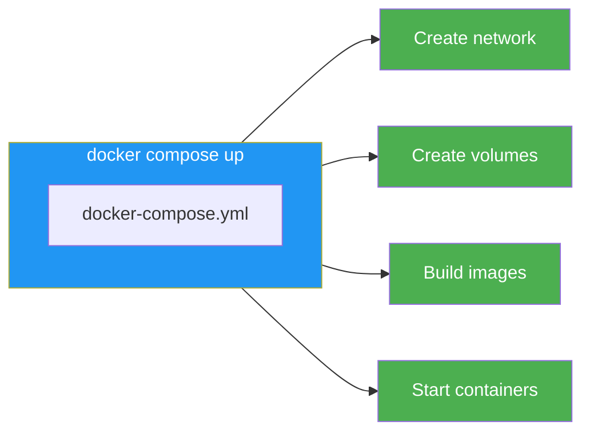
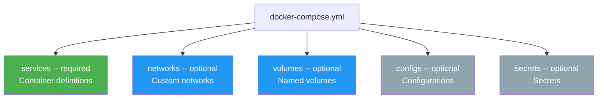
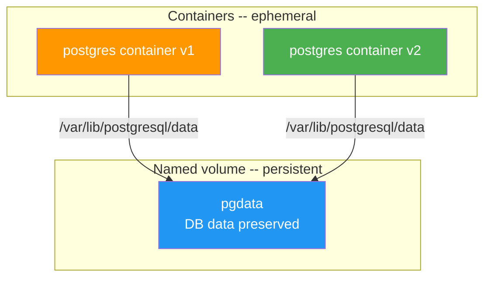
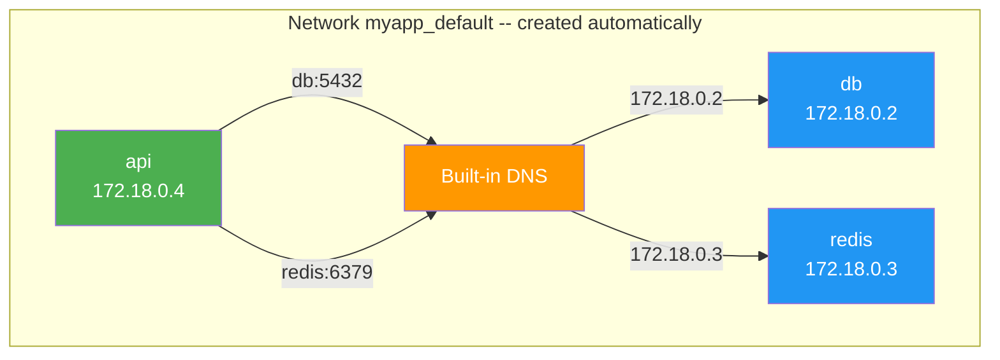

# Level 6: Docker Compose -- Basics

## Introduction

Imagine you're organizing a rock concert. You need a stage, sound equipment, lighting, a generator, security, and a ticket office. Each element is a separate unit with its own task. You could organize everything manually: call each contractor, explain where to arrive, what to bring, in what order to connect the equipment. But if you have a **rider** -- a single document describing everything needed -- you just hand it to the venue organizer, and everything happens automatically.

Docker Compose is that same "rider" for your application. Instead of a dozen manual `docker run` commands, you describe the entire infrastructure in a single YAML file: which services are needed, how they're connected, which ports to open, what data to save. One command -- and everything comes up. Another command -- and everything shuts down cleanly.

In this level, we will explore in detail:

1. **Why Docker Compose is needed** -- problems of manual management and how Compose solves them
2. **YAML format** -- configuration file syntax, pitfalls, and specifics
3. **Services** -- describing containers via `image` and `build`
4. **Ports, volumes, variables** -- all service configuration
5. **Networks** -- how services find each other
6. **Main commands** -- `up`, `down`, `logs`, `ps`, `exec`, and others
7. **Project name and variable substitution** -- environment management
8. **Common mistakes** -- what usually goes wrong for those starting with Compose

---

## 1. Why Docker Compose Is Needed

### The Problem: Manual Management of Multiple Containers

In previous levels, we launched containers one at a time using `docker run`. For educational examples with one container, this is enough. But a real application is almost always **multiple services**: web server, database, cache, message queue, workers.

Here's what launching a typical web application manually looks like:

```bash
# Step 1: create a network
docker network create myapp

# Step 2: start PostgreSQL
docker run -d --name db \
  --network myapp \
  -v pgdata:/var/lib/postgresql/data \
  -e POSTGRES_PASSWORD=secret \
  -e POSTGRES_DB=myapp \
  postgres:16

# Step 3: start Redis
docker run -d --name redis \
  --network myapp \
  redis:7-alpine

# Step 4: start backend
docker run -d --name api \
  --network myapp \
  -e DATABASE_URL=postgresql://postgres:secret@db:5432/myapp \
  -e REDIS_URL=redis://redis:6379 \
  -p 3000:3000 \
  my-api

# Step 5: start frontend
docker run -d --name web \
  --network myapp \
  -p 80:80 \
  my-frontend
```

Four containers -- and already 20 lines of commands that need to be executed in the right order. Now imagine real-world tasks:

- A colleague cloned the repository and wants to run the project. Do you hand them this set of commands? Where's the guarantee they won't make a typo?
- You need to update the database version. You stop the container, delete it, start with a new tag -- and did you remember all the flags?
- A CI/CD pipeline needs to set up a test environment. A 50-line bash script with `docker run`?
- Six months later you return to the project. How do you remember which environment variables each service needs?

These problems grow like a snowball. The more services, the harder manual management becomes. We need a tool that turns a set of commands into a **declarative description**.

### The Solution: Docker Compose

Docker Compose allows you to describe all of the above in a single YAML file:

```yaml
# docker-compose.yml
services:
  db:
    image: postgres:16
    volumes:
      - pgdata:/var/lib/postgresql/data
    environment:
      POSTGRES_PASSWORD: secret
      POSTGRES_DB: myapp

  redis:
    image: redis:7-alpine

  api:
    build: ./api
    ports:
      - '3000:3000'
    environment:
      DATABASE_URL: postgresql://postgres:secret@db:5432/myapp
      REDIS_URL: redis://redis:6379
    depends_on:
      - db
      - redis

  web:
    build: ./frontend
    ports:
      - '80:80'

volumes:
  pgdata:
```

Now one command replaces all five steps:

```bash
docker compose up -d
```

Docker Compose will read the file and automatically:
1. Create a network for the project
2. Create the named volume `pgdata`
3. Build images for `api` and `web` from Dockerfiles
4. Start all four containers in the correct order
5. Connect them to a shared network



### Imperative vs Declarative Approach

The difference between manual commands and Docker Compose is the difference between **imperative** and **declarative** approaches.

**Imperative approach** (manual commands) -- you describe **step by step** what to do:

> "Create a network. Start postgres container with these flags. Then start redis. Then start api..."

**Declarative approach** (Docker Compose) -- you describe the **desired result**:

> "I need four services with these settings. Figure out how to set it up yourself."

Life analogy: you come to a restaurant. Imperative approach -- going to the kitchen and explaining each step to the cook: "Take a pan, heat oil to 180 degrees, put the steak...". Declarative -- telling the waiter: "Steak medium rare, please." Same result, but the second method is more reliable because the cook knows their job better than you.

### Key Advantages of Compose

| Advantage | Without Compose | With Compose |
|---|---|---|
| Project launch | 10-20 commands in terminal | `docker compose up -d` |
| Handing to a colleague | README with instructions that go stale | `docker-compose.yml` in Git |
| Service update | Stop, delete, remember all flags | Change YAML, `docker compose up -d` |
| CI/CD | Bash script with `docker run` | The same `docker-compose.yml` |
| Network connectivity | Manual network creation, `--network` | Automatic network |
| Reproducibility | Depends on command order | File describes final state |

---

## 2. YAML -- Compose's Configuration Language

### YAML Syntax Basics

Docker Compose uses the YAML format (YAML Ain't Markup Language). If you've only worked with JSON before, YAML may seem unfamiliar. The main difference -- instead of curly braces and quotes, **indentation** and **line breaks** are used.

```yaml
# This is a comment -- YAML supports comments, JSON does not

# Scalar values
name: my-app
version: 3
enabled: true
description: null

# Dictionary (object) -- key-value via indentation
database:
  host: localhost
  port: 5432
  name: myapp

# List -- elements with dashes
ports:
  - '3000:3000'
  - '8080:80'

# Nested structures
services:
  api:
    image: node:20
    ports:
      - '3000:3000'
    environment:
      NODE_ENV: production
```

### Indentation -- Fundamentally Important

In YAML, indentation defines document structure. It's like in Python -- each nesting level is denoted by indentation. The standard indent is **2 spaces**.

```yaml
# ✅ Correct -- 2 spaces per level
services:
  api:
    image: node:20
    ports:
      - '3000:3000'
```

```yaml
# ❌ Tabs instead of spaces -- YAML doesn't allow them
services:
	api:
		image: node:20
```

```yaml
# ❌ Inconsistent indentation -- parser will get confused
services:
  api:
      image: node:20
    ports:
      - '3000:3000'
```

YAML parsers are extremely sensitive to indentation. An error of one space can cause a field to end up at the wrong nesting level, and Compose will interpret the configuration differently than you expected.

### Strings in YAML -- When Quotes Are Needed

In most cases, strings in YAML are written without quotes. But there are situations where quotes are **mandatory**:

```yaml
# Without quotes -- regular strings
image: postgres:16
hostname: my-server

# Single quotes -- "raw" string, no special character processing
ports:
  - '80:80'          # Required! Without quotes, YAML may interpret as a number
  - '127.0.0.1:3000:3000'

# Double quotes -- support escape sequences
environment:
  GREETING: "Hello\nWorld"   # \n becomes a line break

# When value starts with a special character
labels:
  description: "{api}"       # Quotes needed because of curly braces
```

Golden rule for Docker Compose: **always wrap `ports` values in single quotes**. This is the most common source of non-obvious errors.

### Multi-line Values

YAML supports multi-line strings, which is convenient for long commands:

```yaml
services:
  api:
    # | character -- preserves line breaks
    command: |
      sh -c "
        echo Waiting for database...
        sleep 5
        npm run migrate
        npm start
      "

    # > character -- joins lines into one
    labels:
      description: >
        This is a very long description
        that spans multiple lines
        but will be joined into one line
```

---

## 3. docker-compose.yml File Structure

### Root Sections

The `docker-compose.yml` file consists of several root sections. Only `services` is required -- the rest are used as needed.

```yaml
# Required section -- service definitions
services:
  web:
    image: nginx
  api:
    build: ./api

# Optional sections
networks:      # Custom networks
  frontend:
  backend:

volumes:       # Named volumes
  pgdata:
  redis-data:

configs:       # Configuration files
secrets:       # Secrets
```



### About the version Key -- It's No Longer Needed

In old tutorials and projects, you'll often see a `version` key at the beginning of the file:

```yaml
# ❌ Outdated format -- version is no longer needed
version: '3.8'
services:
  web:
    image: nginx
```

```yaml
# ✅ Modern format -- start directly with services
services:
  web:
    image: nginx
```

Docker Compose V2 automatically detects the file format. The `version` key is ignored and can be safely removed. If you see it in someone else's project -- don't worry, it doesn't affect anything.

---

## 4. Defining Services

The `services` section is the heart of `docker-compose.yml`. Each service describes one type of container. The service name (the key in YAML) becomes the container's DNS name within the Compose network.

### Using a Ready-Made Image -- image

The simplest way to define a service -- specify a ready-made image from a registry:

```yaml
services:
  # Image from Docker Hub with specific tag
  db:
    image: postgres:16

  # Alpine version -- minimal size
  redis:
    image: redis:7-alpine

  # Image from a private registry
  api:
    image: registry.company.com/my-api:v2.1.0

  # Image with digest -- absolute reproducibility
  nginx:
    image: nginx@sha256:abc123def456...
```

Tag selection rules:

- **For development**: use major version -- `postgres:16`, `node:20`
- **For production**: use exact version -- `postgres:16.2-alpine`, `node:20.11.1-slim`
- **Never**: use `latest` or no tag at all -- that's a path to unpredictable breakage

### Building from Dockerfile -- build

If you have your own application with a Dockerfile, use `build`:

```yaml
services:
  # Simple form -- Dockerfile in specified directory
  api:
    build: ./api
    # Equivalent: docker build ./api

  # Extended form -- full control over build
  web:
    build:
      context: ./frontend          # Directory with build files
      dockerfile: Dockerfile.prod  # Dockerfile name, if non-standard
      args:                        # Build arguments
        NODE_ENV: production
        API_URL: http://api:3000
      target: production           # Multi-stage: specific stage

  # Combination of build + image: builds AND tags
  backend:
    build: ./backend
    image: my-backend:latest
    # Builds image from ./backend and assigns tag my-backend:latest
```

When to use `image` vs `build`:

| Situation | What to use |
|---|---|
| Ready-made service (DB, cache, queue) | `image` |
| Your application with Dockerfile | `build` |
| Your own app, need tag for push | `build` + `image` |

### container_name -- Fixed Name

By default, Compose names containers by the pattern `<project>-<service>-<number>`. You can set a fixed name:

```yaml
services:
  db:
    image: postgres:16
    container_name: myapp-database
    # Instead of "myapp-db-1" the container will be named "myapp-database"
```

⚠️ **container_name is not recommended for production.** A fixed name prohibits scaling -- `docker compose up --scale db=2` won't work, because two containers can't have the same name. Use only in development when you need a predictable name for external scripts.

---

## 5. Port Forwarding -- ports and expose

### ports -- Publishing on the Host

The `ports` directive forwards a container port to the host machine, making the service accessible from outside:

```yaml
services:
  web:
    image: nginx
    ports:
      # Main format: "host:container"
      - '8080:80'

      # Bind to localhost only -- not accessible from network
      - '127.0.0.1:8080:80'

      # Port range
      - '8000-8010:8000-8010'

      # Container port only -- host port chosen randomly
      - '80'

      # UDP protocol
      - '5353:53/udp'
```

For complex cases, there's a long syntax -- it's more explicit and easier to read:

```yaml
services:
  api:
    build: ./api
    ports:
      - target: 3000          # Port inside container
        published: 3000       # Port on host
        protocol: tcp         # Protocol
        host_ip: 127.0.0.1    # Bind to interface
```


### expose -- Internal Ports

`expose` doesn't publish a port on the host. It serves as **documentation** -- showing which port a service listens on inside the network:

```yaml
services:
  api:
    build: ./api
    expose:
      - '3000'
    # Port 3000 NOT accessible from host
    # But other services in the Compose network see api:3000
```

In practice, `expose` is rarely used because services in a Compose network can see all each other's ports anyway. But for documenting intentions, it's useful: opening the file, a colleague immediately sees that `api` listens on port 3000.

### When to Use Which

```yaml
services:
  # Frontend -- needs browser access
  web:
    ports:
      - '80:80'        # ✅ ports -- publish on host

  # API -- needs browser access and from other services
  api:
    ports:
      - '3000:3000'    # ✅ ports -- publish on host

  # Database -- access only from api inside the network
  db:
    expose:
      - '5432'         # ✅ expose -- internal documentation only
    # DB should NOT be accessible from outside!
```

---

## 6. Volumes

Volumes solve the **persistence** problem: by default, all container data lives in the writable layer and disappears when the container is deleted. Volumes preserve data between restarts.

### Bind Mount -- Mounting a Host Folder

A bind mount links a directory on the host with a directory in the container. Changes are visible both ways -- you edit a file on the host, the container sees the change, and vice versa.

```yaml
services:
  web:
    image: nginx
    volumes:
      # Mount configuration (read-only)
      - ./nginx.conf:/etc/nginx/nginx.conf:ro

      # Mount source code for development
      - ./src:/app/src

      # Long syntax -- more explicit
      - type: bind
        source: ./data
        target: /app/data
        read_only: true
```

Bind mounts are indispensable for development: you edit code on the host in your favorite editor, and the container instantly sees the changes. But for production, bind mounts are rarely used -- there, named volumes or baking data directly into the image are preferred.

### Named Volumes

Named volumes are managed by Docker. They store data in a special Docker directory and survive container deletion:

```yaml
services:
  db:
    image: postgres:16
    volumes:
      - pgdata:/var/lib/postgresql/data

  redis:
    image: redis:7-alpine
    volumes:
      - redis-data:/data

# REQUIRED: volume declaration in root section
volumes:
  pgdata:
  redis-data:
    driver: local    # Storage driver, default local
```

Think of named volumes as a USB drive. The container is a computer. You plug the USB drive into the computer, work with data, then you can turn off the computer, throw it away, and buy a new one -- but the data on the USB drive remains. You plug the same drive into a new computer and continue working.



### Anonymous Volumes

Anonymous volumes are created by Docker with a random name. They're useful for one specific pattern -- excluding directories from bind mounts:

```yaml
services:
  api:
    build: ./api
    volumes:
      - ./api:/app              # All source code from host
      - /app/node_modules       # Don't overwrite node_modules from image
```

Without the anonymous volume for `node_modules`, the following would happen: the bind mount `./api:/app` would completely replace the contents of `/app` inside the container with the `./api` folder from the host. If the host doesn't have `node_modules` (or they're installed for a different OS), the application will break. The anonymous volume "protects" `/app/node_modules` from being overwritten.

### Volume Type Comparison

| Type | Syntax | Data stored | When to use |
|---|---|---|---|
| Bind mount | `./path:/container/path` | On host in specified folder | Development, config files |
| Named volume | `name:/container/path` | In Docker storage | DB data, cache, production |
| Anonymous volume | `/container/path` | In Docker storage, random name | Exclusion from bind mount |

---

## 7. Environment Variables -- environment and env_file

Environment variables are the main way to configure containers. This is a pattern from the [12-Factor App](https://12factor.net/) methodology: configuration is separated from code and passed through the environment.

### Inline Definition -- environment

Variables can be set directly in `docker-compose.yml` in two ways:

```yaml
services:
  api:
    build: ./api
    environment:
      # "Dictionary" format -- key: value
      NODE_ENV: production
      DATABASE_URL: postgresql://postgres:secret@db:5432/myapp
      REDIS_URL: redis://redis:6379

  worker:
    build: ./worker
    environment:
      # "List" format -- strings with =
      - NODE_ENV=production
      - QUEUE_NAME=emails
      - CONCURRENCY=5
```

Both formats are equivalent. The dictionary format reads slightly better, the list format is closer to `.env` file syntax.

### Variable Files -- env_file

When there are many variables or they contain secrets, it's better to move them to a separate file:

```yaml
services:
  api:
    build: ./api
    env_file:
      - .env            # Common variables
      - .env.local      # Local overrides

  db:
    image: postgres:16
    env_file:
      - ./db/.env       # DB-specific variables
```

`.env` file format:

```bash
# .env
NODE_ENV=production
DATABASE_URL=postgresql://postgres:secret@db:5432/myapp
SECRET_KEY=my-super-secret-key

# Empty lines and comments allowed
REDIS_URL=redis://redis:6379
```

### Automatic .env Loading

Docker Compose automatically loads the `.env` file from the directory where `docker-compose.yml` is located. Variables from this file are available for **substitution** within the YAML:

```bash
# .env (automatically loaded by Compose!)
API_VERSION=2.1.0
DB_PASSWORD=super-secret
COMPOSE_PROJECT_NAME=myapp
```

```yaml
# docker-compose.yml
services:
  api:
    image: my-api:${API_VERSION}
    # Will become my-api:2.1.0

  db:
    image: postgres:16
    environment:
      POSTGRES_PASSWORD: ${DB_PASSWORD}
      # Will become super-secret
```

This is an important distinction:
- **env_file** -- loads variables **inside the container**
- **.env file** in the root -- substitutes values **into the YAML file itself** during parsing

### Variable Substitution -- Syntax

Docker Compose supports several variable substitution forms:

```yaml
services:
  api:
    # Required variable -- error if not set
    image: my-api:${TAG}

    # Default value if variable is empty or not set
    image: my-api:${TAG:-latest}

    # Default value only if variable is not set
    image: my-api:${TAG-latest}

    # Error with message if variable is empty or not set
    image: my-api:${TAG:?TAG is required}

    # Error with message only if variable is not set
    image: my-api:${TAG?TAG must be set}
```

Priority order (highest to lowest):

1. Host environment variables (`export TAG=3.0`)
2. `.env` file in directory with `docker-compose.yml`
3. Default values `${VAR:-default}`

```bash
# .env
TAG=2.0

# Host variable overrides .env
TAG=3.0 docker compose up -d
# TAG=3.0 will be used
```

### Security -- Don't Commit Secrets

Key rule: **never store secrets in `docker-compose.yml`** that will go to Git.

```yaml
# ❌ Password directly in file that will be committed
services:
  db:
    environment:
      POSTGRES_PASSWORD: super-secret-password-123
```

```yaml
# ✅ Password via variable from .env, which is in .gitignore
services:
  db:
    environment:
      POSTGRES_PASSWORD: ${DB_PASSWORD}
```

Create a `.env.example` with a template of variables (without values) and add `.env` to `.gitignore`:

```bash
# .env.example -- committed to Git
DB_PASSWORD=
SECRET_KEY=
API_KEY=

# .env -- NOT committed, added to .gitignore
DB_PASSWORD=real-password-here
SECRET_KEY=actual-secret
API_KEY=production-key
```

---

## 8. Automatic Networking in Compose

### How Services Find Each Other

Docker Compose automatically creates a **bridge network** for each project and connects all services to it. Inside this network, each service is accessible by its **name** (key from YAML).

```yaml
services:
  api:
    build: ./api
    environment:
      # "db" is the service name, it works as a DNS name
      DATABASE_URL: postgresql://postgres:secret@db:5432/myapp
      # "redis" is also a service name
      REDIS_URL: redis://redis:6379

  db:
    image: postgres:16

  redis:
    image: redis:7-alpine
```

You **don't need** to create networks manually, specify `--network`, or write IP addresses. Docker's built-in DNS server resolves the service name to the container's IP address automatically.



### Checking Network Connectivity

```bash
docker compose up -d

# Check that the network was created
docker network ls
# NETWORK ID     NAME              DRIVER    SCOPE
# a1b2c3d4e5f6   myapp_default     bridge    local

# Check DNS from the api container
docker compose exec api ping db
# PING db (172.18.0.2): 56 data bytes
# 64 bytes from 172.18.0.2: seq=0 ttl=64 time=0.089 ms

# Check port connectivity
docker compose exec api nc -zv db 5432
# db (172.18.0.2:5432) open
```

### Custom Networks

For complex projects, you can create multiple networks to **isolate** services from each other. For example, frontend shouldn't have direct access to the database:

```yaml
services:
  web:
    build: ./frontend
    networks:
      - frontend

  api:
    build: ./api
    networks:
      - frontend      # Sees web
      - backend       # Sees db and redis

  db:
    image: postgres:16
    networks:
      - backend

  redis:
    image: redis:7-alpine
    networks:
      - backend

networks:
  frontend:
  backend:
```

In this setup:
- **web** reaches **api** (both in frontend)
- **api** reaches **db** and **redis** (all in backend)
- **web** does NOT reach **db** (isolation between networks)

---

## 9. Main Compose Commands

### docker compose up

The main command -- starts all services defined in the compose file:

```bash
# Start in foreground -- logs visible, terminal busy
docker compose up

# Start in background (detached) -- terminal free
docker compose up -d

# Build images before starting
docker compose up -d --build

# Start specific services only
docker compose up -d db redis

# Force recreate even if config hasn't changed
docker compose up -d --force-recreate

# Start without recreating existing containers
docker compose up -d --no-recreate
```

### docker compose down

Stops and removes all containers, networks, and (optionally) volumes:

```bash
# Stop and remove containers + networks
docker compose down

# Also remove volumes
docker compose down -v

# Also remove images built by Compose
docker compose down --rmi local

# Stop and remove everything, including volumes and images
docker compose down -v --rmi all
```

### docker compose logs

```bash
# Logs of all services -- each colored differently
docker compose logs

# api     | Server started on port 3000
# db      | PostgreSQL ready
# redis   | Ready to accept connections

# Logs of a specific service
docker compose logs api

# Multiple services at once
docker compose logs api worker

# Follow in real time for all
docker compose logs -f

# Last 50 lines of each service + follow
docker compose logs -f --tail 50

# With timestamps
docker compose logs -t api

# Without color (for redirecting to file)
docker compose logs --no-color > all-logs.txt
```

### docker compose ps

```bash
# Status of all services
docker compose ps

# Quiet mode -- only container IDs
docker compose ps -q

# JSON format
docker compose ps --format json
```

### docker compose exec

Run commands inside running services:

```bash
# Open shell in the api service
docker compose exec api bash

# Run a single command
docker compose exec db pg_isready -U postgres

# Run as a specific user
docker compose exec -u root api bash

# With environment variable
docker compose exec -e DEBUG=true api node debug.js
```

### docker compose restart

```bash
# Restart all services
docker compose restart

# Restart specific service
docker compose restart api

# Restart with timeout
docker compose restart --timeout 30
```

---

## 10. Project Name and Variable Substitution

### Project Name

By default, Compose uses the directory name as the project name. This becomes the prefix for all container names, networks, and volumes:

```bash
# In directory /projects/myapp/
docker compose up -d
# Creates containers: myapp-db-1, myapp-api-1, myapp-web-1
# Creates network: myapp_default

# Override project name
docker compose --project-name production up -d
# Creates containers: production-db-1, production-api-1
```

### Variable Substitution in YAML

Compose supports powerful variable substitution in the YAML file itself:

```yaml
services:
  api:
    image: my-app:${TAG:-latest}
    ports:
      - '${API_PORT:-3000}:3000'
```

Variables are taken from:
1. Shell environment
2. `.env` file
3. Default values in `${VAR:-default}` syntax

---

## Common Beginner Mistakes

### 1. Not Quoting Port Values

```yaml
# ❌ Without quotes, YAML may interpret as number or octal
ports:
  - 80:80

# ✅ Always quote port mappings
ports:
  - '80:80'
```

### 2. Forgetting the volumes Root Section

```yaml
# ❌ Missing volumes declaration
services:
  db:
    image: postgres:16
    volumes:
      - pgdata:/var/lib/postgresql/data
# Error: volume "pgdata" not found

# ✅ Must declare volumes in root
services:
  db:
    volumes:
      - pgdata:/var/lib/postgresql/data
volumes:
  pgdata:
```

### 3. Using Tabs Instead of Spaces in YAML

```yaml
# ❌ Tabs cause parsing errors
services:
	api:
		image: node:20

# ✅ Use 2 spaces
services:
  api:
    image: node:20
```

### 4. Expecting Services to Start in Order

```yaml
# ❌ Compose starts all services in parallel
services:
  db:
    image: postgres:16
  api:
    build: ./api
    # api may start before db is ready!
```

Use `depends_on` (covered in the advanced level) to control startup order.

---

## Summary

Docker Compose replaces dozens of manual `docker run` commands with a single declarative YAML file. One command (`docker compose up -d`) starts the entire infrastructure.

Key concepts:
- **services** -- container definitions, the only required section
- **networks** -- custom networks for isolation (auto-created if not specified)
- **volumes** -- persistent storage (must be declared in root section)
- **ports** -- publish on host (always quote values!)
- **environment** / **env_file** -- configuration via environment variables
- **build** / **image** -- build from Dockerfile or use ready-made image

Main commands:
- `docker compose up -d` -- start all services
- `docker compose down` -- stop and remove
- `docker compose logs -f` -- follow logs
- `docker compose exec <service> bash` -- shell inside service
- `docker compose ps` -- service status
