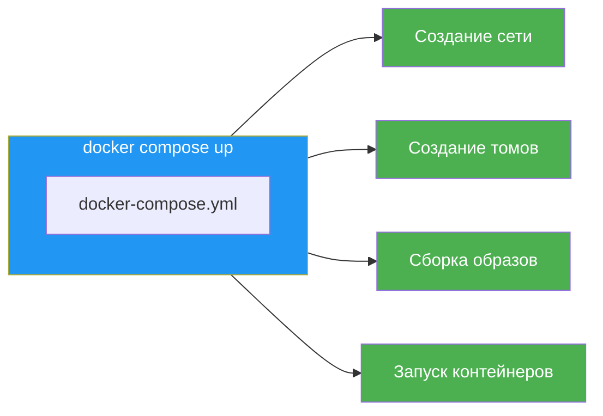
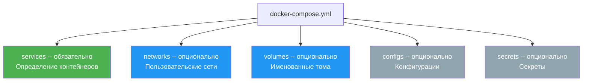
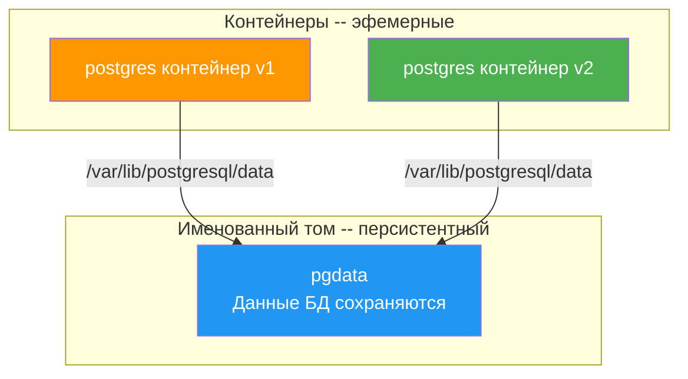
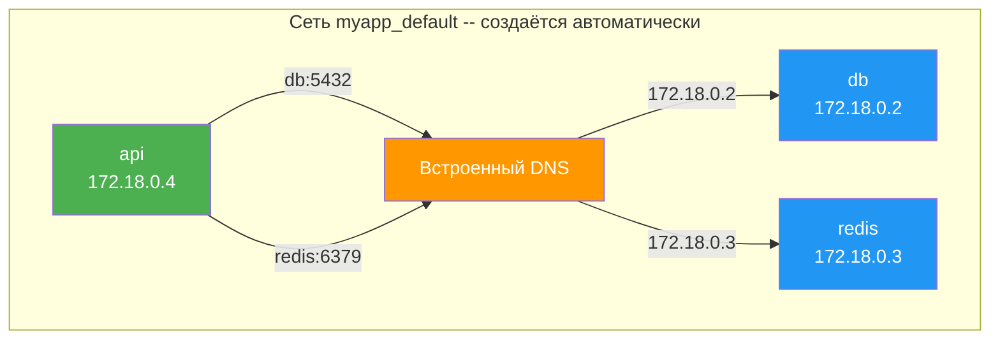
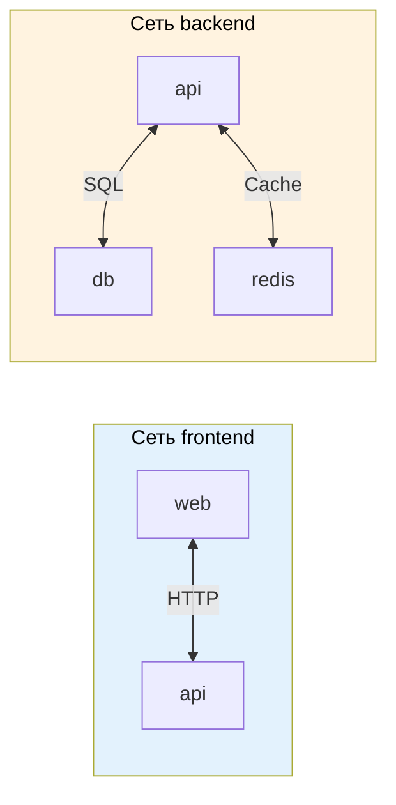

# Уровень 6: Docker Compose -- основы

## Введение

Представьте, что вы организуете рок-концерт. Вам нужна сцена, звуковое оборудование, свет, генератор, охрана и билетная касса. Каждый элемент -- это отдельная единица со своей задачей. Можно всё организовать вручную: позвонить каждому подрядчику, объяснить, куда приехать, что привезти, в каком порядке подключить оборудование. Но если у вас есть **райдер** -- единый документ, в котором описано всё необходимое, -- вы просто передаёте его организатору площадки, и всё происходит автоматически.

Docker Compose -- это тот самый "райдер" для вашего приложения. Вместо десятка ручных команд `docker run` вы описываете всю инфраструктуру в одном YAML-файле: какие сервисы нужны, как они связаны между собой, какие порты открыть, какие данные сохранить. Одна команда -- и всё поднимается. Ещё одна команда -- и всё аккуратно останавливается.

На этом уровне мы подробно разберём:

1. **Зачем нужен Docker Compose** -- проблемы ручного управления и как Compose их решает
2. **YAML-формат** -- синтаксис файла конфигурации, подводные камни и особенности
3. **Сервисы** -- описание контейнеров через `image` и `build`
4. **Порты, тома, переменные** -- вся конфигурация сервисов
5. **Сети** -- как сервисы находят друг друга
6. **Основные команды** -- `up`, `down`, `logs`, `ps`, `exec` и другие
7. **Имя проекта и подстановка переменных** -- управление окружением
8. **Типичные ошибки** -- что обычно идёт не так у тех, кто начинает работать с Compose

---

## 1. Зачем нужен Docker Compose

### Проблема: ручное управление несколькими контейнерами

В предыдущих уровнях мы запускали контейнеры по одному с помощью `docker run`. Для учебных примеров с одним контейнером этого достаточно. Но реальное приложение -- это почти всегда **несколько сервисов**: веб-сервер, база данных, кэш, очередь сообщений, воркеры.

Вот как выглядит запуск типичного веб-приложения вручную:

```bash
# Шаг 1: создаём сеть
docker network create myapp

# Шаг 2: запускаем PostgreSQL
docker run -d --name db \
  --network myapp \
  -v pgdata:/var/lib/postgresql/data \
  -e POSTGRES_PASSWORD=secret \
  -e POSTGRES_DB=myapp \
  postgres:16

# Шаг 3: запускаем Redis
docker run -d --name redis \
  --network myapp \
  redis:7-alpine

# Шаг 4: запускаем backend
docker run -d --name api \
  --network myapp \
  -e DATABASE_URL=postgresql://postgres:secret@db:5432/myapp \
  -e REDIS_URL=redis://redis:6379 \
  -p 3000:3000 \
  my-api

# Шаг 5: запускаем frontend
docker run -d --name web \
  --network myapp \
  -p 80:80 \
  my-frontend
```

Четыре контейнера -- и уже 20 строк команд, которые нужно выполнить в правильном порядке. Теперь представьте реальные задачи:

- Коллега клонировал репозиторий и хочет запустить проект. Вы передаёте ему этот набор команд? Где гарантия, что он не опечатается?
- Нужно обновить версию базы данных. Вы останавливаете контейнер, удаляете его, запускаете с новым тегом -- и не забыли ли вы все флаги?
- CI/CD-пайплайн должен поднять тестовое окружение. Скрипт на 50 строк bash с `docker run`?
- Через полгода вы вернулись к проекту. Как вспомнить, какие переменные окружения нужны каждому сервису?

Эти проблемы нарастают как снежный ком. Чем больше сервисов, тем сложнее ручное управление. Нужен инструмент, который превращает набор команд в **декларативное описание**.

### Решение: Docker Compose

Docker Compose позволяет описать всё вышеперечисленное в одном YAML-файле:

```yaml
# docker-compose.yml
services:
  db:
    image: postgres:16
    volumes:
      - pgdata:/var/lib/postgresql/data
    environment:
      POSTGRES_PASSWORD: secret
      POSTGRES_DB: myapp

  redis:
    image: redis:7-alpine

  api:
    build: ./api
    ports:
      - '3000:3000'
    environment:
      DATABASE_URL: postgresql://postgres:secret@db:5432/myapp
      REDIS_URL: redis://redis:6379
    depends_on:
      - db
      - redis

  web:
    build: ./frontend
    ports:
      - '80:80'

volumes:
  pgdata:
```

Теперь одна команда заменяет все пять шагов:

```bash
docker compose up -d
```

Docker Compose прочитает файл и автоматически:
1. Создаст сеть для проекта
2. Создаст именованный том `pgdata`
3. Соберёт образы для `api` и `web` из Dockerfile
4. Запустит все четыре контейнера в правильном порядке
5. Подключит их к общей сети



### Императивный vs декларативный подход

Разница между ручными командами и Docker Compose -- это разница между **императивным** и **декларативным** подходом.

**Императивный подход** (ручные команды) -- вы описываете **пошагово**, что делать:

> "Создай сеть. Запусти контейнер postgres с такими-то флагами. Потом запусти redis. Потом запусти api..."

**Декларативный подход** (Docker Compose) -- вы описываете **желаемый результат**:

> "Мне нужны четыре сервиса с такими настройками. Разберись сам, как это поднять."

Аналогия из жизни: вы приходите в ресторан. Императивный подход -- это пойти на кухню и объяснять повару каждый шаг: "Возьми сковороду, нагрей масло до 180 градусов, положи стейк...". Декларативный -- это сказать официанту: "Стейк medium rare, пожалуйста". Результат один, но второй способ надёжнее, потому что повар знает свою работу лучше вас.

### Ключевые преимущества Compose

| Преимущество | Без Compose | С Compose |
|---|---|---|
| Запуск проекта | 10-20 команд в терминале | `docker compose up -d` |
| Передача коллеге | README с инструкциями, которые устаревают | `docker-compose.yml` в Git |
| Обновление сервиса | Остановить, удалить, вспомнить все флаги | Изменить YAML, `docker compose up -d` |
| CI/CD | Bash-скрипт с `docker run` | Тот же `docker-compose.yml` |
| Сетевая связность | Ручное создание сети, `--network` | Автоматическая сеть |
| Воспроизводимость | Зависит от порядка команд | Файл описывает конечное состояние |

---

## 2. YAML -- язык конфигурации Compose

### Основы YAML-синтаксиса

Docker Compose использует формат YAML (YAML Ain't Markup Language). Если вы раньше работали только с JSON, YAML может показаться непривычным. Главное отличие -- вместо фигурных скобок и кавычек используются **отступы** и **переносы строк**.

```yaml
# Это комментарий -- YAML поддерживает комментарии, JSON -- нет

# Скалярные значения
name: my-app
version: 3
enabled: true
description: null

# Словарь (объект) -- ключ-значение через отступы
database:
  host: localhost
  port: 5432
  name: myapp

# Список -- элементы с дефисом
ports:
  - '3000:3000'
  - '8080:80'

# Вложенные структуры
services:
  api:
    image: node:20
    ports:
      - '3000:3000'
    environment:
      NODE_ENV: production
```

### Отступы -- фундаментально важно

В YAML отступы определяют структуру документа. Это как в Python -- каждый уровень вложенности обозначается отступом. Стандартный отступ -- **2 пробела**.

```yaml
# ✅ Правильно -- 2 пробела на уровень
services:
  api:
    image: node:20
    ports:
      - '3000:3000'
```

```yaml
# ❌ Табы вместо пробелов -- YAML их не допускает
services:
	api:
		image: node:20
```

```yaml
# ❌ Непоследовательные отступы -- парсер запутается
services:
  api:
      image: node:20
    ports:
      - '3000:3000'
```

YAML-парсер крайне чувствителен к отступам. Ошибка в один пробел может привести к тому, что поле окажется на неправильном уровне вложенности, и Compose интерпретирует конфигурацию не так, как вы ожидали.

### Строки в YAML -- когда нужны кавычки

В большинстве случаев строки в YAML пишутся без кавычек. Но есть ситуации, когда кавычки **обязательны**:

```yaml
# Без кавычек -- обычные строки
image: postgres:16
hostname: my-server

# Одинарные кавычки -- "сырая" строка, без обработки спецсимволов
ports:
  - '80:80'          # Обязательно! Без кавычек YAML может интерпретировать как число
  - '127.0.0.1:3000:3000'

# Двойные кавычки -- поддерживают escape-последовательности
environment:
  GREETING: "Hello\nWorld"   # \n превратится в перенос строки

# Когда значение начинается со спецсимвола
labels:
  description: "{api}"       # Кавычки нужны из-за фигурных скобок
```

Золотое правило для Docker Compose: **всегда оборачивайте значения `ports` в одинарные кавычки**. Это самый частый источник неочевидных ошибок.

### Многострочные значения

YAML поддерживает многострочные строки, что удобно для длинных команд:

```yaml
services:
  api:
    # Символ | -- сохраняет переносы строк
    command: |
      sh -c "
        echo Waiting for database...
        sleep 5
        npm run migrate
        npm start
      "

    # Символ > -- склеивает строки в одну
    labels:
      description: >
        This is a very long description
        that spans multiple lines
        but will be joined into one line
```

---

## 3. Структура файла docker-compose.yml

### Корневые секции

Файл `docker-compose.yml` состоит из нескольких корневых секций. Только `services` является обязательной -- остальные используются по необходимости.

```yaml
# Обязательная секция -- определение сервисов
services:
  web:
    image: nginx
  api:
    build: ./api

# Опциональные секции
networks:      # Пользовательские сети
  frontend:
  backend:

volumes:       # Именованные тома
  pgdata:
  redis-data:

configs:       # Конфигурационные файлы
secrets:       # Секреты
```



### О ключе version -- он больше не нужен

В старых туториалах и проектах вы часто увидите ключ `version` в начале файла:

```yaml
# ❌ Устаревший формат -- version больше не нужен
version: '3.8'
services:
  web:
    image: nginx
```

```yaml
# ✅ Современный формат -- сразу начинаем с services
services:
  web:
    image: nginx
```

Docker Compose V2 автоматически определяет формат файла. Ключ `version` игнорируется и может быть безопасно удалён. Если вы видите его в чужом проекте -- не пугайтесь, он ни на что не влияет.

---

## 4. Определение сервисов

Секция `services` -- сердце `docker-compose.yml`. Каждый сервис описывает один тип контейнера. Имя сервиса (ключ в YAML) становится DNS-именем контейнера внутри сети Compose.

### Использование готового образа -- image

Самый простой способ определить сервис -- указать готовый образ из реестра:

```yaml
services:
  # Образ из Docker Hub с конкретным тегом
  db:
    image: postgres:16

  # Alpine-версия -- минимальный размер
  redis:
    image: redis:7-alpine

  # Образ из приватного реестра
  api:
    image: registry.company.com/my-api:v2.1.0

  # Образ с digest -- абсолютная воспроизводимость
  nginx:
    image: nginx@sha256:abc123def456...
```

Правила выбора тега:

- **Для разработки**: используйте мажорную версию -- `postgres:16`, `node:20`
- **Для production**: используйте точную версию -- `postgres:16.2-alpine`, `node:20.11.1-slim`
- **Никогда**: не используйте `latest` или вообще без тега -- это путь к непредсказуемым поломкам

### Сборка из Dockerfile -- build

Если у вас собственное приложение с Dockerfile, используйте `build`:

```yaml
services:
  # Простая форма -- Dockerfile в указанной директории
  api:
    build: ./api
    # Эквивалент: docker build ./api

  # Расширенная форма -- полный контроль над сборкой
  web:
    build:
      context: ./frontend          # Директория с файлами для сборки
      dockerfile: Dockerfile.prod  # Имя Dockerfile, если нестандартное
      args:                        # Build arguments
        NODE_ENV: production
        API_URL: http://api:3000
      target: production           # Multi-stage: конкретный этап

  # Комбинация build + image: собирает И тегирует
  backend:
    build: ./backend
    image: my-backend:latest
    # Собирает образ из ./backend и присваивает тег my-backend:latest
```

Когда использовать `image`, а когда `build`?

| Ситуация | Что использовать |
|---|---|
| Готовый сервис (БД, кэш, очередь) | `image` |
| Ваше приложение с Dockerfile | `build` |
| Своё приложение, нужен тег для push | `build` + `image` |

### container_name -- фиксированное имя

По умолчанию Compose называет контейнеры по схеме `<проект>-<сервис>-<номер>`. Можно задать фиксированное имя:

```yaml
services:
  db:
    image: postgres:16
    container_name: myapp-database
    # Вместо "myapp-db-1" контейнер будет называться "myapp-database"
```

⚠️ **container_name не рекомендуется для production.** Фиксированное имя запрещает масштабирование -- `docker compose up --scale db=2` не сработает, потому что два контейнера не могут иметь одно имя. Используйте только в разработке, когда нужно предсказуемое имя для внешних скриптов.

---

## 5. Проброс портов -- ports и expose

### ports -- публикация на хосте

Директива `ports` пробрасывает порт контейнера на хост-машину, делая сервис доступным извне:

```yaml
services:
  web:
    image: nginx
    ports:
      # Основной формат: "хост:контейнер"
      - '8080:80'

      # Привязка только к localhost -- недоступен из сети
      - '127.0.0.1:8080:80'

      # Диапазон портов
      - '8000-8010:8000-8010'

      # Только контейнерный порт -- хост-порт выберется случайно
      - '80'

      # UDP-протокол
      - '5353:53/udp'
```

Для сложных случаев есть длинный синтаксис -- он более явный и лучше читается:

```yaml
services:
  api:
    build: ./api
    ports:
      - target: 3000          # Порт внутри контейнера
        published: 3000       # Порт на хосте
        protocol: tcp         # Протокол
        host_ip: 127.0.0.1    # Привязка к интерфейсу
```


### expose -- внутренние порты

`expose` не публикует порт на хосте. Он служит **документацией** -- показывает, на каком порту работает сервис внутри сети:

```yaml
services:
  api:
    build: ./api
    expose:
      - '3000'
    # Порт 3000 НЕ доступен с хоста
    # Но другие сервисы в сети Compose видят api:3000
```

На практике `expose` используется редко, потому что сервисы в сети Compose и так видят все порты друг друга. Но для документирования намерений он полезен: открыв файл, коллега сразу видит, что `api` слушает на порту 3000.

### Когда что использовать

```yaml
services:
  # Frontend -- нужен доступ из браузера
  web:
    ports:
      - '80:80'        # ✅ ports -- публикуем на хост

  # API -- нужен доступ из браузера и от других сервисов
  api:
    ports:
      - '3000:3000'    # ✅ ports -- публикуем на хост

  # База данных -- доступ только от api внутри сети
  db:
    expose:
      - '5432'         # ✅ expose -- только внутренняя документация
    # БД НЕ должна быть доступна извне!
```

---

## 6. Тома -- volumes

Тома решают проблему **персистентности**: по умолчанию все данные контейнера живут в writable layer и исчезают при удалении контейнера. Тома позволяют сохранять данные между перезапусками.

### Bind mount -- монтирование папки хоста

Bind mount связывает директорию на хосте с директорией в контейнере. Изменения видны в обе стороны -- редактируете файл на хосте, контейнер видит изменение, и наоборот.

```yaml
services:
  web:
    image: nginx
    volumes:
      # Монтирование конфигурации (read-only)
      - ./nginx.conf:/etc/nginx/nginx.conf:ro

      # Монтирование исходного кода для разработки
      - ./src:/app/src

      # Длинный синтаксис -- более явный
      - type: bind
        source: ./data
        target: /app/data
        read_only: true
```

Bind mount незаменим для разработки: вы редактируете код на хосте в любимом редакторе, а контейнер мгновенно видит изменения. Но для production bind mount используется редко -- там предпочитают именованные тома или bake данные прямо в образ.

### Named volumes -- именованные тома

Именованные тома управляются Docker. Они хранят данные в специальной директории Docker и переживают удаление контейнеров:

```yaml
services:
  db:
    image: postgres:16
    volumes:
      - pgdata:/var/lib/postgresql/data

  redis:
    image: redis:7-alpine
    volumes:
      - redis-data:/data

# ОБЯЗАТЕЛЬНО: объявление томов в корневой секции
volumes:
  pgdata:
  redis-data:
    driver: local    # Драйвер хранения, по умолчанию local
```

Думайте об именованных томах как о USB-флешке. Контейнер -- это компьютер. Вы подключаете флешку к компьютеру, работаете с данными, потом можете выключить компьютер, выбросить его и купить новый -- но данные на флешке останутся. Вы подключаете ту же флешку к новому компьютеру и продолжаете работу.



### Анонимные тома

Анонимные тома создаются Docker со случайным именем. Они полезны для одного конкретного паттерна -- исключения директорий из bind mount:

```yaml
services:
  api:
    build: ./api
    volumes:
      - ./api:/app              # Весь исходный код с хоста
      - /app/node_modules       # НЕ перезаписывать node_modules из образа
```

Без анонимного тома для `node_modules` произошло бы следующее: bind mount `./api:/app` полностью перезаписал бы содержимое `/app` внутри контейнера содержимым папки `./api` с хоста. Если на хосте нет `node_modules` (или они установлены для другой ОС), приложение сломается. Анонимный том "защищает" `/app/node_modules` от перезаписи.

### Сравнение типов томов

| Тип | Синтаксис | Данные хранятся | Когда использовать |
|---|---|---|---|
| Bind mount | `./path:/container/path` | На хосте в указанной папке | Разработка, конфиг-файлы |
| Named volume | `name:/container/path` | В хранилище Docker | Данные БД, кэш, production |
| Anonymous volume | `/container/path` | В хранилище Docker, случайное имя | Исключение из bind mount |

---

## 7. Переменные окружения -- environment и env_file

Переменные окружения -- основной способ конфигурации контейнеров. Это паттерн из методологии [12-Factor App](https://12factor.net/): конфигурация отделяется от кода и передаётся через окружение.

### Inline-определение -- environment

Переменные можно задать прямо в `docker-compose.yml` двумя способами:

```yaml
services:
  api:
    build: ./api
    environment:
      # Формат "словарь" -- ключ: значение
      NODE_ENV: production
      DATABASE_URL: postgresql://postgres:secret@db:5432/myapp
      REDIS_URL: redis://redis:6379

  worker:
    build: ./worker
    environment:
      # Формат "список" -- строки с =
      - NODE_ENV=production
      - QUEUE_NAME=emails
      - CONCURRENCY=5
```

Оба формата эквивалентны. Формат словаря читается чуть лучше, формат списка ближе к синтаксису `.env` файлов.

### Файлы переменных -- env_file

Когда переменных много или они содержат секреты, лучше вынести их в отдельный файл:

```yaml
services:
  api:
    build: ./api
    env_file:
      - .env            # Общие переменные
      - .env.local      # Локальные переопределения

  db:
    image: postgres:16
    env_file:
      - ./db/.env       # Переменные специфичные для БД
```

Формат `.env` файла:

```bash
# .env
NODE_ENV=production
DATABASE_URL=postgresql://postgres:secret@db:5432/myapp
SECRET_KEY=my-super-secret-key

# Пустые строки и комментарии допускаются
REDIS_URL=redis://redis:6379
```

### Автоматическая загрузка .env

Docker Compose автоматически загружает файл `.env` из директории, где лежит `docker-compose.yml`. Переменные из этого файла доступны для **подстановки** внутри YAML:

```bash
# .env (автоматически загружается Compose!)
API_VERSION=2.1.0
DB_PASSWORD=super-secret
COMPOSE_PROJECT_NAME=myapp
```

```yaml
# docker-compose.yml
services:
  api:
    image: my-api:${API_VERSION}
    # Подставится my-api:2.1.0

  db:
    image: postgres:16
    environment:
      POSTGRES_PASSWORD: ${DB_PASSWORD}
      # Подставится super-secret
```

Это важное разделение:
- **env_file** -- загружает переменные **внутрь контейнера**
- **Файл .env** в корне -- подставляет значения **в сам YAML-файл** при парсинге

### Подстановка переменных -- синтаксис

Docker Compose поддерживает несколько форм подстановки переменных:

```yaml
services:
  api:
    # Обязательная переменная -- ошибка, если не задана
    image: my-api:${TAG}

    # Значение по умолчанию, если переменная пуста или не задана
    image: my-api:${TAG:-latest}

    # Значение по умолчанию, только если переменная не задана
    image: my-api:${TAG-latest}

    # Ошибка с сообщением, если переменная пуста или не задана
    image: my-api:${TAG:?TAG is required}

    # Ошибка с сообщением, только если переменная не задана
    image: my-api:${TAG?TAG must be set}
```

Порядок приоритета (от высшего к низшему):

1. Переменные окружения хоста (`export TAG=3.0`)
2. Файл `.env` в директории с `docker-compose.yml`
3. Значения по умолчанию `${VAR:-default}`

```bash
# .env
TAG=2.0

# Переменная хоста перебьёт .env
TAG=3.0 docker compose up -d
# Будет использован TAG=3.0
```

### Безопасность -- не коммитьте секреты

Ключевое правило: **никогда не храните секреты в `docker-compose.yml`**, который попадёт в Git.

```yaml
# ❌ Пароль прямо в файле, который закоммитится
services:
  db:
    environment:
      POSTGRES_PASSWORD: super-secret-password-123
```

```yaml
# ✅ Пароль через переменную из .env, который в .gitignore
services:
  db:
    environment:
      POSTGRES_PASSWORD: ${DB_PASSWORD}
```

Создайте `.env.example` с шаблоном переменных (без значений) и добавьте `.env` в `.gitignore`:

```bash
# .env.example -- коммитится в Git
DB_PASSWORD=
SECRET_KEY=
API_KEY=

# .env -- НЕ коммитится, добавлен в .gitignore
DB_PASSWORD=real-password-here
SECRET_KEY=actual-secret
API_KEY=production-key
```

---

## 8. Автоматическая сеть в Compose

### Как сервисы находят друг друга

Docker Compose автоматически создаёт **bridge-сеть** для каждого проекта и подключает к ней все сервисы. Внутри этой сети каждый сервис доступен по своему **имени** (ключу из YAML).

```yaml
services:
  api:
    build: ./api
    environment:
      # "db" -- это имя сервиса, оно работает как DNS-имя
      DATABASE_URL: postgresql://postgres:secret@db:5432/myapp
      # "redis" -- тоже имя сервиса
      REDIS_URL: redis://redis:6379

  db:
    image: postgres:16

  redis:
    image: redis:7-alpine
```

Вам **не нужно** создавать сети вручную, указывать `--network` или прописывать IP-адреса. Docker встроенный DNS-сервер резолвит имя сервиса в IP-адрес контейнера автоматически.



### Проверка сетевой связности

```bash
docker compose up -d

# Проверяем, что сеть создана
docker network ls
# NETWORK ID     NAME              DRIVER    SCOPE
# a1b2c3d4e5f6   myapp_default     bridge    local

# Проверяем DNS из контейнера api
docker compose exec api ping db
# PING db (172.18.0.2): 56 data bytes
# 64 bytes from 172.18.0.2: seq=0 ttl=64 time=0.089 ms

# Проверяем подключение к порту
docker compose exec api nc -zv db 5432
# db (172.18.0.2:5432) open
```

### Пользовательские сети

Для сложных проектов можно создать несколько сетей, чтобы **изолировать** сервисы друг от друга. Например, frontend не должен иметь прямого доступа к базе данных:

```yaml
services:
  web:
    build: ./frontend
    networks:
      - frontend

  api:
    build: ./api
    networks:
      - frontend      # Видит web
      - backend       # Видит db и redis

  db:
    image: postgres:16
    networks:
      - backend       # Не видит web

  redis:
    image: redis:7-alpine
    networks:
      - backend

networks:
  frontend:
  backend:
```



В этой конфигурации `web` может обращаться к `api`, но не может подключиться напрямую к `db` или `redis` -- они находятся в разных сетях. Это важный принцип безопасности: **минимум привилегий**.

---

## 9. Основные команды Docker Compose

### docker compose up -- запуск

Главная команда, которая поднимает весь проект:

```bash
# Запустить все сервисы (foreground -- логи в терминал)
docker compose up

# Запустить в фоне (основной режим для работы)
docker compose up -d

# Запустить конкретные сервисы и их зависимости
docker compose up -d api db

# Пересобрать образы перед запуском
docker compose up -d --build

# Пересоздать контейнеры, даже если конфигурация не менялась
docker compose up -d --force-recreate

# Использовать другой compose-файл
docker compose -f docker-compose.prod.yml up -d
```

Что происходит при `docker compose up`:

```mermaid
flowchart LR
    start["docker compose up -d"]
    start --> parse["Парсинг docker-compose.yml"]
    parse --> net["Создание сети проекта"]
    net --> vol["Создание именованных томов"]
    vol --> build["Сборка образов -- если указан build"]
    build --> pull["Скачивание образов -- если указан image"]
    pull --> create["Создание контейнеров"]
    create --> run["Запуск контейнеров"]
    run --> done["Все сервисы работают"]

    style start fill:#4CAF50,color:#fff
    style done fill:#4CAF50,color:#fff
```



Compose достаточно умён, чтобы не делать лишнюю работу. Если вы запускаете `docker compose up -d` повторно и конфигурация не изменилась -- контейнеры не будут пересозданы. Если изменился только один сервис -- пересоздастся только он.

### docker compose down -- остановка

```bash
# Остановить и удалить контейнеры + сети
docker compose down

# Также удалить именованные тома -- ОСТОРОЖНО!
docker compose down -v

# Также удалить образы
docker compose down --rmi all

# Удалить только локально собранные образы
docker compose down --rmi local
```

Критически важно понимать разницу:

| Команда | Удаляет контейнеры | Удаляет сети | Удаляет тома | Удаляет образы |
|---|---|---|---|---|
| `docker compose down` | Да | Да | Нет | Нет |
| `docker compose down -v` | Да | Да | **Да** | Нет |
| `docker compose down --rmi all` | Да | Да | Нет | **Да** |

⚠️ **`docker compose down -v` уничтожает данные в именованных томах безвозвратно.** Если в томе хранилась база данных -- она будет потеряна. Используйте `-v` только когда вы точно хотите начать с чистого листа.

### docker compose logs -- просмотр логов

```bash
# Логи всех сервисов
docker compose logs

# Логи конкретного сервиса
docker compose logs api

# Следить за логами в реальном времени -- аналог tail -f
docker compose logs -f

# Последние N строк
docker compose logs --tail 50

# Логи с временными метками
docker compose logs -t

# Комбинирование: последние 20 строк api + follow
docker compose logs -f --tail 20 api

# Логи нескольких сервисов
docker compose logs -f api db
```

Типичный workflow при отладке:
1. `docker compose logs --tail 50 api` -- посмотреть последние строки
2. `docker compose logs -f api` -- следить за новыми сообщениями
3. `docker compose logs -t api | grep ERROR` -- искать ошибки с временными метками

### docker compose ps -- статус сервисов

```bash
docker compose ps

# Вывод:
# NAME          SERVICE   STATUS    PORTS
# myapp-api-1   api       running   0.0.0.0:3000->3000/tcp
# myapp-db-1    db        running   5432/tcp
# myapp-web-1   web       running   0.0.0.0:80->80/tcp
# myapp-redis-1 redis     running   6379/tcp
```

Если сервис не Running -- что-то пошло не так. Смотрите `docker compose logs <service>` для диагностики.

### docker compose exec -- выполнение команд

```bash
# Открыть shell в контейнере
docker compose exec api sh
docker compose exec api bash

# Подключиться к PostgreSQL
docker compose exec db psql -U postgres -d myapp

# Запустить миграции
docker compose exec api npm run migrate

# Проверить переменные окружения
docker compose exec api env
```

В отличие от `docker exec`, здесь не нужно знать имя контейнера -- используется имя сервиса из YAML.

### docker compose build -- сборка образов

```bash
# Собрать все образы
docker compose build

# Собрать конкретный сервис
docker compose build api

# Собрать без кэша -- с нуля
docker compose build --no-cache
```

### docker compose stop / start / restart

```bash
# Остановить без удаления -- контейнеры можно запустить снова
docker compose stop

# Запустить ранее остановленные
docker compose start

# Перезапустить конкретный сервис
docker compose restart api
```

Разница между `stop` и `down`:

- **stop** -- останавливает контейнеры, но не удаляет их. `docker compose start` вернёт всё назад.
- **down** -- останавливает И удаляет контейнеры и сети. `docker compose up` создаст всё заново.

Аналогия: `stop` -- это поставить машину на паузу (заглушить двигатель). `down` -- это продать машину и купить новую при следующем `up`.

---

## 10. Имя проекта -- Project Name

Docker Compose использует **имя проекта** как префикс для всех создаваемых ресурсов: контейнеров, сетей, томов.

```bash
# По умолчанию -- имя директории
# Если docker-compose.yml в /home/user/myapp/
# Контейнеры: myapp-api-1, myapp-db-1
# Сеть: myapp_default
# Том: myapp_pgdata
```

Имя проекта можно задать явно:

```bash
# Через флаг -p
docker compose -p custom-name up -d
# Контейнеры: custom-name-api-1, custom-name-db-1

# Через переменную окружения
COMPOSE_PROJECT_NAME=custom-name docker compose up -d

# Через .env файл
# COMPOSE_PROJECT_NAME=custom-name
```

Зачем менять имя проекта? Допустим, вы работаете над двумя ветками одного проекта и хотите запустить обе одновременно:

```bash
# Ветка feature-auth
cd ~/projects/myapp
git checkout feature-auth
docker compose -p myapp-auth up -d

# Ветка feature-payments
cd ~/projects/myapp-2
git checkout feature-payments
docker compose -p myapp-payments up -d
```

Два набора контейнеров работают параллельно, не мешая друг другу, потому что у них разные имена проектов и, соответственно, разные сети и тома.

---

## 11. Полный пример: веб-приложение с БД и кэшем

Соберём всё вместе в реалистичный пример. Представьте, что у вас Node.js-приложение с PostgreSQL и Redis:

```
myapp/
  api/
    Dockerfile
    package.json
    src/
  frontend/
    Dockerfile
    package.json
    src/
  docker-compose.yml
  .env
  .env.example
  .gitignore
```

```yaml
# docker-compose.yml
services:
  # --- Инфраструктура ---
  db:
    image: postgres:16-alpine
    volumes:
      - pgdata:/var/lib/postgresql/data
      - ./db/init.sql:/docker-entrypoint-initdb.d/init.sql:ro
    environment:
      POSTGRES_DB: ${DB_NAME:-myapp}
      POSTGRES_USER: ${DB_USER:-postgres}
      POSTGRES_PASSWORD: ${DB_PASSWORD}
    ports:
      - '127.0.0.1:5432:5432'    # Только localhost для отладки
    healthcheck:
      test: ['CMD-SHELL', 'pg_isready -U postgres']
      interval: 5s
      timeout: 3s
      retries: 5

  redis:
    image: redis:7-alpine
    volumes:
      - redis-data:/data
    command: redis-server --appendonly yes

  # --- Backend ---
  api:
    build:
      context: ./api
      target: development
    ports:
      - '3000:3000'
    environment:
      NODE_ENV: development
      DATABASE_URL: postgresql://${DB_USER:-postgres}:${DB_PASSWORD}@db:5432/${DB_NAME:-myapp}
      REDIS_URL: redis://redis:6379
      SECRET_KEY: ${SECRET_KEY}
    volumes:
      - ./api/src:/app/src          # Hot reload исходного кода
      - /app/node_modules           # Защита node_modules
    depends_on:
      db:
        condition: service_healthy
      redis:
        condition: service_started

  # --- Frontend ---
  web:
    build:
      context: ./frontend
      target: development
    ports:
      - '5173:5173'
    volumes:
      - ./frontend/src:/app/src
      - /app/node_modules
    environment:
      VITE_API_URL: http://localhost:3000

volumes:
  pgdata:
  redis-data:
```

```bash
# .env.example -- коммитится в Git
DB_NAME=myapp
DB_USER=postgres
DB_PASSWORD=
SECRET_KEY=
```

```bash
# .env -- НЕ коммитится, в .gitignore
DB_NAME=myapp
DB_USER=postgres
DB_PASSWORD=my-local-password
SECRET_KEY=dev-secret-key-123
```

Теперь любой разработчик в команде может начать работу за три шага:

```bash
git clone https://github.com/team/myapp.git
cp .env.example .env    # Заполнить значения
docker compose up -d    # Всё работает
```

---

## 12. Типичные ошибки новичков

### Использование устаревшего docker-compose через дефис

```bash
# ❌ Старый формат -- V1, написан на Python, deprecated
docker-compose up -d

# ✅ Новый формат -- V2, плагин Docker CLI, написан на Go
docker compose up -d
```

Docker Compose V1 (docker-compose) больше не поддерживается. Docker Compose V2 (docker compose) быстрее, лучше совместим с Docker CLI и поддерживает все новые возможности. Если у вас всё ещё V1 -- обновите Docker Desktop или установите плагин compose.

### Порты без кавычек

```yaml
# ❌ YAML может интерпретировать 80:80 как число в формате base-60
services:
  web:
    ports:
      - 80:80
```

YAML-спецификация допускает запись чисел в формате base-60 (шестидесятеричная система). Значение `80:80` может быть интерпретировано парсером как число 4880 (80 * 60 + 80). На практике это приводит к непредсказуемым ошибкам.

```yaml
# ✅ Всегда оборачивайте ports в кавычки
services:
  web:
    ports:
      - '80:80'
      - '443:443'
      - '127.0.0.1:3000:3000'
```

### Забытое объявление именованных томов

```yaml
# ❌ Том pgdata не объявлен -- Compose выдаст ошибку
services:
  db:
    image: postgres:16
    volumes:
      - pgdata:/var/lib/postgresql/data
# ERROR: service "db" refers to undefined volume pgdata
```

Именованные тома (не bind mount) **обязаны** быть объявлены в корневой секции `volumes`:

```yaml
# ✅ Том объявлен в корне файла
services:
  db:
    image: postgres:16
    volumes:
      - pgdata:/var/lib/postgresql/data

volumes:
  pgdata:
```

### Путаница между down и stop

```bash
# ⚠️ stop -- останавливает контейнеры, но сохраняет их
docker compose stop
docker compose start    # Контейнеры запустятся снова

# ⚠️ down -- удаляет контейнеры и сети
docker compose down
docker compose start    # Ничего не запустится, контейнеров нет

# ❌ down -v -- удаляет ВСЁ, включая тома с данными БД!
docker compose down -v
# Данные PostgreSQL потеряны навсегда
```

Используйте `stop` для временной остановки и `down` когда хотите "начать с чистого листа". Флаг `-v` -- только когда вы сознательно хотите удалить все данные.

### Относительные пути без точки в начале

```yaml
# ❌ Compose думает, что "data" -- это именованный том
services:
  web:
    volumes:
      - data:/app/data      # Именованный том, а не папка ./data !

# ✅ Для bind mount нужны ./ или абсолютный путь
services:
  web:
    volumes:
      - ./data:/app/data    # Bind mount к локальной папке data/
```

Compose различает тип тома по синтаксису пути: если начинается с `./` или `/` -- это bind mount, если нет -- именованный том.

### Секреты в docker-compose.yml, закоммиченном в Git

```yaml
# ❌ Пароль будет виден всем, кто имеет доступ к репозиторию
services:
  db:
    environment:
      POSTGRES_PASSWORD: super-secret-password-123
```

```yaml
# ✅ Пароль берётся из .env, который в .gitignore
services:
  db:
    environment:
      POSTGRES_PASSWORD: ${DB_PASSWORD}
```

### Отступы табами вместо пробелов

```yaml
# ❌ YAML не допускает табы -- файл не распарсится
services:
→ api:
→ → image: node:20
# yaml: line 2: found character '\t' that cannot start any token
```

```yaml
# ✅ Только пробелы, стандарт -- 2 пробела на уровень
services:
  api:
    image: node:20
```

Настройте ваш редактор на автозамену табов пробелами для `.yml` и `.yaml` файлов. В VS Code это делается через `"editor.insertSpaces": true` и `"editor.tabSize": 2`.

---

## 13. Best practices

### Всегда указывайте конкретные теги образов

```yaml
# ❌ latest может измениться в любой момент
services:
  db:
    image: postgres

# ✅ Конкретная версия -- предсказуемый результат
services:
  db:
    image: postgres:16-alpine
```

### Используйте Alpine-образы где возможно

Alpine-образы значительно легче стандартных. Для инфраструктурных сервисов это почти всегда хороший выбор:

```yaml
services:
  db:
    image: postgres:16-alpine     # ~80 MB вместо ~400 MB
  redis:
    image: redis:7-alpine         # ~30 MB вместо ~130 MB
```

### Группируйте сервисы логически

```yaml
# ✅ Понятный порядок: инфраструктура, backend, frontend
services:
  # --- Базы данных ---
  db:
    image: postgres:16-alpine
  redis:
    image: redis:7-alpine

  # --- Backend ---
  api:
    build: ./api

  # --- Frontend ---
  web:
    build: ./frontend
```

### Ограничивайте доступ к портам

```yaml
services:
  db:
    image: postgres:16
    ports:
      # ✅ Только localhost -- БД недоступна из внешней сети
      - '127.0.0.1:5432:5432'

  api:
    build: ./api
    ports:
      # Или не пробрасывайте порт вовсе для внутренних сервисов
      - '3000:3000'
```

### Создавайте .dockerignore

В каждой директории с Dockerfile создайте `.dockerignore`, чтобы не отправлять лишние файлы в контекст сборки:

```
node_modules
.git
.env
*.log
dist
coverage
.DS_Store
```

### Используйте healthcheck для зависимостей

```yaml
services:
  db:
    image: postgres:16-alpine
    healthcheck:
      test: ['CMD-SHELL', 'pg_isready -U postgres']
      interval: 5s
      timeout: 3s
      retries: 5

  api:
    build: ./api
    depends_on:
      db:
        condition: service_healthy
    # api запустится только когда db будет готова принимать подключения
```

---

## 14. Шпаргалка команд

| Команда | Что делает |
|---|---|
| `docker compose up -d` | Запустить все сервисы в фоне |
| `docker compose up -d --build` | Пересобрать образы и запустить |
| `docker compose down` | Остановить и удалить контейнеры, сети |
| `docker compose down -v` | То же + удалить тома с данными |
| `docker compose ps` | Статус всех сервисов |
| `docker compose logs -f api` | Логи сервиса api в реальном времени |
| `docker compose exec api sh` | Shell внутри контейнера api |
| `docker compose build` | Собрать все образы |
| `docker compose build --no-cache` | Собрать с нуля, без кэша |
| `docker compose stop` | Остановить без удаления |
| `docker compose start` | Запустить остановленные |
| `docker compose restart api` | Перезапустить конкретный сервис |
| `docker compose -f file.yml up -d` | Использовать другой compose-файл |
| `docker compose -p name up -d` | Запустить с другим именем проекта |

---

## Итоги

Docker Compose превращает хаос ручного управления контейнерами в порядок декларативной конфигурации. Один YAML-файл заменяет десятки команд и становится единственным источником правды о том, как устроено ваше приложение.

Ключевые тезисы этого уровня:

- **docker-compose.yml** описывает все сервисы, сети и тома в одном файле
- **services** -- обязательная секция, каждый сервис определяется через `image` или `build`
- **ports** публикуют порты на хосте (всегда в кавычках!), **expose** -- только документация
- **volumes** бывают трёх типов: bind mount (`./path`), named (`name:path`), anonymous (`/path`)
- **environment** и **env_file** -- способы передачи переменных окружения
- **Автоматическая сеть** -- сервисы видят друг друга по имени без дополнительной настройки
- **docker compose up -d** -- одна команда для запуска всего проекта
- **docker compose down** -- остановка и очистка (осторожно с `-v`!)
- **docker compose logs -f** -- незаменимый инструмент для отладки
- **Подстановка переменных** из `.env` файла -- для конфигурации и секретов
- Ключ **version** в YAML устарел -- не указывайте его
- Используйте **docker compose** (V2), а не **docker-compose** (V1)
