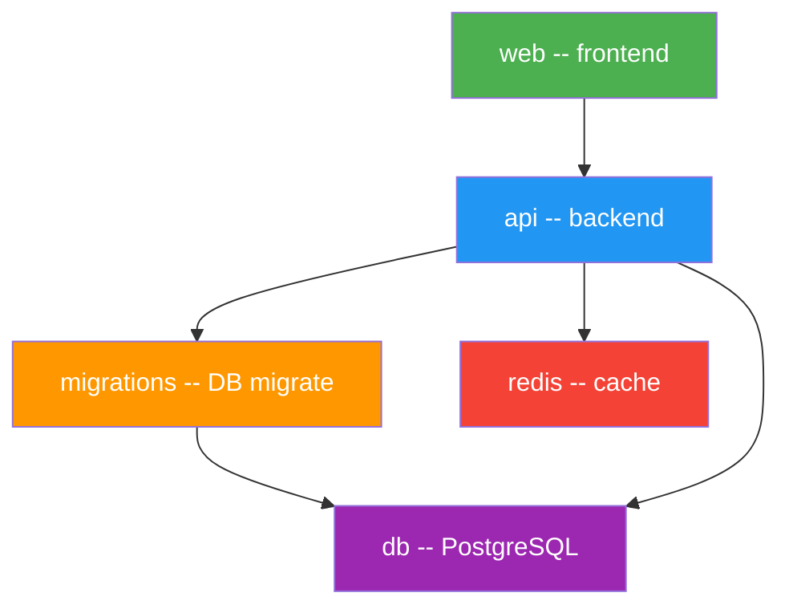
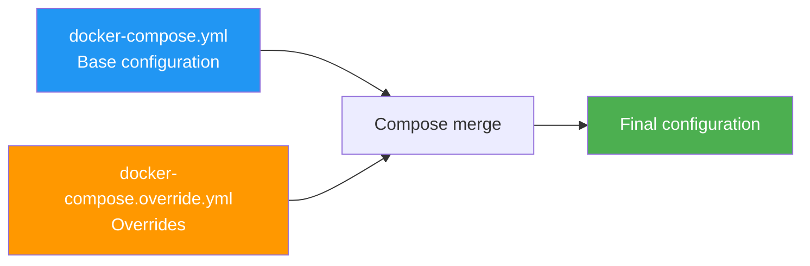

# Level 7: Docker Compose -- Advanced Usage

## Introduction

Imagine an orchestra. In the previous level, we learned how to seat the musicians -- describing services in `docker-compose.yml`. But in a real orchestra, it's not enough to just put everyone behind their instruments. The conductor must know: violins enter first, then brass, then percussion. If the drummer starts before the violins, the symphony turns into chaos. And if the flutist falls ill -- the conductor must notice and react, not keep conducting as if nothing happened.

Docker Compose in advanced mode is exactly such a conductor. It can:

1. **Manage startup order** via `depends_on` -- so API doesn't try to connect to a database that hasn't woken up yet
2. **Check service health** via `healthcheck` -- not just "container is running" but "service is actually working and accepting connections"
3. **Enable services situationally** via `profiles` -- Adminer is only needed for development, Prometheus -- only for production
4. **Inherit configuration** via `extends` -- so you don't copy the same settings into ten services
5. **Override parameters** via override files -- one base for dev and prod, different settings
6. **Watch files** via Compose Watch -- automatic code synchronization without manual restarts

In this level, we'll examine each of these mechanisms in detail, see how they work together, and assemble a full production-ready stack.

---

## 1. depends_on: Managing Startup Order

### The Problem: Container Running Doesn't Mean Ready

When you run `docker compose up`, Compose starts all services as parallel as possible. This is fast, but creates a tricky problem.

```bash
docker compose up -d
# [+] Running 3/3
#  ✔ Container myapp-db-1    Started  0.3s
#  ✔ Container myapp-api-1   Started  0.4s  # API starts before DB is ready!
#  ✔ Container myapp-redis-1 Started  0.3s
```

Imagine the situation: you open a coffee shop. The cook arrives, stands at the stove, and starts cooking. But the supplier hasn't delivered products yet -- the fridge is empty. The cook is in place but can't cook anything. This is exactly what happens with an API server when PostgreSQL hasn't initialized yet:

```
api-1  | Error: connect ECONNREFUSED 172.18.0.3:5432
api-1  | PostgreSQL is not ready yet...
```

The PostgreSQL container starts in 0.3 seconds, but the database itself needs 5-15 seconds to initialize: creating system tables, loading extensions, opening the port for connections. All this time the container is already in `Running` state, but the database isn't accepting connections yet.

### Simple depends_on Form

The most basic variant -- list dependencies:

```yaml
services:
  api:
    build: ./api
    depends_on:
      - db
      - redis
    # Compose will start db and redis BEFORE api
    # But does NOT wait for their readiness!

  db:
    image: postgres:16

  redis:
    image: redis:7-alpine
```

The simple form guarantees two things:

- On `docker compose up`, services `db` and `redis` will start **earlier** than `api`
- On `docker compose down`, the order will be reversed: `api` stops first, then `db` and `redis`

But what it does **not** guarantee: that PostgreSQL is already accepting connections. Between "container started" and "service is ready" there can be several seconds -- and it's in this gap that everything breaks.

Analogy: you told the courier "don't leave until the cook comes to work." The courier waits for the cook to walk through the door and immediately leaves. But the cook hasn't changed clothes yet, hasn't turned on the stove, and hasn't started cooking. The courier arrives at the client's place empty-handed.

### Extended depends_On Form with Conditions

To make Compose actually wait for service readiness, you need the extended form with `condition`:

```yaml
services:
  api:
    build: ./api
    depends_on:
      db:
        condition: service_healthy    # Wait until healthcheck passes
      redis:
        condition: service_started    # Container started is enough
      migrations:
        condition: service_completed_successfully  # Wait for successful completion

  db:
    image: postgres:16
    healthcheck:
      test: ['CMD-SHELL', 'pg_isready -U postgres']
      interval: 5s
      timeout: 3s
      retries: 5
      start_period: 10s

  redis:
    image: redis:7-alpine

  migrations:
    build: ./api
    command: npm run migrate
    depends_on:
      db:
        condition: service_healthy
```

Now Compose behaves like a proper conductor: it doesn't let the violins start until the brass have played their introduction.

### Three depends_On Conditions

| Condition | What it means | When to use |
|---------|-------------|---|
| `service_started` | Container started | For services without healthcheck, or when the fact of starting is enough |
| `service_healthy` | Healthcheck returned success | For databases, caches, queues -- any service that needs initialization time |
| `service_completed_successfully` | Container exited with code 0 | For one-off tasks: DB migrations, seed data, init scripts |

The `service_completed_successfully` condition is especially useful for organizing "preparatory" steps. For example, you don't want the API to start until database migrations are applied. The `migrations` container launches, runs all migrations, exits with code 0 -- and only then the API gets the "green light."

### Dependency Graph

When working with a complex stack, dependencies form a directed graph. Compose analyzes this graph and determines the optimal startup order, parallelizing everything it can:



Startup order for this graph:

1. `db` and `redis` start in parallel -- they have no dependencies
2. Compose waits for `db` healthcheck
3. `migrations` starts and applies migrations
4. Compose waits for `migrations` to exit with code 0
5. `api` starts
6. Compose waits for `api` healthcheck
7. `web` starts

On shutdown (`docker compose down`), the order will be strictly reversed: first `web`, then `api`, then `migrations`, and finally `db` and `redis`.

---

## 2. healthcheck: Service Readiness Check

### Why Healthcheck Is Needed

Without a healthcheck, Docker knows exactly one thing about a container: whether the main process is running or not. But "process is running" and "service is ready to accept requests" are different things.

Analogy: imagine a car. The engine started -- but that doesn't mean you can drive. You need to wait for the oil to warm up, RPMs to stabilize, systems to turn on. Healthcheck is like a dashboard that says: "everything is OK, you can move."

Healthcheck gives a container one of three statuses:

| Status | What it means |
|--------|-------------|
| `starting` | Checks still running, result unknown |
| `healthy` | Last check passed successfully |
| `unhealthy` | Several checks in a row failed |

### Healthcheck Syntax

```yaml
services:
  db:
    image: postgres:16
    healthcheck:
      test: ['CMD-SHELL', 'pg_isready -U postgres']
      interval: 10s       # How often to run the check
      timeout: 5s         # How long to wait for one check
      retries: 5          # How many consecutive failures => unhealthy
      start_period: 30s   # Time for initial initialization
      start_interval: 2s  # Interval during start_period
```

Let's examine each parameter in detail.

**`test`** -- the check command. If it returns exit code 0, the check is considered successful. Any other code -- failure.

**`interval`** -- interval between checks. Every N seconds Docker runs the `test` command inside the container. Too small an interval creates unnecessary load. Too large -- Compose waits too long for the service to become `healthy`.

**`timeout`** -- maximum wait time for a response. If the `test` command doesn't return a result within this time, the check is considered failed. Should be less than `interval`.

**`retries`** -- number of consecutive failed checks after which the container transitions to `unhealthy`. One failure isn't a verdict -- it might have been a temporary issue.

**`start_period`** -- grace period after container startup. During this time, failed checks don't count as failures. This is critically important for services with long initialization -- PostgreSQL on first run creates a database, which can take 10-30 seconds.

**`start_interval`** -- interval between checks during `start_period`. Usually shorter than the main `interval` to detect service readiness faster. Available starting from Compose v2.20+.

### Test Command Formats

Docker supports three formats for the check command:

```yaml
# CMD-SHELL -- runs command via /bin/sh -c
# Supports pipes, redirections, logical operators
healthcheck:
  test: ['CMD-SHELL', 'pg_isready -U postgres || exit 1']

# CMD -- runs command directly, without shell
# Faster, but no shell features
healthcheck:
  test: ['CMD', 'pg_isready', '-U', 'postgres']

# String format -- automatically runs through shell
healthcheck:
  test: pg_isready -U postgres
```

**When to use which:**

- `CMD-SHELL` -- when you need `||`, `&&`, pipes, or environment variables
- `CMD` -- when the command is simple and shell isn't needed (slightly faster, less overhead)
- String format -- shorthand for CMD-SHELL

### Healthcheck for Popular Services

Each service is checked differently. Here are proven recipes for the most common ones:

**PostgreSQL** -- `pg_isready` utility comes with the image:

```yaml
healthcheck:
  test: ['CMD-SHELL', 'pg_isready -U postgres -d myapp']
  interval: 5s
  timeout: 3s
  retries: 5
  start_period: 30s
```

The `-d` flag allows checking a specific database. This is useful when PostgreSQL is already accepting connections but your database hasn't been created yet.

**MySQL / MariaDB** -- use `mysqladmin ping`:

```yaml
healthcheck:
  test: ['CMD', 'mysqladmin', 'ping', '-h', 'localhost', '-u', 'root', '-p$$MYSQL_ROOT_PASSWORD']
  interval: 10s
  timeout: 5s
  retries: 5
  start_period: 30s
```

**Redis** -- `PING` command returns `PONG`:

```yaml
healthcheck:
  test: ['CMD', 'redis-cli', 'ping']
  interval: 5s
  timeout: 3s
  retries: 5
```

Redis starts quickly, so `start_period` is usually not needed.

**HTTP service with curl:**

```yaml
healthcheck:
  test: ['CMD-SHELL', 'curl -f http://localhost:3000/health || exit 1']
  interval: 10s
  timeout: 5s
  retries: 3
  start_period: 15s
```

The `-f` flag makes curl return a non-zero exit code on HTTP errors (4xx, 5xx).

**MongoDB:**

```yaml
healthcheck:
  test: ['CMD', 'mongosh', '--eval', 'db.adminCommand("ping")']
  interval: 10s
  timeout: 5s
  retries: 5
  start_period: 20s
```

### Checking Healthcheck Status

```bash
# Check health status of containers
docker compose ps
# NAME          SERVICE  STATUS                  PORTS
# myapp-db-1    db       running (healthy)       5432/tcp
# myapp-api-1   api      running (starting)      0.0.0.0:3000->3000/tcp
# myapp-redis-1 redis    running                 6379/tcp

# Detailed healthcheck info for a specific container
docker inspect --format='{{json .State.Health}}' myapp-db-1
```

### Disabling Healthcheck

Sometimes an image has a built-in healthcheck that doesn't suit you. You can disable it:

```yaml
services:
  db:
    image: postgres:16
    healthcheck:
      disable: true
```

This can be useful for debugging, but disabling healthcheck in production is a bad idea.

---

## 3. Full Production-Ready Stack

### Putting It All Together

Now that we understand `depends_on` and `healthcheck`, let's assemble a realistic multi-service stack. This is a typical web application architecture: frontend, backend, database, cache, and a one-off migration service.

```yaml
services:
  # ---- Infrastructure ----
  db:
    image: postgres:16-alpine
    volumes:
      - pgdata:/var/lib/postgresql/data
    environment:
      POSTGRES_DB: ${DB_NAME:-myapp}
      POSTGRES_USER: ${DB_USER:-postgres}
      POSTGRES_PASSWORD: ${DB_PASSWORD:?DB_PASSWORD is required}
    healthcheck:
      test: ['CMD-SHELL', 'pg_isready -U ${DB_USER:-postgres} -d ${DB_NAME:-myapp}']
      interval: 5s
      timeout: 3s
      retries: 5
      start_period: 30s
    ports:
      - '127.0.0.1:5432:5432'
    restart: unless-stopped

  redis:
    image: redis:7-alpine
    volumes:
      - redis-data:/data
    command: redis-server --appendonly yes --maxmemory 256mb --maxmemory-policy allkeys-lru
    healthcheck:
      test: ['CMD', 'redis-cli', 'ping']
      interval: 5s
      timeout: 3s
      retries: 5
    restart: unless-stopped

  # ---- Migrations -- one-off service ----
  migrations:
    build:
      context: ./api
      target: migrations
    environment:
      DATABASE_URL: postgresql://${DB_USER:-postgres}:${DB_PASSWORD}@db:5432/${DB_NAME:-myapp}
    depends_on:
      db:
        condition: service_healthy
    restart: 'no'

  # ---- Backend ----
  api:
    build:
      context: ./api
      target: production
    ports:
      - '3000:3000'
    environment:
      NODE_ENV: production
      DATABASE_URL: postgresql://${DB_USER:-postgres}:${DB_PASSWORD}@db:5432/${DB_NAME:-myapp}
      REDIS_URL: redis://redis:6379
      SESSION_SECRET: ${SESSION_SECRET:?SESSION_SECRET is required}
    depends_on:
      db:
        condition: service_healthy
      redis:
        condition: service_healthy
      migrations:
        condition: service_completed_successfully
    healthcheck:
      test: ['CMD-SHELL', 'wget --spider -q http://localhost:3000/health || exit 1']
      interval: 10s
      timeout: 5s
      retries: 3
      start_period: 15s
    restart: unless-stopped

  # ---- Frontend ----
  web:
    build: ./frontend
    ports:
      - '80:80'
    depends_on:
      api:
        condition: service_healthy
    restart: unless-stopped

volumes:
  pgdata:
  redis-data:
```

### Startup Order of This Stack

Let's trace what happens on `docker compose up -d`:

```
Step 1:  db and redis start in parallel
          -- they don't depend on each other

Step 2:  Compose runs healthcheck for both
          -- pg_isready and redis-cli ping every 5 seconds
          -- db gets 30 second start_period for initialization

Step 3:  redis becomes healthy in ~5 seconds
          db becomes healthy in ~10-15 seconds

Step 4:  migrations starts -- db is already healthy
          -- runs npm run migrate
          -- exits with code 0

Step 5:  api starts -- all three dependencies met:
          -- db: healthy
          -- redis: healthy
          -- migrations: completed successfully

Step 6:  Compose waits for api healthcheck
          -- wget checks /health endpoint

Step 7:  web starts -- api is already healthy
```

The whole process takes 20-30 seconds, but each service starts in the correct order with guaranteed dependency readiness.

### Restart Policy -- What to Do on Crash

The restart policy determines how Docker handles a container that crashes:

| Policy | Description | When to use |
|----------|----------|---|
| `no` | Don't restart (default) | One-off tasks, migrations, seeds |
| `always` | Always restart, including after Docker restart | Critical services |
| `on-failure` | Only on exit code != 0 | Background tasks that may fail due to temporary errors |
| `unless-stopped` | Like `always`, but not after manual `docker stop` | Main production services |

The difference between `always` and `unless-stopped` shows after Docker daemon restart. A container with `always` will auto-start. A container with `unless-stopped` will start only if it wasn't manually stopped before the restart.

```yaml
services:
  api:
    restart: unless-stopped   # Restart on crash, but not after docker stop

  migrations:
    restart: 'no'             # One-off service -- don't restart
```

Note: `'no'` in YAML needs quotes, because without them YAML interprets `no` as `false`.

---

## 4. profiles: Conditional Services

### The Problem: Not All Services Are Always Needed

In a real project, there are services needed only in certain situations:

- **Adminer** -- graphical database interface, only needed for development
- **Test runner** -- running tests, only needed in CI
- **Mailhog** -- email catcher, only needed for development and testing
- **Prometheus + Grafana** -- monitoring, only needed in production

Without profiles, all these services start every time you run `docker compose up`. This wastes resources, clutters log output, and creates unnecessary network connections.

Analogy: a restaurant has a main kitchen that's always open. But there's also a summer terrace, a banquet hall, and a pastry shop. They open only when there are orders. Profiles are the keys to these rooms: you open only what you need.

### Defining Profiles

```yaml
services:
  # Services WITHOUT profiles -- start ALWAYS
  api:
    build: ./api
    ports:
      - '3000:3000'

  db:
    image: postgres:16

  # Services WITH profiles -- start ONLY when activated
  adminer:
    image: adminer
    ports:
      - '8080:8080'
    profiles:
      - debug

  mailhog:
    image: mailhog/mailhog
    ports:
      - '8025:8025'
    profiles:
      - debug

  test-runner:
    build: ./tests
    profiles:
      - test

  prometheus:
    image: prom/prometheus
    volumes:
      - ./prometheus.yml:/etc/prometheus/prometheus.yml
    profiles:
      - monitoring

  grafana:
    image: grafana/grafana
    ports:
      - '3001:3000'
    profiles:
      - monitoring
```

The rule is simple: a service without `profiles` -- "main", always starts. A service with `profiles` -- "conditional", starts only with explicit profile activation.

A service can belong to multiple profiles:

```yaml
services:
  pgadmin:
    image: dpage/pgadmin4
    profiles:
      - debug
      - admin    # Starts when ANY of these profiles is activated
```

### Activating Profiles

```bash
# Start with one profile
docker compose --profile debug up -d
# Starts: api, db, adminer, mailhog

# Multiple profiles
docker compose --profile debug --profile monitoring up -d
# Starts: api, db, adminer, mailhog, prometheus, grafana

# Via environment variable -- convenient for CI
COMPOSE_PROFILES=debug,monitoring docker compose up -d

# Start a specific service from a profile
docker compose up -d adminer
# Compose automatically activates the debug profile

# Without profile -- only main services
docker compose up -d
# Starts: api, db
```

### profiles and depends_On

If a profiled service depends on a main service -- everything works intuitively:

```yaml
services:
  db:
    image: postgres:16
    # No profiles -- always starts

  adminer:
    image: adminer
    depends_on:
      - db
    profiles:
      - debug
    # Adminer depends on db
    # With --profile debug, both start: db and adminer
```

But if a main service depends on a profiled service -- there's a problem:

```yaml
services:
  api:
    depends_on:
      - db
      - metrics-collector    # This service has a profile!

  metrics-collector:
    profiles:
      - monitoring
```

If you run `docker compose up` without the `monitoring` profile, Compose will error because `metrics-collector` won't be started. Be careful with dependencies between main and conditional services.

---

## 5. docker-compose.override.yml: Overriding Configuration

### How Override Works

Docker Compose automatically finds and merges two files on startup:

1. `docker-compose.yml` -- base configuration
2. `docker-compose.override.yml` -- overrides (if the file exists)

No flags needed -- Compose does this itself.



Analogy: imagine a form. There's a standard template (base file) that's the same for everyone. And each applicant fills in their data on top (override). One template -- different details.

### Base File

```yaml
# docker-compose.yml -- committed to Git, shared by the team
services:
  api:
    build:
      context: ./api
      target: production
    ports:
      - '3000:3000'
    environment:
      NODE_ENV: production

  db:
    image: postgres:16-alpine
    volumes:
      - pgdata:/var/lib/postgresql/data
    environment:
      POSTGRES_PASSWORD: ${DB_PASSWORD}

volumes:
  pgdata:
```

### Override for Development

```yaml
# docker-compose.override.yml -- NOT committed to Git (.gitignore)
# Each developer configures for themselves
services:
  api:
    build:
      target: development     # Different stage in multi-stage build
    volumes:
      - ./api/src:/app/src    # Mount sources for hot reload
    environment:
      NODE_ENV: development
      DEBUG: 'true'
    command: npm run dev      # Different launch command

  db:
    ports:
      - '5432:5432'           # DB access from host for debugging
    environment:
      POSTGRES_PASSWORD: dev-password  # Simple password...
```

---

## 6. Compose Watch

Compose Watch automatically syncs file changes to containers without restarting them:

```yaml
services:
  api:
    build: ./api
    develop:
      watch:
        - path: ./api/src
          action: sync
          target: /app/src
        - path: ./api/package.json
          action: rebuild
```

This replaces the manual cycle of editing code, rebuilding, and restarting during development.

---

## Summary

Advanced Docker Compose features give you fine-grained control over service lifecycle:

- **depends_on with conditions** -- ensure services start only when dependencies are truly ready
- **healthcheck** -- verify service readiness, not just container running
- **profiles** -- start only the services you need for the current task
- **override files** -- maintain one base configuration with environment-specific customizations
- **Compose Watch** -- automatic file sync during development

Key rules:
- ✅ Use `condition: service_healthy` for databases and caches
- ✅ Use `condition: service_completed_successfully` for migration tasks
- ✅ Use profiles to separate dev/test/production services
- ✅ Use override files for environment-specific settings
- ✅ Always set `restart: unless-stopped` for production services
- ❌ Don't rely on simple `depends_on` without conditions for critical dependencies
