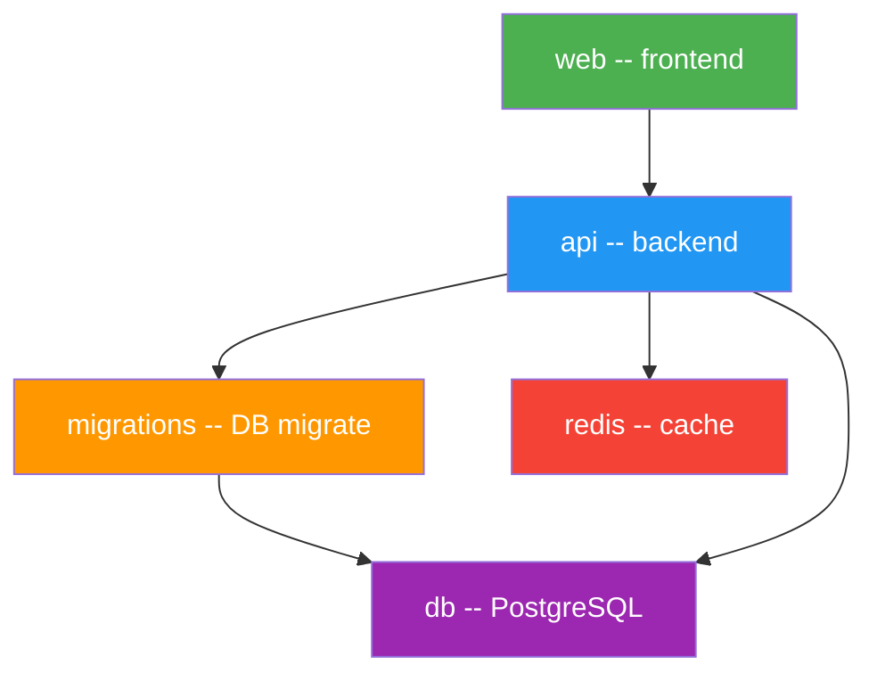
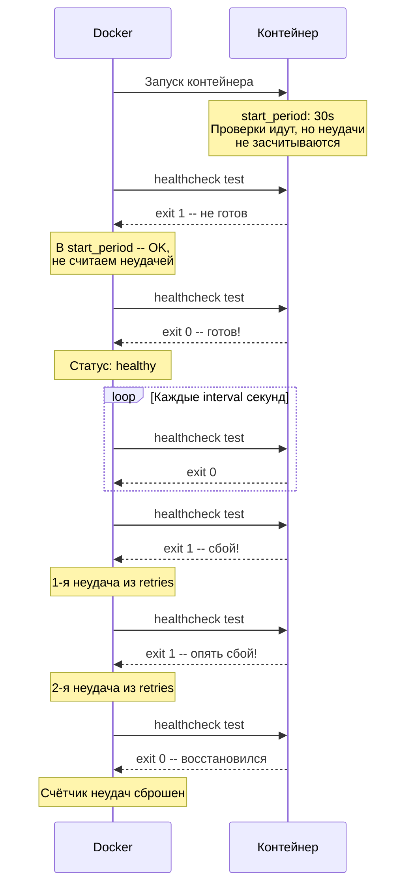
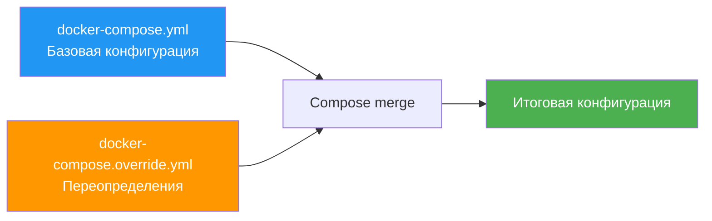
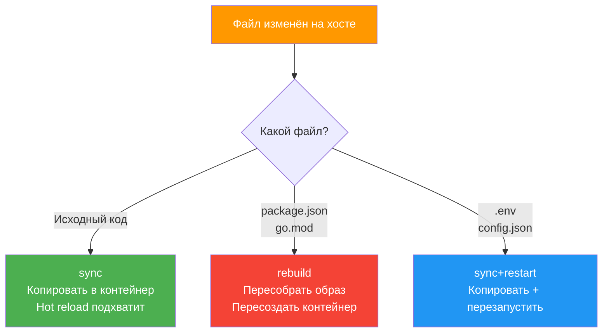

# Уровень 7: Docker Compose -- продвинутое использование

## Введение

Представьте себе оркестр. В предыдущем уровне мы научились рассаживать музыкантов по местам -- описывать сервисы в `docker-compose.yml`. Но в настоящем оркестре недостаточно просто посадить всех за инструменты. Дирижёр должен знать: скрипки вступают первыми, потом -- духовые, потом -- ударные. Если барабанщик начнёт раньше скрипок, симфония превратится в хаос. А если флейтисту стало плохо -- дирижёр должен это заметить и среагировать, а не продолжать дирижировать как ни в чём не бывало.

Docker Compose в продвинутом режиме -- это именно такой дирижёр. Он умеет:

1. **Управлять порядком запуска** через `depends_on` -- чтобы API не пытался подключиться к базе, которая ещё не проснулась
2. **Проверять здоровье сервисов** через `healthcheck` -- не просто "контейнер запущен", а "сервис реально работает и принимает подключения"
3. **Включать сервисы по ситуации** через `profiles` -- Adminer нужен только при разработке, Prometheus -- только в production
4. **Наследовать конфигурацию** через `extends` -- чтобы не копировать одни и те же настройки в десять сервисов
5. **Переопределять параметры** через override-файлы -- одна база для dev и prod, разные настройки
6. **Следить за файлами** через Compose Watch -- автоматическая синхронизация кода без ручных перезапусков

На этом уровне мы подробно разберём каждый из этих механизмов, посмотрим, как они работают вместе, и соберём полноценный production-ready стек.

---

## 1. depends_on: управление порядком запуска

### Проблема: контейнер запущен -- не значит готов

Когда вы запускаете `docker compose up`, Compose стартует все сервисы максимально параллельно. Это быстро, но порождает коварную проблему.

```bash
docker compose up -d
# [+] Running 3/3
#  ✔ Container myapp-db-1    Started  0.3s
#  ✔ Container myapp-api-1   Started  0.4s  # API стартует раньше, чем БД готова!
#  ✔ Container myapp-redis-1 Started  0.3s
```

Представьте ситуацию: вы открываете кофейню. Повар пришёл, встал за плиту и начал готовить. Но поставщик ещё не привёз продукты -- холодильник пуст. Повар на месте, но приготовить ничего не может. Именно это происходит с API-сервером, когда PostgreSQL ещё не инициализировался:

```
api-1  | Error: connect ECONNREFUSED 172.18.0.3:5432
api-1  | PostgreSQL is not ready yet...
```

Контейнер с PostgreSQL запускается за 0.3 секунды, но самой базе данных нужно 5-15 секунд на инициализацию: создание системных таблиц, загрузку расширений, открытие порта для подключений. Всё это время контейнер уже в состоянии `Running`, но база ещё не принимает соединения.

### Простая форма depends_on

Самый базовый вариант -- указать зависимости списком:

```yaml
services:
  api:
    build: ./api
    depends_on:
      - db
      - redis
    # Compose запустит db и redis ПЕРЕД api
    # Но НЕ дождётся их готовности!

  db:
    image: postgres:16

  redis:
    image: redis:7-alpine
```

Простая форма гарантирует две вещи:

- При `docker compose up` сервисы `db` и `redis` будут запущены **раньше**, чем `api`
- При `docker compose down` порядок будет обратным: сначала остановится `api`, потом `db` и `redis`

Но вот чего она **не** гарантирует: что PostgreSQL уже принимает подключения. Между "контейнер запущен" и "сервис готов к работе" может пройти несколько секунд -- и именно в этом промежутке всё ломается.

Аналогия: вы сказали курьеру "не выезжай, пока повар не придёт на работу". Курьер ждёт, пока повар зайдёт в дверь, и сразу выезжает. Но повар ещё не переоделся, не включил плиту и не начал готовить. Курьер приедет к клиенту с пустыми руками.

### Расширенная форма depends_on с условиями

Чтобы Compose действительно дождался готовности сервиса, нужна расширенная форма с `condition`:

```yaml
services:
  api:
    build: ./api
    depends_on:
      db:
        condition: service_healthy    # Ждать, пока healthcheck пройдёт
      redis:
        condition: service_started    # Достаточно, что контейнер запущен
      migrations:
        condition: service_completed_successfully  # Ждать успешного завершения

  db:
    image: postgres:16
    healthcheck:
      test: ['CMD-SHELL', 'pg_isready -U postgres']
      interval: 5s
      timeout: 3s
      retries: 5
      start_period: 10s

  redis:
    image: redis:7-alpine

  migrations:
    build: ./api
    command: npm run migrate
    depends_on:
      db:
        condition: service_healthy
```

Теперь Compose ведёт себя как грамотный дирижёр: не даёт скрипкам вступить, пока духовые не сыграют вступление.

### Три условия depends_on

| Условие | Что означает | Когда использовать |
|---------|-------------|-------------------|
| `service_started` | Контейнер запущен | Для сервисов без healthcheck, или когда достаточно самого факта запуска |
| `service_healthy` | Healthcheck возвращает успех | Для баз данных, кэшей, очередей -- любых сервисов, которым нужно время на инициализацию |
| `service_completed_successfully` | Контейнер завершился с exit code 0 | Для одноразовых задач: миграции БД, seed-данные, init-скрипты |

Условие `service_completed_successfully` особенно полезно для организации "подготовительных" шагов. Например, вы не хотите, чтобы API начал работать, пока миграции базы не применены. Контейнер `migrations` запустится, выполнит все миграции, завершится с кодом 0 -- и только тогда API получит "зелёный свет".

### Граф зависимостей

При работе со сложным стеком зависимости образуют направленный граф. Compose анализирует этот граф и определяет оптимальный порядок запуска, параллеля всё, что можно:



Порядок запуска для этого графа:

1. `db` и `redis` стартуют параллельно -- у них нет зависимостей
2. Compose ждёт healthcheck `db`
3. `migrations` запускается и применяет миграции
4. Compose ждёт завершения `migrations` с кодом 0
5. `api` стартует
6. Compose ждёт healthcheck `api`
7. `web` стартует

При остановке (`docker compose down`) порядок будет строго обратным: сначала `web`, потом `api`, потом `migrations`, и в конце `db` с `redis`.

---

## 2. healthcheck: проверка готовности сервиса

### Зачем нужен healthcheck

Без healthcheck Docker знает о контейнере ровно одно: работает в нём главный процесс или нет. Но "процесс работает" и "сервис готов принимать запросы" -- это разные вещи.

Аналогия: представьте автомобиль. Двигатель завёлся -- но это не значит, что можно ехать. Нужно дождаться, пока прогреется масло, стабилизируются обороты, включатся системы. Healthcheck -- это как приборная панель, которая сообщает: "всё в порядке, можно двигаться".

Healthcheck даёт контейнеру один из трёх статусов:

| Статус | Что означает |
|--------|-------------|
| `starting` | Проверки ещё идут, результат неизвестен |
| `healthy` | Последняя проверка прошла успешно |
| `unhealthy` | Несколько проверок подряд провалились |

### Синтаксис healthcheck

```yaml
services:
  db:
    image: postgres:16
    healthcheck:
      test: ['CMD-SHELL', 'pg_isready -U postgres']
      interval: 10s       # Как часто запускать проверку
      timeout: 5s         # Сколько ждать ответа от одной проверки
      retries: 5          # Сколько неудач подряд => unhealthy
      start_period: 30s   # Время на первичную инициализацию
      start_interval: 2s  # Интервал проверок во время start_period
```

Разберём каждый параметр подробно.

**`test`** -- команда проверки. Если возвращает exit code 0, проверка считается успешной. Любой другой код -- неудача.

**`interval`** -- интервал между проверками. Каждые N секунд Docker запускает команду `test` внутри контейнера. Слишком маленький интервал создаёт лишнюю нагрузку. Слишком большой -- Compose долго ждёт, пока сервис перейдёт в `healthy`.

**`timeout`** -- максимальное время ожидания ответа. Если команда `test` не вернула результат за это время, проверка считается проваленной. Должен быть меньше `interval`.

**`retries`** -- количество подряд неудачных проверок, после которых контейнер переходит в `unhealthy`. Одна неудача ещё не приговор -- возможно, это была временная проблема.

**`start_period`** -- льготный период после старта контейнера. В это время проваленные проверки не считаются неудачами. Это критически важно для сервисов с долгой инициализацией -- PostgreSQL при первом запуске создаёт базу, что может занять 10-30 секунд.

**`start_interval`** -- интервал между проверками во время `start_period`. Обычно короче основного `interval`, чтобы быстрее обнаружить готовность сервиса. Доступен начиная с Compose v2.20+.

### Визуализация работы healthcheck



### Форматы команды test

Docker поддерживает три формата записи команды проверки:

```yaml
# CMD-SHELL -- выполняет команду через /bin/sh -c
# Поддерживает пайпы, перенаправления, логические операторы
healthcheck:
  test: ['CMD-SHELL', 'pg_isready -U postgres || exit 1']

# CMD -- выполняет команду напрямую, без shell
# Быстрее, но нет поддержки shell-фич
healthcheck:
  test: ['CMD', 'pg_isready', '-U', 'postgres']

# Строковый формат -- автоматически выполняется через shell
healthcheck:
  test: pg_isready -U postgres
```

**Когда что использовать:**

- `CMD-SHELL` -- когда нужен `||`, `&&`, пайпы или переменные окружения
- `CMD` -- когда команда простая и не нужен shell (чуть быстрее, меньше overhead)
- Строковый формат -- сокращённая запись CMD-SHELL

### Healthcheck для популярных сервисов

Каждый сервис проверяется по-своему. Вот проверенные рецепты для самых распространённых:

**PostgreSQL** -- утилита `pg_isready` идёт в комплекте с образом:

```yaml
healthcheck:
  test: ['CMD-SHELL', 'pg_isready -U postgres -d myapp']
  interval: 5s
  timeout: 3s
  retries: 5
  start_period: 30s
```

Флаг `-d` позволяет проверить конкретную базу данных. Это полезно, когда PostgreSQL уже принимает подключения, но ваша база ещё не создана.

**MySQL / MariaDB** -- используем `mysqladmin ping`:

```yaml
healthcheck:
  test: ['CMD', 'mysqladmin', 'ping', '-h', 'localhost', '-u', 'root', '-p$$MYSQL_ROOT_PASSWORD']
  interval: 10s
  timeout: 5s
  retries: 5
  start_period: 30s
```

**Redis** -- команда `PING` возвращает `PONG`:

```yaml
healthcheck:
  test: ['CMD', 'redis-cli', 'ping']
  interval: 5s
  timeout: 3s
  retries: 5
```

Redis стартует быстро, поэтому `start_period` обычно не нужен.

**HTTP-сервис с curl:**

```yaml
healthcheck:
  test: ['CMD-SHELL', 'curl -f http://localhost:3000/health || exit 1']
  interval: 10s
  timeout: 5s
  retries: 3
  start_period: 15s
```

Флаг `-f` у curl заставляет его возвращать ненулевой exit code при HTTP-ошибках (4xx, 5xx).

**HTTP-сервис с wget** -- для Alpine-образов, где нет curl:

```yaml
healthcheck:
  test: ['CMD-SHELL', 'wget --spider -q http://localhost:3000/health || exit 1']
  interval: 10s
  timeout: 5s
  retries: 3
  start_period: 15s
```

**MongoDB:**

```yaml
healthcheck:
  test: ['CMD', 'mongosh', '--eval', 'db.adminCommand("ping")']
  interval: 10s
  timeout: 5s
  retries: 5
  start_period: 20s
```

**RabbitMQ:**

```yaml
healthcheck:
  test: ['CMD-SHELL', 'rabbitmq-diagnostics -q ping']
  interval: 15s
  timeout: 10s
  retries: 3
  start_period: 30s
```

RabbitMQ стартует долго, поэтому `start_period` здесь особенно важен.

### Проверка статуса healthcheck

```bash
# Посмотреть статус здоровья контейнеров
docker compose ps
# NAME          SERVICE  STATUS                  PORTS
# myapp-db-1    db       running (healthy)       5432/tcp
# myapp-api-1   api      running (starting)      0.0.0.0:3000->3000/tcp
# myapp-redis-1 redis    running                 6379/tcp

# Подробная информация о healthcheck конкретного контейнера
docker inspect --format='{{json .State.Health}}' myapp-db-1

# Просмотр логов healthcheck
docker inspect --format='{{range .State.Health.Log}}{{.Output}}{{end}}' myapp-db-1
```

### Отключение healthcheck

Иногда образ содержит встроенный healthcheck, который вам не подходит. Его можно отключить:

```yaml
services:
  db:
    image: postgres:16
    healthcheck:
      disable: true
```

Это может быть полезно при отладке, но в production отключать healthcheck -- плохая идея.

---

## 3. Полный production-ready стек

### Собираем всё вместе

Теперь, когда мы понимаем `depends_on` и `healthcheck`, соберём реалистичный многосервисный стек. Это типичная архитектура веб-приложения: фронтенд, бэкенд, база данных, кэш и одноразовый сервис миграций.

```yaml
services:
  # ---- Инфраструктура ----
  db:
    image: postgres:16-alpine
    volumes:
      - pgdata:/var/lib/postgresql/data
    environment:
      POSTGRES_DB: ${DB_NAME:-myapp}
      POSTGRES_USER: ${DB_USER:-postgres}
      POSTGRES_PASSWORD: ${DB_PASSWORD:?DB_PASSWORD is required}
    healthcheck:
      test: ['CMD-SHELL', 'pg_isready -U ${DB_USER:-postgres} -d ${DB_NAME:-myapp}']
      interval: 5s
      timeout: 3s
      retries: 5
      start_period: 30s
    ports:
      - '127.0.0.1:5432:5432'
    restart: unless-stopped

  redis:
    image: redis:7-alpine
    volumes:
      - redis-data:/data
    command: redis-server --appendonly yes --maxmemory 256mb --maxmemory-policy allkeys-lru
    healthcheck:
      test: ['CMD', 'redis-cli', 'ping']
      interval: 5s
      timeout: 3s
      retries: 5
    restart: unless-stopped

  # ---- Миграции -- одноразовый сервис ----
  migrations:
    build:
      context: ./api
      target: migrations
    environment:
      DATABASE_URL: postgresql://${DB_USER:-postgres}:${DB_PASSWORD}@db:5432/${DB_NAME:-myapp}
    depends_on:
      db:
        condition: service_healthy
    restart: 'no'

  # ---- Backend ----
  api:
    build:
      context: ./api
      target: production
    ports:
      - '3000:3000'
    environment:
      NODE_ENV: production
      DATABASE_URL: postgresql://${DB_USER:-postgres}:${DB_PASSWORD}@db:5432/${DB_NAME:-myapp}
      REDIS_URL: redis://redis:6379
      SESSION_SECRET: ${SESSION_SECRET:?SESSION_SECRET is required}
    depends_on:
      db:
        condition: service_healthy
      redis:
        condition: service_healthy
      migrations:
        condition: service_completed_successfully
    healthcheck:
      test: ['CMD-SHELL', 'wget --spider -q http://localhost:3000/health || exit 1']
      interval: 10s
      timeout: 5s
      retries: 3
      start_period: 15s
    restart: unless-stopped

  # ---- Frontend ----
  web:
    build: ./frontend
    ports:
      - '80:80'
    depends_on:
      api:
        condition: service_healthy
    restart: unless-stopped

volumes:
  pgdata:
  redis-data:
```

### Порядок запуска этого стека

Давайте проследим, что происходит при `docker compose up -d`:

```
Шаг 1:  db и redis стартуют параллельно
         -- они не зависят друг от друга

Шаг 2:  Compose запускает healthcheck для обоих
         -- pg_isready и redis-cli ping каждые 5 секунд
         -- db получает start_period в 30 секунд на инициализацию

Шаг 3:  redis переходит в healthy через ~5 секунд
         db переходит в healthy через ~10-15 секунд

Шаг 4:  migrations запускается -- db уже healthy
         -- выполняет npm run migrate
         -- завершается с exit code 0

Шаг 5:  api стартует -- все три зависимости выполнены:
         -- db: healthy
         -- redis: healthy
         -- migrations: completed successfully

Шаг 6:  Compose ждёт healthcheck api
         -- wget проверяет /health endpoint

Шаг 7:  web стартует -- api уже healthy
```

Весь процесс занимает 20-30 секунд, но каждый сервис стартует в правильном порядке и с гарантией готовности зависимостей.

### restart policy -- что делать при падении

Политика перезапуска определяет, как Docker поступит, если контейнер аварийно завершится:

| Политика | Описание | Когда использовать |
|----------|----------|-------------------|
| `no` | Не перезапускать (по умолчанию) | Одноразовые задачи, миграции, seed |
| `always` | Перезапускать всегда, включая после перезагрузки Docker | Критически важные сервисы |
| `on-failure` | Только при exit code != 0 | Фоновые задачи, которые могут упасть из-за временной ошибки |
| `unless-stopped` | Как `always`, но не после ручного `docker stop` | Основные production-сервисы |

Разница между `always` и `unless-stopped` проявляется после перезагрузки Docker daemon. Контейнер с `always` запустится автоматически. Контейнер с `unless-stopped` запустится, только если до перезагрузки он не был остановлен вручную.

```yaml
services:
  api:
    restart: unless-stopped   # Перезапускать при падении, но не после docker stop

  migrations:
    restart: 'no'             # Одноразовый сервис -- не перезапускать
```

Обратите внимание: `'no'` в YAML нужно заключать в кавычки, потому что без них YAML интерпретирует `no` как `false`.

### Переменные окружения и .env файлы

В примере выше используются конструкции вида `${DB_PASSWORD:?DB_PASSWORD is required}`. Это подстановки переменных окружения с разными модификаторами:

```yaml
# Обязательная переменная -- ошибка, если не задана
${DB_PASSWORD:?DB_PASSWORD is required}

# Значение по умолчанию -- если переменная не задана, использовать myapp
${DB_NAME:-myapp}

# Простая подстановка -- пустая строка, если не задана
${DB_USER}
```

Docker Compose автоматически читает файл `.env` из текущей директории:

```env
# .env
DB_NAME=production_db
DB_USER=admin
DB_PASSWORD=super-secret-password
SESSION_SECRET=random-long-string
```

---

## 4. profiles: условные сервисы

### Проблема: не все сервисы нужны всегда

В реальном проекте есть сервисы, которые нужны только в определённых ситуациях:

- **Adminer** -- графический интерфейс для базы данных, нужен только при разработке
- **Test runner** -- запуск тестов, нужен только в CI
- **Mailhog** -- перехватчик email, нужен только при разработке и тестировании
- **Prometheus + Grafana** -- мониторинг, нужен только в production

Без profiles все эти сервисы стартуют каждый раз при `docker compose up`. Это тратит ресурсы, засоряет вывод логов и создаёт ненужные сетевые подключения.

Аналогия: в ресторане есть основная кухня, которая работает всегда. Но есть ещё летняя веранда, банкетный зал и кондитерский цех. Они открываются только когда есть заказы. Profiles -- это ключи от этих помещений: открываете только то, что нужно.

### Определение profiles

```yaml
services:
  # Сервисы БЕЗ profiles -- запускаются ВСЕГДА
  api:
    build: ./api
    ports:
      - '3000:3000'

  db:
    image: postgres:16

  # Сервисы С profiles -- запускаются ТОЛЬКО при активации
  adminer:
    image: adminer
    ports:
      - '8080:8080'
    profiles:
      - debug

  mailhog:
    image: mailhog/mailhog
    ports:
      - '8025:8025'
    profiles:
      - debug

  test-runner:
    build: ./tests
    profiles:
      - test

  prometheus:
    image: prom/prometheus
    volumes:
      - ./prometheus.yml:/etc/prometheus/prometheus.yml
    profiles:
      - monitoring

  grafana:
    image: grafana/grafana
    ports:
      - '3001:3000'
    profiles:
      - monitoring
```

Правило простое: сервис без `profiles` -- "основной", запускается всегда. Сервис с `profiles` -- "условный", запускается только при явной активации профиля.

Один сервис может принадлежать нескольким профилям:

```yaml
services:
  pgadmin:
    image: dpage/pgadmin4
    profiles:
      - debug
      - admin    # Запустится при активации ЛЮБОГО из этих профилей
```

### Активация profiles

```bash
# Запуск с одним профилем
docker compose --profile debug up -d
# Запустит: api, db, adminer, mailhog

# Несколько профилей
docker compose --profile debug --profile monitoring up -d
# Запустит: api, db, adminer, mailhog, prometheus, grafana

# Через переменную окружения -- удобно для CI
COMPOSE_PROFILES=debug,monitoring docker compose up -d

# Запуск конкретного сервиса из профиля
docker compose up -d adminer
# Compose автоматически активирует профиль debug

# Без профиля -- только основные сервисы
docker compose up -d
# Запустит: api, db
```

### profiles и depends_on

Если сервис с профилем зависит от основного сервиса -- всё работает интуитивно:

```yaml
services:
  db:
    image: postgres:16
    # Нет profiles -- запускается всегда

  adminer:
    image: adminer
    depends_on:
      - db
    profiles:
      - debug
    # Adminer зависит от db
    # При --profile debug запустятся оба: db и adminer
```

Но если основной сервис зависит от сервиса с профилем -- возникает проблема:

```yaml
services:
  api:
    depends_on:
      - db
      - metrics-collector    # Этот сервис с профилем!

  metrics-collector:
    profiles:
      - monitoring
```

Если вы запустите `docker compose up` без профиля `monitoring`, Compose выдаст ошибку, потому что `metrics-collector` не будет запущен. Будьте внимательны с зависимостями между основными и условными сервисами.

### Практический пример: dev + test + production

```yaml
services:
  # ---- Основные -- всегда ----
  api:
    build: ./api
    ports:
      - '3000:3000'
    depends_on:
      db:
        condition: service_healthy

  db:
    image: postgres:16
    healthcheck:
      test: ['CMD-SHELL', 'pg_isready -U postgres']
      interval: 5s
      timeout: 3s
      retries: 5

  # ---- Dev-инструменты ----
  adminer:
    image: adminer
    ports:
      - '8080:8080'
    profiles: [debug]

  mailhog:
    image: mailhog/mailhog
    ports:
      - '1025:1025'
      - '8025:8025'
    profiles: [debug]

  # ---- Тестирование ----
  test-runner:
    build:
      context: ./api
      target: test
    command: npm test
    depends_on:
      db:
        condition: service_healthy
    profiles: [test]

  # ---- Мониторинг ----
  prometheus:
    image: prom/prometheus
    profiles: [monitoring]

  grafana:
    image: grafana/grafana
    profiles: [monitoring]
```

Использование:

```bash
# Разработка -- основные + инструменты отладки
docker compose --profile debug up -d

# CI -- основные + тесты
docker compose --profile test up

# Production -- основные + мониторинг
docker compose --profile monitoring up -d

# Всё сразу -- для полного локального тестирования
docker compose --profile debug --profile monitoring up -d
```

---

## 5. docker-compose.override.yml: переопределение конфигурации

### Как работает override

Docker Compose автоматически ищет и мержит два файла при запуске:

1. `docker-compose.yml` -- основная конфигурация
2. `docker-compose.override.yml` -- переопределения (если файл существует)

Никаких флагов указывать не нужно -- Compose делает это сам.



Аналогия: представьте бланк-заявку. Есть типовая форма (основной файл), которая одинакова для всех. А каждый заявитель вписывает свои данные поверх (override). Шаблон один -- детали разные.

### Базовый файл

```yaml
# docker-compose.yml -- коммитится в Git, общий для всей команды
services:
  api:
    build:
      context: ./api
      target: production
    ports:
      - '3000:3000'
    environment:
      NODE_ENV: production

  db:
    image: postgres:16-alpine
    volumes:
      - pgdata:/var/lib/postgresql/data
    environment:
      POSTGRES_PASSWORD: ${DB_PASSWORD}

volumes:
  pgdata:
```

### Override для разработки

```yaml
# docker-compose.override.yml -- НЕ коммитится в Git (.gitignore)
# Каждый разработчик настраивает под себя
services:
  api:
    build:
      target: development     # Другой stage в multi-stage build
    volumes:
      - ./api/src:/app/src    # Монтирование исходников для hot reload
    environment:
      NODE_ENV: development
      DEBUG: 'true'
    command: npm run dev      # Другая команда запуска

  db:
    ports:
      - '5432:5432'           # Доступ к БД с хоста для отладки
    environment:
      POSTGRES_PASSWORD: dev-password  # Простой пароль для dev
```

### Результат слияния

Compose объединяет два файла по определённым правилам:

```yaml
# Итоговая конфигурация -- что видит Compose
services:
  api:
    build:
      context: ./api          # Из основного файла
      target: development     # Переопределено из override
    ports:
      - '3000:3000'           # Из основного файла
    volumes:
      - ./api/src:/app/src    # Добавлено из override
    environment:
      NODE_ENV: development   # Переопределено
      DEBUG: 'true'           # Добавлено
    command: npm run dev      # Переопределено

  db:
    image: postgres:16-alpine
    volumes:
      - pgdata:/var/lib/postgresql/data
    ports:
      - '5432:5432'           # Добавлено из override
    environment:
      POSTGRES_PASSWORD: dev-password  # Переопределено

volumes:
  pgdata:
```

### Правила слияния Compose-файлов

Это ключевая таблица, которую стоит запомнить:

| Тип поля | Поведение при слиянии | Пример |
|----------|----------------------|--------|
| Скалярные значения | Переопределяются | `image`, `build.target`, `command` |
| Маппинги (словари) | Мержатся по ключам | `environment`, `labels`, `build.args` |
| Списки | Конкатенируются | `ports`, `volumes`, `expose`, `dns` |
| `command`, `entrypoint` | Переопределяются полностью | Новая команда заменяет старую |

Самая коварная особенность -- поведение списков. Они не заменяются, а дополняются. Это означает, что если в основном файле есть `ports: ['3000:3000']`, а в override `ports: ['3000:3000', '9229:9229']`, итоговый список будет содержать три записи, две из которых -- дубликаты порта 3000. Это приведёт к ошибке "port is already allocated".

### Явное указание файлов с -f

Когда вы используете флаг `-f`, автоматическое слияние с `docker-compose.override.yml` **отключается**. Compose использует только те файлы, которые вы указали явно:

```bash
# Автоматическое слияние: docker-compose.yml + docker-compose.override.yml
docker compose up -d

# Явное указание: ТОЛЬКО эти файлы, override игнорируется
docker compose -f docker-compose.yml -f docker-compose.prod.yml up -d
```

Это позволяет иметь разные конфигурации для разных окружений:

```
project/
  docker-compose.yml             # Базовая конфигурация -- Git
  docker-compose.override.yml    # Dev-переопределения -- .gitignore
  docker-compose.prod.yml        # Production-переопределения -- Git
  docker-compose.test.yml        # Тестовые переопределения -- Git
```

```bash
# Разработка -- автоматический override
docker compose up -d

# Production
docker compose -f docker-compose.yml -f docker-compose.prod.yml up -d

# Тестирование
docker compose -f docker-compose.yml -f docker-compose.test.yml up -d
```

### Production override файл

```yaml
# docker-compose.prod.yml
services:
  api:
    build:
      target: production
    restart: unless-stopped
    deploy:
      resources:
        limits:
          memory: 512M
          cpus: '0.5'
    logging:
      driver: json-file
      options:
        max-size: '10m'
        max-file: '3'

  db:
    restart: unless-stopped
    deploy:
      resources:
        limits:
          memory: 1G
          cpus: '1.0'
```

---

## 6. extends: наследование конфигурации сервисов

### Проблема: копирование одинаковых настроек

В большом проекте часто бывает, что несколько сервисов имеют общую конфигурацию: одинаковый healthcheck, одинаковые переменные окружения, одинаковую restart policy. Копировать всё это вручную -- верный путь к рассинхронизации.

Аналогия: в школе есть типовое расписание для всех классов: время начала занятий, длительность перемен, время обеда. Каждый класс наследует этот общий шаблон и добавляет свои предметы. Если меняется время обеда -- меняется один раз в шаблоне, а не в тридцати расписаниях.

### Использование extends

Создаём файл с общей конфигурацией:

```yaml
# common.yml -- шаблоны общих сервисов
services:
  base-node:
    build:
      context: .
      target: base
    environment:
      NODE_ENV: production
      LOG_LEVEL: info
    restart: unless-stopped
    healthcheck:
      test: ['CMD-SHELL', 'wget --spider -q http://localhost:3000/health || exit 1']
      interval: 10s
      timeout: 5s
      retries: 3

  base-worker:
    build:
      context: .
      target: base
    environment:
      NODE_ENV: production
      LOG_LEVEL: info
    restart: unless-stopped
```

Наследуем в основном файле:

```yaml
# docker-compose.yml
services:
  api:
    extends:
      file: common.yml
      service: base-node
    build:
      context: ./api          # Переопределяем контекст
    ports:
      - '3000:3000'
    environment:
      DATABASE_URL: postgresql://postgres:secret@db:5432/myapp
      # NODE_ENV и LOG_LEVEL наследуются из base-node

  admin-api:
    extends:
      file: common.yml
      service: base-node
    build:
      context: ./admin-api
    ports:
      - '3001:3000'
    environment:
      DATABASE_URL: postgresql://postgres:secret@db:5432/myapp
      ADMIN_MODE: 'true'

  email-worker:
    extends:
      file: common.yml
      service: base-worker
    build:
      context: ./workers/email
    command: npm run worker:email
    environment:
      REDIS_URL: redis://redis:6379
      SMTP_HOST: smtp.example.com

  payment-worker:
    extends:
      file: common.yml
      service: base-worker
    build:
      context: ./workers/payment
    command: npm run worker:payment
    environment:
      REDIS_URL: redis://redis:6379
      PAYMENT_API_KEY: ${PAYMENT_KEY}
```

Теперь если нужно изменить healthcheck или restart policy для всех Node.js-сервисов -- достаточно изменить один файл `common.yml`.

### extends внутри одного файла

Можно наследовать сервисы внутри одного и того же `docker-compose.yml`:

```yaml
services:
  base:
    image: node:20-alpine
    environment:
      NODE_ENV: production
    restart: unless-stopped

  api:
    extends:
      service: base           # Без file -- берёт из текущего файла
    ports:
      - '3000:3000'
    command: npm run start:api

  worker:
    extends:
      service: base
    command: npm run start:worker
```

### Ограничения extends

У `extends` есть несколько ограничений, о которых нужно знать:

1. **Нельзя наследовать `depends_on`** -- зависимости не переносятся, их нужно указывать в каждом сервисе явно
2. **Нельзя наследовать `links`** и `volumes_from` -- устаревшие директивы не поддерживаются
3. **Нельзя создавать циклы** -- сервис A наследует B, а B наследует A
4. **Нельзя наследовать сервис, который сам использует extends** (в некоторых версиях Compose)

### extends vs YAML-якоря

Альтернативный подход -- использовать YAML-якоря (`&` и `*`):

```yaml
# YAML-якоря -- встроенная фича YAML, не специфична для Compose
x-common-env: &common-env
  NODE_ENV: production
  LOG_LEVEL: info
  TZ: Europe/Moscow

x-common-healthcheck: &common-healthcheck
  interval: 10s
  timeout: 5s
  retries: 3

services:
  api:
    environment:
      <<: *common-env
      DATABASE_URL: postgresql://postgres:secret@db:5432/myapp
    healthcheck:
      <<: *common-healthcheck
      test: ['CMD-SHELL', 'wget --spider -q http://localhost:3000/health || exit 1']

  worker:
    environment:
      <<: *common-env
      REDIS_URL: redis://redis:6379
```

Сравнение подходов:

| Критерий | extends | YAML-якоря |
|----------|---------|------------|
| Наследование из другого файла | Да | Нет |
| Переопределение полей | Полноценное | Только через `<<:` |
| Сложность | Выше | Ниже |
| Подходит для | Общих шаблонов сервисов | Повторяющихся фрагментов конфигурации |

На практике оба подхода часто используются вместе: `extends` -- для наследования целых сервисов, YAML-якоря -- для повторяющихся фрагментов внутри одного файла.

---

## 7. Compose Watch: автоматическая синхронизация при разработке

### Проблема: ручные перезапуски при каждом изменении

При разработке вы постоянно меняете код. Без автоматизации рабочий цикл выглядит так:

```
1. Изменить код
2. docker compose up -d --build
3. Подождать пересборку
4. Проверить результат
5. Повторить
```

Каждая итерация занимает 10-30 секунд. За рабочий день это превращается в часы потерянного времени. Compose Watch решает эту проблему, автоматически отслеживая изменения файлов и применяя их.

### Три действия watch

Compose Watch поддерживает три стратегии реагирования на изменения:

```yaml
services:
  api:
    build: ./api
    develop:
      watch:
        # sync -- копирует изменённые файлы в контейнер
        - action: sync
          path: ./api/src
          target: /app/src
          ignore:
            - '**/*.test.ts'

        # rebuild -- пересобирает образ и пересоздаёт контейнер
        - action: rebuild
          path: ./api/package.json

        # sync+restart -- копирует файл И перезапускает контейнер
        - action: sync+restart
          path: ./api/.env
          target: /app/.env
```

Каждое действие предназначено для своего типа изменений:

**`sync`** -- копирует изменённые файлы в контейнер без перезапуска. Идеально подходит для исходного кода, когда у вас работает hot reload (nodemon, Vite, webpack dev server). Файл изменился на хосте -- через мгновение он уже в контейнере, и hot reload подхватывает изменение.

**`rebuild`** -- полностью пересобирает Docker-образ и пересоздаёт контейнер. Используется для файлов, изменение которых требует переустановки зависимостей: `package.json`, `go.mod`, `requirements.txt`. Это медленнее, чем `sync`, но необходимо -- новые зависимости нельзя просто "скопировать".

**`sync+restart`** -- копирует файл и перезапускает контейнер. Для конфигурационных файлов, которые приложение читает только при старте: `.env`, `config.json`, сертификаты.



### Полный пример конфигурации watch

```yaml
services:
  api:
    build: ./api
    ports:
      - '3000:3000'
    develop:
      watch:
        # Исходный код -- синхронизация без перезапуска
        - action: sync
          path: ./api/src
          target: /app/src
          ignore:
            - '**/*.test.ts'
            - '**/__tests__/**'
            - '**/*.spec.ts'

        # Зависимости -- полная пересборка
        - action: rebuild
          path: ./api/package.json

        - action: rebuild
          path: ./api/package-lock.json

        # Конфигурация -- синхронизация + перезапуск
        - action: sync+restart
          path: ./api/.env
          target: /app/.env

        - action: sync+restart
          path: ./api/config
          target: /app/config

  frontend:
    build: ./frontend
    ports:
      - '5173:5173'
    develop:
      watch:
        - action: sync
          path: ./frontend/src
          target: /app/src

        - action: rebuild
          path: ./frontend/package.json
```

### Запуск Compose Watch

```bash
# Запуск в режиме watch -- блокирует терминал
docker compose watch

# Или сначала запустить сервисы, потом watch
docker compose up -d
docker compose watch

# Watch для конкретного сервиса
docker compose watch api
```

### Compose Watch vs bind mount

До появления Compose Watch основным способом синхронизации кода были bind mount:

```yaml
# Старый подход -- bind mount
services:
  api:
    volumes:
      - ./api:/app                 # Монтируем весь каталог
      - /app/node_modules          # Анонимный том, чтобы не затереть node_modules
```

Этот подход работает, но имеет несколько проблем:

1. **node_modules** -- без анонимного тома хостовые `node_modules` затирают контейнерные. С анонимным томом -- контейнерные `node_modules` "застревают" в томе и не обновляются при `npm install`
2. **Производительность на macOS** -- bind mount на macOS использует FUSE, что значительно медленнее нативной файловой системы. Проект с тысячами файлов может тормозить
3. **Нет фильтрации** -- монтируется всё, включая `.git`, `node_modules`, тестовые файлы
4. **Нет автоматической пересборки** -- при изменении `package.json` нужно вручную запускать `npm install` внутри контейнера

Compose Watch решает все эти проблемы:

```yaml
# Новый подход -- Compose Watch
services:
  api:
    develop:
      watch:
        - action: sync
          path: ./api/src
          target: /app/src          # Копируются только исходники
          ignore:
            - '**/*.test.ts'        # Тесты не нужны в контейнере

        - action: rebuild
          path: ./api/package.json  # Автоматическая пересборка
```

| Критерий | Bind mount | Compose Watch |
|----------|-----------|---------------|
| Производительность на macOS | Медленно | Быстро |
| Проблема с node_modules | Есть | Нет |
| Фильтрация файлов | Нет | Да -- ignore |
| Автопересборка при смене зависимостей | Нет | Да -- rebuild |
| Перезапуск при смене конфигурации | Нет | Да -- sync+restart |

---

## 8. deploy/resources: ограничение ресурсов

### Зачем ограничивать ресурсы

В production один "прожорливый" контейнер может потребить всю память на хосте и уронить остальные сервисы. Ограничение ресурсов -- это страховка от утечек памяти и бесконтрольного потребления CPU.

Аналогия: в коммунальной квартире есть общий счётчик воды. Если один жилец забудет закрыть кран, затопит всю квартиру. Ограничение ресурсов -- это индивидуальные вентили для каждого жильца.

### Синтаксис deploy.resources

```yaml
services:
  api:
    build: ./api
    deploy:
      resources:
        limits:          # Жёсткие лимиты -- контейнер НЕ МОЖЕТ превысить
          memory: 512M
          cpus: '0.5'
        reservations:    # Мягкие лимиты -- гарантированный минимум
          memory: 256M
          cpus: '0.25'
```

**limits** -- жёсткий потолок. Контейнер не может использовать больше указанного количества ресурсов:
- При превышении лимита **памяти** -- контейнер будет убит ядром Linux (OOM Killer)
- При превышении лимита **CPU** -- контейнер будет "тормозить", но не будет убит

**reservations** -- гарантированный минимум. Docker зарезервирует эти ресурсы за контейнером, даже если другие контейнеры голодают. Это нужно для критически важных сервисов, которые всегда должны иметь достаточно ресурсов.

### Практические примеры лимитов

```yaml
services:
  # API-сервер -- среднее потребление
  api:
    deploy:
      resources:
        limits:
          memory: 512M
          cpus: '1.0'
        reservations:
          memory: 256M
          cpus: '0.25'

  # PostgreSQL -- нуждается в памяти для кэша
  db:
    deploy:
      resources:
        limits:
          memory: 1G
          cpus: '1.0'
        reservations:
          memory: 512M
          cpus: '0.5'

  # Redis -- кэш, ограничиваем потребление памяти
  redis:
    deploy:
      resources:
        limits:
          memory: 256M
          cpus: '0.5'

  # Worker -- фоновые задачи, могут быть "прожорливыми"
  worker:
    deploy:
      resources:
        limits:
          memory: 1G
          cpus: '2.0'
        reservations:
          memory: 256M
```

### Единицы измерения

**Память:**
- `b` -- байты
- `k` или `kb` -- килобайты
- `m` или `mb` -- мегабайты
- `g` или `gb` -- гигабайты

```yaml
# Все варианты эквивалентны
memory: 536870912    # в байтах
memory: 524288k      # в килобайтах
memory: 512m         # в мегабайтах (рекомендуется)
memory: 0.5g         # в гигабайтах
```

**CPU:**
- `'1.0'` -- одно полное ядро
- `'0.5'` -- половина ядра
- `'2.0'` -- два ядра
- `'0.25'` -- четверть ядра

Значение CPU -- дробное число в виде строки. `'0.5'` означает, что контейнер может использовать максимум 50% одного ядра процессора.

### Мониторинг использования ресурсов

```bash
# Текущее потребление ресурсов всеми контейнерами
docker stats

# В формате таблицы с заголовками
docker stats --format "table {{.Name}}\t{{.CPUPerc}}\t{{.MemUsage}}\t{{.MemPerc}}"

# Однократный вывод -- без обновления
docker stats --no-stream
```

Пример вывода `docker stats`:

```
NAME            CPU %   MEM USAGE / LIMIT   MEM %
myapp-api-1     2.35%   187.4MiB / 512MiB   36.60%
myapp-db-1      0.52%   89.2MiB / 1GiB       8.71%
myapp-redis-1   0.15%   12.8MiB / 256MiB     5.00%
```

---

## 9. Собираем всё вместе: полная конфигурация проекта

### Структура файлов

```
project/
  docker-compose.yml             # Базовая конфигурация
  docker-compose.override.yml    # Dev-настройки (.gitignore)
  docker-compose.prod.yml        # Production-настройки
  common.yml                     # Общие шаблоны сервисов
  .env                           # Переменные окружения (.gitignore)
  .env.example                   # Пример .env (Git)
  api/
    Dockerfile
    src/
  frontend/
    Dockerfile
    src/
```

### Базовая конфигурация

```yaml
# docker-compose.yml
services:
  db:
    image: postgres:16-alpine
    volumes:
      - pgdata:/var/lib/postgresql/data
    environment:
      POSTGRES_DB: ${DB_NAME:-myapp}
      POSTGRES_USER: ${DB_USER:-postgres}
      POSTGRES_PASSWORD: ${DB_PASSWORD:?DB_PASSWORD is required}
    healthcheck:
      test: ['CMD-SHELL', 'pg_isready -U ${DB_USER:-postgres}']
      interval: 5s
      timeout: 3s
      retries: 5
      start_period: 30s

  redis:
    image: redis:7-alpine
    command: redis-server --appendonly yes
    healthcheck:
      test: ['CMD', 'redis-cli', 'ping']
      interval: 5s
      timeout: 3s
      retries: 5

  migrations:
    build:
      context: ./api
      target: migrations
    depends_on:
      db:
        condition: service_healthy
    restart: 'no'

  api:
    build:
      context: ./api
      target: production
    ports:
      - '3000:3000'
    depends_on:
      db:
        condition: service_healthy
      redis:
        condition: service_healthy
      migrations:
        condition: service_completed_successfully
    healthcheck:
      test: ['CMD-SHELL', 'wget --spider -q http://localhost:3000/health || exit 1']
      interval: 10s
      timeout: 5s
      retries: 3
      start_period: 15s

  web:
    build: ./frontend
    ports:
      - '80:80'
    depends_on:
      api:
        condition: service_healthy

  # ---- Dev-инструменты ----
  adminer:
    image: adminer
    ports:
      - '8080:8080'
    depends_on:
      - db
    profiles: [debug]

  mailhog:
    image: mailhog/mailhog
    ports:
      - '1025:1025'
      - '8025:8025'
    profiles: [debug]

volumes:
  pgdata:
```

### Override для разработки

```yaml
# docker-compose.override.yml -- .gitignore
services:
  api:
    build:
      target: development
    environment:
      NODE_ENV: development
      DEBUG: 'true'
    develop:
      watch:
        - action: sync
          path: ./api/src
          target: /app/src
        - action: rebuild
          path: ./api/package.json

  web:
    develop:
      watch:
        - action: sync
          path: ./frontend/src
          target: /app/src
        - action: rebuild
          path: ./frontend/package.json

  db:
    ports:
      - '5432:5432'
```

### Production-конфигурация

```yaml
# docker-compose.prod.yml
services:
  api:
    restart: unless-stopped
    deploy:
      resources:
        limits:
          memory: 512M
          cpus: '1.0'
        reservations:
          memory: 256M
    logging:
      driver: json-file
      options:
        max-size: '10m'
        max-file: '3'

  web:
    restart: unless-stopped

  db:
    restart: unless-stopped
    deploy:
      resources:
        limits:
          memory: 1G
          cpus: '1.0'

  redis:
    restart: unless-stopped
    deploy:
      resources:
        limits:
          memory: 256M
```

### Команды для разных окружений

```bash
# Разработка -- автоматический override + watch
docker compose --profile debug up -d
docker compose watch

# Production
docker compose -f docker-compose.yml -f docker-compose.prod.yml up -d

# Посмотреть итоговую конфигурацию после слияния
docker compose config

# Production -- проверить конфигурацию перед запуском
docker compose -f docker-compose.yml -f docker-compose.prod.yml config
```

Команда `docker compose config` показывает итоговую конфигурацию после слияния всех файлов. Это незаменимый инструмент для отладки -- вы видите ровно то, что видит Compose.

---

## Частые ошибки новичков

### 1. Простой depends_on вместо condition: service_healthy

```yaml
# ❌ API стартует, когда контейнер с БД запущен, но PostgreSQL ещё не готов
services:
  api:
    depends_on:
      - db     # Не ждёт healthcheck!
  db:
    image: postgres:16
```

Почему это ошибка: контейнер PostgreSQL запускается за 0.5 секунды, но сам сервер базы данных инициализируется 5-15 секунд. API получит ECONNREFUSED при первой попытке подключения.

```yaml
# ✅ API стартует только когда БД реально готова
services:
  api:
    depends_on:
      db:
        condition: service_healthy
  db:
    image: postgres:16
    healthcheck:
      test: ['CMD-SHELL', 'pg_isready -U postgres']
      interval: 5s
      timeout: 3s
      retries: 5
      start_period: 30s
```

### 2. service_healthy без healthcheck

```yaml
# ❌ Compose выдаст ошибку при запуске
services:
  api:
    depends_on:
      redis:
        condition: service_healthy   # Но у redis нет healthcheck!
  redis:
    image: redis:7-alpine
    # healthcheck не определён!
```

Почему это ошибка: условие `service_healthy` требует, чтобы целевой сервис имел определённый healthcheck. Compose не может проверить готовность, если не знает, как это делать.

```yaml
# ✅ Добавляем healthcheck к сервису
services:
  redis:
    image: redis:7-alpine
    healthcheck:
      test: ['CMD', 'redis-cli', 'ping']
      interval: 5s
      timeout: 3s
      retries: 5
```

### 3. Слишком маленький start_period

```yaml
# ❌ PostgreSQL может инициализироваться дольше 5 секунд
services:
  db:
    image: postgres:16
    healthcheck:
      test: ['CMD-SHELL', 'pg_isready -U postgres']
      interval: 2s
      start_period: 5s    # При первом запуске недостаточно!
      retries: 3
```

Почему это ошибка: при первом запуске PostgreSQL создаёт базу данных, настраивает систему аутентификации, загружает расширения. Это может занять 10-30 секунд. С маленьким `start_period` и маленьким `retries` контейнер может получить статус `unhealthy` ещё до того, как база реально запустится.

```yaml
# ✅ Щедрый start_period для первого запуска
services:
  db:
    image: postgres:16
    healthcheck:
      test: ['CMD-SHELL', 'pg_isready -U postgres']
      interval: 5s
      timeout: 3s
      start_period: 30s    # Достаточно даже для первого запуска
      retries: 5
```

### 4. Дублирование портов в override

```yaml
# docker-compose.yml
services:
  api:
    ports:
      - '3000:3000'
```

```yaml
# docker-compose.override.yml
# ❌ Списки конкатенируются -- будет ДВА маппинга порта 3000!
services:
  api:
    ports:
      - '3000:3000'     # Дубликат!
      - '9229:9229'     # Debug-порт
```

Почему это ошибка: при слиянии Compose-файлов списки не заменяются, а конкатенируются. В итоге порт 3000 будет указан дважды, и вы получите ошибку "Bind for 0.0.0.0:3000 failed: port is already allocated".

```yaml
# docker-compose.override.yml
# ✅ Добавляем только НОВЫЕ порты
services:
  api:
    ports:
      - '9229:9229'     # Только debug-порт, 3000 уже есть в базовом файле
```

### 5. watch sync без target

```yaml
# ❌ Не указан target -- Compose не знает, куда копировать файлы
services:
  api:
    develop:
      watch:
        - action: sync
          path: ./api/src
          # target не указан -- ошибка!
```

```yaml
# ✅ target обязателен для sync и sync+restart
services:
  api:
    develop:
      watch:
        - action: sync
          path: ./api/src
          target: /app/src
```

Обратите внимание: для `rebuild` параметр `target` не нужен -- контейнер пересобирается полностью.

### 6. restart: no без кавычек

```yaml
# ❌ YAML интерпретирует no как false
services:
  migrations:
    restart: no      # Ошибка! YAML парсит это как boolean false
```

```yaml
# ✅ Строка в кавычках
services:
  migrations:
    restart: 'no'    # Корректно -- строка "no"
```

В YAML голые `no`, `yes`, `true`, `false` интерпретируются как булевы значения. Для `restart` нужна строка, поэтому кавычки обязательны.

### 7. extends с depends_on

```yaml
# common.yml
services:
  base-api:
    depends_on:
      db:
        condition: service_healthy    # Это НЕ перенесётся!
    healthcheck:
      test: ['CMD-SHELL', 'wget --spider -q http://localhost:3000/health || exit 1']
```

```yaml
# ❌ depends_on из common.yml не наследуется
services:
  api:
    extends:
      file: common.yml
      service: base-api
    # depends_on нужно указать явно!
```

```yaml
# ✅ Явно указываем depends_on
services:
  api:
    extends:
      file: common.yml
      service: base-api
    depends_on:
      db:
        condition: service_healthy
```

---

## Best practices

### 1. Всегда используйте healthcheck для инфраструктурных сервисов

Базы данных, кэши, очереди сообщений -- всё, от чего зависит ваше приложение, должно иметь healthcheck. Это занимает 5 строк конфигурации, но спасает от часов отладки "случайных" ECONNREFUSED.

### 2. Разделяйте base/override/prod

```
docker-compose.yml          -- Общая конфигурация, коммитится в Git
docker-compose.override.yml -- Dev-настройки, в .gitignore
docker-compose.prod.yml     -- Production, коммитится в Git
.env.example                -- Пример переменных, коммитится в Git
.env                        -- Реальные переменные, в .gitignore
```

### 3. Используйте profiles для вспомогательных сервисов

Dev-инструменты, мониторинг, тестовые сервисы не должны запускаться по умолчанию. Они тратят ресурсы и засоряют вывод.

### 4. Предпочитайте Compose Watch вместо bind mount

Watch решает проблемы с `node_modules`, производительностью на macOS и позволяет фильтровать файлы. Bind mount остаётся актуальным для простых случаев без зависимостей.

### 5. Задавайте лимиты ресурсов в production

Без лимитов утечка памяти в одном сервисе может уронить весь хост. `deploy.resources.limits` -- обязательный элемент production-конфигурации.

### 6. Используйте service_completed_successfully для миграций

```yaml
migrations:
  restart: 'no'               # Одноразовый сервис
  depends_on:
    db:
      condition: service_healthy

api:
  depends_on:
    migrations:
      condition: service_completed_successfully
```

Этот паттерн гарантирует, что API не стартует, пока миграции не выполнены успешно.

### 7. Проверяйте итоговую конфигурацию через docker compose config

```bash
# Показать результат слияния всех файлов
docker compose config

# Для production
docker compose -f docker-compose.yml -f docker-compose.prod.yml config
```

Это помогает убедиться, что override-файлы работают так, как вы ожидаете.

### 8. Группируйте повторяющиеся значения через YAML-якоря

```yaml
x-db-env: &db-env
  POSTGRES_DB: ${DB_NAME:-myapp}
  POSTGRES_USER: ${DB_USER:-postgres}
  POSTGRES_PASSWORD: ${DB_PASSWORD}

services:
  db:
    environment:
      <<: *db-env
  migrations:
    environment:
      <<: *db-env
```

---

## Итоги

На этом уровне мы научились превращать простой набор сервисов в надёжную, управляемую систему:

- **depends_on с condition** -- управление порядком запуска с гарантией готовности. Три условия: `service_started`, `service_healthy`, `service_completed_successfully`
- **healthcheck** -- проверка реальной готовности сервиса, а не просто факта запуска контейнера. Параметры `start_period` и `retries` защищают от ложных срабатываний
- **restart policy** -- автоматическое восстановление после падения. `unless-stopped` для production, `'no'` для одноразовых задач
- **profiles** -- условные сервисы, которые запускаются только когда нужны. Dev-инструменты, тесты, мониторинг -- каждый в своём профиле
- **override-файлы** -- одна базовая конфигурация, разные настройки для разных окружений. Правила слияния: скаляры заменяются, маппинги мержатся, списки конкатенируются
- **extends** -- наследование конфигурации между сервисами. Общие шаблоны в отдельном файле, DRY-принцип для Docker Compose
- **Compose Watch** -- автоматическая синхронизация файлов при разработке. Три действия: `sync`, `rebuild`, `sync+restart`. Превосходит bind mount по производительности и удобству
- **deploy/resources** -- ограничение CPU и памяти для защиты хоста от "прожорливых" контейнеров
