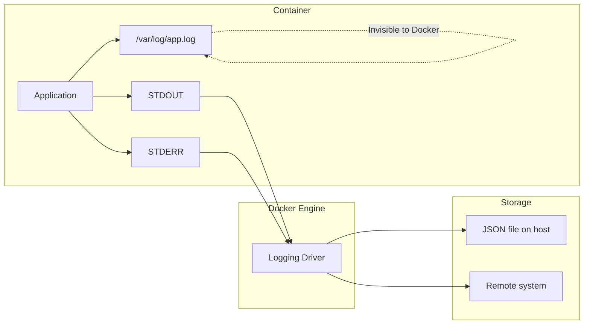
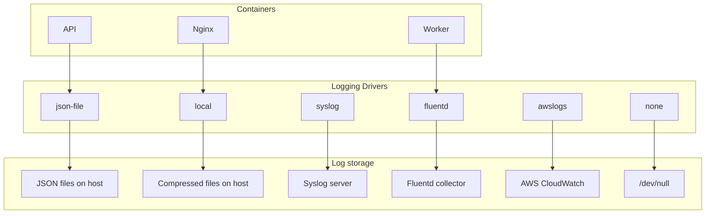
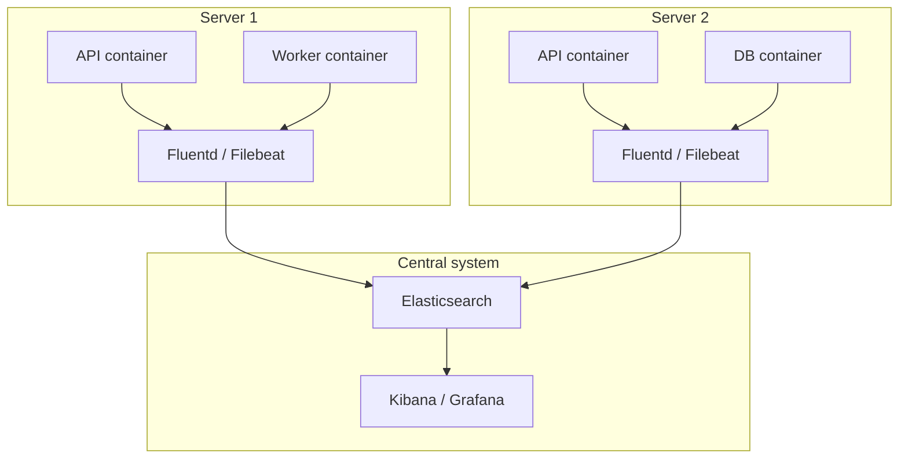

# Level 9: Logging and Debugging -- Deep Dive

## Introduction

Imagine you're a car mechanic. A customer brings in a car and says "something's knocking." Without diagnostic tools, you can only open the hood and listen with your ear. Maybe you'll find the problem, maybe you'll waste half a day. But if you have an error scanner, pressure sensors, and the onboard computer's records -- you understand in minutes what's wrong and know exactly what to fix.

Docker containers are those same "cars," and logging and diagnostic tools are your scanner, sensors, and onboard logbook. When a container crashes, slows down, or behaves strangely, it's the logs and diagnostic commands that let you quickly find the cause, rather than guessing randomly.

In this level, we will explore in detail:

1. **docker logs** -- how Docker collects logs, all flags and working techniques
2. **Logging drivers** -- where to send logs, rotation, centralized logging architecture
3. **docker inspect** -- extracting any information about a container via Go templates
4. **docker stats and docker top** -- real-time resource monitoring and processes
5. **docker events** -- tracking Docker daemon events
6. **Debugging common errors** -- systematic approach to container diagnostics
7. **Common beginner mistakes** -- what usually goes wrong and how to fix it

---

## 1. docker logs: How Docker Collects and Stores Logs

### How It Works: STDOUT and STDERR

Before diving into commands, it's important to understand the key principle: Docker intercepts only what the container process writes to two standard streams -- **STDOUT** (standard output) and **STDERR** (standard error). Everything else Docker doesn't see.

Think of it as a radio microphone on stage. Docker "listens" only to what's spoken into the microphone (STDOUT/STDERR). If an actor whispers to the side (writes logs to a file inside the container), neither the audience nor the sound engineer hears it.



Here's how different languages and frameworks write to STDOUT and STDERR:

```bash
# Shell
echo "info message"            # STDOUT -- Docker sees it
echo "error message" >&2       # STDERR -- Docker sees it

# Node.js
console.log("info")            # STDOUT
console.error("critical bug")  # STDERR

# Python
print("info")                                   # STDOUT
import sys; print("error", file=sys.stderr)      # STDERR

# Go
fmt.Println("info")                              # STDOUT
fmt.Fprintln(os.Stderr, "error")                 # STDERR
```

Both streams go to `docker logs`. The logging driver can distinguish them -- in the JSON file, each line is marked as `"stream":"stdout"` or `"stream":"stderr"`.

### How JSON Logs Work Internally

When the `json-file` driver is used (default), Docker saves logs to a file on the host. The path to this file is predictable:

```
/var/lib/docker/containers/<container-id>/<container-id>-json.log
```

Each line is a separate JSON object:

```json
{"log":"Server started on port 3000\n","stream":"stdout","time":"2024-01-15T10:30:15.123456789Z"}
{"log":"Warning: deprecated API used\n","stream":"stderr","time":"2024-01-15T10:30:16.234567890Z"}
{"log":"Request received: GET /api/users\n","stream":"stdout","time":"2024-01-15T10:30:17.345678901Z"}
```

Fields:
- `log` -- message text (including line break)
- `stream` -- source: `stdout` or `stderr`
- `time` -- timestamp in RFC 3339 format with nanoseconds

You can read this file directly, but `docker logs` does it more conveniently -- removes the JSON wrapper and shows only the text.

### Basic docker logs Commands

```bash
# All container logs
docker logs mycontainer

# By container ID
docker logs a1b2c3d4e5f6

# Short ID also works
docker logs a1b2
```

### Flags: Precise Log Navigation

Real containers can generate thousands of log lines per minute. Reading the entire output is like reading War and Peace when you need one quote. `docker logs` flags let you aim precisely.

**Follow in real time (-f, --follow)**

```bash
# Like tail -f -- output updates as new entries arrive
docker logs -f mycontainer

# Combination: show last 20 lines and keep following
docker logs -f --tail 20 mycontainer
```

Press `Ctrl+C` to stop following. The container continues running.

**Limit number of lines (--tail)**

```bash
# Last 50 lines
docker logs --tail 50 mycontainer

# Last line
docker logs --tail 1 mycontainer

# All lines (default behavior)
docker logs --tail all mycontainer
```

**Time filtering (--since, --until)**

```bash
# Logs for the last 30 minutes
docker logs --since 30m mycontainer

# For the last 2 hours
docker logs --since 2h mycontainer

# From a specific moment (RFC 3339)
docker logs --since 2024-01-15T10:00:00 mycontainer

# Logs up to a certain point
docker logs --until 2024-01-15T12:00:00 mycontainer

# Logs for a period: from 10 minutes ago to 5 minutes ago
docker logs --since 10m --until 5m mycontainer
```

Duration format: `Ns` (seconds), `Nm` (minutes), `Nh` (hours). Unix timestamps also work: `--since 1705312800`.

**Timestamps (-t, --timestamps)**

```bash
docker logs -t mycontainer
# 2024-01-15T10:30:15.123456789Z Starting server...
# 2024-01-15T10:30:15.234567890Z Listening on port 3000
# 2024-01-15T10:30:16.345678901Z Connected to database
```

Timestamps are added by Docker, not the application. This is the time Docker received the line, not when the application generated it. The difference is usually minimal, but worth knowing.

**Flag combinations for typical tasks:**

```bash
# Debugging a recent crash: last 100 lines with timestamps
docker logs --tail 100 -t mycontainer

# Real-time monitoring: tail + follow + timestamps
docker logs -f --tail 20 -t mycontainer

# Incident investigation: logs for a specific period
docker logs --since "2024-01-15T10:00:00" --until "2024-01-15T11:00:00" -t mycontainer

# Quick check: last 5 lines
docker logs --tail 5 mycontainer
```

Flags summary table:

| Flag | Description | Example |
|------|----------|--------|
| `-f`, `--follow` | Follow in real time | `docker logs -f app` |
| `--tail N` | Last N lines | `docker logs --tail 100 app` |
| `--since` | Logs from a point | `docker logs --since 30m app` |
| `--until` | Logs up to a point | `docker logs --until 1h app` |
| `-t`, `--timestamps` | Show timestamps | `docker logs -t app` |
| `--details` | Additional attributes (label, env) | `docker logs --details app` |

### Logs in Docker Compose

In a Compose environment with multiple services, `docker compose logs` is the central observation point. Docker automatically color-codes output from different services and adds the service name to the beginning of each line.

```bash
# Logs of all services -- each in its own color
docker compose logs

# api     | Server started on port 3000
# db      | PostgreSQL ready
# redis   | Ready to accept connections
# worker  | Processing jobs...

# Logs of a specific service
docker compose logs api

# Multiple services at once
docker compose logs api worker

# Follow in real time for all
docker compose logs -f

# Last 50 lines of each service + follow
docker compose logs -f --tail 50

# With timestamps
docker compose logs -t api

# Without color (for redirecting to file)
docker compose logs --no-color > all-logs.txt
```

### Why Container Logs Might Be Empty

A situation that stumps beginners: the container is running (or crashing), but `docker logs` is empty. Here are the three main reasons:

**Reason 1: Application writes logs to file, not STDOUT**

Many applications write to files by default: nginx -- to `/var/log/nginx/`, Apache -- to `/var/log/httpd/`, Java applications -- via Log4j to `/var/log/app.log`. Docker doesn't see them.

```bash
# Check: enter the container and look at log files
docker exec mycontainer cat /var/log/app.log
```

**Reason 2: Output buffering**

Python buffers STDOUT by default. A log can get "stuck" in the buffer and not reach Docker.

```bash
# Solution for Python
docker run -e PYTHONUNBUFFERED=1 mypythonapp

# Or in Dockerfile
ENV PYTHONUNBUFFERED=1
```

**Reason 3: Logging driver is `none`**

```bash
# Check the driver
docker inspect --format='{{.HostConfig.LogConfig.Type}}' mycontainer
# If it outputs "none" -- logging is disabled
```

---

## 2. Logging Drivers: Logging Architecture

### What Is a Logging Driver and Why It's Needed

A logging driver is a Docker plugin module that determines **where** and **in what format** container logs are sent. By default, Docker uses `json-file` -- logs are written to a JSON file on the host. But in a production environment with dozens or hundreds of containers, you may want to send logs to a centralized system.

Analogy: a logging driver is like a postal service. Your application wrote a "letter" (a log line), and Docker decides where to deliver it. The "post office" can put the letter in a local mailbox (json-file), send it by courier to a city branch (syslog/journald), or forward it to another country (fluentd, awslogs, splunk).



### Detailed Driver Breakdown

**json-file -- default driver**

Simple, clear, but requires manual rotation configuration. Without max-size and max-file settings, the log file grows infinitely.

```bash
# Run with json-file (used by default, can omit)
docker run --log-driver json-file \
  --log-opt max-size=10m \
  --log-opt max-file=3 \
  myapp
```

When the log file reaches `max-size`, Docker creates a new file. When the number of files reaches `max-file`, the oldest is deleted. Total maximum log volume = `max-size` x `max-file`.

```
container-id-json.log       ← current (up to 10 MB)
container-id-json.log.1     ← previous
container-id-json.log.2     ← oldest (will be deleted when .3 appears)
```

Available options:

| Option | Description | Example |
|-------|----------|--------|
| `max-size` | Maximum size of one file | `10m`, `100k`, `1g` |
| `max-file` | Maximum number of files | `3`, `5`, `10` |
| `compress` | Compress rotated files | `true`, `false` |
| `labels` | Include container labels in log | `com.myapp.env` |
| `tag` | Tag for identification | `{{.Name}}/{{.ID}}` |

**local -- improved json-file**

The `local` driver appeared as a response to `json-file` shortcomings. It uses compression, writes data faster, and includes rotation by default (100 MB, 5 files).

```bash
docker run --log-driver local \
  --log-opt max-size=50m \
  --log-opt max-file=3 \
  myapp
```

Key difference: `local` stores data in its own binary format, not JSON. You can still use `docker logs`, but direct file reading (bypassing Docker) is more difficult.

**journald -- systemd integration**

On servers with systemd (most modern Linux distributions), the `journald` driver sends logs to the system journal. This is convenient because container logs end up alongside other system service logs, and the standard `journalctl` is used for viewing.

```bash
docker run --log-driver journald --name api myapp

# View via journalctl
journalctl CONTAINER_NAME=api
journalctl CONTAINER_NAME=api --since "10 minutes ago"
journalctl CONTAINER_NAME=api -f   # follow in real time
```

**none -- disable logging**

Sometimes container logs aren't needed -- for example, for benchmark containers or synthetic load, where logs create unnecessary disk load.

```bash
docker run --log-driver none myapp

# docker logs will give an error
docker logs myapp
# Error: configured logging driver does not support reading
```

### docker logs Compatibility

Important nuance that breaks workflows for many: not all drivers support `docker logs`.

| Driver | `docker logs` works | Where to view logs |
|---------|----------------------|-------------------|
| `json-file` | Yes | `docker logs` or file on host |
| `local` | Yes | `docker logs` |
| `journald` | Yes | `docker logs` or `journalctl` |
| `syslog` | No | Syslog server |
| `fluentd` | No | Fluentd / Elasticsearch / Kibana |
| `awslogs` | No | AWS CloudWatch |
| `gcplogs` | No | Google Cloud Logging |
| `splunk` | No | Splunk |
| `gelf` | No | Graylog |
| `none` | No | Nowhere |

If you switched the driver to syslog or fluentd and wonder why `docker logs` stopped working -- now you know why.

### Setting Driver for Individual Container

```bash
# Via docker run
docker run --log-driver json-file \
  --log-opt max-size=10m \
  --log-opt max-file=3 \
  --log-opt tag="{{.Name}}" \
  myapp
```

```yaml
# docker-compose.yml
services:
  api:
    image: myapp
    logging:
      driver: json-file
      options:
        max-size: "10m"
        max-file: "5"
        tag: "{{.Name}}"

  worker:
    image: myworker
    logging:
      driver: local
      options:
        max-size: "50m"
        max-file: "3"

  debug-tool:
    image: debug-utils
    logging:
      driver: none    # Logs from this container aren't needed
```

### Setting Global Driver

Global settings are configured in `/etc/docker/daemon.json`. They apply to all new containers unless a container explicitly overrides the driver.

```json
{
  "log-driver": "json-file",
  "log-opts": {
    "max-size": "10m",
    "max-file": "3",
    "labels": "production_status",
    "env": "os,customer"
  }
}
```

After changing `daemon.json`, restart Docker:

```bash
sudo systemctl restart docker
```

Setting priority:

```
Container (--log-driver / logging in compose) → daemon.json → Built-in values
```

A container can always override global settings. This is convenient: you set sensible defaults in `daemon.json`, and individual containers get special settings.

### Log Rotation: Why It's Critically Important

Without rotation, the log file grows infinitely. An active API server can generate tens of megabytes of logs per hour. In a week that's gigabytes. In a month -- tens of gigabytes. At some point the disk fills up completely, and the server stops working: Docker can't write logs, containers crash, system processes also can't write anything.

Analogy: logs without rotation are like a trash can without a bottom. At first it's unnoticeable, then inconvenient, and then the office is just buried.

```bash
# Check log size for a specific container
du -sh /var/lib/docker/containers/<container-id>/<container-id>-json.log

# Check log sizes for all containers
du -sh /var/lib/docker/containers/*/*-json.log | sort -rh | head -10
```

Recommended settings for different scenarios:

```yaml
# Development: small limits, fast rotation
logging:
  driver: json-file
  options:
    max-size: "5m"
    max-file: "2"
    # Total: maximum 10 MB of logs

# Staging: medium limits
logging:
  driver: json-file
  options:
    max-size: "20m"
    max-file: "5"
    # Total: maximum 100 MB of logs

# Production: enough for incident investigation
logging:
  driver: json-file
  options:
    max-size: "50m"
    max-file: "5"
    # Total: maximum 250 MB of logs
```

### Dual Logging (Docker 20.10+)

Starting with Docker 20.10, dual logging is available. This means logs are sent to a remote driver (syslog, fluentd, awslogs) **and** remain available through `docker logs`. Docker stores a local log cache that serves `docker logs`.

```json
{
  "log-driver": "fluentd",
  "log-opts": {
    "fluentd-address": "localhost:24224"
  }
}
```

With dual logging you don't need to choose between remote storage and `docker logs` convenience -- you get both.

### Centralized Logging Architecture

In production with many containers across multiple servers, you can't log into each machine and read logs via `docker logs`. A centralized system is needed.



A typical stack: **ELK** (Elasticsearch + Logstash + Kibana) or **EFK** (Elasticsearch + Fluentd + Kibana). Docker sends logs to a collector (Fluentd or Filebeat), the collector passes them to Elasticsearch, and Kibana provides a web interface for search and visualization.

---

## 3. docker inspect: X-Ray for a Container

### What inspect Provides

If `docker logs` shows what the container **said**, then `docker inspect` shows **how** it's configured. It's the container's full medical record: configuration, networks, volumes, environment variables, resource limits, state, start time, exit code -- all information in one place.

```bash
# Full output -- huge JSON document
docker inspect mycontainer
```

The output can contain hundreds of JSON lines. Reading it entirely is inconvenient, so the key skill is extracting specific data via Go templates.

### Go Templates: Targeted Navigation

The `--format` flag accepts a Go template -- an expression that extracts specific fields from JSON. Syntax starts with `{{` and ends with `}}`. The dot (`.`) denotes the document root, and each word after the dot is a nested field.

**Container state:**

```bash
# Current status
docker inspect --format='{{.State.Status}}' mycontainer
# running

# Exit code (for finished container)
docker inspect --format='{{.State.ExitCode}}' mycontainer
# 137

# Was it OOM killed
docker inspect --format='{{.State.OOMKilled}}' mycontainer
# true

# Start time
docker inspect --format='{{.State.StartedAt}}' mycontainer
# 2024-01-15T10:30:15.123456789Z

# Finish time
docker inspect --format='{{.State.FinishedAt}}' mycontainer
# 2024-01-15T11:45:30.987654321Z

# PID of main process on host
docker inspect --format='{{.State.Pid}}' mycontainer
# 12345
```

**Network settings:**

```bash
# Container IP address
docker inspect --format='{{.NetworkSettings.IPAddress}}' mycontainer
# 172.17.0.2

# Forwarded ports
docker inspect --format='{{json .NetworkSettings.Ports}}' mycontainer | jq .
# {
#   "3000/tcp": [
#     { "HostIp": "0.0.0.0", "HostPort": "3000" }
#   ]
# }

# Container networks with IP addresses
docker inspect --format='{{range $net, $config := .NetworkSettings.Networks}}{{$net}}: {{$config.IPAddress}}{{println}}{{end}}' mycontainer
# mynetwork: 172.18.0.3
# bridge: 172.17.0.2
```

**Configuration:**

```bash
# Environment variables
docker inspect --format='{{json .Config.Env}}' mycontainer | jq .
# ["NODE_ENV=production", "PORT=3000", "DB_HOST=postgres"]

# Variables one per line
docker inspect --format='{{range .Config.Env}}{{println .}}{{end}}' mycontainer

# Launch command
docker inspect --format='{{json .Config.Cmd}}' mycontainer
# ["node", "server.js"]

# Entrypoint
docker inspect --format='{{json .Config.Entrypoint}}' mycontainer
# ["docker-entrypoint.sh"]

# Working directory
docker inspect --format='{{.Config.WorkingDir}}' mycontainer
# /app
```

**Resources and limits:**

```bash
# Memory limit (in bytes)
docker inspect --format='{{.HostConfig.Memory}}' mycontainer
# 536870912  (= 512 MB)

# CPU
docker inspect --format='{{.HostConfig.NanoCpus}}' mycontainer
# 1500000000  (= 1.5 CPU)

# Logging driver
docker inspect --format='{{.HostConfig.LogConfig.Type}}' mycontainer
# json-file

# Restart policy
docker inspect --format='{{.HostConfig.RestartPolicy.Name}}' mycontainer
# unless-stopped
```

**Mount points:**

```bash
# All volumes: source and destination
docker inspect --format='{{range .Mounts}}{{.Source}} -> {{.Destination}}{{println}}{{end}}' mycontainer
# /var/lib/docker/volumes/mydata/_data -> /app/data
# /home/user/config -> /app/config
```

### Healthcheck via inspect

If a container is configured with a healthcheck, `docker inspect` shows the check history:

```bash
docker inspect --format='{{json .State.Health}}' mycontainer | jq .
# {
#   "Status": "healthy",
#   "FailingStreak": 0,
#   "Log": [
#     {
#       "Start": "2024-01-15T10:30:15Z",
#       "End": "2024-01-15T10:30:15Z",
#       "ExitCode": 0,
#       "Output": "OK"
#     }
#   ]
# }
```

### Inspect for Other Objects

`docker inspect` works not only with containers:

```bash
# Image
docker inspect myimage:latest

# Network -- shows connected containers and their IPs
docker network inspect mynetwork

# Volume -- shows path on host
docker volume inspect myvolume
# [{ "Name": "myvolume", "Mountpoint": "/var/lib/docker/volumes/myvolume/_data" }]
```

### Useful Templates for Daily Work

```bash
# Summary of all containers: name, status, IP
docker ps -q | xargs docker inspect --format='{{.Name}} | {{.State.Status}} | {{.NetworkSettings.IPAddress}}'

# All containers with their memory limits
docker ps -q | xargs docker inspect --format='{{.Name}}: memory={{.HostConfig.Memory}}'

# All containers with their logging driver
docker ps -q | xargs docker inspect --format='{{.Name}}: {{.HostConfig.LogConfig.Type}}'
```

---

## 4. docker stats and docker top: Real-Time Monitoring

### docker stats: Resource Load

`docker stats` is the "task manager" for containers. It shows CPU, memory, network, and disk I/O consumption in real time, updating data every second.

```bash
# All running containers
docker stats

# CONTAINER ID  NAME   CPU %  MEM USAGE / LIMIT    MEM %  NET I/O        BLOCK I/O     PIDS
# a1b2c3d4e5f6  api    2.50%  128MiB / 512MiB      25.00% 5.2kB / 3.1kB  0B / 4.1MB    15
# f6e5d4c3b2a1  db     1.20%  256MiB / 1GiB        25.00% 1.1kB / 800B   12MB / 50MB   8
# 1a2b3c4d5e6f  redis  0.10%  12MiB / 256MiB       4.69%  500B / 200B    0B / 0B       4
```

Column breakdown:

| Column | What it shows | What to watch for |
|---------|---------------|------------------------|
| **CPU %** | CPU usage relative to limit | Above 80% -- container is loaded |
| **MEM USAGE / LIMIT** | Current / maximum RAM | Approaching limit -- OOM risk |
| **MEM %** | RAM usage percentage | Above 90% -- danger zone |
| **NET I/O** | Incoming / outgoing traffic | Abnormally high traffic -- investigate |
| **BLOCK I/O** | Disk read / write | High I/O can slow down neighboring containers |
| **PIDS** | Number of processes | Growing process count -- possible leak |

```bash
# Specific containers
docker stats api db redis

# One-time snapshot (doesn't update)
docker stats --no-stream

# Custom format
docker stats --format "table {{.Name}}\t{{.CPUPerc}}\t{{.MemUsage}}\t{{.MemPerc}}"
# NAME   CPU %   MEM USAGE / LIMIT   MEM %
# api    2.50%   128MiB / 512MiB     25.00%
# db     1.20%   256MiB / 1GiB       25.00%

# For monitoring in scripts (no header)
docker stats --no-stream --format "{{.Name}}: CPU={{.CPUPerc}}, MEM={{.MemPerc}}"
```

### docker top: Processes Inside a Container

`docker top` shows the list of processes inside a container without entering it via `docker exec`. This is a quick way to check what's running inside.

```bash
docker top mycontainer

# UID   PID    PPID   C  STIME  TTY  TIME      CMD
# root  12345  12300  0  10:30  ?    00:00:05  node server.js
# root  12346  12345  0  10:30  ?    00:00:01  /usr/bin/node worker.js

# With additional fields (ps format)
docker top mycontainer -o pid,user,%cpu,%mem,command

# All processes of all services in Compose
docker compose top
```

When `docker top` is more useful than `docker exec ps`:
- The container doesn't have the `ps` utility (minimal images)
- You need a quick overview without entering the container
- You're scripting -- `docker top` output is more predictable

---

## 5. docker events: Tracking Docker Daemon Events

`docker events` shows a real-time stream of events from the Docker daemon:

```bash
docker events

# 2024-01-15T10:30:15.123456789Z container start a1b2c3d4e5f6 (image=nginx)
# 2024-01-15T10:30:16.234567890Z network connect abc123 (name=myapp_default)
# 2024-01-15T10:30:20.345678901Z container die a1b2c3d4e5f6 (exitCode=0)
```

Useful for monitoring, auditing, and debugging. Can be filtered:

```bash
# Only container events
docker events --filter 'type=container'

# Events for a specific container
docker events --filter 'container=mycontainer'

# Events since a specific time
docker events --since '2024-01-15T10:00:00'
```

---

## 6. Systematic Debugging Approach

### Step 1: Check Container Status

```bash
docker ps -a --filter name=my-app
```

Is it running? Exited? What's the exit code?

### Step 2: Check Logs

```bash
docker logs --tail 100 my-app
```

Look for error messages, stack traces, connection failures.

### Step 3: Check Resource Usage

```bash
docker stats my-app
docker inspect --format='{{.State.OOMKilled}}' my-app
```

Was it killed by OOM? Is it consuming excessive CPU?

### Step 4: Check Network

```bash
docker inspect --format='{{json .NetworkSettings.Networks}}' my-app | jq .
docker exec my-app curl -s localhost:3000/health
```

Is the container on the right network? Can it reach its dependencies?

### Step 5: Enter the Container

```bash
docker exec -it my-app sh
env          # Check environment variables
ls -la /app  # Check files
cat /etc/hosts  # Check DNS
```

---

## Common Beginner Mistakes

### 1. Not Configuring Log Rotation

```bash
# Without rotation, logs grow infinitely
docker run myapp
```

Always set `max-size` and `max-file`:

```yaml
logging:
  driver: json-file
  options:
    max-size: "10m"
    max-file: "3"
```

### 2. Not Checking Exit Codes

Exit code 137 usually means OOM kill. Increase memory limits:

```bash
docker run --memory=512m myapp
```

### 3. Not Checking Health Status

```bash
docker compose ps
# Check (healthy)/(starting)/(unhealthy) status
```

### 4. Ignoring docker events

`docker events` can reveal the sequence of events leading to a problem.

---

## Summary

Debugging Docker containers requires a systematic approach:

- **docker logs** -- first place to look for application errors
- **docker inspect** -- complete container configuration and state
- **docker stats** -- real-time resource monitoring
- **docker top** -- processes inside the container
- **docker events** -- daemon-level event tracking

Key rules:
- ✅ Always configure log rotation (max-size + max-file)
- ✅ Use `--tail` and `--since` for targeted log reading
- ✅ Check exit codes to understand why containers failed
- ✅ Use Go templates or jq to extract specific inspect fields
- ✅ Configure healthchecks for automatic readiness detection
- ❌ Don't let logs grow without limits
- ❌ Don't ignore OOM kills (exit code 137)
