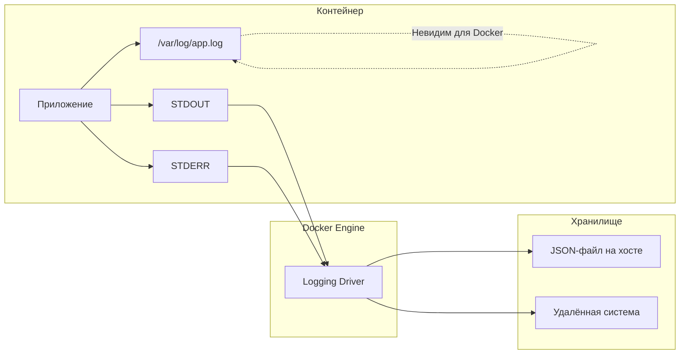
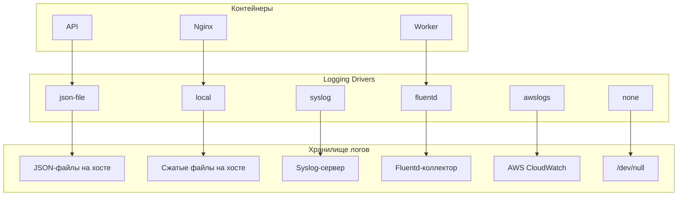
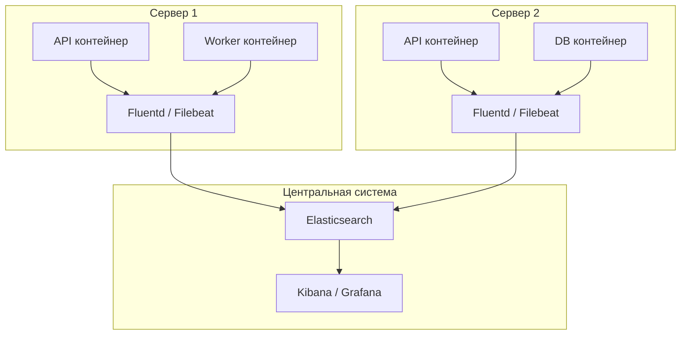
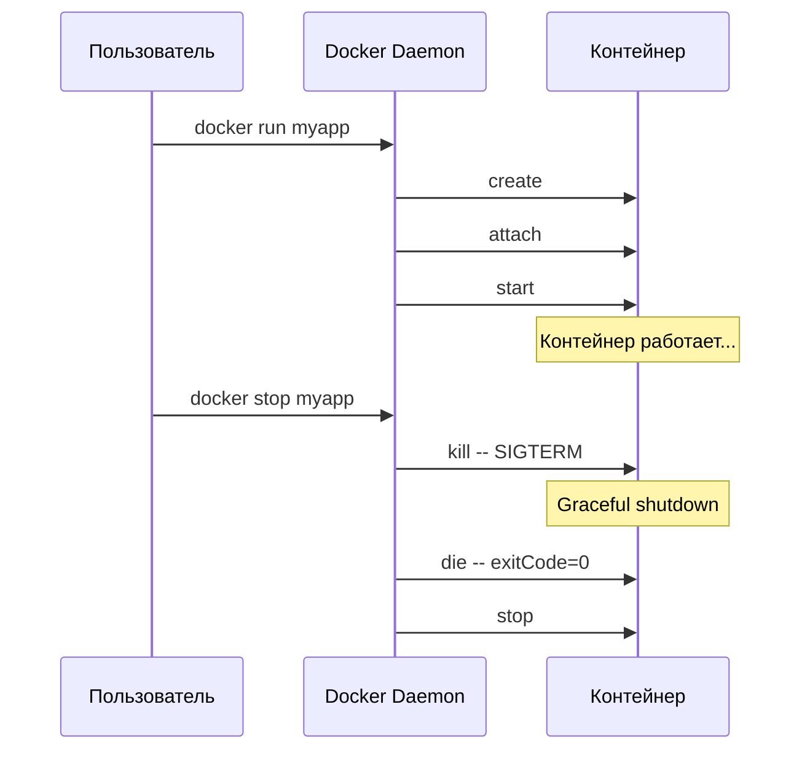
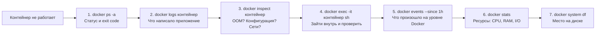

# Уровень 9: Логирование и отладка -- полное погружение

## Введение

Представьте ситуацию: вы работаете автомехаником. Клиент пригоняет машину и говорит "что-то стучит". Без приборов диагностики вы можете только открыть капот и слушать ухом. Может, найдёте проблему, а может, потратите полдня впустую. Но если у вас есть сканер ошибок, датчики давления и записи бортового компьютера -- вы за минуты понимаете, что не так, и точно знаете, что чинить.

Docker-контейнеры -- это те самые "машины", а инструменты логирования и диагностики -- ваш сканер, датчики и бортовой журнал. Когда контейнер падает, тормозит или ведёт себя странно, именно логи и диагностические команды позволяют быстро найти причину, а не гадать, тыкая наугад.

На этом уровне мы подробно разберём:

1. **docker logs** -- как Docker собирает логи, все флаги и приёмы работы
2. **Logging drivers** -- куда отправлять логи, ротация, архитектура централизованного логирования
3. **docker inspect** -- извлечение любой информации о контейнере через Go templates
4. **docker stats и docker top** -- мониторинг ресурсов и процессов в реальном времени
5. **docker events** -- отслеживание событий Docker daemon
6. **Отладка типичных ошибок** -- системный подход к диагностике контейнеров
7. **Типичные ошибки новичков** -- что обычно идёт не так и как это исправить

---

## 1. docker logs: как Docker собирает и хранит логи

### Принцип работы: STDOUT и STDERR

Прежде чем разбирать команды, важно понять ключевой принцип: Docker перехватывает только то, что процесс контейнера пишет в два стандартных потока -- **STDOUT** (стандартный вывод) и **STDERR** (стандартный поток ошибок). Всё остальное Docker не видит.

Подумайте об этом как о радиомикрофоне на сцене. Docker "слушает" только то, что произносится в микрофон (STDOUT/STDERR). Если актёр шепчет в сторону (пишет логи в файл внутри контейнера), ни зрители, ни звукорежиссёр этого не услышат.



Вот как разные языки и фреймворки пишут в STDOUT и STDERR:

```bash
# Shell
echo "info message"            # STDOUT -- Docker увидит
echo "error message" >&2       # STDERR -- Docker увидит

# Node.js
console.log("info")            # STDOUT
console.error("critical bug")  # STDERR

# Python
print("info")                                   # STDOUT
import sys; print("error", file=sys.stderr)      # STDERR

# Go
fmt.Println("info")                              # STDOUT
fmt.Fprintln(os.Stderr, "error")                 # STDERR
```

Оба потока попадают в `docker logs`. При этом logging driver умеет их различать -- в JSON-файле каждая строка помечена как `"stream":"stdout"` или `"stream":"stderr"`.

### Как устроен JSON-лог изнутри

Когда используется драйвер `json-file` (по умолчанию), Docker сохраняет логи в файл на хосте. Путь к этому файлу предсказуем:

```
/var/lib/docker/containers/<container-id>/<container-id>-json.log
```

Каждая строка -- отдельный JSON-объект:

```json
{"log":"Server started on port 3000\n","stream":"stdout","time":"2024-01-15T10:30:15.123456789Z"}
{"log":"Warning: deprecated API used\n","stream":"stderr","time":"2024-01-15T10:30:16.234567890Z"}
{"log":"Request received: GET /api/users\n","stream":"stdout","time":"2024-01-15T10:30:17.345678901Z"}
```

Поля:
- `log` -- текст сообщения (включая перенос строки)
- `stream` -- источник: `stdout` или `stderr`
- `time` -- временная метка в формате RFC 3339 с наносекундами

Вы можете прочитать этот файл напрямую, но `docker logs` делает это удобнее -- убирает JSON-обёртку и показывает только текст.

### Базовые команды docker logs

```bash
# Все логи контейнера
docker logs mycontainer

# По ID контейнера
docker logs a1b2c3d4e5f6

# Короткий ID тоже работает
docker logs a1b2
```

### Флаги: точная навигация по логам

Реальные контейнеры могут генерировать тысячи строк логов в минуту. Смотреть весь вывод целиком -- всё равно что читать всю Войну и мир, когда нужна одна цитата. Флаги `docker logs` позволяют точно навести прицел.

**Следить в реальном времени (-f, --follow)**

```bash
# Аналог tail -f -- вывод обновляется по мере поступления новых записей
docker logs -f mycontainer

# Комбинация: показать последние 20 строк и следить дальше
docker logs -f --tail 20 mycontainer
```

Нажмите `Ctrl+C`, чтобы прекратить отслеживание. Контейнер при этом продолжит работать.

**Ограничить количество строк (--tail)**

```bash
# Последние 50 строк
docker logs --tail 50 mycontainer

# Последняя строка
docker logs --tail 1 mycontainer

# Все строки (поведение по умолчанию)
docker logs --tail all mycontainer
```

**Фильтрация по времени (--since, --until)**

```bash
# Логи за последние 30 минут
docker logs --since 30m mycontainer

# За последние 2 часа
docker logs --since 2h mycontainer

# С конкретного момента (RFC 3339)
docker logs --since 2024-01-15T10:00:00 mycontainer

# Логи до определённого момента
docker logs --until 2024-01-15T12:00:00 mycontainer

# Логи за период: от 10 минут назад до 5 минут назад
docker logs --since 10m --until 5m mycontainer
```

Формат длительности: `Ns` (секунды), `Nm` (минуты), `Nh` (часы). Можно использовать Unix timestamp: `--since 1705312800`.

**Временные метки (-t, --timestamps)**

```bash
docker logs -t mycontainer
# 2024-01-15T10:30:15.123456789Z Starting server...
# 2024-01-15T10:30:15.234567890Z Listening on port 3000
# 2024-01-15T10:30:16.345678901Z Connected to database
```

Временные метки добавляются Docker, а не приложением. Это время, когда Docker получил строку, а не когда приложение её сформировало. Разница обычно минимальна, но стоит об этом знать.

**Комбинация флагов для типичных задач:**

```bash
# Отладка свежего падения: последние 100 строк с временными метками
docker logs --tail 100 -t mycontainer

# Мониторинг в реальном времени: хвост + слежение + метки
docker logs -f --tail 20 -t mycontainer

# Расследование инцидента: логи за конкретный период
docker logs --since "2024-01-15T10:00:00" --until "2024-01-15T11:00:00" -t mycontainer

# Быстрая проверка: последние 5 строк
docker logs --tail 5 mycontainer
```

Сводная таблица флагов:

| Флаг | Описание | Пример |
|------|----------|--------|
| `-f`, `--follow` | Следить в реальном времени | `docker logs -f app` |
| `--tail N` | Последние N строк | `docker logs --tail 100 app` |
| `--since` | Логи с момента | `docker logs --since 30m app` |
| `--until` | Логи до момента | `docker logs --until 1h app` |
| `-t`, `--timestamps` | Показать временные метки | `docker logs -t app` |
| `--details` | Дополнительные атрибуты (label, env) | `docker logs --details app` |

### Логи в Docker Compose

В Compose-среде с несколькими сервисами `docker compose logs` -- это центральный пункт наблюдения. Docker автоматически раскрашивает вывод разных сервисов в разные цвета и добавляет имя сервиса в начало каждой строки.

```bash
# Логи всех сервисов -- каждый окрашен в свой цвет
docker compose logs

# api     | Server started on port 3000
# db      | PostgreSQL ready
# redis   | Ready to accept connections
# worker  | Processing jobs...

# Логи конкретного сервиса
docker compose logs api

# Несколько сервисов одновременно
docker compose logs api worker

# Следить в реальном времени за всеми
docker compose logs -f

# Последние 50 строк каждого сервиса + слежение
docker compose logs -f --tail 50

# С временными метками
docker compose logs -t api

# Без цвета (для перенаправления в файл)
docker compose logs --no-color > all-logs.txt
```

### Почему логи контейнера могут быть пустыми

Ситуация, которая ставит новичков в тупик: контейнер работает (или падает), а `docker logs` пуст. Вот три главные причины:

**Причина 1: Приложение пишет логи в файл, а не в STDOUT**

Многие приложения по умолчанию пишут в файлы: nginx -- в `/var/log/nginx/`, Apache -- в `/var/log/httpd/`, Java-приложения -- через Log4j в `/var/log/app.log`. Docker их не видит.

```bash
# Проверить: зайти в контейнер и посмотреть файлы логов
docker exec mycontainer cat /var/log/app.log
```

**Причина 2: Буферизация вывода**

Python по умолчанию буферизирует STDOUT. Лог может "застрять" в буфере и не попасть в Docker.

```bash
# Решение для Python
docker run -e PYTHONUNBUFFERED=1 mypythonapp

# Или в Dockerfile
ENV PYTHONUNBUFFERED=1
```

**Причина 3: Используется logging driver `none`**

```bash
# Проверить драйвер
docker inspect --format='{{.HostConfig.LogConfig.Type}}' mycontainer
# Если выведет "none" -- логирование отключено
```

---

## 2. Logging drivers: архитектура логирования

### Что такое logging driver и зачем он нужен

Logging driver -- это подключаемый модуль Docker, который определяет, **куда** и **в каком формате** отправляются логи контейнера. По умолчанию Docker использует `json-file` -- логи пишутся в JSON-файл на хосте. Но в production-среде с десятками и сотнями контейнеров вам может понадобиться отправлять логи в централизованную систему.

Аналогия: logging driver -- это как почтовая служба. Ваше приложение написало "письмо" (строку лога), а Docker решает, куда его доставить. "Почта" может положить письмо в локальный ящик (json-file), отправить курьером в городское отделение (syslog/journald) или переслать в другую страну (fluentd, awslogs, splunk).



### Подробный разбор драйверов

**json-file -- драйвер по умолчанию**

Простой, понятный, но требует ручной настройки ротации. Без настройки max-size и max-file файл лога растёт бесконечно.

```bash
# Запуск с json-file (используется по умолчанию, можно не указывать)
docker run --log-driver json-file \
  --log-opt max-size=10m \
  --log-opt max-file=3 \
  myapp
```

Когда лог-файл достигает `max-size`, Docker создаёт новый файл. Когда количество файлов достигает `max-file`, самый старый удаляется. Итого максимальный объём логов = `max-size` x `max-file`.

```
container-id-json.log       ← текущий (до 10 МБ)
container-id-json.log.1     ← предыдущий
container-id-json.log.2     ← самый старый (удалится, когда появится .3)
```

Доступные опции:

| Опция | Описание | Пример |
|-------|----------|--------|
| `max-size` | Максимальный размер одного файла | `10m`, `100k`, `1g` |
| `max-file` | Максимальное количество файлов | `3`, `5`, `10` |
| `compress` | Сжимать ротированные файлы | `true`, `false` |
| `labels` | Включить метки контейнера в лог | `com.myapp.env` |
| `tag` | Тег для идентификации | `{{.Name}}/{{.ID}}` |

**local -- улучшенная версия json-file**

Драйвер `local` появился как ответ на недостатки `json-file`. Он использует сжатие, быстрее записывает данные и включает ротацию по умолчанию (100 МБ, 5 файлов).

```bash
docker run --log-driver local \
  --log-opt max-size=50m \
  --log-opt max-file=3 \
  myapp
```

Ключевое отличие: `local` хранит данные в собственном бинарном формате, а не в JSON. Вы по-прежнему можете использовать `docker logs`, но прямое чтение файлов (в обход Docker) затруднено.

**journald -- интеграция с systemd**

На серверах с systemd (большинство современных Linux-дистрибутивов) драйвер `journald` отправляет логи в системный журнал. Это удобно, потому что логи контейнеров оказываются рядом с логами других системных сервисов, и для просмотра используется стандартный `journalctl`.

```bash
docker run --log-driver journald --name api myapp

# Просмотр через journalctl
journalctl CONTAINER_NAME=api
journalctl CONTAINER_NAME=api --since "10 minutes ago"
journalctl CONTAINER_NAME=api -f   # следить в реальном времени
```

**none -- отключение логирования**

Иногда логи контейнера не нужны -- например, для контейнеров с бенчмарками или синтетической нагрузкой, где логи создают ненужную нагрузку на диск.

```bash
docker run --log-driver none myapp

# docker logs выдаст ошибку
docker logs myapp
# Error: configured logging driver does not support reading
```

### Совместимость с docker logs

Важнейший нюанс, который ломает рабочий процесс у многих: не все драйверы поддерживают `docker logs`.

| Драйвер | `docker logs` работает | Где смотреть логи |
|---------|----------------------|-------------------|
| `json-file` | Да | `docker logs` или файл на хосте |
| `local` | Да | `docker logs` |
| `journald` | Да | `docker logs` или `journalctl` |
| `syslog` | Нет | Syslog-сервер |
| `fluentd` | Нет | Fluentd / Elasticsearch / Kibana |
| `awslogs` | Нет | AWS CloudWatch |
| `gcplogs` | Нет | Google Cloud Logging |
| `splunk` | Нет | Splunk |
| `gelf` | Нет | Graylog |
| `none` | Нет | Нигде |

Если вы переключили драйвер на syslog или fluentd и удивляетесь, почему `docker logs` перестал работать, -- теперь вы знаете причину.

### Настройка драйвера для отдельного контейнера

```bash
# Через docker run
docker run --log-driver json-file \
  --log-opt max-size=10m \
  --log-opt max-file=3 \
  --log-opt tag="{{.Name}}" \
  myapp
```

```yaml
# docker-compose.yml
services:
  api:
    image: myapp
    logging:
      driver: json-file
      options:
        max-size: "10m"
        max-file: "5"
        tag: "{{.Name}}"

  worker:
    image: myworker
    logging:
      driver: local
      options:
        max-size: "50m"
        max-file: "3"

  debug-tool:
    image: debug-utils
    logging:
      driver: none    # Логи этого контейнера не нужны
```

### Настройка глобального драйвера

Глобальные настройки задаются в файле `/etc/docker/daemon.json`. Они применяются ко всем новым контейнерам, если контейнер не переопределяет драйвер явно.

```json
{
  "log-driver": "json-file",
  "log-opts": {
    "max-size": "10m",
    "max-file": "3",
    "labels": "production_status",
    "env": "os,customer"
  }
}
```

После изменения `daemon.json` перезапустите Docker:

```bash
sudo systemctl restart docker
```

Приоритет настроек:

```
Контейнер (--log-driver / logging в compose) → daemon.json → Встроенные значения
```

Контейнер всегда может переопределить глобальные настройки. Это удобно: задаёте разумные умолчания в `daemon.json`, а для отдельных контейнеров -- специальные настройки.

### Ротация логов: почему это критически важно

Без ротации файл логов растёт бесконечно. Активный API-сервер может генерировать десятки мегабайт логов в час. За неделю это гигабайты. За месяц -- десятки гигабайт. В какой-то момент диск заполняется полностью, и сервер перестаёт работать: Docker не может писать логи, контейнеры падают, системные процессы тоже не могут записать ничего.

Аналогия: логи без ротации -- это как мусорная корзина без дна. Сначала незаметно, потом неудобно, а потом офис просто завалило.

```bash
# Проверить размер логов конкретного контейнера
du -sh /var/lib/docker/containers/<container-id>/<container-id>-json.log

# Проверить размер логов всех контейнеров
du -sh /var/lib/docker/containers/*/*-json.log | sort -rh | head -10
```

Рекомендуемые настройки для разных сценариев:

```yaml
# Разработка: небольшие лимиты, быстрая ротация
logging:
  driver: json-file
  options:
    max-size: "5m"
    max-file: "2"
    # Итого: максимум 10 МБ логов

# Staging: средние лимиты
logging:
  driver: json-file
  options:
    max-size: "20m"
    max-file: "5"
    # Итого: максимум 100 МБ логов

# Production: достаточно для расследования инцидентов
logging:
  driver: json-file
  options:
    max-size: "50m"
    max-file: "5"
    # Итого: максимум 250 МБ логов
```

### Dual logging (Docker 20.10+)

Начиная с Docker 20.10, появилась возможность dual logging. Это значит, что логи отправляются в удалённый драйвер (syslog, fluentd, awslogs) **и** остаются доступны через `docker logs`. Docker хранит локальный кэш логов, который обслуживает `docker logs`.

```json
{
  "log-driver": "fluentd",
  "log-opts": {
    "fluentd-address": "localhost:24224"
  }
}
```

С dual logging вам не нужно выбирать между удалённым хранением и удобством `docker logs` -- вы получаете оба.

### Архитектура централизованного логирования

В production со множеством контейнеров на нескольких серверах нельзя заходить на каждую машину и читать логи через `docker logs`. Нужна централизованная система.



Типичный стек: **ELK** (Elasticsearch + Logstash + Kibana) или **EFK** (Elasticsearch + Fluentd + Kibana). Docker отправляет логи в коллектор (Fluentd или Filebeat), коллектор передаёт их в Elasticsearch, а Kibana предоставляет веб-интерфейс для поиска и визуализации.

---

## 3. docker inspect: рентген для контейнера

### Что даёт inspect

Если `docker logs` показывает, что **сказал** контейнер, то `docker inspect` показывает, **как** он устроен. Это полная карточка контейнера: конфигурация, сети, тома, переменные окружения, лимиты ресурсов, состояние, время старта, код выхода -- вся информация в одном месте.

```bash
# Полный вывод -- огромный JSON-документ
docker inspect mycontainer
```

Вывод может содержать сотни строк JSON. Читать его целиком неудобно, поэтому ключевой навык -- извлечение нужных данных через Go templates.

### Go templates: точечная навигация

Флаг `--format` принимает Go template -- выражение, которое извлекает конкретные поля из JSON. Синтаксис начинается с `{{` и заканчивается `}}`. Точка (`.`) обозначает корень документа, а каждое слово после точки -- вложенное поле.

**Состояние контейнера:**

```bash
# Текущий статус
docker inspect --format='{{.State.Status}}' mycontainer
# running

# Код выхода (для завершённого контейнера)
docker inspect --format='{{.State.ExitCode}}' mycontainer
# 137

# Убит ли из-за нехватки памяти
docker inspect --format='{{.State.OOMKilled}}' mycontainer
# true

# Время запуска
docker inspect --format='{{.State.StartedAt}}' mycontainer
# 2024-01-15T10:30:15.123456789Z

# Время завершения
docker inspect --format='{{.State.FinishedAt}}' mycontainer
# 2024-01-15T11:45:30.987654321Z

# PID главного процесса на хосте
docker inspect --format='{{.State.Pid}}' mycontainer
# 12345
```

**Сетевые настройки:**

```bash
# IP-адрес контейнера
docker inspect --format='{{.NetworkSettings.IPAddress}}' mycontainer
# 172.17.0.2

# Проброшенные порты
docker inspect --format='{{json .NetworkSettings.Ports}}' mycontainer | jq .
# {
#   "3000/tcp": [
#     { "HostIp": "0.0.0.0", "HostPort": "3000" }
#   ]
# }

# Сети контейнера с IP-адресами
docker inspect --format='{{range $net, $config := .NetworkSettings.Networks}}{{$net}}: {{$config.IPAddress}}{{println}}{{end}}' mycontainer
# mynetwork: 172.18.0.3
# bridge: 172.17.0.2
```

**Конфигурация:**

```bash
# Переменные окружения
docker inspect --format='{{json .Config.Env}}' mycontainer | jq .
# ["NODE_ENV=production", "PORT=3000", "DB_HOST=postgres"]

# Переменные по одной на строку
docker inspect --format='{{range .Config.Env}}{{println .}}{{end}}' mycontainer

# Команда запуска
docker inspect --format='{{json .Config.Cmd}}' mycontainer
# ["node", "server.js"]

# Entrypoint
docker inspect --format='{{json .Config.Entrypoint}}' mycontainer
# ["docker-entrypoint.sh"]

# Рабочая директория
docker inspect --format='{{.Config.WorkingDir}}' mycontainer
# /app
```

**Ресурсы и лимиты:**

```bash
# Лимит памяти (в байтах)
docker inspect --format='{{.HostConfig.Memory}}' mycontainer
# 536870912  (= 512 МБ)

# CPU
docker inspect --format='{{.HostConfig.NanoCpus}}' mycontainer
# 1500000000  (= 1.5 CPU)

# Logging driver
docker inspect --format='{{.HostConfig.LogConfig.Type}}' mycontainer
# json-file

# Политика перезапуска
docker inspect --format='{{.HostConfig.RestartPolicy.Name}}' mycontainer
# unless-stopped
```

**Точки монтирования:**

```bash
# Все тома: источник и назначение
docker inspect --format='{{range .Mounts}}{{.Source}} -> {{.Destination}}{{println}}{{end}}' mycontainer
# /var/lib/docker/volumes/mydata/_data -> /app/data
# /home/user/config -> /app/config
```

### Healthcheck через inspect

Если контейнер настроен с healthcheck, `docker inspect` покажет историю проверок:

```bash
docker inspect --format='{{json .State.Health}}' mycontainer | jq .
# {
#   "Status": "healthy",
#   "FailingStreak": 0,
#   "Log": [
#     {
#       "Start": "2024-01-15T10:30:15Z",
#       "End": "2024-01-15T10:30:15Z",
#       "ExitCode": 0,
#       "Output": "OK"
#     }
#   ]
# }
```

### Inspect для других объектов

`docker inspect` работает не только с контейнерами:

```bash
# Образ
docker inspect myimage:latest

# Сеть -- показывает подключённые контейнеры и их IP
docker network inspect mynetwork

# Том -- показывает путь на хосте
docker volume inspect myvolume
# [{ "Name": "myvolume", "Mountpoint": "/var/lib/docker/volumes/myvolume/_data" }]
```

### Полезные шаблоны для ежедневной работы

```bash
# Сводка по всем контейнерам: имя, статус, IP
docker ps -q | xargs docker inspect --format='{{.Name}} | {{.State.Status}} | {{.NetworkSettings.IPAddress}}'

# Все контейнеры с их лимитами памяти
docker ps -q | xargs docker inspect --format='{{.Name}}: memory={{.HostConfig.Memory}}'

# Все контейнеры с их logging driver
docker ps -q | xargs docker inspect --format='{{.Name}}: {{.HostConfig.LogConfig.Type}}'
```

---

## 4. docker stats и docker top: мониторинг в реальном времени

### docker stats: нагрузка на ресурсы

`docker stats` -- это "диспетчер задач" для контейнеров. Он показывает потребление CPU, памяти, сети и дискового ввода-вывода в реальном времени, обновляя данные каждую секунду.

```bash
# Все запущенные контейнеры
docker stats

# CONTAINER ID  NAME   CPU %  MEM USAGE / LIMIT    MEM %  NET I/O        BLOCK I/O     PIDS
# a1b2c3d4e5f6  api    2.50%  128MiB / 512MiB      25.00% 5.2kB / 3.1kB  0B / 4.1MB    15
# f6e5d4c3b2a1  db     1.20%  256MiB / 1GiB        25.00% 1.1kB / 800B   12MB / 50MB   8
# 1a2b3c4d5e6f  redis  0.10%  12MiB / 256MiB       4.69%  500B / 200B    0B / 0B       4
```

Разбор колонок:

| Колонка | Что показывает | На что обращать внимание |
|---------|---------------|------------------------|
| **CPU %** | Использование CPU от лимита | Больше 80% -- контейнер нагружен |
| **MEM USAGE / LIMIT** | Текущая / максимальная RAM | Приближение к лимиту -- риск OOM |
| **MEM %** | Процент использования RAM | Больше 90% -- опасная зона |
| **NET I/O** | Входящий / исходящий трафик | Аномально высокий трафик -- повод разобраться |
| **BLOCK I/O** | Чтение / запись на диск | Высокий I/O может замедлять соседние контейнеры |
| **PIDS** | Количество процессов | Рост числа процессов -- возможная утечка |

```bash
# Конкретные контейнеры
docker stats api db redis

# Одноразовый снимок (не обновляется)
docker stats --no-stream

# Кастомный формат
docker stats --format "table {{.Name}}\t{{.CPUPerc}}\t{{.MemUsage}}\t{{.MemPerc}}"
# NAME   CPU %   MEM USAGE / LIMIT   MEM %
# api    2.50%   128MiB / 512MiB     25.00%
# db     1.20%   256MiB / 1GiB       25.00%

# Для мониторинга в скриптах (без заголовка)
docker stats --no-stream --format "{{.Name}}: CPU={{.CPUPerc}}, MEM={{.MemPerc}}"
```

### docker top: процессы внутри контейнера

`docker top` показывает список процессов внутри контейнера, не заходя в него через `docker exec`. Это быстрый способ проверить, что там работает.

```bash
docker top mycontainer

# UID   PID    PPID   C  STIME  TTY  TIME      CMD
# root  12345  12300  0  10:30  ?    00:00:05  node server.js
# root  12346  12345  0  10:30  ?    00:00:01  /usr/bin/node worker.js

# С дополнительными полями (формат ps)
docker top mycontainer -o pid,user,%cpu,%mem,command

# Все процессы всех сервисов в Compose
docker compose top
```

Когда `docker top` полезнее, чем `docker exec ps`:
- Контейнер не содержит утилиту `ps` (минималистичные образы на основе distroless или scratch)
- Вы не хотите создавать дополнительный процесс внутри контейнера
- Нужен быстрый обзор без интерактивной сессии

---

## 5. docker events: журнал событий Docker daemon

### Что такое события Docker

Если `docker logs` показывает, что говорит **контейнер**, то `docker events` показывает, что говорит **Docker** о контейнерах. Каждое действие -- создание, запуск, остановка, убийство, подключение к сети -- фиксируется как событие.

Аналогия: `docker logs` -- это записи камеры видеонаблюдения внутри квартиры. `docker events` -- это журнал вахтёра на проходной: кто вошёл, кто вышел, кто включил пожарную сигнализацию.

```bash
# Следить за событиями в реальном времени
docker events

# 2024-01-15T10:30:15.000000000Z container create a1b2c3d4e5f6
# 2024-01-15T10:30:15.100000000Z container start a1b2c3d4e5f6
# 2024-01-15T10:35:20.000000000Z container die a1b2c3d4e5f6 (exitCode=137)
# 2024-01-15T10:35:21.000000000Z container stop a1b2c3d4e5f6
```

### Жизненный цикл контейнера в событиях

Типичный жизненный цикл здорового контейнера:



А вот что происходит при аварийном завершении:

```
create → start → die (exitCode=137) → stop
```

Событие `die` с exit code 137 означает, что процесс получил SIGKILL -- обычно из-за нехватки памяти (OOM) или принудительного kill.

### Фильтрация событий

```bash
# По типу события
docker events --filter event=die
docker events --filter event=oom
docker events --filter event=start
docker events --filter event=stop

# По контейнеру
docker events --filter container=mycontainer
docker events --filter container=a1b2c3d4e5f6

# По типу объекта
docker events --filter type=container
docker events --filter type=network
docker events --filter type=volume
docker events --filter type=image

# По образу
docker events --filter image=nginx

# За определённый период (ретроспектива)
docker events --since 1h
docker events --since 1h --until 30m

# Комбинация фильтров
docker events --filter type=container --filter event=die --since 1h

# JSON-формат для парсинга скриптами
docker events --format '{{json .}}' --filter event=die
```

### Типы событий контейнера

| Событие | Когда происходит | Что означает |
|---------|-----------------|--------------|
| `create` | `docker create` / `docker run` | Контейнер создан |
| `start` | Процесс контейнера запущен | Контейнер работает |
| `die` | Главный процесс завершился | Содержит exitCode |
| `stop` | `docker stop` завершён | Контейнер остановлен |
| `kill` | `docker kill` или OOM | Контейнер убит сигналом |
| `oom` | Out of Memory | Ядро убило процесс из-за памяти |
| `pause` | `docker pause` | Процессы заморожены |
| `unpause` | `docker unpause` | Процессы разморожены |
| `restart` | `docker restart` | Перезапуск контейнера |
| `destroy` | `docker rm` | Контейнер удалён |
| `health_status` | Healthcheck выполнен | Содержит статус проверки |

### Практическое применение events

```bash
# Мониторинг падений: какие контейнеры падают и с каким кодом
docker events --filter event=die --format '{{.Actor.Attributes.name}}: exitCode={{.Actor.Attributes.exitCode}}'
# api: exitCode=137
# worker: exitCode=1

# Мониторинг OOM-событий
docker events --filter event=oom --format '{{.Actor.Attributes.name}} OOM at {{.Time}}'

# Все действия с конкретным контейнером за последний час
docker events --filter container=api --since 1h
```

---

## 6. docker system df: использование диска

### Куда девается место на диске

Docker-объекты (образы, контейнеры, тома, build cache) занимают место на диске. Со временем накапливаются неиспользуемые образы, остановленные контейнеры, осиротевшие тома. Без периодической проверки и очистки можно обнаружить, что Docker съел десятки гигабайт.

```bash
# Общая сводка
docker system df

# TYPE            TOTAL   ACTIVE  SIZE     RECLAIMABLE
# Images          15      5       4.2GB    2.8GB (66%)
# Containers      8       3       150MB    120MB (80%)
# Local Volumes   10      4       1.5GB    800MB (53%)
# Build Cache     20      0       500MB    500MB (100%)
```

Разбор колонок:
- **TOTAL** -- общее количество объектов
- **ACTIVE** -- используемых прямо сейчас
- **SIZE** -- общий размер
- **RECLAIMABLE** -- сколько можно освободить

```bash
# Подробная информация по каждому объекту
docker system df -v

# Очистка неиспользуемого
docker system prune              # образы без контейнеров, остановленные контейнеры, сети
docker system prune -a           # включая ВСЕ образы без контейнеров
docker system prune --volumes    # включая осиротевшие тома

# Точечная очистка
docker image prune               # только неиспользуемые образы
docker container prune           # только остановленные контейнеры
docker volume prune              # только осиротевшие тома
docker builder prune             # только build cache
```

---

## 7. Отладка типичных ошибок: системный подход

### Алгоритм диагностики

Когда контейнер не работает, не гадайте и не перезапускайте его вслепую. Следуйте системному алгоритму:



Каждый шаг сужает область поиска. К пятому-шестому шагу вы почти всегда знаете причину проблемы.

### Exit codes: расшифровка

Код выхода контейнера -- первая подсказка. Вот что означают основные коды:

| Exit code | Сигнал | Значение | Типичная причина |
|-----------|--------|----------|-----------------|
| 0 | -- | Нормальное завершение | Процесс завершился штатно |
| 1 | -- | Ошибка приложения | Необработанное исключение, ошибка конфигурации |
| 126 | -- | Не исполняемый | CMD указывает на неисполняемый файл |
| 127 | -- | Команда не найдена | Опечатка в CMD или бинарник отсутствует |
| 137 | SIGKILL (9) | Принудительное завершение | OOM kill или `docker kill` |
| 139 | SIGSEGV (11) | Ошибка сегментации | Баг в нативном коде |
| 143 | SIGTERM (15) | Корректное завершение | `docker stop` (нормальный сценарий) |

Формула: для кодов больше 128 -- `exit_code = 128 + signal_number`.

### Ошибка: контейнер немедленно завершается (Exit 0)

Контейнер запускается и тут же останавливается. Код выхода 0 -- значит, процесс завершился "успешно", хотя вы этого не хотели.

```bash
$ docker run -d myapp
$ docker ps -a
CONTAINER ID  STATUS                  NAMES
a1b2c3d4e5f6  Exited (0) 1 sec ago    myapp
```

Причина: главный процесс контейнера (PID 1) завершился. Контейнер живёт ровно столько, сколько живёт его главный процесс.

```bash
# Диагностика
docker logs myapp
docker inspect --format='{{json .Config.Cmd}}' myapp
docker inspect --format='{{json .Config.Entrypoint}}' myapp
```

Типичные ситуации:

```dockerfile
# --- CMD запускает скрипт, который завершается
CMD ["bash", "setup.sh"]   # setup.sh выполнился и завершился -- контейнер тоже

# --- Процесс уходит в фон (демонизируется)
CMD ["nginx"]              # nginx по умолчанию форкается в фон, PID 1 завершается

# +++ Исправление: держите процесс на переднем плане
CMD ["nginx", "-g", "daemon off;"]
CMD ["node", "server.js"]
CMD ["python", "-m", "flask", "run", "--host=0.0.0.0"]
```

### Ошибка: Exit code 1 -- ошибка приложения

```bash
$ docker logs api
Error: Cannot find module '/app/server.js'
```

Это ошибка в коде, конфигурации или окружении. Подход к диагностике:

```bash
# Что говорит приложение
docker logs api

# Какие файлы есть в контейнере
docker run -it --entrypoint sh myapp -c "ls -la /app/"

# Какие переменные окружения
docker inspect --format='{{json .Config.Env}}' api | jq .

# Может ли приложение подключиться к зависимостям
docker exec api ping db
docker exec api curl -s http://redis:6379/ping
```

### Ошибка: Exit code 137 -- OOM Kill

Код 137 = 128 + 9 (SIGKILL). Самая частая причина -- контейнер превысил лимит памяти.

```bash
# Подтвердить OOM
docker inspect --format='{{.State.OOMKilled}}' api
# true

# Узнать лимит
docker inspect --format='{{.HostConfig.Memory}}' api
# 268435456  (= 256 МБ)

# Решение: увеличить лимит
docker run -m 1g myapp
```

```yaml
# docker-compose.yml
services:
  api:
    deploy:
      resources:
        limits:
          memory: 1G
```

### Ошибка: конфликт портов

```bash
$ docker run -p 3000:3000 myapp
Error: Bind for 0.0.0.0:3000 failed: port is already allocated
```

```bash
# Кто занимает порт: другой контейнер?
docker ps --format '{{.Names}}\t{{.Ports}}' | grep 3000

# Или процесс на хосте?
lsof -i :3000          # macOS/Linux
netstat -tlnp | grep 3000

# Решение: другой порт или остановить занимающий
docker run -p 3001:3000 myapp
```

### Ошибка: Permission denied

```bash
$ docker logs api
Error: EACCES: permission denied, open '/data/config.json'
```

```bash
# Под каким пользователем работает контейнер
docker exec api id
# uid=1000(node) gid=1000(node)

# Права на файлы внутри контейнера
docker exec api ls -la /data/

# Права на хосте (если используется bind mount)
ls -la ./data/
```

Решение:

```dockerfile
# В Dockerfile: создать директорию с правильным владельцем
RUN mkdir -p /data && chown -R node:node /data
USER node
```

```bash
# Или при запуске
docker run -u "$(id -u):$(id -g)" -v ./data:/data myapp
```

### Ошибка: DNS / сетевые проблемы между контейнерами

```bash
$ docker logs api
Error: getaddrinfo ENOTFOUND db
```

Контейнер не может найти другой контейнер по имени. Обычно это значит, что они не в одной Docker-сети.

```bash
# В какой сети контейнер
docker inspect --format='{{json .NetworkSettings.Networks}}' api | jq .
docker inspect --format='{{json .NetworkSettings.Networks}}' db | jq .

# Совпадают ли сети? Если нет:
docker network create mynet
docker network connect mynet api
docker network connect mynet db

# Проверить DNS внутри контейнера
docker exec api nslookup db
docker exec api ping -c 3 db
```

### Пример полного расследования: API не отвечает

Пошаговый пример того, как опытный инженер расследует проблему:

```bash
# Шаг 1: Общая картина
$ docker ps -a | grep api
a1b2c3d4e5f6  myapp  Exited (137) 5m ago  api

# Вывод: контейнер упал с кодом 137 (SIGKILL)

# Шаг 2: Что говорят логи
$ docker logs --tail 50 -t api
2024-01-15T10:30:00Z Server started on port 3000
2024-01-15T10:33:00Z Processing batch import: 50000 records
2024-01-15T10:34:55Z Memory usage: 480MB / 512MB
# Логи обрываются -- вероятно, OOM

# Шаг 3: Подтверждение через inspect
$ docker inspect --format='OOM={{.State.OOMKilled}} Memory={{.HostConfig.Memory}}' api
OOM=true Memory=536870912
# Подтверждено: OOM kill, лимит 512 МБ

# Шаг 4: Проверка через events
$ docker events --filter container=api --since 1h
2024-01-15T10:30:00Z container start a1b2c3d4e5f6
2024-01-15T10:35:00Z container oom a1b2c3d4e5f6
2024-01-15T10:35:00Z container die a1b2c3d4e5f6 (exitCode=137)

# Шаг 5: Решение -- увеличить память
# В docker-compose.yml:
#   deploy.resources.limits.memory: 2G
$ docker compose up -d api
$ docker stats --no-stream api
# NAME  CPU %  MEM USAGE / LIMIT  MEM %
# api   3.20%  620MiB / 2GiB      30.27%
# Контейнер работает, запас памяти достаточный
```

---

## 8. Структурированное логирование

### Обычные логи vs структурированные

Обычные текстовые логи -- это просто строки. Их легко читать человеку, но сложно парсить машине:

```
[2024-01-15 10:30:15] INFO Server started on port 3000
[2024-01-15 10:30:16] ERROR Failed to connect to database: timeout after 5000ms
[2024-01-15 10:30:17] WARN Retrying database connection (attempt 2/5)
```

Структурированные логи -- это JSON. Их легко парсить, фильтровать и индексировать:

```json
{"timestamp":"2024-01-15T10:30:15Z","level":"info","msg":"Server started","port":3000,"pid":1}
{"timestamp":"2024-01-15T10:30:16Z","level":"error","msg":"Database connection failed","error":"timeout","duration_ms":5000,"host":"db:5432"}
{"timestamp":"2024-01-15T10:30:17Z","level":"warn","msg":"Retrying connection","attempt":2,"max_attempts":5}
```

Преимущества структурированных логов:
- Легко парсить в Elasticsearch, Loki, CloudWatch
- Можно фильтровать по любому полю (`level=error`, `duration_ms>1000`)
- Можно строить метрики на основе логов (количество ошибок в минуту, средняя длительность запросов)
- Не ломаются от многострочных сообщений (stack trace)

### Правильная настройка приложения для Docker

```bash
# Для nginx: перенаправить файловые логи в потоки
RUN ln -sf /dev/stdout /var/log/nginx/access.log \
    && ln -sf /dev/stderr /var/log/nginx/error.log

# Для Python: отключить буферизацию
ENV PYTHONUNBUFFERED=1

# Для Node.js: использовать JSON-логгер (pino, winston)
# pino выводит JSON в STDOUT по умолчанию
```

---

## Частые ошибки новичков

### 1. Не настроена ротация логов

```yaml
# --- Логи растут без ограничений
services:
  api:
    image: myapp
    # Секция logging отсутствует!
```

Почему это проблема: драйвер `json-file` по умолчанию не ограничивает размер. Через неделю-две лог-файл может занять десятки гигабайт и заполнить диск. Контейнеры и системные процессы перестанут работать.

```yaml
# +++ Всегда настраивайте ротацию
services:
  api:
    image: myapp
    logging:
      driver: json-file
      options:
        max-size: "10m"
        max-file: "5"
```

### 2. docker logs с неподдерживаемым драйвером

```bash
# --- docker logs не работает с syslog, fluentd, awslogs
docker run --log-driver syslog myapp
docker logs myapp
# Error: configured logging driver does not support reading
```

Почему это проблема: удалённые драйверы отправляют логи напрямую в целевую систему и не хранят копию локально. Если вы привыкли к `docker logs`, переход на удалённый драйвер сломает ваш workflow.

```bash
# +++ Используйте json-file, local или journald для доступа через docker logs
# Или используйте dual logging (Docker 20.10+)
```

### 3. Приложение пишет логи в файл, а не в STDOUT

```dockerfile
# --- Логи в файл -- docker logs пуст
CMD ["myapp", "--logfile=/var/log/app.log"]
```

Почему это проблема: Docker перехватывает только STDOUT и STDERR. Логи, записанные в файл внутри контейнера, невидимы для Docker и не обрабатываются logging driver. Вы теряете ротацию, централизованное хранение и возможность просмотра через `docker logs`.

```dockerfile
# +++ Направьте логи в STDOUT
CMD ["myapp", "--log-to-stdout"]

# +++ Для legacy-приложений: симлинк на /dev/stdout
RUN ln -sf /dev/stdout /var/log/app.log
```

### 4. Перезапуск контейнера без диагностики

```bash
# --- Контейнер упал -- перезапустим без разбора
docker restart api
# Упал снова через 5 минут...
docker restart api
# И снова...
```

Почему это проблема: вы не знаете причину падения и не можете её устранить. Вы лечите симптом, а не болезнь. Если причина -- утечка памяти, контейнер будет падать снова и снова. Если причина -- ошибка конфигурации, перезапуск вообще не поможет.

```bash
# +++ Сначала диагностика
docker inspect --format='ExitCode={{.State.ExitCode}} OOM={{.State.OOMKilled}}' api
docker logs --tail 100 api
docker events --filter container=api --since 1h
# Только после понимания причины -- решение
```

### 5. Игнорирование docker system df

```bash
# --- Через полгода: "куда делось место на диске?"
$ df -h /
/dev/sda1  100G  95G  5G  95%
```

Почему это проблема: Docker накапливает неиспользуемые образы, остановленные контейнеры, осиротевшие тома и build cache. Каждый `docker pull` и `docker build` оставляет след. Без периодической очистки Docker может занять больше половины диска.

```bash
# +++ Регулярно проверяйте
docker system df

# +++ Чистите неиспользуемое
docker system prune           # удалить неиспользуемое
docker system prune -a        # включая все образы без контейнеров
docker volume prune           # осиротевшие тома
```

### 6. Поиск проблемы не в тех логах

```bash
# --- Контейнер api не может подключиться к db
# Смотрим логи api -- видим "connection refused"
# Но причина -- в контейнере db!
```

Почему это проблема: ошибка подключения в api -- это следствие. Причина может быть в том, что db не запустился, не успел инициализироваться, или закончилась память. Всегда проверяйте логи **зависимостей**, а не только контейнера, который жалуется.

```bash
# +++ Проверяйте логи всех связанных сервисов
docker compose logs api db redis
docker compose ps    # статус всех сервисов
```

---

## Best practices

### 1. Всегда настраивайте ротацию логов

Даже если кажется, что логов мало -- настройте ротацию. Это страховка, которая ничего не стоит, но спасает от катастрофы.

```yaml
# Глобально в daemon.json или для каждого сервиса
logging:
  driver: json-file
  options:
    max-size: "10m"
    max-file: "5"
```

### 2. Логируйте в STDOUT/STDERR, а не в файлы

Это "контракт" между приложением и Docker: приложение пишет в стандартные потоки, Docker решает, куда направить логи.

```dockerfile
# Для legacy-приложений с файловыми логами
RUN ln -sf /dev/stdout /var/log/nginx/access.log \
    && ln -sf /dev/stderr /var/log/nginx/error.log
```

### 3. Используйте структурированное логирование

JSON-логи проще парсить, индексировать и анализировать. Большинство современных логгеров (pino, winston, slog, zerolog) поддерживают JSON-вывод из коробки.

### 4. Следуйте алгоритму отладки

```
ps -a → logs → inspect → exec → events → stats → system df
```

Не перезапускайте контейнер без диагностики. Каждый шаг алгоритма сужает область поиска.

### 5. Мониторьте ресурсы

```bash
# Периодический снимок для мониторинга
docker stats --no-stream --format "table {{.Name}}\t{{.CPUPerc}}\t{{.MemPerc}}"

# Проверка диска
docker system df
```

### 6. Знайте exit codes наизусть

```
0   -- Нормальное завершение
1   -- Ошибка приложения
126 -- Файл не исполняемый
127 -- Команда не найдена
137 -- SIGKILL (kill -9 или OOM)
143 -- SIGTERM (graceful shutdown)
```

### 7. Используйте Go templates для inspect

Не парсите огромный JSON вручную. `--format` с Go templates -- быстрый и точный способ извлечь нужные данные.

```bash
docker inspect --format='{{.State.Status}} (exit {{.State.ExitCode}}, OOM={{.State.OOMKilled}})' mycontainer
```

### 8. Настройте централизованное логирование для production

Для стека из нескольких серверов `docker logs` на каждом из них -- непрактично. Настройте EFK/ELK стек или облачный сервис (CloudWatch, Datadog, Grafana Loki).

---

## Итоги

- **docker logs** -- чтение STDOUT/STDERR контейнера с гибкой фильтрацией по времени, количеству строк и режимом слежения в реальном времени
- Docker перехватывает только **STDOUT и STDERR** -- логи в файлы внутри контейнера невидимы
- **Logging drivers** определяют, куда отправляются логи: json-file и local хранят на хосте, syslog/fluentd/awslogs -- в удалённой системе
- **Ротация логов** (max-size, max-file) -- обязательна, без неё диск заполнится
- **docker inspect** с Go templates -- точное извлечение любой информации о контейнере
- **docker stats** -- мониторинг CPU, RAM, сетевого и дискового I/O в реальном времени
- **docker top** -- просмотр процессов без захода в контейнер
- **docker events** -- журнал всех действий Docker daemon (создание, старт, падения, OOM)
- **docker system df** -- контроль использования диска Docker-объектами
- **Exit codes**: 0 (нормально), 1 (ошибка), 137 (OOM/SIGKILL), 143 (SIGTERM)
- **Алгоритм отладки**: ps → logs → inspect → exec → events → stats → system df
- Всегда **диагностируйте** перед перезапуском контейнера
