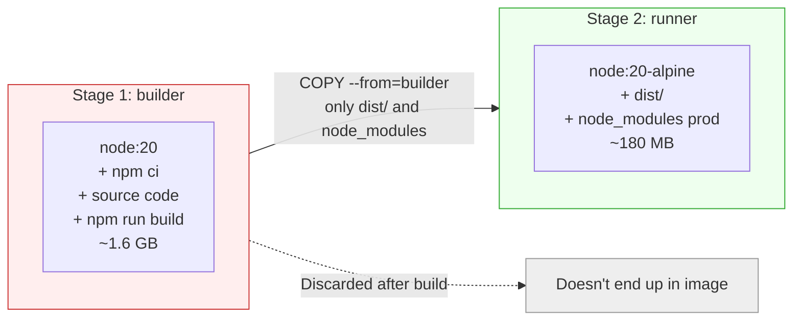
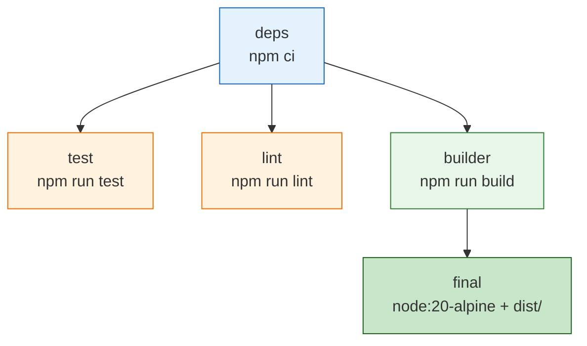
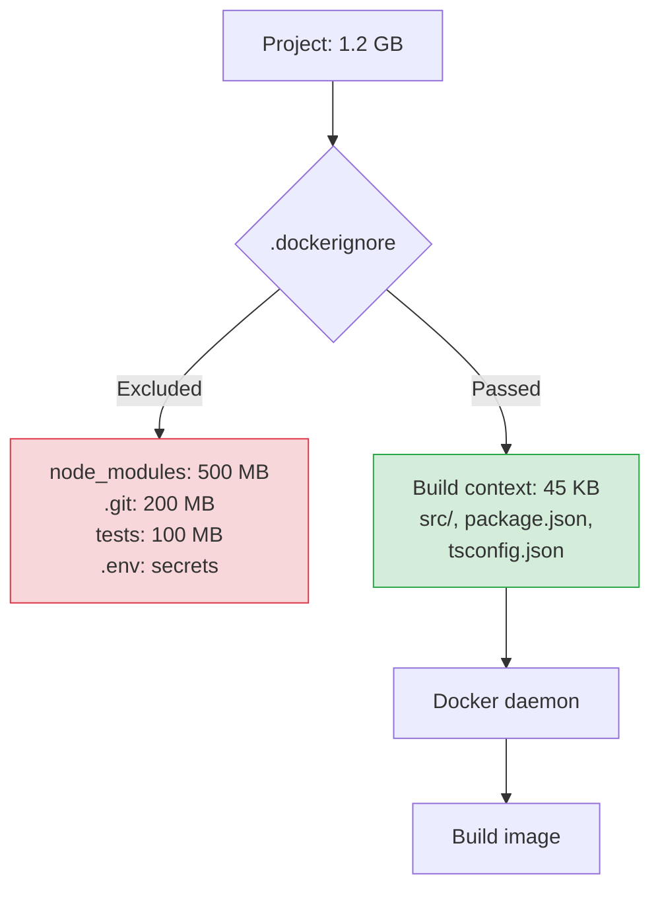

# Level 10: Optimizing Docker Images

## Introduction

Imagine you're packing for a hiking trip. You could take a huge wheeled suitcase: with a winter coat, three pairs of shoes, an iron, and a shelf of books. Everything "might come in handy." But when you need to walk 20 kilometers on a mountain trail, every extra kilogram is pain. An experienced hiker takes only the essentials, packs compactly, and chooses gear that weighs the minimum for maximum utility.

Docker images work the same way. A typical beginner developer's image is that very suitcase: a full OS with thousands of utilities, compilers, debug tools, devDependencies, package manager caches, and sometimes a `.git` folder at 200 megabytes. All of this ends up in production, where nothing listed is needed.

In this level, we will explore in detail:

1. **Size analysis** -- how to understand what exactly takes up space in an image
2. **Multi-stage builds** -- how to separate build and run so only the result ends up in production
3. **Layer caching** -- how to structure a Dockerfile so rebuild takes seconds, not minutes
4. **`.dockerignore`** -- how not to send gigabytes of junk to the Docker daemon
5. **Choosing base images** -- Alpine, slim, distroless, scratch and when to use each
6. **BuildKit** -- modern build engine with parallelism, secrets, and cache mounts
7. **Practical techniques** -- specific recipes for Node.js, Python, Go, Java

---

## 1. The Problem: Your Image Weighs 1.5 GB and Takes 15 Minutes to Build

A familiar situation: you wrote a simple Node.js API of 50 KB of source code, packaged it into a Docker image, pushed to a registry. The CI/CD pipeline works, the container starts. Everything good? Let's check the size:

```bash
$ docker images myapp
REPOSITORY  TAG     IMAGE ID       SIZE
myapp       latest  a1b2c3d4e5f6   1.47 GB
```

One and a half gigabytes for an API that's 50 KB? When you have five microservices, the picture becomes depressing:

```bash
$ docker images
REPOSITORY  TAG     SIZE
api         latest  1.47 GB
worker      latest  1.23 GB
frontend    latest  892 MB
scheduler   latest  1.1 GB
gateway     latest  987 MB
# Total: ~5.7 GB on one server, same again in registry
```

This isn't an abstract problem. These are concrete costs in money and time:

- **Deploy slows down.** Every time Kubernetes spins up a new Pod, it downloads the image. One and a half gigabytes -- that's minutes of waiting instead of seconds.
- **CI/CD gets expensive.** GitHub Actions, GitLab CI, any cloud CI charges by time. If a build takes 15 minutes instead of 2 -- you pay 7x more.
- **Registry bloats.** Storing images in ECR, GCR, or Docker Hub costs money. Every commit creates a new image -- and storage grows linearly.
- **Security suffers.** The more packages in an image, the more potential vulnerabilities. A full Debian image contains hundreds of packages, each a potential entry point for an attack.

Good news: an optimized image for the same API can weigh 15-180 MB (depending on language and approach). Build time -- 30 seconds. Deploy -- instant. And this doesn't require magic -- just understanding how Docker layers are structured.

---

## 2. Size Analysis: Where the Gigabytes Hide

Before treating, you need to diagnose. Docker provides several tools for image analysis, and it's important to know how to use them.

### docker image inspect and docker images

The simplest way to find an image's size:

```bash
# Human-readable size
docker images myapp:latest --format '{{.Repository}}:{{.Tag}} -> {{.Size}}'
# myapp:latest -> 1.47GB

# Exact size in bytes
docker image inspect --format='{{.Size}}' myapp:latest
# 1578432512
```

But the total image size is just the final number. To understand **where exactly** the megabytes hide, you need layer-by-layer analysis.

### docker history: Image X-Ray

The `docker history` command shows each layer of the image with its size and the command that created it:

```bash
$ docker history myapp:latest
IMAGE          CREATED       CREATED BY                                      SIZE
a1b2c3d4e5f6   2 mins ago   CMD ["node" "server.js"]                        0B
<missing>      2 mins ago   COPY . /app                                     1.2MB
<missing>      2 mins ago   RUN npm install                                 450MB
<missing>      2 mins ago   COPY package*.json ./                           2KB
<missing>      2 mins ago   WORKDIR /app                                    0B
<missing>      3 weeks ago  /bin/sh -c apt-get update && apt-get install..  350MB
...
```

Look carefully at these numbers. The base `node:20` image is about 800 MB (layers with `groupadd` and `apt-get install`). `npm install` adds 450 MB. And your actual code -- just 1.2 MB. In other words, **99.9% of the image is not your code**.

It's like sending a package: you put a 10-gram USB drive in a box, but the box itself is cast iron and weighs 30 kilograms.

```bash
# More compact output: only non-zero layers
docker history myapp:latest --format '{{.Size}}\t{{.CreatedBy}}' | grep -v "0B"
```

### dive: Interactive Layer Analysis

[dive](https://github.com/wagoodman/dive) is a TUI tool that shows not just layer sizes but the specific files within each layer. It's like an X-ray machine: you see what was added, changed, or deleted at each step.

```bash
# Installation
brew install dive          # macOS
sudo apt install dive      # Ubuntu/Debian

# Run
dive myapp:latest
```

The dive interface is split into two panels. On the left -- list of layers with sizes. On the right -- the file system in the selected layer. You can switch between layers with arrows and see which files appeared (green), changed (yellow), or were deleted (red).

What's often discovered through dive analysis:

- `.git/` directory at 200 MB, accidentally included in the image
- Full `node_modules` with devDependencies (TypeScript, ESLint, Jest)
- Package manager cache (`/root/.npm`, `/root/.cache/pip`)
- Temporary build files that weren't cleaned up

```bash
# CI mode: automated efficiency check
dive myapp:latest --ci

# With thresholds: fail if more than 50 MB wasted
CI=true dive myapp:latest \
  --highestWastedBytes=50mb \
  --highestUserWastedPercent=0.3 \
  --lowestEfficiency=0.95
```

CI mode of dive can be built into a pipeline: if the image doesn't pass the efficiency check, the build fails. It's like a linter, but for Docker images.

### Base Image Size Comparison

Before optimizing your Dockerfile, it's useful to understand the scale of the problem at the base image level:

```bash
$ docker images --format "table {{.Repository}}:{{.Tag}}\t{{.Size}}" | sort -k2 -h
REPOSITORY:TAG                  SIZE
alpine:3.19                     7.38MB
node:20-alpine                  135MB
python:3.12-alpine              52MB
python:3.12-slim                155MB
node:20-slim                    220MB
ubuntu:22.04                    77.8MB
golang:1.22-alpine              258MB
golang:1.22                     814MB
python:3.12                     1.02GB
node:20                         1.1GB
```

The difference between `node:20` (1.1 GB) and `node:20-alpine` (135 MB) is almost **10x**. Just by changing one line in the Dockerfile (`FROM node:20` to `FROM node:20-alpine`), you already save a gigabyte.

---

## 3. Multi-stage Builds: The Foundation of Optimization

### Analogy: Construction Site and Finished House

Imagine house construction. On the construction site you need cranes, scaffolding, concrete mixers, welding equipment, piles of bricks, and bags of cement. But when the house is built, all of this is removed. Residents move into the finished house -- they don't need a crane on the roof.

In the Docker world, "construction" is TypeScript compilation, frontend application building, downloading devDependencies. "Finished house" is compiled JavaScript, static files, production dependencies. Multi-stage build allows separating construction and the finished house in one Dockerfile.

### The Problem: Build Dependencies in Production

Without multi-stage builds, all construction junk remains in the final image:

```dockerfile
# Everything in one image
FROM node:20

WORKDIR /app
COPY package*.json ./
RUN npm install          # devDependencies too
COPY . .
RUN npm run build        # TypeScript -> JavaScript
CMD ["node", "dist/server.js"]

# What's in the image:
# - TypeScript compiler (50 MB)
# - webpack + all plugins (200 MB)
# - ESLint + Prettier (30 MB)
# - Jest + testing-library (80 MB)
# - Source maps, .ts files
# - Total: ~1.4 GB
```

Meanwhile, to **run** the application you only need `dist/server.js` and production dependencies from `node_modules`. Everything else is ballast.

### The Solution: Multiple FROMs in One Dockerfile

Multi-stage build uses multiple `FROM` instructions in one Dockerfile. Each `FROM` starts a new **stage**. The final image contains only the last stage.

```dockerfile
# Stage 1: build
FROM node:20 AS builder

WORKDIR /app
COPY package*.json ./
RUN npm ci
COPY . .
RUN npm run build

# Stage 2: production
FROM node:20-alpine AS runner

WORKDIR /app
COPY --from=builder /app/dist ./dist
COPY --from=builder /app/node_modules ./node_modules
COPY --from=builder /app/package.json ./

CMD ["node", "dist/server.js"]

# Result: ~180 MB instead of 1.4 GB
```

The key instruction is `COPY --from=builder`. It copies files **from another stage**, not from the build context. Docker discards all intermediate stages after building. Only the last stage ends up in the final image.



### Builder-Runner Pattern for Different Languages

The idea is the same for any language: first stage builds, second -- runs. But the specific implementation depends on the ecosystem.

**Node.js / TypeScript:**

```dockerfile
# Builder: full image with devDependencies
FROM node:20 AS builder
WORKDIR /app
COPY package*.json ./
RUN npm ci
COPY . .
RUN npm run build
RUN npm prune --production  # Remove devDependencies

# Runner: minimal image
FROM node:20-alpine
WORKDIR /app
RUN addgroup -S appgroup && adduser -S appuser -G appgroup
COPY --from=builder --chown=appuser:appgroup /app/dist ./dist
COPY --from=builder --chown=appuser:appgroup /app/node_modules ./node_modules
COPY --from=builder /app/package.json ./
USER appuser
EXPOSE 3000
CMD ["node", "dist/server.js"]
```

**Go:** Here multi-stage shines in full, because Go compiles to a static binary. The final image can be `scratch` -- literally empty:

```dockerfile
# Builder
FROM golang:1.22-alpine AS builder
WORKDIR /app
COPY go.mod go.sum ./
RUN go mod download
COPY . .
RUN CGO_ENABLED=0 GOOS=linux go build -ldflags="-w -s" -o /app/server ./cmd/server

# Runner: empty image
FROM scratch
COPY --from=builder /app/server /server
COPY --from=builder /etc/ssl/certs/ca-certificates.crt /etc/ssl/certs/
EXPOSE 8080
ENTRYPOINT ["/server"]
# Result: 10-15 MB
```

**Python:**

```dockerfile
# Builder
FROM python:3.12-slim AS builder
WORKDIR /app
RUN python -m venv /opt/venv
ENV PATH="/opt/venv/bin:$PATH"
COPY requirements.txt .
RUN pip install --no-cache-dir -r requirements.txt
COPY . .

# Runner
FROM python:3.12-slim
WORKDIR /app
COPY --from=builder /opt/venv /opt/venv
ENV PATH="/opt/venv/bin:$PATH"
COPY --from=builder /app .
CMD ["python", "main.py"]
```

**Java (Maven):**

```dockerfile
# Builder
FROM maven:3.9-eclipse-temurin-21 AS builder
WORKDIR /app
COPY pom.xml .
RUN mvn dependency:go-offline
COPY src ./src
RUN mvn package -DskipTests

# Runner: JRE only, no JDK or Maven
FROM eclipse-temurin:21-jre-alpine
WORKDIR /app
COPY --from=builder /app/target/*.jar app.jar
EXPOSE 8080
ENTRYPOINT ["java", "-jar", "app.jar"]
```

### Advanced Pattern: Multiple Parallel Stages

Multi-stage doesn't have to be just two stages. Stages can branch, and BuildKit will build independent branches **in parallel**:

```dockerfile
# Stage 1: shared dependencies
FROM node:20-alpine AS deps
WORKDIR /app
COPY package*.json ./
RUN npm ci

# Stage 2a: tests (branch)
FROM deps AS test
COPY . .
RUN npm run test

# Stage 2b: linting (branch, parallel with tests)
FROM deps AS lint
COPY . .
RUN npm run lint

# Stage 2c: build (branch, parallel with tests and linting)
FROM deps AS builder
COPY . .
RUN npm run build
RUN npm prune --production

# Stage 3: final image
FROM node:20-alpine
WORKDIR /app
COPY --from=builder /app/dist ./dist
COPY --from=builder /app/node_modules ./node_modules
CMD ["node", "dist/server.js"]
```

You can build only the stage you need:

```bash
# Run only tests
docker build --target test -t myapp-test .

# Run only linter
docker build --target lint -t myapp-lint .

# Full build (default -- last stage)
docker build -t myapp .
```



### COPY --from with External Images

`COPY --from` can copy not only from previous stages but also from any public images:

```dockerfile
# Copy nginx config from the official image
COPY --from=nginx:alpine /etc/nginx/nginx.conf /etc/nginx/nginx.conf

# Copy a utility binary
COPY --from=aquasec/trivy:latest /usr/local/bin/trivy /usr/local/bin/trivy
```

This is convenient when you need one utility from another image without installing the entire package.

---

## 4. Layer Caching: Why Instruction Order Matters

### How Caching Works

Each instruction in a Dockerfile creates a new **layer**. Docker caches each layer and on rebuild checks three conditions:

1. The parent layer is from cache (didn't rebuild)
2. The instruction itself hasn't changed
3. For `COPY`/`ADD` -- files haven't changed (compared by checksum)

If all three conditions are met -- the layer is taken from cache. If at least one is violated -- the layer rebuilds, and **all subsequent layers also rebuild**. This is the key rule. Cache works like a chain: one link breaks, and the entire chain below it falls apart.

Analogy: imagine a factory conveyor. If machine number 3 of 10 broke, everything done on machines 1 and 2 can be reused. But machines 3 through 10 must rework the part from scratch.


### Rule: Rarely Changing -- Top, Frequently -- Bottom

From understanding how caching works follows the main rule: instructions that **change rarely** should be **at the beginning** of the Dockerfile, and instructions that **change frequently** -- at the end.

Dependencies (`package.json`, `requirements.txt`, `go.mod`) change much less often than source code. If you put `COPY . .` before dependency installation, any code change invalidates the dependency installation cache:

```dockerfile
# Bad order: any code change rebuilds npm install
FROM node:20-alpine
WORKDIR /app
COPY . .                   # Code changes often
RUN npm install            # Rebuilds EVERY time
RUN npm run build
CMD ["node", "dist/server.js"]
```

```dockerfile
# Good order: dependencies cached separately
FROM node:20-alpine
WORKDIR /app
COPY package.json package-lock.json ./   # Changes rarely
RUN npm ci                               # Cached
COPY . .                                 # Code changes often
RUN npm run build                        # Build only
CMD ["node", "dist/server.js"]
```

In the second variant, when you change only source code, `npm ci` is taken from cache. This saves minutes on every build.

### Combining RUN: Why Deleting Files Doesn't Help

Each `RUN` creates a new layer. Layers in Docker work on the **union filesystem** principle -- they stack on top of each other, like transparent films. If a file is created on layer N and deleted on layer N+1, it **still stored** on layer N. Deletion only "hides" the file on the next level but doesn't free space.

Analogy: imagine a stack of transparent films. A square is drawn on the first film. On the second film, a white sticker is placed over the square. When you look from above -- the square is invisible. But if you remove the second film -- it's still there. The stack weighs as much as both films combined.

```dockerfile
# Three layers: APT cache remains in the first layer forever
RUN apt-get update
RUN apt-get install -y curl wget
RUN rm -rf /var/lib/apt/lists/*
# Size: 150 MB (APT cache in first layer didn't go anywhere)
```

```dockerfile
# One layer: cache deleted in the same layer
RUN apt-get update \
    && apt-get install -y --no-install-recommends curl wget \
    && rm -rf /var/lib/apt/lists/*
# Size: 50 MB
```

The same principle for all package managers:

```dockerfile
# pip: cache remains in RUN pip install layer
RUN pip install -r requirements.txt
RUN rm -rf /root/.cache/pip   # Doesn't help

# pip: cache deletion during installation
RUN pip install --no-cache-dir -r requirements.txt
```

### Optimal Layer Order Examples

**Python:**

```dockerfile
FROM python:3.12-slim
WORKDIR /app

# Layer 1: system dependencies (change very rarely)
RUN apt-get update \
    && apt-get install -y --no-install-recommends gcc libpq-dev \
    && rm -rf /var/lib/apt/lists/*

# Layer 2: Python dependencies (change rarely)
COPY requirements.txt .
RUN pip install --no-cache-dir -r requirements.txt

# Layer 3: application code (changes often)
COPY . .
CMD ["python", "main.py"]
```

**Go:**

```dockerfile
FROM golang:1.22-alpine
WORKDIR /app

# Layer 1: dependencies (cached until go.mod/go.sum change)
COPY go.mod go.sum ./
RUN go mod download

# Layer 2: code (changes often)
COPY . .
RUN go build -o /app/server ./cmd/server
```

### BuildKit Cache Mounts

BuildKit provides `--mount=type=cache` -- a mechanism for caching package manager directories **between builds**. Unlike regular layer caching, cache mounts are stored separately and don't end up in the final image.

Think of it as a locker on a construction site: every day the builder doesn't bring all tools from home, but leaves them in the locker on site. The next day, the tools are already there.

```dockerfile
# syntax=docker/dockerfile:1

# Node.js: npm cache between builds
FROM node:20-alpine
WORKDIR /app
COPY package*.json ./
RUN --mount=type=cache,target=/root/.npm \
    npm ci
COPY . .
RUN npm run build
```

```dockerfile
# syntax=docker/dockerfile:1

# Python: pip cache between builds
FROM python:3.12-slim
WORKDIR /app
COPY requirements.txt .
RUN --mount=type=cache,target=/root/.cache/pip \
    pip install -r requirements.txt
COPY . .
```

```dockerfile
# syntax=docker/dockerfile:1

# Go: module cache and compilation cache
FROM golang:1.22-alpine
WORKDIR /app
COPY go.mod go.sum ./
RUN --mount=type=cache,target=/go/pkg/mod \
    go mod download
COPY . .
RUN --mount=type=cache,target=/root/.cache/go-build \
    go build -o server .
```

Note the `# syntax=docker/dockerfile:1` line at the beginning -- it activates the extended Dockerfile syntax needed for cache mounts.

---

## 5. .dockerignore: Build Context Control

### What Is Build Context and Why It Matters

When you run `docker build .`, Docker doesn't just read the Dockerfile. It takes the **entire directory** (the dot is the path to the build context) and sends it entirely to the Docker daemon. Only then does the build begin.

```bash
$ docker build .
Sending build context to Docker daemon  1.2GB   # <-- everything in the directory
```

If the directory contains `.git/` (200 MB), `node_modules/` (500 MB), test data (300 MB) -- all of this gets packaged and sent to the daemon. Even if your Dockerfile copies only one file.

Analogy: you ask a courier to deliver a document from the office. But instead of giving them an envelope with the document, you load the entire office contents into their truck -- cabinets, desks, water cooler. The courier will pull out only the needed document from all this, but the loading time is already spent.

### .dockerignore Syntax

`.dockerignore` works similarly to `.gitignore` -- excludes files and directories from the build context:

```dockerignore
# Dependencies (reinstalled during build)
node_modules
.venv

# Version control
.git
.gitignore

# IDE
.vscode
.idea
*.swp

# Environment variables (secrets!)
.env
.env.*
!.env.example

# Build results (rebuilt during build)
dist
build
coverage

# Tests (not needed in production)
**/*.test.ts
**/*.spec.ts
__tests__
jest.config.*

# Documentation
*.md
!README.md

# Docker files (not needed inside the image)
Dockerfile*
docker-compose*.yml
.dockerignore

# OS artifacts
.DS_Store
Thumbs.db

# CI/CD
.github
.gitlab-ci.yml
```

### .dockerignore Impact on Build

The difference between building with and without `.dockerignore` can be colossal:

```bash
# Without .dockerignore
$ docker build .
Sending build context to Docker daemon  1.2GB
...
Total build time: 2m 30s

# With proper .dockerignore
$ docker build .
Sending build context to Docker daemon  45KB
...
Total build time: 45s
```

Besides speed, `.dockerignore` solves a security problem. Without it, `.env` files with database passwords and API keys can accidentally end up in the image. Even if the Dockerfile doesn't explicitly copy `.env` -- `COPY . .` copies everything in the build context.



---

## 6. Choosing Base Images

### The Spectrum of Options

Choosing a base image is balancing between size, compatibility, and debugging convenience. Here's the spectrum from heaviest to lightest:

| Type | Example | Size | What's inside | When to use |
|-----|--------|--------|------------|---|
| **Full** | `node:20` | 800 MB - 1.1 GB | Debian + system packages + runtime | Development, debugging |
| **Slim** | `node:20-slim` | 150-250 MB | Minimal Debian + runtime | Production for Python with C extensions |
| **Alpine** | `node:20-alpine` | 50-140 MB | Alpine Linux + runtime | Production for Node.js, Go, simple services |
| **Distroless** | `gcr.io/distroless/nodejs20` | 120-170 MB | Runtime only, no shell | Production with enhanced security |
| **Scratch** | `scratch` | 0 MB | Absolutely empty | Static Go, Rust binaries |

### Alpine: Compactness with Caveats

Alpine Linux is a minimalist distribution built on **musl libc** instead of the familiar **glibc**. This makes it very small but can cause issues with libraries expecting glibc.

When Alpine works great:

```dockerfile
FROM node:20-alpine     # Node.js
FROM golang:1.22-alpine # Go
FROM nginx:alpine       # Nginx
FROM redis:alpine       # Redis
```

When Alpine can let you down:

```dockerfile
FROM python:3.12-alpine
# Many Python packages with C extensions (numpy, pandas, psycopg2)
# require compilation and additional system libraries
RUN apk add --no-cache gcc musl-dev linux-headers
# Build can be slow and fragile
# Simpler to use python:3.12-slim
```

Practical rule: if your application is pure... (no C extensions needed), Alpine is great. If you need C extensions, consider slim or full variants.

### Distroless: Security-Focused

Distroless images from Google contain only the runtime and nothing else. No shell, no package manager, no utilities. This dramatically reduces the attack surface.

```dockerfile
FROM gcr.io/distroless/nodejs20
COPY --from=builder /app/dist ./dist
COPY --from=builder /app/node_modules ./node_modules
CMD ["dist/server.js"]
```

The downside: you can't `docker exec` into a distroless container for debugging. Use them when security is the top priority.

### Scratch: The Absolute Minimum

`scratch` is a special empty image. It contains nothing -- not even a shell or basic utilities. Use it only for statically compiled binaries:

```dockerfile
FROM scratch
COPY --from=builder /app/server /server
EXPOSE 8080
ENTRYPOINT ["/server"]
```

---

## Summary

Optimizing Docker images is about reducing size and build time while maintaining functionality and security:

- **Multi-stage builds** -- separate build and run environments; the final image contains only what's needed to run
- **Layer caching** -- order instructions from rarely changing to frequently changing; combine RUN commands
- **.dockerignore** -- exclude node_modules, .git, .env, test files, build results
- **Base image choice** -- Alpine for minimal size, slim for compatibility, distroless for security, scratch for static binaries
- **BuildKit cache mounts** -- persist package manager caches between builds without bloating the image

Key rules:
- ✅ Always use multi-stage builds for production images
- ✅ Order Dockerfile instructions for maximum cache efficiency
- ✅ Use Alpine or slim base images for production
- ✅ Always create a .dockerignore file
- ✅ Use BuildKit cache mounts for faster builds
- ❌ Don't include devDependencies in production images
- ❌ Don't leave package manager caches in the final image
- ❌ Don't use `latest` tag for base images in production
