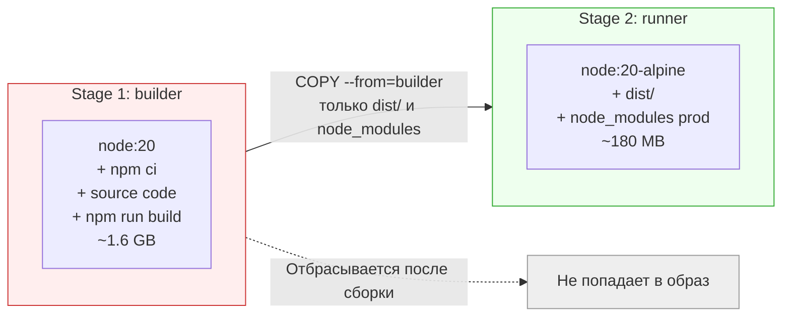
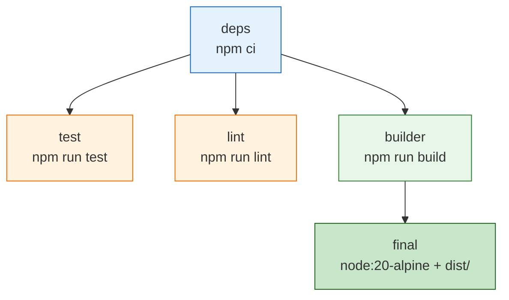
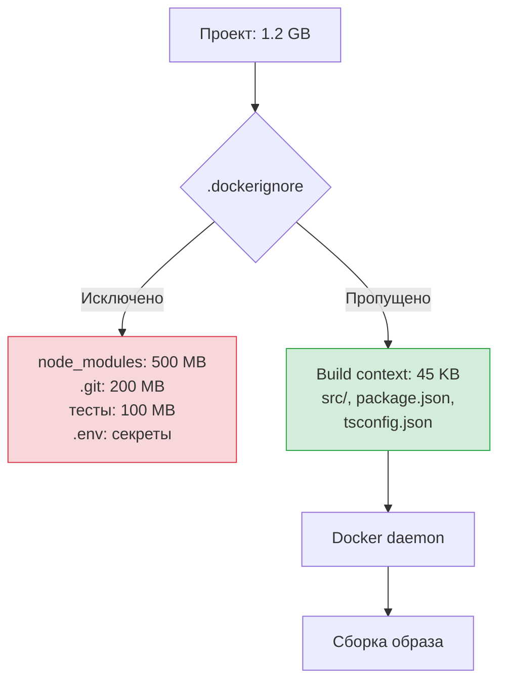
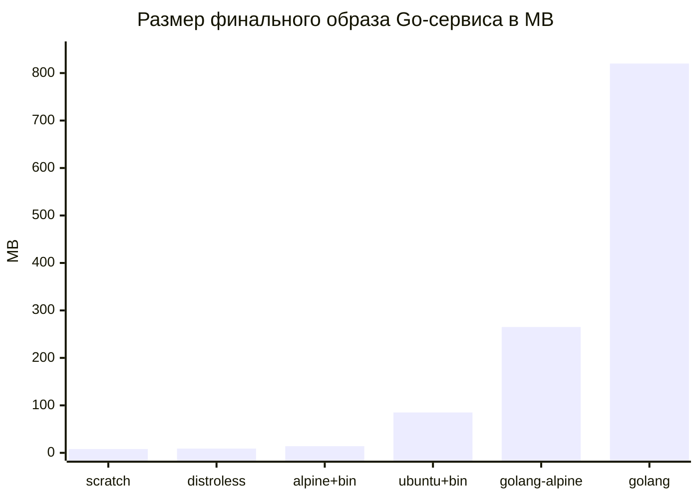
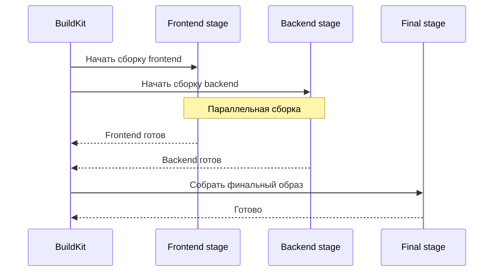

# Уровень 10: Оптимизация Docker-образов

## Введение

Представьте, что вы собираетесь в поход. Можно взять с собой огромный чемодан на колёсиках: с зимней курткой, тремя парами обуви, утюгом и книгами на полке. Всё это "может пригодиться". Но когда вам нужно пройти 20 километров по горной тропе, каждый лишний килограмм -- это боль. Опытный турист берёт только самое необходимое, упаковывает компактно и выбирает снаряжение, которое весит минимум при максимальной пользе.

Docker-образы устроены так же. Типичный образ начинающего разработчика -- это тот самый чемодан: полная ОС с тысячами утилит, компиляторы, отладочные инструменты, devDependencies, кэши пакетных менеджеров, а иногда и папка `.git` на 200 мегабайт. Всё это оказывается в production, где ничего из перечисленного не нужно.

На этом уровне мы подробно разберём:

1. **Анализ размера** -- как понять, что именно занимает место в образе
2. **Multi-stage builds** -- как разделить сборку и запуск, чтобы в production попадал только результат
3. **Кэширование слоёв** -- как выстроить Dockerfile так, чтобы пересборка занимала секунды, а не минуты
4. **`.dockerignore`** -- как не отправлять гигабайты мусора в Docker daemon
5. **Выбор базовых образов** -- Alpine, slim, distroless, scratch и когда какой использовать
6. **BuildKit** -- современный движок сборки с параллелизмом, секретами и cache mounts
7. **Практические приёмы** -- конкретные рецепты для Node.js, Python, Go, Java

---

## 1. Проблема: ваш образ весит 1.5 ГБ и собирается 15 минут

Ситуация, знакомая каждому: вы написали простой Node.js API на 50 КБ исходного кода, упаковали его в Docker-образ, запушили в registry. CI/CD пайплайн работает, контейнер запускается. Всё хорошо? Посмотрим на размер:

```bash
$ docker images myapp
REPOSITORY  TAG     IMAGE ID       SIZE
myapp       latest  a1b2c3d4e5f6   1.47 GB
```

Полтора гигабайта для API, который занимает 50 КБ? Когда у вас пять микросервисов, картина становится удручающей:

```bash
$ docker images
REPOSITORY  TAG     SIZE
api         latest  1.47 GB
worker      latest  1.23 GB
frontend    latest  892 MB
scheduler   latest  1.1 GB
gateway     latest  987 MB
# Итого: ~5.7 ГБ на одном сервере, ещё столько же в registry
```

Это не абстрактная проблема. Это конкретные деньги и время:

- **Деплой замедляется.** Каждый раз, когда Kubernetes поднимает новый Pod, он скачивает образ. Полтора гигабайта -- это минуты ожидания вместо секунд.
- **CI/CD дорожает.** GitHub Actions, GitLab CI, любой облачный CI тарифицирует по времени. Если сборка занимает 15 минут вместо 2 -- вы платите в 7 раз больше.
- **Registry раздувается.** Хранение образов в ECR, GCR или Docker Hub стоит денег. При каждом коммите создаётся новый образ -- и хранилище растёт линейно.
- **Безопасность страдает.** Чем больше пакетов в образе, тем больше потенциальных уязвимостей. Полный Debian-образ содержит сотни пакетов, каждый из которых -- потенциальная точка входа для атаки.

Хорошая новость: оптимизированный образ для того же API может весить 15--180 МБ (в зависимости от языка и подхода). Сборка -- 30 секунд. Деплой -- мгновенный. И для этого не нужна магия -- нужно понимание того, как устроены слои Docker.

---

## 2. Анализ размера: где прячутся гигабайты

Прежде чем лечить, нужно поставить диагноз. Docker предоставляет несколько инструментов для анализа образов, и важно уметь ими пользоваться.

### docker image inspect и docker images

Самый простой способ узнать размер образа:

```bash
# Размер в человекочитаемом формате
docker images myapp:latest --format '{{.Repository}}:{{.Tag}} -> {{.Size}}'
# myapp:latest -> 1.47GB

# Точный размер в байтах
docker image inspect --format='{{.Size}}' myapp:latest
# 1578432512
```

Но размер всего образа -- это лишь итоговое число. Чтобы понять, **где именно** скрываются мегабайты, нужен послойный анализ.

### docker history: рентген образа

Команда `docker history` показывает каждый слой образа с его размером и командой, которая его создала:

```bash
$ docker history myapp:latest
IMAGE          CREATED       CREATED BY                                      SIZE
a1b2c3d4e5f6   2 mins ago   CMD ["node" "server.js"]                        0B
<missing>      2 mins ago   COPY . /app                                     1.2MB
<missing>      2 mins ago   RUN npm install                                 450MB
<missing>      2 mins ago   COPY package*.json ./                           2KB
<missing>      2 mins ago   WORKDIR /app                                    0B
<missing>      3 weeks ago  /bin/sh -c apt-get update && apt-get install..  350MB
<missing>      3 weeks ago  /bin/sh -c #(nop) CMD ["node"]                  0B
<missing>      3 weeks ago  /bin/sh -c groupadd --gid 1000 node...         450MB
```

Посмотрите внимательно на эти числа. Базовый образ `node:20` -- это около 800 МБ (слои с `groupadd` и `apt-get install`). `npm install` добавляет 450 МБ. А собственно ваш код -- всего 1.2 МБ. Другими словами, **99.9% образа -- это не ваш код**.

Это как если бы вы отправляли посылку: кладёте в коробку флешку на 10 грамм, но сама коробка -- из чугуна и весит 30 килограмм.

```bash
# Более компактный вывод: только слои с ненулевым размером
docker history myapp:latest --format '{{.Size}}\t{{.CreatedBy}}' | grep -v "0B"
```

### dive: интерактивный анализ слоёв

[dive](https://github.com/wagoodman/dive) -- это TUI-инструмент, который показывает не просто размеры слоёв, а конкретные файлы внутри каждого слоя. Это как рентгеновский аппарат: вы видите, что именно добавилось, изменилось или удалилось на каждом шаге.

```bash
# Установка
brew install dive          # macOS
sudo apt install dive      # Ubuntu/Debian (через snap или .deb)

# Запуск
dive myapp:latest
```

Интерфейс dive разделён на две панели. Слева -- список слоёв с размерами. Справа -- файловая система в выбранном слое. Вы можете переключаться между слоями стрелками и видеть, какие файлы появились (зелёные), изменились (жёлтые) или были удалены (красные).

Что часто обнаруживается при анализе через dive:

- Директория `.git/` на 200 МБ, случайно попавшая в образ
- Полный `node_modules` с devDependencies (TypeScript, ESLint, Jest)
- Кэш пакетного менеджера (`/root/.npm`, `/root/.cache/pip`)
- Временные файлы сборки, которые не были очищены

```bash
# CI-режим: автоматическая проверка эффективности
dive myapp:latest --ci

# С порогами: упасть, если потеряно больше 50 МБ
CI=true dive myapp:latest \
  --highestWastedBytes=50mb \
  --highestUserWastedPercent=0.3 \
  --lowestEfficiency=0.95
```

CI-режим dive можно встроить в пайплайн: если образ не проходит проверку эффективности, сборка падает. Это как линтер, но для Docker-образов.

### Сравнение размеров базовых образов

Прежде чем оптимизировать свой Dockerfile, полезно понять масштаб проблемы на уровне базовых образов:

```bash
$ docker images --format "table {{.Repository}}:{{.Tag}}\t{{.Size}}" | sort -k2 -h
REPOSITORY:TAG                  SIZE
alpine:3.19                     7.38MB
node:20-alpine                  135MB
python:3.12-alpine              52MB
python:3.12-slim                155MB
node:20-slim                    220MB
ubuntu:22.04                    77.8MB
golang:1.22-alpine              258MB
golang:1.22                     814MB
python:3.12                     1.02GB
node:20                         1.1GB
```

Разница между `node:20` (1.1 ГБ) и `node:20-alpine` (135 МБ) -- почти **10 раз**. Просто поменяв одну строчку в Dockerfile (`FROM node:20` на `FROM node:20-alpine`), вы уже экономите гигабайт.

---

## 3. Multi-stage builds: фундамент оптимизации

### Аналогия: строительная площадка и готовый дом

Представьте строительство дома. На стройке нужны краны, леса, бетономешалки, сварочные аппараты, горы кирпича и мешки с цементом. Но когда дом построен, всё это убирают. В готовый дом заезжают жильцы -- им не нужен кран на крыше.

В Docker-мире "стройка" -- это компиляция TypeScript, сборка frontend-приложения, скачивание devDependencies. "Готовый дом" -- это скомпилированный JavaScript, статические файлы, production-зависимости. Multi-stage build позволяет разделить стройку и готовый дом в одном Dockerfile.

### Проблема: сборочные зависимости в production

Без multi-stage builds весь мусор стройки остаётся в финальном образе:

```dockerfile
# Всё в одном образе
FROM node:20

WORKDIR /app
COPY package*.json ./
RUN npm install          # devDependencies тоже
COPY . .
RUN npm run build        # TypeScript -> JavaScript
CMD ["node", "dist/server.js"]

# Что в образе:
# - TypeScript compiler (50 MB)
# - webpack + все плагины (200 MB)
# - ESLint + Prettier (30 MB)
# - Jest + testing-library (80 MB)
# - Source maps, .ts файлы
# - Итого: ~1.4 GB
```

При этом для **запуска** приложения нужен только `dist/server.js` и production-зависимости из `node_modules`. Всё остальное -- балласт.

### Решение: несколько FROM в одном Dockerfile

Multi-stage build использует несколько инструкций `FROM` в одном Dockerfile. Каждая `FROM` начинает новый **stage** (этап). Финальный образ содержит только последний stage.

```dockerfile
# Stage 1: сборка
FROM node:20 AS builder

WORKDIR /app
COPY package*.json ./
RUN npm ci
COPY . .
RUN npm run build

# Stage 2: production
FROM node:20-alpine AS runner

WORKDIR /app
COPY --from=builder /app/dist ./dist
COPY --from=builder /app/node_modules ./node_modules
COPY --from=builder /app/package.json ./

CMD ["node", "dist/server.js"]

# Результат: ~180 MB вместо 1.4 GB
```

Ключевая инструкция -- `COPY --from=builder`. Она копирует файлы **из другого stage**, а не из build context. Docker отбрасывает все промежуточные stages после сборки. В финальный образ попадает только последний stage.



### Паттерн builder-runner для разных языков

Идея одна и та же для любого языка: первый stage собирает, второй -- запускает. Но конкретная реализация зависит от экосистемы.

**Node.js / TypeScript:**

```dockerfile
# Builder: полный образ с devDependencies
FROM node:20 AS builder
WORKDIR /app
COPY package*.json ./
RUN npm ci
COPY . .
RUN npm run build
RUN npm prune --production  # Удалить devDependencies

# Runner: минимальный образ
FROM node:20-alpine
WORKDIR /app
RUN addgroup -S appgroup && adduser -S appuser -G appgroup
COPY --from=builder --chown=appuser:appgroup /app/dist ./dist
COPY --from=builder --chown=appuser:appgroup /app/node_modules ./node_modules
COPY --from=builder /app/package.json ./
USER appuser
EXPOSE 3000
CMD ["node", "dist/server.js"]
```

**Go:** Здесь multi-stage раскрывается во всей красе, потому что Go компилирует в статический бинарник. Финальный образ может быть `scratch` -- буквально пустым:

```dockerfile
# Builder
FROM golang:1.22-alpine AS builder
WORKDIR /app
COPY go.mod go.sum ./
RUN go mod download
COPY . .
RUN CGO_ENABLED=0 GOOS=linux go build -ldflags="-w -s" -o /app/server ./cmd/server

# Runner: пустой образ
FROM scratch
COPY --from=builder /app/server /server
COPY --from=builder /etc/ssl/certs/ca-certificates.crt /etc/ssl/certs/
EXPOSE 8080
ENTRYPOINT ["/server"]
# Результат: 10-15 MB
```

**Python:**

```dockerfile
# Builder
FROM python:3.12-slim AS builder
WORKDIR /app
RUN python -m venv /opt/venv
ENV PATH="/opt/venv/bin:$PATH"
COPY requirements.txt .
RUN pip install --no-cache-dir -r requirements.txt
COPY . .

# Runner
FROM python:3.12-slim
WORKDIR /app
COPY --from=builder /opt/venv /opt/venv
ENV PATH="/opt/venv/bin:$PATH"
COPY --from=builder /app .
CMD ["python", "main.py"]
```

**Java (Maven):**

```dockerfile
# Builder
FROM maven:3.9-eclipse-temurin-21 AS builder
WORKDIR /app
COPY pom.xml .
RUN mvn dependency:go-offline
COPY src ./src
RUN mvn package -DskipTests

# Runner: только JRE, без JDK и Maven
FROM eclipse-temurin:21-jre-alpine
WORKDIR /app
COPY --from=builder /app/target/*.jar app.jar
EXPOSE 8080
ENTRYPOINT ["java", "-jar", "app.jar"]
```

### Продвинутый паттерн: несколько параллельных stages

Multi-stage -- это не обязательно два этапа. Stages могут ветвиться, и BuildKit соберёт независимые ветки **параллельно**:

```dockerfile
# Stage 1: общие зависимости
FROM node:20-alpine AS deps
WORKDIR /app
COPY package*.json ./
RUN npm ci

# Stage 2a: тесты (ветка)
FROM deps AS test
COPY . .
RUN npm run test

# Stage 2b: линтинг (ветка, параллельно с тестами)
FROM deps AS lint
COPY . .
RUN npm run lint

# Stage 2c: сборка (ветка, параллельно с тестами и линтингом)
FROM deps AS builder
COPY . .
RUN npm run build
RUN npm prune --production

# Stage 3: финальный образ
FROM node:20-alpine
WORKDIR /app
COPY --from=builder /app/dist ./dist
COPY --from=builder /app/node_modules ./node_modules
CMD ["node", "dist/server.js"]
```

Можно собрать только нужный stage:

```bash
# Запустить только тесты
docker build --target test -t myapp-test .

# Запустить только линтер
docker build --target lint -t myapp-lint .

# Полная сборка (по умолчанию -- последний stage)
docker build -t myapp .
```



### COPY --from с внешними образами

`COPY --from` может копировать не только из предыдущих stages, но и из любых публичных образов:

```dockerfile
# Скопировать nginx конфиг из официального образа
COPY --from=nginx:alpine /etc/nginx/nginx.conf /etc/nginx/nginx.conf

# Скопировать бинарник утилиты
COPY --from=aquasec/trivy:latest /usr/local/bin/trivy /usr/local/bin/trivy
```

Это удобно, когда вам нужна одна утилита из другого образа без установки всего пакета.

---

## 4. Кэширование слоёв: почему порядок инструкций решает всё

### Как работает кэш

Каждая инструкция в Dockerfile создаёт новый **слой**. Docker кэширует каждый слой и при повторной сборке проверяет три условия:

1. Родительский слой взят из кэша (не пересобирался)
2. Сама инструкция не изменилась
3. Для `COPY`/`ADD` -- файлы не изменились (сравнение по checksum)

Если все три условия выполнены -- слой берётся из кэша. Если хотя бы одно нарушено -- слой пересобирается, и **все последующие слои тоже пересобираются**. Это ключевое правило. Кэш работает как цепочка: стоит одному звену сломаться, и вся цепь ниже -- рассыпается.

Аналогия: представьте конвейер на заводе. Если станок номер 3 из 10 сломался, всё, что было сделано на станках 1 и 2, можно использовать повторно. Но станки с 3 по 10 должны переработать деталь заново.


### Правило: редко меняющееся -- сверху, часто -- снизу

Из понимания работы кэша следует главное правило: инструкции, которые **меняются редко**, должны стоять **в начале** Dockerfile, а инструкции, которые **меняются часто** -- в конце.

Зависимости (`package.json`, `requirements.txt`, `go.mod`) меняются гораздо реже, чем исходный код. Если поставить `COPY . .` перед установкой зависимостей, любое изменение в коде инвалидирует кэш установки зависимостей:

```dockerfile
# Плохой порядок: любое изменение кода пересобирает npm install
FROM node:20-alpine
WORKDIR /app
COPY . .                   # Код меняется часто
RUN npm install            # Пересобирается КАЖДЫЙ раз
RUN npm run build
CMD ["node", "dist/server.js"]
```

```dockerfile
# Хороший порядок: зависимости кэшируются отдельно
FROM node:20-alpine
WORKDIR /app
COPY package.json package-lock.json ./   # Меняется редко
RUN npm ci                               # Кэшируется
COPY . .                                 # Код меняется часто
RUN npm run build                        # Только сборка
CMD ["node", "dist/server.js"]
```

Во втором варианте, когда вы меняете только исходный код, `npm ci` берётся из кэша. Это экономит минуты при каждой сборке.

### Объединение RUN: почему удаление файлов не помогает

Каждый `RUN` создаёт новый слой. Слои в Docker работают по принципу **union filesystem** -- они накладываются друг на друга, как прозрачные плёнки. Если файл создан на слое N и удалён на слое N+1, он **всё равно хранится** на слое N. Удаление лишь "прячет" файл на следующем уровне, но не освобождает место.

Аналогия: представьте стопку прозрачных плёнок. На первой плёнке нарисован квадрат. На второй плёнке поверх квадрата наклеен белый стикер. Когда вы смотрите сверху -- квадрата не видно. Но если снять вторую плёнку -- он на месте. Стопка весит столько же, сколько весили бы обе плёнки вместе.

```dockerfile
# Три слоя: кэш APT остаётся в первом слое навсегда
RUN apt-get update
RUN apt-get install -y curl wget
RUN rm -rf /var/lib/apt/lists/*
# Размер: 150 MB (кэш APT в первом слое никуда не делся)
```

```dockerfile
# Один слой: кэш удаляется в том же слое
RUN apt-get update \
    && apt-get install -y --no-install-recommends curl wget \
    && rm -rf /var/lib/apt/lists/*
# Размер: 50 MB
```

Тот же принцип для всех пакетных менеджеров:

```dockerfile
# pip: кэш остаётся в слое RUN pip install
RUN pip install -r requirements.txt
RUN rm -rf /root/.cache/pip   # Не помогает

# pip: удаление кэша при установке
RUN pip install --no-cache-dir -r requirements.txt
```

### Примеры оптимального порядка слоёв

**Python:**

```dockerfile
FROM python:3.12-slim
WORKDIR /app

# Слой 1: системные зависимости (меняются очень редко)
RUN apt-get update \
    && apt-get install -y --no-install-recommends gcc libpq-dev \
    && rm -rf /var/lib/apt/lists/*

# Слой 2: Python-зависимости (меняются редко)
COPY requirements.txt .
RUN pip install --no-cache-dir -r requirements.txt

# Слой 3: код приложения (меняется часто)
COPY . .
CMD ["python", "main.py"]
```

**Go:**

```dockerfile
FROM golang:1.22-alpine
WORKDIR /app

# Слой 1: зависимости (кэшируются, пока go.mod/go.sum не изменятся)
COPY go.mod go.sum ./
RUN go mod download

# Слой 2: код (меняется часто)
COPY . .
RUN go build -o /app/server ./cmd/server
```

### BuildKit cache mounts

BuildKit предоставляет `--mount=type=cache` -- механизм кэширования директорий пакетных менеджеров **между сборками**. В отличие от обычного кэша слоёв, cache mount хранится отдельно и не попадает в финальный образ.

Представьте это как шкафчик на стройке: каждый рабочий день строитель не привозит все инструменты из дома, а оставляет их в шкафчике на площадке. На следующий день инструменты уже на месте.

```dockerfile
# syntax=docker/dockerfile:1

# Node.js: кэш npm между сборками
FROM node:20-alpine
WORKDIR /app
COPY package*.json ./
RUN --mount=type=cache,target=/root/.npm \
    npm ci
COPY . .
RUN npm run build
```

```dockerfile
# syntax=docker/dockerfile:1

# Python: кэш pip между сборками
FROM python:3.12-slim
WORKDIR /app
COPY requirements.txt .
RUN --mount=type=cache,target=/root/.cache/pip \
    pip install -r requirements.txt
COPY . .
```

```dockerfile
# syntax=docker/dockerfile:1

# Go: кэш модулей и кэш компиляции
FROM golang:1.22-alpine
WORKDIR /app
COPY go.mod go.sum ./
RUN --mount=type=cache,target=/go/pkg/mod \
    go mod download
COPY . .
RUN --mount=type=cache,target=/root/.cache/go-build \
    go build -o server .
```

```dockerfile
# syntax=docker/dockerfile:1

# APT: кэш пакетов между сборками
FROM ubuntu:22.04
RUN --mount=type=cache,target=/var/cache/apt \
    --mount=type=cache,target=/var/lib/apt/lists \
    apt-get update && apt-get install -y curl
```

Обратите внимание на строку `# syntax=docker/dockerfile:1` в начале файла -- она активирует расширенный синтаксис Dockerfile, необходимый для cache mounts.

---

## 5. .dockerignore: контроль контекста сборки

### Что такое build context и почему он важен

Когда вы выполняете `docker build .`, Docker не просто читает Dockerfile. Он берёт **всю директорию** (точка -- это путь к build context) и отправляет её целиком в Docker daemon. Только после этого начинается сборка.

```bash
$ docker build .
Sending build context to Docker daemon  1.2GB   # <-- всё содержимое директории
```

Если в директории лежит `.git/` (200 МБ), `node_modules/` (500 МБ), тестовые данные (300 МБ) -- всё это будет упаковано и отправлено в daemon. Даже если ваш Dockerfile копирует только один файл.

Аналогия: вы просите курьера отвезти документ из офиса. Но вместо того чтобы дать ему конверт с документом, вы грузите в его машину всё содержимое офиса -- шкафы, столы, кулер. Курьер вытащит из всего этого только нужный документ, но время на погрузку уже потрачено.

### Синтаксис .dockerignore

`.dockerignore` работает аналогично `.gitignore` -- исключает файлы и директории из build context:

```dockerignore
# Зависимости (переустанавливаются при сборке)
node_modules
.venv

# Система контроля версий
.git
.gitignore

# Среда разработки
.vscode
.idea
*.swp

# Переменные окружения (секреты!)
.env
.env.*
!.env.example

# Результаты сборки (пересобираются при сборке)
dist
build
coverage

# Тесты (не нужны в production)
**/*.test.ts
**/*.spec.ts
__tests__
jest.config.*

# Документация
*.md
!README.md

# Docker-файлы (не нужны внутри образа)
Dockerfile*
docker-compose*.yml
.dockerignore

# OS-артефакты
.DS_Store
Thumbs.db

# CI/CD
.github
.gitlab-ci.yml
```

### Влияние .dockerignore на сборку

Разница между сборкой с `.dockerignore` и без может быть колоссальной:

```bash
# Без .dockerignore
$ docker build .
Sending build context to Docker daemon  1.2GB
...
Total build time: 2m 30s

# С правильным .dockerignore
$ docker build .
Sending build context to Docker daemon  45KB
...
Total build time: 45s
```

Помимо скорости, `.dockerignore` решает проблему безопасности. Без него файлы `.env` с паролями от базы данных и API-ключами могут случайно попасть в образ. Даже если Dockerfile не копирует `.env` явно -- `COPY . .` скопирует всё, что есть в build context.



---

## 6. Выбор базовых образов

### Спектр вариантов

Выбор базового образа -- это балансирование между размером, совместимостью и удобством отладки. Вот спектр от самого тяжёлого до самого лёгкого:

| Тип | Пример | Размер | Что внутри | Когда использовать |
|-----|--------|--------|------------|-------------------|
| **Full** | `node:20` | 800 MB -- 1.1 GB | Debian + системные пакеты + runtime | Разработка, отладка |
| **Slim** | `node:20-slim` | 150--250 MB | Минимальный Debian + runtime | Production для Python с C-расширениями |
| **Alpine** | `node:20-alpine` | 50--140 MB | Alpine Linux + runtime | Production для Node.js, Go, простых сервисов |
| **Distroless** | `gcr.io/distroless/nodejs20` | 120--170 MB | Только runtime, без shell | Production с повышенной безопасностью |
| **Scratch** | `scratch` | 0 MB | Абсолютно пустой | Статические бинарники Go, Rust |

### Alpine: компактность с оговорками

Alpine Linux -- это минималистичный дистрибутив, построенный на **musl libc** вместо привычного **glibc**. Это делает его очень маленьким, но может вызвать проблемы с библиотеками, которые ожидают glibc.

Когда Alpine работает отлично:

```dockerfile
FROM node:20-alpine     # Node.js
FROM golang:1.22-alpine # Go
FROM nginx:alpine       # Nginx
FROM redis:alpine       # Redis
```

Когда Alpine может подвести:

```dockerfile
FROM python:3.12-alpine
# Многие Python-пакеты с C-расширениями (numpy, pandas, psycopg2)
# требуют компиляции и дополнительных системных библиотек
RUN apk add --no-cache gcc musl-dev linux-headers
# Сборка может быть долгой и хрупкой
# Проще использовать python:3.12-slim
```

Практическое правило: если ваше приложение -- чистый JavaScript/TypeScript, Go или простой Python без нативных расширений, Alpine -- отличный выбор. Если вы работаете с научными библиотеками Python или приложениями, завязанными на glibc -- берите slim.

### Distroless: минимум для production

[Distroless](https://github.com/GoogleContainerTools/distroless) -- образы от Google, которые содержат **только runtime** и его зависимости. Нет shell, нет пакетного менеджера, нет утилит вроде `ls`, `cat`, `curl`.

```dockerfile
# Multi-stage: сборка + distroless
FROM node:20 AS builder
WORKDIR /app
COPY package*.json ./
RUN npm ci --only=production
COPY . .
RUN npm run build

FROM gcr.io/distroless/nodejs20-debian12
WORKDIR /app
COPY --from=builder /app/dist ./dist
COPY --from=builder /app/node_modules ./node_modules
CMD ["dist/server.js"]
```

Плюсы distroless:
- Минимальная поверхность атаки -- если злоумышленник попадёт в контейнер, у него не будет shell для дальнейшей эксплуатации
- Меньше CVE -- меньше пакетов означает меньше уязвимостей
- Compliance -- CIS Docker Benchmark рекомендует образы без shell

Минусы:
- Нельзя сделать `docker exec sh` -- нет shell для отладки
- Для диагностики нужна специальная `-debug` версия образа
- Нет пакетного менеджера -- нельзя доустановить утилиты в рантайме

### Scratch: абсолютный ноль

`scratch` -- это пустой образ. Буквально ноль байтов. Он идеален для статически скомпилированных бинарников, которые не зависят от системных библиотек.

```dockerfile
# Go: статический бинарник
FROM golang:1.22-alpine AS builder
WORKDIR /app
COPY . .
RUN CGO_ENABLED=0 GOOS=linux GOARCH=amd64 \
    go build -ldflags="-w -s" -o server .

FROM scratch
COPY --from=builder /app/server /server
# SSL-сертификаты для HTTPS-запросов
COPY --from=builder /etc/ssl/certs/ca-certificates.crt /etc/ssl/certs/
# Данные о часовых поясах
COPY --from=builder /usr/share/zoneinfo /usr/share/zoneinfo
EXPOSE 8080
ENTRYPOINT ["/server"]
# Результат: 10-15 MB
```

Обратите внимание: в scratch нет ничего. Если вашему приложению нужны SSL-сертификаты для HTTPS-запросов или данные о часовых поясах -- их нужно скопировать из builder-stage вручную.

### Визуальное сравнение

Один и тот же Go-сервис, упакованный в разные базовые образы:



Разница между `scratch` (8 МБ) и `golang` (820 МБ) -- **в 100 раз**. При этом функциональность приложения абсолютно одинакова.

---

## 7. BuildKit: современный движок сборки

### Что такое BuildKit и зачем он нужен

BuildKit -- это новый backend для `docker build`, ставший дефолтным в Docker 23.0+. Если обычный `docker build` -- это однопоточный конвейер, то BuildKit -- это завод с параллельными линиями, умным кэшированием и системой безопасности.

Основные возможности:

- **Параллельная сборка** -- независимые stages собираются одновременно
- **Cache mounts** -- кэширование директорий между сборками (мы уже рассмотрели выше)
- **Секреты** -- безопасная передача секретов при сборке без записи в слои
- **SSH-агент** -- проброс SSH для клонирования приватных репозиториев
- **Heredoc синтаксис** -- многострочные RUN без обратных слешей

```bash
# Проверить, что BuildKit доступен
docker buildx version

# Для Docker < 23.0: включить через переменную
DOCKER_BUILDKIT=1 docker build -t myapp .
```

### Параллельная сборка stages

Когда в Dockerfile есть несколько независимых stages, BuildKit собирает их одновременно. Без BuildKit stages всегда собираются последовательно, даже если не зависят друг от друга.

```dockerfile
# syntax=docker/dockerfile:1

# Эти два stage собираются параллельно
FROM node:20-alpine AS frontend-builder
WORKDIR /app/frontend
COPY frontend/package*.json ./
RUN npm ci
COPY frontend/ .
RUN npm run build

FROM golang:1.22-alpine AS backend-builder
WORKDIR /app
COPY go.mod go.sum ./
RUN go mod download
COPY . .
RUN go build -o server .

# Финальный stage: собирает результаты обоих
FROM alpine:3.19
COPY --from=backend-builder /app/server /server
COPY --from=frontend-builder /app/frontend/dist /static
CMD ["/server"]
```



### Секреты при сборке

Типичная проблема: при сборке нужен токен для приватного npm-registry или `.npmrc` с credentials. Если положить его через `COPY`, он навсегда останется в слое образа. BuildKit решает это с помощью `--mount=type=secret`:

```dockerfile
# syntax=docker/dockerfile:1

FROM node:20-alpine
WORKDIR /app
COPY package*.json ./

# Секрет доступен ТОЛЬКО во время выполнения RUN
# Он не попадает ни в один слой образа
RUN --mount=type=secret,id=npmrc,target=/root/.npmrc \
    npm ci

COPY . .
RUN npm run build
CMD ["node", "dist/server.js"]
```

```bash
# Передача секрета при сборке
docker build --secret id=npmrc,src=$HOME/.npmrc -t myapp .
```

Секрет монтируется как файл на время выполнения одной инструкции `RUN`. После завершения `RUN` файл исчезает. Он не сохраняется ни в слое, ни в метаданных образа.

### SSH при сборке

Если вам нужно клонировать приватный репозиторий при сборке, BuildKit может пробросить SSH-агент:

```dockerfile
# syntax=docker/dockerfile:1

FROM alpine AS builder
RUN apk add --no-cache git openssh-client
RUN --mount=type=ssh \
    git clone git@github.com:myorg/private-repo.git /app
```

```bash
docker build --ssh default -t myapp .
```

### Heredoc синтаксис

Вместо длинных цепочек с обратными слешами, BuildKit поддерживает heredoc -- многострочные блоки:

```dockerfile
# syntax=docker/dockerfile:1

# Без heredoc -- backslash hell
RUN apt-get update \
    && apt-get install -y --no-install-recommends \
       curl \
       wget \
       ca-certificates \
    && rm -rf /var/lib/apt/lists/*

# С heredoc -- чисто и читаемо
RUN <<EOF
apt-get update
apt-get install -y --no-install-recommends curl wget ca-certificates
rm -rf /var/lib/apt/lists/*
EOF
```

Heredoc также позволяет создавать файлы прямо в Dockerfile:

```dockerfile
# syntax=docker/dockerfile:1

COPY <<EOF /etc/nginx/conf.d/default.conf
server {
    listen 80;
    location / {
        proxy_pass http://app:3000;
    }
}
EOF
```

### Inline cache для CI/CD

В CI/CD среде каждая сборка обычно начинается с чистого состояния -- нет локального кэша. BuildKit позволяет экспортировать кэш в registry и использовать его при следующих сборках:

```bash
# Сборка с экспортом кэша в registry
docker build \
  --cache-to type=registry,ref=myregistry/myapp:cache \
  --cache-from type=registry,ref=myregistry/myapp:cache \
  -t myapp .

# Или в локальную директорию (для self-hosted CI)
docker build \
  --cache-to type=local,dest=./cache \
  --cache-from type=local,src=./cache \
  -t myapp .
```

---

## 8. Практические приёмы уменьшения размера

Собрали вместе конкретные рецепты, которые можно применить прямо сейчас.

### npm ci вместо npm install

```dockerfile
# npm install может обновить lock-файл, что нарушает воспроизводимость
RUN npm install

# npm ci строго следует package-lock.json
RUN npm ci

# Только production-зависимости (без devDependencies)
RUN npm ci --omit=dev
```

### Флаги компиляции для Go

```dockerfile
# Без оптимизации: бинарник 25 MB
RUN go build -o server .

# С оптимизацией: бинарник 10 MB
RUN CGO_ENABLED=0 GOOS=linux \
    go build -ldflags="-w -s" -o server .
# -w: убрать DWARF debug info
# -s: убрать symbol table
# CGO_ENABLED=0: статическая линковка
```

### --no-install-recommends для apt

```dockerfile
# Ставит рекомендуемые пакеты, которые не нужны
RUN apt-get update && apt-get install -y python3

# Только основные зависимости + очистка кэша
RUN apt-get update \
    && apt-get install -y --no-install-recommends python3 \
    && rm -rf /var/lib/apt/lists/*
```

### --no-cache для apk (Alpine)

```dockerfile
# Кэш индекса остаётся в слое
RUN apk update && apk add curl

# Без кэша: на 5-10 MB меньше
RUN apk add --no-cache curl
```

### Удаление кэшей пакетных менеджеров

```dockerfile
# Python
RUN pip install --no-cache-dir -r requirements.txt

# Node.js
RUN npm ci && npm cache clean --force

# Ruby
RUN bundle install --without development test \
    && rm -rf /usr/local/bundle/cache/*.gem

# Java (Maven)
RUN mvn package -DskipTests \
    && rm -rf ~/.m2/repository
```

### Минимизация количества слоёв

```dockerfile
# 6 слоёв: каждый RUN -- отдельный слой
RUN apt-get update
RUN apt-get install -y curl
RUN apt-get install -y wget
RUN curl -fsSL https://example.com/install.sh | bash
RUN rm -rf /var/lib/apt/lists/*
RUN rm -rf /tmp/*

# 1 слой: всё в одном RUN
RUN apt-get update \
    && apt-get install -y --no-install-recommends curl wget \
    && curl -fsSL https://example.com/install.sh | bash \
    && rm -rf /var/lib/apt/lists/* /tmp/*
```

### Фиксация версий базовых образов

```dockerfile
# Непредсказуемо: latest меняется без предупреждения
FROM node:latest

# Фиксированная версия: воспроизводимая сборка
FROM node:20.11.1-alpine3.19
```

---

## 9. Squash и мультиплатформенные сборки

### --squash: устаревший подход

Раньше существовал флаг `--squash`, который объединял все слои в один. В Docker 25+ он удалён. Multi-stage builds решают ту же задачу лучше: финальный stage содержит только нужные файлы, без истории промежуточных слоёв.

```bash
# Устарело/удалено
docker build --squash -t myapp .

# Современный подход: multi-stage build
# Финальный stage содержит только нужные файлы
```

### docker buildx: мультиплатформенные сборки

`docker buildx` -- расширенная команда сборки с поддержкой BuildKit. Одна из самых полезных возможностей -- сборка для нескольких архитектур одновременно:

```bash
# Создание builder
docker buildx create --name mybuilder --use

# Сборка для amd64 и arm64 одновременно
docker buildx build \
  --platform linux/amd64,linux/arm64 \
  -t myapp:latest \
  --push .
```

Это особенно актуально сейчас, когда Apple M1/M2/M3 используют arm64, а большинство серверов -- amd64. Мультиплатформенный образ работает на обеих архитектурах.

---

## Частые ошибки новичков

### 1. COPY . . перед установкой зависимостей

```dockerfile
# Плохо: любое изменение кода инвалидирует кэш npm install
FROM node:20-alpine
WORKDIR /app
COPY . .
RUN npm install
CMD ["node", "server.js"]
```

Почему это ошибка: `COPY . .` копирует весь код. При любом изменении файла кэш этого слоя инвалидируется, и `npm install` пересобирается заново. Это минуты ожидания при каждой сборке.

```dockerfile
# Хорошо: зависимости кэшируются отдельно от кода
FROM node:20-alpine
WORKDIR /app
COPY package.json package-lock.json ./
RUN npm ci
COPY . .
CMD ["node", "server.js"]
```

### 2. Полный базовый образ в production

```dockerfile
# Плохо: node:20 = 1.1 GB базовый образ
FROM node:20
WORKDIR /app
COPY . .
RUN npm ci
CMD ["node", "server.js"]
# Итого: ~1.6 GB
```

Почему это ошибка: полный образ содержит build tools, Python, gcc и сотни других утилит, которые не нужны для запуска Node.js приложения. Больше пакетов -- больше уязвимостей.

```dockerfile
# Хорошо: node:20-alpine = 135 MB
FROM node:20-alpine
WORKDIR /app
COPY package*.json ./
RUN npm ci --omit=dev
COPY . .
CMD ["node", "server.js"]
# Итого: ~180 MB
```

### 3. Удаление файлов в отдельном слое

```dockerfile
# Плохо: tar.gz навсегда остаётся в слое RUN wget
RUN wget https://example.com/big-file.tar.gz
RUN tar xzf big-file.tar.gz
RUN rm big-file.tar.gz
# 3 слоя, big-file.tar.gz хранится в первом
```

Почему это ошибка: union filesystem хранит каждый слой. Удаление файла в следующем слое только "прячет" его, но не освобождает место.

```dockerfile
# Хорошо: скачивание, распаковка и удаление в одном слое
RUN wget https://example.com/big-file.tar.gz \
    && tar xzf big-file.tar.gz \
    && rm big-file.tar.gz
```

### 4. Отсутствие .dockerignore

```bash
# Плохо: весь контекст отправляется в daemon
$ docker build .
Sending build context to Docker daemon  1.5GB
```

Почему это ошибка: Docker отправляет весь build context в daemon перед сборкой. Без `.dockerignore` это включает `node_modules/`, `.git/`, тестовые данные, `.env` с секретами.

```dockerignore
# Хорошо: .dockerignore исключает мусор
node_modules
.git
*.md
.env
dist
coverage
```

### 5. devDependencies в production-образе

```dockerfile
# Плохо: npm install ставит ВСЕ зависимости
FROM node:20-alpine
WORKDIR /app
COPY package*.json ./
RUN npm install
COPY . .
CMD ["node", "server.js"]
# В node_modules: typescript, eslint, jest -- 200+ MB мусора
```

Почему это ошибка: devDependencies увеличивают размер образа и поверхность атаки. TypeScript compiler, ESLint, Jest абсолютно не нужны в production.

```dockerfile
# Хорошо: только production-зависимости
RUN npm ci --omit=dev

# Или multi-stage: сборка с devDependencies, prune перед копированием
FROM node:20 AS builder
WORKDIR /app
COPY package*.json ./
RUN npm ci
COPY . .
RUN npm run build
RUN npm prune --production

FROM node:20-alpine
WORKDIR /app
COPY --from=builder /app/dist ./dist
COPY --from=builder /app/node_modules ./node_modules
CMD ["node", "dist/server.js"]
```

### 6. Секреты в слоях образа

```dockerfile
# Плохо: .npmrc с токеном останется в истории слоёв навсегда
COPY .npmrc /root/.npmrc
RUN npm ci
RUN rm /root/.npmrc    # НЕ ПОМОГАЕТ -- файл в предыдущем слое
```

Почему это ошибка: даже после удаления файл остаётся в слое, где он был создан. Любой, кто получит доступ к образу, может извлечь его через `docker history` или `dive`.

```dockerfile
# syntax=docker/dockerfile:1

# Хорошо: секрет через BuildKit mount, не попадает в слои
RUN --mount=type=secret,id=npmrc,target=/root/.npmrc \
    npm ci
```

---

## Чеклист оптимизации

Перед тем как пушить образ в production, пройдитесь по этому списку:

1. **Multi-stage build** -- сборка и запуск в разных stages
2. **Минимальный базовый образ** -- Alpine, slim, distroless или scratch
3. **Порядок слоёв** -- зависимости сверху, код снизу
4. **Объединение RUN** -- очистка кэшей в том же слое
5. **`.dockerignore`** -- исключает `node_modules`, `.git`, `.env`, тесты
6. **Production-зависимости** -- `npm ci --omit=dev`, `pip install --no-cache-dir`
7. **Фиксированные версии** -- `node:20.11.1-alpine3.19`, не `node:latest`
8. **BuildKit cache mounts** -- ускорение повторных сборок
9. **Анализ через dive** -- проверка эффективности перед деплоем
10. **Никаких секретов в слоях** -- используйте `--mount=type=secret`

---

## Best practices: итоговая сводка

### Выбирайте минимальный базовый образ

```
Node.js: node:20-alpine (или distroless для повышенной безопасности)
Python:  python:3.12-slim (alpine для приложений без C-расширений)
Go:      scratch или distroless/static
Java:    eclipse-temurin:21-jre-alpine
```

### Используйте multi-stage builds

```dockerfile
# Сборка в одном stage, запуск -- в другом
FROM node:20 AS builder
# ... сборка ...

FROM node:20-alpine
# ... только runtime
```

### Оптимизируйте порядок слоёв

```dockerfile
# Редко меняющееся -- сверху, часто -- снизу
COPY package.json package-lock.json ./
RUN npm ci
COPY . .
```

### Объединяйте RUN и чистите кэши

```dockerfile
RUN apt-get update \
    && apt-get install -y --no-install-recommends curl \
    && rm -rf /var/lib/apt/lists/*
```

### Анализируйте образы перед деплоем

```bash
docker images myapp
docker history myapp
dive myapp
```

### Используйте BuildKit

```dockerfile
# syntax=docker/dockerfile:1
RUN --mount=type=cache,target=/root/.npm npm ci
RUN --mount=type=secret,id=npmrc,target=/root/.npmrc npm ci
```
