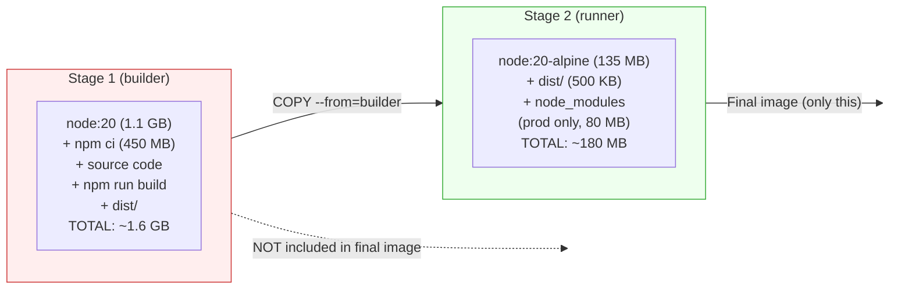
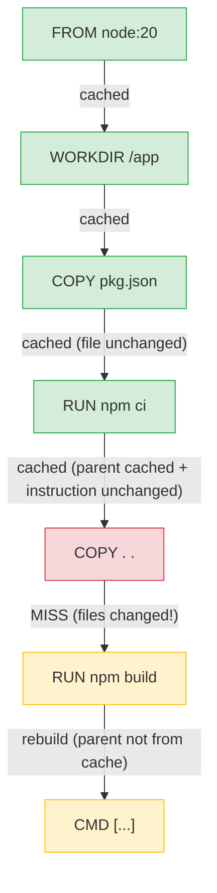
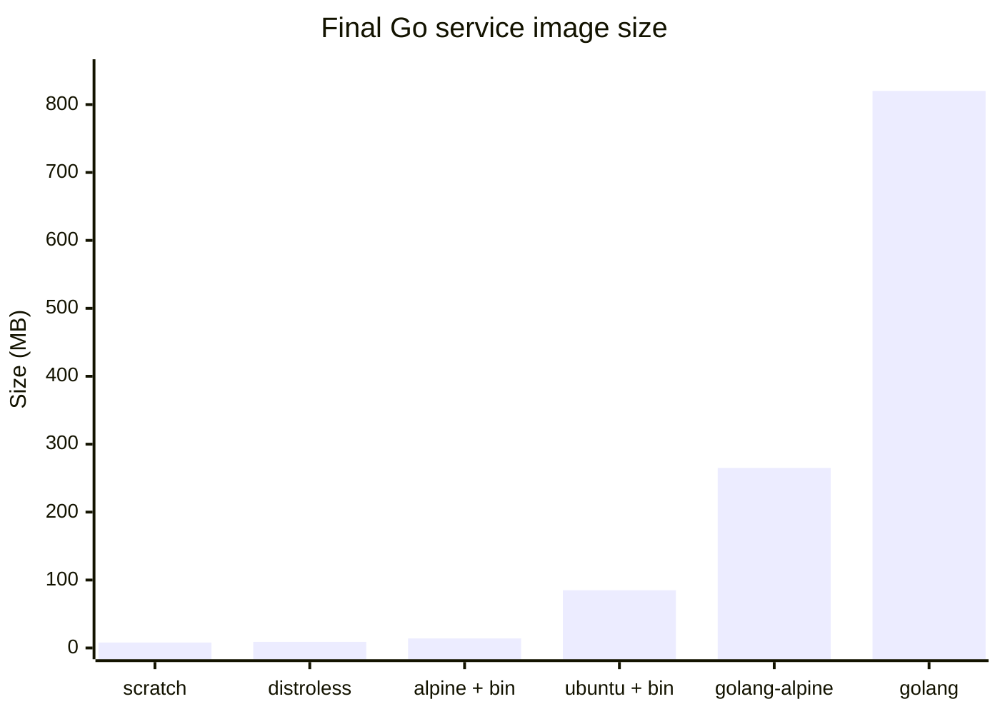

# Level 10: Docker Image Optimization

## 🎯 The Problem: Your Image Is 1.5 GB and Takes 15 Minutes to Build

Imagine: you wrote a simple Node.js API, packaged it into a Docker image, and pushed it to a registry. The CI/CD pipeline runs, the container starts. All good? Not quite.

```bash
$ docker images myapp
REPOSITORY  TAG     IMAGE ID       SIZE
myapp       latest  a1b2c3d4e5f6   1.47 GB
```

1.47 GB for an API with 50 KB of source code? Every deploy downloads one and a half gigabytes. CI/CD takes 15 minutes to build. The container starts slowly. The registry is packed with huge images.

```bash
# A typical picture: 5 services, each 1+ GB
$ docker images
REPOSITORY  TAG     SIZE
api         latest  1.47 GB
worker      latest  1.23 GB
frontend    latest  892 MB
scheduler   latest  1.1 GB
gateway     latest  987 MB
# Total: ~5.7 GB on one server, the same again in the registry
```

Docker image optimization is not a cosmetic improvement. It directly affects:
- **Deploy speed** — less data to download and unpack
- **Cost** — registry and bandwidth cost money
- **Security** — fewer packages = smaller attack surface
- **CI/CD time** — faster builds = faster feedback loop

---

## 🔥 Analyzing Image Size: Where the Gigabytes Are Hiding

Before optimizing, you need to understand **what exactly** is taking up space. Docker provides several tools for analysis.

### docker image inspect

```bash
# Full image information
docker image inspect myapp:latest

# Size only
docker image inspect --format='{{.Size}}' myapp:latest
# 1578432512 (bytes)

# Size in human-readable format
docker images myapp:latest --format '{{.Repository}}:{{.Tag}} → {{.Size}}'
# myapp:latest → 1.47GB
```

### docker history: layer-by-layer analysis

```bash
$ docker history myapp:latest
IMAGE          CREATED       CREATED BY                                      SIZE
a1b2c3d4e5f6   2 mins ago   CMD ["node" "server.js"]                        0B
<missing>      2 mins ago   COPY . /app                                     1.2MB
<missing>      2 mins ago   RUN npm install                                 450MB
<missing>      2 mins ago   COPY package*.json ./                           2KB
<missing>      2 mins ago   WORKDIR /app                                    0B
<missing>      3 weeks ago  /bin/sh -c apt-get update && apt-get install…   350MB
<missing>      3 weeks ago  /bin/sh -c #(nop) CMD ["node"]                  0B
<missing>      3 weeks ago  /bin/sh -c #(nop) ENV NODE_VERSION=20.10.0      0B
<missing>      3 weeks ago  /bin/sh -c groupadd --gid 1000 node...         450MB
```

The problems are immediately visible:
- Base image: ~800 MB (full `node:20`)
- `npm install`: 450 MB (including devDependencies)
- `apt-get install`: 350 MB (why is this in the final image?)

```bash
# More compact output with sizes
docker history --no-trunc --format "table {{.CreatedBy}}\t{{.Size}}" myapp:latest

# Only layers with non-zero size
docker history myapp:latest --format '{{.Size}}\t{{.CreatedBy}}' | grep -v "0B"
```

### dive: interactive layer analysis

[dive](https://github.com/wagoodman/dive) is a TUI tool for detailed image analysis. It shows each layer and filesystem changes.

```bash
# Installation
# macOS
brew install dive

# Linux
wget https://github.com/wagoodman/dive/releases/download/v0.12.0/dive_0.12.0_linux_amd64.deb
sudo apt install ./dive_0.12.0_linux_amd64.deb

# Launch
dive myapp:latest
```

What dive shows:
- **Layers** — each layer with size and command
- **Current Layer Contents** — files added/changed/deleted in the layer
- **Image efficiency** — percentage of "wasted" space
- **Potential wasted space** — files added in one layer and deleted in another

```bash
# Automated analysis (CI mode)
dive myapp:latest --ci
# Returns exit code 1 if the image does not pass efficiency checks

# Configuring thresholds for CI
CI=true dive myapp:latest \
  --highestWastedBytes=50mb \
  --highestUserWastedPercent=0.3 \
  --lowestEfficiency=0.95
```

📌 **Important:** dive shows the real picture — which files ended up in the image and why. Surprises are common: a `.git/` directory, `node_modules` with devDependencies, package manager cache.

### Comparing base image sizes

```bash
$ docker images --format "table {{.Repository}}:{{.Tag}}\t{{.Size}}" | sort -k2 -h
REPOSITORY:TAG                  SIZE
alpine:3.19                     7.38MB
node:20-alpine                  135MB
node:20-slim                    220MB
python:3.12-alpine              52MB
python:3.12-slim                155MB
node:20                         1.1GB
python:3.12                     1.02GB
ubuntu:22.04                    77.8MB
golang:1.22                     814MB
golang:1.22-alpine              258MB
```

The difference between `node:20` (1.1 GB) and `node:20-alpine` (135 MB) is **almost 10×**!

---

## 🔥 Multi-Stage Builds: The Foundation of Optimization

### The Problem: Build Dependencies in the Production Image

```dockerfile
# ❌ Everything in one image
FROM node:20

WORKDIR /app
COPY package*.json ./
RUN npm install          # devDependencies too!
COPY . .
RUN npm run build        # TypeScript compilation
CMD ["node", "dist/server.js"]

# Result: 1.4 GB
# In the image: TypeScript compiler, webpack, eslint, tests...
```

### Solution: multi-stage build

Multi-stage builds allow multiple `FROM` instructions in a single Dockerfile. Each `FROM` starts a new **stage**. The final image contains only the last stage.

```dockerfile
# ✅ Multi-stage build
# Stage 1: build (builder)
FROM node:20 AS builder

WORKDIR /app
COPY package*.json ./
RUN npm ci
COPY . .
RUN npm run build

# Stage 2: production (runner)
FROM node:20-alpine AS runner

WORKDIR /app
COPY --from=builder /app/dist ./dist
COPY --from=builder /app/node_modules ./node_modules
COPY --from=builder /app/package.json ./

CMD ["node", "dist/server.js"]

# Result: ~180 MB (instead of 1.4 GB)
```

### How it works



Docker **discards** all intermediate stages after the build. Only the last stage ends up in the final image.

### The builder-runner pattern

The most common pattern: two stages — builder (build) and runner (runtime).

**Node.js / TypeScript:**

```dockerfile
# Builder
FROM node:20 AS builder
WORKDIR /app
COPY package*.json ./
RUN npm ci
COPY . .
RUN npm run build
RUN npm prune --production  # Remove devDependencies

# Runner
FROM node:20-alpine
WORKDIR /app
RUN addgroup -S appgroup && adduser -S appuser -G appgroup
COPY --from=builder --chown=appuser:appgroup /app/dist ./dist
COPY --from=builder --chown=appuser:appgroup /app/node_modules ./node_modules
COPY --from=builder /app/package.json ./
USER appuser
EXPOSE 3000
CMD ["node", "dist/server.js"]
```

**Go:**

```dockerfile
# Builder
FROM golang:1.22-alpine AS builder
WORKDIR /app
COPY go.mod go.sum ./
RUN go mod download
COPY . .
RUN CGO_ENABLED=0 GOOS=linux go build -ldflags="-w -s" -o /app/server ./cmd/server

# Runner -- scratch (empty image!)
FROM scratch
COPY --from=builder /app/server /server
COPY --from=builder /etc/ssl/certs/ca-certificates.crt /etc/ssl/certs/
EXPOSE 8080
ENTRYPOINT ["/server"]
# Result: 10-15 MB!
```

**Python:**

```dockerfile
# Builder
FROM python:3.12-slim AS builder
WORKDIR /app
RUN python -m venv /opt/venv
ENV PATH="/opt/venv/bin:$PATH"
COPY requirements.txt .
RUN pip install --no-cache-dir -r requirements.txt
COPY . .

# Runner
FROM python:3.12-slim
WORKDIR /app
COPY --from=builder /opt/venv /opt/venv
ENV PATH="/opt/venv/bin:$PATH"
COPY --from=builder /app .
CMD ["python", "main.py"]
```

**Java (Maven):**

```dockerfile
# Builder
FROM maven:3.9-eclipse-temurin-21 AS builder
WORKDIR /app
COPY pom.xml .
RUN mvn dependency:go-offline
COPY src ./src
RUN mvn package -DskipTests

# Runner
FROM eclipse-temurin:21-jre-alpine
WORKDIR /app
COPY --from=builder /app/target/*.jar app.jar
EXPOSE 8080
ENTRYPOINT ["java", "-jar", "app.jar"]
# Maven, JDK, source code -- not included in the image
```

### Multiple stages: tests, linting, build

```dockerfile
# Stage 1: dependencies
FROM node:20-alpine AS deps
WORKDIR /app
COPY package*.json ./
RUN npm ci

# Stage 2: tests (optional)
FROM deps AS test
COPY . .
RUN npm run test

# Stage 3: linting (optional)
FROM deps AS lint
COPY . .
RUN npm run lint

# Stage 4: build
FROM deps AS builder
COPY . .
RUN npm run build
RUN npm prune --production

# Stage 5: final image
FROM node:20-alpine
WORKDIR /app
COPY --from=builder /app/dist ./dist
COPY --from=builder /app/node_modules ./node_modules
CMD ["node", "dist/server.js"]
```

You can build only the required stage:

```bash
# Build only up to the test stage
docker build --target test -t myapp-test .

# Build only up to the lint stage
docker build --target lint -t myapp-lint .

# Full build (default -- last stage)
docker build -t myapp .
```

### COPY --from with external images

`COPY --from` can copy not only from previous stages, but from any image:

```dockerfile
# Copy nginx config from the official image
COPY --from=nginx:alpine /etc/nginx/nginx.conf /etc/nginx/nginx.conf

# Copy a binary from another image
COPY --from=golang:1.22-alpine /usr/local/go/bin/go /usr/local/bin/go

# Copy a utility from a separate image
COPY --from=aquasec/trivy:latest /usr/local/bin/trivy /usr/local/bin/trivy
```

---

## 🔥 Layer Optimization: Instruction Order and Caching

### How layer caching works

Each instruction in a Dockerfile creates a new **layer**. Docker caches each layer and uses the cache on subsequent builds if:

1. The parent layer has not changed
2. The instruction has not changed
3. For `COPY`/`ADD` — the files have not changed (compared by checksum)



**As soon as one layer is not from cache — all subsequent layers are also rebuilt!**

### Rule: rarely-changing content at the top, frequently-changing at the bottom

```dockerfile
# ❌ Bad order: any code change → cache for npm install is invalidated
FROM node:20-alpine
WORKDIR /app
COPY . .                   # Code changes frequently!
RUN npm install            # Rebuilt every time
RUN npm run build
CMD ["node", "dist/server.js"]
```

```dockerfile
# ✅ Good order: dependencies cached separately from code
FROM node:20-alpine
WORKDIR /app
COPY package.json package-lock.json ./   # Changes rarely
RUN npm ci                               # Cached!
COPY . .                                 # Code changes frequently
RUN npm run build                        # Only the build
CMD ["node", "dist/server.js"]
```

Now when code changes, `npm ci` is taken from cache (if package.json hasn't changed).

### Combining RUN instructions

Every `RUN` creates a new layer. Files deleted in the next layer **still take up space** in the previous one!

```dockerfile
# ❌ Three layers: apt cache remains in the first layer
RUN apt-get update
RUN apt-get install -y curl wget
RUN rm -rf /var/lib/apt/lists/*
# Size: 150 MB (APT cache in the first layer is not removed!)
```

```dockerfile
# ✅ One layer: cache deleted in the same layer
RUN apt-get update \
    && apt-get install -y --no-install-recommends curl wget \
    && rm -rf /var/lib/apt/lists/*
# Size: 50 MB
```

📌 **Important:** If a file is created in layer N and deleted in layer N+1, it is still stored in layer N. The union filesystem stores all layers. Deletion "hides" the file but does not free up space.

```dockerfile
# ❌ 100 MB pip cache is stored in the RUN pip install layer
RUN pip install -r requirements.txt
RUN rm -rf /root/.cache/pip   # Doesn't help! Cache is in the previous layer

# ✅ Delete in the same layer
RUN pip install --no-cache-dir -r requirements.txt
```

### Layer order optimization examples

**Python:**

```dockerfile
# ✅ Dependencies cached separately from code
FROM python:3.12-slim
WORKDIR /app

# Layer 1: system dependencies (changes rarely)
RUN apt-get update \
    && apt-get install -y --no-install-recommends gcc libpq-dev \
    && rm -rf /var/lib/apt/lists/*

# Layer 2: Python dependencies (changes rarely)
COPY requirements.txt .
RUN pip install --no-cache-dir -r requirements.txt

# Layer 3: code (changes frequently)
COPY . .
CMD ["python", "main.py"]
```

**Go:**

```dockerfile
# ✅ go mod download cached separately
FROM golang:1.22-alpine
WORKDIR /app

# Layer 1: dependencies (cached as long as go.mod/go.sum don't change)
COPY go.mod go.sum ./
RUN go mod download

# Layer 2: code (changes frequently)
COPY . .
RUN go build -o /app/server ./cmd/server
```

### BuildKit cache mounts

BuildKit provides `--mount=type=cache` to cache package manager directories **between builds**:

```dockerfile
# syntax=docker/dockerfile:1

# ✅ npm cache is preserved between builds
FROM node:20-alpine
WORKDIR /app
COPY package*.json ./
RUN --mount=type=cache,target=/root/.npm \
    npm ci
COPY . .
RUN npm run build

# ✅ pip cache
FROM python:3.12-slim
WORKDIR /app
COPY requirements.txt .
RUN --mount=type=cache,target=/root/.cache/pip \
    pip install -r requirements.txt
COPY . .

# ✅ Go module cache
FROM golang:1.22-alpine
WORKDIR /app
COPY go.mod go.sum ./
RUN --mount=type=cache,target=/go/pkg/mod \
    go mod download
COPY . .
RUN --mount=type=cache,target=/root/.cache/go-build \
    go build -o server .

# ✅ apt cache
FROM ubuntu:22.04
RUN --mount=type=cache,target=/var/cache/apt \
    --mount=type=cache,target=/var/lib/apt/lists \
    apt-get update && apt-get install -y curl
```

Cache mount does not end up in the image layer — the cache is stored separately and reused between builds.

---

## 🔥 .dockerignore: Controlling the Build Context

### What is the build context

When running `docker build .`, Docker sends **the entire directory** (build context) to the Docker daemon. If the directory contains `.git/` (200 MB), `node_modules/` (500 MB), test data (1 GB) — all of this will be sent.

```bash
$ docker build .
Sending build context to Docker daemon  1.2GB   # <-- Problem!
```

`.dockerignore` works like `.gitignore` — it excludes files from the build context.

### .dockerignore syntax

```dockerignore
# Comment

# Files and directories
node_modules
.git
.env
dist

# Wildcard patterns
*.md
*.log
*.tmp
**/*.test.js
**/*.spec.ts

# Exclusions (!) -- include back
*.md
!README.md

# Specific files
docker-compose.yml
docker-compose.*.yml
Dockerfile
.dockerignore

# Hidden files and directories
.vscode
.idea
.DS_Store
.cache
.npm
.yarn
```

### Recommended .dockerignore for Node.js

```dockerignore
# Dependencies
node_modules
npm-debug.log*
yarn-debug.log*
yarn-error.log*

# Build output (if copied in multi-stage)
dist
build

# Tests
coverage
**/*.test.ts
**/*.spec.ts
__tests__
jest.config.*

# Version control
.git
.gitignore

# IDE
.vscode
.idea
*.swp
*.swo

# Environment
.env
.env.*
!.env.example

# Docker
Dockerfile*
docker-compose*.yml
.dockerignore

# Documentation
*.md
!README.md

# OS
.DS_Store
Thumbs.db

# CI/CD
.github
.gitlab-ci.yml
.circleci
```

### Recommended .dockerignore for Python

```dockerignore
# Python
__pycache__
*.pyc
*.pyo
*.egg-info
.eggs
dist
build

# Virtual environment
venv
.venv
env

# Tests
.pytest_cache
htmlcov
.coverage
tests

# IDE
.vscode
.idea

# Git
.git
.gitignore

# Docker
Dockerfile*
docker-compose*.yml
.dockerignore

# Environment
.env
.env.*

# Documentation
*.md
docs
```

### Impact of .dockerignore on context size

```bash
# Without .dockerignore
$ docker build .
Sending build context to Docker daemon  1.2GB
Step 1/8 : FROM node:20-alpine
...
Successfully built a1b2c3d4e5f6
Total build time: 2m 30s

# With a proper .dockerignore
$ docker build .
Sending build context to Docker daemon  45KB
Step 1/8 : FROM node:20-alpine
...
Successfully built f6e5d4c3b2a1
Total build time: 45s
```

📌 **Important:** `.dockerignore` affects the **build context**, not the `COPY` instruction. Even if `COPY` copies a specific file, without `.dockerignore` the entire context is still sent to the daemon.

---

## 🔥 Choosing Base Images

### Base image variants

| Type | Example | Size | Contents |
|------|---------|------|----------|
| **Full** | `node:20`, `python:3.12` | 800 MB - 1.1 GB | Debian + system packages + runtime |
| **Slim** | `node:20-slim`, `python:3.12-slim` | 150-250 MB | Debian minimal + runtime |
| **Alpine** | `node:20-alpine`, `python:3.12-alpine` | 50-140 MB | Alpine Linux + runtime |
| **Distroless** | `gcr.io/distroless/nodejs20` | 120-170 MB | Runtime only, no shell |
| **Scratch** | `scratch` | 0 MB | Completely empty image |

### Alpine: compact with caveats

Alpine Linux uses **musl libc** instead of **glibc**, which can cause issues:

```dockerfile
# ✅ Alpine works great for
FROM node:20-alpine     # Node.js
FROM golang:1.22-alpine # Go (static compilation)
FROM nginx:alpine       # Nginx
FROM redis:alpine       # Redis
```

```dockerfile
# ⚠️ Be careful with Alpine for
FROM python:3.12-alpine
# Many Python packages with C extensions (numpy, pandas, psycopg2)
# require compilation and additional dependencies in Alpine

RUN apk add --no-cache gcc musl-dev linux-headers
# It may be easier to use python:3.12-slim
```

When Alpine works well:
- Node.js applications
- Go applications
- Simple Python applications without native extensions
- Utilities and CLI tools

When slim is better:
- Python with scientific libraries (numpy, scipy, pandas)
- Applications that depend on glibc-specific behavior
- When packages only available in apt are needed

### Distroless: minimal for production

[Distroless](https://github.com/GoogleContainerTools/distroless) images from Google contain **only the runtime** — no shell, no package manager, no utilities.

```dockerfile
# Multi-stage: build + distroless
FROM node:20 AS builder
WORKDIR /app
COPY package*.json ./
RUN npm ci --only=production
COPY . .
RUN npm run build

FROM gcr.io/distroless/nodejs20-debian12
WORKDIR /app
COPY --from=builder /app/dist ./dist
COPY --from=builder /app/node_modules ./node_modules
CMD ["dist/server.js"]
# docker exec sh is not possible -- no shell!
```

Advantages of distroless:
- Minimal attack surface (no shell to exploit)
- Fewer CVEs (fewer packages)
- Compliance (CIS Docker Benchmark recommends it)

Disadvantages:
- Harder to debug (no shell)
- No package manager
- Sometimes a `-debug` version is needed for diagnostics

### Scratch: absolute minimum

`scratch` is an empty image. Ideal for statically compiled binaries (Go, Rust).

```dockerfile
FROM golang:1.22-alpine AS builder
WORKDIR /app
COPY . .
RUN CGO_ENABLED=0 GOOS=linux GOARCH=amd64 \
    go build -ldflags="-w -s" -o server .

FROM scratch
COPY --from=builder /app/server /server
# SSL certificates for HTTPS requests
COPY --from=builder /etc/ssl/certs/ca-certificates.crt /etc/ssl/certs/
# Timezone data
COPY --from=builder /usr/share/zoneinfo /usr/share/zoneinfo
EXPOSE 8080
ENTRYPOINT ["/server"]
# Result: 10-15 MB
```

```dockerfile
# Rust
FROM rust:1.75-alpine AS builder
WORKDIR /app
COPY . .
RUN cargo build --release --target x86_64-unknown-linux-musl

FROM scratch
COPY --from=builder /app/target/x86_64-unknown-linux-musl/release/myapp /myapp
ENTRYPOINT ["/myapp"]
# Result: 5-20 MB
```

### Comparison: the same Go service



---

## 🔥 BuildKit: The Modern Build Engine

### What is BuildKit

BuildKit is the new backend for `docker build`, which became the default in Docker 23.0+. It provides:

- **Parallel builds** — independent stages are built simultaneously
- **Improved caching** — cache mounts, remote cache
- **Secrets** — secure secret passing during builds
- **SSH agent** — SSH forwarding for private repositories
- **Heredoc syntax** — multi-line RUN instructions

### Enabling BuildKit

```bash
# Environment variable (Docker < 23.0)
DOCKER_BUILDKIT=1 docker build -t myapp .

# In Docker 23.0+ BuildKit is enabled by default

# Check
docker buildx version
```

### Parallel stage builds

```dockerfile
# syntax=docker/dockerfile:1

# These stages are built in parallel!
FROM node:20-alpine AS frontend-builder
WORKDIR /app/frontend
COPY frontend/package*.json ./
RUN npm ci
COPY frontend/ .
RUN npm run build

FROM golang:1.22-alpine AS backend-builder
WORKDIR /app
COPY go.mod go.sum ./
RUN go mod download
COPY . .
RUN go build -o server .

# Final stage: combines results of both
FROM alpine:3.19
COPY --from=backend-builder /app/server /server
COPY --from=frontend-builder /app/frontend/dist /static
CMD ["/server"]
```

Without BuildKit, stages are built sequentially. With BuildKit, `frontend-builder` and `backend-builder` are built **simultaneously**.

### Build secrets

```dockerfile
# syntax=docker/dockerfile:1

# ✅ Secret is available only during RUN, not stored in the layer
FROM node:20-alpine
WORKDIR /app
COPY package*.json ./
RUN --mount=type=secret,id=npmrc,target=/root/.npmrc \
    npm ci
COPY . .
RUN npm run build
CMD ["node", "dist/server.js"]
```

```bash
# Passing the secret during build
docker build --secret id=npmrc,src=$HOME/.npmrc -t myapp .
```

### SSH during build

```dockerfile
# syntax=docker/dockerfile:1

FROM alpine AS builder
RUN apk add --no-cache git openssh-client
RUN --mount=type=ssh \
    git clone git@github.com:myorg/private-repo.git /app
```

```bash
docker build --ssh default -t myapp .
```

### Heredoc syntax

```dockerfile
# syntax=docker/dockerfile:1

# ✅ Multi-line scripts without backslashes
RUN <<EOF
apt-get update
apt-get install -y curl wget
rm -rf /var/lib/apt/lists/*
EOF

# ✅ Creating files inline
COPY <<EOF /etc/nginx/conf.d/default.conf
server {
    listen 80;
    location / {
        proxy_pass http://app:3000;
    }
}
EOF
```

### Inline cache for CI/CD

```bash
# Export cache to registry
docker build \
  --cache-to type=registry,ref=myregistry/myapp:cache \
  --cache-from type=registry,ref=myregistry/myapp:cache \
  -t myapp .

# Or to a local directory
docker build \
  --cache-to type=local,dest=./cache \
  --cache-from type=local,src=./cache \
  -t myapp .
```

---

## 🔥 Practical Size Reduction Techniques

### 1. npm ci instead of npm install

```dockerfile
# ❌ npm install can update the lock file
RUN npm install

# ✅ npm ci strictly follows package-lock.json
RUN npm ci

# ✅ Production dependencies only
RUN npm ci --only=production
# or
RUN npm ci --omit=dev
```

### 2. Go compilation flags

```dockerfile
# ❌ Without optimization: 25 MB binary
RUN go build -o server .

# ✅ With optimization: 10 MB binary
RUN CGO_ENABLED=0 GOOS=linux \
    go build -ldflags="-w -s" -o server .
# -w : remove DWARF debug info
# -s : remove symbol table
# CGO_ENABLED=0 : static linking (no libc needed)
```

### 3. --no-install-recommends for apt

```dockerfile
# ❌ Installs recommended packages (not needed)
RUN apt-get update && apt-get install -y python3

# ✅ Only essential dependencies
RUN apt-get update \
    && apt-get install -y --no-install-recommends python3 \
    && rm -rf /var/lib/apt/lists/*
```

### 4. --no-cache for apk (Alpine)

```dockerfile
# ❌ Index cache remains
RUN apk update && apk add curl

# ✅ Without cache
RUN apk add --no-cache curl
```

### 5. Removing package manager caches

```dockerfile
# Python
RUN pip install --no-cache-dir -r requirements.txt

# Node.js (npm ci automatically cleans cache)
RUN npm ci && npm cache clean --force

# Ruby
RUN bundle install --without development test \
    && rm -rf /usr/local/bundle/cache/*.gem

# Java (Maven)
RUN mvn package -DskipTests \
    && rm -rf ~/.m2/repository
```

### 6. Minimizing the number of layers

```dockerfile
# ❌ 6 layers
RUN apt-get update
RUN apt-get install -y curl
RUN apt-get install -y wget
RUN curl -fsSL https://example.com/install.sh | bash
RUN rm -rf /var/lib/apt/lists/*
RUN rm -rf /tmp/*

# ✅ 1 layer
RUN apt-get update \
    && apt-get install -y --no-install-recommends curl wget \
    && curl -fsSL https://example.com/install.sh | bash \
    && rm -rf /var/lib/apt/lists/* /tmp/*
```

### 7. Using .dockerignore (reminder)

```bash
# Without .dockerignore: context = 800 MB
$ du -sh node_modules .git
500M    node_modules
280M    .git

# With .dockerignore: context = 50 KB
# node_modules and .git are excluded
```

---

## 🔥 Squash and Experimental Features

### --squash (deprecated)

The `--squash` flag merged all layers into one. It was removed in Docker 25+. Use multi-stage builds to achieve the same effect.

```bash
# ❌ Deprecated / removed
docker build --squash -t myapp .

# ✅ Use multi-stage build
# The final stage contains only the required files
```

### docker buildx

`docker buildx` is an extended version of `docker build` with BuildKit support:

```bash
# Create a builder
docker buildx create --name mybuilder --use

# Multi-platform build
docker buildx build \
  --platform linux/amd64,linux/arm64 \
  -t myapp:latest \
  --push .

# Build with output type
docker buildx build --output type=local,dest=./output .
docker buildx build --output type=tar,dest=./image.tar .
```

---

## ⚠️ Common Beginner Mistakes

### 🐛 1. COPY . . before npm install

```dockerfile
# ❌ Any code change invalidates the npm install cache
FROM node:20-alpine
WORKDIR /app
COPY . .
RUN npm install
CMD ["node", "server.js"]
```

> **Why this is a mistake:** `COPY . .` copies all the code. Any file change invalidates this layer's cache, and `npm install` is rebuilt from scratch (takes minutes).

```dockerfile
# ✅ Dependencies first, then code
FROM node:20-alpine
WORKDIR /app
COPY package.json package-lock.json ./
RUN npm ci
COPY . .
CMD ["node", "server.js"]
```

### 🐛 2. Using a full base image in production

```dockerfile
# ❌ node:20 = 1.1 GB base image
FROM node:20
WORKDIR /app
COPY . .
RUN npm ci
CMD ["node", "server.js"]
# Total: ~1.6 GB
```

> **Why this is a mistake:** The full image contains build tools, Python, gcc, and other tools that are not needed to run a Node.js application.

```dockerfile
# ✅ node:20-alpine = 135 MB
FROM node:20-alpine
WORKDIR /app
COPY package*.json ./
RUN npm ci --only=production
COPY . .
CMD ["node", "server.js"]
# Total: ~180 MB
```

### 🐛 3. Files deleted in a separate layer

```dockerfile
# ❌ tar.gz remains in the RUN wget layer
RUN wget https://example.com/big-file.tar.gz
RUN tar xzf big-file.tar.gz
RUN rm big-file.tar.gz
# 3 layers, big-file.tar.gz is stored in the first one!
```

> **Why this is a mistake:** The union filesystem stores each layer. Deleting a file in the next layer only "hides" it but does not free up space.

```dockerfile
# ✅ Download, extract, and delete in one layer
RUN wget https://example.com/big-file.tar.gz \
    && tar xzf big-file.tar.gz \
    && rm big-file.tar.gz
```

### 🐛 4. No .dockerignore

```bash
# ❌ Without .dockerignore: the entire context is sent to the daemon
$ docker build .
Sending build context to Docker daemon  1.5GB   # node_modules + .git + ...
```

> **Why this is a mistake:** Docker sends the entire build context to the daemon before building. Without `.dockerignore`, this includes `node_modules/`, `.git/`, test data, and more.

```dockerignore
# ✅ .dockerignore
node_modules
.git
*.md
.env
dist
coverage
```

### 🐛 5. DevDependencies in the production image

```dockerfile
# ❌ npm install installs ALL dependencies
FROM node:20-alpine
WORKDIR /app
COPY package*.json ./
RUN npm install
COPY . .
CMD ["node", "server.js"]
# node_modules contains typescript, eslint, jest...
```

> **Why this is a mistake:** DevDependencies increase the image size and attack surface. TypeScript compiler, ESLint, Jest — not needed in production.

```dockerfile
# ✅ Production dependencies only
RUN npm ci --omit=dev

# ✅ Or multi-stage: prune after build
FROM node:20 AS builder
WORKDIR /app
COPY package*.json ./
RUN npm ci
COPY . .
RUN npm run build
RUN npm prune --production

FROM node:20-alpine
WORKDIR /app
COPY --from=builder /app/dist ./dist
COPY --from=builder /app/node_modules ./node_modules
CMD ["node", "dist/server.js"]
```

---

## 💡 Best Practices

### 1. Use multi-stage builds

```dockerfile
# ✅ Separate build and runtime
FROM node:20 AS builder
# ... build ...

FROM node:20-alpine
# ... runtime only
```

### 2. Choose a minimal base image

```
For Node.js: node:20-alpine (or distroless)
For Python: python:3.12-slim (alpine for simple apps)
For Go: scratch or distroless/static
For Java: eclipse-temurin:21-jre-alpine
```

### 3. Optimize layer order for caching

```dockerfile
# ✅ Rarely-changing content → top, frequently-changing → bottom
COPY package.json package-lock.json ./   # Changes rarely
RUN npm ci                               # Cached
COPY . .                                 # Changes frequently
```

### 4. Combine RUN and clean up caches

```dockerfile
# ✅ One layer, cleanup at the end
RUN apt-get update \
    && apt-get install -y --no-install-recommends curl \
    && rm -rf /var/lib/apt/lists/*
```

### 5. Always use .dockerignore

```dockerignore
# ✅ Exclude everything not needed for the build
node_modules
.git
*.md
.env
coverage
```

### 6. Analyze images before deploying

```bash
# ✅ Check size and layers
docker images myapp
docker history myapp
dive myapp  # If installed
```

### 7. Use BuildKit cache mounts

```dockerfile
# ✅ Package manager cache between builds
RUN --mount=type=cache,target=/root/.npm npm ci
```

### 8. Pin specific base image versions

```dockerfile
# ❌ Unpredictable
FROM node:latest

# ✅ Fixed version
FROM node:20.11.1-alpine3.19
```

---

## 📌 Summary

- ✅ **docker history** and **dive** — the main tools for analyzing image size
- ✅ **Multi-stage builds** — separating build and runtime, reducing size 5–10×
- ✅ **Builder-runner pattern** — builder compiles, runner runs
- ✅ **Layer order** — rarely-changing content at the top, frequently-changing at the bottom
- ✅ **Combining RUN** — delete files in the same layer they are created
- ✅ **Cache mounts** — `--mount=type=cache` for package manager caches
- ✅ **.dockerignore** — exclude node_modules, .git, tests from the build context
- ✅ **Base images**: alpine (compact), slim (compatible), distroless (secure), scratch (minimal)
- ✅ **BuildKit** — parallel builds, secrets, SSH, heredoc, remote cache
- ✅ **Practical techniques**: npm ci, --no-install-recommends, --no-cache-dir, -ldflags="-w -s"
- ✅ **Pin specific versions** of base images instead of `latest`
- ✅ Analyze images (history, dive) before deploying
