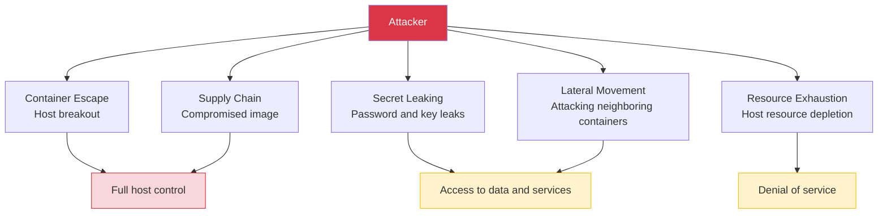
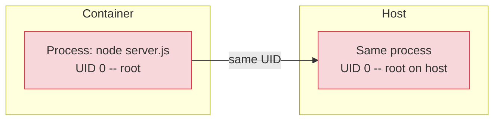
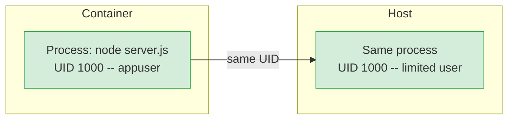
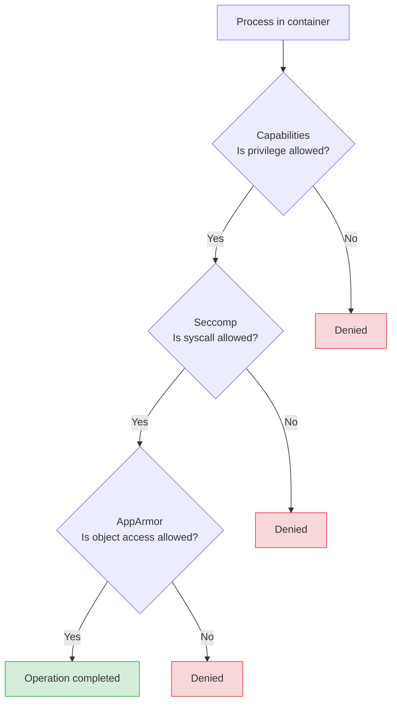

# Level 11: Docker Security

## Introduction

Imagine a residential complex with an access control system. At the entrance stands a guard, but if someone gets a pass with maximum access level, they can enter the server room, open the electrical panel, get to the roof -- and even reach other tenants' apartments through utility rooms. Formally, "entry is controlled," but real security isn't one lock at the entrance -- it's dozens of barriers at every level.

A Docker container works by the same principle. By itself, it creates an **illusion of isolation** but doesn't guarantee security. A container is not a virtual machine. It uses the same Linux kernel as the host. Without proper configuration, an attacker who gains access to a container can escape to the host machine, read secrets from other services, compromise the supply chain, or simply bring down the entire infrastructure through resource exhaustion.

In this level, we'll cover Docker security from fundamental principles to specific commands and configurations:

1. **Threat model** -- what exactly we're protecting from and why it matters
2. **Non-root user** -- the first and most important step
3. **Linux Capabilities** -- fine-grained privilege settings instead of "all or nothing" approach
4. **Seccomp and AppArmor** -- system call filtering and mandatory access control
5. **Read-only filesystem** -- immutable file system as a shield
6. **Vulnerability scanning** -- finding CVEs in images before they reach production
7. **Secret management** -- how to pass passwords and keys without leaks
8. **Network isolation and resource limits** -- microsegmentation and DoS protection
9. **Docker Bench for Security** -- automated configuration audit

---

## 1. Container Threat Model

Before defending, you need to understand **what** you're defending against. Security without a threat model is shooting blindfolded. You might close one door but leave ten windows open.

### Analogy: Building Security

Think about building security. There are different types of threats:

- **Lock picking** -- attacker overcomes a barrier (container escape)
- **Fake pass** -- someone slips you a compromised component (supply chain attack)
- **Key theft** -- password and token leaks (secret leaking)
- **Penetration through a neighbor's apartment** -- attacking one service to access others (lateral movement)
- **Flooding** -- one tenant uses all the building's resources (resource exhaustion / DoS)



### Container Escape -- Breaking Out of the Container

This is the most dangerous scenario. An attacker who gained access to a process inside the container overcomes isolation boundaries and gains access to the host. Why is this possible? Because a container is not a virtual machine. It doesn't have its own kernel. Between the container and host stands a set of Linux mechanisms (namespaces, cgroups, seccomp), but if they're weakened -- the barrier disappears.

The two most common escape vectors:

```bash
# Vector 1: --privileged flag
# Disables ALL isolation mechanisms at once
$ docker run --privileged -it alpine sh

# Inside the privileged container:
$ mount /dev/sda1 /mnt     # Mount the host's root disk
$ cat /mnt/etc/shadow       # Read host password hashes
$ chroot /mnt               # Switch to host file system
# Now we're root on the host
```

The `--privileged` flag is like giving a tenant a master key to all building premises, including the server room, electrical panel, and neighbors' apartments. Never use it in production.

```bash
# Vector 2: Mounting Docker socket
$ docker run -v /var/run/docker.sock:/var/run/docker.sock alpine sh

# Inside the container:
$ apk add docker-cli
$ docker run -v /:/host --privileged alpine chroot /host
# We created a new privileged container with host access
```

Docker socket (`/var/run/docker.sock`) is Docker daemon's API interface. Access to it is equivalent to root access to the host, because through it you can create any container with any privileges.

### Supply Chain Attack -- Attack on the Supply Chain

Your Dockerfile starts with `FROM some-image`. But who built this image? What's inside it?

```dockerfile
# Who is cool-developer? Can they be trusted?
FROM cool-developer/node-utils:latest

# This image might contain:
# - A crypto miner running quietly in the background
# - A backdoor opening a reverse connection
# - A script sending environment variables to an external server
# - Modified system utilities
```

Even official images can contain vulnerable package versions. The difference is that official images are checked by Docker and have a transparent build process, while user images don't.

### Secret Leaking

Secrets "baked" into an image are available to anyone who gets that image:

```bash
# Secret in environment variable -- visible through inspect
$ docker inspect myapp | jq '.[0].Config.Env'
["DATABASE_URL=postgres://admin:p@ssw0rd@db:5432/mydb"]

# Secret in image layer -- visible through history
$ docker history myapp:latest --no-trunc
# ... ENV API_KEY=sk-secret-key-12345 ...

# Even a deleted file remains in a previous layer!
# If you copied .env and then deleted it -- it's still in the image
```

It's like writing the safe's password on the building blueprint. Anyone who gets a copy of the blueprint learns the password.

---

## 2. Non-Root User -- First Line of Defense

### Why Root in a Container Is Dangerous

By default, a process in a container runs as **root** (UID 0). Many developers don't think about this because "everything just works." But root in a container is root on the host in terms of UID. If an attacker finds a vulnerability allowing container escape, they end up on the host with root privileges.

```bash
# Check: who runs the process by default?
$ docker run --rm alpine id
uid=0(root) gid=0(root) groups=0(root)

# root! And this is the default behavior for most images
```

Analogy: imagine every employee in a company gets server room keys by default. 99% of employees will never go there, but if an attacker steals any of their passes -- the server room is open.

### How User Mapping Works

Inside a container, a user sees their UID. On the host, the same process is visible with the same UID. That's why root (UID 0) in a container is so dangerous:



If you switch to an unprivileged user (for example, UID 1000), then even with container escape, the attacker ends up on the host with minimal privileges:



### USER Directive in Dockerfile

The right approach -- create an unprivileged user in the Dockerfile and switch to it **after** all operations requiring root (installing packages, copying files):

```dockerfile
# ❌ BAD: process runs as root
FROM node:20-alpine
WORKDIR /app
COPY . .
RUN npm install
CMD ["node", "server.js"]
# node server.js runs as root!
```

```dockerfile
# ✅ GOOD: create an unprivileged user
FROM node:20-alpine
WORKDIR /app

# 1. Create group and user (as root -- needs rights)
RUN addgroup -S appgroup && adduser -S appuser -G appgroup

# 2. Install dependencies (as root -- needs access to /usr/local)
COPY package*.json ./
RUN npm ci --only=production

# 3. Copy code and set ownership
COPY --chown=appuser:appgroup . .

# 4. Switch to unprivileged user
USER appuser

# 5. Now CMD runs as appuser
CMD ["node", "server.js"]
```

Note the order: first everything requiring root privileges (installing packages, creating directories), then `USER appuser`, then everything else.

### --chown Flag in COPY

Important detail: files copied via `COPY` belong to root by default. If you switched to `appuser`, they can't read these files without `--chown`:

```dockerfile
# ❌ Files belong to root -- appuser can't read them
USER appuser
COPY . .

# ✅ Files belong to appuser
COPY --chown=appuser:appgroup . .
USER appuser
```

### Overriding User at Launch

Sometimes you need to override the user without rebuilding the image. There's a `--user` flag for this:

```bash
# Run as specific UID:GID
$ docker run --user 1000:1000 nginx

# Run as user nobody (exists in most images)
$ docker run --user nobody nginx

# Check
$ docker run --user 1000:1000 alpine id
uid=1000 gid=1000
```

### Built-in Users in Official Images

Many official images already contain unprivileged users. No need to create your own -- you can use the built-in one:

| Image | User | UID | How to use |
|-------|------|-----|------------------|
| node | node | 1000 | `USER node` |
| postgres | postgres | 999 | Used automatically |
| nginx | nginx | 101 | Requires additional setup |
| redis | redis | 999 | Used automatically |
| python | - | - | Need to create manually |

Example for Node.js with built-in user:

```dockerfile
FROM node:20-alpine
WORKDIR /app
COPY --chown=node:node package*.json ./
RUN npm ci --only=production
COPY --chown=node:node . .
USER node
CMD ["node", "server.js"]
```

### User Namespace Remapping

For maximum protection, you can enable **user namespace remapping** at the Docker daemon level. This feature remaps UIDs inside the container to a different UID on the host. Even root (UID 0) inside the container will be mapped to an unprivileged UID (e.g., 100000) on the host:

```bash
# Configuration in /etc/docker/daemon.json
{
  "userns-remap": "default"
}

# After Docker restart:
# root in container (UID 0) = UID 100000 on host
# appuser in container (UID 1000) = UID 101000 on host
```

This is an additional protection layer that makes container escape significantly less dangerous.

---

## 3. Linux Capabilities -- Fine-Grained Privilege Settings

### What Are Capabilities

Traditional Linux has a binary division: you're either root (can do everything) or a regular user (can do little). Capabilities break monolithic root privileges into ~40 separate "permissions," each of which can be granted or revoked independently.

Analogy: instead of one master key for the entire building -- a set of separate keys. One opens the server room, another -- the electrical panel, a third -- the roof. Each employee gets only the keys they need for their work.

Main capabilities:

| Capability | What it allows | Risk level |
|------------|--------------|---------------|
| `CAP_NET_BIND_SERVICE` | Bind to ports < 1024 | Low |
| `CAP_CHOWN` | Change file ownership | Medium |
| `CAP_SETUID` / `CAP_SETGID` | Change process UID/GID | Medium |
| `CAP_NET_RAW` | Raw sockets (ping, tcpdump) | Medium |
| `CAP_DAC_OVERRIDE` | Ignore file access rights | High |
| `CAP_SYS_ADMIN` | Mount FS, manage namespaces | Critical |
| `CAP_SYS_PTRACE` | Debug other processes | Critical |

### Docker by Default

Docker doesn't give a container all capabilities, but gives more than most applications need. By default, a container gets about 14 capabilities:

```bash
# Check current container capabilities
$ docker run --rm alpine sh -c 'apk add -q libcap && capsh --print'
Current: cap_chown,cap_dac_override,cap_fowner,cap_fsetid,
         cap_kill,cap_setgid,cap_setuid,cap_setpcap,
         cap_net_bind_service,cap_net_raw,cap_sys_chroot,
         cap_mknod,cap_audit_write,cap_setfcap
```

For most applications (Node.js, Python, Go, Java), none of these capabilities are needed if the application listens on a port above 1024 and runs as an unprivileged user.

### Principle: Drop All, Add Needed

The right approach -- take everything away and add only what's necessary. This is the Principle of Least Privilege:

```bash
# ❌ --privileged: ALL capabilities + seccomp and AppArmor disabled
$ docker run --privileged alpine
# This is like giving a master key for the entire building

# ❌ Removing individual capabilities -- you don't know what's extra
$ docker run --cap-drop=SYS_ADMIN alpine
# You removed one, but left 13 others

# ✅ Drop all, add only needed
$ docker run --cap-drop=ALL --cap-add=NET_BIND_SERVICE nginx
# Nginx needs only NET_BIND_SERVICE for port 80
```

The principle works like this: start a container with `--cap-drop=ALL`. If it doesn't start or doesn't work correctly, look at the error -- it will tell you which capability is needed. Add it and repeat. This is an iterative process.

### Minimal Sets for Typical Services

Here are recommended capability sets for common types of applications:

```yaml
# Web server (nginx, caddy) -- needs port 80/443 binding
services:
  web:
    image: nginx
    cap_drop:
      - ALL
    cap_add:
      - NET_BIND_SERVICE
      - CHOWN
      - SETUID
      - SETGID

# Node.js / Python / Go application on port > 1024
services:
  api:
    image: myapp
    cap_drop:
      - ALL
    # No additional capabilities needed!

# Database (PostgreSQL) -- needed for initialization
services:
  db:
    image: postgres:16
    cap_drop:
      - ALL
    cap_add:
      - CHOWN
      - SETUID
      - SETGID
      - FOWNER
      - DAC_OVERRIDE
```

Note: a Node.js application on port 3000 needs **zero** additional capabilities. All capabilities Docker gives by default are extra for it.

### How to Find Out Which Capabilities Are Needed

Practical algorithm:

```bash
# Step 1: Launch with --cap-drop=ALL
$ docker run --cap-drop=ALL myapp:latest
# Error: "Permission denied" or "Operation not permitted"

# Step 2: Analyze the error
# For example: "bind: permission denied" -- needs NET_BIND_SERVICE
# "chown: operation not permitted" -- needs CHOWN

# Step 3: Add specific capability
$ docker run --cap-drop=ALL --cap-add=NET_BIND_SERVICE myapp:latest
# Works? Great. Doesn't work? Repeat step 2.
```

This takes 5-10 minutes on first setup, but closes a huge class of attacks.

---

## 4. Seccomp and AppArmor -- Deep Protection

### Seccomp: System Call Filtering

Capabilities control **what privileged operations** are available to a process. Seccomp (Secure Computing Mode) works at a lower level -- it filters **system calls** (syscalls) to the Linux kernel.

Analogy: capabilities are the list of rooms you have keys to. Seccomp is the list of actions you're allowed to perform in those rooms. You might have a key to the server room (capability), but you're forbidden to turn off servers (seccomp blocks the `reboot` syscall).

Linux has 300+ system calls. Docker blocks ~44 of the most dangerous by default:

```bash
# Docker automatically applies the default seccomp profile
# Blocked, in particular:
# - mount, umount      -- mounting file systems
# - reboot             -- host reboot
# - swapon, swapoff    -- swap management
# - ptrace             -- debugging other processes
# - clock_settime      -- changing system time
# - add_key, keyctl    -- kernel key management

# Check that seccomp is active:
$ docker info | grep -i seccomp
 Security Options: seccomp

# ❌ NEVER disable seccomp in production:
$ docker run --security-opt seccomp=unconfined alpine
# This opens access to ALL syscalls
```

### Custom Seccomp Profile

For critical services, you can create an even stricter profile allowing only a specific set of syscalls:

```json
{
  "defaultAction": "SCMP_ACT_ERRNO",
  "architectures": ["SCMP_ARCH_X86_64"],
  "syscalls": [
    {
      "names": [
        "read", "write", "open", "close",
        "stat", "fstat", "mmap", "mprotect",
        "munmap", "brk", "ioctl", "access",
        "pipe", "select", "sched_yield",
        "clone", "execve", "exit", "exit_group",
        "futex", "epoll_wait", "epoll_ctl",
        "socket", "connect", "accept",
        "bind", "listen", "sendto", "recvfrom"
      ],
      "action": "SCMP_ACT_ALLOW"
    }
  ]
}
```

```bash
# Launch with custom profile
$ docker run --security-opt seccomp=strict-profile.json myapp:latest
```

Docker's default profile is a good compromise between security and compatibility. Custom profiles are needed for high-security environments.

### AppArmor: Mandatory Access Control

AppArmor is a mandatory access control (MAC) system in Linux. If seccomp filters syscalls, then AppArmor controls access to **specific files, directories, and network operations**.

Analogy: seccomp is the list of allowed actions (read, write, open). AppArmor is the list of specific objects these actions apply to (can read `/app/**`, but can't read `/etc/shadow`).

```bash
# Docker applies the docker-default profile automatically
$ docker run --security-opt apparmor=docker-default nginx

# Custom profile
$ docker run --security-opt apparmor=my-custom-profile nginx
```

Example AppArmor profile for a Node.js application:

```
#include <tunables/global>

profile docker-nodejs flags=(attach_disconnected) {
  #include <abstractions/base>

  # Allow reading application code
  /app/** r,

  # Allow executing node
  /usr/local/bin/node ix,

  # Allow writing only to /tmp and logs
  /tmp/** rw,
  /app/logs/** rw,

  # Deny writing to system directories
  deny /etc/** w,
  deny /usr/** w,
  deny /bin/** w,
  deny /sbin/** w,

  # Allow network operations
  network tcp,
  network udp,
}
```

### Three Levels of Protection Together

Capabilities, seccomp, and AppArmor are three independent mechanisms that complement each other:



Each level blocks its own class of attacks. Even if an attacker bypasses one -- two others remain.

---

## 5. Read-Only File System -- Immutable Container

### Why Read-Only File System Is Needed

Most attacks require writing to disk: uploading a malicious script, modifying configuration, creating a web shell, saving crypto miner data. A read-only file system makes all of this impossible.

Analogy: imagine an office where all documents are sealed in glass. You can read them, but you can't change, swap, or plant new ones. If someone tries -- they physically can't.

```bash
# Launch with read-only root file system
$ docker run --read-only alpine sh -c 'echo test > /file.txt'
sh: can't create /file.txt: Read-only file system
```

### The Problem: Applications Need to Write

Almost every application writes somewhere: temporary files, PID files, cache, sessions. A read-only file system without additional configuration will break most services. The solution -- **tmpfs**: a temporary file system in RAM, mounted to specific directories.

```bash
# Nginx with read-only FS + tmpfs for writing
$ docker run --read-only \
  --tmpfs /tmp:rw,noexec,nosuid,size=64m \
  --tmpfs /var/cache/nginx:rw,size=32m \
  --tmpfs /var/run:rw,size=1m \
  nginx

# What the tmpfs options mean:
# rw       -- allow read and write (in this specific directory)
# noexec   -- forbid executing binaries (critically important!)
# nosuid   -- forbid setuid bit
# size=NNm -- limit size (protection against RAM overflow)
```

The `noexec` option on tmpfs is key. Without it, an attacker could upload a binary to `/tmp` and execute it. With `noexec`, even if the file is written, it can't be executed.

### Docker Compose with Read-Only

```yaml
services:
  api:
    image: myapp
    read_only: true
    tmpfs:
      - /tmp:rw,noexec,nosuid,size=128m
    volumes:
      - app-logs:/app/logs  # Named volume for logs

  web:
    image: nginx
    read_only: true
    tmpfs:
      - /tmp:rw,noexec,nosuid,size=64m
      - /var/cache/nginx:rw,size=32m
      - /var/run:rw,size=1m

  db:
    image: postgres:16
    read_only: true
    tmpfs:
      - /tmp:rw,noexec,nosuid
      - /var/run/postgresql:rw
    volumes:
      - pgdata:/var/lib/postgresql/data  # DB data in volume

volumes:
  app-logs:
  pgdata:
```

### Which Directories Need Writing

Typical directories requiring tmpfs or volume:

| Service | Directories for writing | Type |
|--------|----------------------|-----|
| Nginx | `/tmp`, `/var/cache/nginx`, `/var/run` | tmpfs |
| Node.js | `/tmp` | tmpfs |
| PostgreSQL | `/tmp`, `/var/run/postgresql`, `/var/lib/postgresql/data` | tmpfs + volume |
| Redis | `/data` | volume |
| Python/Django | `/tmp`, sessions | tmpfs |

Rule: tmpfs for ephemeral data (cache, PID, temp), volume for persistent data (DB data, logs).

### What Read-Only FS Provides

```
Protection against:
  - Writing malicious files (backdoors, web shells)
  - Modifying application configuration
  - Replacing executables
  - Storing crypto miner data
  - Writing scripts for lateral movement

Additional benefits:
  - Simplified auditing -- if a file changed, it's an anomaly
  - Reproducibility -- container always starts in identical state
  - Compliance with immutable infrastructure principle
```

---

## 6. Vulnerability Scanning

### Why Scanning Is Mandatory

Every Docker image is an operating system with many packages. Each package periodically has vulnerabilities found in it (CVE -- Common Vulnerabilities and Exposures). Your image may contain dozens of known vulnerabilities, including critical ones -- those allowing remote code execution (RCE) without authentication.

Analogy: imagine moving into a new house. The construction company says: "Everything is ready!" But you don't know the front door lock has a defect that allows opening it with a paperclip, and the window frames have gaps a hand can reach through. Image scanning is building inspection before moving in.

### CVE Severity Levels

Not all vulnerabilities are equally dangerous. Classification helps prioritize:

```
CRITICAL -- Remote code execution without authentication (RCE).
            Requires immediate fix. Attacker can
            gain full system control.
            Example: Log4Shell (CVE-2021-44228)

HIGH     -- Serious vulnerability requiring certain conditions.
            Fix within 1-2 days.
            Example: privilege escalation in kernel

MEDIUM   -- Vulnerability with limited impact.
            Fix within a week.

LOW      -- Minimal risk, informational vulnerability.
            Fix at next update.
```

### Scanning Tools

There are several popular scanners. Let's look at three main ones.

**Docker Scout** -- built-in Docker Desktop scanner:

```bash
# Quick vulnerability overview
$ docker scout quickview myapp:latest
    Target     : myapp:latest
    Base image : node:20-alpine

  Vulnerabilities : 3C  12H  22M  10L

# Detailed report
$ docker scout cves myapp:latest

# Only critical and high
$ docker scout cves --only-severity critical,high myapp:latest

# Recommendations: which base image to update to
$ docker scout recommendations myapp:latest
# Recommendation: update node:20-alpine3.18 -> node:20-alpine3.19
# This will eliminate 2 CRITICAL and 5 HIGH vulnerabilities
```

**Trivy** (Aqua Security) -- the most popular open-source scanner:

```bash
# Installation
$ brew install trivy        # macOS
$ apt install trivy          # Debian/Ubuntu

# Scan image
$ trivy image myapp:latest

# Only critical and high
$ trivy image --severity CRITICAL,HIGH myapp:latest

# Scan with exit code on vulnerabilities (for CI)
$ trivy image --exit-code 1 --severity CRITICAL myapp:latest
```

**grype** (Anchore) -- another popular option:

```bash
# Installation
$ brew install grype

# Scan
$ grype myapp:latest

# Only show fixable vulnerabilities
$ grype myapp:latest --only-fixable
```

---

## 7. Docker Bench for Security

Docker Bench for Security is an automated audit tool that checks your Docker configuration against CIS (Center for Internet Security) benchmarks:

```bash
# Run the benchmark
docker run -it --net host --pid host --userns host \
  --cap-add audit_control \
  -e DOCKER_CONTENT_TRUST=$DOCKER_CONTENT_TRUST \
  -v /etc:/etc:ro \
  -v /var/lib/docker:/var/lib/docker:ro \
  -v /var/run/docker.sock:/var/run/docker.sock:ro \
  docker/docker-bench-security
```

It checks dozens of security best practices and reports PASS/WARN/FAIL for each.

---

## Summary

Docker security requires a defense-in-depth approach with multiple independent layers:

- **Non-root user** -- first and most important step; never run applications as root
- **Linux Capabilities** -- drop all, add only what's needed
- **Seccomp and AppArmor** -- system call filtering and mandatory access control
- **Read-only file system** -- prevents file modification attacks
- **Vulnerability scanning** -- find CVEs before they reach production
- **Docker Bench** -- automated security audit

Key rules:
- ✅ Always create and use a non-root user in Dockerfile
- ✅ Drop all capabilities and add only needed ones
- ✅ Use read-only file system with targeted tmpfs exceptions
- ✅ Scan images before pushing to registry
- ✅ Never use `--privileged` in production
- ✅ Never mount Docker socket unless absolutely necessary
- ❌ Don't run applications as root
- ❌ Don't store secrets in images or environment variables
- ❌ Don't disable seccomp or AppArmor
