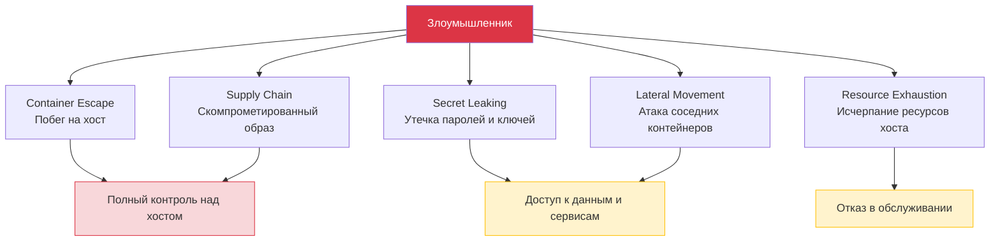
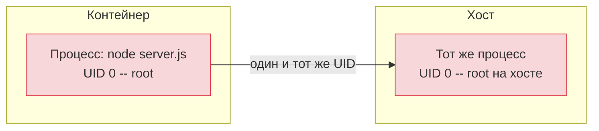
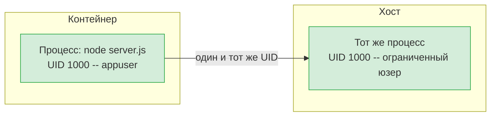
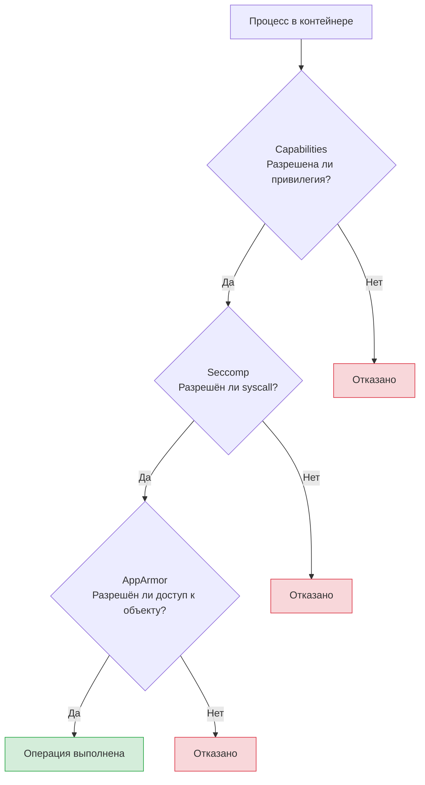
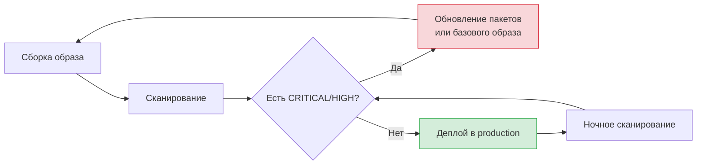
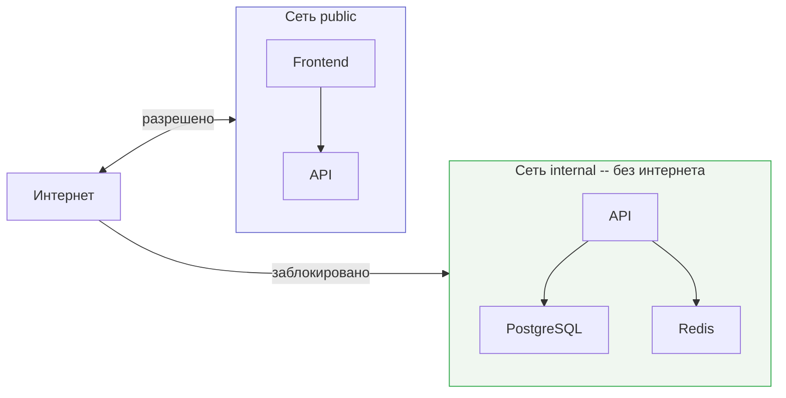

# Уровень 11: Безопасность Docker

## Введение

Представьте себе жилой комплекс с пропускной системой. На входе стоит охранник, но если кто-то получил пропуск с максимальным уровнем доступа, он может зайти в серверную, открыть электрощитовую, попасть на крышу -- и даже добраться до квартир других жильцов через технические помещения. Формально «вход контролируется», но реальная безопасность -- это не один замок на входе, а десятки барьеров на каждом уровне.

Docker-контейнер работает по тому же принципу. Сам по себе он создаёт **иллюзию изоляции**, но не гарантирует безопасности. Контейнер -- это не виртуальная машина. Он использует то же ядро Linux, что и хост. Без правильной настройки злоумышленник, получивший доступ к контейнеру, может выбраться на хост-машину, прочитать секреты других сервисов, заразить цепочку поставок или просто уронить всю инфраструктуру через исчерпание ресурсов.

На этом уровне мы разберём безопасность Docker от фундаментальных принципов до конкретных команд и конфигураций:

1. **Модель угроз** -- от чего именно мы защищаемся и почему это важно
2. **Non-root пользователь** -- первый и самый важный шаг
3. **Linux Capabilities** -- тонкая настройка привилегий вместо подхода «всё или ничего»
4. **Seccomp и AppArmor** -- фильтрация системных вызовов и мандатный контроль доступа
5. **Read-only filesystem** -- неизменяемая файловая система как щит
6. **Сканирование уязвимостей** -- поиск CVE в образах до того, как они попадут в production
7. **Управление секретами** -- как передавать пароли и ключи без утечек
8. **Сетевая изоляция и ограничение ресурсов** -- микросегментация и защита от DoS
9. **Docker Bench for Security** -- автоматический аудит конфигурации

---

## 1. Модель угроз контейнеров

Прежде чем защищаться, нужно понять, **от чего** мы защищаемся. Безопасность без модели угроз -- это стрельба с завязанными глазами. Вы можете закрыть одну дверь, но оставить открытыми десять окон.

### Аналогия: безопасность здания

Подумайте о безопасности здания. Есть разные типы угроз:

- **Взлом замка** -- злоумышленник преодолевает барьер (container escape)
- **Поддельный пропуск** -- кто-то подсовывает вам скомпрометированный компонент (supply chain attack)
- **Кража ключей** -- утечка паролей и токенов (secret leaking)
- **Проникновение через соседнюю квартиру** -- атака на один сервис для доступа к другим (lateral movement)
- **Затопление** -- один жилец расходует все ресурсы здания (resource exhaustion / DoS)



### Container Escape -- побег из контейнера

Это самый опасный сценарий. Злоумышленник, получивший доступ к процессу внутри контейнера, преодолевает границы изоляции и получает доступ к хосту. Почему это возможно? Потому что контейнер -- не виртуальная машина. Он не имеет собственного ядра. Между контейнером и хостом стоит набор Linux-механизмов (namespaces, cgroups, seccomp), но если их ослабить -- барьер исчезает.

Два самых частых вектора побега:

```bash
# Вектор 1: Флаг --privileged
# Отключает ВСЕ механизмы изоляции разом
$ docker run --privileged -it alpine sh

# Внутри привилегированного контейнера:
$ mount /dev/sda1 /mnt     # Монтируем корневой диск хоста
$ cat /mnt/etc/shadow       # Читаем хеши паролей хоста
$ chroot /mnt               # Переключаемся в файловую систему хоста
# Теперь мы -- root на хосте
```

Флаг `--privileged` -- это как выдать жильцу мастер-ключ от всех помещений здания, включая серверную, электрощитовую и квартиры соседей. Никогда не используйте его в production.

```bash
# Вектор 2: Монтирование Docker socket
$ docker run -v /var/run/docker.sock:/var/run/docker.sock alpine sh

# Внутри контейнера:
$ apk add docker-cli
$ docker run -v /:/host --privileged alpine chroot /host
# Мы создали новый привилегированный контейнер с доступом к хосту
```

Docker socket (`/var/run/docker.sock`) -- это API-интерфейс Docker daemon. Доступ к нему равносилен root-доступу к хосту, потому что через него можно создать любой контейнер с любыми привилегиями.

### Supply Chain Attack -- атака на цепочку поставок

Ваш Dockerfile начинается с `FROM some-image`. Но кто собрал этот образ? Что внутри него?

```dockerfile
# Кто такой cool-developer? Можно ли ему доверять?
FROM cool-developer/node-utils:latest

# Этот образ может содержать:
# - Криптомайнер, который тихо работает в фоне
# - Бэкдор, открывающий обратное соединение
# - Скрипт, отправляющий переменные окружения на внешний сервер
# - Модифицированные системные утилиты
```

Даже официальные образы могут содержать уязвимые версии пакетов. Разница в том, что официальные образы проходят проверку Docker и имеют прозрачный процесс сборки, а пользовательские -- нет.

### Утечка секретов

Секреты, «зашитые» в образ, доступны любому, кто получит этот образ:

```bash
# Секрет в переменной окружения -- виден через inspect
$ docker inspect myapp | jq '.[0].Config.Env'
["DATABASE_URL=postgres://admin:p@ssw0rd@db:5432/mydb"]

# Секрет в слое образа -- виден через history
$ docker history myapp:latest --no-trunc
# ... ENV API_KEY=sk-secret-key-12345 ...

# Даже удалённый файл остаётся в предыдущем слое!
# Если вы скопировали .env и потом удалили его -- он всё ещё в образе
```

Это как записать пароль от сейфа на чертеже здания. Каждый, кто получит копию чертежа, узнает пароль.

---

## 2. Non-root пользователь -- первый рубеж обороны

### Почему root в контейнере опасен

По умолчанию процесс в контейнере запускается от **root** (UID 0). Многие разработчики не задумываются об этом, потому что «всё и так работает». Но root в контейнере -- это root на хосте с точки зрения UID. Если злоумышленник найдёт уязвимость, позволяющую выбраться из контейнера, он окажется на хосте с правами root.

```bash
# Проверим: кто запускает процесс по умолчанию?
$ docker run --rm alpine id
uid=0(root) gid=0(root) groups=0(root)

# root! И это поведение по умолчанию для большинства образов
```

Аналогия: представьте, что каждый сотрудник компании по умолчанию получает ключи от серверной. 99% сотрудников никогда туда не зайдут, но если злоумышленник украдёт пропуск любого из них -- серверная открыта.

### Как устроен маппинг пользователей

Внутри контейнера пользователь видит свой UID. На хосте этот же процесс виден с тем же UID. Вот почему root (UID 0) в контейнере так опасен:



Если переключиться на непривилегированного пользователя (например, UID 1000), то даже при container escape злоумышленник окажется на хосте с минимальными правами:



### Директива USER в Dockerfile

Правильный подход -- создать непривилегированного пользователя в Dockerfile и переключиться на него **после** всех операций, требующих root (установка пакетов, копирование файлов):

```dockerfile
# ❌ ПЛОХО: процесс работает от root
FROM node:20-alpine
WORKDIR /app
COPY . .
RUN npm install
CMD ["node", "server.js"]
# node server.js запускается от root!
```

```dockerfile
# ✅ ХОРОШО: создаём непривилегированного пользователя
FROM node:20-alpine
WORKDIR /app

# 1. Создаём группу и пользователя (от root -- нужны права)
RUN addgroup -S appgroup && adduser -S appuser -G appgroup

# 2. Устанавливаем зависимости (от root -- нужен доступ к /usr/local)
COPY package*.json ./
RUN npm ci --only=production

# 3. Копируем код и назначаем владельца
COPY --chown=appuser:appgroup . .

# 4. Переключаемся на непривилегированного пользователя
USER appuser

# 5. Теперь CMD выполняется от appuser
CMD ["node", "server.js"]
```

Обратите внимание на порядок: сначала всё, что требует root-прав (установка пакетов, создание директорий), потом `USER appuser`, потом всё остальное.

### Флаг --chown в COPY

Важная деталь: файлы, скопированные через `COPY`, по умолчанию принадлежат root. Если вы переключились на `appuser`, он не сможет читать эти файлы без `--chown`:

```dockerfile
# ❌ Файлы принадлежат root -- appuser не может их прочитать
USER appuser
COPY . .

# ✅ Файлы принадлежат appuser
COPY --chown=appuser:appgroup . .
USER appuser
```

### Переопределение пользователя при запуске

Иногда нужно переопределить пользователя без пересборки образа. Для этого есть флаг `--user`:

```bash
# Запуск от конкретного UID:GID
$ docker run --user 1000:1000 nginx

# Запуск от имени пользователя nobody (есть в большинстве образов)
$ docker run --user nobody nginx

# Проверка
$ docker run --user 1000:1000 alpine id
uid=1000 gid=1000
```

### Готовые пользователи в официальных образах

Многие официальные образы уже содержат непривилегированных пользователей. Не нужно создавать своего -- можно использовать встроенного:

| Образ | Пользователь | UID | Как использовать |
|-------|-------------|-----|------------------|
| node | node | 1000 | `USER node` |
| postgres | postgres | 999 | Используется автоматически |
| nginx | nginx | 101 | Требует дополнительной настройки |
| redis | redis | 999 | Используется автоматически |
| python | - | - | Нужно создавать вручную |

Пример для Node.js с встроенным пользователем:

```dockerfile
FROM node:20-alpine
WORKDIR /app
COPY --chown=node:node package*.json ./
RUN npm ci --only=production
COPY --chown=node:node . .
USER node
CMD ["node", "server.js"]
```

### User namespace remapping

Для максимальной защиты можно включить **user namespace remapping** на уровне Docker daemon. Эта функция переназначает UID внутри контейнера на другой UID на хосте. Даже root (UID 0) внутри контейнера будет отображён на непривилегированный UID (например, 100000) на хосте:

```bash
# Настройка в /etc/docker/daemon.json
{
  "userns-remap": "default"
}

# После перезапуска Docker:
# root в контейнере (UID 0) = UID 100000 на хосте
# appuser в контейнере (UID 1000) = UID 101000 на хосте
```

Это дополнительный уровень защиты, который делает container escape значительно менее опасным.

---

## 3. Linux Capabilities -- тонкая настройка привилегий

### Что такое Capabilities

В традиционном Linux существует бинарное разделение: ты либо root (можешь всё), либо обычный пользователь (можешь мало). Capabilities разбивают монолитные root-привилегии на ~40 отдельных «разрешений», каждое из которых можно выдать или отозвать независимо.

Аналогия: вместо одного мастер-ключа от всего здания -- набор отдельных ключей. Один открывает серверную, другой -- электрощитовую, третий -- крышу. Каждому сотруднику выдаются только те ключи, которые нужны для его работы.

Основные capabilities:

| Capability | Что разрешает | Уровень риска |
|------------|--------------|---------------|
| `CAP_NET_BIND_SERVICE` | Привязка к портам < 1024 | Низкий |
| `CAP_CHOWN` | Смена владельца файлов | Средний |
| `CAP_SETUID` / `CAP_SETGID` | Смена UID/GID процесса | Средний |
| `CAP_NET_RAW` | Raw-сокеты (ping, tcpdump) | Средний |
| `CAP_DAC_OVERRIDE` | Игнорирование прав доступа к файлам | Высокий |
| `CAP_SYS_ADMIN` | Монтирование FS, управление namespaces | Критический |
| `CAP_SYS_PTRACE` | Отладка чужих процессов | Критический |

### Docker по умолчанию

Docker не выдаёт контейнеру все capabilities, но выдаёт больше, чем нужно большинству приложений. По умолчанию контейнер получает около 14 capabilities:

```bash
# Посмотреть capabilities текущего контейнера
$ docker run --rm alpine sh -c 'apk add -q libcap && capsh --print'
Current: cap_chown,cap_dac_override,cap_fowner,cap_fsetid,
         cap_kill,cap_setgid,cap_setuid,cap_setpcap,
         cap_net_bind_service,cap_net_raw,cap_sys_chroot,
         cap_mknod,cap_audit_write,cap_setfcap
```

Для большинства приложений (Node.js, Python, Go, Java) не нужна ни одна из этих capabilities, если приложение слушает порт выше 1024 и работает от непривилегированного пользователя.

### Принцип: drop all, add needed

Правильный подход -- отобрать всё и добавить только необходимое. Это принцип наименьших привилегий (Principle of Least Privilege):

```bash
# ❌ --privileged: ВСЕ capabilities + отключение seccomp и AppArmor
$ docker run --privileged alpine
# Это как выдать мастер-ключ от всего здания

# ❌ Удаление отдельных capabilities -- вы не знаете, что лишнее
$ docker run --cap-drop=SYS_ADMIN alpine
# Вы убрали одну, но оставили 13 других

# ✅ Убрать всё, добавить только нужное
$ docker run --cap-drop=ALL --cap-add=NET_BIND_SERVICE nginx
# Nginx нужен только NET_BIND_SERVICE для привязки к порту 80
```

Принцип работает так: запустите контейнер с `--cap-drop=ALL`. Если он не стартует или не работает корректно, посмотрите на ошибку -- она скажет, какая capability нужна. Добавьте её и повторите. Это итеративный процесс.

### Минимальные наборы для типичных сервисов

Вот рекомендуемые наборы capabilities для распространённых типов приложений:

```yaml
# Web-сервер (nginx, caddy) -- нужна привязка к порту 80/443
services:
  web:
    image: nginx
    cap_drop:
      - ALL
    cap_add:
      - NET_BIND_SERVICE
      - CHOWN
      - SETUID
      - SETGID

# Node.js / Python / Go приложение на порту > 1024
services:
  api:
    image: myapp
    cap_drop:
      - ALL
    # Дополнительные capabilities НЕ нужны!

# База данных (PostgreSQL) -- нужны для инициализации
services:
  db:
    image: postgres:16
    cap_drop:
      - ALL
    cap_add:
      - CHOWN
      - SETUID
      - SETGID
      - FOWNER
      - DAC_OVERRIDE
```

Обратите внимание: Node.js-приложение на порту 3000 не нуждается **ни в одной** дополнительной capability. Все capabilities Docker выдаёт по умолчанию для него -- лишние.

### Как узнать, какие capabilities нужны

Практический алгоритм:

```bash
# Шаг 1: Запуск с --cap-drop=ALL
$ docker run --cap-drop=ALL myapp:latest
# Ошибка: "Permission denied" или "Operation not permitted"

# Шаг 2: Анализ ошибки
# Например: "bind: permission denied" -- нужна NET_BIND_SERVICE
# "chown: operation not permitted" -- нужна CHOWN

# Шаг 3: Добавление конкретной capability
$ docker run --cap-drop=ALL --cap-add=NET_BIND_SERVICE myapp:latest
# Работает? Отлично. Не работает? Повторить шаг 2.
```

Это занимает 5-10 минут при первой настройке, но закрывает огромный класс атак.

---

## 4. Seccomp и AppArmor -- глубокая защита

### Seccomp: фильтрация системных вызовов

Capabilities контролируют, **какие привилегированные операции** доступны процессу. Seccomp (Secure Computing Mode) работает на уровне ниже -- он фильтрует **системные вызовы** (syscalls) к ядру Linux.

Аналогия: capabilities -- это список помещений, куда у вас есть ключ. Seccomp -- это список действий, которые вам разрешено выполнять в этих помещениях. У вас может быть ключ от серверной (capability), но вам запрещено выключать серверы (seccomp блокирует syscall `reboot`).

В Linux около 300+ системных вызовов. Docker по умолчанию блокирует ~44 наиболее опасных:

```bash
# Docker автоматически применяет seccomp-профиль default
# Заблокированы, в частности:
# - mount, umount      -- монтирование файловых систем
# - reboot             -- перезагрузка хоста
# - swapon, swapoff    -- управление swap
# - ptrace             -- отладка чужих процессов
# - clock_settime      -- изменение системных часов
# - add_key, keyctl    -- управление ключами ядра

# Проверить, что seccomp активен:
$ docker info | grep -i seccomp
 Security Options: seccomp

# ❌ НИКОГДА не отключайте seccomp в production:
$ docker run --security-opt seccomp=unconfined alpine
# Это открывает доступ ко ВСЕМ syscalls
```

### Кастомный seccomp-профиль

Для критичных сервисов можно создать ещё более строгий профиль, разрешающий только конкретный набор syscalls:

```json
{
  "defaultAction": "SCMP_ACT_ERRNO",
  "architectures": ["SCMP_ARCH_X86_64"],
  "syscalls": [
    {
      "names": [
        "read", "write", "open", "close",
        "stat", "fstat", "mmap", "mprotect",
        "munmap", "brk", "ioctl", "access",
        "pipe", "select", "sched_yield",
        "clone", "execve", "exit", "exit_group",
        "futex", "epoll_wait", "epoll_ctl",
        "socket", "connect", "accept",
        "bind", "listen", "sendto", "recvfrom"
      ],
      "action": "SCMP_ACT_ALLOW"
    }
  ]
}
```

```bash
# Запуск с кастомным профилем
$ docker run --security-opt seccomp=strict-profile.json myapp:latest
```

Дефолтный профиль Docker -- хороший компромисс между безопасностью и совместимостью. Кастомные профили нужны для высокозащищённых окружений.

### AppArmor: мандатный контроль доступа

AppArmor -- это система мандатного контроля доступа (MAC) в Linux. Если seccomp фильтрует syscalls, то AppArmor контролирует доступ к **конкретным файлам, директориям и сетевым операциям**.

Аналогия: seccomp -- это список разрешённых действий (читать, писать, открывать). AppArmor -- это список конкретных объектов, к которым эти действия применимы (можно читать `/app/**`, но нельзя читать `/etc/shadow`).

```bash
# Docker применяет профиль docker-default автоматически
$ docker run --security-opt apparmor=docker-default nginx

# Кастомный профиль
$ docker run --security-opt apparmor=my-custom-profile nginx
```

Пример AppArmor-профиля для Node.js-приложения:

```
#include <tunables/global>

profile docker-nodejs flags=(attach_disconnected) {
  #include <abstractions/base>

  # Разрешить чтение кода приложения
  /app/** r,

  # Разрешить выполнение node
  /usr/local/bin/node ix,

  # Разрешить запись только в /tmp и логи
  /tmp/** rw,
  /app/logs/** rw,

  # Запретить запись в системные директории
  deny /etc/** w,
  deny /usr/** w,
  deny /bin/** w,
  deny /sbin/** w,

  # Разрешить сетевые операции
  network tcp,
  network udp,
}
```

### Три уровня защиты вместе

Capabilities, seccomp и AppArmor -- три независимых механизма, которые дополняют друг друга:



Каждый уровень отсекает свой класс атак. Даже если злоумышленник обойдёт один -- два других остаются.

---

## 5. Read-only filesystem -- неизменяемый контейнер

### Зачем нужна read-only файловая система

Большинство атак требуют записи на диск: загрузка вредоносного скрипта, модификация конфигурации, создание web shell, сохранение данных криптомайнера. Read-only filesystem делает всё это невозможным.

Аналогия: представьте офис, где все документы запечатаны в стекло. Вы можете их читать, но не можете изменить, подменить или подбросить новые. Если кто-то попытается -- он физически не сможет.

```bash
# Запуск с read-only корневой файловой системой
$ docker run --read-only alpine sh -c 'echo test > /file.txt'
sh: can't create /file.txt: Read-only file system
```

### Проблема: приложениям нужно писать

Практически каждое приложение пишет куда-то: временные файлы, PID-файлы, кэш, сессии. Read-only filesystem без дополнительной настройки сломает большинство сервисов. Решение -- **tmpfs**: временная файловая система в оперативной памяти, которая монтируется в конкретные директории.

```bash
# Nginx с read-only FS + tmpfs для записи
$ docker run --read-only \
  --tmpfs /tmp:rw,noexec,nosuid,size=64m \
  --tmpfs /var/cache/nginx:rw,size=32m \
  --tmpfs /var/run:rw,size=1m \
  nginx

# Что означают опции tmpfs:
# rw       -- разрешить чтение и запись (в этой конкретной директории)
# noexec   -- запретить выполнение бинарников (критически важно!)
# nosuid   -- запретить setuid-бит
# size=NNm -- ограничить размер (защита от переполнения RAM)
```

Опция `noexec` на tmpfs -- ключевая. Без неё злоумышленник может загрузить бинарник в `/tmp` и выполнить его. С `noexec` даже если файл будет записан, его нельзя запустить.

### Docker Compose с read-only

```yaml
services:
  api:
    image: myapp
    read_only: true
    tmpfs:
      - /tmp:rw,noexec,nosuid,size=128m
    volumes:
      - app-logs:/app/logs  # Named volume для логов

  web:
    image: nginx
    read_only: true
    tmpfs:
      - /tmp:rw,noexec,nosuid,size=64m
      - /var/cache/nginx:rw,size=32m
      - /var/run:rw,size=1m

  db:
    image: postgres:16
    read_only: true
    tmpfs:
      - /tmp:rw,noexec,nosuid
      - /var/run/postgresql:rw
    volumes:
      - pgdata:/var/lib/postgresql/data  # Данные БД в volume

volumes:
  app-logs:
  pgdata:
```

### Какие директории нужны для записи

Типичные директории, требующие tmpfs или volume:

| Сервис | Директории для записи | Тип |
|--------|----------------------|-----|
| Nginx | `/tmp`, `/var/cache/nginx`, `/var/run` | tmpfs |
| Node.js | `/tmp` | tmpfs |
| PostgreSQL | `/tmp`, `/var/run/postgresql`, `/var/lib/postgresql/data` | tmpfs + volume |
| Redis | `/data` | volume |
| Python/Django | `/tmp`, сессии | tmpfs |

Правило: tmpfs для эфемерных данных (кэш, PID, temp), volume для персистентных (данные БД, логи).

### Что даёт read-only FS

```
Защита от:
  - Записи вредоносных файлов (бэкдоры, web shells)
  - Модификации конфигурации приложения
  - Подмены исполняемых файлов
  - Хранения данных криптомайнером
  - Записи скриптов для lateral movement

Дополнительные преимущества:
  - Упрощение аудита -- если файл изменился, это аномалия
  - Воспроизводимость -- контейнер всегда стартует в идентичном состоянии
  - Соответствие принципу immutable infrastructure
```

---

## 6. Сканирование уязвимостей

### Почему сканирование обязательно

Каждый Docker-образ -- это операционная система со множеством пакетов. В каждом пакете периодически находят уязвимости (CVE -- Common Vulnerabilities and Exposures). Ваш образ может содержать десятки известных уязвимостей, включая критические -- те, которые позволяют удалённое выполнение кода (RCE) без аутентификации.

Аналогия: представьте, что вы заселяетесь в новый дом. Строительная компания говорит: «Всё готово!» Но вы не знаете, что в замке входной двери есть дефект, который позволяет открыть его скрепкой, а в оконных рамах -- щели, через которые проходит рука. Сканирование образов -- это инспекция здания перед заселением.

### Уровни серьёзности CVE

Не все уязвимости одинаково опасны. Классификация помогает расставить приоритеты:

```
CRITICAL -- Удалённое выполнение кода без аутентификации (RCE).
            Требует немедленного исправления. Злоумышленник может
            получить полный контроль над системой.
            Пример: Log4Shell (CVE-2021-44228)

HIGH     -- Серьёзная уязвимость, требующая определённых условий.
            Исправить в течение 1-2 дней.
            Пример: privilege escalation в ядре

MEDIUM   -- Уязвимость с ограниченным воздействием.
            Исправить в течение недели.

LOW      -- Минимальный риск, информационная уязвимость.
            Исправить при следующем обновлении.
```

### Инструменты сканирования

Существует несколько популярных сканеров. Разберём три основных.

**Docker Scout** -- встроенный сканер Docker Desktop:

```bash
# Быстрый обзор уязвимостей
$ docker scout quickview myapp:latest
    Target     : myapp:latest
    Base image : node:20-alpine

  Vulnerabilities : 3C  12H  22M  10L

# Подробный отчёт
$ docker scout cves myapp:latest

# Только критические и высокие
$ docker scout cves --only-severity critical,high myapp:latest

# Рекомендации: на какой базовый образ обновиться
$ docker scout recommendations myapp:latest
# Рекомендация: обновите node:20-alpine3.18 -> node:20-alpine3.19
# Это устранит 2 CRITICAL и 5 HIGH уязвимостей
```

**Trivy** (Aqua Security) -- самый популярный open-source сканер:

```bash
# Установка
$ brew install trivy        # macOS
$ apt install trivy          # Debian/Ubuntu

# Сканирование образа
$ trivy image myapp:latest
myapp:latest (alpine 3.19)
Total: 47 (CRITICAL: 3, HIGH: 12, MEDIUM: 22, LOW: 10)

+-----------+------------------+----------+-------------------+
| Library   | Vulnerability    | Severity | Installed Version |
+-----------+------------------+----------+-------------------+
| openssl   | CVE-2024-XXXX    | CRITICAL | 3.1.4             |
| curl      | CVE-2024-YYYY    | HIGH     | 8.5.0             |
+-----------+------------------+----------+-------------------+

# Только критические
$ trivy image --severity CRITICAL myapp:latest

# Выход с ошибкой при наличии CRITICAL/HIGH (для CI/CD)
$ trivy image --exit-code 1 --severity HIGH,CRITICAL myapp:latest

# Сканирование Dockerfile на ошибки конфигурации
$ trivy config Dockerfile

# Сканирование зависимостей проекта (package-lock.json и т.д.)
$ trivy fs --scanners vuln,secret .

# Игнорирование уязвимостей без исправления (unfixed)
$ trivy image --ignore-unfixed myapp:latest
```

**Grype** (Anchore) -- ещё один мощный open-source сканер:

```bash
# Установка и сканирование
$ brew install grype
$ grype myapp:latest

# С фильтрацией
$ grype myapp:latest --only-fixed --fail-on critical
```

### Процесс работы с результатами сканирования

Сканирование -- это не одноразовая проверка. Это непрерывный процесс:



### Интеграция в CI/CD

Сканирование должно быть автоматическим. Не полагайтесь на ручные проверки -- разработчики забывают, торопятся, пропускают.

```yaml
# GitHub Actions: сканирование при каждом push
name: Security Scan
on: [push]

jobs:
  scan:
    runs-on: ubuntu-latest
    steps:
      - uses: actions/checkout@v4

      - name: Build image
        run: docker build -t myapp:${{ github.sha }} .

      - name: Run Trivy scan
        uses: aquasecurity/trivy-action@master
        with:
          image-ref: myapp:${{ github.sha }}
          format: table
          exit-code: 1               # Упадёт при наличии уязвимостей
          severity: CRITICAL,HIGH
          ignore-unfixed: true        # Не падать на неисправимых
```

```yaml
# Ночное сканирование всех production-образов
name: Nightly Security Scan
on:
  schedule:
    - cron: '0 2 * * *'  # Каждый день в 2:00

jobs:
  scan:
    strategy:
      matrix:
        image: [api, worker, frontend, gateway]
    runs-on: ubuntu-latest
    steps:
      - name: Scan ${{ matrix.image }}
        run: |
          trivy image --exit-code 1 \
            --severity CRITICAL \
            registry.example.com/${{ matrix.image }}:production
```

### Уменьшение поверхности атаки через минимальные образы

Лучшая уязвимость -- та, которой нет в вашем образе. Чем меньше пакетов, тем меньше CVE:

```bash
# Сравнение количества уязвимостей в разных базовых образах:
# node:20          -- ~300 пакетов, ~50 CVE
# node:20-slim     -- ~100 пакетов, ~20 CVE
# node:20-alpine   -- ~30 пакетов,  ~5 CVE
# distroless/nodejs -- ~10 пакетов, ~1-2 CVE
```

```dockerfile
# ✅ Многоступенчатая сборка: минимальный production-образ
FROM node:20-alpine AS builder
WORKDIR /app
COPY package*.json ./
RUN npm ci
COPY . .
RUN npm run build

# Production-образ на базе distroless -- нет shell, нет пакетного менеджера
FROM gcr.io/distroless/nodejs20-debian12
WORKDIR /app
COPY --from=builder /app/dist ./dist
COPY --from=builder /app/node_modules ./node_modules
USER nonroot
CMD ["dist/server.js"]
```

Distroless-образы не содержат shell, пакетного менеджера, утилит -- ничего, кроме runtime. Это значит, что даже если злоумышленник получит доступ к контейнеру, он не сможет выполнить `sh`, `bash`, `curl`, `wget` или установить дополнительные инструменты.

---

## 7. Управление секретами

### Проблема: секреты утекают легко

Секреты (пароли, API-ключи, сертификаты, токены) -- одна из самых частых причин инцидентов безопасности. Docker добавляет к этой проблеме свой нюанс: образы состоят из слоёв, и каждый слой -- это снимок файловой системы. Секрет, попавший в любой слой, остаётся в нём навсегда, даже если вы «удалили» файл в следующем слое.

Аналогия: образ -- это стопка прозрачных плёнок. Если вы написали пароль на третьей плёнке и закрасили его на четвёртой -- достаточно снять четвёртую плёнку, чтобы увидеть пароль.

### Как секреты утекают

```dockerfile
# ❌ Способ 1: ENV -- виден через docker inspect и docker history
ENV DATABASE_URL=postgres://admin:p@ssw0rd@db:5432/mydb

# ❌ Способ 2: ARG -- виден через docker history
ARG DB_PASSWORD=mysecretpassword
RUN echo "password=$DB_PASSWORD" > /app/config

# ❌ Способ 3: COPY -- файл остаётся в слое образа
COPY .env /app/.env

# ❌ Способ 4: «Удаление» не помогает -- файл в предыдущем слое
COPY secret.key /app/secret.key
RUN cat /app/secret.key && rm /app/secret.key
# secret.key всё ещё в слое, созданном командой COPY!
```

Проверка -- насколько легко увидеть секреты:

```bash
# Через docker inspect
$ docker inspect myapp | jq '.[0].Config.Env'
[
  "DATABASE_URL=postgres://admin:p@ssw0rd@db:5432/mydb",
  "API_KEY=sk-secret-key-12345"
]

# Через docker history
$ docker history myapp:latest --no-trunc
# ... ENV API_KEY=sk-secret-key-12345 ...
# Любой, кто скачает образ, увидит все секреты
```

### BuildKit secrets -- безопасные секреты при сборке

BuildKit secrets позволяют передать секрет в контейнер сборки так, чтобы он **не сохранялся в слоях образа**. Секрет доступен только во время выполнения конкретной `RUN`-команды:

```dockerfile
# syntax=docker/dockerfile:1
FROM node:20-alpine
WORKDIR /app
COPY package*.json ./

# Секрет монтируется как файл /run/secrets/npm_token
# Он доступен ТОЛЬКО во время этой RUN-команды
# Он НЕ сохраняется ни в одном слое образа
RUN --mount=type=secret,id=npm_token \
  NPM_TOKEN=$(cat /run/secrets/npm_token) \
  npm ci

COPY . .
USER node
CMD ["node", "server.js"]
```

```bash
# Передача секрета при сборке -- из файла
$ docker build --secret id=npm_token,src=.npm_token .

# Из переменной окружения
$ export NPM_TOKEN=my-secret-token
$ docker build --secret id=npm_token,env=NPM_TOKEN .

# Проверка: секрета нет в образе
$ docker history myapp:latest --no-trunc
# Ни в одном слое нет упоминания npm_token
```

### Runtime secrets -- передача секретов при запуске

Для работающих контейнеров секреты передаются через volumes или Docker Secrets (в Swarm mode):

```bash
# Способ 1: Монтирование файла с секретом (readonly!)
$ docker run \
  -v /secure/secrets/api_key:/run/secrets/api_key:ro \
  myapp

# В приложении:
# const apiKey = fs.readFileSync('/run/secrets/api_key', 'utf8').trim()
```

```yaml
# Способ 2: Docker Secrets (Swarm mode)
services:
  db:
    image: postgres:16
    secrets:
      - db_password
    environment:
      # Многие официальные образы поддерживают суффикс _FILE
      POSTGRES_PASSWORD_FILE: /run/secrets/db_password

secrets:
  db_password:
    file: ./secrets/db_password.txt  # Для разработки
    # external: true                 # Для production (создан через docker secret create)
```

```yaml
# Способ 3: Переменные окружения через env_file (для разработки)
services:
  api:
    image: myapp
    env_file:
      - .env  # Файл .env должен быть в .gitignore!
```

### Внешние менеджеры секретов для production

В production-среде секреты хранятся во внешних системах:

```bash
# HashiCorp Vault -- централизованное хранилище секретов
$ vault kv get -field=password secret/myapp/db

# AWS Secrets Manager
$ aws secretsmanager get-secret-value --secret-id myapp/db

# В Kubernetes: External Secrets Operator
# В Docker Compose: env_file + .gitignore для dev,
# внешний менеджер для production
```

### Чеклист работы с секретами

```
При сборке:
  - Использовать BuildKit secrets (--mount=type=secret)
  - НИКОГДА не класть секреты в ENV, ARG или COPY
  - НИКОГДА не коммитить .env в git
  - Добавить .env, *.key, *.pem в .dockerignore

При запуске:
  - Монтировать секреты как файлы с флагом :ro
  - Использовать Docker Secrets в Swarm
  - Использовать _FILE-переменные для официальных образов
  - В production -- внешний менеджер секретов

Ротация:
  - Регулярно менять секреты (раз в 30-90 дней)
  - Использовать автоматическую ротацию (Vault, AWS SM)
```

---

## 8. Сетевая изоляция и ограничение ресурсов

### Сетевая сегментация

По умолчанию все контейнеры в одной Docker-сети (bridge) видят друг друга. Это значит, что если злоумышленник скомпрометирует frontend-контейнер, он получит прямой сетевой доступ к базе данных.

Аналогия: представьте офисное здание, где все двери открыты. Курьер, зашедший с посылкой на ресепшен, может пройти прямо в серверную. Правильная архитектура -- зоны доступа: публичная (ресепшен), рабочая (офисы), закрытая (серверная). Между зонами -- двери с разными уровнями доступа.

```yaml
# ❌ ПЛОХО: все сервисы в одной сети
services:
  frontend:
    networks: [default]
  api:
    networks: [default]
  db:
    networks: [default]
# frontend может напрямую подключиться к db!

# ✅ ХОРОШО: сегментация на зоны
services:
  frontend:
    networks:
      - public          # Только публичная сеть

  api:
    networks:
      - public          # Принимает запросы от frontend
      - internal        # Обращается к БД и кэшу

  db:
    networks:
      - internal        # Доступна только из internal

  redis:
    networks:
      - internal        # Доступен только из internal

networks:
  public:
    driver: bridge
  internal:
    driver: bridge
    internal: true      # Нет доступа в интернет!
```

Флаг `internal: true` полностью отрезает сеть от интернета. Контейнеры в такой сети могут общаться друг с другом, но не могут отправлять запросы наружу. Это предотвращает «звонок домой» -- ситуацию, когда скомпрометированный контейнер отправляет данные на сервер злоумышленника.



### Expose вместо ports

Ещё одна важная деталь -- не открывайте порты наружу без необходимости:

```yaml
# ❌ ПЛОХО: порт БД доступен с хост-машины (и из сети!)
services:
  db:
    ports:
      - "5432:5432"  # Кто угодно может подключиться

# ✅ ХОРОШО: БД доступна только внутри Docker-сети
services:
  db:
    expose:
      - "5432"  # Доступна только для контейнеров в той же сети
    # Секция ports отсутствует
```

### Ограничение ресурсов: защита от DoS

Без ограничений один контейнер может потребить все ресурсы хоста, создавая отказ в обслуживании (DoS) для всех остальных сервисов. Это может быть как атакой, так и следствием бага (утечка памяти, бесконечный цикл).

```bash
# Ограничение памяти
$ docker run --memory=256m --memory-swap=256m myapp
# При превышении контейнер будет убит (OOM kill)

# Ограничение CPU
$ docker run --cpus=0.5 myapp
# Контейнер получит максимум 50% одного ядра

# Ограничение количества процессов (защита от fork bomb)
$ docker run --pids-limit=100 myapp
# Максимум 100 процессов внутри контейнера
```

Docker Compose:

```yaml
services:
  api:
    image: myapp
    deploy:
      resources:
        limits:
          memory: 512M
          cpus: '1.0'
          pids: 100
        reservations:
          memory: 128M
          cpus: '0.25'
```

Правило: **всегда** ставьте лимиты на память и CPU в production. Без лимитов один зависший контейнер с утечкой памяти может уронить весь хост.

---

## 9. Docker Bench for Security -- автоматический аудит

### Что такое Docker Bench

Docker Bench for Security -- это официальный скрипт от Docker, который проверяет вашу конфигурацию Docker по рекомендациям CIS (Center for Internet Security) Docker Benchmark. Он анализирует десятки настроек хоста, демона, контейнеров и образов.

Аналогия: это как пригласить инспектора пожарной безопасности. Он пройдёт по всему зданию с чеклистом: есть ли огнетушители, работают ли датчики дыма, свободны ли эвакуационные выходы. Вы можете проверить всё сами, но инспектор делает это систематически и ничего не пропускает.

### Запуск Docker Bench

```bash
# Запуск через Docker (ирония -- нужен доступ к Docker socket)
$ docker run --rm --net host --pid host \
  --userns host --cap-add audit_control \
  -e DOCKER_CONTENT_TRUST=$DOCKER_CONTENT_TRUST \
  -v /etc:/etc:ro \
  -v /var/lib:/var/lib:ro \
  -v /var/run/docker.sock:/var/run/docker.sock:ro \
  -v /usr/lib/systemd:/usr/lib/systemd:ro \
  docker/docker-bench-security

# Или из исходников
$ git clone https://github.com/docker/docker-bench-security.git
$ cd docker-bench-security
$ sudo sh docker-bench-security.sh
```

### Пример вывода

```
[INFO] 1 - Host Configuration
[PASS] 1.1 - Ensure a separate partition for containers has been created
[WARN] 1.2 - Ensure only trusted users are allowed to control Docker daemon

[INFO] 4 - Container Images and Build File
[WARN] 4.1 - Ensure a user for the container has been created
[PASS] 4.2 - Ensure that containers use only trusted base images

[INFO] 5 - Container Runtime
[WARN] 5.1 - Ensure AppArmor Profile is enabled
[WARN] 5.2 - Ensure SELinux security options are set
[PASS] 5.3 - Ensure Linux kernel capabilities are restricted
[WARN] 5.4 - Ensure privileged containers are not used
[WARN] 5.10 - Ensure memory usage for container is limited
[WARN] 5.11 - Ensure CPU priority is set appropriately
```

Каждая проверка имеет статус PASS (пройдена), WARN (требует внимания) или INFO (информация). Цель -- устранить все WARN для production-окружения.

### Регулярный аудит

Docker Bench стоит запускать:
- После первоначальной настройки Docker на сервере
- После изменений конфигурации Docker daemon
- Периодически (раз в месяц) для обнаружения «дрейфа конфигурации»
- В CI/CD -- как часть pipeline

---

## 10. Флаг no-new-privileges и Rootless Docker

### --security-opt=no-new-privileges

Этот флаг предотвращает получение дополнительных привилегий процессами внутри контейнера через механизмы setuid/setgid. Без него процесс может запустить setuid-бинарник и получить root-привилегии, даже если он изначально работает от непривилегированного пользователя.

```bash
# Всегда используйте в production
$ docker run --security-opt=no-new-privileges myapp

# В Docker Compose:
services:
  api:
    security_opt:
      - no-new-privileges:true
```

### Rootless Docker

Rootless Docker -- это режим, в котором сам Docker daemon работает без root-привилегий. Это последний рубеж обороны: даже если произойдёт container escape, злоумышленник не получит root на хосте, потому что Docker daemon сам не имеет root.

```bash
# Установка rootless Docker
$ dockerd-rootless-setuptool.sh install

# Проверка
$ docker info | grep -i rootless
# rootless: true

# Ограничения rootless-режима:
# - Нет поддержки --privileged
# - Порты < 1024 недоступны без дополнительной настройки
# - Нет поддержки cgroup v1 (нужен cgroup v2)
# - Некоторые storage-драйверы недоступны
```

---

## 11. Подпись и верификация образов

### Зачем подписывать образы

Подпись образа гарантирует два свойства:
- **Аутентичность** -- образ действительно создан доверенным источником
- **Целостность** -- образ не был изменён после подписания

Без подписи вы не можете быть уверены, что скачанный образ -- именно тот, который был собран вашей CI/CD-системой. Он мог быть подменён в registry, модифицирован при передаче или вообще собран кем-то другим.

### Docker Content Trust (DCT)

```bash
# Включение DCT -- все pull/push будут проверять/создавать подписи
$ export DOCKER_CONTENT_TRUST=1

$ docker pull nginx:latest
# Pull с проверкой подписи

$ docker push myregistry/myapp:latest
# Push с подписью
```

### Cosign (Sigstore)

Cosign -- современный инструмент подписи OCI-артефактов, поддерживающий keyless signing через OIDC:

```bash
# Установка
$ brew install cosign

# Генерация ключей
$ cosign generate-key-pair

# Подпись образа
$ cosign sign --key cosign.key myregistry/myapp:v1.0

# Верификация
$ cosign verify --key cosign.pub myregistry/myapp:v1.0

# Keyless signing -- через GitHub/Google/Microsoft аккаунт
$ cosign sign myregistry/myapp:v1.0
```

### Фиксация версий и digest

Даже без полноценной системы подписей можно повысить безопасность через фиксацию digest:

```dockerfile
# ❌ Тег latest -- непредсказуемо
FROM node:latest

# ❌ Тег версии -- может быть перезаписан
FROM node:20-alpine

# ✅ Тег + digest -- неизменяемая ссылка
FROM node:20.11.0-alpine3.19@sha256:1a2b3c4d5e6f...
```

Digest (sha256) -- это хеш содержимого образа. Он неизменяем: если кто-то модифицирует образ, digest изменится, и Docker откажется его использовать.

---

## Типичные ошибки начинающих

### Ошибка 1: Флаг --privileged как лекарство от всего

Контейнер не стартует -- добавляют `--privileged`. Проблема с правами -- добавляют `--privileged`. Нужен доступ к устройству -- добавляют `--privileged`.

```bash
# ❌ «Не работает? Добавлю --privileged!»
$ docker run --privileged myapp

# --privileged отключает ВСЕ защиты разом:
# - Все capabilities выданы
# - Seccomp отключён
# - AppArmor отключён
# - Доступ ко всем устройствам хоста
# - Возможность монтирования файловых систем
# Эквивалент: выдать мастер-ключ от всего здания

# ✅ Найдите конкретную причину и добавьте конкретное разрешение
$ docker run --cap-add=NET_ADMIN myapp
# Если приложению нужен --privileged -- скорее всего, архитектура неправильная
```

### Ошибка 2: Docker socket в контейнере

```bash
# ❌ Монтирование docker.sock -- полный контроль над Docker daemon
$ docker run -v /var/run/docker.sock:/var/run/docker.sock myapp

# Через docker.sock можно:
# - Создать привилегированный контейнер
# - Прочитать секреты других контейнеров
# - Остановить или удалить любой контейнер
# - Получить root на хосте

# ✅ Альтернативы:
# - Docker API с аутентификацией и TLS
# - Rootless Docker / Podman
# - Ограниченный прокси (docker-socket-proxy)
```

### Ошибка 3: Секреты в Dockerfile

```dockerfile
# ❌ Секрет в ENV -- виден через docker inspect
ENV DATABASE_PASSWORD=secret123

# ❌ Секрет в ARG -- виден через docker history
ARG API_KEY=sk-12345
RUN curl -H "Authorization: $API_KEY" https://api.example.com

# ❌ Копирование и удаление -- файл остаётся в предыдущем слое
COPY credentials.json /app/
RUN process-credentials && rm /app/credentials.json

# ✅ BuildKit secrets
RUN --mount=type=secret,id=api_key \
  API_KEY=$(cat /run/secrets/api_key) \
  curl -H "Authorization: $API_KEY" https://api.example.com
```

### Ошибка 4: Тег latest без фиксации

```dockerfile
# ❌ Сегодня это node 20.11, завтра -- 20.12, через месяц -- 22.0
# Воспроизводимость нулевая, потенциальные уязвимости непредсказуемы
FROM node:latest

# ✅ Фиксированная версия
FROM node:20.11.0-alpine3.19

# ✅ Ещё лучше: с digest
FROM node:20.11.0-alpine3.19@sha256:1a2b3c4d...
```

### Ошибка 5: Отсутствие лимитов ресурсов

```yaml
# ❌ Нет лимитов -- один контейнер может уронить весь хост
services:
  api:
    image: myapp

# ✅ Всегда ставьте лимиты
services:
  api:
    image: myapp
    deploy:
      resources:
        limits:
          memory: 512M
          cpus: '1.0'
          pids: 100
```

### Ошибка 6: Сервисы в одной плоской сети

```yaml
# ❌ Frontend имеет прямой доступ к базе данных
services:
  frontend: { networks: [default] }
  api:      { networks: [default] }
  db:       { networks: [default] }

# ✅ Сегментация -- каждый видит только то, что нужно
services:
  frontend: { networks: [public] }
  api:      { networks: [public, internal] }
  db:       { networks: [internal] }
networks:
  internal: { internal: true }
```

---

## Полный пример: безопасная конфигурация

Соберём всё вместе -- Dockerfile и docker-compose.yml, которые следуют всем рекомендациям.

### Dockerfile

```dockerfile
# syntax=docker/dockerfile:1

# ---- Build stage ----
FROM node:20.11.0-alpine3.19 AS builder
WORKDIR /app

COPY package*.json ./
RUN --mount=type=secret,id=npm_token \
  NPM_TOKEN=$(cat /run/secrets/npm_token) \
  npm ci --only=production && npm cache clean --force

COPY . .
RUN npm run build

# ---- Production stage ----
FROM gcr.io/distroless/nodejs20-debian12

LABEL maintainer="team@example.com"
LABEL org.opencontainers.image.source="https://github.com/example/myapp"

WORKDIR /app

# Копируем только необходимое из builder
COPY --from=builder /app/dist ./dist
COPY --from=builder /app/node_modules ./node_modules
COPY --from=builder /app/package.json ./

# Distroless работает от nonroot по умолчанию
USER nonroot

EXPOSE 3000
CMD ["dist/server.js"]
```

### docker-compose.yml

```yaml
services:
  api:
    build: .
    read_only: true                        # Неизменяемая FS
    tmpfs:
      - /tmp:rw,noexec,nosuid,size=64m     # Только /tmp для записи
    cap_drop:
      - ALL                                # Убираем все capabilities
    security_opt:
      - no-new-privileges:true             # Запрет повышения привилегий
    deploy:
      resources:
        limits:
          memory: 512M                     # Лимит памяти
          cpus: '1.0'                      # Лимит CPU
          pids: 100                        # Лимит процессов
    networks:
      - public
      - internal
    healthcheck:
      test: ["CMD", "/nodejs/bin/node", "-e",
             "fetch('http://localhost:3000/health').then(r => process.exit(r.ok ? 0 : 1))"]
      interval: 30s
      timeout: 5s
      retries: 3

  db:
    image: postgres:16-alpine
    read_only: true
    tmpfs:
      - /tmp:rw,noexec,nosuid
      - /var/run/postgresql:rw
    cap_drop:
      - ALL
    cap_add:
      - CHOWN
      - SETUID
      - SETGID
      - FOWNER
      - DAC_OVERRIDE
    security_opt:
      - no-new-privileges:true
    deploy:
      resources:
        limits:
          memory: 1G
          cpus: '2.0'
          pids: 200
    networks:
      - internal                           # Нет публичного доступа!
    secrets:
      - db_password
    environment:
      POSTGRES_PASSWORD_FILE: /run/secrets/db_password
    volumes:
      - pgdata:/var/lib/postgresql/data

networks:
  public:
    driver: bridge
  internal:
    driver: bridge
    internal: true                         # Без доступа в интернет

secrets:
  db_password:
    file: ./secrets/db_password.txt

volumes:
  pgdata:
```

### Чеклист безопасности Docker

```
Образы:
  [ ] Минимальный базовый образ (alpine, distroless, scratch)
  [ ] Фиксированная версия + digest (@sha256:...)
  [ ] Сканирование на уязвимости в CI/CD
  [ ] Multi-stage builds -- dev-зависимости не в production-образе

Dockerfile:
  [ ] USER -- непривилегированный пользователь
  [ ] COPY --chown для правильных прав
  [ ] COPY вместо ADD
  [ ] .dockerignore -- исключены .git, .env, node_modules, secrets
  [ ] Нет секретов в ENV, ARG или COPY
  [ ] BuildKit secrets для чувствительных данных при сборке

Runtime:
  [ ] --cap-drop=ALL + только нужные --cap-add
  [ ] --read-only + tmpfs с noexec для записи
  [ ] --security-opt=no-new-privileges
  [ ] Лимиты ресурсов: --memory, --cpus, --pids-limit
  [ ] Не монтируется docker.sock
  [ ] Не используется --privileged

Секреты:
  [ ] BuildKit secrets при сборке
  [ ] Docker secrets или volumes :ro при запуске
  [ ] Внешний менеджер секретов для production
  [ ] .env в .gitignore

Сеть:
  [ ] Сегментация (public / internal)
  [ ] internal: true для сетей без доступа в интернет
  [ ] expose вместо ports для внутренних сервисов
  [ ] Порты БД не открыты наружу

CI/CD:
  [ ] Сканирование образов при каждом push
  [ ] Блокировка merge при CRITICAL/HIGH CVE
  [ ] Ночное сканирование production-образов
  [ ] Docker Bench for Security -- периодический аудит
```
