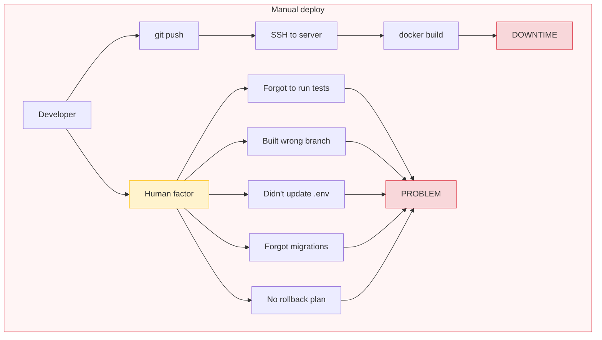
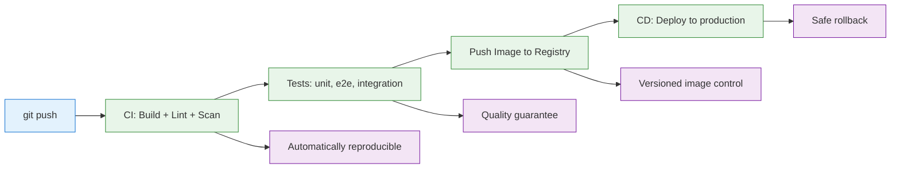
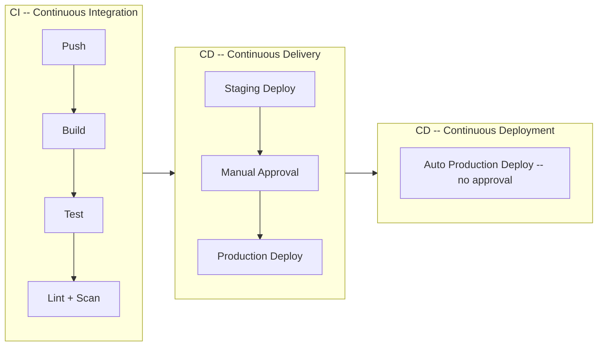
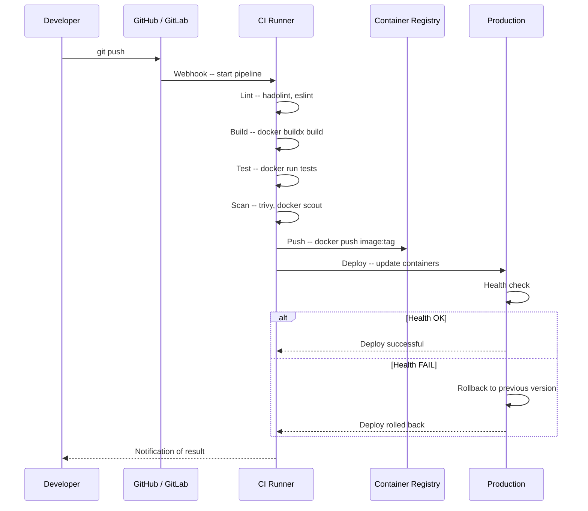
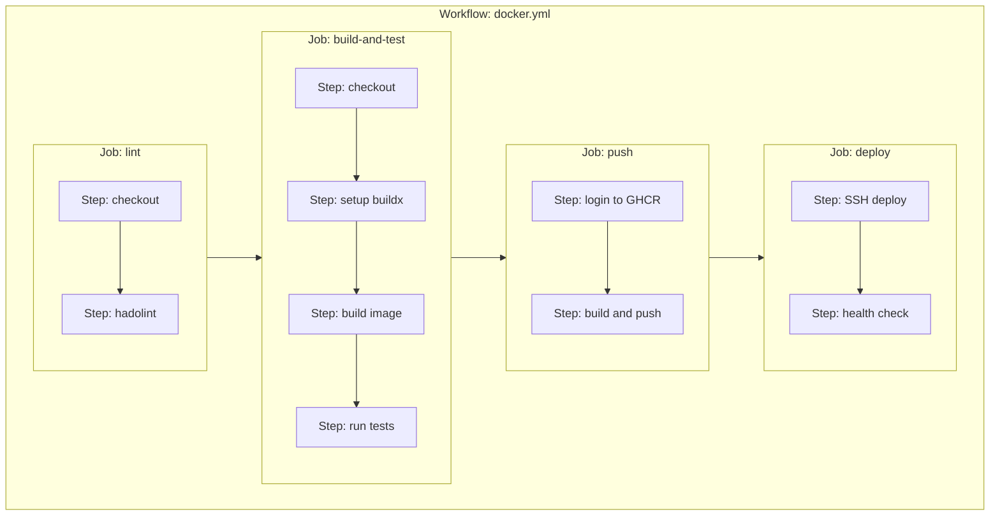

# Level 12: CI/CD with Docker

## Introduction

Imagine a car factory. In the factory, there's a conveyor line: each car goes through dozens of stations -- from body welding to final quality check. At each station, a robot performs its task, checks the result, and passes it on. If a defect is found at any station, the conveyor stops -- a defective part won't end up in a finished car.

Now imagine a factory where instead of a conveyor -- one person. They manually weld the body, manually paint, manually screw in every bolt, manually check quality. One missed bolt -- and a wheel falls off on the highway. One missed paint stage -- and the car rusts within a month.

CI/CD is a conveyor for your code. Every commit goes through automatic stations: building, testing, security checks, delivery to production. A person writes code, and everything else is done by automation. And if something breaks -- the conveyor stops before a bug reaches users.

In this level, we will explore in detail:

1. **Why CI/CD is needed** -- what problems automation solves and why manual deploy is dangerous
2. **Pipeline stages** -- what the path from commit to production consists of
3. **Docker in CI** -- building images, layer caching, testing in containers
4. **GitHub Actions and GitLab CI** -- pipeline configuration for the two most popular platforms
5. **Container Registry** -- where to store images and how to work with them
6. **Tagging strategies** -- how to properly version images
7. **Deploy strategies** -- rolling update, blue-green, canary
8. **Production configuration** -- health checks, monitoring, automatic rollback
9. **Common mistakes** -- what usually goes wrong and how to avoid it

---

## 1. Why CI/CD Is Needed

### The Pain of Manual Deploy

Many teams start with a manual process. A developer builds an image on their machine, SSHes to the server, does `git pull` and `docker-compose up -d`. For a pet project or hackathon this works. But in a real production environment, this approach inevitably leads to problems.

```bash
# Typical "deploy" in a small team
$ ssh production-server
$ cd /app
$ git pull
$ docker-compose build
$ docker-compose up -d
# "Well, seems to work..."

# And an hour later:
# - Production crashed because migrations weren't run
# - Image built with dev dependencies
# - Nobody knows what code version is currently in prod
# - Rollback? What rollback? git log and pray
```

The problem here isn't the specific commands, but the human factor. Even the most disciplined developer will sooner or later forget one of the ten deploy steps. Especially on Friday evening when a hotfix is burning.



### What CI/CD Provides

CI/CD removes the human from the "code written -- code in production" chain. A person writes code and pushes. Everything else happens automatically:



Key advantages:

| Aspect | Manual deploy | CI/CD |
|--------|---------------|-------|
| Speed | 20-60 minutes per deploy | 5-15 minutes from push to production |
| Reliability | Depends on the person | Same result every time |
| Rollback | git revert + rebuild | Switch to previous image in seconds |
| Audit | "Who deployed yesterday?" | Full history: who, when, which commit |
| Scale | One server -- still OK, three -- already chaos | 1 or 100 servers -- same process |

### CI, CD Delivery, and CD Deployment -- What's the Difference

These three acronyms are often confused, but there's a fundamental difference between them.

**CI (Continuous Integration)** -- automatic building and testing on every commit. The goal is to find errors as early as possible, while the code is still "fresh" in the developer's head. If tests fail -- the developer gets notified and fixes the problem before it reaches the main branch.

**CD (Continuous Delivery)** -- automatic delivery of tested code to the staging environment. Code is always ready for release, but the final step -- deploying to production -- is done manually, after human confirmation. This suits companies with regulatory requirements or when deployment requires coordination between teams.

**CD (Continuous Deployment)** -- full automation. Every commit that passes all checks is automatically deployed to production. No manual confirmation. This requires a high level of maturity: good test coverage, monitoring, automatic rollback.



In practice, most teams use Continuous Delivery: automatic deploy to staging, manual approval for production. Continuous Deployment is the next evolution step that mature teams with good testing infrastructure adopt.

---

## 2. CI/CD Pipeline Stages for Docker

### Pipeline Anatomy

A pipeline is a sequence of stages that code goes through on its way to production. Each stage performs its task and can stop the entire process if a problem is detected.

```yaml
# Pipeline stages
stages:
  - lint        # Code and Dockerfile check
  - build       # Docker image build
  - test        # Run tests inside container
  - scan        # Scan image for vulnerabilities
  - push        # Send image to Registry
  - deploy      # Deploy to staging/production
  - verify      # Smoke tests after deploy
```

Let's examine each stage in more detail.

**Lint** -- the first and fastest stage. Checks code for style errors and Dockerfile for best practices compliance. For Dockerfile, [hadolint](https://github.com/hadolint/hadolint) is used, which identifies problems like using `latest` tags, missing `--no-cache-dir` in `pip install`, and other anti-patterns.

```bash
# hadolint analyzes Dockerfile and outputs warnings
hadolint Dockerfile
# DL3007: Using latest is prone to errors
# DL3013: Pin versions in pip install
# DL3018: Pin versions in apk add
```

**Build** -- building the Docker image. In CI this happens on a "clean" machine, which guarantees reproducibility. If an image is built on a developer's machine, there may be local files, caches, environment variables that affect the result. A CI machine starts from scratch every time.

**Test** -- running tests inside the built container. Important: tests run in the exact container that will go to production. Not on a local machine with a different Node.js version, not in a separate environment -- but in that same image.

**Scan** -- scanning the image for known vulnerabilities (CVE). Tools like Docker Scout, Trivy, or Snyk check every package in the image for known security issues.

**Push** -- sending the verified image to Container Registry. The image gets tags (version, commit SHA) and becomes available for deployment.

**Deploy** -- the actual deployment: updating containers in the production environment to the new image version.

**Verify** -- smoke tests after deployment: checking that the application actually works in production. If the check fails -- automatic rollback.



### "Fast First" Principle

The order of stages is not random. Quick checks go first, slow ones -- last. Lint takes seconds and catches typos. No point spending 10 minutes building an image if there's a syntax error in the code.

This principle is called **fast feedback** -- a developer should learn about a problem as quickly as possible. If lint fails in 5 seconds, the developer still remembers what they wrote. If e2e tests fail in 30 minutes -- context is already lost.

---

## 3. Docker in CI: Building Images

### CI Environment Build Specifics

Building a Docker image in CI differs from local building in several important ways.

First, the CI runner usually starts from a clean state. This means there's no local Docker cache -- every layer needs to be built from scratch or explicitly loaded from an external source.

Second, CI builds must be deterministic. The same commit should give identical results regardless of which runner it builds on.

Third, it's convenient in CI to add metadata to the image -- commit SHA, build date, version. This is critical for debugging: when production is on fire, you need to quickly determine which exact code is running.

```dockerfile
# Dockerfile for CI build
FROM node:20-alpine AS builder
WORKDIR /app

# Copy only package files for dependency caching
COPY package*.json ./
RUN npm ci --only=production

COPY . .
RUN npm run build

FROM node:20-alpine AS production
WORKDIR /app
COPY --from=builder /app/dist ./dist
COPY --from=builder /app/node_modules ./node_modules

# Metadata for tracing -- CI will add values during build
ARG BUILD_DATE
ARG GIT_SHA
ARG VERSION
LABEL org.opencontainers.image.created=$BUILD_DATE
LABEL org.opencontainers.image.revision=$GIT_SHA
LABEL org.opencontainers.image.version=$VERSION

USER node
EXPOSE 3000
CMD ["node", "dist/server.js"]
```

Note the `ARG` and `LABEL`. During CI build, arguments are passed:

```bash
docker build \
  --build-arg BUILD_DATE=$(date -u +"%Y-%m-%dT%H:%M:%SZ") \
  --build-arg GIT_SHA=$(git rev-parse --short HEAD) \
  --build-arg VERSION=1.2.3 \
  -t myapp:v1.2.3 .
```

Then this metadata can be read:

```bash
docker inspect myapp:v1.2.3 --format='{{index .Config.Labels "org.opencontainers.image.revision"}}'
# a1b2c3d
```

It's like a serial number on a factory product -- you can always trace where it came from.

### Layer Caching in CI

One of the main Docker-in-CI problems -- cache loss between builds. On a local machine, Docker caches each layer: if `package.json` didn't change, `npm install` doesn't repeat. But the CI runner starts "from scratch" every time, and all cache is lost.

Without caching, a typical Node.js build takes 5-10 minutes (downloading base image + installing dependencies + building). With caching -- 30-60 seconds if dependencies haven't changed.

```bash
# Without caching: every build downloads everything from scratch
# Time: 5-10 minutes
docker build -t myapp .

# With registry caching -- cache stored remotely
# Time: 30-60 seconds (if dependencies haven't changed)
docker buildx build \
  --cache-from=type=registry,ref=myregistry.io/myapp:cache \
  --cache-to=type=registry,ref=myregistry.io/myapp:cache,mode=max \
  -t myapp:latest .
```

Working with cache requires `docker buildx` -- an extended builder that supports various caching backends.

**Cache types:**

| Cache type | Stored in | Shared between runners | Best for |
|-----------|-------------|----------------------|---|
| `type=local` | Local directory | No | Self-hosted runners with persistent storage |
| `type=registry` | Container Registry | Yes | Any CI system, universal option |
| `type=gha` | GitHub Actions Cache | Yes (within repository) | GitHub Actions |
| `type=s3` | AWS S3 or MinIO | Yes | Large projects with big cache |

```bash
# GitHub Actions Cache -- simplest option for GitHub
docker buildx build \
  --cache-from=type=gha \
  --cache-to=type=gha,mode=max \
  -t myapp:latest .

# Registry cache -- universal option
docker buildx build \
  --cache-from=type=registry,ref=ghcr.io/myorg/myapp:cache \
  --cache-to=type=registry,ref=ghcr.io/myorg/myapp:cache,mode=max \
  -t myapp:latest .

# Local cache -- for self-hosted runners
docker buildx build \
  --cache-from=type=local,src=/tmp/.buildx-cache \
  --cache-to=type=local,dest=/tmp/.buildx-cache-new,mode=max \
  -t myapp:latest .
```

The `mode=max` parameter caches all intermediate layers, not just the final one. This significantly speeds up rebuilds with changes in early Dockerfile stages. Without `mode=max`, only the final stage of a multi-stage build is cached, and when dependencies change, the entire builder stage rebuilds from scratch.

### Local Cache Rotation

When using `type=local` in CI, a nuance arises: if you write and read from the same directory, the cache can "go stale" or grow. The standard pattern -- write to a new directory and replace the old one:

```bash
# Build with cache rotation
docker buildx build \
  --cache-from=type=local,src=/tmp/.buildx-cache \
  --cache-to=type=local,dest=/tmp/.buildx-cache-new,mode=max \
  -t myapp:latest .

# Replace old cache with new
rm -rf /tmp/.buildx-cache
mv /tmp/.buildx-cache-new /tmp/.buildx-cache
```

---

## 4. GitHub Actions: CI/CD for Docker

### Workflow Structure

GitHub Actions is one of the most popular CI/CD platforms, tightly integrated with GitHub. Pipeline configuration is described in YAML files in the `.github/workflows/` directory.

Key concepts:

- **Workflow** -- the entire pipeline, described in one YAML file
- **Job** -- a group of steps running on one runner
- **Step** -- individual step within a job
- **Action** -- reusable block (analogous to a function)



### Basic Workflow

Let's go through a complete workflow, explaining each block:

```yaml
# .github/workflows/docker.yml
name: Docker CI/CD

# When to trigger the pipeline
on:
  push:
    branches: [main, develop]      # On push to main or develop
  pull_request:
    branches: [main]               # On PR to main

# Variables available to all jobs
env:
  REGISTRY: ghcr.io
  IMAGE_NAME: ${{ github.repository }}

jobs:
  # === Stage 1: Lint ===
  lint:
    runs-on: ubuntu-latest
    steps:
      - uses: actions/checkout@v4
      - name: Lint Dockerfile
        uses: hadolint/hadolint-action@v3.1.0
        with:
          dockerfile: Dockerfile

  # === Stage 2: Build + Test ===
  build-and-test:
    runs-on: ubuntu-latest
    needs: lint                    # Runs only after lint
    steps:
      - uses: actions/checkout@v4

      # Docker Buildx -- extended builder with caching
      - name: Set up Docker Buildx
        uses: docker/setup-buildx-action@v3

      # Build image but don't push -- only for tests
      - name: Build test image
        uses: docker/build-push-action@v5
        with:
          context: .
          target: builder          # Use builder-stage (with dev dependencies)
          load: true               # Load into local Docker (not push)
          tags: myapp:test
          cache-from: type=gha
          cache-to: type=gha,mode=max

      # Tests run inside the built container
      - name: Run tests
        run: |
          docker run --rm myapp:test npm test
          docker run --rm myapp:test npm run test:e2e

  # === Stage 3: Push to Registry ===
  push:
    runs-on: ubuntu-latest
    needs: build-and-test
    # Push only on push (not on PR)
    if: github.event_name == 'push'
    permissions:
      contents: read
      packages: write              # Permission to write to GHCR
    steps:
      - uses: actions/checkout@v4

      - name: Set up Docker Buildx
        uses: docker/setup-buildx-action@v3

      # Authorize in GitHub Container Registry
      - name: Log in to GHCR
        uses: docker/login-action@v3
        with:
          registry: ${{ env.REGISTRY }}
          username: ${{ github.actor }}
          password: ${{ secrets.GITHUB_TOKEN }}

      # Automatic tag generation from git context
      - name: Extract metadata
        id: meta
        uses: docker/metadata-action@v5
        with:
          images: ${{ env.REGISTRY }}/${{ env.IMAGE_NAME }}
          tags: |
            type=sha
            type=ref,event=branch
            type=semver,pattern={{version}}
            type=semver,pattern={{major}}.{{minor}}

      # Build and push in one step
      - name: Build and push
        uses: docker/build-push-action@v5
        with:
          context: .
          push: true
          tags: ${{ steps.meta.outputs.tags }}
          labels: ${{ steps.meta.outputs.labels }}
          cache-from: type=gha
          cache-to: type=gha,mode=max
```

Let's break down the key points:

- `needs: lint` -- the `build-and-test` job doesn't start until `lint` completes successfully. This creates dependencies between stages.
- `if: github.event_name == 'push'` -- the `push` job is skipped for pull requests. PRs are only checked, but the image isn't sent to the registry.
- `permissions` -- minimal rights. Least privilege principle: the job gets only the rights it needs.
- `docker/metadata-action` -- automatically generates tags from git context. Push to `main` creates tags `main` and `sha-a1b2c3d`. Creating tag `v1.2.3` creates tags `1.2.3`, `1.2`.

### Matrix Builds -- Multi-Platform Images

Modern applications often need to run on multiple platforms: `linux/amd64` (regular servers) and `linux/arm64` (AWS Graviton, Apple Silicon). Matrix strategy allows building images for multiple combinations in parallel:

```yaml
jobs:
  build:
    strategy:
      matrix:
        platform: [linux/amd64, linux/arm64]
        node-version: [18, 20, 22]
    runs-on: ubuntu-latest
    steps:
      - uses: actions/checkout@v4

      # QEMU needed for ARM emulation on x86 runner
      - name: Set up QEMU
        uses: docker/setup-qemu-action@v3

      - name: Set up Docker Buildx
        uses: docker/setup-buildx-action@v3

      - name: Build
        uses: docker/build-push-action@v5
        with:
          context: .
          platforms: ${{ matrix.platform }}
          build-args: NODE_VERSION=${{ matrix.node-version }}
          tags: myapp:node${{ matrix.node-version }}-${{ matrix.platform }}
```

A `3 x 2` matrix creates 6 parallel jobs. This is significantly faster than sequential building, but consumes more runner-minutes.

### Integration Tests with Docker Compose in CI

For full integration tests, you often need infrastructure: database, Redis, message queue. Docker Compose allows spinning all of this right in CI:

```yaml
  integration-tests:
    runs-on: ubuntu-latest
    steps:
      - uses: actions/checkout@v4

      # Start all services
      - name: Start services
        run: docker compose -f docker-compose.test.yml up -d

      # Wait for services to become available
      - name: Wait for services
        run: |
          timeout 60 bash -c 'until docker compose -f docker-compose.test.yml exec -T db pg_isready; do sleep 2; done'
          timeout 60 bash -c 'until curl -f http://localhost:3000/health; do sleep 2; done'

      # Run tests
      - name: Run integration tests
        run: docker compose -f docker-compose.test.yml exec -T app npm run test:integration

      # On error -- collect logs for debugging
      - name: Collect logs on failure
        if: failure()
        run: docker compose -f docker-compose.test.yml logs > docker-logs.txt

      - name: Upload logs
        if: failure()
        uses: actions/upload-artifact@v4
        with:
          name: docker-logs
          path: docker-logs.txt

      # Guaranteed cleanup (even on error)
      - name: Cleanup
        if: always()
        run: docker compose -f docker-compose.test.yml down -v
```

Note several important details:

- `timeout 60 bash -c 'until ...'` -- waiting with a timeout. Without a timeout, a CI job can hang forever if a service doesn't start.
- `-T` in `docker compose exec -T` -- disables TTY. In CI there's no interactive terminal, and without `-T` the command will fail.
- `if: failure()` -- step runs only if previous steps failed. This allows collecting diagnostics.
- `if: always()` -- step runs always, even on error. Cleanup must be guaranteed so resources don't leak.
- `-v` in `docker compose down -v` -- removes volumes so test data doesn't "leak" into the next run.

---

## 5. GitLab CI: Docker in Pipelines

### .gitlab-ci.yml Structure

GitLab CI -- GitLab's built-in CI/CD system. It's closer to "all in one": registry, CI, CD, monitoring -- everything inside GitLab.

The main difference from GitHub Actions: in GitLab, each job runs inside a Docker container (image). This creates an interesting situation -- to build a Docker image, you need to run Docker inside Docker.

```yaml
# .gitlab-ci.yml
stages:
  - lint
  - build
  - test
  - push
  - deploy

variables:
  DOCKER_IMAGE: $CI_REGISTRY_IMAGE
  DOCKER_TAG: $CI_COMMIT_SHORT_SHA

# Docker-in-Docker (DinD) -- Docker daemon as a separate service
services:
  - docker:24-dind

lint:
  stage: lint
  image: hadolint/hadolint:latest-alpine
  script:
    - hadolint Dockerfile

build:
  stage: build
  image: docker:24
  script:
    - docker build -t $DOCKER_IMAGE:$DOCKER_TAG .
    # Save image as artifact for subsequent stages
    - docker save $DOCKER_IMAGE:$DOCKER_TAG > image.tar
  artifacts:
    paths:
      - image.tar
    expire_in: 1 hour

test:
  stage: test
  image: docker:24
  script:
    # Load image from artifact
    - docker load < image.tar
    - docker run --rm $DOCKER_IMAGE:$DOCKER_TAG npm test

push:
  stage: push
  image: docker:24
  only:
    - main
    - tags
  script:
    - docker load < image.tar
    - docker login -u $CI_REGISTRY_USER -p $CI_REGISTRY_PASSWORD $CI_REGISTRY
    - docker push $DOCKER_IMAGE:$DOCKER_TAG
    - |
      if [ -n "$CI_COMMIT_TAG" ]; then
        docker tag $DOCKER_IMAGE:$DOCKER_TAG $DOCKER_IMAGE:$CI_COMMIT_TAG
        docker push $DOCKER_IMAGE:$CI_COMMIT_TAG
      fi
```

Key GitLab CI variables:

| Variable | Description | Example |
|------------|----------|--------|
| `$CI_REGISTRY_IMAGE` | Image address in GitLab Registry | `registry.gitlab.com/mygroup/myapp` |
| `$CI_COMMIT_SHORT_SHA` | Short commit SHA | `a1b2c3d` |
| `$CI_COMMIT_TAG` | Git tag (if exists) | `v1.2.3` |
| `$CI_REGISTRY_USER` | Registry user | `gitlab-ci-token` |
| `$CI_REGISTRY_PASSWORD` | Registry token | automatic |

### Docker-in-Docker vs Kaniko

Docker-in-Docker (DinD) runs a Docker daemon as a service within the CI job. This works but has security implications -- the DinD container needs `--privileged` mode.

Kaniko is an alternative -- it builds images without a Docker daemon:

```yaml
build:
  stage: build
  image:
    name: gcr.io/kaniko-project/executor:debug
    entrypoint: [""]
  script:
    - /kaniko/executor
      --context $CI_PROJECT_DIR
      --dockerfile $CI_PROJECT_DIR/Dockerfile
      --destination $CI_REGISTRY_IMAGE:$CI_COMMIT_SHORT_SHA
```

Kaniko is safer (no privileged mode needed) but doesn't support all Dockerfile features and can be slower.

---

## 6. Container Registry: Where to Store Images

### Popular Registries

| Registry | Address | Best for |
|----------|---------|----------|
| Docker Hub | docker.io | Public images, small projects |
| GitHub Container Registry | ghcr.io | GitHub-based projects |
| GitLab Container Registry | registry.gitlab.com | GitLab-based projects |
| Amazon ECR | `<id>.dkr.ecr.<region>.amazonaws.com` | AWS infrastructure |
| Google Artifact Registry | `<region>-docker.pkg.dev` | GCP infrastructure |
| Azure Container Registry | `<name>.azurecr.io` | Azure infrastructure |

### Image Lifecycle Management

```bash
# List images in GHCR
curl -H "Authorization: Bearer $TOKEN" \
  https://ghcr.io/v2/myorg/myapp/tags/list

# Delete an old tag
curl -X DELETE -H "Authorization: Bearer $TOKEN" \
  https://ghcr.io/v2/myorg/myapp/manifests/sha256:abc123...

# Set retention policy (GitHub)
# Settings > Packages > Delete old versions
```

Best practice: automatically delete old, unused images. Keep the last N versions and any with SemVer tags.

---

## 7. Tagging Strategies

### Recommended Approach

```yaml
# Tags generated by docker/metadata-action
tags: |
  type=sha                              # Commit SHA -- unique, traceable
  type=ref,event=branch                 # Branch name -- for tracking
  type=semver,pattern={{version}}       # Full version -- 1.2.3
  type=semver,pattern={{major}}.{{minor}} # Major.minor -- 1.2
```

This gives you:
- **SHA** -- exact traceability to a commit
- **Branch** -- knowing which branch was built
- **Full version** -- for production pinning
- **Major.minor** -- for users who want minor updates automatically

### What NOT to Do

```bash
# ❌ Don't use only latest
docker push myapp:latest

# ❌ Don't overwrite version tags
docker tag myapp:v1.2.3 myapp:v1.2  # Overwriting v1.2!

# ❌ Don't use mutable tags in production
deploy:
  image: myapp:latest  # Unpredictable
```

---

## 8. Deploy Strategies

### Rolling Update

The simplest and most common approach. Containers are updated one by one:

```bash
# Docker Compose -- zero downtime rolling update
docker compose up -d --no-deps --build api

# Old api container stops, new one starts
# Other services (db, redis, web) are not affected
```

### Blue-Green Deploy

Two identical environments: "blue" (current production) and "green" (new version). After testing green, traffic is switched:

```bash
# Deploy new version to green
docker compose -f docker-compose.yml -f docker-compose.green.yml up -d

# Test green
curl http://green-server:3000/health

# Switch traffic from blue to green
# (via load balancer or DNS)
```

### Canary Deploy

New version is released to a small percentage of users first:

```yaml
# 10% of traffic goes to the new version
services:
  api-canary:
    image: myapp:v1.3.0-canary
    deploy:
      replicas: 1
  api-stable:
    image: myapp:v1.2.3
    deploy:
      replicas: 9
```

If the canary version shows no errors -- gradually increase its traffic share. If errors appear -- rollback.

---

## 9. Production Configuration

### Health Checks in Production

```yaml
services:
  api:
    image: myapp:v1.2.3
    healthcheck:
      test: ['CMD-SHELL', 'curl -f http://localhost:3000/health || exit 1']
      interval: 15s
      timeout: 5s
      retries: 3
      start_period: 20s
    restart: unless-stopped
```

### Monitoring

```bash
# Container resource monitoring
docker stats --no-stream --format "table {{.Name}}\t{{.CPUPerc}}\t{{.MemUsage}}"

# Container logs with rotation
docker logs --tail 100 --since 1h myapp
```

### Automatic Rollback

If a health check fails after deploy, roll back to the previous version:

```bash
#!/bin/bash
# deploy-with-rollback.sh

IMAGE=$1
PREV_IMAGE=$2

# Deploy new version
docker compose up -d --no-deps --build api

# Wait and check health
sleep 30
HEALTH=$(docker inspect --format='{{.State.Health.Status}}' myapp-api-1)

if [ "$HEALTH" != "healthy" ]; then
  echo "Health check failed, rolling back..."
  docker compose up -d --no-deps $PREV_IMAGE
  exit 1
fi

echo "Deploy successful!"
```

---

## Common Beginner Mistakes

### 1. Not Caching in CI

```yaml
# ❌ Every build downloads everything from scratch
- run: docker build -t myapp .

# ✅ Use cache
- uses: docker/setup-buildx-action@v3
- uses: docker/build-push-action@v5
  with:
    cache-from: type=gha
    cache-to: type=gha,mode=max
```

### 2. Pushing on Every PR

```yaml
# ❌ Pushing untested images to registry
push:
  # Runs on every PR -- registry fills with untested images

# ✅ Push only on merge to main
push:
  if: github.event_name == 'push' && github.ref == 'refs/heads/main'
```

### 3. Not Scanning Images

Always include a vulnerability scanning stage in your pipeline:

```yaml
scan:
  runs-on: ubuntu-latest
  needs: build
  steps:
    - uses: aquasecurity/trivy-action@master
      with:
        image-ref: myapp:test
        severity: CRITICAL,HIGH
        exit-code: 1
```

### 4. No Health Checks After Deploy

Always verify the deployed version actually works:

```yaml
verify:
  runs-on: ubuntu-latest
  needs: deploy
  steps:
    - name: Health check
      run: |
        for i in {1..10}; do
          if curl -f http://$SERVER/health; then
            echo "Healthy!"
            exit 0
          fi
          sleep 5
        done
        echo "Health check failed!"
        exit 1
```

---

## Summary

CI/CD with Docker automates the path from code to production:

- **Lint** -- catch style and Dockerfile errors early
- **Build** -- reproducible image builds on clean machines
- **Test** -- run tests in the same container that goes to production
- **Scan** -- find vulnerabilities before they reach production
- **Push** -- versioned images in a registry
- **Deploy** -- update containers with health checks and rollback capability

Key rules:
- ✅ Always cache Docker layers in CI (type=gha, type=registry)
- ✅ Use multi-stage builds for smaller production images
- ✅ Tag images with commit SHA, version, and branch
- ✅ Include vulnerability scanning in every pipeline
- ✅ Always verify deployed version with health checks
- ✅ Have an automatic rollback strategy
- ❌ Don't push untested images to registry
- ❌ Don't skip the lint stage
- ❌ Don't deploy to production without health verification
