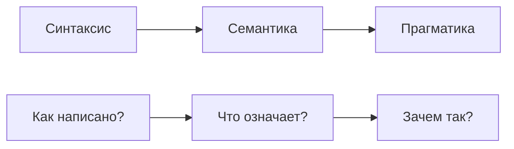
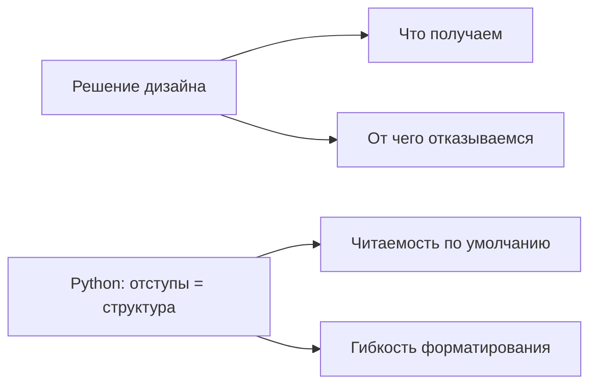
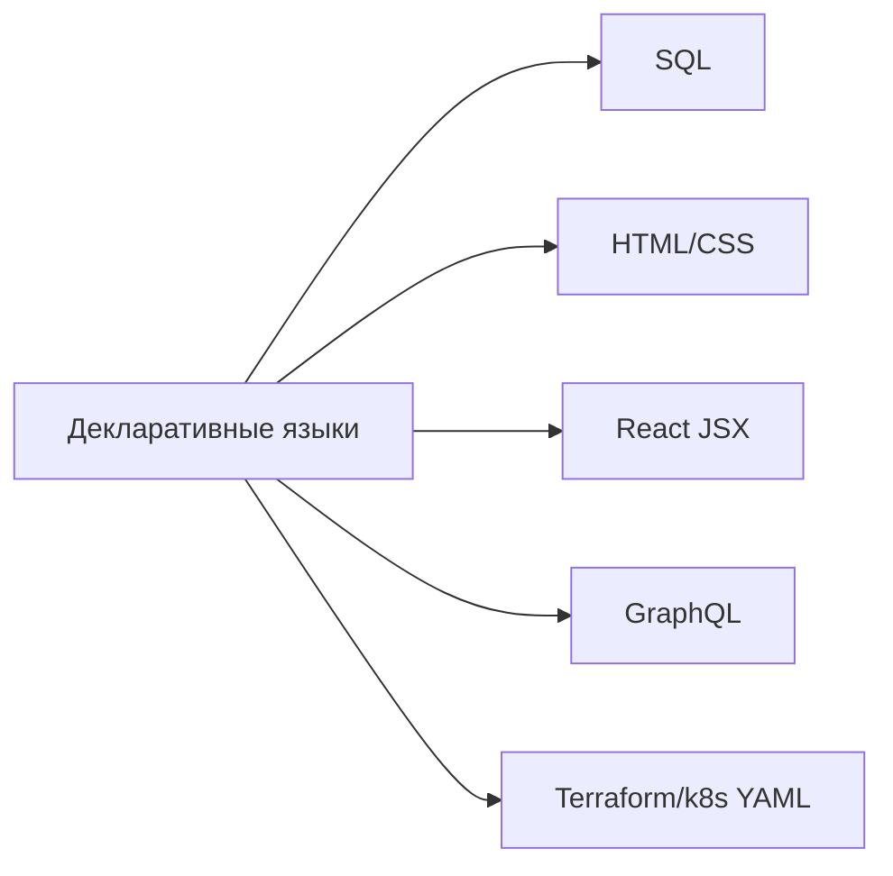
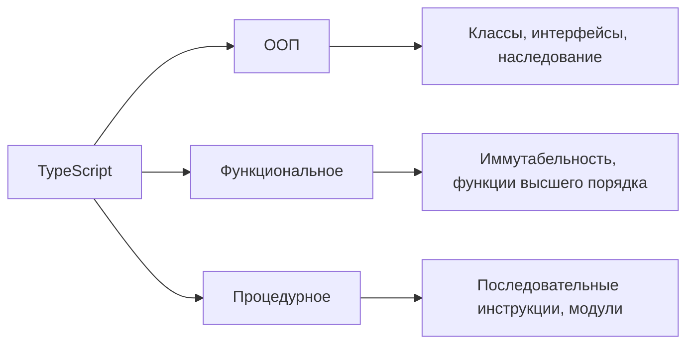
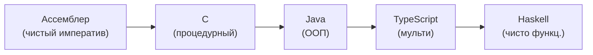

# Язык, семантика и парадигмы — подробная теория

## Что вообще такое язык программирования?

Язык — это инструмент мышления. Не просто способ писать инструкции для компьютера, а система, которая формирует то, как вы *думаете* о проблемах. Люди, пишущие на Haskell, думают о программах иначе, чем люди на Java. Дело не в синтаксисе, а в концептуальной рамке.

Любой язык программирования можно рассматривать через три линзы:



---

## Синтаксис: грамматика языка

Синтаксис — это набор правил, определяющих, какие последовательности символов являются корректными программами. Это чистая форма без смысла.

Синтаксис задаётся грамматикой. Формально — через BNF (Backus-Naur Form) или EBNF. Вот упрощённая грамматика выражения:

```
expression ::= term (('+' | '-') term)*
term       ::= factor (('*' | '/') factor)*
factor     ::= NUMBER | '(' expression ')'
```

Это описывает, что `2 + 3 * 4` — корректное выражение, а `2 + * 3` — нет.

Парсер превращает текст программы в абстрактное синтаксическое дерево (AST):

```
    +
   / \
  2   *
     / \
    3   4
```

💡 Разные языки могут иметь разный синтаксис, но одинаковую семантику. `x += 1`, `x = x + 1`, `x++` — три разных синтаксических формы, но очень близкая семантика.

⚠️ Распространённая ошибка: путать синтаксические и семантические ошибки.

```typescript
// Синтаксически корректно, семантически бессмысленно:
const result = "hello" - 42  // TypeScript ругается на уровне типов
                              // JavaScript даст NaN в рантайме

// Синтаксически некорректно:
const x = {  // ← Unexpected end of input
```

---

## Семантика: что программа означает

Семантика отвечает на вопрос: что *происходит*, когда выполняется эта конструкция? Это гораздо сложнее синтаксиса.

Существует три классических подхода к определению семантики, и все три вам встретятся в реальной работе:

### Операционная семантика

Описывает выполнение через абстрактную машину. "Вот шаги, которые выполняются по очереди." Это то, как работают интерпретаторы.

```typescript
// Операционная семантика for-цикла:
// 1. Выполни инициализацию: let i = 0
// 2. Проверь условие: i < arr.length
// 3. Если true — выполни тело
// 4. Выполни постшаг: i++
// 5. Перейди к шагу 2
for (let i = 0; i < arr.length; i++) {
  console.log(arr[i])
}
```

Операционная семантика — самая интуитивная. Именно так большинство разработчиков думает о коде.

### Денотационная семантика

Описывает значение программы через математические функции. Программа — это функция от входа к выходу, без деталей исполнения.

```typescript
// Денотационный взгляд: map — это функция
// [A] × (A → B) → [B]
// Список чего угодно + функция преобразования = новый список
const map = <A, B>(arr: A[], fn: (a: A) => B): B[] => arr.map(fn)

// Нас не интересует, как именно происходит итерация
// Только: что входит, что выходит
```

Функциональное программирование во многом выросло из денотационной семантики.

### Аксиоматическая семантика

Описывает поведение через пред- и постусловия (тройки Хоара). "До выполнения этого кода истинно X, после выполнения истинно Y."

```typescript
// Аксиоматический взгляд на сортировку:
// Предусловие: arr — массив чисел
// Постусловие: результат содержит те же элементы, что arr,
//              и для каждого i < j: result[i] <= result[j]
const sort = (arr: number[]): number[] => [...arr].sort((a, b) => a - b)
```

Именно аксиоматическая семантика лежит в основе формальной верификации и Design by Contract.

📌 На практике вы постоянно работаете с семантикой: когда читаете документацию ("что делает эта функция?"), пишете тесты ("при таком входе ожидаю такой выход") — вы мыслите семантически.

---

## Прагматика: зачем язык устроен именно так

Прагматика — это контекст и намерения. Почему Python требует отступы? Почему в Rust нет GC? Почему TypeScript добавил `unknown` в дополнение к `any`?

Каждое решение в дизайне языка несёт за собой trade-off:



TypeScript появился как прагматический ответ на проблему: крупные JavaScript-кодовые базы невозможно поддерживать без типов. Прагматика TypeScript — это "JavaScript, который масштабируется".

```typescript
// unknown появился, потому что any "отключал" весь type checker
// Прагматика unknown: "мы не знаем тип, но обязаны проверить перед использованием"

function processInput(value: unknown) {
  // Нельзя просто взять и использовать:
  // value.toUpperCase()  // ❌ Ошибка компилятора

  // Нужно сначала сузить тип:
  if (typeof value === 'string') {
    return value.toUpperCase()  // ✅
  }
}
```

---

## Декларативный стиль: описываем желаемое

Декларативное программирование — это описание *что* нужно получить, без указания *как* это получить.

Лучшая аналогия: SQL. Когда вы пишете `SELECT name FROM users WHERE age > 18 ORDER BY name`, вы не указываете, как обходить таблицу, строить индекс или сортировать. Вы описываете результат.



Примеры декларативного кода в TypeScript:

```typescript
const users = [
  { name: 'Alice', age: 25, role: 'admin' },
  { name: 'Bob', age: 17, role: 'user' },
  { name: 'Carol', age: 30, role: 'admin' },
]

// Декларативно: цепочка описывает НАМЕРЕНИЕ, не алгоритм
const adminNames = users
  .filter(u => u.age >= 18)
  .filter(u => u.role === 'admin')
  .map(u => u.name)
  .sort()

// Тот же результат, но императивно:
const adminNamesImperative: string[] = []
for (const user of users) {
  if (user.age >= 18 && user.role === 'admin') {
    adminNamesImperative.push(user.name)
  }
}
adminNamesImperative.sort()
```

React JSX — декларативное описание UI:

```tsx
// Декларативно: "хочу список пользователей"
const UserList = ({ users }: { users: User[] }) => (
  <ul>
    {users.map(user => (
      <li key={user.id}>{user.name}</li>
    ))}
  </ul>
)

// Не нужно думать: "найди DOM-узел, создай элемент, вставь его..."
// React решает "как" сам
```

---

## Императивный стиль: описываем как делать

Императивное программирование — последовательность шагов, изменяющих состояние программы.

```typescript
// Классический императивный алгоритм — сортировка пузырьком
function bubbleSort(arr: number[]): number[] {
  const result = [...arr]
  const n = result.length

  for (let i = 0; i < n - 1; i++) {
    for (let j = 0; j < n - i - 1; j++) {
      if (result[j] > result[j + 1]) {
        // Явный swap — изменяем состояние
        const temp = result[j]
        result[j] = result[j + 1]
        result[j + 1] = temp
      }
    }
  }

  return result
}
```

Императивный стиль понятнее в алгоритмически сложных задачах, где важна эффективность или нужен тонкий контроль.

⚠️ Проблема не в императивном стиле самом по себе, а в неконтролируемых мутациях и глобальном состоянии:

```typescript
// ❌ Мутация внешнего состояния — источник багов
let total = 0
const items = [1, 2, 3]
items.forEach(item => {
  total += item  // побочный эффект
})

// ✅ Явное вычисление без мутации внешней переменной
const total2 = items.reduce((acc, item) => acc + item, 0)
```

---

## Мультипарадигменность: TypeScript как пример

TypeScript намеренно не навязывает одну парадигму. Это позволяет выбирать подход под задачу:



```typescript
// ООП: состояние инкапсулировано в объекте
class ShoppingCart {
  private items: CartItem[] = []

  add(item: CartItem): void {
    this.items.push(item)
  }

  total(): number {
    return this.items.reduce((sum, item) => sum + item.price, 0)
  }
}

// Функциональное: состояние передаётся явно
type CartState = { items: CartItem[] }

const addItem = (cart: CartState, item: CartItem): CartState => ({
  ...cart,
  items: [...cart.items, item],
})

const total = (cart: CartState): number =>
  cart.items.reduce((sum, item) => sum + item.price, 0)

// Процедурное: для простых скриптов или утилит
function processConfig(path: string): Config {
  const raw = readFileSync(path, 'utf-8')
  const parsed = JSON.parse(raw)
  return validate(parsed)
}
```

---

## Почему чистые парадигмы не существуют

Даже "чисто функциональный" Haskell имеет монаду IO для работы с побочными эффектами. Даже "чисто объектный" Smalltalk имеет метаклассы как объекты.

В реальных проектах парадигмы перемешиваются:

```typescript
// React-компонент: микс деклататива и ООП
class Counter extends React.Component<{}, { count: number }> {
  // ООП: класс с состоянием
  state = { count: 0 }

  // Декларативно: JSX описывает UI
  render() {
    return (
      <div>
        <span>{this.state.count}</span>
        <button onClick={() => this.setState(s => ({ count: s.count + 1 }))}>
          +
        </button>
      </div>
    )
  }
}
```

🎯 Цель — не чистота парадигмы, а решение задачи с минимальной сложностью.

---

## Первоклассные сущности (First-Class Citizens)

Сущность языка называется "первоклассной", если с ней можно:
1. Присвоить переменной
2. Передать аргументом
3. Вернуть из функции
4. Сохранить в структуре данных

В JavaScript/TypeScript функции — первоклассные объекты. Это открывает огромные возможности:

```typescript
// 1. Функция как значение переменной
const greet = (name: string) => `Hello, ${name}!`

// 2. Функция как аргумент (callback)
const names = ['Alice', 'Bob']
const greetings = names.map(greet)  // ['Hello, Alice!', 'Hello, Bob!']

// 3. Функция как возвращаемое значение (замыкание)
const createGreeter = (greeting: string) => (name: string) =>
  `${greeting}, ${name}!`

const sayHi = createGreeter('Hi')
const sayHola = createGreeter('Hola')

// 4. Функция в структуре данных
const handlers: Record<string, (event: Event) => void> = {
  click: handleClick,
  keydown: handleKeydown,
}
```

Это основа функционального программирования и паттернов вроде стратегии, команды, middleware.

---

## Как выбор парадигмы влияет на архитектуру

Парадигма — это не просто стиль кода. Это архитектурное решение с долгосрочными последствиями.

| Парадигма | Единица организации | Подходит для |
|---|---|---|
| ООП | Классы, объекты | Моделирование предметной области |
| Функциональная | Функции, данные | Трансформации данных, предсказуемость |
| Процедурная | Процедуры, модули | Скрипты, утилиты |
| Реактивная | Потоки событий | UI, real-time системы |

```typescript
// Одна задача — три архитектурных подхода

// ООП: предметная область как объекты
class Order {
  constructor(private items: Item[]) {}
  discount(percent: number): Order { /* ... */ }
  total(): number { /* ... */ }
}

// Функциональный: данные + трансформации отдельно
type Order = { items: Item[] }
const applyDiscount = (order: Order, percent: number): Order => ({ /* ... */ })
const orderTotal = (order: Order): number => { /* ... */ }

// Реактивный: заказ как поток изменений
const order$ = new Subject<OrderAction>()
const total$ = order$.pipe(scan(reducer, initialState), map(orderTotal))
```

📌 В большинстве реальных проектов выбор парадигмы диктуется: командой, фреймворком, доменом задачи. Понимание всех парадигм позволяет осознанно работать в любом контексте.

---

## Спектр парадигм



Ни один конец спектра не "лучше". Каждый — оптимален для своей задачи.

---

## Итог: три вопроса к любому коду

Когда читаете или пишете код, задавайте три вопроса:

1. **Синтаксис**: Это вообще корректная программа? Компилятор/интерпретатор это поймёт?
2. **Семантика**: Что этот код *делает*? Это соответствует намерению?
3. **Прагматика**: Почему так? Это лучший инструмент для данной задачи?

Большинство ошибок в архитектуре — это ошибки прагматики. Код синтаксически верен, семантически корректен, но выбрана не та парадигма для данного домена.

## ⚠️ Типичные ошибки новичков

**1. Путать синтаксическую корректность с правильностью**

```typescript
// ❌ Компилируется — не значит правильно
const users = fetchUsers()
users.forEach(u => {
  if (u.active = true) {  // Присваивание вместо сравнения!
    sendEmail(u)
  }
})

// ✅ Используйте === для сравнения
users.forEach(u => {
  if (u.active === true) {
    sendEmail(u)
  }
})
```

**2. Применять одну парадигму везде**

```typescript
// ❌ ООП там, где не нужно — overengineering
class NumberDoubler {
  double(x: number): number {
    return x * 2
  }
}
const doubler = new NumberDoubler()
doubler.double(5)

// ✅ Простая функция для простой задачи
const double = (x: number) => x * 2
double(5)
```

**3. Игнорировать прагматику чужого кода**

```typescript
// Когда видите незнакомый паттерн — спросите "зачем", не "что"
// Например, почему здесь используется Builder, а не просто объект?
// Возможно, из-за опциональных параметров или валидации при создании
const query = new QueryBuilder()
  .from('users')
  .where('age > 18')
  .orderBy('name')
  .build()
```
