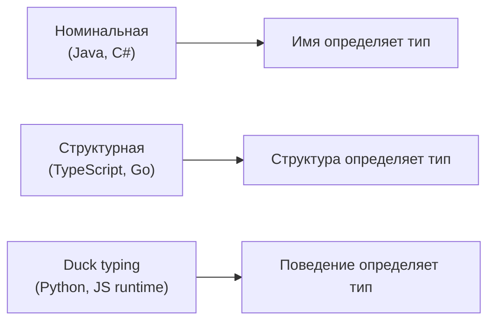
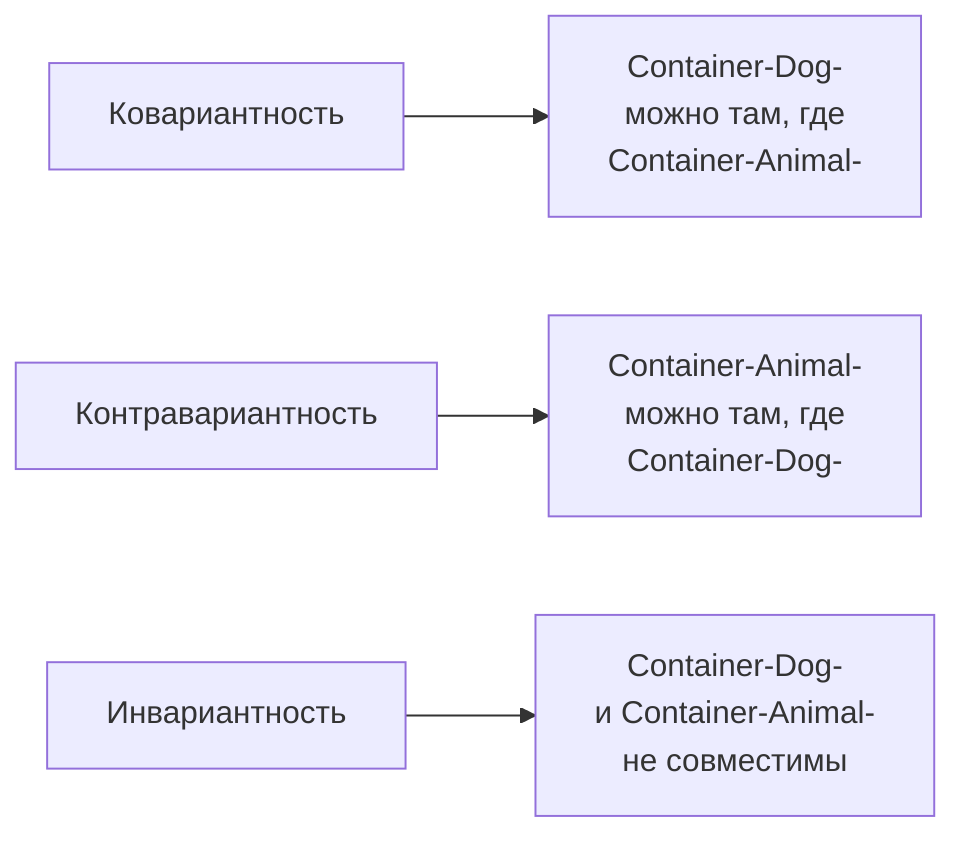

# Система типов и дженерики — подробная теория

## Зачем нужны типы?

Представьте большой склад. Без маркировки на ящиках — вы открываете каждый наугад, чтобы понять, что внутри. С маркировкой — вы знаете содержимое до открытия. Типы — это маркировка вашего кода.

Типы выполняют три роли:

**1. Документация, которая не устаревает**
```typescript
// Без типов: что возвращает эта функция? Что такое userId?
function getUser(userId) { /* ... */ }

// С типами: всё ясно без комментариев
function getUser(userId: string): Promise<User | null> { /* ... */ }
```

**2. Контракт между компонентами**
```typescript
// Тип — это соглашение между производителем и потребителем данных
type ApiResponse<T> = {
  data: T
  status: number
  message: string
}

// Обе стороны обязаны его соблюдать
function fetchUser(id: string): Promise<ApiResponse<User>> { /* ... */ }
function displayUser(response: ApiResponse<User>): void { /* ... */ }
```

**3. Автоматическая проверка до запуска**
```typescript
// TypeScript поймает это до деплоя
const user = await fetchUser(123)  // ❌ number вместо string
```

---

## Номинальная типизация: имя как идентичность

В номинальных системах (Java, C#, Swift) тип определяется именем. Два класса с одинаковой структурой — разные типы, если у них разные имена.

```typescript
// Эмуляция номинальной типизации в TypeScript через brand
type UserId = string & { readonly __brand: 'UserId' }
type OrderId = string & { readonly __brand: 'OrderId' }

const createUserId = (id: string): UserId => id as UserId
const createOrderId = (id: string): OrderId => id as OrderId

function getUser(id: UserId): User { /* ... */ }

const userId = createUserId('user-123')
const orderId = createOrderId('order-456')

getUser(userId)   // ✅
getUser(orderId)  // ❌ OrderId не совместим с UserId, хотя оба string
```

Это называется "branding" и используется для предотвращения смешивания семантически разных значений одного типа.

**Когда номинальная типизация полезна:** предотвращение ошибок передачи OrderId вместо UserId, защита от смешивания денежных единиц, метрических единиц.

---

## Структурная типизация: структура как идентичность

TypeScript использует структурную типизацию. Два типа совместимы, если один содержит все поля другого.



```typescript
type Printable = { print(): void }
type Serializable = { serialize(): string }

// Класс автоматически совместим с типом, если имеет нужные поля/методы
class Document {
  print() { console.log('Printing...') }
  serialize() { return JSON.stringify(this) }
}

// Document нигде явно не объявлен как Printable или Serializable
const doc = new Document()

function printAll(items: Printable[]): void {
  items.forEach(item => item.print())
}

printAll([doc])  // ✅ Document структурно совместим с Printable
```

💡 Структурная типизация особенно удобна при работе с API: не нужно импортировать типы из внешней библиотеки — достаточно описать нужную структуру.

```typescript
// Вместо импорта axios.AxiosResponse:
type HttpResponse = { data: unknown; status: number }

function handleResponse(res: HttpResponse) { /* ... */ }
// Axios response автоматически совместим — у него есть эти поля
```

---

## Duck Typing: типизация во время выполнения

"Если это ходит как утка и крякает как утка — это утка." В JavaScript без TypeScript типы проверяются только в рантайме:

```javascript
// JavaScript: никакой проверки до выполнения
function quack(duck) {
  duck.quack()  // Ошибка только если вызвать с неправильным объектом
}

quack({ quack: () => console.log('Quack!') })  // ✅ Работает
quack({ speak: () => console.log('Hello') })   // ❌ TypeError в рантайме
```

TypeScript переносит проверку duck typing на этап компиляции — это его ключевая ценность.

---

## Вариантность: самая сложная часть системы типов

Вариантность отвечает на вопрос: если `Dog extends Animal`, то как соотносятся `Container<Dog>` и `Container<Animal>`?

Три варианта:



### Ковариантность: по течению

Ковариантность — это когда подтип остаётся подтипом в составном типе. Работает для "производителей" (readonly-контейнеры, возвращаемые типы).

```typescript
type Animal = { name: string }
type Dog = Animal & { breed: string }

// readonly массив — ковариантен
type ReadonlyAnimals = readonly Animal[]
type ReadonlyDogs = readonly Dog[]

const dogs: ReadonlyDogs = [{ name: 'Rex', breed: 'Lab' }]
const animals: ReadonlyAnimals = dogs  // ✅ Безопасно — только читаем

// Возвращаемые типы — ковариантны
type AnimalFactory = () => Animal
type DogFactory = () => Dog

const dogFactory: DogFactory = () => ({ name: 'Rex', breed: 'Lab' })
const animalFactory: AnimalFactory = dogFactory  // ✅ Dog всегда Animal
```

Почему это безопасно? Потому что Dog содержит все поля Animal. Читая Dog как Animal — мы никогда не получим "лишнего".

### Контравариантность: против течения

Контравариантность — параметры функций идут в обратном направлении. Функция, принимающая Animal, безопасно подходит там, где ожидается функция, принимающая Dog.

```typescript
type AnimalHandler = (animal: Animal) => void
type DogHandler = (dog: Dog) => void

const handleAnimal: AnimalHandler = (a) => console.log(a.name)
const handleDog: DogHandler = handleAnimal  // ✅

// Почему это безопасно?
// DogHandler ожидает: "дай мне Dog"
// handleAnimal работает с любым Animal (а Dog — это Animal)
// Значит handleAnimal точно справится с Dog
```

TypeScript включает контравариантность параметров через флаг `--strictFunctionTypes`:

```typescript
// Без strictFunctionTypes — TypeScript позволяет это (бифариантность)
// С strictFunctionTypes — правильная контравариантность

type Callback<T> = (value: T) => void

const animalCb: Callback<Animal> = (a) => console.log(a.name)
const dogCb: Callback<Dog> = animalCb  // ✅ С strictFunctionTypes

const specificCb: Callback<Animal> = (a: Dog) => console.log(a.breed)
// ❌ Нельзя: потребует поле breed, которого нет у Animal
```

### Инвариантность: ни туда, ни сюда

Изменяемые контейнеры инвариантны — они не совместимы ни в одну сторону.

```typescript
// Изменяемый массив инвариантен
const dogs: Dog[] = []
const animals: Animal[] = dogs  // ❌ Опасно!

// Почему? Потому что:
animals.push({ name: 'Cat' })  // Animal без breed
// Теперь dogs содержит объект без breed — нарушение типа!
```

📌 Правило большого пальца:
- Читаете → ковариантность (readonly)
- Пишете → контравариантность (параметры)
- И читаете, и пишете → инвариантность (изменяемый контейнер)

---

## Дженерики: параметрический полиморфизм

Дженерики позволяют писать код, который работает с любым типом, сохраняя полную информацию о нём.

```typescript
// Без дженериков: дублирование кода
function firstNumber(arr: number[]): number | undefined { return arr[0] }
function firstString(arr: string[]): string | undefined { return arr[0] }

// С дженериками: один код для всех типов
function first<T>(arr: T[]): T | undefined { return arr[0] }

// TypeScript автоматически выводит T:
const n = first([1, 2, 3])    // T = number, n: number | undefined
const s = first(['a', 'b'])   // T = string, s: string | undefined
```

### Constraints: требования к типу-параметру

Constraint `extends` ограничивает допустимые типы-параметры:

```typescript
// Только типы с полем length
function getLength<T extends { length: number }>(item: T): number {
  return item.length
}

// Только типы с ключами объекта K
function getProperty<T, K extends keyof T>(obj: T, key: K): T[K] {
  return obj[key]
}

const user = { name: 'Alice', age: 25 }
const name = getProperty(user, 'name')  // type: string
const age = getProperty(user, 'age')    // type: number
getProperty(user, 'email')              // ❌ 'email' не является ключом User
```

### Conditional Types: типы с ветвлением

```typescript
// Тип, зависящий от другого типа
type IsArray<T> = T extends unknown[] ? 'yes' : 'no'

type A = IsArray<string[]>  // 'yes'
type B = IsArray<string>    // 'no'

// Практичный пример: Awaited
type Awaited<T> = T extends Promise<infer R> ? R : T

type UserPromise = Promise<User>
type ResolvedUser = Awaited<UserPromise>  // User
```

---

## any vs unknown vs never

Три особых типа TypeScript, которые часто путают:

```typescript
// any: отключает проверки — "я уверен, доверяй мне"
let x: any = 'hello'
x.nonExistentMethod()  // Нет ошибки компилятора → RuntimeError

// unknown: "что-то пришло, нужно разобраться"
let y: unknown = 'hello'
y.toUpperCase()  // ❌ Ошибка — нужно narrowing

if (typeof y === 'string') {
  y.toUpperCase()  // ✅
}

// never: "этого никогда не должно произойти"
function assertNever(x: never): never {
  throw new Error(`Unexpected value: ${x}`)
}

type Shape = 'circle' | 'square'
function area(shape: Shape): number {
  switch (shape) {
    case 'circle': return Math.PI
    case 'square': return 1
    default: return assertNever(shape)  // Если добавить новый Shape и забыть обработать — ошибка компилятора
  }
}
```

📌 Иерархия безопасности: `never` < конкретные типы < `unknown` < `any`

---

## Type Narrowing: сужение типов

TypeScript умеет сужать тип внутри условных блоков:

```typescript
type StringOrNumber = string | number

function process(value: StringOrNumber): string {
  // Здесь value: string | number

  if (typeof value === 'string') {
    // Здесь value: string — TypeScript это знает
    return value.toUpperCase()
  }

  // Здесь value: number — string исключён
  return value.toFixed(2)
}
```

Type Guards — пользовательские функции для narrowing:

```typescript
type Cat = { meow(): void }
type Dog = { bark(): void }

// Type Guard: возвращаемый тип `value is Dog`
function isDog(animal: Cat | Dog): animal is Dog {
  return 'bark' in animal
}

function handlePet(animal: Cat | Dog) {
  if (isDog(animal)) {
    animal.bark()  // ✅ animal: Dog
  } else {
    animal.meow()  // ✅ animal: Cat
  }
}
```

---

## Алгебраические типы: Union и Intersection

TypeScript поддерживает алгебраическую систему типов:

```typescript
// Union (|): "или" — одно из
type Result<T, E> = { success: true; data: T } | { success: false; error: E }

// Discriminated Union — с общим полем-дискриминантом
type Shape =
  | { kind: 'circle'; radius: number }
  | { kind: 'square'; side: number }
  | { kind: 'rectangle'; width: number; height: number }

function area(shape: Shape): number {
  switch (shape.kind) {
    case 'circle': return Math.PI * shape.radius ** 2
    case 'square': return shape.side ** 2
    case 'rectangle': return shape.width * shape.height
  }
}

// Intersection (&): "и" — всё сразу
type Timestamped = { createdAt: Date; updatedAt: Date }
type WithId = { id: string }

type UserRecord = User & Timestamped & WithId
// Должен иметь ВСЕ поля: User + timestamps + id
```

---

## Практические паттерны с дженериками

### Repository Pattern

```typescript
interface Repository<T extends { id: string }> {
  findById(id: string): Promise<T | null>
  findAll(): Promise<T[]>
  save(entity: T): Promise<T>
  delete(id: string): Promise<void>
}

// Конкретная реализация
class UserRepository implements Repository<User> {
  async findById(id: string): Promise<User | null> { /* ... */ }
  async findAll(): Promise<User[]> { /* ... */ }
  async save(user: User): Promise<User> { /* ... */ }
  async delete(id: string): Promise<void> { /* ... */ }
}
```

### Типобезопасный EventEmitter

```typescript
type EventMap = {
  'user:created': { user: User }
  'user:deleted': { userId: string }
  'order:placed': { order: Order }
}

class TypedEmitter<T extends Record<string, unknown>> {
  on<K extends keyof T>(event: K, handler: (payload: T[K]) => void): void { /* ... */ }
  emit<K extends keyof T>(event: K, payload: T[K]): void { /* ... */ }
}

const emitter = new TypedEmitter<EventMap>()
emitter.on('user:created', ({ user }) => console.log(user.name))  // ✅ user типизирован
emitter.emit('user:deleted', { userId: '123' })                   // ✅
emitter.emit('user:created', { userId: '123' })                   // ❌ Неправильный payload
```

---

## ⚠️ Типичные ошибки новичков

**1. Использование `any` вместо `unknown`**

```typescript
// ❌ any отключает всю типизацию
async function fetchData(): Promise<any> {
  const response = await fetch('/api/data')
  return response.json()
}

const data = await fetchData()
data.users.forEach(u => console.log(u.naem))  // Опечатка — нет ошибки!

// ✅ unknown заставляет проверять
async function fetchData(): Promise<unknown> {
  const response = await fetch('/api/data')
  return response.json()
}

const data = await fetchData()
// Нужно валидировать перед использованием
if (isApiResponse(data)) {
  data.users.forEach(u => console.log(u.name))  // ✅
}
```

**2. Игнорирование вариантности при работе с массивами**

```typescript
// ❌ Небезопасная ковариантность
function processAnimals(animals: Animal[]) {
  animals.push({ name: 'Cat' })  // Добавляем Animal без breed
}

const dogs: Dog[] = [{ name: 'Rex', breed: 'Lab' }]
processAnimals(dogs)  // TypeScript пропускает! Это известная проблема
// После вызова dogs содержит объект без breed

// ✅ Используйте readonly там, где не нужна мутация
function processAnimals(animals: readonly Animal[]) {
  // animals.push(...)  // ❌ Нельзя — readonly
}
```

**3. Слабые constraints в дженериках**

```typescript
// ❌ Слишком широкий constraint — теряем полезность
function merge<T extends object, U extends object>(a: T, b: U) {
  return { ...a, ...b }  // Возвращает any-like тип
}

// ✅ Точный тип возврата
function merge<T extends object, U extends object>(a: T, b: U): T & U {
  return { ...a, ...b }
}

const result = merge({ name: 'Alice' }, { age: 25 })
result.name  // ✅ string
result.age   // ✅ number
```

**4. Структурная типизация "удивляет"**

```typescript
// ❌ Ожидание номинального поведения
type AdminUser = { name: string; role: 'admin' }
type RegularUser = { name: string; role: 'user' }

function grantAccess(admin: AdminUser) { /* ... */ }

const user: RegularUser = { name: 'Bob', role: 'user' }
grantAccess(user)  // ❌ Ошибка — role несовместим

// Но вот это TypeScript пропустит:
const impostor = { name: 'Hacker', role: 'admin' as const, extraField: 'x' }
grantAccess(impostor)  // ✅ Структурно совместим!
// Поэтому для безопасности — branding или runtime-валидация
```
