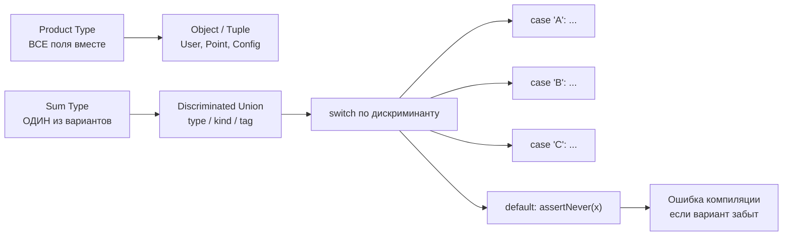

# Уровень 2: Структуры данных и абстрактные типы данных — подробная теория

## Введение: инструменты, а не изобретения

Плотник не точит каждый раз новый молоток — он выбирает правильный из набора. Программист не реализует хеш-таблицу каждый раз — он выбирает `Map` или `{}` в зависимости от задачи.

Понимание структур данных на практике означает: знать стоимость операций, понимать паттерны доступа и уметь объяснить выбор. Не реализовывать `LinkedList` с нуля — а знать, зачем он существует.

---

## Array: рабочая лошадка

Array — самая универсальная структура. Элементы лежат в памяти последовательно, поэтому:

- Индексный доступ: **O(1)**
- Поиск по значению: **O(n)**
- Вставка/удаление в конец: **O(1) амортизированно**
- Вставка/удаление в начало/середину: **O(n)** (сдвиг элементов)

```typescript
const queue: number[] = []

// Плохая очередь через Array
queue.push(1)   // O(1) — хорошо
queue.push(2)
queue.shift()   // O(n) — сдвигает все элементы! Плохо для больших очередей

// Лучше: для очереди с высокой нагрузкой — circular buffer или двусвязный список
```

### Когда Array — правильный выбор

- Порядок элементов важен
- Нужна итерация по всей коллекции
- Нужен доступ по индексу
- Размер коллекции небольшой или вставки/удаления только в конец

### Стек через Array

Стек (LIFO) реализуется через Array идеально — `push`/`pop` оба O(1):

```typescript
class Stack<T> {
  private items: T[] = []

  push(item: T): void {
    this.items.push(item)
  }

  pop(): T | undefined {
    return this.items.pop()
  }

  peek(): T | undefined {
    return this.items[this.items.length - 1]
  }

  isEmpty(): boolean {
    return this.items.length === 0
  }
}

// Применение: история отмены действий
const history = new Stack<string>()
history.push('type "Hello"')
history.push('type " World"')
history.pop() // отменить последнее действие
```

### Очередь и деки

Очередь (FIFO) через Array работает, но `shift()` медленный. Для высоконагруженных очередей используйте указатель начала:

```typescript
class Queue<T> {
  private items: T[] = []
  private head = 0

  enqueue(item: T): void {
    this.items.push(item)
  }

  dequeue(): T | undefined {
    if (this.head >= this.items.length) return undefined
    const item = this.items[this.head]
    this.head++
    // Периодическая чистка памяти
    if (this.head > 100) {
      this.items = this.items.slice(this.head)
      this.head = 0
    }
    return item
  }

  get size(): number {
    return this.items.length - this.head
  }
}
```

---

## Map: настоящий словарь

`Map` — это хеш-таблица. Ключом может быть что угодно: объект, функция, число.

```typescript
// Объект как ключ — это работает в Map, но не в обычном объекте
const nodeMap = new Map<HTMLElement, { visits: number }>()
const btn = document.querySelector('button')!
nodeMap.set(btn, { visits: 0 })
nodeMap.get(btn)!.visits++
```

### Операции и сложность

| Операция | Сложность |
|----------|-----------|
| `get(key)` | O(1) средне |
| `set(key, val)` | O(1) средне |
| `has(key)` | O(1) средне |
| `delete(key)` | O(1) средне |
| `size` | O(1) |
| Итерация | O(n) |

### Map vs Object: детальное сравнение

```typescript
// Object: ключи — только string/Symbol
const obj: Record<string, number> = {}
obj['count'] = 1
obj[42] = 2        // ключ станет строкой '42'
obj[Symbol()] = 3  // работает, но неудобно

// Map: любые ключи
const map = new Map<any, number>()
map.set('count', 1)
map.set(42, 2)       // ключ остаётся числом
map.set({}, 3)       // объект как ключ

// Опасность Object: прототип загрязняет пространство имён
const counts: Record<string, number> = {}
counts['toString'] // undefined? Нет! Это метод Object.prototype!
// Map лишён этой проблемы — прототипа нет
```

📌 Практическое правило: используйте `Object` для конфигов, DTO и статичных структур. Используйте `Map` когда:
- Ключи вычисляются динамически
- Ключи — не строки
- Нужен гарантированный порядок вставки
- Часто добавляете и удаляете ключи

### WeakMap: без утечек памяти

`WeakMap` хранит слабые ссылки на ключи. Когда ключ (всегда объект) собирается сборщиком мусора — запись автоматически удаляется:

```typescript
const privateData = new WeakMap<object, { token: string }>()

class AuthService {
  constructor(token: string) {
    privateData.set(this, { token })
  }

  getToken(): string {
    return privateData.get(this)!.token
  }
}

// Когда экземпляр AuthService уничтожается — данные в WeakMap тоже уходят
// WeakMap не мешает GC — нет утечек памяти
```

⚠️ WeakMap нельзя итерировать — это ограничение по дизайну. Используйте его исключительно для приватных данных и кэшей, привязанных к объектам.

---

## Set: уникальность как первый класс

Set — это коллекция уникальных значений. Внутри — хеш-таблица, поэтому `has` работает за O(1).

```typescript
// Дедупликация массива — классика
const ids = [1, 2, 3, 2, 1, 4]
const unique = [...new Set(ids)] // [1, 2, 3, 4]

// Проверка принадлежности — Set vs Array
const allowedRoles = new Set(['admin', 'editor', 'viewer'])
// O(1):
allowedRoles.has('admin')
// vs Array O(n):
['admin', 'editor', 'viewer'].includes('admin')
```

### Операции над множествами

```typescript
function union<T>(a: Set<T>, b: Set<T>): Set<T> {
  return new Set([...a, ...b])
}

function intersection<T>(a: Set<T>, b: Set<T>): Set<T> {
  return new Set([...a].filter(x => b.has(x)))
}

function difference<T>(a: Set<T>, b: Set<T>): Set<T> {
  return new Set([...a].filter(x => !b.has(x)))
}

const frontend = new Set(['Alice', 'Bob', 'Carol'])
const backend = new Set(['Bob', 'Dave', 'Eve'])

union(frontend, backend)        // {'Alice', 'Bob', 'Carol', 'Dave', 'Eve'}
intersection(frontend, backend) // {'Bob'} — fullstack
difference(frontend, backend)   // {'Alice', 'Carol'} — только frontend
```

### WeakSet

Аналог WeakMap для значений: слабые ссылки на объекты, нет итерации:

```typescript
const initialized = new WeakSet<object>()

function init(component: object): void {
  if (initialized.has(component)) return
  // ... инициализация
  initialized.add(component)
}
```

---

## Абстрактные типы данных (ADT): контракт без реализации

ADT — это интерфейс поведения. Вы говорите «мне нужна очередь с приоритетом» и не уточняете, реализована ли она через бинарную кучу или отсортированный массив.

```typescript
interface PriorityQueue<T> {
  insert(item: T, priority: number): void
  extractMin(): T | undefined
  peek(): T | undefined
  size: number
}
```

Это разделение — основа инверсии зависимостей. Код, который работает с `PriorityQueue<Task>`, не знает и не должен знать о реализации.

---

## Алгебраические типы данных (Algebraic Data Types)

Алгебраические типы данных пришли из функционального программирования (Haskell, ML) и прочно вошли в TypeScript. Их называют «алгебраическими» потому что они строятся через две операции: произведение (AND) и сумму (OR).

### Product Type — «И»

Все поля присутствуют одновременно. Пространство возможных значений — произведение пространств полей:

```typescript
type Color = { r: number; g: number; b: number }
// Возможных значений: 256 * 256 * 256 = 16 777 216

type Pair<A, B> = { first: A; second: B }
// Это буквально декартово произведение A × B

// Кортеж — тоже Product type
type Coordinate = [number, number, number] // x, y, z
```

Объекты в TypeScript/JavaScript — Product types по природе. Если вы создали `User`, у него всегда есть и `id`, и `name`, и `email`.

### Sum Type — «ИЛИ»

Значение является РОВНО ОДНИМ из вариантов в каждый момент. Пространство значений — сумма пространств вариантов:

```typescript
// Загрузка данных — классический Sum type для состояний UI
type LoadingState<T> =
  | { status: 'idle' }
  | { status: 'loading' }
  | { status: 'success'; data: T }
  | { status: 'error'; message: string }

// Геометрические фигуры
type Shape =
  | { kind: 'circle'; radius: number }
  | { kind: 'rectangle'; width: number; height: number }
  | { kind: 'triangle'; base: number; height: number }
```

Поле-дискриминант (`status`, `kind`) — это литеральный тип, который TypeScript использует для сужения (narrowing).

### Discriminated Union в деталях

```typescript
type NetworkEvent =
  | { type: 'connected'; endpoint: string; latency: number }
  | { type: 'disconnected'; reason: string; code: number }
  | { type: 'data'; payload: Uint8Array; size: number }
  | { type: 'error'; error: Error; retryable: boolean }

function handleEvent(event: NetworkEvent): void {
  switch (event.type) {
    case 'connected':
      // TypeScript знает: event.endpoint и event.latency доступны
      console.log(`Connected to ${event.endpoint}, latency: ${event.latency}ms`)
      break
    case 'disconnected':
      // TypeScript знает: event.reason и event.code доступны
      if (event.code === 1006) reconnect()
      break
    case 'data':
      processPayload(event.payload)
      break
    case 'error':
      if (event.retryable) scheduleRetry()
      else reportError(event.error)
      break
  }
}
```

---

## Паттерн-матчинг и exhaustive checks

### Проблема: забытый вариант

```typescript
// ❌ Без exhaustive check — тихая ошибка
type Direction = 'north' | 'south' | 'east' | 'west'

function move(dir: Direction): [number, number] {
  if (dir === 'north') return [0, 1]
  if (dir === 'south') return [0, -1]
  if (dir === 'east') return [1, 0]
  // Забыли 'west'! Вернётся undefined — тихий баг
  return [0, 0] // маскирует проблему
}
```

### Решение: never в default

```typescript
// ✅ С exhaustive check
function assertNever(value: never): never {
  throw new Error(`Unexpected value: ${JSON.stringify(value)}`)
}

function move(dir: Direction): [number, number] {
  switch (dir) {
    case 'north': return [0, 1]
    case 'south': return [0, -1]
    case 'east':  return [1, 0]
    case 'west':  return [-1, 0]
    default:      return assertNever(dir)
    // Если добавить 'up' | 'down' в Direction и забыть здесь —
    // TypeScript выдаст ошибку: Argument of type '"up"' is not assignable to 'never'
  }
}
```

### Exhaustive check через условные типы

Иногда switch неудобен — тогда используют маппинг:

```typescript
type ShapeArea = {
  [K in Shape['kind']]: (shape: Extract<Shape, { kind: K }>) => number
}

const areaCalculators: ShapeArea = {
  circle: s => Math.PI * s.radius ** 2,
  rectangle: s => s.width * s.height,
  triangle: s => (s.base * s.height) / 2,
}

function area(shape: Shape): number {
  return areaCalculators[shape.kind](shape as any)
}
// Если добавить новый вид фигуры — TypeScript потребует добавить calculculator
```

---

## Практические паттерны с Sum Types

### Result<T, E> — явные ошибки

```typescript
type Result<T, E = Error> =
  | { ok: true; value: T }
  | { ok: false; error: E }

function parseJSON<T>(raw: string): Result<T, SyntaxError> {
  try {
    return { ok: true, value: JSON.parse(raw) as T }
  } catch (e) {
    return { ok: false, error: e as SyntaxError }
  }
}

const result = parseJSON<{ name: string }>('{ "name": "Alice" }')
if (result.ok) {
  console.log(result.value.name) // TypeScript знает о value
} else {
  console.error(result.error.message) // TypeScript знает об error
}
```

### Option<T> — явное отсутствие

```typescript
type Option<T> =
  | { some: true; value: T }
  | { some: false }

const None: Option<never> = { some: false }
const Some = <T>(value: T): Option<T> => ({ some: true, value })

function findUser(id: string): Option<User> {
  const user = db.find(u => u.id === id)
  return user ? Some(user) : None
}

// Нельзя забыть проверить отсутствие — компилятор заставит
const found = findUser('42')
if (found.some) {
  greet(found.value) // TypeScript знает: value есть
}
```

### Состояния UI через Sum type

```typescript
type PageState<T> =
  | { tag: 'loading' }
  | { tag: 'empty' }
  | { tag: 'data'; items: T[]; total: number }
  | { tag: 'error'; message: string; retryable: boolean }

function renderPage(state: PageState<Product>): React.ReactNode {
  switch (state.tag) {
    case 'loading': return <Spinner />
    case 'empty':   return <EmptyState />
    case 'data':    return <ProductList items={state.items} total={state.total} />
    case 'error':   return <ErrorBanner message={state.message} retry={state.retryable} />
    default:        return assertNever(state)
  }
}
```

Такой подход исключает «невозможные» состояния. С обычными булевыми флагами `isLoading: true` + `error: "..."` + `data: [...]` возможны комбинации, которых быть не должно.

---

## Деревья и графы: когда нужны сложные структуры

Деревья и графы встречаются реже, но важно знать, когда они нужны:

```typescript
// AST (Abstract Syntax Tree) — типичное применение дерева
type ASTNode =
  | { type: 'number'; value: number }
  | { type: 'add'; left: ASTNode; right: ASTNode }
  | { type: 'multiply'; left: ASTNode; right: ASTNode }

// Это рекурсивный Sum type! Каждый узел — или лист, или операция
function evaluate(node: ASTNode): number {
  switch (node.type) {
    case 'number':   return node.value
    case 'add':      return evaluate(node.left) + evaluate(node.right)
    case 'multiply': return evaluate(node.left) * evaluate(node.right)
    default:         return assertNever(node)
  }
}

// 2 + 3 * 4
const expr: ASTNode = {
  type: 'add',
  left: { type: 'number', value: 2 },
  right: {
    type: 'multiply',
    left: { type: 'number', value: 3 },
    right: { type: 'number', value: 4 },
  },
}
evaluate(expr) // 14
```

---

## Схема: ADT, паттерн-матчинг, exhaustive check



---

## Итоговая таблица: какую структуру выбрать

| Задача | Структура | Почему |
|--------|-----------|--------|
| Упорядоченный список | Array | Порядок, индекс |
| Словарь с строковыми ключами | Object | Простота, JSON |
| Словарь с динамическими ключами | Map | Любые ключи, порядок |
| Уникальные значения | Set | O(1) has, дедупликация |
| Кэш без утечек памяти | WeakMap | GC-friendly |
| «Стек отмены» | Array как Stack | push/pop O(1) |
| Очередь сообщений | Array с head | O(1) enqueue |

---

## Частые ошибки

### Использовать Array для проверки принадлежности

```typescript
// ❌ O(n) при каждой проверке
const blockedUsers = ['alice', 'bob', 'charlie']
if (blockedUsers.includes(userId)) { ... }

// ✅ O(1) — Set создаётся один раз
const blockedSet = new Set(['alice', 'bob', 'charlie'])
if (blockedSet.has(userId)) { ... }
```

### Забыть exhaustive check

```typescript
// ❌ Добавили новый статус — функция молча вернёт undefined
type Status = 'draft' | 'published' | 'archived' | 'deleted'
function getLabel(s: Status): string {
  if (s === 'draft') return 'Черновик'
  if (s === 'published') return 'Опубликовано'
  return 'Архив' // 'deleted' тихо попадает сюда
}

// ✅ Компилятор укажет на пропущенный вариант
function getLabel(s: Status): string {
  switch (s) {
    case 'draft': return 'Черновик'
    case 'published': return 'Опубликовано'
    case 'archived': return 'Архив'
    case 'deleted': return 'Удалено'
    default: return assertNever(s)
  }
}
```

### Использовать boolean флаги вместо Sum type

```typescript
// ❌ Невозможные состояния: isLoading=true И error="..." одновременно
interface DataState {
  isLoading: boolean
  data: User[] | null
  error: string | null
}

// ✅ Только допустимые состояния
type DataState =
  | { status: 'loading' }
  | { status: 'success'; data: User[] }
  | { status: 'error'; error: string }
```
