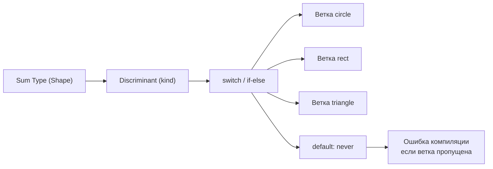

# Уровень 2: Структуры данных и абстрактные типы данных

## Зачем это знать?

Представьте, что вы переезжаете в новую квартиру. У вас есть вещи: книги, одежда, посуда. Как вы их упакуете? Книги по алфавиту в коробки (Map), уникальные предметы без дублей (Set), вещи, которые нужны в определённом порядке (Array). Структуры данных — это именно такие контейнеры. Выбор правильного контейнера определяет, насколько удобно и быстро работает ваш код.

---

## Структуры данных: использовать, а не изобретать

В реальных проектах вы редко реализуете структуры данных с нуля. Вы выбираете подходящую из стандартной библиотеки.

### Array — когда важен порядок

```typescript
const log: string[] = []
log.push('start')
log.push('process')
log.push('end')
// Порядок сохранён: ['start', 'process', 'end']
```

Array хорош для упорядоченных коллекций, итерации и индексного доступа. Поиск по значению — O(n), что дорого при больших данных.

### Map — ключ → значение, без ограничений на ключ

```typescript
const cache = new Map<string, number>()
cache.set('user:42', 1000)
cache.get('user:42') // 1000
cache.has('user:99') // false
```

💡 Map выигрывает у обычного объекта когда: ключи не строки, нужен порядок вставки, часто добавляете/удаляете записи.

### Set — уникальные значения

```typescript
const visited = new Set<string>()
visited.add('/home')
visited.add('/about')
visited.add('/home') // дубль игнорируется
visited.size // 2
visited.has('/home') // true — O(1)!
```

Set идеален для дедупликации и быстрой проверки принадлежности.

---

## Map vs Object: когда что выбирать?

| Критерий | Object | Map |
|----------|--------|-----|
| Ключи | Только string/symbol | Любой тип |
| Порядок | Не гарантирован | Порядок вставки |
| Размер | `Object.keys(o).length` — O(n) | `map.size` — O(1) |
| Прототип | Есть (риск конфликтов) | Нет |
| JSON | Легко сериализовать | Нужна конвертация |

📌 Правило: если ключи — строки и структура статична (конфиг, DTO) → Object. Если ключи динамические или не строки → Map.

---

## Абстрактные типы данных (ADT)

ADT — это контракт: что умеет структура, без деталей реализации. Stack говорит «push/pop», не уточняя, массив внутри или связный список.

```typescript
interface Stack<T> {
  push(item: T): void
  pop(): T | undefined
  peek(): T | undefined
  isEmpty(): boolean
}
```

---

## Алгебраические типы данных

### Product type — «И»

Объект, где присутствуют ВСЕ поля одновременно. Как декартово произведение множеств:

```typescript
type Point = { x: number; y: number } // x И y — всегда оба
type User = { id: string; name: string; email: string }
```

### Sum type — «ИЛИ»

Значение, которое в каждый момент является ОДНИМ из вариантов:

```typescript
type Shape =
  | { kind: 'circle'; radius: number }
  | { kind: 'rect'; width: number; height: number }
  | { kind: 'triangle'; base: number; height: number }
```

Поле `kind` — это дискриминант. TypeScript использует его для сужения типа.

---

## Паттерн-матчинг и exhaustive check

```typescript
function area(shape: Shape): number {
  switch (shape.kind) {
    case 'circle':
      return Math.PI * shape.radius ** 2
    case 'rect':
      return shape.width * shape.height
    case 'triangle':
      return (shape.base * shape.height) / 2
    default: {
      const _exhaustive: never = shape
      throw new Error(`Unknown shape: ${_exhaustive}`)
    }
  }
}
```

Трюк с `never`: если вы добавите новый вариант в `Shape` и забудете обработать его в `switch` — TypeScript выдаст ошибку компиляции. Это исчерпывающая проверка (exhaustive check).

---

## Практические паттерны: Result и Option

```typescript
type Result<T, E> =
  | { ok: true; value: T }
  | { ok: false; error: E }

type Option<T> =
  | { some: true; value: T }
  | { some: false }
```

Это сумные типы для явного моделирования ошибок и отсутствия значения — вместо `null`/`undefined` или исключений.

---

## Схема: от ADT к exhaustive check



---

## Итог

- Array — порядок и индекс; Map — произвольные ключи; Set — уникальность
- Product type: все поля одновременно (AND); Sum type: один из вариантов (OR)
- Discriminated union + `never` в default = исчерпывающая проверка на этапе компиляции
- `Result<T, E>` и `Option<T>` — Sum types для явного управления ошибками
