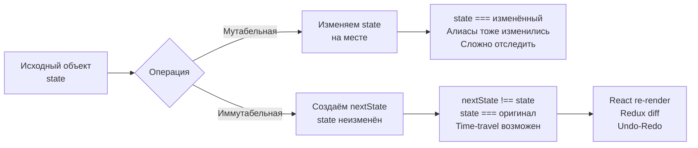

# Уровень 3: Состояние, мутабельность, идемпотентность — подробная теория

## Что такое состояние на самом деле?

Состояние — это всё, что «помнит» программа между двумя моментами времени. Когда вы открываете браузер и закрываете его, часть состояния (история, закладки) сохраняется, часть (открытые вкладки) — нет. В коде государство устроено так же: оно живёт в разных местах и с разной видимостью.

### Виды состояния в JavaScript/TypeScript

```typescript
// 1. Локальные переменные — состояние живёт в функции
function processItems(items: string[]) {
  let total = 0 // состояние видно только внутри функции
  for (const item of items) total += item.length
  return total
}

// 2. Замыкания — состояние захвачено в функции
function createCounter() {
  let count = 0 // это состояние переживёт вызов createCounter
  return {
    increment: () => ++count,
    value: () => count,
  }
}

// 3. Глобальные переменные — состояние видно везде (опасно)
let globalUser: User | null = null

// 4. Синглтоны и модульный уровень
const cache = new Map<string, unknown>() // живёт в модуле

// 5. DOM — состояние, хранящееся вне JS-рантайма
document.title = 'Loading...' // это тоже состояние!

// 6. Внешние системы — БД, localStorage, куки
localStorage.setItem('theme', 'dark')
```

---

## Скрытое состояние: молчаливый убийца предсказуемости

Состояние становится «скрытым», когда функция зависит от него, но это не видно из её сигнатуры.

```typescript
// ❌ Скрытое состояние: функция читает из внешней переменной
let discountRate = 0.1

function calculatePrice(basePrice: number): number {
  return basePrice * (1 - discountRate) // зависимость не видна!
}

calculatePrice(100) // 90
discountRate = 0.5
calculatePrice(100) // 50 — тот же вызов, другой результат

// ✅ Явное состояние: зависимость видна в сигнатуре
function calculatePrice(basePrice: number, discountRate: number): number {
  return basePrice * (1 - discountRate)
}

calculatePrice(100, 0.1) // всегда 90
calculatePrice(100, 0.5) // всегда 50 — нет сюрпризов
```

### Антипаттерны скрытого состояния

```typescript
// Антипаттерн 1: Функция с побочными эффектами под невинным именем
function getUser(id: string): User {
  const user = db.find(id)
  auditLog.push({ action: 'read', id, timestamp: Date.now() }) // ← неожиданно!
  return user
}

// Антипаттерн 2: Синглтон с глобальным состоянием
class Config {
  private static instance: Config
  private settings: Record<string, unknown> = {}

  static getInstance(): Config {
    if (!Config.instance) Config.instance = new Config()
    return Config.instance // одно состояние на весь процесс
  }
}

// Антипаттерн 3: Мутация аргументов
function sortUsers(users: User[]): User[] {
  users.sort((a, b) => a.name.localeCompare(b.name)) // мутирует оригинал!
  return users
}

// ✅ Явная копия перед сортировкой
function sortUsers(users: User[]): User[] {
  return [...users].sort((a, b) => a.name.localeCompare(b.name))
}
```

### Кэши и синглтоны: где скрытое состояние оправдано

Скрытое состояние не всегда плохо — иногда это осознанный компромисс:

```typescript
// Кэш — намеренное скрытое состояние
const memoize = <T, R>(fn: (arg: T) => R): (arg: T) => R => {
  const cache = new Map<T, R>()
  return (arg: T) => {
    if (!cache.has(arg)) cache.set(arg, fn(arg))
    return cache.get(arg)!
  }
}

// Это состояние скрыто, но:
// 1. Оно чистое (не меняет результат, только ускоряет)
// 2. Изолировано внутри замыкания
// 3. Документировано в имени функции
const expensiveCalc = memoize((n: number) => n ** 2)
```

📌 Правило: скрытое состояние допустимо, если оно изолировано, предсказуемо и не меняет семантику функции.

---

## Мутабельность в деталях

### Что значит «мутировать»?

Мутация — это изменение объекта по ссылке. Две переменные могут указывать на один объект:

```typescript
const a = { x: 1 }
const b = a     // b указывает на тот же объект
b.x = 42
console.log(a.x) // 42! Изменение через b видно через a
```

Это алиасинг — источник коварных багов, особенно в сложных системах.

### Object.freeze: иммутабельность в runtime

```typescript
const config = Object.freeze({
  host: 'localhost',
  port: 3000,
  nested: { timeout: 5000 }, // вложенный объект НЕ заморожен!
})

config.port = 8080        // в strict mode — TypeError, иначе молча игнорируется
config.nested.timeout = 1 // работает! freeze shallow

// Глубокая заморозка — нужно реализовывать вручную
function deepFreeze<T extends object>(obj: T): Readonly<T> {
  Object.getOwnPropertyNames(obj).forEach(name => {
    const value = (obj as any)[name]
    if (typeof value === 'object' && value !== null) deepFreeze(value)
  })
  return Object.freeze(obj)
}
```

### as const: иммутабельность в системе типов

```typescript
// as const делает литеральные типы readonly
const COLORS = {
  primary: '#3b82f6',
  danger: '#ef4444',
  success: '#22c55e',
} as const

// Тип: { readonly primary: '#3b82f6'; readonly danger: '#ef4444'; ... }
// Не просто string, а конкретные литералы!

type ColorKey = keyof typeof COLORS // 'primary' | 'danger' | 'success'
type ColorValue = (typeof COLORS)[ColorKey] // '#3b82f6' | '#ef4444' | '#22c55e'

// as const для массивов — tuple с readonly
const STEPS = ['parse', 'validate', 'transform', 'save'] as const
type Step = (typeof STEPS)[number] // 'parse' | 'validate' | 'transform' | 'save'
```

Разница: `Object.freeze` работает в runtime, `as const` — только в TypeScript-компиляторе.

---

## Shallow copy vs Deep copy: понять раз и навсегда

Представьте офис с двумя уровнями хранения: шкафы в коридоре (первый уровень) и папки внутри шкафов (второй уровень). Shallow copy — это скопировать список шкафов, но не содержимое папок:

```typescript
const original = {
  name: 'Alice',
  address: { city: 'Moscow', zip: '101000' },
  tags: ['admin', 'user'],
}

// Shallow copy через spread
const shallow = { ...original }
shallow.name = 'Bob'              // ✅ не влияет на original
shallow.address.city = 'Kazan'   // ❌ изменяет original.address.city!
shallow.tags.push('moderator')   // ❌ изменяет original.tags!

// Правильное обновление вложенных объектов — каждый уровень явно
const deep = {
  ...original,
  address: { ...original.address, city: 'Kazan' },
  tags: [...original.tags, 'moderator'],
}
// Теперь original не тронут
```

### structuredClone: глубокое клонирование

```typescript
// Современное решение (Node 17+, современные браузеры)
const clone = structuredClone(original)
clone.address.city = 'Kazan' // original не тронут
clone.tags.push('x')          // original не тронут

// Ограничения: не клонирует функции, классы, Symbol
```

### Immer: структурное разделение (structural sharing)

Immer — библиотека, которая позволяет писать «мутабельный» код, но производит иммутабельные обновления под капотом:

```typescript
import { produce } from 'immer'

const state = {
  users: [
    { id: 1, name: 'Alice', score: 0 },
    { id: 2, name: 'Bob', score: 0 },
  ],
  metadata: { updatedAt: null as Date | null },
}

const nextState = produce(state, draft => {
  // Пишем как будто мутируем
  draft.users[0].score = 100
  draft.metadata.updatedAt = new Date()
})

// Immer использует structural sharing:
// nextState.users[1] === state.users[1] — одна ссылка (не изменялось)
// nextState.users[0] !== state.users[0] — новый объект (изменялось)
// nextState !== state — корень тоже новый
```

Structural sharing экономит память: неизменённые части дерева не копируются.

---

## Когда мутабельность допустима?

Иммутабельность — это не религия. Есть случаи, где мутация — правильный выбор:

```typescript
// 1. Локальные переменные — мутация не видна снаружи
function buildResult(items: string[]): string {
  let result = '' // мутируем локальную переменную — это нормально
  for (const item of items) {
    result += item + ', '
  }
  return result.slice(0, -2)
}

// 2. Performance-critical код
function mapInPlace<T>(arr: T[], fn: (item: T) => T): T[] {
  for (let i = 0; i < arr.length; i++) {
    arr[i] = fn(arr[i]) // мутация если знаем что arr не шарится
  }
  return arr
}

// 3. Builder-паттерн — внутренняя мутация, внешняя иммутабельность
class QueryBuilder {
  private filters: string[] = []

  where(condition: string): this {
    this.filters.push(condition) // мутация внутри builder — ок
    return this
  }

  build(): string {
    return `SELECT * FROM table WHERE ${this.filters.join(' AND ')}`
  }
}
```

📌 Правило: мутация допустима если она ограничена минимальной областью видимости и не «утекает» в вызывающий код.

---

## Иммутабельность и React

React строится на иммутабельных обновлениях. Понимание почему — ключ к осмысленной работе с ним:

```typescript
// Почему React не перерисовывается при мутации?
const [users, setUsers] = useState<User[]>([])

// ❌ Мутация — React не видит изменений
const handleAdd = (user: User) => {
  users.push(user) // изменяем тот же массив
  setUsers(users)  // React сравнивает по ссылке: users === users → нет изменений!
}

// ✅ Иммутабельное обновление — новая ссылка
const handleAdd = (user: User) => {
  setUsers([...users, user]) // новый массив → новая ссылка → перерисовка
}

// ❌ Мутация вложенного объекта
const handleUpdateScore = (id: number, score: number) => {
  const user = users.find(u => u.id === id)!
  user.score = score     // мутация объекта в массиве
  setUsers([...users])   // новый массив, но объект внутри — старый!
  // React может не перерисовать компонент, если он зависит от user
}

// ✅ Правильное обновление
const handleUpdateScore = (id: number, score: number) => {
  setUsers(users.map(u => u.id === id ? { ...u, score } : u))
}
```

React использует `Object.is` для сравнения. Иммутабельные обновления — единственный способ сообщить об изменениях.

---

## Идемпотентность: безопасность повторных вызовов

Идемпотентность — математическое свойство: операция, применённая несколько раз, даёт тот же результат, что и однократное применение.

```
f(x) = f(f(x)) = f(f(f(x))) = ...
```

### Примеры идемпотентных и неидемпотентных операций

```typescript
// Идемпотентные операции:

// SET — установить значение
function setStatus(user: User, status: 'active' | 'inactive'): User {
  return { ...user, status } // повтор — тот же результат
}

// NORMALIZE — привести к каноническому виду
function normalize(email: string): string {
  return email.trim().toLowerCase()
}
normalize('  Alice@Gmail.COM  ') // 'alice@gmail.com'
normalize(normalize('  Alice@Gmail.COM  ')) // 'alice@gmail.com' — то же

// Неидемпотентные операции:

// INCREMENT — каждый раз другой результат
function increment(user: User): User {
  return { ...user, loginCount: user.loginCount + 1 } // +1 каждый раз
}

// APPEND — дублирует данные при повторе
function addTag(tags: string[], tag: string): string[] {
  return [...tags, tag] // ['admin', 'admin', 'admin'] при повторе
}

// Идемпотентный ADD:
function addTag(tags: string[], tag: string): string[] {
  return tags.includes(tag) ? tags : [...tags, tag]
}
```

### Идемпотентность в HTTP

HTTP-методы имеют семантику идемпотентности:

| Метод | Идемпотентен? | Почему |
|-------|---------------|--------|
| GET | Да | Только читает, не меняет |
| PUT | Да | Устанавливает ресурс в конкретное состояние |
| DELETE | Да | После первого — ресурса нет, повтор ничего не меняет |
| PATCH | Иногда | Зависит от реализации |
| POST | Нет | Каждый вызов создаёт новый ресурс |

```typescript
// PUT — идемпотентный: устанавливает пользователя с id=42
// PUT /users/42 { name: "Alice" }
// Повтор 10 раз — результат тот же

// POST — НЕ идемпотентный: создаёт нового пользователя
// POST /users { name: "Alice" }
// Повтор 10 раз — 10 новых пользователей
```

### Upsert vs Insert

```typescript
// ❌ INSERT — не идемпотентен
async function createUser(data: CreateUserDTO): Promise<User> {
  return db.query('INSERT INTO users VALUES ($1, $2)', [data.email, data.name])
  // Повтор → ошибка дублирования или второй пользователь
}

// ✅ UPSERT — идемпотентен
async function saveUser(data: SaveUserDTO): Promise<User> {
  return db.query(
    'INSERT INTO users (email, name) VALUES ($1, $2) ON CONFLICT (email) DO UPDATE SET name = $2',
    [data.email, data.name]
  )
  // Повтор → обновляет существующего или создаёт нового — безопасно
}
```

### Идемпотентность в распределённых системах

В распределённых системах сеть ненадёжна. Запрос может дойти дважды, клиент может повторить при таймауте:

```typescript
// Паттерн: idempotency key
interface PaymentRequest {
  amount: number
  currency: string
  idempotencyKey: string // уникальный ключ операции
}

async function processPayment(req: PaymentRequest): Promise<PaymentResult> {
  // Проверяем: не выполняли ли мы уже этот платёж?
  const existing = await payments.findByKey(req.idempotencyKey)
  if (existing) return existing // возвращаем предыдущий результат

  const result = await chargeCard(req.amount, req.currency)
  await payments.save({ ...result, key: req.idempotencyKey })
  return result
}

// Клиент может безопасно повторять запрос при network error
// Сервер гарантирует: платёж будет обработан ровно один раз
```

Idempotency key — это стандартный паттерн в платёжных системах (Stripe, Braintree), очередях сообщений и event-driven архитектурах.

---

## Схема: мутабельный vs иммутабельный поток данных



---

## Частые ошибки

### Spread не делает deep copy

```typescript
// ❌ Думаем что скопировали, но shared reference
const original = { settings: { theme: 'dark', lang: 'ru' } }
const copy = { ...original }
copy.settings.theme = 'light' // оригинал тоже изменился!

// ✅ Явное копирование каждого уровня
const copy = { ...original, settings: { ...original.settings, theme: 'light' } }
```

### Мутация в reduce

```typescript
// ❌ Мутируем accumulator, который является оригинальным объектом
const result = users.reduce((acc, user) => {
  acc[user.id] = user // мутация acc
  return acc
}, {} as Record<number, User>)
// Это работает, но только потому что {} создаётся один раз.
// Но если передать существующий объект — проблемы

// ✅ Явная иммутабельность
const result = users.reduce((acc, user) => ({
  ...acc,
  [user.id]: user,
}), {} as Record<number, User>)
```

### Не путать идемпотентность с чистотой

```typescript
// Чистая, но НЕ идемпотентная функция
const pure = (x: number) => x + 1
// pure(pure(1)) = 3, pure(1) = 2 — разные результаты

// Идемпотентная, но с побочными эффектами
const ensureIndexExists = async (indexName: string) => {
  const exists = await db.indexExists(indexName) // читает БД
  if (!exists) await db.createIndex(indexName)   // пишет в БД
  // f(f(x)) === f(x) — но функция нечистая (зависит от БД)
}

// Идемпотентность и чистота — разные свойства
// Можно иметь одно без другого, оба вместе или ни одного
```

### Забыть про идемпотентность в retry-логике

```typescript
// ❌ Retry без идемпотентности — дублирование данных
async function withRetry<T>(fn: () => Promise<T>, maxAttempts = 3): Promise<T> {
  for (let i = 0; i < maxAttempts; i++) {
    try { return await fn() }
    catch { if (i === maxAttempts - 1) throw }
  }
  throw new Error('unreachable')
}

// Безопасно только если fn идемпотентна
await withRetry(() => createOrder(data)) // ❌ может создать несколько заказов

// ✅ Убедитесь, что операция идемпотентна перед добавлением retry
await withRetry(() => createOrderWithKey(data, idempotencyKey)) // ✅
```
