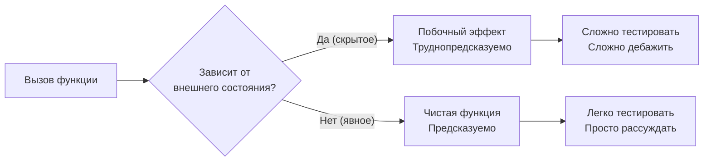

# Уровень 3: Состояние, мутабельность, идемпотентность

## Зачем это важно?

Представьте электрический щиток в квартире. Если кто-то в темноте переключает автоматы как попало — вы не знаете, в каком состоянии находится сеть. Баги в программах работают так же: скрытое состояние, которое меняется непредсказуемо, — главный источник труднонаходимых ошибок.

---

## Что такое состояние?

Состояние — это всё, что влияет на результат функции помимо её аргументов: переменные, кэши, глобальные объекты, DOM.

```typescript
// Скрытое состояние: функция зависит от внешней переменной
let count = 0
function increment() {
  count++ // изменяет внешнее состояние — побочный эффект
  return count
}
increment() // 1
increment() // 2 — тот же вызов, разный результат

// Явное состояние: всё через параметры
function increment(count: number): number {
  return count + 1 // чистая функция
}
increment(0) // 1
increment(0) // 1 — всегда предсказуемо
```

📌 Правило: чем меньше скрытого состояния, тем проще тестировать, дебажить и понимать код.

---

## Мутабельность и иммутабельность

Мутабельность — это возможность изменять объект после создания.

```typescript
// Мутабельно: объект изменяется на месте
const user = { name: 'Alice', score: 0 }
user.score = 100 // мутация — тот же объект, другое значение

// Иммутабельно: создаём новый объект
const updatedUser = { ...user, score: 100 } // новый объект
user.score // всё ещё 0 — оригинал не тронут
```

### Object.freeze vs as const

```typescript
// Object.freeze — иммутабельность в runtime
const config = Object.freeze({ host: 'localhost', port: 3000 })
config.port = 8080 // молча игнорируется (или ошибка в strict mode)

// as const — иммутабельность в типах TypeScript
const ROUTES = { home: '/', about: '/about' } as const
// Тип: { readonly home: '/'; readonly about: '/about' }
// Попытка изменить — ошибка компиляции
```

⚠️ Оба инструмента создают **shallow** иммутабельность — вложенные объекты остаются мутабельными.

---

## Spread — shallow copy, не deep copy

```typescript
const original = { user: { name: 'Alice' }, score: 0 }
const copy = { ...original }

copy.score = 100         // не влияет на original.score ✅
copy.user.name = 'Bob'   // ИЗМЕНЯЕТ original.user.name тоже! ❌
// copy.user и original.user — это ОДНА и та же ссылка
```

💡 Для глубокого клонирования: `structuredClone(obj)` (современный браузер/Node).

---

## Идемпотентность

Операция идемпотентна, если её повторное применение не меняет результат:

```
f(f(x)) === f(x)
```

```typescript
// Идемпотентно: установить флаг
user.isActive = true
user.isActive = true // то же самое — ничего не сломалось

// НЕ идемпотентно: увеличить счётчик
user.loginCount++ // каждый вызов меняет результат
user.loginCount++ // уже другое значение
```

В HTTP: `PUT` и `DELETE` — идемпотентны, `POST` — нет. В базах данных: `upsert` — идемпотентен, `insert` — нет.

---

## Схема: явное vs скрытое состояние



---

## Итог

- **Скрытое состояние** — источник неожиданных багов; делайте зависимости явными через параметры
- **Иммутабельность** — новый объект вместо мутации; предсказуемость и простота дебага
- **Shallow vs deep copy** — spread и Object.freeze не затрагивают вложенные объекты
- **Идемпотентность** — безопасность повторных вызовов; важна для HTTP, очередей, распределённых систем
