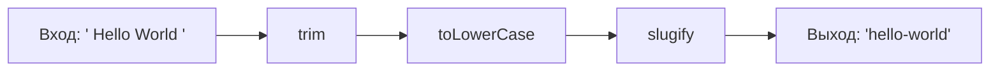

# Уровень 4: Функции, композиция и рекурсия

## Зачем это важно?

Представьте конвейер на заводе: сырьё поступает на первый станок, обрабатывается, передаётся на второй, потом на третий. Каждый станок делает одно дело и ничего не знает об остальных. Функциональная программа устроена точно так же: данные проходят через цепочку функций, каждая из которых выполняет одно преобразование. Именно так рождается код, который легко читать, тестировать и изменять.

---

## Чистые функции и побочные эффекты

Чистая функция — это функция, которая:
1. Всегда возвращает одинаковый результат для одинаковых аргументов (детерминизм)
2. Не производит наблюдаемых побочных эффектов

```typescript
// Нечистая: результат зависит от внешнего состояния
let tax = 0.2
function calculatePrice(price: number): number {
  return price * (1 + tax) // зависит от tax снаружи
}

// Чистая: всё через аргументы
function calculatePrice(price: number, tax: number): number {
  return price * (1 + tax)
}
```

Побочные эффекты — это всё, что функция делает помимо вычисления результата: запись в лог, HTTP-запросы, мутация аргументов, работа с DOM.

💡 Цель не в том, чтобы полностью избавиться от побочных эффектов (программа без них бесполезна), а в том, чтобы чётко отделить чистые вычисления от эффектов.

---

## Ссылочная прозрачность

Выражение ссылочно прозрачно, если его можно заменить его результатом без изменения поведения программы.

```typescript
// Ссылочно прозрачно: add(2, 3) всегда === 5
const add = (a: number, b: number) => a + b
const result = add(2, 3) + add(2, 3)
// Можно заменить на: const result = 5 + 5

// НЕ ссылочно прозрачно: Date.now() каждый раз другое
const ts1 = Date.now()
const ts2 = Date.now()
// ts1 !== ts2 — нельзя заменить одним значением
```

Ссылочная прозрачность — это то, что делает возможным кэширование результатов (мемоизацию) и equational reasoning: рассуждения о программе как об алгебре.

---

## Функциональная композиция: pipe и compose

Два подхода к составлению функций из других функций:

```typescript
// compose: применяет справа налево — f(g(x))
const compose = <T>(...fns: Array<(x: T) => T>) =>
  (x: T) => fns.reduceRight((acc, fn) => fn(acc), x)

// pipe: применяет слева направо — x → g → f (читается как поток)
const pipe = <T>(...fns: Array<(x: T) => T>) =>
  (x: T) => fns.reduce((acc, fn) => fn(acc), x)

const process = pipe(
  trim,        // 1. убрать пробелы
  toLowerCase, // 2. в нижний регистр
  slugify,     // 3. заменить пробелы на дефисы
)

process('  Hello World  ') // 'hello-world'
```



📌 `pipe` читается как поток данных слева направо — это интуитивнее для большинства разработчиков. `compose` — математическая нотация, где f(g(x)) записывается как compose(f, g).

---

## Каррирование и частичное применение

Каррирование — преобразование функции от нескольких аргументов в цепочку функций, каждая из которых принимает один аргумент:

```typescript
// Обычная функция
const add = (a: number, b: number) => a + b

// Каррированная версия
const curriedAdd = (a: number) => (b: number) => a + b

// Частичное применение — фиксируем первый аргумент
const add10 = curriedAdd(10)
add10(5)  // 15
add10(20) // 30

// Использование в pipe
const prices = [10, 25, 50]
prices.map(curriedAdd(5)) // [15, 30, 55]
```

---

## Ленивые вычисления

Ленивость — вычислять значение только тогда, когда оно действительно нужно.

```typescript
// Thunk: функция-обёртка для отложенного вычисления
type Thunk<T> = () => T
const expensiveValue: Thunk<number> = () => heavyComputation()
// Вычисление не произошло!
const value = expensiveValue() // вот теперь произошло

// Генератор: ленивая последовательность
function* naturals(): Generator<number> {
  let n = 0
  while (true) yield n++
}

const gen = naturals()
gen.next().value // 0
gen.next().value // 1
// Бесконечная последовательность, не требующая памяти заранее
```

---

## Рекурсия vs циклы

Рекурсия — функция, вызывающая саму себя. Она естественна там, где данные рекурсивны по природе: деревья, вложенные структуры.

```typescript
// Цикл: обход плоского списка
function sum(nums: number[]): number {
  let total = 0
  for (const n of nums) total += n
  return total
}

// Рекурсия: обход дерева — цикл был бы громоздким
type Tree = { value: number; children: Tree[] }

function sumTree(tree: Tree): number {
  return tree.value + tree.children.reduce(
    (acc, child) => acc + sumTree(child), 0
  )
}
```

⚠️ В JavaScript нет гарантии оптимизации хвостовой рекурсии (TCO). При глубокой рекурсии — используйте цикл или трамплинирование.

---

## Итог

- **Чистые функции** — детерминированные, без побочных эффектов; легко тестируются и мемоизируются
- **Ссылочная прозрачность** — выражение заменимо результатом; основа кэширования и equational reasoning
- **pipe/compose** — составляют сложные преобразования из простых функций
- **Каррирование** — разбивает функцию на цепочку, позволяет частичное применение
- **Ленивость** — откладывает вычисление до момента необходимости; генераторы, thunk
- **Рекурсия** — естественна для рекурсивных структур; осторожно с глубиной стека в JS
