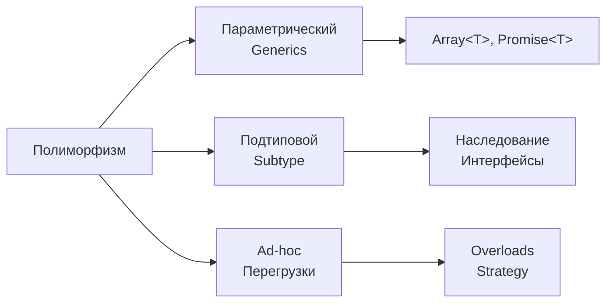

# Уровень 5: Полиморфизм и диспетчеризация — подробная теория

## Полиморфизм: «много форм»

Слово «полиморфизм» происходит от греческих poly (много) и morphe (форма). В программировании это способность одного и того же кода работать с объектами разных типов — каждый по-своему, но через единый интерфейс.

Аналогия из жизни: кнопка «Поделиться» в мобильном приложении. Нажимаете — появляется список: Telegram, WhatsApp, Email, Скопировать ссылку. Кнопка не знает и не должна знать, куда вы решите поделиться. Каждая «цель» реализует интерфейс «прими контент и сделай что-то с ним» по-своему.

Полиморфизм бывает трёх принципиально разных видов:



---

## Параметрический полиморфизм: дженерики

Параметрический полиморфизм — одна реализация, работающая с любым типом. Тип становится параметром. Это самый «честный» вид полиморфизма: поведение не меняется в зависимости от типа, меняется только тип данных.

```typescript
// Без дженерика — придётся писать для каждого типа
function firstNumber(arr: number[]): number | undefined {
  return arr[0]
}
function firstString(arr: string[]): string | undefined {
  return arr[0]
}

// С дженериком — одна реализация для всех
function first<T>(arr: T[]): T | undefined {
  return arr[0]
}

first([1, 2, 3])         // number | undefined
first(['a', 'b'])        // string | undefined
first([{ id: 1 }])      // { id: number } | undefined
```

### Стандартные дженерики в TypeScript

`Array<T>`, `Promise<T>`, `Map<K, V>`, `Set<T>`, `Record<K, V>` — всё это параметрический полиморфизм в стандартной библиотеке.

```typescript
// Map<K, V>: ключ и значение — независимые параметры типа
const userScores = new Map<string, number>()
userScores.set('Alice', 42)

// Promise<T>: тип результата — параметр
async function fetchUser(id: string): Promise<User> {
  const data = await fetch(`/api/users/${id}`)
  return data.json()
}
```

### Ограничения (Bounded Parametric Polymorphism)

Иногда нам нужна не полная универсальность, а гарантия наличия определённых свойств:

```typescript
// T должен иметь поле id
function findById<T extends { id: string }>(items: T[], id: string): T | undefined {
  return items.find(item => item.id === id)
}

findById([{ id: '1', name: 'Alice' }], '1') // работает
// findById([1, 2, 3], '1')                 // ошибка компиляции: number не имеет id

// Несколько ограничений
function mergeAndSort<T extends { id: string; createdAt: Date }>(
  a: T[],
  b: T[],
): T[] {
  return [...a, ...b].sort(
    (x, y) => x.createdAt.getTime() - y.createdAt.getTime(),
  )
}
```

### Дженерики с функциями высшего порядка

```typescript
// map, filter, reduce — классические параметрические функции
function map<T, R>(arr: T[], fn: (x: T, i: number) => R): R[] {
  return arr.map(fn)
}

function pipe<T>(...fns: Array<(x: T) => T>): (x: T) => T {
  return (x: T) => fns.reduce((acc, fn) => fn(acc), x)
}

// Дженерики с несколькими типами
function zip<A, B>(a: A[], b: B[]): Array<[A, B]> {
  return a.map((item, i) => [item, b[i]])
}

zip([1, 2, 3], ['a', 'b', 'c']) // [[1, 'a'], [2, 'b'], [3, 'c']]
```

---

## Подтиповой полиморфизм (Subtype Polymorphism)

Подтиповой полиморфизм — это «классический» ООП-полиморфизм. Код, написанный для базового типа (суперкласса или интерфейса), работает с объектами производных типов.

### Принцип подстановки Лисков (LSP)

LSP — один из принципов SOLID, предложенный Барбарой Лисков. Формулировка: если S является подтипом T, то объекты типа T в программе можно заменить объектами типа S без изменения корректности программы.

Простыми словами: подкласс должен быть полноправной заменой базовому классу, не нарушая его контракт.

```typescript
// LSP соблюдён: Bird → FlyingBird → Duck
abstract class Bird {
  abstract makeSound(): string
}

abstract class FlyingBird extends Bird {
  abstract fly(): string
}

class Duck extends FlyingBird {
  makeSound(): string { return 'Quack' }
  fly(): string { return 'Duck is flying' }
}

// ❌ LSP нарушен: классический пример с Rectangle и Square
class Rectangle {
  constructor(
    protected width: number,
    protected height: number,
  ) {}

  setWidth(w: number): void { this.width = w }
  setHeight(h: number): void { this.height = h }
  area(): number { return this.width * this.height }
}

class Square extends Rectangle {
  // Квадрат вынужден поддерживать ширину === высоту
  setWidth(w: number): void { this.width = this.height = w }  // ломает контракт!
  setHeight(h: number): void { this.width = this.height = h } // ломает контракт!
}

// Функция написана для Rectangle:
function testRectangle(r: Rectangle): void {
  const originalHeight = r['height']
  r.setWidth(10)
  // Ожидание: высота не изменилась
  console.log(r.area() === 10 * originalHeight) // Rectangle: true, Square: false!
}
```

Квадрат нарушает LSP, потому что изменяет семантику `setWidth`. Пользователь Rectangle ожидает, что `setWidth` не трогает высоту — Square это нарушает.

### Structural Subtyping в TypeScript

TypeScript использует структурную типизацию (duck typing): не важно, как называется тип, важно, что в нём есть нужные поля и методы.

```typescript
interface Printable {
  toString(): string
}

// Явная реализация интерфейса не обязательна!
class Temperature {
  constructor(private celsius: number) {}
  toString(): string {
    return `${this.celsius}°C (${this.celsius * 9/5 + 32}°F)`
  }
}

function printAll(items: Printable[]): void {
  items.forEach(item => console.log(item.toString()))
}

// Temperature подходит под Printable без явного implements
printAll([new Temperature(100), new Temperature(-40)])

// Даже обычный объект:
printAll([{ toString: () => 'Hello!' }]) // работает!
```

Это мощно, но требует осторожности: случайное структурное соответствие может замаскировать ошибку.

### Когда subtyping ломается: вариантность

Распространённая ловушка — ковариантность массивов:

```typescript
class Animal {
  breathe(): void {}
}

class Dog extends Animal {
  bark(): void {}
}

// TypeScript допускает это (хотя это потенциально опасно):
const dogs: Dog[] = [new Dog()]
const animals: Animal[] = dogs // Dog[] присвоен Animal[]

// Теперь через animals можно добавить кошку в массив собак:
class Cat extends Animal {
  meow(): void {}
}

animals.push(new Cat()) // тип говорит Animal[] — всё ок
// Но dogs[1] теперь Cat, а не Dog!
// dogs[1].bark() — runtime error!
```

Это классический пример нарушения типовой безопасности через мутабельные контейнеры и ковариантность. Решение — иммутабельные коллекции (`readonly Dog[]`) или инвариантность через ограничения.

---

## Ad-hoc полиморфизм

Ad-hoc полиморфизм — разное поведение для разных типов при одном имени. В отличие от параметрического (поведение одно, тип разный), здесь поведение меняется.

### Перегрузка функций (Function Overloading)

В TypeScript перегрузки — это способ описать несколько сигнатур одной функции:

```typescript
// Перегрузки описывают внешний контракт
function format(value: number): string
function format(value: Date): string
function format(value: boolean): string
// Реализация — внутренняя, принимает union
function format(value: number | Date | boolean): string {
  if (typeof value === 'number') return value.toFixed(2)
  if (typeof value === 'boolean') return value ? 'yes' : 'no'
  return value.toISOString().slice(0, 10)
}

format(3.14159) // '3.14'
format(new Date()) // '2024-01-15'
format(true) // 'yes'
```

⚠️ TypeScript-перегрузки — это статическая диспетчеризация: компилятор выбирает сигнатуру на основе типов аргументов. В runtime это одна функция с переключением по `typeof`/`instanceof`.

### Паттерн Strategy: ad-hoc через объекты

Часто ad-hoc полиморфизм удобнее выражать через объект-стратегию:

```typescript
interface Serializer<T> {
  serialize(value: T): string
  deserialize(raw: string): T
}

const jsonSerializer: Serializer<unknown> = {
  serialize: (v) => JSON.stringify(v),
  deserialize: (s) => JSON.parse(s),
}

const csvSerializer: Serializer<string[][]> = {
  serialize: (rows) => rows.map(r => r.join(',')).join('\n'),
  deserialize: (s) => s.split('\n').map(r => r.split(',')),
}

function saveToStorage<T>(key: string, value: T, serializer: Serializer<T>): void {
  localStorage.setItem(key, serializer.serialize(value))
}

saveToStorage('user', { name: 'Alice' }, jsonSerializer)
saveToStorage('table', [['a', 'b'], ['c', 'd']], csvSerializer)
```

### Утиная типизация: Row Polymorphism

TypeScript's structural typing позволяет писать функции, работающие с любым объектом, у которого есть нужные поля — без явного наследования:

```typescript
// Работает с любым объектом с полями name и age
function greet<T extends { name: string; age: number }>(entity: T): string {
  return `Hello, ${entity.name}! You are ${entity.age} years old.`
}

greet({ name: 'Alice', age: 30, role: 'admin' }) // лишние поля — не проблема
greet({ name: 'Bot', age: 0, version: '1.0' })   // тоже работает
```

Это называется row polymorphism: тип параметрически полиморфен по «строкам» (полям) объекта.

---

## Диспетчеризация: кто решает, какой код вызвать?

Диспетчеризация — это механизм выбора конкретной реализации в момент вызова. Два основных вида:

### Статическая диспетчеризация (Compile-time)

Решение принимается компилятором на основе статических типов:

```typescript
// Дженерик — статическая диспетчеризация: компилятор «инстанцирует» T
function identity<T>(x: T): T { return x }
const n = identity(42)    // компилятор знает: T = number
const s = identity('hi')  // компилятор знает: T = string

// Перегрузки — статическая диспетчеризация:
function add(a: number, b: number): number
function add(a: string, b: string): string
function add(a: any, b: any): any { return a + b }
add(1, 2)     // компилятор выбирает первую перегрузку
add('a', 'b') // компилятор выбирает вторую перегрузку
```

### Динамическая диспетчеризация (Runtime)

Решение принимается во время выполнения на основе реального типа объекта:

```typescript
abstract class Logger {
  abstract log(message: string): void
}

class ConsoleLogger extends Logger {
  log(message: string): void {
    console.log(`[console] ${message}`)
  }
}

class FileLogger extends Logger {
  log(message: string): void {
    fs.appendFileSync('app.log', message + '\n')
  }
}

// В runtime JS смотрит на прототипную цепочку объекта
function logAll(logger: Logger, messages: string[]): void {
  messages.forEach(m => logger.log(m)) // dynamically dispatched
}

// Какой log() будет вызван — зависит от реального объекта
logAll(new ConsoleLogger(), ['Hello'])  // ConsoleLogger.log
logAll(new FileLogger(), ['World'])     // FileLogger.log
```

### Vtable: как работает динамическая диспетчеризация

Динамическая диспетчеризация реализуется через vtable (виртуальная таблица методов). При вызове `obj.method()` движок:
1. Берёт объект `obj`
2. Идёт по прототипной цепочке: `obj.__proto__` → `ClassName.prototype`
3. Находит метод и вызывает его

В TypeScript/JavaScript это происходит через прототипы:

```typescript
class A {
  greet() { return 'Hello from A' }
}

class B extends A {
  greet() { return 'Hello from B' }
}

const obj: A = new B()
obj.greet() // 'Hello from B' — динамическая диспетчеризация через прототип
// obj.__proto__ === B.prototype → B.prototype.greet найден
```

### Single Dispatch vs Multiple Dispatch

**Single dispatch** — выбор метода зависит только от типа одного объекта (обычно `this`). Это то, как работают классы в JS:

```typescript
shape.area() // dispatch по типу shape
```

**Multiple dispatch** — выбор зависит от типов нескольких аргументов одновременно. JavaScript не поддерживает это нативно:

```typescript
// Псевдокод multiple dispatch — не работает в JS:
function interact(a: Circle, b: Rectangle): string { ... }
function interact(a: Rectangle, b: Circle): string { ... }
// JS выберет по типу первого аргумента, не обоих
```

---

## Паттерн Visitor: эмуляция Double Dispatch

Visitor — паттерн для эмуляции double dispatch в языках с single dispatch. Позволяет добавлять новые операции над иерархией классов без их изменения.

```typescript
// Иерархия объектов
interface Node {
  accept<T>(visitor: NodeVisitor<T>): T
}

class NumberNode implements Node {
  constructor(public value: number) {}
  accept<T>(visitor: NodeVisitor<T>): T {
    return visitor.visitNumber(this)
  }
}

class AddNode implements Node {
  constructor(public left: Node, public right: Node) {}
  accept<T>(visitor: NodeVisitor<T>): T {
    return visitor.visitAdd(this)
  }
}

// Интерфейс для всех посетителей
interface NodeVisitor<T> {
  visitNumber(node: NumberNode): T
  visitAdd(node: AddNode): T
}

// Конкретный посетитель 1: вычисление
class EvalVisitor implements NodeVisitor<number> {
  visitNumber(node: NumberNode): number {
    return node.value
  }
  visitAdd(node: AddNode): number {
    return node.left.accept(this) + node.right.accept(this)
  }
}

// Конкретный посетитель 2: генерация строки
class PrintVisitor implements NodeVisitor<string> {
  visitNumber(node: NumberNode): string {
    return String(node.value)
  }
  visitAdd(node: AddNode): string {
    return `(${node.left.accept(this)} + ${node.right.accept(this)})`
  }
}

// Использование
const ast: Node = new AddNode(
  new NumberNode(1),
  new AddNode(new NumberNode(2), new NumberNode(3)),
)

const eval_ = new EvalVisitor()
const print = new PrintVisitor()

ast.accept(eval_)  // 6
ast.accept(print)  // '(1 + (2 + 3))'
```

Ключевой момент: `node.accept(visitor)` — это первый dispatch (по типу node). Внутри accept вызывается `visitor.visitNumber(this)` — это второй dispatch (по типу visitor). Вместе — double dispatch.

### TypeScript: discriminated unions как dispatch

В TypeScript discriminated unions — идиоматическая альтернатива паттерну Visitor. Компилятор сам обеспечивает exhaustiveness checking:

```typescript
type Shape =
  | { kind: 'circle'; radius: number }
  | { kind: 'rectangle'; width: number; height: number }
  | { kind: 'triangle'; base: number; height: number }

function area(shape: Shape): number {
  switch (shape.kind) {
    case 'circle':
      return Math.PI * shape.radius ** 2
    case 'rectangle':
      return shape.width * shape.height
    case 'triangle':
      return (shape.base * shape.height) / 2
    // TypeScript выдаст ошибку, если забыть один из вариантов!
  }
}

// Можно добавить проверку на exhaustiveness:
function assertNever(x: never): never {
  throw new Error(`Unexpected value: ${x}`)
}

function area(shape: Shape): number {
  switch (shape.kind) {
    case 'circle': return Math.PI * shape.radius ** 2
    case 'rectangle': return shape.width * shape.height
    case 'triangle': return (shape.base * shape.height) / 2
    default: return assertNever(shape) // ошибка компиляции при пропуске варианта
  }
}
```

### typeof и instanceof как диспетчеры

```typescript
// typeof — для примитивов
function stringify(value: unknown): string {
  switch (typeof value) {
    case 'string': return value
    case 'number': return value.toFixed(2)
    case 'boolean': return value ? 'yes' : 'no'
    case 'object':
      if (value === null) return 'null'
      return JSON.stringify(value)
    default: return String(value)
  }
}

// instanceof — для классов
function handleError(error: unknown): string {
  if (error instanceof TypeError) return `Type error: ${error.message}`
  if (error instanceof RangeError) return `Range error: ${error.message}`
  if (error instanceof Error) return `Error: ${error.message}`
  return 'Unknown error'
}
```

---

## Частые ошибки

### Нарушение LSP через ужесточение контракта

```typescript
// ❌ Подкласс добавляет ограничение, которого нет в базовом классе
class BankAccount {
  withdraw(amount: number): void {
    this.balance -= amount
  }
}

class PremiumAccount extends BankAccount {
  withdraw(amount: number): void {
    if (amount > 10000) throw new Error('Limit exceeded') // добавляет ограничение!
    super.withdraw(amount)
  }
}

// Код для BankAccount не ожидает исключений при withdraw:
function processWithdrawal(account: BankAccount, amount: number): void {
  account.withdraw(amount) // может взорваться с PremiumAccount
}

// ✅ Контракт должен быть ослаблен или одинаков — не ужесточен
```

### Использование instanceof для разветвления

```typescript
// ❌ Антипаттерн: проверки instanceof разрастаются при добавлении типов
function processShape(shape: Shape) {
  if (shape instanceof Circle) {
    return Math.PI * (shape as Circle).radius ** 2
  } else if (shape instanceof Rectangle) {
    return (shape as Rectangle).width * (shape as Rectangle).height
  }
  // Добавишь Triangle — не забудь добавить сюда! Компилятор не напомнит.
}

// ✅ Виртуальный метод или discriminated union с exhaustiveness check
function processShape(shape: Shape) {
  return shape.area() // добавление нового типа потребует реализовать area()
}
```

### Слишком широкий generic constraint

```typescript
// ❌ Constraint слишком широкий — any по сути
function process<T extends object>(items: T[]): T[] {
  return items // что мы можем сделать с object? почти ничего полезного
}

// ✅ Constraint описывает реальные требования
function process<T extends { id: string; updatedAt: Date }>(items: T[]): T[] {
  return items.sort((a, b) => b.updatedAt.getTime() - a.updatedAt.getTime())
}
```

---

## Лучшие практики

**Предпочитайте discriminated unions классовой иерархии в TypeScript**, если задача — хранить данные и переключаться между вариантами. Union проще, компилятор проверяет полноту switch.

**Используйте классы и наследование**, когда важно инкапсулировать поведение и состояние вместе, особенно если объекты будут передаваться в функции, работающие с базовым типом.

**Применяйте Visitor**, когда иерархия классов стабильна, а набор операций часто расширяется — добавить новый Visitor проще, чем добавить метод в каждый класс иерархии.

**Проверяйте LSP на семантику, не синтаксис.** TypeScript не поймает нарушение LSP автоматически. Задайтесь вопросом: «Пользователь базового класса будет удивлён поведением производного?» Если да — что-то не так.

**Не злоупотребляйте дженериками.** Если функция работает только с конкретным типом — не оборачивайте в generic ради «гибкости». Generic оправдан тогда, когда реализация действительно не зависит от конкретного типа.
