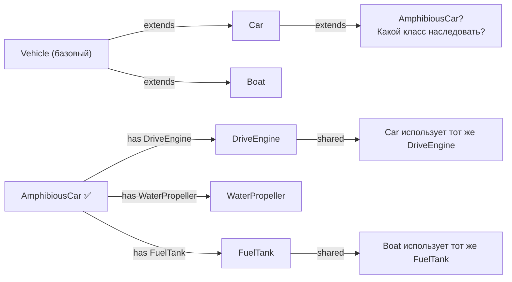

# Уровень 6: Композиция, агрегация, делегирование — подробная теория

## Почему наследование — не серебряная пуля

Наследование продаётся красиво. «Создай базовый класс, добавляй потомков — готово». На первый взгляд это экономия кода и логичная иерархия. На практике крупные наследственные иерархии превращаются в то, что разработчики называют «хрупкой конструкцией».

Представьте суперклей. С ним можно быстро что-то собрать, но разобрать — уже нет. Наследование — это суперклей в мире кода. Композиция — это LEGO: детали соединяются, разъединяются, переставляются.

### Проблема 1: Ромбовидное наследование (Diamond Problem)

```
      Animal
     /      \
  Flying  Swimming
     \      /
      Platypus  ← наследует от обоих, какой move() использовать?
```

В языках без множественного наследования (Java, C#, TypeScript) это решается через интерфейсы, но тогда приходится дублировать реализацию. В C++ с множественным наследованием — нужны виртуальные базовые классы, что добавляет сложность.

```typescript
// TypeScript: интерфейсы помогают, но реализацию всё равно нужно дублировать
interface Flyable { fly(): void }
interface Swimmable { swim(): void }

// ❌ Platypus вынужден дублировать реализацию обоих
class Platypus implements Flyable, Swimmable {
  fly() { /* приходится писать самому */ }
  swim() { /* приходится писать самому */ }
}
```

Если эти методы сложные — возникает дублирование. Любое изменение алгоритма нужно менять в нескольких местах.

### Проблема 2: Fragile Base Class

Изменение базового класса может сломать потомков даже без изменения API. Это называется «хрупкий базовый класс» (fragile base class problem).

```typescript
class Collection<T> {
  private items: T[] = []

  add(item: T) {
    this.items.push(item)
  }

  addAll(items: T[]) {
    items.forEach(item => this.add(item)) // вызывает this.add
  }
}

class CountingCollection<T> extends Collection<T> {
  private count = 0

  add(item: T) {
    this.count++
    super.add(item)
  }
}

const cc = new CountingCollection<number>()
cc.addAll([1, 2, 3])
console.log(cc['count']) // ожидаем 3, но...
// Если addAll вызывает this.add — count === 3 ✅
// Если разработчик оптимизирует addAll в базовом классе:
// addAll(items) { this.items.push(...items) } — count === 0 ❌
```

📌 Потомок зависит от внутренних деталей реализации базового класса, которые не задокументированы как контракт. Это типичная ловушка наследования.

### Проблема 3: Tight Coupling

Потомок знает слишком много о родителе. Изменить одного без изменения другого практически невозможно.

```typescript
// ❌ Жёсткая связь: AuthService знает детали реализации UserService
class UserService {
  protected users: User[] = [] // protected — значит потомкам доступно

  findById(id: string): User | undefined {
    return this.users.find(u => u.id === id)
  }
}

class AuthService extends UserService {
  // Потомок напрямую обращается к users — приватной детали
  getActiveUsers(): User[] {
    return this.users.filter(u => u.isActive) // жёсткая связь с реализацией
  }
}

// Если UserService изменит users на Map<string, User> — AuthService сломается
```

```typescript
// ✅ Слабая связь через интерфейс
interface UserRepository {
  findById(id: string): User | undefined
  findAll(): User[]
}

class AuthService {
  constructor(private users: UserRepository) {} // зависит от контракта, не реализации

  getActiveUsers(): User[] {
    return this.users.findAll().filter(u => u.isActive)
  }
}
```

---

## Композиция: строим из частей

### Отношение «имеет» (has-a)

В отличие от «является» (is-a) в наследовании, композиция говорит: «этот объект владеет теми возможностями». Разница принципиальная.

```typescript
// is-a: Car ЯВЛЯЕТСЯ Vehicle — семантически правильно
class Car extends Vehicle { }

// Но:
// is-a: Manager ЯВЛЯЕТСЯ Employee — вроде правильно
class Manager extends Employee { }
// is-a: AdminManager ЯВЛЯЕТСЯ Manager ЯВЛЯЕТСЯ Employee
class AdminManager extends Manager { }
// is-a: ExternalContractorManager ???
class ExternalContractorManager extends ??? { }
// Иерархия рассыпается: ExternalContractor не является Employee полностью
```

```typescript
// has-a: Manager ИМЕЕТ Employee-полномочия + ManagementRole + возможно ContractorRole
class Manager {
  constructor(
    private employeeProfile: EmployeeProfile,
    private managementRole: ManagementRole,
    private accessRights: AccessRights,
  ) {}

  approve(request: Request) { this.managementRole.approve(request) }
  getProfile() { return this.employeeProfile }
}

// ExternalContractorManager — другие части, та же структура
class ExternalContractorManager {
  constructor(
    private contractorProfile: ContractorProfile, // другой профиль
    private managementRole: ManagementRole,        // та же роль
    private limitedAccess: LimitedAccessRights,    // другие права
  ) {}
}
```

### Время жизни как критерий: композиция vs агрегация

Это самый важный вопрос при проектировании: могут ли части жить без целого?

**Композиция**: Нет. Части создаются вместе с целым и уничтожаются вместе с ним.

```typescript
class BlogPost {
  // Параграфы не существуют без поста — это части поста
  private paragraphs: Paragraph[] = []
  private metadata: PostMetadata

  constructor(title: string, authorId: string) {
    // metadata создаётся внутри — принадлежит PostPost
    this.metadata = new PostMetadata(title, authorId)
  }

  addParagraph(text: string) {
    // Paragraph создаётся внутри и принадлежит посту
    this.paragraphs.push(new Paragraph(text))
  }
  // Когда BlogPost удаляется — paragraphs и metadata тоже исчезают
}
```

**Агрегация**: Да. Части существуют независимо и могут входить в несколько «целых».

```typescript
class Course {
  private students: Student[] = []
  private instructors: Instructor[] = []

  enroll(student: Student) {
    // Student приходит снаружи и существует независимо
    this.students.push(student)
  }

  assignInstructor(instructor: Instructor) {
    this.instructors.push(instructor)
  }
  // Когда Course удаляется — Student и Instructor продолжают существовать
  // Instructor может вести несколько курсов одновременно
}
```

### React: компоненты как композиция

React — это не просто библиотека для UI, это манифест композиции в действии. Каждый компонент — это часть, которая может быть скомпонована с другими.

```typescript
// Мелкие компоненты — части
function Avatar({ src, alt }: { src: string; alt: string }) {
  return 
}

function UserName({ name, role }: { name: string; role: string }) {
  return (
    <div>
      <strong>{name}</strong>
      <span>{role}</span>
    </div>
  )
}

function Badge({ count }: { count: number }) {
  return count > 0 ? <span className="badge">{count}</span> : null
}

// Компонент-композиция: собирается из частей
function UserCard({ user, notifications }: { user: User; notifications: number }) {
  return (
    <div className="user-card">
      <Avatar src={user.avatar} alt={user.name} />
      <UserName name={user.name} role={user.role} />
      <Badge count={notifications} />
    </div>
  )
}
```

### Пример: Logger + HttpClient + Cache → Service

Реальный сценарий: сервис данных, собранный из частей через инъекцию зависимостей.

```typescript
// Каждая часть — отдельный объект с одной ответственностью
class Logger {
  info(message: string) { console.log(`[INFO] ${message}`) }
  error(message: string, err?: Error) { console.error(`[ERROR] ${message}`, err) }
}

class Cache {
  private store = new Map<string, { value: unknown; expiresAt: number }>()

  get<T>(key: string): T | null {
    const entry = this.store.get(key)
    if (!entry || Date.now() > entry.expiresAt) return null
    return entry.value as T
  }

  set(key: string, value: unknown, ttlMs: number) {
    this.store.set(key, { value, expiresAt: Date.now() + ttlMs })
  }
}

class HttpClient {
  async get<T>(url: string): Promise<T> {
    const response = await fetch(url)
    if (!response.ok) throw new Error(`HTTP ${response.status}`)
    return response.json() as T
  }
}

// UserService — композиция трёх частей
class UserService {
  constructor(
    private logger: Logger,
    private cache: Cache,
    private http: HttpClient,
  ) {}

  async getUser(id: string): Promise<User> {
    const cacheKey = `user:${id}`

    const cached = this.cache.get<User>(cacheKey)
    if (cached) {
      this.logger.info(`Cache hit for user ${id}`)
      return cached
    }

    try {
      this.logger.info(`Fetching user ${id} from API`)
      const user = await this.http.get<User>(`/api/users/${id}`)
      this.cache.set(cacheKey, user, 60_000)
      return user
    } catch (err) {
      this.logger.error(`Failed to fetch user ${id}`, err as Error)
      throw err
    }
  }
}

// Сборка: зависимости передаются снаружи
const logger = new Logger()
const cache = new Cache()
const http = new HttpClient()
const userService = new UserService(logger, cache, http)
```

✅ Каждую часть можно заменить (например, Redis-кэш вместо Map) без изменения UserService. Это и есть сила композиции.

---

## Делегирование: передай работу эксперту

Делегирование — это когда объект говорит другому объекту: «ты разбираешься в этом лучше, займись». Объект не наследует чужие возможности — он их арендует.

```typescript
// Паттерн: wrapper с делегированием
class PremiumUserService {
  // Делегируем стандартные операции базовому сервису
  private baseService: UserService

  constructor(baseService: UserService, private premiumCache: PremiumCache) {
    this.baseService = baseService
  }

  // Перекрытый метод: добавляем логику, делегируем основную работу
  async getUser(id: string): Promise<User> {
    const premiumData = this.premiumCache.getPremiumData(id)
    const user = await this.baseService.getUser(id) // делегирование
    return { ...user, ...premiumData }
  }

  // Чистое делегирование: просто передаём вызов
  async deleteUser(id: string): Promise<void> {
    return this.baseService.deleteUser(id) // просто делегируем
  }
}
```

### Паттерны на основе делегирования

**Proxy**: контролирует доступ к объекту.

```typescript
class SecureUserService {
  constructor(
    private userService: UserService,
    private authChecker: AuthChecker,
  ) {}

  async getUser(id: string, requesterId: string): Promise<User> {
    // Proxy проверяет права перед делегированием
    if (!this.authChecker.canRead(requesterId, 'user')) {
      throw new Error('Access denied')
    }
    return this.userService.getUser(id) // делегирование
  }
}
```

**Adapter**: переводит один интерфейс в другой.

```typescript
// Старый API: callback-style
interface LegacyUserApi {
  fetchUser(id: string, callback: (err: Error | null, user: User) => void): void
}

// Новый API: Promise-style
interface ModernUserApi {
  getUser(id: string): Promise<User>
}

// Adapter делегирует в legacy и оборачивает в Promise
class UserApiAdapter implements ModernUserApi {
  constructor(private legacy: LegacyUserApi) {}

  getUser(id: string): Promise<User> {
    return new Promise((resolve, reject) => {
      // Делегируем в legacy API
      this.legacy.fetchUser(id, (err, user) => {
        if (err) reject(err)
        else resolve(user)
      })
    })
  }
}
```

**Decorator**: добавляет поведение к объекту, не меняя его интерфейс.

```typescript
// Decorator: добавляет метрики к любому UserService
class MetricsUserService implements UserService {
  constructor(
    private inner: UserService,
    private metrics: MetricsCollector,
  ) {}

  async getUser(id: string): Promise<User> {
    const start = Date.now()
    try {
      const result = await this.inner.getUser(id) // делегируем
      this.metrics.record('getUser.success', Date.now() - start)
      return result
    } catch (err) {
      this.metrics.record('getUser.error', Date.now() - start)
      throw err
    }
  }
}

// Можно декорировать несколько раз:
const service = new MetricsUserService(
  new SecureUserService(
    new UserService(logger, cache, http),
    authChecker,
  ),
  metrics,
)
```

---

## Миксины: поведение без иерархии

Миксин — это «вклейка» поведения в класс. Не наследование, не агрегация — именно вклейка.

### TypeScript миксины через class expression

```typescript
type Constructor<T = object> = new (...args: any[]) => T

// Миксин 1: логирование
function withLogging<TBase extends Constructor>(Base: TBase) {
  return class extends Base {
    private log(message: string) {
      console.log(`[${new Date().toISOString()}] ${message}`)
    }

    loggedCall<T>(name: string, fn: () => T): T {
      this.log(`Calling ${name}`)
      const result = fn()
      this.log(`Done ${name}`)
      return result
    }
  }
}

// Миксин 2: кэширование
function withCache<TBase extends Constructor>(Base: TBase) {
  return class extends Base {
    private _cache = new Map<string, unknown>()

    cached<T>(key: string, fn: () => T): T {
      if (!this._cache.has(key)) {
        this._cache.set(key, fn())
      }
      return this._cache.get(key) as T
    }

    invalidate(key: string) {
      this._cache.delete(key)
    }
  }
}

// Базовый класс
class DataProcessor {
  process(data: string[]): string[] {
    return data.map(item => item.trim().toLowerCase())
  }
}

// Применяем миксины: DataProcessor + logging + cache
const EnhancedProcessor = withLogging(withCache(DataProcessor))

const processor = new EnhancedProcessor()
const result = processor.cached('data', () =>
  processor.loggedCall('process', () => processor.process(['  Hello  ', 'WORLD  ']))
)
```

### HOC как миксин для React-компонентов

Higher-Order Component — это функция, которая принимает компонент и возвращает компонент с дополнительным поведением. По сути — миксин для функциональных компонентов.

```typescript
// HOC: добавляет проверку авторизации
function withAuth<P extends object>(WrappedComponent: React.ComponentType<P>) {
  return function AuthenticatedComponent(props: P) {
    const { isAuthenticated, isLoading } = useAuth()

    if (isLoading) return <Spinner />
    if (!isAuthenticated) return <Redirect to="/login" />

    // Делегируем рендер оригинальному компоненту
    return <WrappedComponent {...props} />
  }
}

// HOC: добавляет обработку ошибок
function withErrorBoundary<P extends object>(WrappedComponent: React.ComponentType<P>) {
  return function SafeComponent(props: P) {
    return (
      <ErrorBoundary fallback={<ErrorMessage />}>
        <WrappedComponent {...props} />
      </ErrorBoundary>
    )
  }
}

// Применяем несколько HOC — как миксины
const SafeAdminPanel = withAuth(withErrorBoundary(AdminPanel))
```

📌 Сейчас в React HOC постепенно вытесняются хуками, но принцип тот же: добавление поведения через композицию, а не наследование.

---

## Strategy, Decorator, Adapter через призму композиции

Три классических паттерна GoF — это частные случаи применения делегирования и композиции:

```typescript
// Strategy: поведение вынесено в отдельный объект
interface SortStrategy<T> {
  sort(items: T[]): T[]
}

class Sorter<T> {
  constructor(private strategy: SortStrategy<T>) {}

  sort(items: T[]): T[] {
    return this.strategy.sort([...items]) // делегируем алгоритм
  }

  changeStrategy(strategy: SortStrategy<T>) {
    this.strategy = strategy // можно менять во runtime
  }
}

const numericSorter = new Sorter<number>({
  sort: items => items.sort((a, b) => a - b)
})

const alphaSorter = new Sorter<string>({
  sort: items => items.sort((a, b) => a.localeCompare(b, 'ru'))
})
```

Разница между паттернами — в намерении, а не в коде:
- **Strategy**: «как делать» — алгоритм взаимозаменяем
- **Decorator**: «что добавить» — оборачивает и расширяет
- **Adapter**: «как перевести» — приводит интерфейс к нужному виду

---

## Схема: наследование vs композиция



---

## Частые ошибки начинающих

### Наследование ради переиспользования кода

```typescript
// ❌ Наследуем BaseComponent только чтобы не писать метод formatDate снова
class BaseComponent {
  formatDate(date: Date): string {
    return date.toLocaleDateString('ru')
  }
}

class UserCard extends BaseComponent {
  render(user: User) {
    return `${user.name} joined ${this.formatDate(user.joinedAt)}`
  }
}

class InvoiceRow extends BaseComponent { // и здесь нужен formatDate
  render(invoice: Invoice) {
    return `Invoice #${invoice.id} created ${this.formatDate(invoice.createdAt)}`
  }
}
// UserCard и InvoiceRow не имеют семантической связи, но связаны наследованием ❌
```

```typescript
// ✅ Вынести утилиту отдельно
function formatDate(date: Date): string {
  return date.toLocaleDateString('ru')
}

// Использовать там, где нужно — без наследования
class UserCard {
  render(user: User) {
    return `${user.name} joined ${formatDate(user.joinedAt)}`
  }
}

class InvoiceRow {
  render(invoice: Invoice) {
    return `Invoice #${invoice.id} created ${formatDate(invoice.createdAt)}`
  }
}
```

### Путаница между композицией и агрегацией

```typescript
// ❌ Команда сама создаёт пользователей — неверный lifecycle
class Team {
  private members: User[] = []

  addMember(name: string, email: string) {
    const user = new User(name, email) // Team создаёт User — это неправильно
    this.members.push(user)
  }
}
// Если Team удалить — User пропадёт, хотя User может существовать в других командах
```

```typescript
// ✅ Агрегация: Team принимает существующих User
class Team {
  private members: User[] = []

  addMember(user: User) {
    this.members.push(user) // User создан снаружи и живёт независимо
  }

  removeMember(userId: string) {
    this.members = this.members.filter(u => u.id !== userId)
    // User не удаляется — он просто покидает команду
  }
}
```

### Избыточное делегирование (God Delegator)

```typescript
// ❌ Класс-посредник, который только делегирует — зачем он вообще нужен?
class UserFacade {
  constructor(
    private userService: UserService,
    private authService: AuthService,
  ) {}

  getUser(id: string) { return this.userService.getUser(id) }
  deleteUser(id: string) { return this.userService.deleteUser(id) }
  login(email: string, pw: string) { return this.authService.login(email, pw) }
  logout(token: string) { return this.authService.logout(token) }
  // Если класс только делегирует без добавления логики — он лишний
}
```

Делегирование оправдано, когда оно добавляет логику (проверки, трансформации, логирование) или скрывает сложность сборки зависимостей.

---

## Когда всё-таки стоит использовать наследование?

Наследование не плохо само по себе. Оно уместно, когда:

1. **Отношение is-a действительно верно**: `AdminUser extends User` — Admin действительно является User
2. **Иерархия стабильна**: вы уверены, что она не будет сильно разрастаться
3. **Нет множественного наследования**: один путь в дереве
4. **Поведение полиморфно**: нужен override методов базового класса

```typescript
// ✅ Оправданное наследование: стабильная иерархия, чистое is-a
abstract class Shape {
  abstract area(): number
  abstract perimeter(): number

  describe(): string {
    return `Shape with area=${this.area().toFixed(2)} and perimeter=${this.perimeter().toFixed(2)}`
  }
}

class Circle extends Shape {
  constructor(private radius: number) { super() }
  area() { return Math.PI * this.radius ** 2 }
  perimeter() { return 2 * Math.PI * this.radius }
}

class Rectangle extends Shape {
  constructor(private width: number, private height: number) { super() }
  area() { return this.width * this.height }
  perimeter() { return 2 * (this.width + this.height) }
}
```

📌 Правило большого пальца: если вы не можете уверенно сказать «B является A» (а не просто «B использует A»), используйте композицию.
