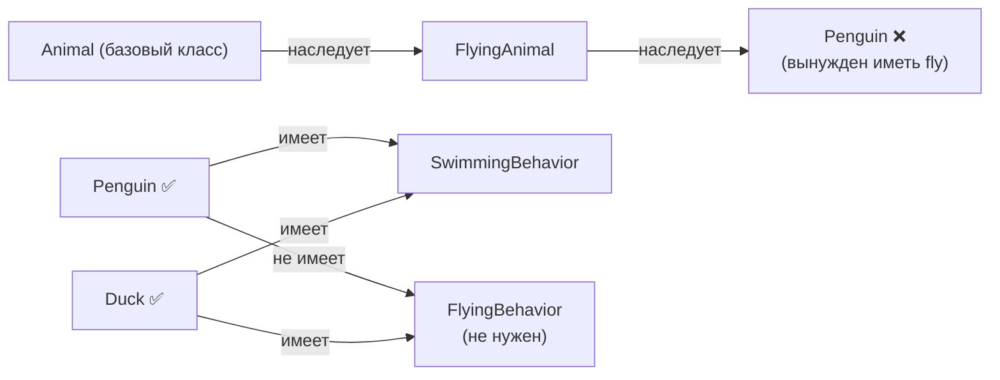

# Уровень 6: Композиция, агрегация, делегирование

## Зачем это важно?

Представьте два способа собрать стол. Первый — вырезать его из одного цельного куска дерева: прочно, но если нужно изменить форму ножки, придётся переделывать всё. Второй — собрать из отдельных деталей на болтах: можно заменить любую часть, не трогая остальное.

Наследование — это первый способ. Композиция — второй. Именно поэтому в объектно-ориентированном проектировании давно принят принцип: **«предпочитайте композицию наследованию»**.

---

## Наследование и его проблемы

Наследование — это отношение «является» (is-a): `Cat` является `Animal`. Звучит логично, но на практике иерархии наследования быстро становятся хрупкими.

```typescript
class Animal {
  move() { console.log('moving') }
  breathe() { console.log('breathing') }
}

class FlyingAnimal extends Animal {
  fly() { console.log('flying') }
}

class Dog extends Animal { /* не летает */ }
class Bat extends FlyingAnimal { /* летает */ }
class Penguin extends FlyingAnimal { /* не летает, но плавает */ }
// ❌ Penguin наследует fly(), которого у него нет логически
```

💡 Как только появился пингвин — иерархия сломалась. Это называют **fragile base class problem**: изменение базового класса ломает потомков.

---

## Композиция: «имеет» вместо «является»

Композиция — это отношение «имеет» (has-a). Объект создаётся из частей, каждая из которых отвечает за своё поведение.

```typescript
// Вместо наследования — набор возможностей
interface Flyable {
  fly(): void
}

interface Swimmable {
  swim(): void
}

// Реализации поведения — отдельные объекты
const flyer: Flyable = { fly: () => console.log('flying') }
const swimmer: Swimmable = { swim: () => console.log('swimming') }

// Птица составляется из поведений
class Duck {
  constructor(
    private flying: Flyable,
    private swimming: Swimmable,
  ) {}

  fly() { this.flying.fly() }
  swim() { this.swimming.swim() }
}

// Пингвин — только плавает
class Penguin {
  constructor(private swimming: Swimmable) {}
  swim() { this.swimming.swim() }
}
```

✅ Каждая птица берёт только нужные способности. Никаких пустых методов или неверных обещаний.

---

## Разница между композицией и агрегацией

Обе — это «имеет», но отличаются временем жизни частей:

**Композиция**: часть не существует без целого.

```typescript
class Order {
  private items: OrderItem[] // OrderItem создаётся внутри Order и принадлежит ему

  addItem(productId: string, qty: number) {
    this.items.push(new OrderItem(productId, qty)) // Item = часть Order
  }
}
// Если Order удалить — OrderItem тоже исчезает
```

**Агрегация**: части живут независимо.

```typescript
class Playlist {
  private songs: Song[] // Song существует и без Playlist

  addSong(song: Song) {
    this.songs.push(song)
  }
}
// Если Playlist удалить — Song остаётся в библиотеке
```

📌 Ориентир: если объект создаёт дочерний — скорее всего композиция. Если принимает снаружи — скорее всего агрегация.

---

## Делегирование

Делегирование — это когда объект перекладывает работу на другой объект, не наследуя его.

```typescript
class Logger {
  log(message: string) {
    console.log(`[LOG] ${message}`)
  }
}

class UserService {
  private logger = new Logger() // приватный член

  createUser(name: string) {
    // делегируем логирование Logger'у
    this.logger.log(`Creating user: ${name}`)
    // ... основная логика
  }
}
```

💡 UserService не наследует Logger, но использует его возможности. Это и есть делегирование — основа паттернов Decorator, Proxy, Adapter.

---

## Миксины

Миксин — способ добавить поведение классу без наследования. В TypeScript это делается через class expressions:

```typescript
// Тип конструктора
type Constructor<T = object> = new (...args: any[]) => T

// Миксин: добавляет метод serialize()
function Serializable<TBase extends Constructor>(Base: TBase) {
  return class extends Base {
    serialize(): string {
      return JSON.stringify(this)
    }
  }
}

// Миксин: добавляет метод validate()
function Validatable<TBase extends Constructor>(Base: TBase) {
  return class extends Base {
    validate(): boolean {
      return Object.values(this).every(v => v !== null && v !== undefined)
    }
  }
}

class User {
  constructor(public name: string, public email: string) {}
}

// Применяем оба миксина
const EnhancedUser = Serializable(Validatable(User))
const user = new EnhancedUser('Alice', 'alice@example.com')
user.serialize()  // '{"name":"Alice","email":"alice@example.com"}'
user.validate()   // true
```

📌 HOC (Higher-Order Component) в React — это по сути миксин для компонентов.

---

## Схема: наследование vs композиция



---

## Итог

- **Наследование** — «является» (is-a): жёсткая связь, fragile base class, ромбовидные проблемы
- **Композиция** — «имеет» (has-a) с зависимым временем жизни частей: часть принадлежит целому
- **Агрегация** — «имеет» (has-a) с независимым временем жизни: части живут самостоятельно
- **Делегирование** — передача работы другому объекту без наследования его поведения
- **Миксины** — добавление поведения «сбоку», без иерархии наследования
