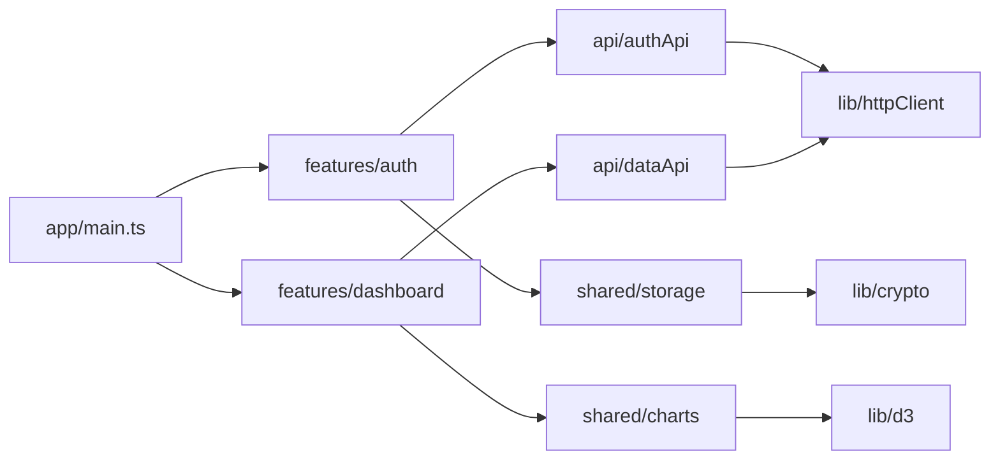

# Уровень 7: Модульность — подробная теория

## Модуль как единица организации кода

Аналогия, которая работает: представьте модуль как комнату в доме. У комнаты есть:
- **Стены** — то, что скрыто от посторонних (приватная реализация)
- **Дверь** — контролируемый вход/выход (публичный API — exports)
- **Окно** — то, что модуль видит снаружи (imports)

Когда вы заходите в ванную комнату — вы пользуетесь краном и зеркалом. Вам не нужно знать, как проложена сантехника за стенами и какой бренд трубы. Публичный интерфейс — кран и зеркало, реализация — скрыта.

```typescript
// module: auth/tokenService.ts

// ПРИВАТНАЯ РЕАЛИЗАЦИЯ (стены) — не экспортируется
const SECRET_KEY = process.env.JWT_SECRET!
const TOKEN_EXPIRY = 60 * 60 * 24 // 24 часа

function createPayload(userId: string, role: string) {
  return {
    sub: userId,
    role,
    iat: Math.floor(Date.now() / 1000),
    exp: Math.floor(Date.now() / 1000) + TOKEN_EXPIRY,
  }
}

// ПУБЛИЧНЫЙ ИНТЕРФЕЙС (дверь) — экспортируется
export function generateToken(userId: string, role: string): string {
  const payload = createPayload(userId, role)
  return btoa(JSON.stringify(payload)) // упрощённо
}

export function verifyToken(token: string): { userId: string; role: string } | null {
  try {
    const payload = JSON.parse(atob(token))
    if (payload.exp < Date.now() / 1000) return null
    return { userId: payload.sub, role: payload.role }
  } catch {
    return null
  }
}

// createPayload, SECRET_KEY, TOKEN_EXPIRY — снаружи недоступны
// Можно переписать реализацию — публичный API не изменится
```

---

## История модулей в JavaScript: от хаоса к порядку

Понять современные модули без истории сложно — слишком много «почему именно так».

### Эпоха до модулей: глобальное пространство имён

В начале JavaScript не имел модульной системы. Всё попадало в глобальную область видимости браузера:

```html
<script src="jquery.js"></script>  <!-- добавляет $ в window -->
<script src="underscore.js"></script>  <!-- добавляет _ в window -->
<script src="app.js"></script>  <!-- использует $ и _  -->
```

Проблема: конфликты имён. Если две библиотеки используют одно имя — одна перезатирает другую. Масштабировать невозможно.

### IIFE: первый обходной путь

Разработчики начали оборачивать код в Immediately Invoked Function Expressions:

```javascript
// jquery-like IIFE
(function(window) {
  function $(selector) { return document.querySelector(selector) }
  // ... приватные детали внутри функции
  window.$ = $  // экспортируем только то, что нужно
})(window)

// Теперь глобально только $, а не все вспомогательные функции
```

Это работало, но было соглашением, а не стандартом.

### AMD (Asynchronous Module Definition): браузерные модули

RequireJS популяризировал асинхронную загрузку модулей:

```javascript
// Определение модуля
define(['jquery', 'underscore'], function($, _) {
  function processUsers(users) {
    return _.map(users, user => ({
      ...user,
      name: $.trim(user.name)
    }))
  }

  return { processUsers }
})

// Использование
require(['userModule'], function(userModule) {
  userModule.processUsers(data)
})
```

Асинхронность — это хорошо для браузера. Но синтаксис — громоздкий, декларативная зависимость неудобна.

### CommonJS: Node.js и его путь

Node.js сделал ставку на синхронные модули (файловая система синхронна):

```javascript
// Экспорт
function formatDate(date) {
  return date.toLocaleDateString('ru')
}

function formatCurrency(amount) {
  return new Intl.NumberFormat('ru', { style: 'currency', currency: 'RUB' }).format(amount)
}

module.exports = { formatDate, formatCurrency }

// Импорт
const { formatDate } = require('./formatters')
const formatters = require('./formatters')
```

CommonJS стал де-факто стандартом для Node.js и через Browserify/Webpack проник в браузерный мир.

### ES Modules: победитель

В 2015 году (ES6) JavaScript получил официальную модульную систему:

```typescript
// Именованные экспорты
export function formatDate(date: Date): string {
  return date.toLocaleDateString('ru')
}

export const DEFAULT_LOCALE = 'ru'

// Дефолтный экспорт (один на модуль)
export default class DateUtils {
  static format = formatDate
}

// Реэкспорт из другого модуля
export { processUser } from './userProcessor'
export type { User } from './types'
```

```typescript
// Именованные импорты
import { formatDate, DEFAULT_LOCALE } from './formatters'

// Дефолтный импорт (имя любое)
import DateUtils from './formatters'

// Namespace импорт
import * as formatters from './formatters'

// Смешанный
import DateUtils, { formatDate } from './formatters'

// Динамический импорт (lazy loading)
const { formatDate } = await import('./formatters')
```

---

## ESM подробно: статика как сила

### Статический граф зависимостей

Главное свойство ESM: все `import` должны быть на верхнем уровне и с литеральными путями. Никакого:

```typescript
// ❌ Так нельзя в ESM (так можно в CJS)
if (process.env.NODE_ENV === 'test') {
  import { mockApi } from './mocks'  // SyntaxError в ESM
}

const moduleName = condition ? './a' : './b'
import stuff from moduleName  // SyntaxError — путь должен быть литералом
```

Почему? Потому что бандлер строит граф зависимостей **до** выполнения кода. Статический граф — гарантия, что можно провести tree-shaking.

### Tree-shaking в деталях

```typescript
// math.ts
export function add(a: number, b: number) { return a + b }
export function subtract(a: number, b: number) { return a - b }
export function multiply(a: number, b: number) { return a * b }
export function divide(a: number, b: number) { return a / b }
export const PI = 3.14159265

// calculator.ts — используем только часть
import { add, PI } from './math'

const circumference = (r: number) => 2 * PI * r
const sum = (nums: number[]) => nums.reduce(add, 0)

// subtract, multiply, divide — НЕ используются
// После tree-shaking они не попадут в bundle
```

Бандлер (Vite, Webpack 5, Rollup) строит граф, видит какие экспорты используются, и вырезает остальные. Это критично для крупных библиотек:

```typescript
// ❌ Так импортируют новички — весь lodash в bundle (~70kb gzipped)
import _ from 'lodash'
const result = _.groupBy(users, 'role')

// ✅ Именованный импорт + tree-shaking — только groupBy (~2kb)
import { groupBy } from 'lodash-es' // lodash-es — ESM версия lodash
const result = groupBy(users, 'role')
```

### Циклические зависимости

Циклические зависимости — когда A импортирует из B, а B импортирует из A.

```typescript
// a.ts
import { getB } from './b'

export function getA(): string {
  return `A calls ${getB()}`
}

// b.ts
import { getA } from './a'

export function getB(): string {
  return `B calls ${getA()}`  // бесконечная рекурсия при вызове
}
```

ESM обрабатывает цикличные зависимости через «живые привязки» (live bindings): модули резервируют слоты для экспортов, которые заполняются по мере инициализации. Это значит, что цикл не всегда приводит к ошибке:

```typescript
// a.ts
import { valueB } from './b'

export const valueA = 'hello'
export function useB() {
  return valueB  // к моменту вызова b.ts уже инициализирован
}

// b.ts
import { valueA } from './a'

export const valueB = valueA.toUpperCase()  // 'HELLO'
// Это работает если a.ts был инициализирован раньше b.ts в графе
```

📌 Как избежать циклических зависимостей: выносить общее в третий модуль.

```typescript
// ❌ Цикл: user.ts ↔ order.ts
// user.ts импортирует getOrderCount из order.ts
// order.ts импортирует getUserName из user.ts

// ✅ Выносим общие типы в types.ts
// types.ts — только типы, никаких импортов
// user.ts импортирует из types.ts
// order.ts импортирует из types.ts
// Цикл разорван
```

---

## CommonJS: почему он всё ещё с нами

CommonJS жив и важен по нескольким причинам:

1. **Исторический груз**: миллионы npm-пакетов написаны на CJS
2. **Node.js совместимость**: CJS работает везде в Node.js без флагов
3. **Динамические require**: иногда нужно загружать модуль по условию

```javascript
// Динамический require — только CJS
function getPlugin(name) {
  try {
    return require(`./plugins/${name}`)  // путь строится динамически
  } catch {
    return null
  }
}

// Это невозможно в статическом ESM
// ESM аналог — динамический import():
async function getPlugin(name) {
  try {
    return await import(`./plugins/${name}`)  // динамический import в ESM
  } catch {
    return null
  }
}
```

### Почему CJS не поддерживает tree-shaking

```javascript
// CJS: require выполняется в runtime
const utils = require('./utils')
// Бандлер не знает, что именно будет использовано из utils
// Поэтому весь модуль попадает в bundle

// Более того: можно написать так
const methodName = condition ? 'formatDate' : 'formatCurrency'
utils[methodName]()  // динамическое обращение к методу — статический анализ невозможен
```

Это фундаментальное ограничение: без знания графа зависимостей до выполнения — нет tree-shaking.

---

## Организация модулей в проекте

### Barrel exports: за и против

Barrel (бочка) — файл `index.ts`, который реэкспортирует публичный API директории:

```typescript
// features/user/index.ts — barrel
export { UserCard } from './components/UserCard'
export { UserForm } from './components/UserForm'
export { useUser } from './hooks/useUser'
export { userApi } from './api/userApi'
export type { User, UserRole, UserCreateDTO } from './types'

// До: громоздкий импорт с деталями структуры
import { UserCard } from '../../features/user/components/UserCard'
import { useUser } from '../../features/user/hooks/useUser'

// После: чистый импорт из публичного API
import { UserCard, useUser } from '../../features/user'
```

**За**:
- Скрывает внутреннюю структуру директории
- Удобный публичный API (можно переименовывать файлы внутри без изменения импортов снаружи)
- Явный контракт: если не экспортировано в barrel — значит приватное

**Против**:
- Может создавать проблемы с tree-shaking если смешаны тяжёлые и лёгкие зависимости
- Circular dependency через barrel: A импортирует из barrel, barrel реэкспортирует B, B импортирует A

```typescript
// ⚠️ Потенциальная проблема: barrel с тяжёлыми и лёгкими модулями
// features/index.ts
export * from './userFeature'      // тянет React, axios, ...
export * from './utils/formatDate' // маленькая утилита без зависимостей

// При импорте только formatDate — может потянуться весь userFeature
import { formatDate } from './features'  // ❌ не оптимально

// ✅ Разделяйте по весу
import { formatDate } from './features/utils' // отдельный barrel для utils
```

### Принцип минимального интерфейса

Экспортируйте только то, что должны видеть пользователи модуля:

```typescript
// ❌ Экспортируем детали реализации
export class UserRepository { }
export class UserMapper { }
export class UserValidator { }
export function mapDbRowToUser(row: DbRow): User { }
export function validateEmail(email: string): boolean { }

// ✅ Экспортируем публичный контракт
export class UserService {
  async getUser(id: string): Promise<User> { }
  async createUser(dto: CreateUserDTO): Promise<User> { }
}
export type { User, CreateUserDTO }
// UserRepository, UserMapper, UserValidator — детали реализации, не нужны снаружи
```

### Монорепы: workspace packages

В монорепозитории несколько пакетов делят одну кодовую базу:

```
packages/
  ui-kit/          # @company/ui-kit
    src/
    package.json
  api-client/      # @company/api-client
    src/
    package.json
  utils/           # @company/utils
    src/
    package.json
apps/
  dashboard/
    package.json  # depends on @company/ui-kit, @company/api-client
```

```json
// apps/dashboard/package.json
{
  "dependencies": {
    "@company/ui-kit": "workspace:*",
    "@company/api-client": "workspace:^1.0.0"
  }
}
```

Workspace `*` означает: использовать локальную версию из монорепы. Это позволяет разрабатывать несколько пакетов одновременно без `npm link`.

---

## Package management: детали, которые важны

### Semver: больше чем три цифры

```
major.minor.patch-prerelease+buildmeta

1.4.2-beta.1+20240115
│ │ │  │       │
│ │ │  │       └── Build metadata (игнорируется при сравнении)
│ │ │  └────────── Prerelease (1.4.2-beta < 1.4.2)
│ │ └───────────── Patch: backwards-compatible bug fixes
│ └─────────────── Minor: backwards-compatible new features
└───────────────── Major: breaking changes
```

```json
{
  "dependencies": {
    "lodash": "4.17.21",       // строго эта версия
    "react": "^18.2.0",        // >=18.2.0 <19.0.0 (minor и patch)
    "axios": "~1.6.0",         // >=1.6.0 <1.7.0 (только patch)
    "typescript": ">=5.0.0",   // любая 5.x и выше
    "some-lib": "*"            // любая версия (опасно!)
  }
}
```

📌 Правило: для зависимостей в production используйте `^`. Для критичных инструментов (TypeScript, ESLint) — фиксируйте точную версию, чтобы не получить неожиданные изменения поведения.

### Lock-файлы: контракт воспроизводимости

```
# package.json
"react": "^18.2.0"  // говорит: любая 18.x подойдёт

# package-lock.json — фиксирует всё
"node_modules/react": {
  "version": "18.2.0",           // именно эта версия
  "resolved": "https://...",
  "integrity": "sha512-...",      // хэш для проверки
  "dependencies": {
    "loose-envify": "^1.1.0"
  }
}
```

Почему lock-файл важен:

```
Разработчик А устанавливает проект 1 января → react 18.2.0
Разработчик Б устанавливает проект 1 марта → react 18.3.1 (вышел в феврале)
CI устанавливает без lock-файла → react 18.3.1
Production без lock-файла → react 18.3.1

Баг только в 18.3.1 → "у меня работало" → часы отладки
```

С lock-файлом: все получают react 18.2.0 до тех пор, пока не запущен `npm update`.

### Phantom dependencies и hoisting

Node.js ищет модули по принципу: `node_modules` текущей папки → `node_modules` родительской → и так до корня. Это называется hoisting.

```
my-project/
  node_modules/
    some-package/
      node_modules/
        lodash/      ← устанавливается как зависимость some-package
  src/
    app.ts

// В app.ts:
import _ from 'lodash'  // РАБОТАЕТ, хотя lodash нет в package.json
// Node.js находит его в my-project/node_modules/some-package/node_modules/lodash
```

Это называется **phantom dependency** — зависимость, которой нет в package.json, но она доступна. Проблема:
1. При обновлении `some-package` может обновиться `lodash` — ваш код может сломаться
2. При удалении `some-package` — `lodash` исчезнет

```typescript
// ✅ Всегда явно объявляйте зависимости которые используете
// package.json
{
  "dependencies": {
    "lodash": "^4.17.21"  // явная зависимость
  }
}
```

---

## peerDependencies: зависимости от хоста

peerDependencies решают проблему «я работаю с X, но X должен предоставить сам пользователь»:

```json
// package.json библиотеки @company/react-table
{
  "peerDependencies": {
    "react": ">=17.0.0",
    "react-dom": ">=17.0.0"
  }
}
```

Почему не просто `dependencies`?

```
Проект: react 18.2.0
@company/react-table dependencies: react 17.0.0

Без peerDependencies:
node_modules/
  react/                    ← 18.2.0 (проект)
  @company/react-table/
    node_modules/
      react/                ← 17.0.0 (таблица)

// Два React в одном приложении — React не поддерживает это
// Хуки сломаются: "Invalid hook call"

С peerDependencies:
node_modules/
  react/                    ← 18.2.0 (один React)
  @company/react-table/     ← использует react из корня
```

peerDependencies говорит: «я не устанавливаю react сам, я рассчитываю, что он уже есть в проекте».

---

## TypeScript namespaces vs модули

Исторически TypeScript имел собственную систему namespaces:

```typescript
// Старый стиль: TypeScript namespaces
namespace MathUtils {
  export function add(a: number, b: number) { return a + b }

  export namespace Geometry {
    export const PI = 3.14159
    export function circleArea(r: number) { return PI * r ** 2 }
  }
}

// Использование
const result = MathUtils.add(1, 2)
const area = MathUtils.Geometry.circleArea(5)
```

Namespaces были нужны до появления ES Modules. Сейчас они — legacy:

```typescript
// ✅ Современный подход: обычные модули
// math/utils.ts
export function add(a: number, b: number) { return a + b }

// math/geometry.ts
export const PI = 3.14159
export function circleArea(r: number) { return PI * r ** 2 }

// math/index.ts — barrel если нужно
export { add } from './utils'
export { PI, circleArea } from './geometry'
```

Почему модули лучше namespaces в 2026:
- Нативная поддержка в Node.js и браузерах без компиляции
- Tree-shaking
- Явные зависимости через `import`
- Лучшая поддержка в тулинге (Vite, Webpack, ESLint)
- Namespaces не работают с ESM нативно

📌 Единственный оправданный случай для namespaces в современном TypeScript — расширение глобальных типов через `declare namespace`.

---

## Схема: зависимости между модулями



---

## Частые ошибки начинающих

### Circular dependency через barrel

```typescript
// ❌ Классическая ловушка
// features/index.ts
export { UserCard } from './UserCard'
export { OrderCard } from './OrderCard'

// UserCard.tsx
import { OrderCard } from '../features'  // импорт через barrel ← проблема

// OrderCard.tsx
import { UserCard } from '../features'  // импорт через barrel ← цикл!
// UserCard → features/index.ts → OrderCard → features/index.ts → UserCard
```

```typescript
// ✅ Прямые импорты между соседними модулями
// UserCard.tsx
import { OrderCard } from './OrderCard'  // прямой импорт, не через barrel

// OrderCard.tsx
import { UserCard } from './UserCard'  // прямой импорт
```

### Phantom dependency в продакшн-коде

```typescript
// ❌ Используем пакет который не в package.json
import { merge } from 'lodash'  // lodash не в ваших dependencies!
// Работает потому что lodash установлен как зависимость other-package
// После обновления other-package — может сломаться
```

```typescript
// ✅ Явная зависимость
// $ npm install lodash
// $ npm install -D @types/lodash
import { merge } from 'lodash'  // теперь явно в package.json
```

### Дефолтный экспорт везде

```typescript
// ❌ Default export затрудняет tree-shaking и автоимпорт
// utils.ts
export default {
  formatDate: (d: Date) => d.toLocaleDateString('ru'),
  formatCurrency: (n: number) => n.toFixed(2),
  formatPhone: (p: string) => p.replace(/\D/g, ''),
}

// Импорт — нельзя деструктурировать при импорте
import utils from './utils'
utils.formatDate(new Date())
// Весь объект в bundle даже если нужна только formatDate
```

```typescript
// ✅ Именованные экспорты
export function formatDate(d: Date): string { return d.toLocaleDateString('ru') }
export function formatCurrency(n: number): string { return n.toFixed(2) }
export function formatPhone(p: string): string { return p.replace(/\D/g, '') }

// Чёткий импорт, tree-shaking работает
import { formatDate } from './utils'
```

### Смешивание peerDependencies и dependencies для React-библиотек

```json
// ❌ Библиотека компонентов объявляет react как dependency
{
  "dependencies": {
    "react": "^18.0.0"
  }
}
// Результат: два React в node_modules, сломанные хуки

// ✅ react как peerDependency
{
  "peerDependencies": {
    "react": ">=17.0.0"
  },
  "devDependencies": {
    "react": "^18.0.0"  // для разработки и тестов библиотеки
  }
}
```
