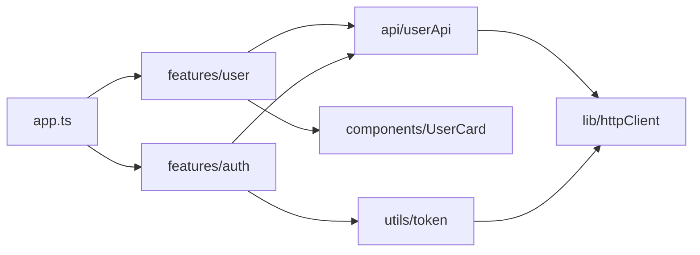

# Уровень 7: Модульность

## Зачем нужны модули?

Представьте дом без стен: вся кухня, спальня и ванная в одном пространстве. Каждое утро вам нужно помнить, где что лежит, и следить, чтобы кто-то из домашних не переставил ваши вещи. Это — программа без модулей.

Модуль — это комната: есть стены (приватное) и дверь (публичный API). Вы заходите через дверь и не знаете, как устроена мебель внутри — это не ваше дело.

Три главных зачем:
- **Инкапсуляция**: детали реализации скрыты, наружу выходит только необходимое
- **Переиспользование**: модуль можно подключить в любом другом месте
- **Управление зависимостями**: явно видно, кто от чего зависит

---

## ES Modules vs CommonJS

Два стандарта, которые сосуществуют в экосистеме JavaScript:

```typescript
// ES Modules (ESM) — современный стандарт
export const PI = 3.14159
export function circle(r: number) { return PI * r ** 2 }
export default class Calculator { }

import { PI, circle } from './math'
import Calculator from './math'
import * as math from './math'  // namespace import
```

```javascript
// CommonJS (CJS) — Node.js исторический формат
const PI = 3.14159
function circle(r) { return PI * r * r }
module.exports = { PI, circle }

const { PI, circle } = require('./math')
const math = require('./math')
```

Ключевые отличия:

| | ES Modules | CommonJS |
|---|---|---|
| Разбор зависимостей | Статический (compile-time) | Динамический (runtime) |
| Tree-shaking | Да | Нет |
| Top-level await | Да | Нет |
| Синхронность | Асинхронный | Синхронный |

---

## Tree-shaking: почему ESM меньше весит

Tree-shaking — удаление неиспользуемого кода при сборке. Работает только с ESM, потому что импорты статические:

```typescript
// utils.ts — экспортируем много функций
export function formatDate(d: Date) { /* ... */ }
export function formatCurrency(n: number) { /* ... */ }
export function formatPhone(p: string) { /* ... */ }

// app.ts — используем только одну
import { formatDate } from './utils'

// После tree-shaking в bundle попадёт только formatDate
// formatCurrency и formatPhone — вырезаны бандлером
```

С CommonJS так не работает: `require('./utils')` выполняется в runtime, бандлер не знает заранее, что именно используется.

---

## Barrel exports (index.ts)

Barrel export — файл `index.ts`, который реэкспортирует всё из директории:

```typescript
// features/user/index.ts — barrel
export { UserCard } from './UserCard'
export { UserForm } from './UserForm'
export type { User, UserRole } from './types'

// Использование: импортируем из папки, а не из конкретного файла
import { UserCard, UserForm } from './features/user'
```

⚠️ Barrel экспорты удобны, но могут сломать tree-shaking если в них смешаны разные ответственности. Правило: один barrel на фичу.

---

## Package.json и управление зависимостями

```json
{
  "dependencies": {
    "react": "^18.2.0"
  },
  "devDependencies": {
    "typescript": "^5.0.0"
  },
  "peerDependencies": {
    "react": ">=17.0.0"
  }
}
```

- **dependencies**: нужны в runtime (отправляются пользователю)
- **devDependencies**: нужны при разработке (тесты, типы, сборщики)
- **peerDependencies**: «я работаю с React, но ты сам установи нужную версию»

Semver: `major.minor.patch`
- `^18.2.0` — любая `18.x.x`, но не `19.x.x`
- `~18.2.0` — только `18.2.x`
- `18.2.0` — строго эта версия

---

## Lock-файлы

`package-lock.json` или `yarn.lock` фиксируют точные версии всех транзитивных зависимостей:

```
# package.json говорит: react ^18.2.0
# package-lock.json фиксирует: react 18.2.0 (ровно эта)
```

📌 Lock-файл должен быть в репозитории. Без него два разработчика могут получить разные версии зависимостей → «у меня работает, у тебя нет».

---

## Схема: зависимости между модулями



---

## Итог

- **Модуль** — единица инкапсуляции: скрывает детали, показывает контракт
- **ESM** — статический граф зависимостей, tree-shaking, `import/export`
- **CJS** — динамический `require`, нет tree-shaking, совместимость с Node.js
- **Barrel** — `index.ts` для удобного публичного API директории
- **Semver** — `major.minor.patch`, `^` разрешает minor/patch, `~` только patch
- **Lock-файл** — фиксирует точные версии, должен быть в репозитории
