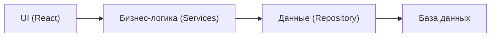
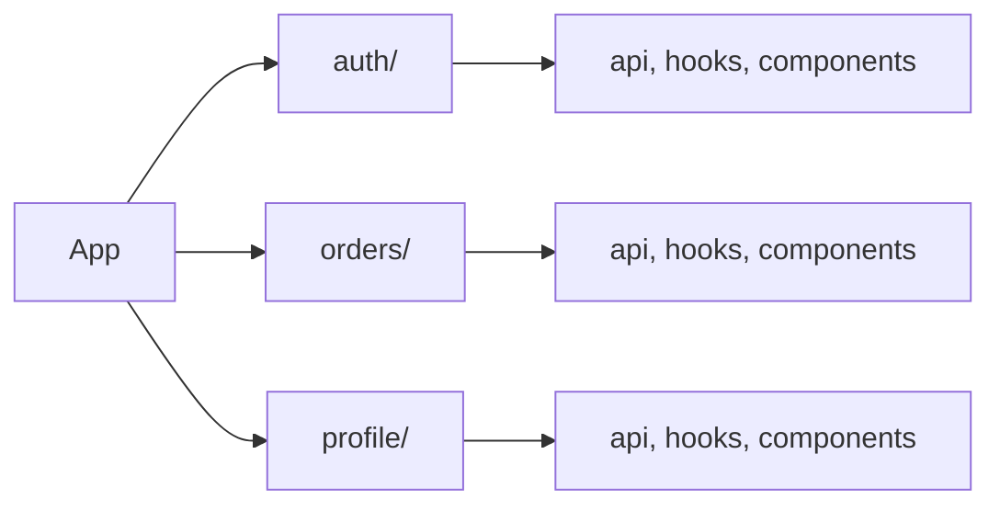
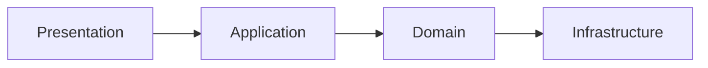

# Уровень 8: Абстракция и разделение ответственности

## Что такое абстракция?

Карта — это абстракция местности. Карта мира показывает страны и океаны, но не каждый переулок. Карта города показывает улицы, но не рельеф каждого двора. Разные масштабы — разные уровни абстракции. Главное: карта скрывает детали, которые не нужны на данном уровне.

В коде всё то же самое. Функция `sendEmail(to, subject, body)` скрывает SMTP-протокол, TLS-рукопожатие, DNS-резолвинг. Вы работаете с понятным контрактом, не зная деталей. Это и есть абстракция.

---

## SLAP — Single Level of Abstraction Principle

Принцип единого уровня абстракции: каждая функция должна работать **на одном уровне абстракции**. Не смешивать стратегию и тактику в одном месте.

```typescript
// ❌ Разные уровни абстракции в одной функции
async function processOrder(orderId: string) {
  // Высокий уровень — бизнес-логика
  const order = await getOrder(orderId)

  // Низкий уровень — детали работы с DOM
  const el = document.querySelector('#status')
  el!.className = 'loading'
  el!.textContent = 'Обработка...'

  // Высокий уровень — снова бизнес-логика
  await chargePayment(order)

  // Низкий уровень — HTTP-детали
  const response = await fetch('/api/notify', {
    method: 'POST',
    headers: { 'Content-Type': 'application/json' },
    body: JSON.stringify({ orderId }),
  })

  // Высокий уровень — завершение
  await updateOrderStatus(orderId, 'completed')
}
```

```typescript
// ✅ Каждая функция — один уровень абстракции
async function processOrder(orderId: string) {
  const order = await getOrder(orderId)
  showLoadingState()
  await chargePayment(order)
  await notifyOrderComplete(orderId)
  await updateOrderStatus(orderId, 'completed')
}

function showLoadingState() {
  const el = document.querySelector('#status')
  el!.className = 'loading'
  el!.textContent = 'Обработка...'
}

async function notifyOrderComplete(orderId: string) {
  await fetch('/api/notify', {
    method: 'POST',
    headers: { 'Content-Type': 'application/json' },
    body: JSON.stringify({ orderId }),
  })
}
```

Функция `processOrder` теперь читается как проза: получи заказ, покажи загрузку, спиши оплату, уведоми, обнови статус. Детали каждого шага — в отдельных функциях на своём уровне.

---

## Separation of Concerns (SoC)

Разделение ответственности — принцип, что разные части системы отвечают за разные задачи.

**Горизонтальное разделение** — по техническим слоям:



**Вертикальное разделение** — по фичам (feature slices):



В React классическое разделение: **Container/Presentational**.

```typescript
// Presentational — только отображение, без логики
function UserCard({ name, email, onEdit }: UserCardProps) {
  return (
    <div className="card">
      <h2>{name}</h2>
      <p>{email}</p>
      <button onClick={onEdit}>Редактировать</button>
    </div>
  )
}

// Container — только логика, без вёрстки
function UserCardContainer({ userId }: { userId: string }) {
  const { data: user, isLoading } = useUser(userId)
  const { mutate: editUser } = useEditUser()

  if (isLoading) return <Skeleton />
  return <UserCard {...user} onEdit={() => editUser(userId)} />
}
```

---

## Утечка абстракции

Джоэл Спольски сформулировал «Закон дырявых абстракций»: **все нетривиальные абстракции до определённой степени дырявые**.

Примеры из жизни:
- ORM скрывает SQL, но N+1 queries проникают наружу — нужно знать про `eager loading`
- `Array.sort()` скрывает алгоритм, но Chrome использует разные алгоритмы для массивов < 10 и > 10 элементов
- HTTP скрывает TCP, но таймауты, keep-alive и retry-логика видны разработчику

```typescript
// ORM утекает: внешне выглядит как простой цикл
const users = await User.findAll()
for (const user of users) {
  // ❌ N+1: каждый вызов — отдельный SQL-запрос
  const posts = await user.getPosts()
}

// Нужно знать про «дыру» в абстракции и использовать eager loading
const users = await User.findAll({ include: [Post] }) // ✅ один JOIN-запрос
```

Утечки не означают, что абстракции плохи. Они означают, что **нужно знать один уровень ниже** того, с которым работаешь.

---

## Слоёная архитектура



Правило: **зависимости идут только вниз**. Domain не знает про HTTP, Presentation не знает про SQL.

---

## ⚠️ Частые ошибки

**Смешивание уровней абстракции (нарушение SLAP):**

```typescript
// ❌ Стратегия и тактика перемешаны
function checkout(cart: Cart) {
  // бизнес-логика
  if (cart.items.length === 0) throw new Error('Пустая корзина')
  // HTTP-детали (не тот уровень)
  const res = await fetch('/api/orders', { method: 'POST', body: JSON.stringify(cart) })
  if (!res.ok) throw new Error(`HTTP ${res.status}`)
  // снова бизнес-логика
  clearCart()
}
```

**Нарушение SoC — логика в шаблоне:**

```tsx
// ❌ Вычисления прямо в JSX
<div>{users.filter(u => u.active).sort((a, b) => a.name.localeCompare(b.name)).length}</div>

// ✅ Логика в хуке или вычисляемой переменной
const activeUserCount = useMemo(
  () => users.filter(u => u.active).sort((a, b) => a.name.localeCompare(b.name)).length,
  [users]
)
<div>{activeUserCount}</div>
```

---

## Итог

- **SLAP**: одна функция — один уровень абстракции. Стратегия отдельно от тактики
- **SoC**: разные задачи — в разных местах. UI не знает про SQL, бизнес-логика не знает про HTML
- **Утечки абстракции** неизбежны — нужно понимать один уровень ниже
- **Слоёная архитектура**: зависимости текут только в одном направлении
