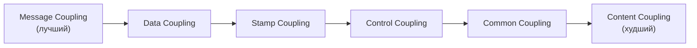
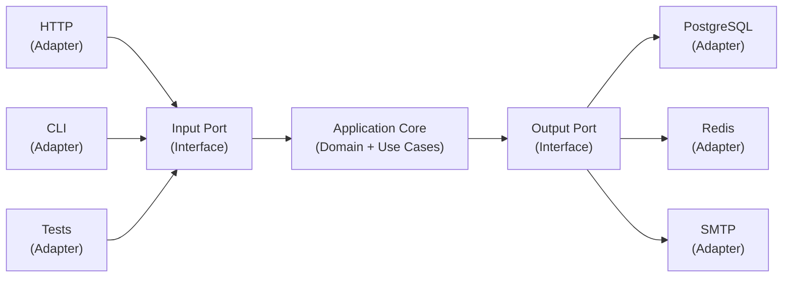

# Уровень 9: Связанность, сцепленность и границы — подробная теория

## Coupling — связанность между модулями

Представьте состав поезда. Жёсткая неразборная сцепка — один вагон сломался, весь состав встал. Магнитная сцепка — вагон отцепили, состав поехал дальше. А теперь представьте вагон, внутренности которого намертво вплавлены в соседний — это уже не вагон, это кусок металлолома.

Coupling — это степень, в которой один модуль зависит от внутренностей другого. Чем крепче связь, тем сложнее изменить один модуль, не затронув другой.

### Спектр coupling: от лучшего к худшему



#### 1. Message Coupling — только вызов, никаких данных

Модули общаются через события или вызов метода без параметров. Минимальная связь.

```typescript
// ✅ Отправитель не знает, кто обработает событие
class OrderService extends EventEmitter {
  async create(data: CreateOrderDTO): Promise<Order> {
    const order = await this.orderRepo.save(data)
    this.emit('order:created', order.id)  // только сигнал, без данных
    return order
  }
}

// Получатель ничего не знает об OrderService — только подписан на событие
class NotificationService {
  constructor(orderService: OrderService) {
    orderService.on('order:created', (orderId) => this.onOrderCreated(orderId))
  }
}
```

#### 2. Data Coupling — простые данные, только то, что нужно

Модули обмениваются примитивами или простыми структурами. Оптимальный вариант для большинства случаев.

```typescript
// ✅ Только нужные данные, типизированы
function formatCurrency(amount: number, currency: string): string {
  return new Intl.NumberFormat('ru', { style: 'currency', currency }).format(amount)
}

async function sendEmail(to: string, subject: string, body: string): Promise<void> {
  // Получатель знает только email, тему и тело — не знает ничего о пользователе
}

// ✅ Вместо передачи всего объекта — только нужные поля
async function processPayment(orderId: string, amount: number, currency: string) {
  // Нет зависимости от структуры Order
}
```

#### 3. Stamp Coupling — передаём структуру, используем часть

Передаём объект, но используем только некоторые его поля. Избыточная зависимость: получатель теперь зависит от всей структуры объекта.

```typescript
// ❌ Stamp coupling: передаём весь User, нужен только email
async function sendWelcomeEmail(user: User): Promise<void> {
  await mailer.send({
    to: user.email,        // используем только email
    subject: 'Добро пожаловать',
    body: `Привет, ${user.name}!`,  // и name
    // user.role, user.createdAt, user.address — не используются
    // но функция теперь зависит от типа User
  })
}

// ✅ Data coupling: только нужные поля
async function sendWelcomeEmail(email: string, name: string): Promise<void> {
  await mailer.send({
    to: email,
    subject: 'Добро пожаловать',
    body: `Привет, ${name}!`,
  })
}
// Теперь функция не зависит от структуры User
// Можно вызвать с любыми email и name
```

Когда stamp coupling оправдан: если функция реально использует большинство полей объекта, или если объект — это богатый доменный объект с методами.

#### 4. Control Coupling — флаги управляют поведением

Передаём флаги или режимы, которые меняют внутреннее поведение получателя. Вызывающий код знает о внутренней структуре поведения — это утечка.

```typescript
// ❌ Control coupling: флаг управляет алгоритмом
function processOrder(order: Order, isUrgent: boolean, sendEmail: boolean, debugMode: boolean) {
  if (debugMode) console.log('Processing:', order)
  if (isUrgent) {
    // одна ветка алгоритма
  } else {
    // другая ветка алгоритма
  }
  if (sendEmail) { /* ... */ }
}

// Вызов выглядит как заклинание:
processOrder(order, true, false, true)  // что означают true/false/true?
```

```typescript
// ✅ Явные функции вместо флагов
function processUrgentOrder(order: Order): void { /* ... */ }
function processRegularOrder(order: Order): void { /* ... */ }

// Или объект конфигурации с именованными полями
interface ProcessOptions {
  priority: 'urgent' | 'regular'
  notify: boolean
}

function processOrder(order: Order, options: ProcessOptions): void { /* ... */ }

// Вызов читается:
processOrder(order, { priority: 'urgent', notify: false })
```

#### 5. Common Coupling — общие глобальные данные

Несколько модулей читают и пишут одно глобальное состояние. Изменение состояния одним модулем неожиданно влияет на другой.

```typescript
// ❌ Common coupling: глобальный стейт
let globalUser: User | null = null
let globalCart: CartItem[] = []
let globalConfig = { theme: 'light', locale: 'ru' }

// Модуль A меняет globalUser
function loginUser(user: User) {
  globalUser = user
}

// Модуль B читает globalUser — неявная зависимость от модуля A
function getCartForCurrentUser(): CartItem[] {
  if (!globalUser) return []
  return globalCart.filter(item => item.userId === globalUser!.id)
}
```

```typescript
// ✅ Явные зависимости через параметры или DI
function getCartForUser(userId: string, cartItems: CartItem[]): CartItem[] {
  return cartItems.filter(item => item.userId === userId)
}

// Если нужен контекст — явная инъекция
class CartService {
  constructor(
    private readonly cartRepo: CartRepository,
    private readonly authContext: AuthContext,  // явная зависимость
  ) {}

  async getCurrentUserCart(): Promise<CartItem[]> {
    const userId = this.authContext.getCurrentUserId()
    return this.cartRepo.findByUserId(userId)
  }
}
```

#### 6. Content Coupling — лезем во внутренности

Модуль обращается к приватным деталям другого. Худший вид: любое изменение внутреннего устройства ломает зависимый модуль.

```typescript
// ❌ Content coupling: используем _private поля
import cacheModule from './cacheModule'

// Обходим публичный API и чистим внутренний кэш напрямую
cacheModule._internalStore.clear()
cacheModule._config.ttl = 0

// Патчим чужой прототип
(String.prototype as any).toSlug = function() {
  return this.toLowerCase().replace(/ /g, '-')
}
```

```typescript
// ✅ Только публичный API
cacheModule.clear()                    // публичный метод
cacheModule.setTTL(0)                  // публичный метод для конфигурации

// Или расширяем через утилиту, не трогая прототип
function toSlug(str: string): string {
  return str.toLowerCase().replace(/ /g, '-')
}
```

### Afferent vs Efferent Coupling

Два направления зависимостей:

- **Afferent coupling (Ca)** — сколько модулей зависят от данного. Высокий Ca = модуль используется многими = он важный и трудно меняется
- **Efferent coupling (Ce)** — от скольких модулей зависит данный. Высокий Ce = модуль зависит от многих = он хрупкий

```
Модуль UserService:
  Ce (efferent): зависит от UserRepository, EmailService, Logger, Cache — Ce = 4
  Ca (afferent): от него зависят AuthController, ProfileController, AdminPanel — Ca = 3

Вывод: UserService активно использует другие модули И является общей зависимостью
→ при изменении его зависимостей может сломаться 3 других места
```

Метрика **Instability = Ce / (Ca + Ce)**:
- 0 = стабильный (другие зависят от него, сам ни от кого)
- 1 = нестабильный (зависит от многих, от него — никто)

Устойчивые зависимости: нестабильные модули должны зависеть от стабильных, а не наоборот.

---

## Cohesion — сцепленность внутри модуля

Cohesion — насколько всё, что находится в модуле, «про одно дело». Аналогия: швейцарский нож (низкая cohesion — много разных инструментов) против скальпеля (высокая cohesion — одна задача, выполняется идеально).

### Спектр cohesion: от лучшего к худшему

#### 1. Functional Cohesion — все элементы для одной задачи

```typescript
// ✅ Модуль emailValidator.ts — всё про валидацию email
export function isValidEmail(email: string): boolean {
  return /^[^\s@]+@[^\s@]+\.[^\s@]+$/.test(email)
}

export function normalizeEmail(email: string): string {
  return email.toLowerCase().trim()
}

export function extractDomain(email: string): string {
  return email.split('@')[1] ?? ''
}

export function isDisposableEmail(email: string): boolean {
  const disposableDomains = ['mailinator.com', 'tempmail.com', 'guerrillamail.com']
  return disposableDomains.includes(extractDomain(email))
}
// Каждая функция — про email-валидацию. Ничего лишнего.
```

#### 2. Sequential Cohesion — выход одного шага является входом следующего

```typescript
// ✅ Пайплайн обработки: каждая функция принимает результат предыдущей
function parseCSV(raw: string): string[][] {
  return raw.split('\n').map(line => line.split(','))
}

function validateRows(rows: string[][]): ValidatedRow[] {
  return rows.filter(row => row.length === 3).map(([name, email, age]) => ({
    name: name.trim(),
    email: email.trim(),
    age: parseInt(age),
  }))
}

function transformToUsers(rows: ValidatedRow[]): User[] {
  return rows.map(row => ({
    id: generateId(),
    name: row.name,
    email: row.email,
    age: row.age,
  }))
}

// Последовательная цепочка: raw → rows → validated → users
async function importUsers(csvContent: string): Promise<User[]> {
  const rows = parseCSV(csvContent)
  const validated = validateRows(rows)
  return transformToUsers(validated)
}
```

#### 3. Communicational Cohesion — работают с одними и теми же данными

```typescript
// Все функции работают с объектом Order
class OrderReportModule {
  calculateSubtotal(order: Order): number {
    return order.items.reduce((sum, item) => sum + item.price * item.quantity, 0)
  }

  calculateTax(order: Order): number {
    return this.calculateSubtotal(order) * order.taxRate
  }

  calculateTotal(order: Order): number {
    return this.calculateSubtotal(order) + this.calculateTax(order)
  }

  formatForPrint(order: Order): string {
    return `Заказ #${order.id}: ${this.calculateTotal(order)} руб.`
  }
  // Все методы работают с Order — communicational cohesion
}
```

#### 4. Temporal Cohesion — выполняются в одно время

```typescript
// ⚠️ Temporal cohesion: всё это вызывается при инициализации
// Элементы несвязаны концептуально, только по времени запуска

function initApp() {
  connectDatabase()       // инфраструктура
  loadTranslations()      // локализация
  setupAnalytics()        // аналитика
  initSearchIndex()       // поиск
  scheduleCronJobs()      // фоновые задачи
}

// ✅ Лучше: группировать по смыслу
async function initApp() {
  await initInfrastructure()  // БД, кэши, внешние сервисы
  await initApplication()     // бизнес-слой, сервисы
  await initScheduler()       // фоновые задачи
}
```

#### 5. Logical Cohesion — похожи по природе, но не связаны

```typescript
// ❌ Logical cohesion: Utility-класс с похожими по типу, но не связанными функциями
class ValidationUtils {
  static validateEmail(email: string): boolean { /* ... */ }
  static validatePhone(phone: string): boolean { /* ... */ }
  static validateAge(age: number): boolean { /* ... */ }
  static validateCreditCard(number: string): boolean { /* ... */ }
  static validatePassport(number: string): boolean { /* ... */ }
  // Все "валидируют", но концептуально несвязаны
}
```

```typescript
// ✅ Отдельные специализированные модули
// emailValidation.ts, phoneValidation.ts, paymentValidation.ts
// Каждый — про свою предметную область
```

#### 6. Coincidental Cohesion — случайная, «helpers.ts»

```typescript
// ❌ Худший случай: просто свалка функций
// utils.ts / helpers.ts / common.ts
export function formatDate(d: Date): string { /* ... */ }
export function generateUUID(): string { /* ... */ }
export function debounce(fn: Function, delay: number): Function { /* ... */ }
export function sendEmail(to: string, body: string): Promise<void> { /* ... */ }
export function calculateTax(price: number): number { /* ... */ }
export function parseQueryString(url: string): Record<string, string> { /* ... */ }
// Ничего общего между этими функциями — они просто «не вписались» в другие модули
```

Если у вас есть `utils.ts` размером 500 строк — это сигнал, что модули плохо структурированы.

---

## Закон Деметры (Law of Demeter)

Закон сформулирован в 1987 году в Northeastern University: «Разговаривай только с ближайшими друзьями».

Модуль должен обращаться только к:
1. Своим собственным методам/полям
2. Параметрам своих методов
3. Объектам, которые он создал сам
4. Прямым зависимостям (инъецированным)

Нельзя: навигировать через объекты, полученные от других объектов.

### Нарушение: цепочка вызовов

```typescript
// ❌ Train wreck (крушение поезда) — несколько точек в одной строке
const city = user.getAddress().getCity().getName()
const zip = order.getCustomer().getBillingAddress().getPostalCode()
const fee = payment.getGateway().getProcessor().getTransactionFee()

// Каждая точка — это знание о чужой внутренней структуре.
// Если Address изменит свою структуру — сломается код в user.ts
// Если City изменит API — сломается ещё выше
```

```typescript
// ✅ Tell, don't ask — пусть объект сам делает нужное
class User {
  private address: Address

  // User знает о своём Address и инкапсулирует навигацию
  getCity(): string {
    return this.address.getCityName()  // навигация внутри User
  }
}

class Address {
  private city: City

  getCityName(): string {
    return this.city.getName()  // навигация внутри Address
  }
}

// Теперь:
const city = user.getCity()  // ✅ Один уровень глубины
```

### Tell, don't ask

Принцип, который следует из Закона Деметры: не спрашивай объект о его состоянии, чтобы потом принять решение — скажи объекту сделать нужное.

```typescript
// ❌ Ask: спрашиваем, принимаем решение снаружи
if (user.getRole() === 'admin' && user.isActive() && user.getDepartment().hasPermission('export')) {
  exportData()
}

// ❌ Ещё хуже: цепочка + принятие решения снаружи
const canExport = account.getUser().getRole() === 'admin'

// ✅ Tell: объект сам знает, может ли он что-то
if (user.canExportData()) {
  exportData()
}

class User {
  canExportData(): boolean {
    return this.role === 'admin'
      && this.isActive
      && this.department.hasPermission('export')
  }
}
```

### Когда цепочки допустимы

Закон Деметры применяется к объектам с поведением (сервисы, доменные объекты), но не к структурам данных (DTO, value objects).

```typescript
// ✅ Структуры данных — цепочки нормальны
const city = userDTO.address.city.name  // DTO — просто данные, нет поведения

// ✅ Builder и Fluent API — специальный паттерн
const query = db.select('users')
  .where({ active: true })
  .orderBy('name')
  .limit(10)
// Каждый метод возвращает тот же объект (query builder)

// ✅ Stream и функциональные цепочки — всегда один тип
const result = [1, 2, 3, 4, 5]
  .filter(n => n > 2)
  .map(n => n * 2)
  .reduce((sum, n) => sum + n, 0)
```

---

## Архитектурные границы

Граница — это линия, которую нельзя пересечь без явного контракта. Она защищает: изменение за границей не должно неожиданно ломать то, что снаружи.

### Interface Segregation (ISP)

Принцип: клиент не должен зависеть от методов, которые не использует. Маленькие специализированные интерфейсы лучше одного большого.

```typescript
// ❌ Жирный интерфейс: все клиенты зависят от всех методов
interface UserService {
  getUser(id: string): User
  createUser(data: CreateDTO): User
  updateUser(id: string, data: UpdateDTO): User
  deleteUser(id: string): void
  getUsersByRole(role: string): User[]
  exportToCSV(): string
  sendPasswordReset(id: string): void
  validateCredentials(email: string, password: string): boolean
}

// Компонент ProfilePage зависит на UserService, но использует только getUser
// Если добавят exportToCSV — компонент знает о нём, хотя не использует
```

```typescript
// ✅ Segregated interfaces: каждый клиент зависит только от нужного
interface UserReader {
  getUser(id: string): Promise<User>
  getUsersByRole(role: string): Promise<User[]>
}

interface UserWriter {
  createUser(data: CreateDTO): Promise<User>
  updateUser(id: string, data: UpdateDTO): Promise<User>
  deleteUser(id: string): Promise<void>
}

interface UserAuth {
  validateCredentials(email: string, password: string): Promise<boolean>
  sendPasswordReset(id: string): Promise<void>
}

// ProfilePage зависит только от UserReader — не знает о мутациях и аутентификации
function ProfilePage({ userId }: { userId: string }) {
  const userService: UserReader = useUserReader()
  // ...
}
```

### Anti-Corruption Layer (ACL)

Когда ваша система интегрируется с внешней (чужой API, легаси-система, другая команда), нужен слой перевода. Без него чужая модель «заразит» вашу — и вы начнёте использовать чужие имена, структуры, концепции.

```typescript
// Внешний CRM имеет свою модель (чужое API)
interface CrmContact {
  ContactId: string
  PrimaryEmail: string
  FirstName: string
  LastName: string
  CreatedTimestamp: number
  IsActive: number  // 1 или 0, не boolean!
  ContactType: 'CUSTOMER' | 'LEAD' | 'PARTNER'
}

// Ваша доменная модель
interface Customer {
  id: string
  email: string
  name: string
  createdAt: Date
  isActive: boolean
  type: 'customer' | 'lead'
}

// ✅ Anti-Corruption Layer: слой-переводчик
class CrmAdapter {
  toDomain(contact: CrmContact): Customer {
    return {
      id: contact.ContactId,
      email: contact.PrimaryEmail,
      name: `${contact.FirstName} ${contact.LastName}`.trim(),
      createdAt: new Date(contact.CreatedTimestamp * 1000),
      isActive: contact.IsActive === 1,
      type: contact.ContactType === 'CUSTOMER' ? 'customer' : 'lead',
    }
  }

  fromDomain(customer: Customer): Partial<CrmContact> {
    return {
      ContactId: customer.id,
      PrimaryEmail: customer.email,
      IsActive: customer.isActive ? 1 : 0,
    }
  }
}

// Весь код системы работает с Customer (ваша модель)
// Только CrmAdapter знает про CrmContact (чужая модель)
// Если CRM изменит API — меняется только CrmAdapter
```

### Bounded Context (из DDD)

Bounded Context — граница, внутри которой термин имеет конкретное значение. Один и тот же термин может означать разное в разных контекстах.

```typescript
// "User" в разных bounded contexts:

// Context: Authentication
interface AuthUser {
  id: string
  email: string
  passwordHash: string
  sessions: Session[]
  twoFactorEnabled: boolean
}

// Context: Billing
interface BillingUser {
  userId: string
  plan: 'free' | 'pro' | 'enterprise'
  paymentMethod: PaymentMethod
  invoices: Invoice[]
}

// Context: Content
interface ContentAuthor {
  userId: string
  displayName: string
  bio: string
  publishedPosts: number
}

// Один человек — три разных представления в трёх разных контекстах
// В каждом контексте — только нужные данные и поведение
// Контексты общаются через явные события или API, не через shared database
```

### Ports and Adapters (Hexagonal Architecture)

Гексагональная архитектура изолирует ядро приложения от всего внешнего. Ядро (domain + application) не знает, откуда приходят запросы и куда уходят данные.



```typescript
// ✅ Ports (интерфейсы) — ядро знает только их
interface CreateOrderPort {
  execute(dto: CreateOrderDTO): Promise<Order>
}

interface OrderRepositoryPort {
  save(order: Order): Promise<void>
  findById(id: string): Promise<Order | null>
}

interface PaymentGatewayPort {
  charge(amount: number, currency: string, token: string): Promise<PaymentResult>
}

// ✅ Core (Application) — только бизнес-логика, никаких HTTP/DB/SMTP деталей
class CreateOrderUseCase implements CreateOrderPort {
  constructor(
    private orders: OrderRepositoryPort,
    private payments: PaymentGatewayPort,
  ) {}

  async execute(dto: CreateOrderDTO): Promise<Order> {
    const order = new Order(dto)
    const paymentResult = await this.payments.charge(order.total, 'RUB', dto.paymentToken)
    if (!paymentResult.success) throw new PaymentError(paymentResult.error)
    await this.orders.save(order)
    return order
  }
}

// ✅ Adapters — конкретные реализации портов
class StripePaymentAdapter implements PaymentGatewayPort {
  async charge(amount: number, currency: string, token: string): Promise<PaymentResult> {
    const intent = await stripe.paymentIntents.create({ amount, currency, payment_method: token })
    return { success: intent.status === 'succeeded', error: intent.last_payment_error?.message }
  }
}

class PgOrderRepository implements OrderRepositoryPort {
  async save(order: Order): Promise<void> {
    await db.query('INSERT INTO orders ...', [order.id, order.total])
  }
  async findById(id: string): Promise<Order | null> {
    const row = await db.query('SELECT * FROM orders WHERE id = $1', [id])
    return row ? Order.fromDB(row) : null
  }
}

// ✅ Тест с mock-адаптером (вместо реальных БД и Stripe)
class InMemoryOrderRepository implements OrderRepositoryPort {
  private orders = new Map<string, Order>()
  async save(order: Order) { this.orders.set(order.id, order) }
  async findById(id: string) { return this.orders.get(id) ?? null }
}
```

---

## ⚠️ Частые ошибки начинающих

### Control coupling через boolean-флаги

```typescript
// ❌ Что означает третий аргумент?
renderUserCard(user, container, true, false, true)

// ❌ Флаги меняют алгоритм — вызывающий знает о внутренней логике
function processPayment(amount: number, isRefund: boolean) {
  if (isRefund) {
    // одна ветка
  } else {
    // другая ветка
  }
}

// ✅ Отдельные функции — явный намерение
function processCharge(amount: number): void { /* ... */ }
function processRefund(amount: number): void { /* ... */ }
```

### Coincidental cohesion в «utils»

```typescript
// ❌ Классический анти-паттерн: свалка функций
// src/utils.ts — 800 строк
export function formatDate() { }
export function truncateText() { }
export function generateId() { }
export function sendAnalyticsEvent() { }
export function validateForm() { }
export function parseQueryString() { }
export function debounce() { }
export function downloadFile() { }
```

```typescript
// ✅ Разбиваем по смысловым группам
// src/utils/formatting.ts — formatDate, truncateText, formatCurrency
// src/utils/identity.ts — generateId, generateSlug
// src/utils/url.ts — parseQueryString, buildQueryString
// src/utils/browser.ts — downloadFile, copyToClipboard
// src/analytics.ts — sendEvent (это уже не utils)
```

### Нарушение Закона Деметры при работе с Redux

```typescript
// ❌ Selector знает о глубоко вложенной структуре
const city = useSelector(state => state.user.profile.address.billing.city.name)

// При изменении структуры state — все эти селекторы сломаются

// ✅ Инкапсулируем навигацию в специализированных селекторах
const selectBillingCity = (state: RootState) =>
  state.user.profile.address.billing.city.name

// Или нормализуем структуру state, чтобы избежать глубокой вложенности
const selectBillingCity = (state: RootState) =>
  state.addresses[state.user.billingAddressId]?.city
```

### Утечка Bounded Context через shared database

```typescript
// ❌ Два контекста читают одну таблицу напрямую
// В auth-сервисе:
const user = await db.query('SELECT * FROM users WHERE id = $1', [id])

// В billing-сервисе:
const user = await db.query('SELECT * FROM users WHERE id = $1', [id])
// Оба зависят от одной схемы таблицы users
// При изменении схемы — ломаются оба

// ✅ Каждый контекст — своя модель и API
// Auth выставляет: GET /auth/users/:id → { id, email, isActive }
// Billing запрашивает Auth через API, не напрямую в БД
// При изменении внутренней схемы Auth → только Auth меняет свой маппинг
```

---

## Итог

- **Низкий coupling** — лучший код изолирован. Стремитесь к Message и Data coupling, избегайте Control и Content
- **Высокий cohesion** — модуль «про одно». Coincidental cohesion («helpers.ts») — сигнал о плохой структуре
- **Закон Деметры** — не ходи по чужим внутренностям. Одна точка — норм, цепочка — подозрительно
- **Interface Segregation** — клиент зависит только от того, что использует
- **Anti-Corruption Layer** — переводчик между чужой и вашей моделью
- **Bounded Context** — один термин, одно значение внутри границы
- **Hexagonal Architecture** — ядро не знает деталей. Порты — контракты, Адаптеры — реализации
