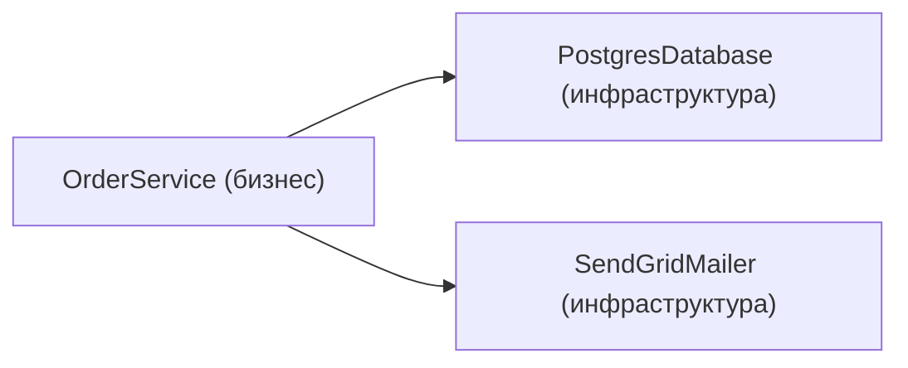
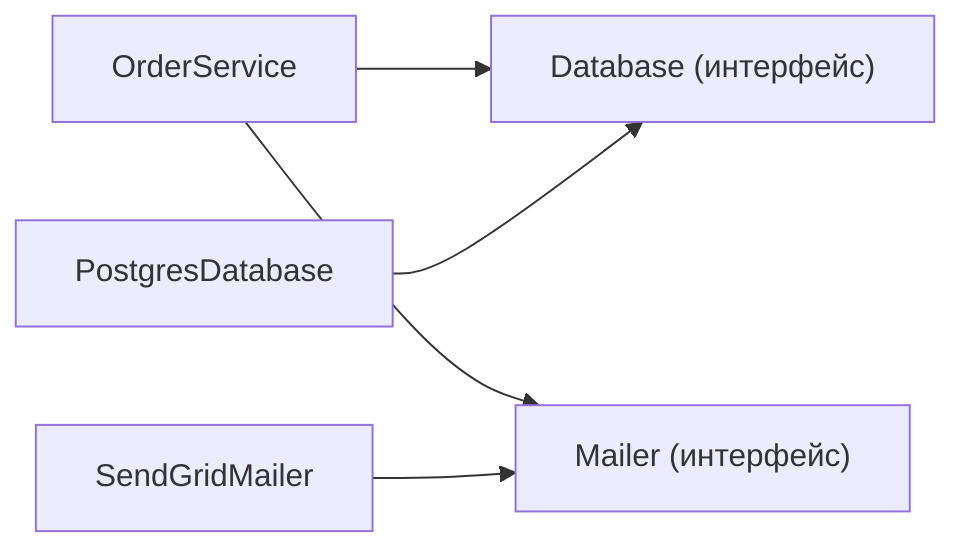
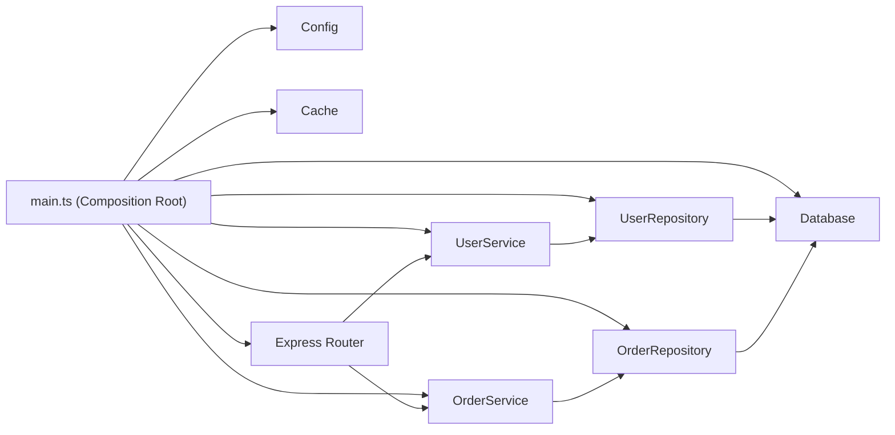

# Уровень 10: Инверсия управления и контракты — подробная теория

## Hollywood Principle: «Don't call us, we'll call you»

Название принципа пришло из мира кино: на прослушивании актёрам говорят «не звоните нам, мы позвоним вам». Агентство (фреймворк) само решает когда и как использовать ваш талант (ваш код).

В программировании этот принцип разграничивает **библиотеку** и **фреймворк**:

```
Библиотека: вы вызываете её функции — когда хотите, как хотите
Фреймворк: вы описываете поведение, фреймворк вызывает ваш код — когда решит нужным
```

Пример без IoC — вы управляете всем:

```typescript
// Ваш код вызывает axios когда считает нужным
import axios from 'axios'

async function main() {
  const response = await axios.get('/api/users')  // я решаю когда
  const processed = processUsers(response.data)    // я решаю порядок
  displayUsers(processed)                           // я решаю что дальше
}
```

Пример с IoC — фреймворк управляет потоком:

```typescript
// React вызывает ваш компонент когда считает нужным (при рендере, обновлении стейта)
function UserList() {
  const [users, setUsers] = useState<User[]>([])

  useEffect(() => {
    // React решает когда вызвать этот эффект
    // Вы только описываете что делать
    fetchUsers().then(setUsers)
  }, [])

  return <ul>{users.map(u => <li key={u.id}>{u.name}</li>)}</ul>
}
// Вы не вызываете UserList() — React вызывает его за вас
```

---

## Формы инверсии управления

### 1. Callback: передай функцию, я сам вызову

```typescript
// setTimeout — IoC через callback
// Вы не вызываете свой код напрямую, вы передаёте его браузеру
setTimeout(() => {
  console.log('я вызван браузером через 1 секунду')
}, 1000)

// Array.prototype.sort — IoC через callback компаратора
const users = [{ name: 'Борис' }, { name: 'Алиса' }, { name: 'Виктор' }]

users.sort((a, b) => {
  // Вы описываете логику сравнения
  // sort решает когда вызывать этот callback и сколько раз
  return a.name.localeCompare(b.name)
})
```

### 2. Event Emitter: подпишись, я позову когда нужно

```typescript
import { EventEmitter } from 'events'

const emitter = new EventEmitter()

// Вы не контролируете когда произойдёт событие
// Вы только описываете реакцию
emitter.on('order:created', (order: Order) => {
  sendConfirmationEmail(order)
  updateInventory(order)
  notifyWarehouse(order)
})

// Где-то в другом месте кода — эмит
emitter.emit('order:created', newOrder)
// Все подписчики вызваны автоматически
```

### 3. Middleware: цепочка обработчиков

Express middleware — классический пример IoC. Вы описываете шаги обработки, Express решает как их выполнить:

```typescript
import express from 'express'

const app = express()

// Каждый middleware — отдельная зона ответственности
// Express вызывает их по цепочке, вы только говорите 'next()'

// Аутентификация
app.use((req, res, next) => {
  const token = req.headers.authorization
  if (!token) {
    return res.status(401).json({ error: 'Unauthorized' })
  }
  req.user = verifyToken(token)
  next() // передаём управление следующему middleware
})

// Логирование
app.use((req, res, next) => {
  console.log(`${req.method} ${req.path}`)
  next()
})

// Обработчик маршрута
app.get('/orders', async (req, res) => {
  const orders = await getOrders(req.user.id)
  res.json(orders)
})

// Express сам выстраивает и вызывает цепочку
// Вы описываете логику каждого звена, не поток выполнения
```

### 4. React Hooks как IoC

React hooks — форма IoC, которую легко не заметить:

```typescript
function ProductPage({ id }: { id: string }) {
  // useEffect — IoC: React решает когда вызывать effect
  // После рендера, после изменения id, при размонтировании
  useEffect(() => {
    const controller = new AbortController()

    fetchProduct(id, { signal: controller.signal })
      .then(setProduct)
      .catch(console.error)

    return () => controller.abort() // cleanup — React вызывает перед следующим эффектом
  }, [id]) // React следит за зависимостями

  // useMemo — IoC: React решает когда пересчитывать
  const formattedPrice = useMemo(() => {
    return new Intl.NumberFormat('ru', { style: 'currency', currency: 'RUB' })
      .format(product?.price ?? 0)
  }, [product?.price])

  // ...
}
```

---

## Dependency Injection: архитектура тестируемого кода

### Проблема без DI

```typescript
// ❌ Жёсткая привязка к конкретным реализациям
class ReportService {
  private db = new PostgresDatabase({
    host: 'prod.db.company.com',
    port: 5432,
    // ... конфигурация hardcoded
  })
  private cache = new RedisCache({ host: 'prod.redis.company.com' })
  private emailer = new SendGridEmailer({ apiKey: process.env.SENDGRID_KEY! })

  async generateMonthlyReport(userId: string) {
    const data = await this.db.query(/* ... */)
    const cached = await this.cache.get(`report:${userId}`)
    // ...
  }
}

// Проблемы:
// 1. Невозможно протестировать без реального PostgreSQL, Redis, SendGrid
// 2. Невозможно использовать MySQL вместо PostgreSQL без переписывания класса
// 3. Невозможно переключить email-провайдер без изменения кода
// 4. Конфигурация разбросана по всему коду
```

### Constructor Injection — предпочтительный способ

```typescript
// ✅ Интерфейсы определяют контракт
interface Database {
  query<T>(sql: string, params?: unknown[]): Promise<T[]>
  transaction<T>(fn: (trx: Transaction) => Promise<T>): Promise<T>
}

interface Cache {
  get<T>(key: string): Promise<T | null>
  set<T>(key: string, value: T, ttlSeconds?: number): Promise<void>
  delete(key: string): Promise<void>
}

interface EmailService {
  send(options: EmailOptions): Promise<void>
}

// Класс зависит от интерфейсов, не от реализаций
class ReportService {
  constructor(
    private readonly db: Database,
    private readonly cache: Cache,
    private readonly emailer: EmailService,
  ) {}

  async generateMonthlyReport(userId: string): Promise<Report> {
    const cacheKey = `report:monthly:${userId}`

    const cached = await this.cache.get<Report>(cacheKey)
    if (cached) return cached

    const data = await this.db.query<ReportRow>(
      'SELECT * FROM orders WHERE user_id = $1',
      [userId],
    )

    const report = buildReport(data)
    await this.cache.set(cacheKey, report, 3600)
    await this.emailer.send({
      to: userId,
      subject: 'Ваш отчёт за месяц',
      body: formatReportEmail(report),
    })

    return report
  }
}
```

Теперь тест выглядит так:

```typescript
// Тест: никаких реальных баз данных
describe('ReportService', () => {
  it('возвращает кэшированный отчёт если он есть', async () => {
    const cachedReport = { total: 5000, orders: 3 }

    const db: Database = {
      query: jest.fn(),     // никогда не должен вызваться
      transaction: jest.fn(),
    }
    const cache: Cache = {
      get: jest.fn().mockResolvedValue(cachedReport), // возвращаем кэш
      set: jest.fn(),
      delete: jest.fn(),
    }
    const emailer: EmailService = {
      send: jest.fn(), // не должен отправить письмо
    }

    const service = new ReportService(db, cache, emailer)
    const result = await service.generateMonthlyReport('user-123')

    expect(result).toEqual(cachedReport)
    expect(db.query).not.toHaveBeenCalled()
    expect(emailer.send).not.toHaveBeenCalled()
  })
})
```

### Parameter Injection — для функций

Для функций (не классов) зависимости передаются как параметры:

```typescript
// ❌ Функция сама создаёт зависимость
async function processPayment(orderId: string) {
  const gateway = new StripeGateway() // жёсткая привязка
  return gateway.charge(orderId)
}

// ✅ Зависимость — параметр
interface PaymentGateway {
  charge(orderId: string): Promise<ChargeResult>
}

async function processPayment(
  orderId: string,
  gateway: PaymentGateway, // параметр
): Promise<ChargeResult> {
  return gateway.charge(orderId)
}

// Использование
await processPayment(orderId, new StripeGateway())

// Тест
await processPayment(orderId, { charge: jest.fn().mockResolvedValue({ success: true }) })
```

Ещё один паттерн — partial application для создания «настроенных» функций:

```typescript
// Фабрика функций с предустановленными зависимостями
function createPaymentProcessor(gateway: PaymentGateway) {
  return async function processPayment(orderId: string): Promise<ChargeResult> {
    return gateway.charge(orderId)
  }
}

// Создаём один раз
const processStripePayment = createPaymentProcessor(new StripeGateway())
const processTestPayment = createPaymentProcessor(new MockGateway())

// Используем везде — уже с нужной реализацией
await processStripePayment(orderId)
```

### Property Injection — наименее предпочтительный

```typescript
// Property injection: зависимости устанавливаются после создания объекта
class Logger {
  formatter?: LogFormatter // опциональное свойство — сеттер может не вызваться

  log(message: string) {
    const formatted = this.formatter
      ? this.formatter.format(message)
      : message
    console.log(formatted)
  }
}

const logger = new Logger()
logger.formatter = new JsonFormatter() // устанавливаем после создания
```

Проблема: объект может быть использован до установки зависимости. Предпочитайте constructor injection — зависимости гарантированно установлены в момент создания.

---

## DI Container: нужен ли он в TypeScript?

**DI Container** — специальный объект, который знает как создавать другие объекты и автоматически разрешает зависимости.

Популярные TypeScript-контейнеры: **tsyringe** (Microsoft), **inversify**, **typedi**.

```typescript
// С tsyringe
import 'reflect-metadata'
import { container, injectable, inject } from 'tsyringe'

@injectable()
class PostgresDatabase implements Database {
  query<T>(sql: string): Promise<T[]> { /* ... */ }
}

@injectable()
class ReportService {
  constructor(
    @inject('Database') private db: Database,
    @inject('Cache') private cache: Cache,
  ) {}
}

// Регистрация
container.register('Database', { useClass: PostgresDatabase })
container.register('Cache', { useClass: RedisCache })

// Разрешение — контейнер сам создаёт весь граф зависимостей
const service = container.resolve(ReportService)
```

**Когда нужен контейнер:**
- Крупное приложение с десятками сервисов
- Нужны scoped зависимости (одна инстанция на HTTP-запрос)
- Lazy initialization зависимостей

**Когда хватит ручного DI:**
- Небольшой сервис с 5-10 классами
- Нет сложных scoped требований
- Хотите избежать reflect-metadata и декораторов

```typescript
// Ручной DI — проще, прозрачнее, нет магии
// composition-root.ts
export function createApp() {
  // Всё явно, легко читается
  const db = new PostgresDatabase(config.database)
  const cache = new RedisCache(config.redis)
  const emailer = new SendGridEmailer(config.sendgrid)

  const userRepo = new UserRepository(db)
  const orderRepo = new OrderRepository(db)

  const reportService = new ReportService(db, cache, emailer)
  const orderService = new OrderService(orderRepo, emailer)
  const userService = new UserService(userRepo)

  return {
    reportService,
    orderService,
    userService,
  }
}
```

---

## Dependency Inversion Principle подробно

DIP — буква D в SOLID. Он часто путается с DI (Dependency Injection), но это разные вещи:

- **DI** — техника (как передавать зависимости)
- **DIP** — принцип (от чего зависеть)

Без DIP зависимость направлена от высокоуровневого кода к низкоуровневому:



С DIP оба уровня зависят от абстракции:



Реальный пример — Repository pattern:

```typescript
// Интерфейс в домене (высокий уровень)
// domain/repositories/UserRepository.ts
export interface UserRepository {
  findById(id: string): Promise<User | null>
  findByEmail(email: string): Promise<User | null>
  save(user: User): Promise<User>
  delete(id: string): Promise<void>
}

// Реализация в инфраструктуре (низкий уровень)
// infrastructure/postgres/PostgresUserRepository.ts
import { Pool } from 'pg'
import { UserRepository } from '../../domain/repositories/UserRepository'

export class PostgresUserRepository implements UserRepository {
  constructor(private pool: Pool) {}

  async findById(id: string): Promise<User | null> {
    const result = await this.pool.query(
      'SELECT * FROM users WHERE id = $1',
      [id],
    )
    return result.rows[0] ? mapRowToUser(result.rows[0]) : null
  }
  // ...
}

// Если нужно перейти на MongoDB — только новый класс, бизнес-логика не меняется
// infrastructure/mongo/MongoUserRepository.ts
export class MongoUserRepository implements UserRepository {
  // другая реализация того же интерфейса
}
```

---

## Контрактное программирование

### Design by Contract: история и идея

Идею предложил Бертран Мейер в языке Eiffel в конце 1980-х. Метафора — юридический контракт между поставщиком (функция) и клиентом (вызывающий код):

```
Клиент обязуется: соблюдать preconditions
Поставщик обязуется: выполнить postconditions
Оба договариваются: invariants всегда выполняются
```

```typescript
class BankAccount {
  private balance: number

  constructor(initialBalance: number) {
    // PRECONDITION конструктора
    if (initialBalance < 0) {
      throw new Error('Начальный баланс не может быть отрицательным')
    }
    this.balance = initialBalance
    this.checkInvariant() // INVARIANT проверяем после инициализации
  }

  // INVARIANT: баланс всегда >= 0
  private checkInvariant() {
    if (this.balance < 0) {
      throw new Error('Инвариант нарушен: баланс отрицательный')
    }
  }

  withdraw(amount: number): void {
    // PRECONDITION: сумма > 0 и не превышает баланс
    if (amount <= 0) throw new Error('Сумма снятия должна быть положительной')
    if (amount > this.balance) throw new Error('Недостаточно средств')

    const balanceBefore = this.balance
    this.balance -= amount

    // POSTCONDITION: баланс уменьшился ровно на amount
    if (this.balance !== balanceBefore - amount) {
      throw new Error('Постусловие нарушено: баланс изменился неверно')
    }

    this.checkInvariant() // INVARIANT после операции
  }

  deposit(amount: number): void {
    if (amount <= 0) throw new Error('Сумма пополнения должна быть положительной')

    this.balance += amount
    this.checkInvariant()
  }

  getBalance(): number {
    return this.balance
  }
}
```

### TypeScript assert functions

TypeScript 3.7 ввёл assertion functions — функции, которые сообщают компилятору о сужении типов:

```typescript
// Функция-assertion: после вызова TS знает что value не null
function assertDefined<T>(
  value: T | null | undefined,
  message: string,
): asserts value is T {
  if (value == null) {
    throw new Error(message)
  }
}

// Использование
function processUser(userId: string | null) {
  assertDefined(userId, 'userId обязателен')
  // Здесь TypeScript знает: userId это string (не null)
  console.log(userId.toUpperCase()) // TS не ругается
}

// Более полезный пример с бизнес-логикой
function assertPositive(
  value: number,
  fieldName: string,
): asserts value is number {
  if (value <= 0) {
    throw new Error(`${fieldName} должен быть положительным, получено: ${value}`)
  }
}

function calculateTax(price: number, rate: number): number {
  assertPositive(price, 'price')
  assertPositive(rate, 'rate')
  if (rate > 100) throw new Error('Налоговая ставка не может превышать 100%')

  return price * (rate / 100)
}
```

### Branded Types: контракты в системе типов

Branded types — способ создать «помеченные» примитивы, которые несовместимы друг с другом:

```typescript
// Без branded types: все строки одинаковы
function findUser(id: string) { /* ... */ }
function findProduct(id: string) { /* ... */ }

const userId = '550e8400-e29b-41d4-a716-446655440000'
const productId = 'prod-123'

findUser(productId)  // TypeScript не ругается! Логическая ошибка не поймана
findProduct(userId)  // Аналогично

// ✅ С branded types: разные "виды" строк несовместимы
type UserId = string & { readonly __brand: 'UserId' }
type ProductId = string & { readonly __brand: 'ProductId' }

function createUserId(id: string): UserId {
  if (!isValidUUID(id)) throw new Error('Некорректный формат UUID для userId')
  return id as UserId
}

function createProductId(id: string): ProductId {
  return id as ProductId
}

function findUser(id: UserId): Promise<User> { /* ... */ }
function findProduct(id: ProductId): Promise<Product> { /* ... */ }

const userId = createUserId('550e8400-e29b-41d4-a716-446655440000')
const productId = createProductId('prod-123')

findUser(productId)   // TS Error: ProductId не совместим с UserId
findProduct(userId)   // TS Error: UserId не совместим с ProductId
```

### Zod как runtime-контракт

TypeScript типы исчезают при компиляции — они не защищают от некорректных данных из API. Zod решает это:

```typescript
import { z } from 'zod'

// Схема — это и runtime-валидатор, и источник TypeScript типов
const CreateOrderSchema = z.object({
  userId: z.string().uuid('Некорректный UUID пользователя'),
  items: z.array(
    z.object({
      productId: z.string().min(1, 'ID продукта не может быть пустым'),
      quantity: z.number()
        .int('Количество должно быть целым числом')
        .min(1, 'Количество должно быть не менее 1')
        .max(100, 'Нельзя заказать более 100 единиц'),
      price: z.number().positive('Цена должна быть положительной'),
    })
  ).min(1, 'Заказ должен содержать хотя бы один товар'),
  deliveryAddress: z.object({
    city: z.string().min(1),
    street: z.string().min(1),
    apartment: z.string().optional(),
  }),
  couponCode: z.string().optional(),
})

// TypeScript тип выводится автоматически
type CreateOrderDTO = z.infer<typeof CreateOrderSchema>

// Валидация на входе в систему
async function createOrder(rawBody: unknown) {
  // parse бросает ZodError с детальным описанием при нарушении контракта
  const dto = CreateOrderSchema.parse(rawBody)
  // Дальше dto типизирован как CreateOrderDTO — TypeScript знает структуру
  return orderService.create(dto)
}

// Мягкая валидация: safeParse не бросает исключение
function validateOrder(rawBody: unknown) {
  const result = CreateOrderSchema.safeParse(rawBody)

  if (!result.success) {
    const errors = result.error.issues.map(issue => ({
      field: issue.path.join('.'),
      message: issue.message,
    }))
    return { ok: false, errors } as const
  }

  return { ok: true, data: result.data } as const
}
```

---

## Composition Root: точка сборки

Composition Root — антипод DI-антипаттерна Service Locator. Вместо того чтобы запрашивать зависимости по всему коду, вы собираете всё в одном месте:



```typescript
// src/main.ts — Composition Root
import { createPool } from 'pg'
import { createClient } from 'redis'
import express from 'express'
import { Config } from './config'
import { PostgresUserRepository } from './infrastructure/postgres/PostgresUserRepository'
import { PostgresOrderRepository } from './infrastructure/postgres/PostgresOrderRepository'
import { RedisCache } from './infrastructure/redis/RedisCache'
import { UserService } from './domain/UserService'
import { OrderService } from './domain/OrderService'
import { createUserRouter } from './api/userRouter'
import { createOrderRouter } from './api/orderRouter'

async function main() {
  const config = Config.fromEnv() // читаем конфигурацию

  // Инфраструктура
  const pgPool = createPool(config.database)
  const redisClient = createClient(config.redis)
  await redisClient.connect()

  const cache = new RedisCache(redisClient)

  // Репозитории
  const userRepo = new PostgresUserRepository(pgPool)
  const orderRepo = new PostgresOrderRepository(pgPool)

  // Сервисы
  const userService = new UserService(userRepo, cache)
  const orderService = new OrderService(orderRepo, userService)

  // HTTP-слой
  const app = express()
  app.use('/users', createUserRouter(userService))
  app.use('/orders', createOrderRouter(orderService))

  app.listen(config.port, () => {
    console.log(`Server running on port ${config.port}`)
  })
}

main().catch(console.error)
```

Правило: **только Composition Root знает про конкретные реализации**. Все остальные модули работают с интерфейсами.

---

## Частые ошибки начинающих

### Service Locator вместо DI

```typescript
// ❌ Service Locator: зависимости запрашиваются изнутри класса
class OrderService {
  async createOrder(dto: OrderDTO) {
    const db = ServiceLocator.get<Database>('database') // скрытая зависимость!
    const mailer = ServiceLocator.get<Mailer>('mailer') // и ещё одна

    // Проблемы:
    // 1. Зависимости скрыты — не видны из сигнатуры класса
    // 2. Тесты сложны: нужно настраивать ServiceLocator
    // 3. Невозможно использовать класс без ServiceLocator
  }
}
```

```typescript
// ✅ Настоящий DI: зависимости явны и видны из конструктора
class OrderService {
  constructor(
    private readonly db: Database,
    private readonly mailer: Mailer,
  ) {}
  // Всё понятно из сигнатуры: сервис требует Database и Mailer
}
```

### Конкретные типы вместо интерфейсов

```typescript
// ❌ Зависимость от конкретного класса
class NotificationService {
  constructor(private mailer: SendGridMailer) {} // привязка к SendGrid навсегда
}

// ✅ Зависимость от интерфейса
interface Mailer {
  send(to: string, body: string): Promise<void>
}

class NotificationService {
  constructor(private mailer: Mailer) {} // можно подменить что угодно
}
```

### Нет preconditions на публичных методах

```typescript
// ❌ Нет проверок — непредсказуемое поведение при некорректном вводе
function splitIntoChunks(arr: unknown[], size: number): unknown[][] {
  const chunks = []
  for (let i = 0; i < arr.length; i += size) {
    chunks.push(arr.slice(i, i + size))
  }
  return chunks
}

splitIntoChunks([1, 2, 3], 0)  // бесконечный цикл!
splitIntoChunks([1, 2, 3], -1) // бессмысленный результат

// ✅ Явные preconditions
function splitIntoChunks<T>(arr: T[], size: number): T[][] {
  if (size <= 0) throw new Error('Размер чанка должен быть положительным')
  if (!Number.isInteger(size)) throw new Error('Размер чанка должен быть целым числом')

  const chunks: T[][] = []
  for (let i = 0; i < arr.length; i += size) {
    chunks.push(arr.slice(i, i + size))
  }
  return chunks
}
```

### DI без интерфейсов — половинчатое решение

```typescript
// ❌ DI есть, но всё равно привязка к конкретному классу
class ReportService {
  constructor(private db: PostgresDatabase) {} // DI без абстракции
}
// Зависимость передаётся снаружи, но всё равно нельзя подменить на Mock

// ✅ DI + интерфейс = полное решение
interface Database {
  query<T>(sql: string): Promise<T[]>
}

class ReportService {
  constructor(private db: Database) {} // настоящая абстракция
}
```
