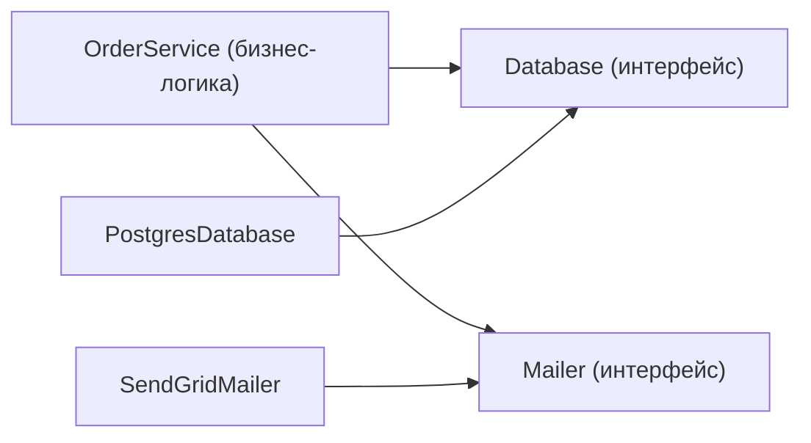

# Уровень 10: Инверсия управления и контракты

## «Не звоните нам — мы позвоним вам»

Представьте, что вы устраиваетесь на работу. Есть два варианта:

**Библиотека** — вы нанимаете фрилансера. Вы сами звоните ему когда нужно, говорите что сделать, он делает и возвращает результат.

**Фреймворк** — вы нанимаетесь в компанию. Компания сама говорит вам когда приходить, что делать и в каком порядке. Вы следуете её регламенту.

Это и есть разница между обычным кодом и инверсией управления: **кто кого вызывает**.

---

## Inversion of Control (IoC)

IoC — принцип, при котором управление потоком программы передаётся контейнеру или фреймворку, а не самому коду.

```typescript
// Без IoC: вы управляете потоком
function processRequest() {
  const data = fetchData()      // я сам решаю когда получить данные
  const result = transform(data) // я сам решаю когда трансформировать
  saveResult(result)             // я сам решаю когда сохранить
}

// С IoC: фреймворк управляет потоком
app.get('/items', async (req, res) => {
  // Express решает когда вызвать этот обработчик
  // Я только описываю логику, Express — вызывает
  const items = await getItems()
  res.json(items)
})
```

IoC встречается в трёх формах:
- **Callback / Event Emitter** — «позвони когда случится событие»
- **Middleware** — «обработай запрос и передай дальше»
- **Dependency Injection** — «вот твои зависимости, работай»

---

## Dependency Injection (DI)

DI — самая распространённая форма IoC. Вместо того чтобы компонент сам создавал зависимости, они передаются ему снаружи.

```typescript
// ❌ Без DI: класс создаёт зависимость сам
class OrderService {
  private db = new PostgresDatabase() // жёсткая привязка к Postgres
  private mailer = new SendGridMailer() // жёсткая привязка к SendGrid

  async createOrder(dto: OrderDTO) {
    const order = await this.db.save(dto)
    await this.mailer.send(order.userEmail, 'Заказ создан')
    return order
  }
}
// Невозможно протестировать без реального Postgres и SendGrid
```

```typescript
// ✅ С DI: зависимости приходят снаружи
interface Database {
  save(data: unknown): Promise<unknown>
}

interface Mailer {
  send(to: string, subject: string): Promise<void>
}

class OrderService {
  constructor(
    private db: Database,    // интерфейс, не конкретный класс
    private mailer: Mailer   // интерфейс, не конкретный класс
  ) {}

  async createOrder(dto: OrderDTO) {
    const order = await this.db.save(dto)
    await this.mailer.send(dto.userEmail, 'Заказ создан')
    return order
  }
}

// В production
const service = new OrderService(new PostgresDatabase(), new SendGridMailer())

// В тестах — подменяем реализации
const service = new OrderService(new InMemoryDatabase(), new MockMailer())
```

---

## Dependency Inversion Principle (DIP)

DIP — пятый принцип SOLID. Звучит странно, но смысл прост:

- **Модули верхнего уровня** (бизнес-логика) не зависят от модулей нижнего уровня (БД, HTTP)
- **Оба** зависят от абстракций (интерфейсов)



Без DIP зависимость идёт сверху вниз: `OrderService → PostgresDatabase`. С DIP — оба смотрят на интерфейс.

---

## Контрактное программирование

**Design by Contract** — идея Бертрана Мейера: каждая функция имеет явный контракт.

- **Precondition (предусловие)**: что обязан обеспечить вызывающий
- **Postcondition (постусловие)**: что гарантирует функция после выполнения
- **Invariant**: что всегда истинно для объекта

```typescript
/**
 * Вычисляет процент скидки
 * @param price — цена товара (PRECONDITION: > 0)
 * @param discount — процент скидки (PRECONDITION: от 0 до 100)
 * @returns цена после скидки (POSTCONDITION: >= 0)
 */
function applyDiscount(price: number, discount: number): number {
  // Явные preconditions
  if (price <= 0) throw new Error('Цена должна быть больше нуля')
  if (discount < 0 || discount > 100) throw new Error('Скидка должна быть от 0 до 100')

  return price * (1 - discount / 100)
  // Postcondition выполняется автоматически при корректных входных данных
}
```

В TypeScript контракты реализуются через типы (compile-time) и Zod/assert-функции (runtime):

```typescript
import { z } from 'zod'

// Контракт описан схемой — декларативно и проверяется в runtime
const OrderSchema = z.object({
  userId: z.string().uuid(),
  items: z.array(z.object({
    productId: z.string(),
    quantity: z.number().int().min(1),
    price: z.number().positive(),
  })).min(1),
})

type Order = z.infer<typeof OrderSchema> // типы из схемы бесплатно

function createOrder(raw: unknown): Order {
  return OrderSchema.parse(raw) // бросает ZodError если контракт нарушен
}
```

---

## Composition Root

Все зависимости должны собираться в одном месте — **Composition Root**. Это точка входа приложения, где происходит «сборка» всего дерева зависимостей.

```typescript
// composition-root.ts — единственное место где знают про конкретные реализации
export function buildApp() {
  const db = new PostgresDatabase(process.env.DATABASE_URL!)
  const mailer = new SendGridMailer(process.env.SENDGRID_KEY!)
  const orderRepo = new OrderRepository(db)
  const orderService = new OrderService(orderRepo, mailer)
  const orderController = new OrderController(orderService)

  return { orderController }
}
```

---

## Итог

- **IoC**: фреймворк управляет потоком, не ваш код
- **DI**: зависимости передаются снаружи через конструктор или параметры
- **DIP**: зависьте от интерфейсов, а не от конкретных классов
- **Контракт**: preconditions, postconditions, invariants — явные договорённости
- **Composition Root**: одно место сборки всех зависимостей
- **Zod**: runtime-контракт, TypeScript типы — compile-time контракт
