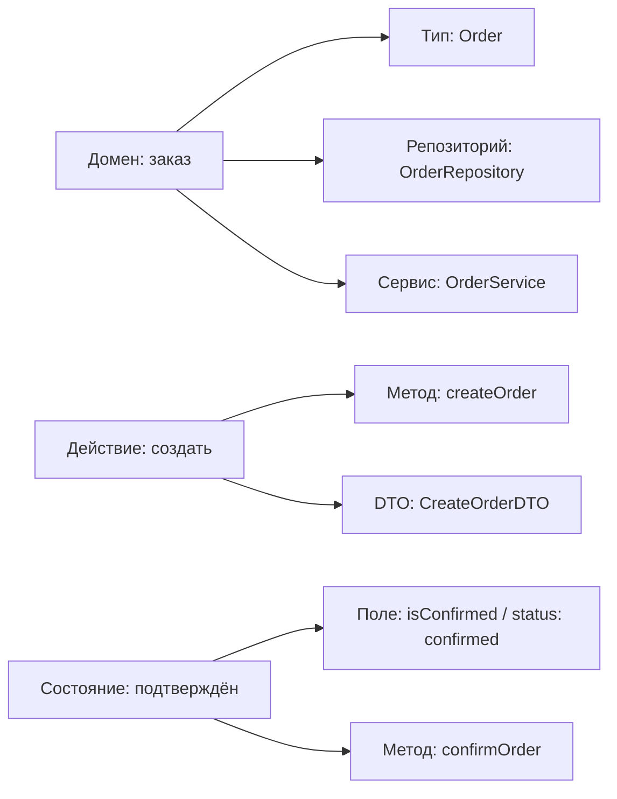

# Уровень 11: Именование и стиль кода — подробная теория

## Код пишется для людей

Есть известная фраза: «Programs are meant to be read by humans and only incidentally for computers to execute» (Дональд Кнут). Компилятор одинаково выполнит и `x`, и `userEmail` — ему всё равно. Разница полностью в пользу читающего человека.

Представьте, что вы возвращаетесь к своему коду через полгода. Или ваш коллега открывает ваш файл впервые. Имена — это первое, что они читают. Хорошие имена отвечают на вопрос «что это?» раньше, чем читатель успел задуматься.

### Cognitive load: рабочая память ограничена

Рабочая память человека удерживает примерно 7±2 элемента одновременно (закон Миллера, 1956). Каждое непонятное имя занимает один слот — вы вынуждены держать в уме «`d` — это, кажется, дата создания» пока читаете следующие строки.

```typescript
// Этот код перегружает рабочую память
function calc(d: Date[], f: number, t: number): number {
  const r = d.filter(x => x.getTime() >= f && x.getTime() <= t)
  return r.reduce((a, c) => a + getDaysDiff(c, new Date()), 0) / r.length
}

// Расшифровка: calc → calculateAverageAge?, d → dates?, f → from?, t → to?
// Читатель тратит энергию на расшифровку, а не на понимание логики
```

```typescript
// Тот же код — рабочая память читателя свободна
function calculateAverageEventAge(
  eventDates: Date[],
  periodStart: number,
  periodEnd: number,
): number {
  const eventsInPeriod = eventDates.filter(
    date => date.getTime() >= periodStart && date.getTime() <= periodEnd,
  )

  const totalAge = eventsInPeriod.reduce(
    (sum, date) => sum + getDaysDiff(date, new Date()),
    0,
  )

  return totalAge / eventsInPeriod.length
}
// Читается как описание алгоритма, не нужно расшифровывать
```

---

## Именование переменных: что хранится, а не какого типа

Главное правило: имя должно отвечать на «что это за данные?», а не «какого типа эта переменная».

### Отражайте семантику, а не тип

```typescript
// ❌ Тип в имени — бесполезная информация при наличии TypeScript
const strName = 'Alice'
const numAge = 25
const arrUsers: User[] = []
const objConfig: Config = { ... }
const boolIsLoading = true

// ✅ Смысл в имени — TypeScript сам знает про типы
const userName = 'Alice'
const userAge = 25
const activeUsers: User[] = []
const appConfig: Config = { ... }
const isLoading = true
```

### Конкретность лучше обобщённости

```typescript
// ❌ Слишком общие — ничего не говорят о содержимом
const data = fetchUsers()
const info = calculateStats()
const result = processOrder()
const value = getPrice()
const item = findById(id)
const temp = transform(input)

// ✅ Конкретные — объясняют содержимое
const users = fetchUsers()
const salesStats = calculateStats()
const processedOrder = processOrder()
const discountedPrice = getPrice()
const foundProduct = findById(id)
const normalizedInput = transform(input)
```

### Избегайте сокращений (кроме общепринятых)

```typescript
// ❌ Сокращения — экономия символов за счёт понимания
const usrMgr = new UserManager()
const cfg = loadConfig()
const addr = user.address
const dept = employee.department
const qty = order.quantity
const calc = new TaxCalculator()

// ✅ Полные имена — читаются без расшифровки
const userManager = new UserManager()
const config = loadConfig()
const userAddress = user.address
const department = employee.department
const quantity = order.quantity
const taxCalculator = new TaxCalculator()

// ✅ Общепринятые сокращения — всем понятны, можно использовать
const userId = params.id          // id — OK
const apiUrl = config.api.url     // url, api — OK
const httpClient = new HttpClient() // http — OK
const i18n = new Internationalization() // i18n — устоявшееся
const e2eTests = loadTests()      // e2e — распространено в тестировании
```

---

## Именование функций: глаголы с точным смыслом

Функция — это действие. Имя должно описывать, что именно она делает.

### Выбор точного глагола

Разные глаголы несут разные ожидания о поведении:

```typescript
// get vs fetch vs load vs read

function getUser(id: string): User | null {
  // "get" — синхронное получение из памяти/кэша, ожидается быстро
  return userCache.get(id) ?? null
}

async function fetchUser(id: string): Promise<User> {
  // "fetch" — ожидается сетевой запрос, асинхронно
  return apiClient.get(`/users/${id}`)
}

async function loadUserProfile(id: string): Promise<UserProfile> {
  // "load" — тяжёлая операция: загружает данные с трансформацией
  const [user, orders, preferences] = await Promise.all([
    fetchUser(id),
    fetchUserOrders(id),
    fetchUserPreferences(id),
  ])
  return buildProfile(user, orders, preferences)
}

function readConfig(path: string): Config {
  // "read" — чтение из файловой системы
  return parseJSON(fs.readFileSync(path, 'utf8'))
}
```

```typescript
// create vs build vs make vs generate

function createUser(dto: CreateUserDTO): User {
  // "create" — создание с сохранением в хранилище
  const user = { id: uuid(), ...dto, createdAt: new Date() }
  return userRepo.save(user)
}

function buildUserDTO(user: User, role: UserRole): UserDTO {
  // "build" — конструирование объекта без побочных эффектов
  return { id: user.id, name: user.name, role, permissions: getPermissions(role) }
}

function generateToken(userId: string): string {
  // "generate" — создание уникального значения (токен, UUID, ID)
  return jwt.sign({ sub: userId }, SECRET, { expiresIn: '24h' })
}
```

### Предикатные функции: начинать с is/has/can/should

```typescript
// ❌ Неясно что возвращает функция
function userAdmin(user: User): boolean { return user.role === 'admin' }
function emailVerification(email: string): boolean { return /^[^\s@]+@[^\s@]+\.[^\s@]+$/.test(email) }
function cartEmpty(cart: Cart): boolean { return cart.items.length === 0 }

// ✅ Формат вопроса — читается как утверждение
function isAdmin(user: User): boolean { return user.role === 'admin' }
function isValidEmail(email: string): boolean { return /^[^\s@]+@[^\s@]+\.[^\s@]+$/.test(email) }
function isCartEmpty(cart: Cart): boolean { return cart.items.length === 0 }
function hasPermission(user: User, permission: Permission): boolean { ... }
function canDeletePost(user: User, post: Post): boolean { ... }
function shouldRefetchData(lastFetchAt: number): boolean { ... }
```

---

## Конвенции: camelCase, PascalCase, SCREAMING_SNAKE

### camelCase — переменные, функции, методы

```typescript
// Переменные
const userEmail = 'john@example.com'
const totalOrderCount = 42
const isAuthenticated = true

// Функции и методы
function calculateTotalPrice(items: CartItem[]): number { ... }
async function fetchUserProfile(userId: string): Promise<UserProfile> { ... }

class OrderService {
  async createOrder(dto: CreateOrderDTO): Promise<Order> { ... }
  private calculateShipping(address: Address): number { ... }
}
```

### PascalCase — классы, типы, интерфейсы, React-компоненты

```typescript
// Классы
class UserRepository { ... }
class EmailNotificationService { ... }

// TypeScript types и interfaces
type OrderStatus = 'pending' | 'confirmed' | 'shipped' | 'delivered'

interface PaymentGateway {
  charge(amount: number, currency: string): Promise<ChargeResult>
}

type CreateUserDTO = {
  email: string
  name: string
  role: UserRole
}

// Enum (значения тоже PascalCase)
enum HttpStatus {
  Ok = 200,
  NotFound = 404,
  InternalServerError = 500,
}

// React-компоненты
function UserCard({ user }: { user: User }) { ... }
const OrderList: React.FC<OrderListProps> = ({ orders }) => { ... }
```

### SCREAMING_SNAKE_CASE — настоящие константы и env variables

Ключевое слово «настоящие»: значение не изменится никогда в течение всей жизни приложения.

```typescript
// Математические и физические константы
const PI = 3.14159265358979
const MAX_SAFE_INTEGER = Number.MAX_SAFE_INTEGER

// Конфигурационные лимиты
const MAX_RETRY_ATTEMPTS = 3
const SESSION_TIMEOUT_SECONDS = 3600
const MAX_FILE_SIZE_BYTES = 10 * 1024 * 1024 // 10MB

// Строковые ключи (статические идентификаторы)
const STORAGE_KEY_AUTH_TOKEN = 'auth_token'
const CACHE_KEY_USER_PREFIX = 'user:'

// Environment variables — читаем один раз при старте
const DATABASE_URL = process.env.DATABASE_URL!
const API_KEY = process.env.API_KEY!

// ❌ Не нужен SCREAMING_SNAKE для обычных переменных с const
const config = loadConfig()           // объект который может меняться
const users = await fetchUsers()       // данные из запроса
const currentUser = useCurrentUser()   // реактивное значение
```

### kebab-case — файлы, URL, CSS

```typescript
// Имена файлов (кроме React-компонентов)
// user-service.ts
// order-repository.ts
// auth-middleware.ts
// use-debounce.ts  (хуки тоже kebab)

// Имена файлов React-компонентов — PascalCase как компонент
// UserCard.tsx
// OrderList.tsx
// NavigationMenu.tsx
```

```css
/* CSS классы */
.user-card { }
.navigation-menu { }
.primary-button { }
.form-input-error { }
```

### Приватные поля: # vs _

```typescript
// ES2022 Private Fields — настоящая приватность
class BankAccount {
  #balance: number  // реально недоступно снаружи — это жёсткое ограничение языка

  constructor(initial: number) {
    this.#balance = initial
  }

  deposit(amount: number) {
    this.#balance += amount
  }
}

const account = new BankAccount(1000)
account.#balance  // SyntaxError: невозможно обратиться снаружи

// Конвенция _ — только договорённость, не гарантия
class OldStyle {
  _balance: number = 1000  // TypeScript может предупредить, но доступ возможен

  _privateMethod() { }  // "приватный" по договорённости, не по факту
}

// Рекомендация: используйте # для настоящей инкапсуляции в новом коде
// _ оставьте для совместимости со старым кодом
```

---

## Самодокументирующийся код: код как документация

### Magic numbers: каждое число должно иметь имя

Magic number — числовой литерал без объяснения. Читатель вынужден догадываться о смысле:

```typescript
// ❌ Magic numbers: что такое 7, 3600, 0.08, 5?
function processSubscription(user: User) {
  if (user.trialDaysLeft <= 7) {
    sendReminderEmail(user)
  }

  const sessionTtl = 3600
  const taxRate = 0.08

  if (user.orders.length >= 5) {
    applyLoyaltyDiscount(user)
  }
}
```

```typescript
// ✅ Именованные константы: числа объяснены
const TRIAL_EXPIRY_WARNING_DAYS = 7
const SESSION_TTL_SECONDS = 3600
const TAX_RATE = 0.08
const LOYALTY_PROGRAM_MIN_ORDERS = 5

function processSubscription(user: User) {
  if (user.trialDaysLeft <= TRIAL_EXPIRY_WARNING_DAYS) {
    sendReminderEmail(user)
  }

  const sessionTtl = SESSION_TTL_SECONDS
  const taxRate = TAX_RATE

  if (user.orders.length >= LOYALTY_PROGRAM_MIN_ORDERS) {
    applyLoyaltyDiscount(user)
  }
}
```

### Выносить сложные условия в переменные

```typescript
// ❌ Условие требует остановки и разбора
function canPublishPost(user: User, post: Post, settings: SiteSettings): boolean {
  return (
    (user.role === 'admin' || user.role === 'editor') &&
    post.status === 'draft' &&
    post.wordCount >= 100 &&
    !user.isBanned &&
    (settings.allowGuestPosts || user.isRegistered)
  )
}
```

```typescript
// ✅ Условие читается как требования
function canPublishPost(user: User, post: Post, settings: SiteSettings): boolean {
  const hasPublishRole = user.role === 'admin' || user.role === 'editor'
  const isPostReady = post.status === 'draft' && post.wordCount >= 100
  const isUserEligible = !user.isBanned && (settings.allowGuestPosts || user.isRegistered)

  return hasPublishRole && isPostReady && isUserEligible
}
```

### Маленькие функции с говорящими именами

Каждая функция должна делать одну вещь и делать её хорошо. Если тело функции не читается как абзац — разбейте её:

```typescript
// ❌ Функция делает слишком много: загрузка, трансформация, сохранение, уведомление
async function handleOrderCompletion(orderId: string) {
  const order = await db.query(`SELECT * FROM orders WHERE id = $1`, [orderId])

  order.status = 'completed'
  order.completedAt = new Date()

  const invoice = {
    id: uuid(),
    orderId: order.id,
    amount: order.items.reduce((sum, i) => sum + i.price * i.qty, 0),
    tax: order.items.reduce((sum, i) => sum + i.price * i.qty, 0) * 0.2,
  }

  await db.query(`UPDATE orders SET status = $1, completed_at = $2 WHERE id = $3`,
    [order.status, order.completedAt, orderId])
  await db.query(`INSERT INTO invoices ...`, [invoice])

  await emailer.send(order.userEmail, 'Заказ выполнен', formatEmail(order))
}
```

```typescript
// ✅ Декомпозиция — каждая функция с понятным именем
async function handleOrderCompletion(orderId: string) {
  const order = await fetchOrder(orderId)
  const completedOrder = markOrderAsCompleted(order)
  const invoice = generateInvoice(completedOrder)

  await saveCompletedOrder(completedOrder)
  await saveInvoice(invoice)
  await sendOrderCompletionNotification(completedOrder)
}

function markOrderAsCompleted(order: Order): Order {
  return { ...order, status: 'completed', completedAt: new Date() }
}

function generateInvoice(order: Order): Invoice {
  const subtotal = calculateSubtotal(order.items)
  return {
    id: uuid(),
    orderId: order.id,
    subtotal,
    tax: calculateTax(subtotal),
  }
}

function calculateSubtotal(items: OrderItem[]): number {
  return items.reduce((sum, item) => sum + item.price * item.quantity, 0)
}
```

---

## Анти-паттерны именования

### Бессмысленные суффиксы

```typescript
// ❌ Суффиксы не добавляют информации
class UserManager { }     // Manager: что менеджит? как?
class DataHandler { }     // Handler: что обрабатывает?
class OrderProcessor { }  // Processor: как процессит?
class AuthHelper { }      // Helper: чем помогает?
class Utils { }           // Utils: сборная солянка
class Helpers { }         // Helpers: аналогично

// ✅ Конкретные имена по ответственности
class UserRepository { }      // хранит и извлекает пользователей
class OrderEventDispatcher { } // диспатчит события заказа
class InvoiceGenerator { }    // генерирует счета
class TokenValidator { }      // валидирует токены
```

### Имена типов в именах переменных

```typescript
// ❌ Венгерская нотация — устарела для TypeScript
const strUserName = 'Alice'
const nRetryCount = 3
const bIsAdmin = true
const arrUserList: User[] = []
const fnCallback = () => {}

// Была полезна в языках без статической типизации (JavaScript, старый C)
// В TypeScript IDE подсвечивает типы, венгерская нотация — шум

// ✅ Чистые имена
const userName = 'Alice'
const retryCount = 3
const isAdmin = true
const users: User[] = []
const onSuccess = () => {}
```

### Слишком общие имена

```typescript
// ❌ О чём этот код? Что такое data, info, result?
const data = await getData()
const info = buildInfo(data)
const result = processResult(info)
return result

// ✅ Каждая переменная объясняет содержимое
const rawUserEvents = await fetchUserEvents(userId)
const aggregatedStats = aggregateEventStats(rawUserEvents)
const formattedReport = formatStatsReport(aggregatedStats)
return formattedReport
```

---

## Комментарии: когда и как

### Комментарии которые вредят

```typescript
// ❌ Комментарий дублирует код — если код изменится, комментарий устареет
// Получаем пользователя по id
const user = await getUserById(id)

// ❌ Отключённый код без объяснения — зачем он здесь?
// const legacyUser = await getFromOldDB(id)

// ❌ Очевидный комментарий
i++ // увеличиваем i на 1

// ❌ TODO без контекста и ответственного
// TODO: исправить
```

### Комментарии которые помогают

```typescript
// ✅ Объясняет почему, а не что
// Намеренно не используем кэш: цены могут меняться между запросами
// и несинхронизированный кэш приводил к переплатам (JIRA-1234)
const price = await fetchFreshPrice(productId)

// ✅ Предупреждает о неочевидном поведении
// Warning: порядок вызовов важен — initCache() должен быть вызван
// до initDatabase(), иначе database использует пустой кэш конфигурации
await initCache()
await initDatabase()

// ✅ Объясняет сложный алгоритм (кратко, со ссылкой)
// Алгоритм Луна для валидации номера карты.
// https://en.wikipedia.org/wiki/Luhn_algorithm
function isValidCardNumber(number: string): boolean {
  // ...реализация...
}

// ✅ JSDoc для публичного API библиотеки
/**
 * Вычисляет сложные проценты.
 * @param principal - начальная сумма
 * @param rate - годовая процентная ставка (0.05 = 5%)
 * @param years - срок в годах
 * @param compoundsPerYear - количество начислений в год (12 = ежемесячно)
 * @returns итоговая сумма с учётом сложных процентов
 */
export function compoundInterest(
  principal: number,
  rate: number,
  years: number,
  compoundsPerYear = 12,
): number {
  return principal * Math.pow(1 + rate / compoundsPerYear, compoundsPerYear * years)
}
```

---

## Инструменты: Prettier, ESLint, EditorConfig

### Prettier: нет споров о форматировании

Prettier — опinionated форматировщик. Он убирает все споры о стилях:

```json
// .prettierrc
{
  "semi": false,
  "singleQuote": true,
  "tabWidth": 2,
  "trailingComma": "all",
  "printWidth": 100,
  "arrowParens": "avoid"
}
```

До Prettier: «Ваши скобки должны быть на новой строке» / «Нет, на той же!»
После Prettier: форматирование одинаковое у всех, PR-ревью не содержит комментариев про пробелы.

### ESLint: ловит логические ошибки и стилевые проблемы

```javascript
// eslint.config.js
import js from '@eslint/js'
import tsPlugin from '@typescript-eslint/eslint-plugin'

export default [
  js.configs.recommended,
  {
    rules: {
      // Предотвращает использование 'any'
      '@typescript-eslint/no-explicit-any': 'error',

      // Требует явного возвращаемого типа у функций
      '@typescript-eslint/explicit-function-return-type': 'warn',

      // Запрещает неиспользуемые переменные
      '@typescript-eslint/no-unused-vars': 'error',

      // Предупреждает о console.log в production-коде
      'no-console': 'warn',

      // Требует === вместо ==
      'eqeqeq': 'error',
    },
  },
]
```

### EditorConfig: кросс-IDE консистентность

```ini
# .editorconfig — работает в VSCode, WebStorm, Vim, Emacs
root = true

[*]
indent_style = space
indent_size = 2
end_of_line = lf
charset = utf-8
trim_trailing_whitespace = true
insert_final_newline = true

[*.md]
trim_trailing_whitespace = false
```

---

## Пример: от доменного понятия к коду

Как связываются именование домена и именование кода:



Единый язык домена в коде — это не просто красота. Когда разработчик и бизнес-аналитик говорят «заказ» — в коде это `Order`, не `Purchase`, не `Transaction`, не `Deal`. Консистентность снижает количество вопросов «а что такое `Deal` в этом контексте?»

---

## Частые ошибки начинающих

### Отражать реализацию вместо намерения

```typescript
// ❌ Имя раскрывает как, а не что
const filteredByStatusArray = orders.filter(o => o.status === 'active')
const loopResultAccumulator = 0

// ✅ Имя раскрывает что
const activeOrders = orders.filter(o => o.status === 'active')
const totalRevenue = 0
```

### Использовать числительные для различения переменных

```typescript
// ❌ user1 и user2 — что отличает их?
const user1 = await fetchCurrentUser()
const user2 = await fetchTargetUser(targetId)

// ✅ Осмысленные имена
const currentUser = await fetchCurrentUser()
const targetUser = await fetchTargetUser(targetId)
```

### Слишком длинные имена без пользы

```typescript
// ❌ Длина ради длины — читается медленнее, не несёт больше смысла
const theCurrentlyAuthenticatedUserObjectFromDatabase = await getCurrentUser()
const listOfAllActiveOrdersFromTheDatabase = await getActiveOrders()

// ✅ Достаточно конкретно для контекста
const currentUser = await getCurrentUser()
const activeOrders = await getActiveOrders()
```

### Нарушение конвенций в команде

```typescript
// ❌ В одном проекте: UserService, user_controller, userrepository
// Каждый разработчик следует своей конвенции

// ✅ Единый стиль закреплён в .eslintrc, обсуждён в команде
// UserService, UserController, UserRepository — PascalCase везде
// ESLint проверяет автоматически при коммите
```
