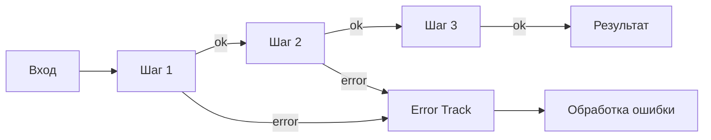
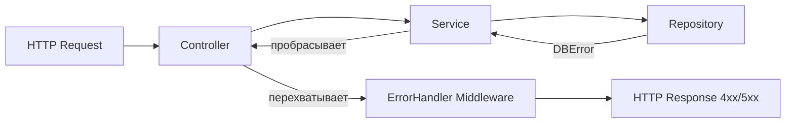

# Уровень 12: Обработка ошибок — подробная теория

## Ошибки — это не баги

Слово «ошибка» в программировании перегружено. Разработчики используют его для двух принципиально разных вещей, и смешение этих понятий приводит к неправильному дизайну.

Возьмём аналогию из жизни. Вы садитесь за руль и едете в офис. На пути — дождь. Вы взяли зонт — вы ожидали такой поворот. Теперь представьте: по дороге случается землетрясение. Вы не планировали зонт от землетрясений. Это два разных события с принципиально разной природой.

### Ожидаемые ошибки

Ожидаемые ошибки — часть нормального поведения системы. Они предсказуемы, документируются как часть контракта функции, и код обязан их обрабатывать:

- Пользователь ввёл неверный пароль
- Файл не найден на диске
- Сеть временно недоступна
- Банковский счёт не имеет достаточно средств
- Запрашиваемый ресурс не существует

```typescript
// Ожидаемая ошибка: пользователь с таким email уже существует
async function registerUser(email: string, password: string): Promise<User> {
  const existing = await userRepo.findByEmail(email)

  if (existing) {
    // Это нормальная ситуация — не баг, а бизнес-правило
    throw new EmailAlreadyTakenError(email)
  }

  return userRepo.create({ email, password: hash(password) })
}
```

### Неожиданные ошибки

Неожиданные ошибки — симптомы программных дефектов. Они не должны возникать при корректной работе системы:

- Обращение к свойству `null` или `undefined`
- Выход за границы массива
- Нарушение инварианта (отрицательный баланс в транзакции)
- Out of Memory
- Логические противоречия («активный пользователь с датой удаления»)

```typescript
// Неожиданная ошибка: код предполагал что user всегда есть,
// но где-то выше контракт нарушился
function sendWelcomeEmail(user: User) {
  // TypeError: Cannot read properties of null (reading 'email')
  mailer.send(user.email, 'Добро пожаловать!')
}
```

Неожиданные ошибки нельзя «обработать» в обычном смысле — можно только залогировать, отправить в мониторинг и упасть достойно.

---

## Exceptions: try/catch/finally

Механизм исключений — наиболее распространённый способ обработки ошибок в JavaScript и TypeScript.

### Базовая механика

```typescript
async function loadDocument(path: string): Promise<Document> {
  try {
    const raw = await fs.readFile(path, 'utf8')
    return parseDocument(raw)
  } catch (error) {
    if (error instanceof FileNotFoundError) {
      // Ожидаемая ошибка: можно обработать здесь
      throw new DocumentNotFoundError(path)
    }

    if (error instanceof ParseError) {
      // Ожидаемая ошибка: файл повреждён
      logger.warn(`Corrupt document at ${path}`, error)
      throw new DocumentCorruptError(path, error)
    }

    // Неожиданная ошибка — пробрасываем без изменений
    throw error
  } finally {
    // finally выполняется ВСЕГДА — и при успехе, и при ошибке
    // Идеально для cleanup: закрыть соединение, освободить ресурс
    metrics.recordDocumentLoadAttempt(path)
  }
}
```

### Проблема 1: невидимый control flow

В Java существуют checked exceptions: компилятор заставляет обрабатывать каждое возможное исключение. В JavaScript/TypeScript такого нет.

```typescript
// Глядя на эту строку — знает ли читатель, что может быть выброшено?
const user = await fetchUser(userId)

// Может выбросить:
// - NetworkError (нет связи)
// - AuthError (токен истёк)
// - RateLimitError (слишком много запросов)
// - ValidationError (userId невалиден)
// Ничего из этого НЕ видно в сигнатуре типа
```

TypeScript не может типизировать исключения нативно — тип блока `catch` всегда `unknown`. Это принципиальное ограничение языка.

```typescript
try {
  await riskyOperation()
} catch (error) {
  // error: unknown — TypeScript не знает что это
  if (error instanceof Error) {
    console.log(error.message)  // OK после narrowing
  }

  // ❌ Нельзя сделать: catch (error: NetworkError)
  // TypeScript не поддерживает типизированные исключения
}
```

### Проблема 2: пустой catch

Частая ошибка начинающих — поглощение ошибки без действий:

```typescript
// ❌ Ошибка исчезла, но никто не знает об этом
try {
  await syncDatabase()
} catch (error) {
  // полная тишина
}

// ✅ Минимум: залогировать, даже если не можем исправить
try {
  await syncDatabase()
} catch (error) {
  logger.error('Database sync failed', { error, context: 'startup' })
  // затем решаем: пробросить, вернуть default, показать пользователю
}
```

### Custom Error классы

Иерархия ошибок позволяет использовать `instanceof` для точной обработки:

```typescript
// Базовый класс всех доменных ошибок приложения
class AppError extends Error {
  constructor(
    message: string,
    public readonly code: string,
    public readonly statusCode: number = 500,
  ) {
    super(message)
    this.name = this.constructor.name
    // Фиксим stack trace в V8 (Node.js/Chrome)
    if (Error.captureStackTrace) {
      Error.captureStackTrace(this, this.constructor)
    }
  }
}

// Доменные ошибки
class NotFoundError extends AppError {
  constructor(resource: string, id: string) {
    super(`${resource} with id "${id}" not found`, 'NOT_FOUND', 404)
  }
}

class ValidationError extends AppError {
  constructor(
    message: string,
    public readonly field: string,
    public readonly value: unknown,
  ) {
    super(message, 'VALIDATION_ERROR', 400)
  }
}

class ConflictError extends AppError {
  constructor(message: string) {
    super(message, 'CONFLICT', 409)
  }
}

class ExternalServiceError extends AppError {
  constructor(
    service: string,
    public readonly originalError: Error,
  ) {
    super(`External service "${service}" failed`, 'EXTERNAL_SERVICE_ERROR', 503)
  }
}
```

```typescript
// Использование: обработка конкретных типов
async function handleUserRequest(userId: string) {
  try {
    return await processUser(userId)
  } catch (error) {
    if (error instanceof ValidationError) {
      return { status: 400, message: error.message, field: error.field }
    }
    if (error instanceof NotFoundError) {
      return { status: 404, message: error.message }
    }
    if (error instanceof ExternalServiceError) {
      logger.error('External service failure', error)
      return { status: 503, message: 'Service temporarily unavailable' }
    }
    // Неожиданная ошибка — пробрасываем глобальному обработчику
    throw error
  }
}
```

---

## Result/Either паттерн: ошибка как значение

Альтернативный подход к обработке ожидаемых ошибок — сделать их частью возвращаемого типа функции. Ошибка становится значением, а не исключением.

### Идея: Railway-Oriented Programming

Представьте железнодорожный путь. Поезд едет по главному пути («happy path»). При любой ошибке он переходит на боковой путь («error track») и движется по нему до конца маршрута — каждая последующая операция знает, что поезд уже «сошёл» и пропускает свою работу.



### Базовая реализация Result

```typescript
type Result<T, E = Error> =
  | { ok: true; value: T }
  | { ok: false; error: E }

// Удобные конструкторы
const Ok = <T>(value: T): Result<T, never> => ({ ok: true, value })
const Err = <E>(error: E): Result<never, E> => ({ ok: false, error })
```

```typescript
// Функция возвращает Result — ошибка видна в типе
type ParseError = 'NOT_A_NUMBER' | 'OUT_OF_RANGE' | 'EMPTY_INPUT'

function parseAge(input: string): Result<number, ParseError> {
  if (!input.trim()) {
    return Err('EMPTY_INPUT')
  }

  const age = parseInt(input, 10)

  if (isNaN(age)) {
    return Err('NOT_A_NUMBER')
  }

  if (age < 0 || age > 150) {
    return Err('OUT_OF_RANGE')
  }

  return Ok(age)
}

// Вызывающий код ОБЯЗАН обработать оба случая — TypeScript не даст игнорировать
const result = parseAge(userInput)

if (result.ok) {
  registerUser({ age: result.value })
} else {
  switch (result.error) {
    case 'EMPTY_INPUT': showError('Введите возраст')
      break
    case 'NOT_A_NUMBER': showError('Возраст должен быть числом')
      break
    case 'OUT_OF_RANGE': showError('Возраст вне допустимого диапазона')
      break
  }
}
```

### Цепочка операций (Railway)

```typescript
// Хелпер для цепочки: если предыдущий шаг упал — пропустить текущий
function andThen<T, U, E>(
  result: Result<T, E>,
  fn: (value: T) => Result<U, E>,
): Result<U, E> {
  if (!result.ok) return result
  return fn(result.value)
}

function mapError<T, E, F>(
  result: Result<T, E>,
  fn: (error: E) => F,
): Result<T, F> {
  if (result.ok) return result
  return Err(fn(result.error))
}
```

```typescript
// Цепочка операций в стиле Railway
function processRegistration(formData: unknown): Result<User, string> {
  const validated = validateFormData(formData)
  const normalized = andThen(validated, normalizeUserData)
  const withDefaults = andThen(normalized, applyDefaultSettings)
  return withDefaults
}

// Или функционально через pipe
const result = pipe(
  validateFormData(formData),
  r => andThen(r, normalizeUserData),
  r => andThen(r, applyDefaultSettings),
)
```

### Библиотеки для Result в TypeScript

- **neverthrow** — минималистичная, популярная
- **ts-results** — аналог Rust's Result и Option
- **Effect** — мощная полная система (монадический стиль, трейсинг, конкурентность)
- **fp-ts** — функциональные абстракции, Either

```typescript
// neverthrow пример
import { ok, err, Result } from 'neverthrow'

async function fetchUserSafe(id: string): Promise<Result<User, ApiError>> {
  try {
    const user = await api.getUser(id)
    return ok(user)
  } catch (error) {
    return err(new ApiError('Failed to fetch user', error))
  }
}

// Цепочка через .andThen()
const result = await fetchUserSafe(userId)
  .andThen(user => validateUser(user))
  .map(user => formatUserDTO(user))
```

### Когда Result лучше исключений

| Ситуация | Подход |
|----------|--------|
| Граница модуля (публичный API) | Result — ошибки видны в контракте |
| Валидация пользовательского ввода | Result — несколько ошибок одновременно |
| Несколько ожидаемых исходов | Result — switch по типу ошибки |
| Неожиданная ошибка (баг) | Exception — пробросить наверх |
| Простая функция внутри модуля | Exception — не перегружать типы |

---

## Option/Maybe: моделирование отсутствия значения

Тони Хоар, изобретатель `null`, назвал его «ошибкой на миллиард долларов» — за три десятилетия баги, связанные с null, обошлись индустрии в огромные деньги.

```typescript
// Проблема: null и undefined в TypeScript повсюду
function findUser(id: string): User | null | undefined {
  // Вернёт null если нет в базе, undefined если база не инициализирована
}

const user = findUser('123')
user.email  // TypeError если null/undefined — и TypeScript не всегда защитит
```

Option тип делает отсутствие явным:

```typescript
type Option<T> = { some: true; value: T } | { some: false }

const Some = <T>(value: T): Option<T> => ({ some: true, value })
const None = (): Option<never> => ({ some: false })

function findUser(id: string): Option<User> {
  const user = db.users.get(id)
  return user ? Some(user) : None()
}

// TypeScript ЗАСТАВИТ проверить наличие значения
const result = findUser('123')
if (result.some) {
  sendEmail(result.value.email)  // здесь гарантированно есть value
} else {
  showNotFoundPage()
}
```

В TypeScript часто достаточно строгого `strictNullChecks` + `undefined`:

```typescript
// tsconfig.json: "strictNullChecks": true

function findUser(id: string): User | undefined {
  return db.users.get(id)
}

// TypeScript: Property 'email' does not exist on type 'User | undefined'
const email = findUser('123').email  // ошибка компиляции

// Правильно: проверить перед использованием
const user = findUser('123')
const email = user?.email ?? 'no-email'
```

---

## Fail Fast vs Defensive Programming

### Fail Fast: упасть рано, упасть громко

Принцип: если обнаружен инвариант нарушен — немедленно выбросить ошибку. Чем раньше падает система, тем легче найти причину.

```typescript
// Invariant: функция ожидает положительное число
function calculateDiscount(price: number, discountPercent: number): number {
  // Fail fast: программист нарушил контракт — сообщаем немедленно
  if (price < 0) {
    throw new Error(`Invariant violation: price must be positive, got ${price}`)
  }
  if (discountPercent < 0 || discountPercent > 100) {
    throw new Error(`Invariant violation: discount must be 0-100, got ${discountPercent}`)
  }

  return price * (1 - discountPercent / 100)
}
```

```typescript
// Утилита для проверки инвариантов
function invariant(condition: boolean, message: string): asserts condition {
  if (!condition) {
    throw new Error(`Invariant violated: ${message}`)
  }
}

function processOrder(order: Order) {
  invariant(order.items.length > 0, 'Order must have at least one item')
  invariant(order.total >= 0, `Order total must be non-negative, got ${order.total}`)

  // Дальнейший код работает с гарантиями
}
```

### Defensive Programming: проверь всё, верни безопасное значение

Принцип: предположить что входные данные невалидны, обработать любой вход без падения.

```typescript
// Defensive: пользовательский ввод всегда недоверенный
function parseQuantity(input: unknown): number {
  if (typeof input !== 'string' && typeof input !== 'number') return 1
  const parsed = parseInt(String(input), 10)
  if (isNaN(parsed) || parsed < 1) return 1
  if (parsed > 9999) return 9999
  return parsed
}
```

### Правило выбора

| Контекст | Подход | Почему |
|----------|--------|--------|
| Публичная библиотека | Fail Fast | Разработчик должен сразу узнать об ошибке |
| Внутренние инварианты | Fail Fast | Нарушение — баг, нужен stack trace |
| Пользовательский ввод | Defensive | Невалидный ввод — норма, не баг |
| Внешние API/данные | Defensive | Не контролируем источник |
| Конфигурация при старте | Fail Fast | Неверный конфиг — лучше не запускаться |

---

## Error Boundaries: где ловить, где пробрасывать

Граница обработки ошибок — это точка в системе, где ошибка останавливается и преобразуется в понятный ответ пользователю или системе.



### Правило: ловить как можно ближе к месту восстановления

```typescript
// ❌ Ловить слишком рано — теряем информацию об ошибке
class UserRepository {
  async findById(id: string): Promise<User | null> {
    try {
      return await db.query(`SELECT * FROM users WHERE id = $1`, [id])
    } catch (error) {
      return null  // Информация потеряна: было ли это 'not found' или 'connection error'?
    }
  }
}

// ✅ Пробрасываем с контекстом — ловим там, где можем восстановиться
class UserRepository {
  async findById(id: string): Promise<User> {
    try {
      const result = await db.query(`SELECT * FROM users WHERE id = $1`, [id])
      if (!result.rows.length) {
        throw new NotFoundError('User', id)
      }
      return result.rows[0]
    } catch (error) {
      if (error instanceof NotFoundError) throw error
      throw new DatabaseError('Failed to fetch user', error as Error)
    }
  }
}
```

### Глобальный обработчик ошибок

```typescript
// Express middleware
app.use((error: Error, req: Request, res: Response, next: NextFunction) => {
  if (error instanceof ValidationError) {
    return res.status(400).json({
      error: error.code,
      message: error.message,
      field: error.field,
    })
  }

  if (error instanceof NotFoundError) {
    return res.status(404).json({ error: error.code, message: error.message })
  }

  if (error instanceof AppError) {
    return res.status(error.statusCode).json({ error: error.code, message: error.message })
  }

  // Неожиданная ошибка — логируем полностью, пользователю — generic message
  logger.error('Unhandled error', {
    error: error.message,
    stack: error.stack,
    url: req.url,
    method: req.method,
  })

  return res.status(500).json({ error: 'INTERNAL_ERROR', message: 'Something went wrong' })
})
```

### React Error Boundaries

В React неожиданные ошибки в компонентах перехватываются Error Boundary:

```typescript
import { Component, type ReactNode, type ErrorInfo } from 'react'

interface State {
  hasError: boolean
  error: Error | null
}

class ErrorBoundary extends Component<{ children: ReactNode; fallback: ReactNode }, State> {
  state: State = { hasError: false, error: null }

  static getDerivedStateFromError(error: Error): State {
    return { hasError: true, error }
  }

  componentDidCatch(error: Error, info: ErrorInfo) {
    // Отправить в Sentry/другой мониторинг
    errorReporter.capture(error, { componentStack: info.componentStack })
  }

  render() {
    if (this.state.hasError) {
      return this.props.fallback
    }
    return this.props.children
  }
}

// Использование
function App() {
  return (
    <ErrorBoundary fallback={<CriticalErrorPage />}>
      <ErrorBoundary fallback={<SectionErrorFallback />}>
        <UserDashboard />
      </ErrorBoundary>
      <Sidebar />
    </ErrorBoundary>
  )
}
```

---

## Стратегии восстановления

### Retry с экспоненциальным backoff

```typescript
interface RetryOptions {
  maxAttempts: number
  baseDelayMs: number
  maxDelayMs: number
  retryIf?: (error: Error) => boolean
}

async function withRetry<T>(
  fn: () => Promise<T>,
  options: RetryOptions,
): Promise<T> {
  const { maxAttempts, baseDelayMs, maxDelayMs, retryIf } = options

  let lastError: Error = new Error('No attempts made')

  for (let attempt = 1; attempt <= maxAttempts; attempt++) {
    try {
      return await fn()
    } catch (error) {
      lastError = error as Error

      // Не повторять если ошибка не ретраябельная
      if (retryIf && !retryIf(lastError)) {
        throw lastError
      }

      if (attempt === maxAttempts) break

      // Exponential backoff с jitter
      const delay = Math.min(
        baseDelayMs * Math.pow(2, attempt - 1) + Math.random() * 100,
        maxDelayMs,
      )
      await new Promise(resolve => setTimeout(resolve, delay))
    }
  }

  throw lastError
}

// Использование: retry только на сетевые ошибки, не на 4xx
const user = await withRetry(
  () => fetchUser(userId),
  {
    maxAttempts: 3,
    baseDelayMs: 1000,
    maxDelayMs: 10000,
    retryIf: error => error instanceof NetworkError || error instanceof TimeoutError,
  },
)
```

### Circuit Breaker

Автоматический выключатель: если сервис отвечает ошибками — перестать к нему обращаться на время, не перегружать его.

```typescript
type CircuitState = 'closed' | 'open' | 'half-open'

class CircuitBreaker {
  private state: CircuitState = 'closed'
  private failureCount = 0
  private lastFailureTime = 0

  constructor(
    private readonly threshold: number = 5,
    private readonly timeoutMs: number = 30_000,
  ) {}

  async execute<T>(fn: () => Promise<T>): Promise<T> {
    if (this.state === 'open') {
      const elapsed = Date.now() - this.lastFailureTime

      if (elapsed < this.timeoutMs) {
        throw new Error('Circuit breaker is open: service unavailable')
      }

      this.state = 'half-open'
    }

    try {
      const result = await fn()
      this.onSuccess()
      return result
    } catch (error) {
      this.onFailure()
      throw error
    }
  }

  private onSuccess() {
    this.failureCount = 0
    this.state = 'closed'
  }

  private onFailure() {
    this.failureCount++
    this.lastFailureTime = Date.now()
    if (this.failureCount >= this.threshold) {
      this.state = 'open'
    }
  }
}
```

### Graceful Degradation

Система продолжает работать с ограниченной функциональностью при сбое компонента:

```typescript
async function buildHomePage(userId: string): Promise<HomePage> {
  // Ключевые данные: без них страница не имеет смысла
  const user = await fetchUser(userId)  // throws если не найден

  // Некритичные данные: получаем параллельно, ошибка не критична
  const [recommendations, notifications, banners] = await Promise.allSettled([
    fetchRecommendations(userId),
    fetchNotifications(userId),
    fetchPromoBanners(),
  ])

  return {
    user,
    // Graceful degradation: пустой массив вместо ошибки
    recommendations: recommendations.status === 'fulfilled'
      ? recommendations.value
      : [],
    notifications: notifications.status === 'fulfilled'
      ? notifications.value
      : [],
    banners: banners.status === 'fulfilled'
      ? banners.value
      : [],
  }
}
```

---

## Частые ошибки начинающих

### Глотать ошибки молча

```typescript
// ❌ Ошибка исчезает — никто не знает что что-то пошло не так
try {
  await sendEmail(user.email, 'Welcome!')
} catch {
  // тишина
}

// ✅ Минимум: залогировать. Лучше: решить что делать с ошибкой
try {
  await sendEmail(user.email, 'Welcome!')
} catch (error) {
  logger.error('Failed to send welcome email', { userId: user.id, error })
  // Решение: email не критичен для регистрации — продолжаем без него
}
```

### Ловить слишком широко

```typescript
// ❌ Catch-all скрывает разные типы ошибок за одним обработчиком
try {
  await processPayment(order)
} catch (error) {
  showError('Что-то пошло не так')
}

// ✅ Разные ошибки — разные реакции
try {
  await processPayment(order)
} catch (error) {
  if (error instanceof InsufficientFundsError) {
    showError('Недостаточно средств на счёте')
  } else if (error instanceof CardDeclinedError) {
    showError('Карта отклонена банком')
  } else if (error instanceof NetworkError) {
    showError('Проблемы с соединением — попробуйте ещё раз')
  } else {
    logger.error('Unexpected payment error', error)
    showError('Техническая ошибка. Мы уже разбираемся.')
  }
}
```

### Использовать исключения для управления потоком

```typescript
// ❌ Исключение как goto — дорого и неочевидно
function findFirstEven(numbers: number[]): number {
  try {
    numbers.forEach(n => {
      if (n % 2 === 0) throw n  // "ошибка" как механизм выхода из forEach
    })
    return -1
  } catch (n) {
    if (typeof n === 'number') return n
    throw n
  }
}

// ✅ Использовать подходящий инструмент
function findFirstEven(numbers: number[]): number | undefined {
  return numbers.find(n => n % 2 === 0)
}
```

### Терять оригинальный стек ошибки

```typescript
// ❌ Оригинальный stack trace потерян — отладка затруднена
try {
  await db.query(sql)
} catch (error) {
  throw new DatabaseError('Query failed')  // новый Error без причины
}

// ✅ Сохранять оригинальную ошибку как cause
try {
  await db.query(sql)
} catch (error) {
  throw new DatabaseError('Query failed', { cause: error })
}

// Или в кастомном классе
class DatabaseError extends AppError {
  constructor(message: string, public readonly cause: unknown) {
    super(message, 'DATABASE_ERROR', 503)
  }
}
```
