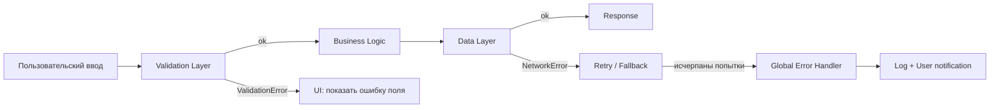

# Уровень 12: Обработка ошибок

## Ошибки бывают разные

Представьте, что вы едете на работу. Дождь — ожидаемая неприятность: вы взяли зонт. Землетрясение — нет. Эта разница принципиальна и в программировании.

**Ожидаемые ошибки** — часть нормальной работы системы: пользователь ввёл неверный пароль, файл не найден, сервер временно недоступен. Код обязан их предвидеть и обработать.

**Неожиданные ошибки** — симптомы бага: обращение к `null`, выход за границы массива, логические противоречия в бизнес-правилах. Их нельзя «обработать» — можно только залогировать и упасть достойно.

---

## Exceptions: try/catch/finally

```typescript
// Классическая обработка через исключения
async function loadUserProfile(userId: string): Promise<UserProfile> {
  try {
    const user = await fetchUser(userId)
    return buildProfile(user)
  } catch (error) {
    if (error instanceof NotFoundError) {
      // Ожидаемая ошибка — обрабатываем
      return createGuestProfile()
    }
    // Неожиданная — пробрасываем выше
    throw error
  } finally {
    // Выполнится в любом случае: и при успехе, и при ошибке
    closeConnection()
  }
}
```

Главная проблема исключений — **невидимый control flow**. Глядя на вызов `fetchUser(userId)`, нельзя понять из типа функции, что она может бросить. Это как скрытые трапы в полу — о них знает только тот, кто писал код.

Custom Error классы исправляют часть проблемы — появляется иерархия:

```typescript
class AppError extends Error {
  constructor(
    message: string,
    public readonly code: string,
  ) {
    super(message)
    this.name = 'AppError'
  }
}

class NotFoundError extends AppError {
  constructor(resource: string, id: string) {
    super(`${resource} with id ${id} not found`, 'NOT_FOUND')
  }
}

class ValidationError extends AppError {
  constructor(
    message: string,
    public readonly field: string,
  ) {
    super(message, 'VALIDATION_ERROR')
  }
}
```

---

## Result паттерн: ошибка как значение

Альтернативный подход — возвращать ошибку явно, как часть возвращаемого типа:

```typescript
type Result<T, E = Error> =
  | { ok: true; value: T }
  | { ok: false; error: E }

async function parseUserAge(input: string): Promise<Result<number, string>> {
  const age = parseInt(input, 10)

  if (isNaN(age)) {
    return { ok: false, error: 'Возраст должен быть числом' }
  }

  if (age < 0 || age > 150) {
    return { ok: false, error: 'Возраст вне допустимого диапазона' }
  }

  return { ok: true, value: age }
}

// Вызывающий код ОБЯЗАН обработать оба случая — TypeScript проверит
const result = await parseUserAge(userInput)
if (result.ok) {
  console.log('Возраст:', result.value)
} else {
  console.error('Ошибка:', result.error)
}
```

Ошибка становится видимой в типе функции. Больше никаких скрытых трапов.

---

## Fail Fast vs Defensive Programming

**Fail Fast** — упасть рано и громко при нарушении инварианта:

```typescript
function divide(a: number, b: number): number {
  if (b === 0) throw new Error('Division by zero: вызывающий код нарушил контракт')
  return a / b
}
```

**Defensive Programming** — проверить всё, вернуть безопасный default:

```typescript
function divide(a: number, b: number): number {
  if (b === 0) return 0  // молча возвращаем default
  return a / b
}
```

Правило: **библиотека/утилита** → Fail Fast (дай разработчику знать об ошибке немедленно). **Пользовательский ввод** → Defensive (всегда невалиден, это норма).

---

## Стратегии восстановления

```typescript
// Retry: повторить при временном сбое
async function fetchWithRetry<T>(
  fn: () => Promise<T>,
  maxAttempts = 3,
): Promise<T> {
  for (let attempt = 1; attempt <= maxAttempts; attempt++) {
    try {
      return await fn()
    } catch (error) {
      if (attempt === maxAttempts) throw error
      await sleep(attempt * 1000) // exponential backoff
    }
  }
  throw new Error('unreachable')
}

// Fallback: запасной вариант при отказе основного
async function getUserAvatar(userId: string): Promise<string> {
  try {
    return await fetchAvatarFromCDN(userId)
  } catch {
    return '/default-avatar.png'  // graceful degradation
  }
}
```

Поток обработки ошибки через слои системы:



---

## Итог

- **Ожидаемые ошибки** — часть домена, обрабатывать явно
- **Неожиданные** — баги, логировать и пробрасывать наверх
- **Exceptions** — простые для написания, скрытый control flow
- **Result** — ошибка видна в типе, TypeScript заставляет обработать
- **Fail Fast** — для инвариантов и библиотек; **Defensive** — для пользовательского ввода
- **Retry + Fallback + Circuit Breaker** — инструменты graceful degradation
