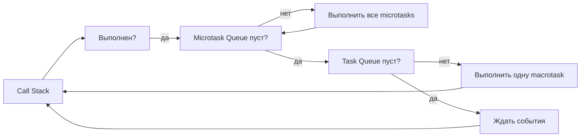

# Уровень 13: Конкурентность и асинхронность — подробная теория

## Concurrency vs Parallelism: два разных понятия

Эти термины используют как синонимы — это фундаментальная ошибка, ведущая к неправильным архитектурным решениям.

### Аналогия с кухней

Представьте ресторанную кухню.

**Один повар с тремя кастрюлями** — это Concurrency. Повар ставит суп вариться, пока он варится — режет салат, пока салат готовится — помешивает соус. Повар один, но три задачи продвигаются вперёд. Переключение происходит в моменты ожидания.

**Три повара, у каждого своя кастрюля** — это Parallelism. Три задачи выполняются физически одновременно, каждая на своём «процессоре».

Ключевое различие:
- **Concurrency** — это про структуру задач и управление ими. Задачи могут не выполняться буквально одновременно.
- **Parallelism** — это про физическое одновременное исполнение. Требует нескольких процессорных ядер.

```
Concurrency (один поток):
    Время: --A1--A2--B1--A3--B2--C1--B3--C2--C3-->
    Задача A: ▓▓  ▓▓      ▓▓
    Задача B:         ▓▓      ▓▓      ▓▓
    Задача C:                     ▓▓      ▓▓  ▓▓

Parallelism (несколько потоков):
    Время: --1--2--3-->
    Задача A: ▓▓▓▓▓▓▓▓
    Задача B: ▓▓▓▓▓▓▓▓  (другой поток)
    Задача C: ▓▓▓▓▓▓▓▓  (другой поток)
```

JavaScript — **однопоточный язык с конкурентной моделью**. В браузере и Node.js существует один поток исполнения JavaScript-кода. Параллелизм возможен через Web Workers и Worker Threads — но это отдельные потоки с изолированной памятью.

---

## Event Loop: детальная механика

Event Loop — сердце асинхронной модели JavaScript. Разобравшись с ним, вы поймёте почему код ведёт себя именно так.

### Компоненты



**Call Stack** — стек вызовов. Здесь выполняется JavaScript. Один в один: только одна функция активна в момент времени.

**Web APIs / Node APIs** — асинхронные операции, выполняемые вне JavaScript потока: `setTimeout`, `fetch`, `fs.readFile`, DOM events, WebSockets. Когда они завершаются — помещают callback в очередь.

**Microtask Queue** — очередь с высоким приоритетом. Содержит: `Promise.then/catch/finally`, `queueMicrotask`, `MutationObserver`. Опустошается ПОЛНОСТЬЮ перед каждой macrotask.

**Task Queue (Macrotask Queue)** — обычная очередь. Содержит: `setTimeout`, `setInterval`, `setImmediate` (Node.js), I/O callbacks, UI events. Берётся по одной задаче за раз.

### Порядок выполнения: разбор по шагам

```typescript
console.log('start')  // 1: Call Stack — немедленно

setTimeout(() => {
  console.log('timeout')  // 5: Macrotask Queue
}, 0)

Promise.resolve()
  .then(() => {
    console.log('promise 1')  // 3: Microtask Queue
  })
  .then(() => {
    console.log('promise 2')  // 4: Microtask Queue (добавляется после 'promise 1')
  })

queueMicrotask(() => {
  console.log('microtask')  // тоже Microtask Queue, между 3 и 4
})

console.log('end')  // 2: Call Stack — немедленно

// Вывод: start, end, promise 1, microtask, promise 2, timeout
```

Почему `timeout` последний при `delay = 0`? Потому что:
1. Call Stack очищается: `start`, `end`
2. Все microtasks выполняются: `promise 1`, `microtask`, `promise 2`
3. Только теперь — одна macrotask: `timeout`

### Starvation: бесконечные microtasks

```typescript
// ❌ Опасно: бесконечная цепочка microtasks блокирует macrotasks
function infiniteMicrotasks() {
  Promise.resolve().then(() => {
    // Добавляет новую microtask — Event Loop никогда не переходит к macrotasks
    infiniteMicrotasks()
  })
}

// Браузер зависнет: setInterval, requestAnimationFrame, UI events — всё заблокировано
// setTimeout никогда не выполнится!

// ✅ Если нужна рекурсия — использовать setTimeout или setImmediate (Node.js)
function yieldableMicrotasks() {
  setTimeout(() => {
    doWork()
    yieldableMicrotasks()
  }, 0)
}
// Каждая итерация даёт шанс другим macrotasks выполниться
```

### requestAnimationFrame и requestIdleCallback

```typescript
// requestAnimationFrame: выполняется перед следующей отрисовкой (~60 раз/сек)
// Приоритет: после microtasks, перед обычными macrotasks
function animateElement(element: HTMLElement) {
  let start: number

  function step(timestamp: number) {
    if (!start) start = timestamp
    const progress = timestamp - start

    element.style.transform = `translateX(${Math.min(progress / 10, 200)}px)`

    if (progress < 2000) {
      requestAnimationFrame(step)  // следующий кадр
    }
  }

  requestAnimationFrame(step)
}

// requestIdleCallback: выполняется когда браузер простаивает
// Для некритичных фоновых задач
function prefetchData() {
  requestIdleCallback((deadline) => {
    while (deadline.timeRemaining() > 0 && queue.length > 0) {
      processNextItem(queue.shift())
    }
    if (queue.length > 0) {
      requestIdleCallback(prefetchData)
    }
  })
}
```

---

## Promises: полное руководство

### Состояния и жизненный цикл

Promise — объект, представляющий асинхронную операцию, которая завершится в будущем.

```typescript
// Создание Promise
const promise = new Promise<number>((resolve, reject) => {
  // Executor — выполняется синхронно при создании Promise
  console.log('Executor: начинаем')  // выполняется сразу

  setTimeout(() => {
    const success = Math.random() > 0.5

    if (success) {
      resolve(42)  // pending → fulfilled
    } else {
      reject(new Error('Operation failed'))  // pending → rejected
    }
  }, 1000)
})

// Состояния:
// pending   — начальное, ожидание
// fulfilled — успешно завершён (resolve вызван)
// rejected  — завершён с ошибкой (reject вызван)
// Переход необратим: fulfilled или rejected — навсегда
```

### Цепочки Promise

```typescript
fetchUser(userId)
  .then(user => fetchOrders(user.id))    // получаем заказы
  .then(orders => calculateTotal(orders)) // считаем итог
  .then(total => displayTotal(total))    // показываем
  .catch(error => {
    // Перехватывает ошибку с ЛЮБОГО шага выше
    console.error('Something failed:', error)
  })
  .finally(() => {
    // Выполняется всегда: и при успехе, и при ошибке
    setLoading(false)
  })
```

### Комбинаторы: выбираем правильный

```typescript
// Promise.all: параллельно, ждёт всех, падает при первой ошибке
// Используй когда: ВСЕ результаты нужны, и любая ошибка критична
const [user, orders, preferences] = await Promise.all([
  fetchUser(id),
  fetchOrders(id),
  fetchPreferences(id),
])

// Promise.allSettled: параллельно, ждёт всех, не падает
// Используй когда: нужны ВСЕ результаты, ошибки отдельных — не критичны
const results = await Promise.allSettled([
  fetchMainContent(id),
  fetchRecommendations(id),  // можно не загрузить
  fetchAds(id),              // можно не загрузить
])

const content = results[0].status === 'fulfilled' ? results[0].value : null
const recs = results[1].status === 'fulfilled' ? results[1].value : []
const ads = results[2].status === 'fulfilled' ? results[2].value : []

// Promise.race: первый завершившийся (успех ИЛИ ошибка)
// Используй когда: важна скорость, первый ответ — достаточно
const result = await Promise.race([
  fetchFromPrimaryServer(),
  fetchFromBackupServer(),
  timeoutPromise(5000),  // таймаут как Promise
])

// Promise.any: первый УСПЕШНЫЙ, ошибка если все упали
// Используй когда: несколько альтернатив, нужна хотя бы одна
const avatar = await Promise.any([
  fetchFromCDN1(userId),
  fetchFromCDN2(userId),
  fetchFromOrigin(userId),
])
```

### Unhandled Rejection: почему это критично

```typescript
// ❌ Unhandled rejection: ошибка никем не перехвачена
fetchUser('123')
  .then(user => processUser(user))
// Если fetchUser reject — ошибка исчезнет в пустоте (или вызовет warning)

// В Node.js процесс может упасть с exit code 1
// В браузере — запись в консоль, трудно отследить в production

// ✅ Всегда добавлять catch
fetchUser('123')
  .then(user => processUser(user))
  .catch(error => logger.error('Failed to fetch user', error))

// Глобальный обработчик необработанных rejection
process.on('unhandledRejection', (reason, promise) => {
  logger.error('Unhandled Promise rejection', { reason, promise })
  // Отправить в Sentry/Datadog
})

window.addEventListener('unhandledrejection', (event) => {
  logger.error('Unhandled Promise rejection', event.reason)
})
```

---

## async/await: паттерны и антипаттерны

### Базовый синтаксис

`async/await` — синтаксический сахар над Promises. Функция с `async` всегда возвращает Promise. `await` приостанавливает выполнение функции до разрешения Promise, не блокируя Event Loop.

```typescript
// Эквивалентный код на Promise и async/await
function fetchUserPromise(id: string): Promise<User> {
  return fetch(`/api/users/${id}`)
    .then(response => response.json())
    .then(data => data as User)
    .catch(error => {
      throw new FetchError('Failed to fetch user', error)
    })
}

async function fetchUserAsync(id: string): Promise<User> {
  try {
    const response = await fetch(`/api/users/${id}`)
    const data = await response.json()
    return data as User
  } catch (error) {
    throw new FetchError('Failed to fetch user', error)
  }
}
```

### Последовательное vs параллельное выполнение

```typescript
// ❌ Антипаттерн: await в цикле — последовательно, медленно
async function loadUsersSequentially(ids: string[]): Promise<User[]> {
  const users: User[] = []
  for (const id of ids) {
    const user = await fetchUser(id)  // каждый запрос ждёт предыдущего
    users.push(user)
  }
  return users
  // 100 пользователей × 200ms = 20 секунд!
}

// ✅ Promise.all — параллельно, быстро
async function loadUsersParallel(ids: string[]): Promise<User[]> {
  return Promise.all(ids.map(id => fetchUser(id)))
  // 100 пользователей × 200ms = ~200ms (одновременно)
}

// ✅ Параллельно с ограничением concurrency (p-limit, bottleneck)
import pLimit from 'p-limit'

async function loadUsersWithLimit(ids: string[]): Promise<User[]> {
  const limit = pLimit(10)  // не более 10 одновременных запросов
  return Promise.all(ids.map(id => limit(() => fetchUser(id))))
}
```

### Когда await в цикле оправдан

```typescript
// ✅ Последовательность важна по бизнес-логике
async function processOrdersInSequence(orders: Order[]) {
  for (const order of orders) {
    await processOrder(order)  // следующий заказ после завершения текущего
    await sendConfirmation(order)  // порядок важен
  }
}

// ✅ Накопление с зависимостью: результат текущего нужен для следующего
async function buildReport(queries: Query[]) {
  let context = initialContext
  for (const query of queries) {
    context = await executeQuery(query, context)  // context из предыдущего
  }
  return context
}
```

### Top-level await (ES2022)

```typescript
// В модулях (.mjs или "type": "module" в package.json)
// await можно использовать на верхнем уровне без async функции

// Инициализация перед экспортом
const config = await loadConfig()
const db = await connectDatabase(config.dbUrl)

export { config, db }

// Полезно для:
// - Инициализации модуля с async операциями
// - Условного импорта зависимостей
// - Конфигурации при старте приложения
```

---

## Race Conditions: виды и решения

Race condition — баг, при котором результат зависит от порядка выполнения конкурентных операций. В однопоточном JavaScript они возможны из-за асинхронных операций.

### Stale closure в React

```typescript
// ❌ Stale closure race condition
function SearchComponent() {
  const [results, setResults] = useState([])

  async function handleSearch(query: string) {
    const data = await fetchSearchResults(query)
    // Если пользователь изменил запрос пока шёл fetch —
    // setResults установит устаревшие данные поверх новых!
    setResults(data)
  }

  // Сценарий:
  // 1. Пользователь вводит "re" → запрос 1 отправлен
  // 2. Пользователь добавляет "act" → запрос 2 отправлен
  // 3. Запрос 1 завершается медленнее — setResults с результатами "re"
  // 4. Запрос 2 завершается — setResults с результатами "react"
  // Итог: показываем "re" вместо "react"!
}
```

```typescript
// ✅ Решение 1: флаг актуальности
function SearchComponent() {
  const [results, setResults] = useState([])

  useEffect(() => {
    let isCurrent = true  // закрытие захватывает этот флаг

    async function search() {
      const data = await fetchSearchResults(query)
      if (isCurrent) {  // установить только если запрос ещё актуален
        setResults(data)
      }
    }

    search()

    return () => {
      isCurrent = false  // при следующем вызове эффекта — устаревший запрос игнорируется
    }
  }, [query])
}
```

```typescript
// ✅ Решение 2: AbortController — отменить предыдущий запрос
function SearchComponent() {
  const [results, setResults] = useState([])

  useEffect(() => {
    const controller = new AbortController()

    fetch(`/api/search?q=${query}`, { signal: controller.signal })
      .then(r => r.json())
      .then(data => setResults(data))
      .catch(err => {
        // AbortError — нормальная отмена, не настоящая ошибка
        if (err.name !== 'AbortError') {
          setError(err)
        }
      })

    return () => controller.abort()  // отменить запрос при следующем рендере
  }, [query])
}
```

### Check-then-act: классическая race condition

```typescript
// ❌ Non-atomic check-then-act
async function reserveSeat(seatId: string, userId: string) {
  const seat = await getSeat(seatId)

  // Между проверкой и резервацией другой пользователь мог занять место!
  if (seat.status === 'available') {
    await updateSeat(seatId, { status: 'reserved', userId })
    // Двойное бронирование!
  }
}

// ✅ Атомарное обновление: условие и обновление — одна операция в БД
async function reserveSeatAtomic(seatId: string, userId: string): Promise<boolean> {
  const result = await db.query(
    `UPDATE seats
     SET status = 'reserved', user_id = $2
     WHERE id = $1 AND status = 'available'
     RETURNING id`,
    [seatId, userId],
  )
  return result.rows.length > 0  // true — успешно, false — уже занято
}
```

### Optimistic vs Pessimistic Concurrency

```typescript
// Pessimistic: блокируем ресурс на время операции (FOR UPDATE)
async function updateUserPessimistic(id: string, data: Partial<User>) {
  return db.transaction(async trx => {
    const user = await trx.query(
      'SELECT * FROM users WHERE id = $1 FOR UPDATE',  // блокируем строку
      [id],
    )
    // Другие транзакции ждут пока мы не завершимся
    await trx.query('UPDATE users SET ... WHERE id = $1', [id])
  })
}

// Optimistic: работаем без блокировки, проверяем конфликт при сохранении
async function updateUserOptimistic(id: string, data: Partial<User>, version: number) {
  const result = await db.query(
    `UPDATE users
     SET name = $1, version = version + 1
     WHERE id = $2 AND version = $3  -- проверяем что версия не изменилась
     RETURNING version`,
    [data.name, id, version],
  )

  if (result.rows.length === 0) {
    throw new ConflictError('User was modified by another operation')
  }

  return result.rows[0]
}
```

### AbortController: отмена операций

```typescript
// AbortController — стандартный Web API для отмены async операций

// Отмена по таймауту
async function fetchWithTimeout<T>(
  url: string,
  timeoutMs: number,
): Promise<T> {
  const controller = new AbortController()
  const timeoutId = setTimeout(() => controller.abort(), timeoutMs)

  try {
    const response = await fetch(url, { signal: controller.signal })
    return response.json()
  } finally {
    clearTimeout(timeoutId)
  }
}

// Node.js 18+: AbortSignal.timeout — нативный таймаут
const response = await fetch(url, {
  signal: AbortSignal.timeout(5000),  // автоматически отменить через 5 сек
})

// Передача signal через цепочку вызовов
async function processDocument(
  documentId: string,
  signal: AbortSignal,
): Promise<Result> {
  const doc = await fetchDocument(documentId, { signal })
  signal.throwIfAborted()  // проверить отмену между шагами

  const parsed = await parseDocument(doc, { signal })
  signal.throwIfAborted()

  return transformResult(parsed)
}
```

---

## Модели конкурентности (обзор)

Разные языки решают проблему конкурентности по-разному. Понимание альтернатив помогает видеть ограничения и возможности JavaScript.

### Shared Memory + Locks (Java, C++, C#)

Несколько потоков читают и пишут в общую память. Для согласованности используются мьютексы и семафоры.

```java
// Java: явная синхронизация через synchronized
private int balance = 0;

public synchronized void deposit(int amount) {
  balance += amount;  // только один поток в момент времени
}
```

Проблемы: deadlock, livelock, priority inversion, сложность отладки. В JavaScript намеренно недоступно в основном потоке.

### Message Passing (Erlang Actors, Go channels)

Потоки/процессы общаются через передачу сообщений, не через общую память.

```go
// Go: goroutines + channels
ch := make(chan int, 1)

go func() {
  result := heavyComputation()
  ch <- result  // отправить результат
}()

value := <-ch  // получить результат
```

Преимущество: нет shared state — нет race conditions по данным.

### Event Loop (JavaScript, Python asyncio)

Один поток, конкурентность через non-blocking I/O и очередь событий. Простейшая модель для network-intensive задач.

```typescript
// JavaScript: всё это знакомо — это наша модель
async function handleRequest(req: Request): Promise<Response> {
  const data = await fetchFromDB(req.params.id)  // не блокирует
  return { status: 200, body: data }
}
```

Ограничение: CPU-intensive задачи блокируют Event Loop.

### CSP — Communicating Sequential Processes (Go, Clojure core.async)

Горутины (легковесные потоки) взаимодействуют через каналы. Похоже на Actor Model, но каналы — первоклассные объекты.

### Software Transactional Memory (Haskell, Clojure)

Работа с общей памятью как с базой данных транзакций: атомарно, изолированно.

---

## Web Workers и параллелизм в браузере

```typescript
// Основной поток — создаём Worker
const worker = new Worker('./heavy-computation.worker.js')

worker.postMessage({ data: largeArray })  // сообщение в Worker

worker.onmessage = (event) => {
  console.log('Result from Worker:', event.data)
}

// heavy-computation.worker.js — отдельный поток
self.onmessage = (event) => {
  const result = veryHeavyComputation(event.data.data)  // не блокирует UI
  self.postMessage(result)
}
```

```typescript
// SharedArrayBuffer + Atomics: разделяемая память между потоками
// Требует Cross-Origin Isolation (COOP + COEP headers)

const sharedBuffer = new SharedArrayBuffer(Int32Array.BYTES_PER_ELEMENT * 100)
const sharedArray = new Int32Array(sharedBuffer)

// Worker 1:
Atomics.add(sharedArray, 0, 1)  // атомарный инкремент — без race condition

// Worker 2:
Atomics.wait(sharedArray, 0, 0)  // ждать пока значение по индексу 0 != 0
const value = Atomics.load(sharedArray, 0)
```

---

## Частые ошибки начинающих

### Забыть await — и получить Promise вместо значения

```typescript
// ❌ Классическая ошибка: забыли await
async function showUserName(id: string) {
  const user = fetchUser(id)  // user: Promise<User>, не User!
  console.log(user.name)  // undefined — у Promise нет поля name
}

// ✅ Добавить await
async function showUserName(id: string) {
  const user = await fetchUser(id)  // user: User
  console.log(user.name)
}
```

### Создавать Promise-обёртку над уже async функцией

```typescript
// ❌ Antipattern: explicit Promise constructor с async функцией внутри
function fetchData(id: string): Promise<Data> {
  return new Promise(async (resolve, reject) => {  // "explicit promise constructor" antipattern
    try {
      const data = await apiCall(id)
      resolve(data)
    } catch (error) {
      reject(error)
    }
  })
}

// ✅ Просто async функция — она уже возвращает Promise
async function fetchData(id: string): Promise<Data> {
  return apiCall(id)  // или await apiCall(id)
}
```

### Promise.all при зависимости между запросами

```typescript
// ❌ Нельзя параллелить: orders нужен user
const [user, orders] = await Promise.all([
  fetchUser(id),
  fetchOrders(id),  // этому запросу не нужен user — OK
])

// ✅ Правильный анализ зависимостей
const user = await fetchUser(id)
// Теперь параллельно всё что зависит от user
const [orders, permissions] = await Promise.all([
  fetchOrders(user.id),
  fetchPermissions(user.role),
])
```

### Не обрабатывать ошибки в Promise.all

```typescript
// ❌ Если один из трёх упадёт — потеряем все результаты
const [a, b, c] = await Promise.all([fetchA(), fetchB(), fetchC()])

// ✅ Если b и c некритичны — allSettled
const [aResult, bResult, cResult] = await Promise.allSettled([fetchA(), fetchB(), fetchC()])

// Или обернуть некритичные в try/catch
const [a, bOrNull, cOrNull] = await Promise.all([
  fetchA(),
  fetchB().catch(() => null),
  fetchC().catch(() => null),
])
```
