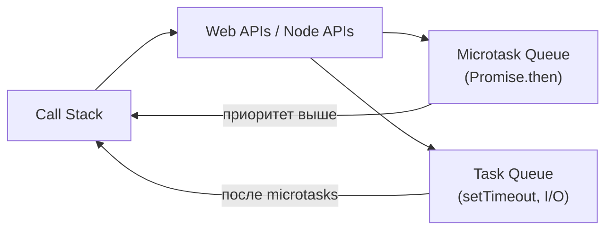

# Уровень 13: Конкурентность и асинхронность

## Concurrency vs Parallelism

Эти два слова часто используют как синонимы — это ошибка.

**Concurrency (конкурентность)** — способность системы управлять несколькими задачами, переключаясь между ними. Один повар с тремя кастрюлями: пока одна кипит — режет овощи, пока другая томится — готовит соус. Задачи не выполняются одновременно физически, но все продвигаются вперёд.

**Parallelism (параллелизм)** — физическое одновременное выполнение задач на нескольких процессорах. Три повара, у каждого своя кастрюля. Здесь задачи выполняются буквально в один момент времени.

JavaScript — **однопоточный**, но **конкурентный**: Event Loop переключается между задачами, создавая иллюзию одновременности.

---

## Event Loop: как это работает

```
Call Stack          Web APIs          Task Queue
┌──────────┐       ┌──────────┐       ┌──────────┐
│ console  │  -->  │setTimeout│  -->  │ callback │
│ .log()   │       │ fetch()  │       │          │
└──────────┘       └──────────┘       └──────────┘
                                      Microtask Queue (приоритет выше!)
                                      ┌──────────┐
                                      │ Promise  │
                                      │ .then()  │
                                      └──────────┘
```

```typescript
console.log('1')                          // Call Stack: выполняется сразу

setTimeout(() => console.log('2'), 0)    // Web API → Task Queue (macrotask)

Promise.resolve().then(() => console.log('3'))  // Microtask Queue

console.log('4')                          // Call Stack: выполняется сразу

// Вывод: 1, 4, 3, 2
// Microtasks (Promise) выполняются ДО macrotasks (setTimeout)
```

Порядок приоритетов: **Call Stack → Microtasks → Macrotasks**.

---

## Promises и async/await

```typescript
// Три состояния Promise
const pending: Promise<number> = new Promise((resolve, reject) => {
  // pending — ещё выполняется
  setTimeout(() => resolve(42), 1000)    // → fulfilled
  // setTimeout(() => reject(new Error('fail')), 1000)  // → rejected
})

// async/await — синтаксический сахар над Promise
async function fetchUserData(userId: string) {
  const user = await fetchUser(userId)           // ждём
  const orders = await fetchOrders(user.id)      // ждём снова
  return { user, orders }
}

// ⚠️ Антипаттерн: await в цикле — запросы идут последовательно
async function loadAllUsersSlowly(ids: string[]) {
  const users = []
  for (const id of ids) {
    users.push(await fetchUser(id))  // каждый запрос ждёт предыдущего
  }
  return users
}

// ✅ Параллельно через Promise.all
async function loadAllUsersFast(ids: string[]) {
  return Promise.all(ids.map(id => fetchUser(id)))  // все запросы одновременно
}
```

### Комбинаторы Promise

```typescript
// Promise.all — ждёт ВСЕ, падает при ПЕРВОЙ ошибке
const [user, orders] = await Promise.all([fetchUser(id), fetchOrders(id)])

// Promise.allSettled — ждёт ВСЕ, не падает при ошибках
const results = await Promise.allSettled([fetchA(), fetchB(), fetchC()])
results.forEach(r => {
  if (r.status === 'fulfilled') use(r.value)
  else handle(r.reason)
})

// Promise.race — возвращает ПЕРВЫЙ завершившийся (успех или ошибка)
const result = await Promise.race([fetchFromPrimary(), fetchFromFallback()])

// Promise.any — возвращает ПЕРВЫЙ успешный, ошибка если все упали
const fastest = await Promise.any([mirror1(), mirror2(), mirror3()])
```

---

## Race Conditions

Race condition — когда результат зависит от порядка выполнения конкурентных операций.

```typescript
// Классический пример: быстрый ввод в поиске
async function handleSearch(query: string) {
  const results = await fetchSearchResults(query)
  setResults(results)  // проблема: результат старого запроса может прийти ПОСЛЕ нового
}

// ✅ AbortController — отменяем предыдущий запрос
function useSearch(query: string) {
  useEffect(() => {
    const controller = new AbortController()

    fetchSearchResults(query, { signal: controller.signal })
      .then(results => setResults(results))
      .catch(err => {
        if (err.name !== 'AbortError') setError(err)
      })

    return () => controller.abort()  // cleanup: отменить при следующем вызове
  }, [query])
}
```

---

## Итог



- **Concurrency** — управление несколькими задачами (не обязательно одновременно)
- **Parallelism** — физически одновременное выполнение
- **JavaScript** — однопоточный, конкурентный через Event Loop
- **Microtasks** (`Promise.then`) выполняются **до** macrotasks (`setTimeout`)
- **await в цикле** — антипаттерн, используй `Promise.all`
- **AbortController** — инструмент отмены асинхронных операций
- **Race condition** — результат зависит от порядка; устраняется через отмену или синхронизацию
