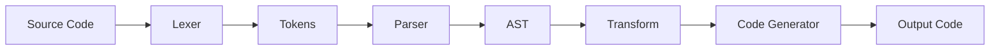
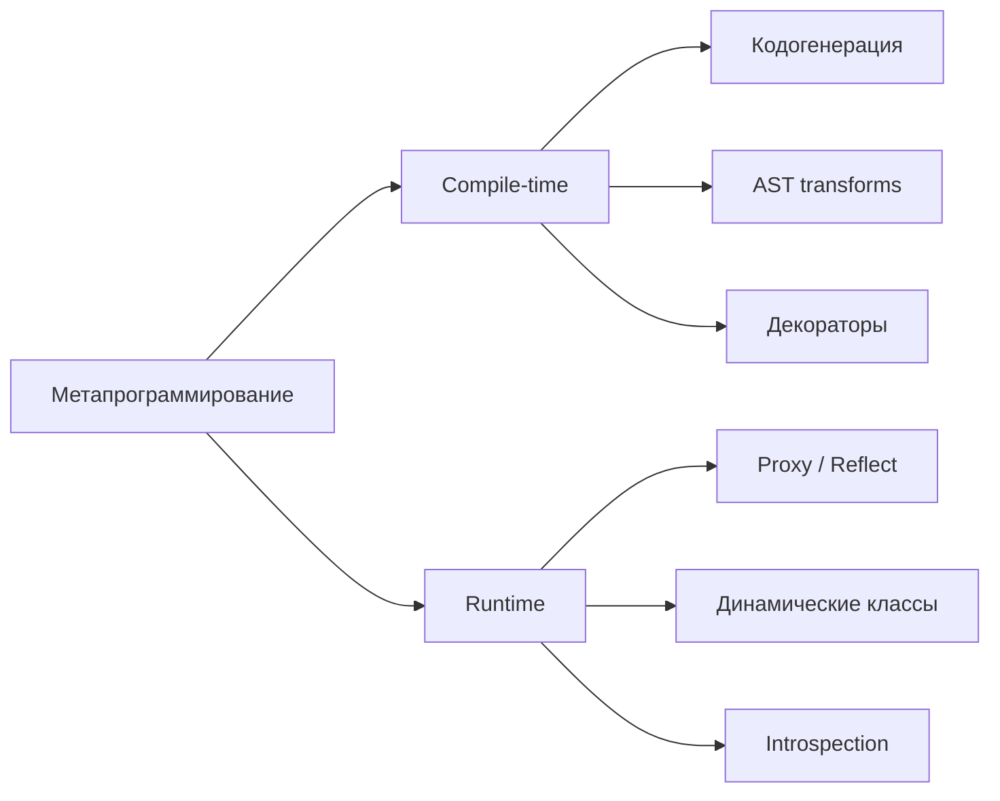

# Уровень 14: Метапрограммирование и DSL — подробная теория

## Метапрограммирование: код о коде

Обычная программа работает с данными — принимает пользовательский ввод, вычисляет результат, сохраняет в базу. Метапрограмма работает с другими программами или с собой: анализирует структуру кода, генерирует новый код, изменяет поведение существующего.

Аналогия: повар готовит еду — это обычная программа. Шеф-повар, который не встаёт у плиты, но пишет рецепты и обучает остальных поваров — это метапрограммирование. Он работает на один уровень выше.

Зачем это нужно:
- **Избежать дублирования между системами**: схема базы данных, API-контракт, типы TypeScript, валидация — всё это об одних данных, но написано в разных местах
- **Автоматизировать рутину**: вместо ручного написания 50 похожих классов — шаблон и генератор
- **Создать выразительные API**: тест-фреймворки, ORM, DI-контейнеры — всё это метапрограммирование

---

## Кодогенерация

### Build-time: из схемы в код

Самый практичный вид метапрограммирования: берём формальное описание (схему) и автоматически генерируем код.

**protobuf → многоязычные типы**

```protobuf
// user.proto — единственный источник истины
message User {
  string id = 1;
  string name = 2;
  string email = 3;
  int32 age = 4;
}
```

Одна схема, один запуск генератора — и вы получаете типизированный код для TypeScript, Python, Go, Java. Изменили схему → перезапустили генерацию → все языки синхронизированы.

**GraphQL Codegen → типизированные хуки**

```typescript
// schema.graphql → generated/types.ts (автоматически)
// Вы пишете только запрос:
const GET_USER = gql`
  query GetUser($id: ID!) {
    user(id: $id) {
      id
      name
      email
    }
  }
`

// После codegen получаете готовый типизированный хук:
const { data, loading } = useGetUserQuery({ variables: { id: userId } })
// data.user.name — TypeScript знает тип, IDE подсказывает
```

Без кодогенерации: `const data: any = ...` и ручная поддержка типов в двух местах. После кодогенерации: типы всегда соответствуют схеме.

**OpenAPI → TypeScript SDK**

```bash
# openapi.yaml → src/api/generated.ts
npx openapi-typescript openapi.yaml --output src/api/generated.ts
```

Все DTO, все эндпоинты, все статусы — типизированы. Если бэкенд изменил тип поля — `tsc` покажет ошибку ещё до деплоя.

### Template-based генерация

Handlebars или EJS для генерации файлов по шаблону:

```typescript
import Handlebars from 'handlebars'
import fs from 'fs'

const template = Handlebars.compile(`
// Этот файл сгенерирован автоматически. Не редактируйте вручную.
export const {{name}}Routes = {
  {{#each endpoints}}
  {{this.method}}: '{{this.path}}',
  {{/each}}
} as const
`)

const code = template({
  name: 'User',
  endpoints: [
    { method: 'getById', path: '/users/:id' },
    { method: 'getList', path: '/users' },
    { method: 'create', path: '/users' },
  ],
})

fs.writeFileSync('src/routes/user-routes.ts', code)
```

Используется в CLI-инструментах (`nest generate`, `nx generate`), scaffolding и create-*-app.

### AST-based трансформации (codemods)

Самый мощный вид кодогенерации: читаем AST, трансформируем, пишем обратно. Позволяет делать массовый рефакторинг:

```typescript
// Codemod: заменить все require() на import в проекте
import { parse, print } from 'recast'
import * as parser from 'recast/parsers/typescript'

function transformRequireToImport(source: string): string {
  const ast = parse(source, { parser })

  // Обходим дерево и заменяем узлы
  // require('fs') → import fs from 'fs'

  return print(ast).code
}
```

Babel plugins, ESLint rules, TypeScript compiler API — всё это AST-based метапрограммирование.

---

## Рефлексия и динамическое метапрограммирование

### Runtime introspection

JavaScript имеет встроенные инструменты для изучения объектов в рантайме:

```typescript
function inspectObject(obj: unknown): void {
  console.log('Type:', typeof obj)
  console.log('Is array:', Array.isArray(obj))
  console.log('Constructor:', (obj as object)?.constructor?.name)

  if (obj && typeof obj === 'object') {
    console.log('Own keys:', Object.keys(obj))
    console.log('All keys:', Object.getOwnPropertyNames(obj))

    // Проходим по прототипной цепочке
    let proto = Object.getPrototypeOf(obj)
    while (proto && proto !== Object.prototype) {
      console.log('Prototype methods:', Object.getOwnPropertyNames(proto))
      proto = Object.getPrototypeOf(proto)
    }
  }
}
```

### Proxy: ловушки для объекта

`Proxy` — это обёртка вокруг объекта, которая перехватывает базовые операции. Это как таможня: любое действие с объектом сначала проходит через вашу проверку.

```typescript
// Пример 1: Валидирующий proxy
function createValidated<T extends object>(
  target: T,
  validators: Partial<Record<keyof T, (value: unknown) => boolean>>,
): T {
  return new Proxy(target, {
    set(obj, key, value) {
      const validator = validators[key as keyof T]
      if (validator && !validator(value)) {
        throw new TypeError(`Invalid value for ${String(key)}: ${value}`)
      }
      return Reflect.set(obj, key, value)
    },
  })
}

const user = createValidated(
  { name: '', age: 0 },
  {
    age: (v) => typeof v === 'number' && v >= 0 && v <= 150,
    name: (v) => typeof v === 'string' && v.length > 0,
  },
)

user.age = 25    // OK
user.age = -1    // TypeError: Invalid value for age: -1
```

```typescript
// Пример 2: Отслеживание обращений (для ORM-like dirty tracking)
function trackChanges<T extends object>(target: T): { proxy: T; changes: Set<string> } {
  const changes = new Set<string>()

  const proxy = new Proxy(target, {
    set(obj, key, value) {
      changes.add(String(key))
      return Reflect.set(obj, key, value)
    },
  })

  return { proxy, changes }
}

const { proxy: user, changes } = trackChanges({ name: 'Alice', age: 25 })
user.name = 'Bob'
user.age = 26
console.log(changes) // Set { 'name', 'age' }
// Теперь ORM знает какие поля изменились и может сделать UPDATE только для них
```

```typescript
// Пример 3: Реактивная система (упрощённый Vue 3)
type Effect = () => void
let currentEffect: Effect | null = null

function reactive<T extends object>(target: T): T {
  const subscribers = new Map<string | symbol, Set<Effect>>()

  return new Proxy(target, {
    get(obj, key) {
      // Отслеживаем кто читает это свойство
      if (currentEffect) {
        if (!subscribers.has(key)) subscribers.set(key, new Set())
        subscribers.get(key)!.add(currentEffect)
      }
      return Reflect.get(obj, key)
    },
    set(obj, key, value) {
      const result = Reflect.set(obj, key, value)
      // Уведомляем всех подписчиков этого свойства
      subscribers.get(key)?.forEach(effect => effect())
      return result
    },
  })
}

const state = reactive({ count: 0 })

function watchEffect(fn: Effect) {
  currentEffect = fn
  fn() // первый запуск — регистрируем зависимости
  currentEffect = null
}

watchEffect(() => {
  console.log('Count changed:', state.count)
})

state.count = 1 // → "Count changed: 1"
state.count = 2 // → "Count changed: 2"
```

### Reflect API

`Reflect` — объект-зеркало стандартных операций JavaScript. Его методы соответствуют ловушкам Proxy:

```typescript
// Без Reflect — можно сделать неправильно
const handler: ProxyHandler<object> = {
  get(obj, key) {
    // ❌ Прямое обращение нарушает правила (прототипы, this)
    return (obj as Record<string | symbol, unknown>)[key]
  },
}

// С Reflect — всегда правильная семантика
const handler2: ProxyHandler<object> = {
  get(obj, key, receiver) {
    // ✅ receiver правильно прокидывает this для геттеров
    return Reflect.get(obj, key, receiver)
  },
}
```

Reflect также полезен сам по себе:

```typescript
// Проверить существование метода перед вызовом
if (Reflect.has(obj, 'toString')) {
  console.log(Reflect.apply(obj.toString, obj, []))
}

// Создать экземпляр динамически
const instance = Reflect.construct(SomeClass, [arg1, arg2])
```

### Декораторы TC39

Декораторы — синтаксис для добавления метаданных и поведения к классам и их членам. Статус: Stage 3 в TC39, поддерживается в TypeScript 5+.

```typescript
// Декоратор для логирования вызовов методов
function log(target: unknown, context: ClassMethodDecoratorContext) {
  const methodName = String(context.name)

  return function (this: unknown, ...args: unknown[]) {
    console.log(`[${new Date().toISOString()}] ${methodName}(${JSON.stringify(args)})`)
    // @ts-expect-error — dynamic this
    const result = target.apply(this, args)
    console.log(`[${new Date().toISOString()}] ${methodName} → ${JSON.stringify(result)}`)
    return result
  }
}

// Декоратор для мемоизации
function memoize(target: unknown, context: ClassMethodDecoratorContext) {
  const cache = new Map<string, unknown>()

  return function (this: unknown, ...args: unknown[]) {
    const key = JSON.stringify(args)
    if (cache.has(key)) return cache.get(key)
    // @ts-expect-error — dynamic this
    const result = target.apply(this, args)
    cache.set(key, result)
    return result
  }
}

class ReportService {
  @log
  async generateReport(userId: string, period: string): Promise<Report> {
    // Автоматически логируется каждый вызов
    return fetchAndBuildReport(userId, period)
  }

  @memoize
  calculateTax(amount: number, rate: number): number {
    // Результат кэшируется по аргументам
    return amount * rate
  }
}
```

Декораторы широко используются в:
- **NestJS**: `@Controller`, `@Injectable`, `@Get`, `@Body`
- **TypeORM**: `@Entity`, `@Column`, `@ManyToOne`
- **class-validator**: `@IsEmail`, `@MinLength`, `@IsNotEmpty`

---

## DSL: язык для домена

### Внутренний DSL

Внутренний DSL (Internal DSL, также embedded DSL) — это API на хост-языке, которое читается как специализированный язык. Он не требует парсера: синтаксис хост-языка уже обеспечивает структуру.

**Fluent API через `return this`**:

```typescript
// Builder-паттерн для HTTP-запросов
class RequestBuilder {
  private url = ''
  private method: 'GET' | 'POST' | 'PUT' | 'DELETE' = 'GET'
  private headers: Record<string, string> = {}
  private body: unknown = undefined
  private timeoutMs = 5000

  to(url: string): this {
    this.url = url
    return this
  }

  withMethod(method: 'GET' | 'POST' | 'PUT' | 'DELETE'): this {
    this.method = method
    return this
  }

  withHeader(key: string, value: string): this {
    this.headers[key] = value
    return this
  }

  withBody(data: unknown): this {
    this.body = data
    return this
  }

  withTimeout(ms: number): this {
    this.timeoutMs = ms
    return this
  }

  async send<T>(): Promise<T> {
    const response = await fetch(this.url, {
      method: this.method,
      headers: this.headers,
      body: this.body ? JSON.stringify(this.body) : undefined,
      signal: AbortSignal.timeout(this.timeoutMs),
    })
    return response.json()
  }
}

// Читается почти как английское предложение:
const user = await new RequestBuilder()
  .to('https://api.example.com/users/42')
  .withMethod('GET')
  .withHeader('Authorization', 'Bearer token')
  .withTimeout(3000)
  .send<User>()
```

```typescript
// Пример: внутренний DSL для валидации (zod-like)
class Schema<T> {
  private rules: Array<(value: unknown) => string | null> = []

  static string(): Schema<string> {
    const schema = new Schema<string>()
    schema.rules.push(v => typeof v === 'string' ? null : 'Must be a string')
    return schema
  }

  min(length: number): this {
    this.rules.push(v =>
      typeof v === 'string' && v.length >= length
        ? null
        : `Must be at least ${length} characters`,
    )
    return this
  }

  max(length: number): this {
    this.rules.push(v =>
      typeof v === 'string' && v.length <= length
        ? null
        : `Must be at most ${length} characters`,
    )
    return this
  }

  email(): this {
    this.rules.push(v =>
      typeof v === 'string' && /^[^\s@]+@[^\s@]+\.[^\s@]+$/.test(v)
        ? null
        : 'Must be a valid email',
    )
    return this
  }

  validate(value: unknown): string[] {
    return this.rules.map(rule => rule(value)).filter(Boolean) as string[]
  }
}

// Читается как объявление схемы:
const emailSchema = Schema.string().min(5).max(100).email()
const errors = emailSchema.validate('not-an-email')
// → ['Must be a valid email']
```

Реальные примеры внутренних DSL:
- **Jest**: `expect(x).toBe(y)`, `describe`, `it`, `beforeEach`
- **Drizzle ORM**: `db.select().from(table).where(eq(field, value))`
- **Zod**: `z.object({ name: z.string().min(1), age: z.number().positive() })`
- **Prisma Client**: `prisma.user.findMany({ where: { isActive: true } })`

### Внешний DSL

Внешний DSL — отдельный язык со своим синтаксисом и парсером. Он не встроен в хост-язык, а обрабатывается отдельным инструментом.

```sql
-- SQL — внешний DSL для работы с реляционными данными
SELECT u.name, COUNT(o.id) as order_count
FROM users u
LEFT JOIN orders o ON o.user_id = u.id
WHERE u.created_at > '2024-01-01'
GROUP BY u.id
HAVING COUNT(o.id) > 5
ORDER BY order_count DESC
```

```graphql
# GraphQL — внешний DSL для запросов к API
query GetUserWithOrders($userId: ID!) {
  user(id: $userId) {
    name
    email
    orders(status: ACTIVE) {
      id
      total
      items {
        product {
          name
          price
        }
      }
    }
  }
}
```

```hcl
# Terraform HCL — внешний DSL для описания инфраструктуры
resource "aws_instance" "web_server" {
  ami           = "ami-0c55b159cbfafe1f0"
  instance_type = "t3.micro"

  tags = {
    Name        = "WebServer"
    Environment = "production"
  }
}
```

Когда оправдан внешний DSL:
- Домен кардинально отличается от кода (БД, инфраструктура, конфигурация)
- Им пользуются не только программисты (аналитики пишут SQL, DevOps — Terraform)
- Нужна независимость от языка хоста (GraphQL работает с любым языком)

Цена внешнего DSL: нужно писать или использовать готовый парсер, нет поддержки IDE из коробки, ошибки синтаксиса — только в рантайме.

---

## AST: дерево разбора программы

### Что такое AST

AST (Abstract Syntax Tree) — иерархическое представление кода. «Abstract» означает: лишние детали (пробелы, скобки) убраны, остаётся только структура.

Возьмём простое выражение: `const x = 2 + 3 * 4`

```
VariableDeclaration (const)
└── VariableDeclarator
    ├── Identifier (x)
    └── BinaryExpression (+)
        ├── NumericLiteral (2)
        └── BinaryExpression (*)
            ├── NumericLiteral (3)
            └── NumericLiteral (4)
```

Дерево уже несёт информацию о приоритете операций — `3 * 4` вычисляется раньше, потому что это отдельный поддерево.

### Pipeline: от кода к коду



**Lexer** (токенизатор) — разбивает строку символов на токены: ключевые слова, идентификаторы, операторы, литералы. Например, `const x = 2 + 3` → `[CONST, IDENT(x), ASSIGN, NUM(2), PLUS, NUM(3)]`.

**Parser** — принимает токены и строит AST согласно грамматике языка.

**Transform** — обходит AST и трансформирует узлы. Это то, что делают Babel plugins.

**Code Generator** — обходит трансформированный AST и генерирует выходной код.

### Пример: простой парсер арифметики

```typescript
type ASTNode =
  | { type: 'Number'; value: number }
  | { type: 'BinaryOp'; op: '+' | '-' | '*' | '/'; left: ASTNode; right: ASTNode }

// Вычислить AST-дерево
function evaluate(node: ASTNode): number {
  if (node.type === 'Number') return node.value

  const left = evaluate(node.left)
  const right = evaluate(node.right)

  switch (node.op) {
    case '+': return left + right
    case '-': return left - right
    case '*': return left * right
    case '/': return left / right
  }
}

// AST для выражения: 2 + 3 * 4
const ast: ASTNode = {
  type: 'BinaryOp',
  op: '+',
  left: { type: 'Number', value: 2 },
  right: {
    type: 'BinaryOp',
    op: '*',
    left: { type: 'Number', value: 3 },
    right: { type: 'Number', value: 4 },
  },
}

console.log(evaluate(ast)) // 14
```

### Инструменты для работы с AST

**Babel** — трансформация JavaScript/TypeScript. Babel plugins получают AST и возвращают изменённый:

```typescript
// Babel plugin: заменить все console.log на нашу logging-функцию
export default function ({ types: t }) {
  return {
    visitor: {
      CallExpression(path) {
        if (
          t.isMemberExpression(path.node.callee) &&
          t.isIdentifier(path.node.callee.object, { name: 'console' }) &&
          t.isIdentifier(path.node.callee.property, { name: 'log' })
        ) {
          path.node.callee = t.memberExpression(
            t.identifier('logger'),
            t.identifier('info'),
          )
        }
      },
    },
  }
}
```

**ts-morph** — TypeScript Compiler API с удобным API:

```typescript
import { Project } from 'ts-morph'

const project = new Project()
project.addSourceFilesAtPaths('src/**/*.ts')

for (const sourceFile of project.getSourceFiles()) {
  // Найти все функции без возвращаемого типа
  const functions = sourceFile.getFunctions()
  for (const fn of functions) {
    if (!fn.getReturnTypeNode()) {
      console.log(`${sourceFile.getFilePath()}: ${fn.getName()} — нет возвращаемого типа`)
    }
  }
}
```

---

## Виды метапрограммирования



---

## Частые ошибки начинающих

### Proxy вместо простого кода

```typescript
// ❌ Proxy там, где достаточно простой функции
const logger = new Proxy({}, {
  get(_, key) {
    return (...args: unknown[]) => console.log(`[${String(key)}]`, ...args)
  },
})

// ✅ Обычный объект делает то же самое понятнее
const logger = {
  info: (...args: unknown[]) => console.log('[info]', ...args),
  warn: (...args: unknown[]) => console.log('[warn]', ...args),
  error: (...args: unknown[]) => console.log('[error]', ...args),
}
```

Почему это проблема: Proxy скрывает, что внутри. Ошибки в таком коде труднее дебажить, TypeScript хуже типизирует.

### Fluent API без возврата `this`

```typescript
// ❌ Забыли вернуть this — цепочка ломается
class QueryBuilder {
  private conditions: string[] = []

  where(condition: string) {
    this.conditions.push(condition)
    // нет return this!
  }
}

const query = new QueryBuilder()
  .where('age > 18')
  .where('isActive = true') // TypeError: Cannot read property 'where' of undefined
```

```typescript
// ✅ Каждый метод возвращает this
class QueryBuilder {
  private conditions: string[] = []

  where(condition: string): this {
    this.conditions.push(condition)
    return this
  }

  build(): string {
    return `WHERE ${this.conditions.join(' AND ')}`
  }
}

const query = new QueryBuilder()
  .where('age > 18')
  .where('isActive = true')
  .build()
// → "WHERE age > 18 AND isActive = true"
```

### Внешний DSL когда достаточно внутреннего

```typescript
// ❌ Написали собственный парсер для конфигурации
const config = parseMyDSL(`
  route /api/users {
    method GET
    handler UserController.list
    auth required
  }
`)

// ✅ То же самое через внутренний DSL — никакого парсера
const routes = [
  {
    path: '/api/users',
    method: 'GET' as const,
    handler: UserController.list,
    auth: 'required' as const,
  },
]
```

Внешний DSL оправдан только если предметная область действительно требует своего синтаксиса, или если не-программисты будут писать этот код.

---

## Итог

- **Кодогенерация** — источник истины один, всё остальное генерируется: меньше ошибок синхронизации, автоматическая типобезопасность
- **Proxy** — перехват операций с объектом: валидация, отслеживание изменений, реактивность; использовать с осторожностью
- **Reflect** — правильная семантика базовых операций; всегда используйте вместе с Proxy
- **Декораторы** — декларативное добавление поведения; основа NestJS, TypeORM, class-validator
- **Внутренний DSL** — fluent API через `return this`; выразительно, но без накладных расходов парсера
- **Внешний DSL** — когда домен требует своего языка; цена — парсер и отладка
- **AST** — основа линтеров, форматтеров, transpilers, codemods; Source → Tokens → AST → Transform → Output
- Метапрограммирование — мощный инструмент; применять только когда выигрыш очевиден и существенен
