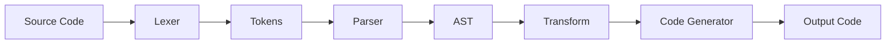

# Уровень 14: Метапрограммирование и DSL

## Код, который пишет код

Представьте повара, который не готовит сам, а составляет рецепты для других поваров. Он работает с едой на мета-уровне: не жарит стейк — описывает, как жарить стейк. Метапрограммирование — то же самое, только в коде: программа анализирует, генерирует или трансформирует другие программы.

---

## Кодогенерация: DRY между системами

Самый распространённый случай метапрограммирования — когда у вас есть источник истины в одном месте (схема базы данных, API-контракт, protobuf), а из него нужно сгенерировать код в другом:

```typescript
// protobuf-схема → TypeScript типы (build-time)
// user.proto → user.pb.ts (автоматически)

// Вместо ручного написания дублирующихся типов:
interface User {
  id: string
  name: string
  email: string
}

// Генератор создаёт их из одного источника для всех языков сразу
// Изменение схемы → перегенерация → типы синхронизированы
```

Примеры из реальной жизни: **protobuf** → TypeScript + Python + Go, **GraphQL codegen** → типизированные хуки, **OpenAPI** → TypeScript SDK.

---

## Proxy и Reflect: перехват на лету

`Proxy` позволяет перехватывать любые операции с объектом: чтение, запись, удаление свойств. Vue 3 использует это для реактивности:

```typescript
function makeReactive<T extends object>(target: T): T {
  return new Proxy(target, {
    get(obj, key) {
      console.log(`Читаем свойство: ${String(key)}`)
      return Reflect.get(obj, key)
    },
    set(obj, key, value) {
      console.log(`Свойство ${String(key)} изменено: ${value}`)
      return Reflect.set(obj, key, value)
    },
  })
}

const state = makeReactive({ count: 0 })
state.count = 42 // → "Свойство count изменено: 42"
```

`Reflect` — зеркало стандартных операций объекта. Используется вместе с `Proxy`: делаем то же, что делал бы объект по умолчанию, но добавляем логику вокруг.

---

## DSL: язык для домена

DSL (Domain-Specific Language) — язык, заточенный под конкретную предметную область.

**Внутренний DSL** встроен в основной язык. Он использует его синтаксис, но создаёт ощущение специального языка:

```typescript
// Jest — внутренний DSL для тестов
expect(user.age).toBeGreaterThan(18)
expect(response.status).toBe(200)

// Drizzle ORM — внутренний DSL для запросов
const result = await db
  .select()
  .from(users)
  .where(eq(users.isActive, true))
  .orderBy(users.createdAt)
```

**Внешний DSL** — отдельный синтаксис со своим парсером: SQL, CSS, GraphQL, Terraform HCL.

---

## Декораторы: метаданные для классов

Декораторы (TC39 Stage 3) — способ добавить поведение к классам и методам декларативно:

```typescript
function log(target: any, key: string, descriptor: PropertyDescriptor) {
  const original = descriptor.value
  descriptor.value = function (...args: unknown[]) {
    console.log(`Вызов ${key}(${JSON.stringify(args)})`)
    return original.apply(this, args)
  }
  return descriptor
}

class UserService {
  @log
  async createUser(email: string) {
    // Автоматически логируется каждый вызов
  }
}
```

Широко используются в NestJS, TypeORM, class-validator.

---

## AST: структура кода как дерево

AST (Abstract Syntax Tree) — дерево, представляющее синтаксическую структуру кода. На нём работают линтеры, форматтеры, transpilers:



Выражение `2 + 3 * 4` в AST:

```
BinaryExpression (+)
├── NumericLiteral (2)
└── BinaryExpression (*)
    ├── NumericLiteral (3)
    └── NumericLiteral (4)
```

Инструменты для работы с AST JavaScript/TypeScript: **Babel**, **ts-morph**, **recast**, **acorn**.

---

## Когда метапрограммирование оправдано

- Боятся повторяться между системами (schema → types → validation → docs)
- Нужна декларативность в сложном домене (ORM, DI-контейнер, тест-фреймворк)
- Стандартный язык плохо выражает предметную область (конфигурация инфраструктуры)

⚠️ Метапрограммирование усложняет отладку и читаемость. Применяйте только когда выигрыш очевиден и существенен.

---

## Итог

- **Кодогенерация** — DRY между системами: одна схема, много языков
- **Proxy/Reflect** — перехват операций с объектом в рантайме
- **Декораторы** — декларативное добавление поведения к классам
- **Внутренний DSL** — fluent API, builder pattern, цепочки методов
- **Внешний DSL** — SQL, GraphQL, CSS — отдельный синтаксис, свой парсер
- **AST** — дерево кода; основа линтеров, форматтеров, трансформаций
