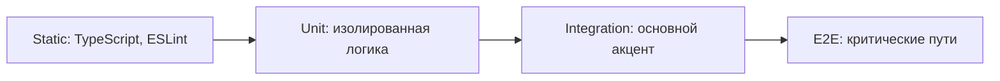

# Уровень 15: Тестирование — подробная теория

## Зачем вообще писать тесты

Новички думают, что тесты нужны для поиска багов. Опытные разработчики знают: тесты нужны для **уверенности при изменении кода**.

Аналогия: строительная инспекция не строит здание. Она проверяет фундамент, несущие конструкции и электрику — то, что дорого исправлять после сдачи. Инспекция не гарантирует, что кровля никогда не протечёт. Но она гарантирует, что фундамент надёжен.

Три главных причины писать тесты:

**1. Защита от регрессий**. Вы изменили функцию расчёта скидки — тест мгновенно скажет, сломали ли вы соседние сценарии. Без тестов это выяснится от пользователя.

**2. Документация поведения**. Хороший тест описывает, как система должна себя вести. `it('should apply 20% discount for premium users with orders over 100$')` — это спецификация, не просто код.

**3. Дизайн через тестируемость**. Код, который легко тестировать, как правило, хорошо спроектирован: слабые зависимости, чёткие интерфейсы, одна ответственность. Если функцию тяжело тестировать — это сигнал о проблеме в дизайне.

---

## Пирамида тестирования

Классическая модель Майка Кона (2009) описывает три уровня:

```
         /\
        /  \
       / E2E\
      /------\
     /        \
    /Integration\
   /------------\
  /              \
 /   Unit Tests   \
/------------------\
```

### Unit-тесты

Тестируют одну функцию или модуль **в полной изоляции** от зависимостей.

```typescript
// Чистая функция — идеальна для unit-тестов
function calculateDiscount(price: number, tier: 'standard' | 'premium' | 'vip'): number {
  const rates = { standard: 0, premium: 0.2, vip: 0.35 }
  return price * (1 - rates[tier])
}

// Тесты быстрые, детерминированные, никаких зависимостей
describe('calculateDiscount', () => {
  it('applies no discount for standard tier', () => {
    expect(calculateDiscount(100, 'standard')).toBe(100)
  })

  it('applies 20% discount for premium tier', () => {
    expect(calculateDiscount(100, 'premium')).toBe(80)
  })

  it('applies 35% discount for vip tier', () => {
    expect(calculateDiscount(100, 'vip')).toBe(65)
  })

  it('handles zero price', () => {
    expect(calculateDiscount(0, 'premium')).toBe(0)
  })
})
```

Характеристики unit-тестов:
- Выполняются за миллисекунды
- Детерминированные: всегда дают одинаковый результат
- Изолированные: не зависят от БД, сети, файловой системы
- Их может быть сотни и тысячи

### Integration-тесты

Тестируют взаимодействие нескольких компонентов. Используют реальные зависимости там, где это важно.

```typescript
// Integration-тест: сервис + репозиторий + реальная база
describe('UserService.createUser (integration)', () => {
  let db: Database
  let userService: UserService

  beforeAll(async () => {
    db = await createTestDatabase() // реальная SQLite или тестовый PostgreSQL
    userService = new UserService(new UserRepository(db))
  })

  afterAll(async () => {
    await db.close()
  })

  afterEach(async () => {
    await db.run('DELETE FROM users') // чистим после каждого теста
  })

  it('should save user and return with generated id', async () => {
    const user = await userService.createUser({
      email: 'alice@example.com',
      name: 'Alice',
    })

    expect(user.id).toBeDefined()
    expect(user.email).toBe('alice@example.com')

    // Проверяем что данные реально сохранились
    const saved = await userService.findById(user.id)
    expect(saved?.name).toBe('Alice')
  })

  it('should throw on duplicate email', async () => {
    await userService.createUser({ email: 'bob@example.com', name: 'Bob' })
    await expect(
      userService.createUser({ email: 'bob@example.com', name: 'Bob2' }),
    ).rejects.toThrow('Email already exists')
  })
})
```

Integration-тесты медленнее unit, но тестируют реальные взаимодействия: SQL-запросы, транзакции, constraints.

### E2E-тесты

Тестируют полный пользовательский сценарий через реальный интерфейс. Playwright, Cypress.

```typescript
// E2E с Playwright
test('user can register and see dashboard', async ({ page }) => {
  await page.goto('/register')

  await page.fill('[name="email"]', 'testuser@example.com')
  await page.fill('[name="password"]', 'securepass123')
  await page.fill('[name="name"]', 'Test User')
  await page.click('[type="submit"]')

  // Ожидаем редирект на дашборд
  await page.waitForURL('/dashboard')
  await expect(page.locator('h1')).toContainText('Welcome, Test User')
})
```

E2E-тесты дорогие: медленно выполняются, хрупко (зависят от DOM-структуры, сети, данных), сложно дебажить. Их должно быть мало — только критические пользовательские пути.

### Trophy Model: акцент на Integration

Кент К. Доддс (автор Testing Library) предложил альтернативу пирамиде — «Trophy»:



Идея: integration-тесты дают лучшее соотношение цены и ценности. Они тестируют реальное поведение (в отличие от unit с моками), но быстрее E2E. Особенно хорошо работает с Testing Library для React: тесты имитируют пользователя, а не внутренности компонента.

---

## AAA паттерн: Arrange, Act, Assert

Универсальная структура любого теста:

```typescript
it('should send welcome email on successful registration', async () => {
  // ── Arrange: подготовка ──────────────────────────────────────────
  const emailService = { sendWelcome: jest.fn().mockResolvedValue(undefined) }
  const userRepo = new InMemoryUserRepository()
  const service = new RegistrationService(userRepo, emailService)

  const dto = { email: 'alice@example.com', name: 'Alice', password: 'pass123' }

  // ── Act: тестируемое действие ────────────────────────────────────
  await service.register(dto)

  // ── Assert: проверка результатов ─────────────────────────────────
  expect(emailService.sendWelcome).toHaveBeenCalledOnce()
  expect(emailService.sendWelcome).toHaveBeenCalledWith('alice@example.com', 'Alice')
})
```

Правила хорошего теста:
- **Один Act на тест**: если нужно два `Act` — это два теста
- **Один концепт на тест**: не проверяйте скидку И логирование в одном `it`
- **Описательное имя**: `it('should throw if user is already banned')` — читается как спецификация

⚠️ Частая ошибка: слишком длинный Arrange. Если подготовка занимает 30 строк — это сигнал либо к вынесению в фабрику, либо к пересмотру дизайна.

```typescript
// ❌ Arrange перегружен — что именно мы тестируем?
it('creates order', async () => {
  const db = await createTestDatabase()
  const userRepo = new UserRepository(db)
  const productRepo = new ProductRepository(db)
  const orderRepo = new OrderRepository(db)
  const pricingService = new PricingService()
  const inventoryService = new InventoryService(productRepo)
  const emailService = new EmailService(config.smtp)
  const service = new OrderService(orderRepo, userRepo, productRepo, pricingService, inventoryService, emailService)
  const user = await userRepo.save({ email: 'a@b.com', tier: 'premium' })
  const product = await productRepo.save({ name: 'Widget', price: 100, stock: 5 })
  // ...ещё 10 строк
})

// ✅ Фабрика скрывает несущественные детали
it('applies premium discount when creating order', async () => {
  const { service } = await createOrderTestFixtures()
  const user = createPremiumUser()
  const product = createProduct({ price: 100 })

  const order = await service.createOrder(user, [{ product, quantity: 1 }])

  expect(order.total).toBe(80)
})
```

---

## Test doubles: инструменты подмены

Martin Fowler выделяет пять видов test doubles. На практике в JavaScript чаще говорят о четырёх:

### Stub

Возвращает заранее заданные данные. Не проверяет, как его вызвали.

```typescript
// Stub: нам нужны данные, поведение не важно
const userRepoStub = {
  findById: async (_id: string) => ({
    id: '1',
    name: 'Alice',
    tier: 'premium' as const,
    isActive: true,
  }),
}

const service = new OrderService(userRepoStub, ...)
const order = await service.createOrder({ userId: '1', items: [...] })
expect(order.discountApplied).toBe(true)
```

### Mock

Имитирует объект И проверяет, что с ним взаимодействовали нужным образом.

```typescript
// Mock: нам важно что метод был вызван с конкретными аргументами
const emailServiceMock = {
  sendOrderConfirmation: jest.fn().mockResolvedValue(undefined),
}

await orderService.placeOrder(order, emailServiceMock)

expect(emailServiceMock.sendOrderConfirmation).toHaveBeenCalledTimes(1)
expect(emailServiceMock.sendOrderConfirmation).toHaveBeenCalledWith(
  expect.objectContaining({ orderId: order.id, email: order.userEmail }),
)
```

### Spy

Оборачивает реальный объект, позволяя наблюдать вызовы, не меняя поведение.

```typescript
// Spy: реальная функция выполняется, мы только наблюдаем
const consoleSpy = jest.spyOn(console, 'warn')

await service.processPayment({ amount: -100, currency: 'USD' })

// Реальный console.warn выполнился, но мы знаем что он был вызван
expect(consoleSpy).toHaveBeenCalledWith(expect.stringContaining('negative amount'))
consoleSpy.mockRestore()
```

### Fake

Упрощённая, но работающая реализация. Используется вместо реальной инфраструктуры.

```typescript
// Fake: полноценная реализация репозитория без реальной БД
class InMemoryUserRepository implements UserRepository {
  private storage = new Map<string, User>()

  async findById(id: string): Promise<User | null> {
    return this.storage.get(id) ?? null
  }

  async findByEmail(email: string): Promise<User | null> {
    return Array.from(this.storage.values()).find(u => u.email === email) ?? null
  }

  async save(user: User): Promise<User> {
    const withId = { ...user, id: user.id ?? crypto.randomUUID() }
    this.storage.set(withId.id, withId)
    return withId
  }

  async delete(id: string): Promise<void> {
    this.storage.delete(id)
  }
}

// Fake позволяет запускать integration-тесты без реальной БД
const repo = new InMemoryUserRepository()
const service = new UserService(repo)
```

### Правило: не мокайте то, чем не владеете

Моки на внешние библиотеки — опасная практика:

```typescript
// ❌ Мок на axios — тестируем предположение об API axios
jest.mock('axios')
const axiosMock = axios as jest.Mocked<typeof axios>
axiosMock.get.mockResolvedValue({ data: { id: 1 } })

// Проблема: если axios изменит API, тест пройдёт, но код сломается
// Мы тестируем не реальное поведение axios, а наш выдуманный mock
```

```typescript
// ✅ Мокайте на границе — на своём интерфейсе
interface HttpClient {
  get<T>(url: string): Promise<T>
}

// Теперь мок — на свой интерфейс, а не на чужую библиотеку
const httpClientMock: jest.Mocked<HttpClient> = {
  get: jest.fn(),
}

httpClientMock.get.mockResolvedValue({ id: 1 })
const service = new UserApiService(httpClientMock)
```

---

## Coverage: читать правильно

Coverage (покрытие) — метрика, показывающая какой процент кода выполняется во время тестов.

Виды coverage:
- **Lines**: сколько строк выполнено
- **Branches**: сколько веток (`if/else`, тернарный оператор) покрыто
- **Functions**: какой процент функций вызван
- **Statements**: отдельные выражения (более детально чем lines)

```typescript
function calculateShipping(weight: number, express: boolean): number {
  if (weight > 10) {          // ← branch 1: true/false
    return express ? 50 : 30  // ← branch 2: true/false (express тест)
  }
  return express ? 20 : 10    // ← branch 3: true/false
}

// Если тест только: calculateShipping(5, false) → 10
// Lines coverage: 75% (строка с weight > 10 пройдена, ветка true — нет)
// Branches coverage: 33% (только одна из шести веток покрыта)
```

**100% coverage не означает отсутствие багов:**

```typescript
function formatDate(date: Date): string {
  return date.toLocaleDateString('ru-RU')
}

// Этот тест даёт 100% line coverage, но ничего не проверяет
it('covers formatDate', () => {
  formatDate(new Date()) // вызвали — строка покрыта
  // нет expect!
})
```

Правильное использование coverage:
- Установить **минимальный порог** (70-80%) как gate в CI — упасть если ниже
- Использовать как **инструмент поиска**: «вот непокрытая ветка — а есть ли тест на этот кейс?»
- **Не ставить цель 100%** — некоторые вещи (обработка OS-сигналов, краш-восстановление) тяжело покрыть

### Mutation testing: качество тестов

Coverage говорит, что код выполнялся. Mutation testing проверяет, что тесты действительно ловят баги:

```
1. Автоматически изменить код (мутация): return a + b → return a - b
2. Запустить тесты
3. Если тесты прошли → тест не ловит этот баг → "выживший мутант"
4. Много выживших мутантов → тесты слабые
```

Инструменты: **Stryker** для JavaScript/TypeScript.

---

## TDD: Test-Driven Development

Цикл Red → Green → Refactor:

```
1. RED:    написать тест, который падает (код ещё не написан)
2. GREEN:  написать минимальный код чтобы тест прошёл
3. REFACTOR: улучшить код, не ломая тесты
```

Пример: реализуем `Stack` через TDD:

```typescript
// Шаг 1 (RED): пишем тест — Stack ещё не существует
it('should return undefined when popping from empty stack', () => {
  const stack = new Stack<number>()
  expect(stack.pop()).toBeUndefined()
})

// Шаг 2 (GREEN): минимальная реализация
class Stack<T> {
  pop(): T | undefined {
    return undefined
  }
}

// Шаг 3 (RED): следующий тест
it('should return last pushed item', () => {
  const stack = new Stack<number>()
  stack.push(1)
  stack.push(2)
  expect(stack.pop()).toBe(2)
})

// Шаг 4 (GREEN): расширяем реализацию
class Stack<T> {
  private items: T[] = []

  push(item: T): void {
    this.items.push(item)
  }

  pop(): T | undefined {
    return this.items.pop()
  }
}

// Рефакторинг не нужен — код уже чистый
```

TDD хорошо работает для:
- Сложной бизнес-логики с множеством правил
- Проектирования интерфейсов (API design through tests)
- Алгоритмов с чёткими входами/выходами

TDD плохо работает для:
- UI-компонентов (сложно описать визуальное поведение до реализации)
- Эксплоративного кода (когда не знаешь точно что делаешь)
- Интеграции с внешними API (слишком много неизвестных)

---

## Property-based testing

Обычные тесты: «для конкретного входа ожидаем конкретный выход».
Property-based тесты: «для любого допустимого входа должно выполняться свойство».

```typescript
import fc from 'fast-check'

// Обычный тест — проверяет конкретные примеры
it('sort returns sorted array', () => {
  expect([3, 1, 2].sort((a, b) => a - b)).toEqual([1, 2, 3])
  expect([5, 5, 5].sort((a, b) => a - b)).toEqual([5, 5, 5])
})

// Property-based — проверяет свойства для любого массива
describe('sort', () => {
  it('preserves array length', () => {
    fc.assert(
      fc.property(fc.array(fc.integer()), arr => {
        expect(arr.sort((a, b) => a - b).length).toBe(arr.length)
      }),
    )
  })

  it('result is non-decreasing', () => {
    fc.assert(
      fc.property(fc.array(fc.integer()), arr => {
        const sorted = [...arr].sort((a, b) => a - b)
        for (let i = 1; i < sorted.length; i++) {
          expect(sorted[i]).toBeGreaterThanOrEqual(sorted[i - 1])
        }
      }),
    )
  })

  it('contains same elements (is a permutation)', () => {
    fc.assert(
      fc.property(fc.array(fc.integer()), arr => {
        const sorted = [...arr].sort((a, b) => a - b)
        expect(sorted.sort()).toEqual([...arr].sort())
      }),
    )
  })
})
```

`fast-check` генерирует сотни случайных входных данных и при нахождении сбоя показывает минимальный пример (shrinking).

Property-based тестирование особенно эффективно для:
- Алгоритмов сортировки, поиска, парсинга
- Кодеков (encode → decode = identity)
- Математических функций

---

## Snapshot-тестирование

Snapshot сохраняет «снимок» вывода и сравнивает при следующем запуске.

```typescript
// Snapshot-тест для React-компонента
import { render } from '@testing-library/react'

it('renders UserCard correctly', () => {
  const { container } = render(
    <UserCard user={{ name: 'Alice', role: 'admin', avatar: '/alice.png' }} />,
  )
  expect(container).toMatchSnapshot()
})
```

При первом запуске создаётся файл `__snapshots__/UserCard.test.tsx.snap`. При последующих запусках — сравнивается.

Когда snapshot полезен:
- UI-компоненты, где вы хотите знать об изменениях
- Генераторы кода, конфигурационные файлы

Когда snapshot вреден:
- Snapshot слишком большой — изменение в одном месте ломает огромный snapshot
- Разработчики обновляют snapshot автоматически не читая diff (`--updateSnapshot` бездумно)
- Snapshot тестирует детали реализации, а не поведение

---

## Антипаттерны в тестировании

### Ice Cream Cone (перевёрнутая пирамида)

```
   /--------\   ← много E2E (медленно, хрупко)
  /----------\  ← мало Integration
 /------------\ ← почти нет Unit
```

Признаки: тесты запускаются 30 минут, хрупкие, падают случайно.

### Тест тестирует реализацию, а не поведение

```typescript
// ❌ Тест знает про внутренности — хрупкий
it('calls userRepo.findById with correct id', () => {
  const spy = jest.spyOn(service['userRepo'], 'findById')
  service.getProfile('user-1')
  expect(spy).toHaveBeenCalledWith('user-1')
  // При рефакторинге переименуем метод — тест сломается
})

// ✅ Тест проверяет поведение — устойчивый
it('returns user profile for valid id', async () => {
  const profile = await service.getProfile('user-1')
  expect(profile.name).toBe('Alice')
  // Реализацию можно менять — тест проверяет результат
})
```

### Слишком много моков

```typescript
// ❌ Тест с пятью моками не тестирует реальное поведение
it('creates order', async () => {
  const userRepo = { findById: jest.fn().mockResolvedValue(mockUser) }
  const productRepo = { findById: jest.fn().mockResolvedValue(mockProduct) }
  const inventoryService = { checkStock: jest.fn().mockResolvedValue(true) }
  const pricingService = { calculate: jest.fn().mockResolvedValue(100) }
  const notificationService = { send: jest.fn() }

  // Мы тестируем только оркестрацию, но не реальное поведение
  // Настоящий баг в PricingService не поймаем
})

// ✅ Integration-тест с реальными зависимостями находит реальные баги
it('creates order with correct pricing', async () => {
  const service = createRealOrderService(testDatabase)
  const order = await service.createOrder(realUser, realProduct)
  expect(order.total).toBe(expectedTotal)
})
```

---

## Итог

- **Пирамида**: много unit → меньше integration → минимум E2E. Trophy-model смещает акцент на integration
- **AAA**: Arrange (подготовка) → Act (действие) → Assert (проверка). Один концепт на тест
- **Stub** возвращает данные, **Mock** проверяет вызов, **Spy** наблюдает, **Fake** заменяет инфраструктуру
- Не мокайте внешние библиотеки — тестируйте на своих интерфейсах
- **Coverage** — нижняя граница, не цель. 100% coverage ≠ отсутствие багов
- **Mutation testing** проверяет качество тестов, а не просто их наличие
- **TDD** (Red → Green → Refactor) лучше всего работает для бизнес-логики и проектирования API
- **Property-based** тесты проверяют инварианты для любых входных данных — сильнее конкретных примеров
- Тестируйте поведение, а не реализацию: рефакторинг не должен ломать тесты
