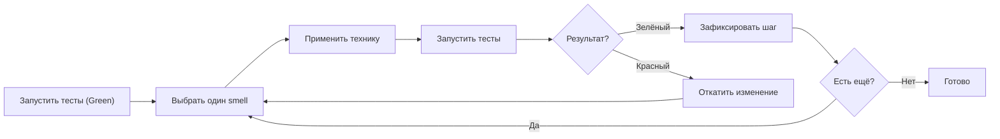
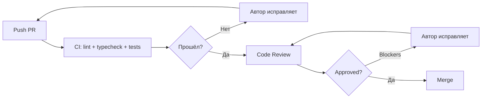

# Уровень 16: Рефакторинг и код-ревью — подробная теория

## Что такое рефакторинг и зачем он нужен

Представьте квартиру, в которой жили годами. Вещи куплены правильные, нужные. Но найти конкретную книгу занимает 15 минут. Кухонная утварь хранится в трёх разных местах. Документы перемешаны с сувенирами. Всё работает, ничего не потеряно — но пользоваться неудобно.

Генеральная уборка решает проблему: вещи те же, порядок другой. После неё квартира не стала больше, но жить в ней легче.

Рефакторинг — это генеральная уборка кода. Мартин Фаулер, автор книги «Refactoring: Improving the Design of Existing Code», определяет его так: **«контролируемое изменение внутренней структуры программного обеспечения, которое не изменяет его наблюдаемое поведение»**.

Три главных причины рефакторить:

**1. Удобство изменений.** Хорошо структурированный код менять проще. Добавить новый тип скидки в таблицу ставок — одна строка. Добавить его в длинный if-else по всему файлу — риск всё сломать.

**2. Читаемость.** Код читают в 10 раз чаще, чем пишут. Каждое чтение с трудом — налог на команду. Рефакторинг снижает этот налог.

**3. Отладка.** Маленькие функции с хорошими именами легче дебажить. Понимаешь, где искать.

---

## Предусловие: тесты — это страховка

Рефакторинг без тестов — gambling. Вы изменяете структуру и надеетесь, что наблюдаемое поведение не поменялось. Может повезти, а может нет. При этом вы не узнаете о поломке, пока пользователь не пожалуется.

С тестами каждый шаг рефакторинга верифицируем:

```
1. Запустить тесты — все зелёные
2. Сделать один маленький шаг рефакторинга
3. Запустить тесты
4. Если зелёные — продолжать
5. Если красные — откатить изменение и разобраться
```

📌 Если тестов нет: **сначала написать тесты на текущее поведение, потом рефакторить**. Да, писать тесты на плохой код неудобно. Это цена накопленного технического долга.

💡 Рефакторинг и добавление функциональности — два разных режима. Не делайте оба одновременно. Сначала приберитесь в комнате, потом ставьте новую мебель.

---

## Code Smells: как распознать проблему

Code smell — это не баг. Код компилируется и работает. Но структура сигнализирует о будущей боли. Как запах из холодильника: продукт ещё не выброшен, но лучше разобраться сейчас, пока не стало хуже.

### Long Method

Функция длиной больше 20-30 строк — кандидат на разбиение. Длинная функция почти всегда делает несколько вещей. Правило: **если вам нужно написать комментарий типа `// рассчитать скидку` — это кандидат для Extract Function**.

```typescript
// ❌ Функция на 60 строк: валидация + расчёт + форматирование + сохранение
function processPayment(payment: Payment) {
  // Валидация
  if (!payment.cardNumber || payment.cardNumber.length !== 16) {
    throw new Error('Invalid card')
  }
  if (!payment.cvv || payment.cvv.length !== 3) {
    throw new Error('Invalid CVV')
  }
  // Расчёт комиссии
  let fee = 0
  if (payment.method === 'visa') fee = payment.amount * 0.015
  if (payment.method === 'mastercard') fee = payment.amount * 0.018
  // ... ещё 40 строк
}

// ✅ Каждая функция делает одно
function validatePayment(payment: Payment): void { /* ... */ }
function calculateFee(method: PaymentMethod, amount: number): number { /* ... */ }
function processPayment(payment: Payment) {
  validatePayment(payment)
  const fee = calculateFee(payment.method, payment.amount)
  // ...
}
```

### Large Class (God Object)

Класс, который знает всё и делает всё. `UserManager` с методами `sendEmail`, `calculateSalary`, `generateReport`, `updateProfile`, `deleteAccount`. Этот класс нарушает принцип единственной ответственности и изменяется по 10 разным причинам.

```typescript
// ❌ God Object
class UserManager {
  createUser() { }
  deleteUser() { }
  sendWelcomeEmail() { }   // Email логика здесь?
  calculateBonus() { }     // Финансовая логика здесь?
  generateUserReport() { } // Отчётность здесь?
  exportToCSV() { }
}

// ✅ Разделённые ответственности
class UserService { createUser() { } deleteUser() { } }
class UserEmailService { sendWelcomeEmail() { } }
class UserReportService { generateUserReport() { } exportToCSV() { } }
```

### Duplicated Code

Copy-paste программирование создаёт скрытые связи. Вы исправляете баг в одном месте и забываете о копии. Дубликат рано или поздно расходится с оригиналом.

```typescript
// ❌ Дублирование
function formatUserName(user: User): string {
  return `${user.firstName} ${user.lastName}`.trim()
}

function formatAdminName(admin: Admin): string {
  return `${admin.firstName} ${admin.lastName}`.trim() // та же логика
}

// ✅ Одна функция
function formatFullName(person: { firstName: string; lastName: string }): string {
  return `${person.firstName} ${person.lastName}`.trim()
}
```

### Long Parameter List

Больше 3-4 параметров — функцию трудно вызвать правильно. Никто не помнит, порядок: сначала userId или email?

```typescript
// ❌ Кто вспомнит порядок?
function createUser(
  firstName: string,
  lastName: string,
  email: string,
  role: string,
  departmentId: string,
  sendWelcome: boolean
) {}

// ✅ Параметр-объект
interface CreateUserParams {
  firstName: string
  lastName: string
  email: string
  role: string
  departmentId: string
  sendWelcome: boolean
}

function createUser(params: CreateUserParams) {}
```

### Feature Envy

Метод постоянно лезет к данным другого класса. Это сигнал: может, метод вообще должен быть в том другом классе?

```typescript
// ❌ Order использует почти только данные Customer
class Order {
  calculateShipping(customer: Customer): number {
    const baseRate = customer.address.country === 'RU' ? 200 : 1000
    const discount = customer.loyaltyPoints > 500 ? 0.9 : 1
    const express = customer.preferences.expressDelivery ? 1.5 : 1
    return baseRate * discount * express
  }
}

// ✅ Логика переехала туда, где живут данные
class Customer {
  calculateShippingRate(): number {
    const baseRate = this.address.country === 'RU' ? 200 : 1000
    const discount = this.loyaltyPoints > 500 ? 0.9 : 1
    const express = this.preferences.expressDelivery ? 1.5 : 1
    return baseRate * discount * express
  }
}
```

### Primitive Obsession

Использование примитивов там, где должен быть тип. Email как `string` не имеет гарантии формата. Деньги как `number` можно случайно сложить с другим числом.

```typescript
// ❌ Всё строки и числа
function sendInvoice(email: string, amount: number, currency: string) {}
sendInvoice('not-an-email', -100, 'INVALID') // TypeScript не остановит

// ✅ Типы несут смысл
type Email = string & { readonly _brand: 'Email' }
type Money = { amount: number; currency: 'RUB' | 'USD' | 'EUR' }

function sendInvoice(email: Email, amount: Money) {}
```

### Shotgun Surgery

Одно логическое изменение требует правок в 10 разных файлах. Добавить новый тип пользователя — нужно поправить 8 switch-case по всей кодовой базе. Это сигнал о нарушении инкапсуляции и недостаточном использовании полиморфизма.

### Dead Code

Закомментированный код, функции которые никто не вызывает, условные ветки которые никогда не выполняются. Мёртвый код создаёт когнитивный шум — читаешь и думаешь «а зачем это?». Решение простое: удалить. Git помнит историю.

```typescript
// ❌ Мёртвый код создаёт шум
function calculatePrice(product: Product, user: User) {
  // const oldDiscount = product.price * 0.1 // старая логика
  // if (user.isVip) return product.price - oldDiscount
  return product.price * (1 - getDiscount(user.tier))
}

// ✅ Просто удалить
function calculatePrice(product: Product, user: User) {
  return product.price * (1 - getDiscount(user.tier))
}
```

### Comments Smell

Комментарий, который объясняет, что делает плохо названная переменная или сложная логика — это симптом. Правильное лечение: улучшить код, а не объяснять его.

```typescript
// ❌ Комментарий скрывает проблему
// проверяем, достаточно ли у пользователя прав для удаления
if (u.r === 'admin' || (u.r === 'manager' && u.d > 365)) { }

// ✅ Код говорит сам за себя
const canDeleteRecords = user.role === 'admin' ||
  (user.role === 'manager' && user.daysSinceJoining > 365)
if (canDeleteRecords) { }
```

---

## Техники рефакторинга

### Extract Function

Самая частая и полезная техника. Выделяем блок кода в отдельную функцию с говорящим именем.

Когда применять: блок кода требует комментария чтобы быть понятным; блок кода повторяется; функция делает больше одного дела.

```typescript
// ❌ До
function generateInvoice(order: Order): string {
  // вычислить итог с учётом скидок и налогов
  let subtotal = 0
  for (const item of order.items) {
    subtotal += item.price * item.quantity
  }
  const discount = order.coupon ? subtotal * order.coupon.rate : 0
  const taxBase = subtotal - discount
  const tax = taxBase * 0.2
  const total = taxBase + tax

  return `Invoice #${order.id}\nTotal: ${total}`
}

// ✅ После
function calculateSubtotal(items: OrderItem[]): number {
  return items.reduce((sum, item) => sum + item.price * item.quantity, 0)
}

function applyDiscount(subtotal: number, coupon?: Coupon): number {
  return coupon ? subtotal * (1 - coupon.rate) : subtotal
}

function addVAT(amount: number): number {
  return amount * 1.2
}

function generateInvoice(order: Order): string {
  const subtotal = calculateSubtotal(order.items)
  const afterDiscount = applyDiscount(subtotal, order.coupon)
  const total = addVAT(afterDiscount)
  return `Invoice #${order.id}\nTotal: ${total}`
}
```

### Inline Function

Обратная техника: убрать функцию, если она не добавляет смысла. Не все абстракции полезны.

```typescript
// ❌ Лишняя обёртка без смысла
function moreThanFive(x: number): boolean {
  return x > 5
}
if (moreThanFive(count)) { }

// ✅ Прямо и понятно
if (count > 5) { }
```

### Extract Variable (Introduce Explaining Variable)

Сложное выражение в переменную с говорящим именем. Переменная становится комментарием.

```typescript
// ❌ Что это вычисляет?
if (order.total > 10000 && user.registeredDaysAgo > 90 && !user.hasUnpaidInvoices) {
  applyVipDiscount(order)
}

// ✅ Переменная объясняет
const isHighValueOrder = order.total > 10000
const isEstablishedCustomer = user.registeredDaysAgo > 90
const hasGoodStanding = !user.hasUnpaidInvoices
if (isHighValueOrder && isEstablishedCustomer && hasGoodStanding) {
  applyVipDiscount(order)
}
```

### Replace Magic Number with Constant

Магические числа — это числа без контекста. `0.2` — это что? Скидка? НДС? Погрешность?

```typescript
// ❌ Что значат эти числа?
function calculateFee(amount: number): number {
  if (amount > 50000) return amount * 0.015
  return amount * 0.025
}

// ✅ Числа имеют имена
const PREMIUM_FEE_RATE = 0.015
const STANDARD_FEE_RATE = 0.025
const PREMIUM_THRESHOLD = 50_000

function calculateFee(amount: number): number {
  if (amount > PREMIUM_THRESHOLD) return amount * PREMIUM_FEE_RATE
  return amount * STANDARD_FEE_RATE
}
```

### Introduce Parameter Object

Несколько параметров, которые всегда ходят вместе — кандидаты для объекта.

```typescript
// ❌ dateFrom и dateTo всегда вместе
function getOrders(userId: string, dateFrom: Date, dateTo: Date) {}
function getReports(dateFrom: Date, dateTo: Date, format: string) {}
function exportData(dateFrom: Date, dateTo: Date) {}

// ✅ DateRange — самостоятельная концепция
interface DateRange { from: Date; to: Date }

function getOrders(userId: string, period: DateRange) {}
function getReports(period: DateRange, format: string) {}
function exportData(period: DateRange) {}
```

### Replace Conditional with Polymorphism

Длинный switch или if-else по типу — часто признак того, что здесь нужен полиморфизм.

```typescript
// ❌ При добавлении нового типа нужно найти все switch
function getShippingCost(type: string, weight: number): number {
  switch (type) {
    case 'standard': return weight * 50
    case 'express': return weight * 150
    case 'overnight': return weight * 300
    default: throw new Error('Unknown type')
  }
}

// ✅ Новый тип = новый класс, существующие не меняются
interface ShippingMethod {
  calculateCost(weight: number): number
}

class StandardShipping implements ShippingMethod {
  calculateCost(weight: number) { return weight * 50 }
}

class ExpressShipping implements ShippingMethod {
  calculateCost(weight: number) { return weight * 150 }
}
```

### Move Function / Move Field

Метод или поле находится не в том классе — перенести туда, где живут связанные данные.

### Replace Temp with Query

Временная переменная, которую можно заменить вызовом метода — убирает необходимость следить за жизненным циклом переменной.

---

## Когда рефакторить

### Правило бойскаута

Роберт Мартин сформулировал просто: **«Оставляй код чище, чем нашёл»**. Пришёл добавить фичу — попутно переименовал неудачную переменную. Исправил баг — вынес дублирующийся блок в функцию. Маленькие улучшения каждый день.

### Перед добавлением фичи

Хочешь добавить новую логику в 80-строчную функцию? Сначала разбей функцию, потом добавь фичу. Как говорит Фаулер: «Когда мне нужно добавить функцию в программу, но код не структурирован для этого — сначала я рефакторирую программу, чтобы добавление было удобным».

### После обнаружения бага

Баг часто симптом. Нашёл и исправил — осмотрись: почему здесь было так трудно найти причину? Что можно упростить?

### Когда НЕ рефакторить

- Deadline завтра и код работает — не трогай
- Код нужно переписать с нуля — рефакторинг устаревшего мусора бессмысленен
- Нет тестов, нет времени их написать, изменения несрочны — оставь на потом
- Ради рефакторинга — рефакторинг не цель, а инструмент

⚠️ **Не рефакторьте ради рефакторинга**. «Мне просто не нравится этот код» — недостаточная причина. «Этот код мешает добавить новую фичу» — достаточная.

---

## Цикл рефакторинга



Каждый шаг — маленький. Переименование — один коммит. Extract Function — один коммит. Легко найти, что именно сломалось, если тесты вдруг покраснели.

---

## Code Review: зачем и как

### Цели ревью

Code review — не контрольная точка страха. Это инструмент с тремя задачами:

**Обнаружение проблем** — баги, уязвимости, гонки состояний, архитектурные решения которые создадут боль через полгода. Четыре глаза лучше двух. Автор слеп к своим ошибкам — он думал о другом при написании.

**Передача знаний** — ревьюер узнаёт, что поменялось в кодовой базе. Автор получает взгляд человека, который не знает контекста. Оба учатся.

**Коллективное владение кодом** — не должно быть файлов, которые знает только один человек. Ревью создаёт эту коллективную память.

### Что смотреть

```
✅ Корректность — делает ли код то, что должен?
✅ Граничные случаи — null, пустой массив, отрицательные числа, конкурентный доступ?
✅ Читаемость — можно ли понять код через месяц?
✅ Тестируемость — можно ли это протестировать? Есть ли тесты?
✅ Безопасность — SQL injection, XSS, открытые данные в логах?
✅ Производительность — нет ли N+1 запросов, нет ли O(n²) там где нужно O(n)?
❌ Стиль кавычек, отступы, точки с запятой — это задача линтера, не ревьюера
```

### Маркировка серьёзности

Не все замечания одинаково важны. Маркировка помогает автору понять, что обязательно, а что опционально:

- `blocker:` — PR нельзя мержить. Реальная проблема: баг, уязвимость, архитектурное решение которое создаст катастрофу
- `suggestion:` — было бы лучше, но решение остаётся за автором
- `nit:` (nitpick) — мелочь: название переменной, лишний пробел. Автор сам решает

```
blocker: здесь race condition — если два запроса придут одновременно до flush,
оба прочитают старое значение счётчика. Нужна блокировка или атомарная операция.

suggestion: можно упростить через Array.reduce вместо forEach + push:
const totals = items.reduce((acc, item) => [...acc, item.price * item.qty], [])

nit: `idx` → `index` для единообразия с остальными циклами в этом файле
```

### Размер PR

Исследования (SmartBear, 2011) показывают: при ревью кода больше 400 строк качество обнаружения дефектов резко падает. Ревьюер устаёт, теряет контекст.

Эмпирическое правило: **PR до 400 строк изменений**. Большую задачу разбить на серию последовательных PR: сначала рефакторинг, потом фича.

### Автоматизация убирает рутину

Если CI не прошёл — ревью не нужно. Линтер, форматтер, type checker, тесты — всё это должно запускаться автоматически. Ревьюер не должен тратить внимание на «здесь нужна точка с запятой». Это унизительно для ревьюера и обидно для автора.



### Как писать комментарии к ревью

Хороший комментарий: **конкретная проблема + почему это проблема + альтернативный вариант**.

```
❌ "Это неправильно"
   — непонятно что именно и почему

❌ "Почему ты так написал?"
   — звучит как допрос

❌ "Можно лучше"
   — без конкретики бесполезно

✅ "suggestion: этот метод выполняет и валидацию, и сохранение — нарушает SRP.
   Предлагаю выделить validateUser(user) отдельно, тогда saveUser сможет
   принимать уже валидированный объект."

✅ "blocker: пароль логируется в строке 47 — это нарушение безопасности.
   Нужно убрать поле password из объекта перед логированием."
```

💡 Задавайте вопросы вместо утверждений там, где не уверены: «Я правильно понимаю, что здесь предполагается только один поток? Если нет, нужна синхронизация.»

### Как принимать ревью

- **Не защищайтесь.** Комментарий к коду — не атака на вас лично
- **Задавайте вопросы.** Если непонятно — переспросите, не угадывайте
- **Благодарите за хорошие замечания.** «Спасибо, не подумал об этом случае»
- **Не соглашайтесь молча с тем, с чем не согласны.** Обсудите — ревьюер тоже может ошибаться

---

## Распространённые ошибки

### Рефакторинг

⚠️ **Рефакторинг без тестов** — изменяете структуру и не знаете, не сломали ли поведение.

⚠️ **Слишком большие шаги** — переименование, перемещение, изменение интерфейса всё за один раз. При красных тестах непонятно, что именно сломалось.

⚠️ **Рефакторинг + новая фича в одном PR** — невозможно понять, что именно вызвало регрессию.

⚠️ **«Давайте перепишем с нуля»** — это не рефакторинг. Рефакторинг — постепенное улучшение рабочего кода. Переписывание выбрасывает годы наработанных edge cases.

### Code Review

⚠️ **Ревью огромного PR** — качество падает экспоненциально с размером. После 500 строк мозг просто не держит весь контекст.

⚠️ **Ревью стиля вместо логики** — тратить внимание на кавычки и отступы вместо поиска реальных проблем.

⚠️ **Blocker на всё** — если всё blocker, автор не знает, что реально критично. Маркируйте честно.

⚠️ **Молчаливое одобрение** — одобрить PR не прочитав, «у меня нет времени». Это хуже, чем не ревьюить вовсе — создаёт ложное ощущение безопасности.

⚠️ **Персональные нападки** — «это ужасный код», «как ты вообще так написал». Ревьюите код, не человека.

---

## Итог

Рефакторинг и код-ревью — два дополняющих инструмента качества:

| Аспект | Рефакторинг | Code Review |
|---|---|---|
| Когда | Постоянно, маленькими шагами | На каждый PR |
| Цель | Структура без изменения поведения | Обнаружение проблем + обмен знаниями |
| Предусловие | Тесты | Пройденный CI |
| Ключевое правило | Маленькие шаги | PR до 400 строк |

- Рефакторинг = изменение структуры, поведение не меняется
- Тесты — страховка, без них рефакторинг опасен
- Code smells — сигналы проблем: Long Method, God Object, Duplication, Feature Envy, Dead Code
- Техники: Extract Function, Rename, Introduce Parameter Object, Replace Magic Number
- Правило бойскаута: оставляй код чище, чем нашёл
- Code review: три цели — баги, знания, согласованность
- Маркировка: blocker / suggestion / nit
- PR до 400 строк; автоматизируйте рутину в CI
- Комментарий = проблема + почему + альтернатива
