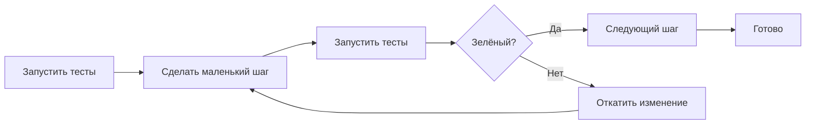

# Уровень 16: Рефакторинг и код-ревью

## Рефакторинг — это уборка, а не переезд

Генеральная уборка не меняет планировку квартиры. Вещи остаются теми же, просто теперь книги стоят на полке, а не лежат на полу. Квартира стала удобнее без единого гвоздя в стене.

Рефакторинг работает так же: **внутренняя структура меняется, внешнее поведение — нет**. Функция по-прежнему возвращает то же значение. Класс решает ту же задачу. Но код стал понятнее, короче, легче изменять.

Определение Мартина Фаулера: «Рефакторинг — это контролируемое изменение внутренней структуры программного обеспечения, не влияющее на его наблюдаемое поведение».

---

## Предусловие: тесты

Рефакторинг без тестов — это gambling. Вы меняете структуру и надеетесь, что ничего не сломали. С тестами каждый шаг проверяем: изменил, запустил тесты, зелёный — продолжай.

📌 Правило: **сначала тесты, потом рефакторинг**. Если тестов нет — сначала напишите тесты, потом рефакторьте.

---

## Code smells — запах плохого кода

Code smell — это не баг. Код работает. Но структура говорит, что что-то пошло не так. Основные запахи:

**Long Method** — функция на 80 строк. Делает три вещи сразу. Трудно понять, легко сломать.

**Large Class (God Object)** — класс, который знает всё и делает всё. `UserManager` с 30 методами.

**Duplicated Code** — copy-paste программирование. Два одинаковых блока в разных местах.

**Long Parameter List** — функция с 6+ параметрами. Никто не помнит порядок аргументов.

**Feature Envy** — метод класса А постоянно обращается к данным класса Б. Может, ему там и место?

**Dead Code** — закомментированный код, функции которые никто не вызывает, переменные которые не читаются.

**Primitive Obsession** — email как `string`, деньги как `number`, координаты как два отдельных числа вместо типа.

**Comments smell** — комментарий объясняет, что делает плохой код. Правильное решение: улучшить код, а не объяснять его.

---

## Основные техники рефакторинга

**Extract Function** — выделить блок кода в отдельную именованную функцию. Самая частая техника.

```typescript
// ❌ До
function processOrder(order: Order) {
  // рассчитать скидку
  let discount = 0
  if (order.user.tier === 'premium') discount = 0.2
  if (order.user.tier === 'vip') discount = 0.35
  const price = order.total * (1 - discount)
  // ... ещё 40 строк
}

// ✅ После
function calculateDiscount(tier: UserTier): number {
  const rates: Record<UserTier, number> = { standard: 0, premium: 0.2, vip: 0.35 }
  return rates[tier]
}

function processOrder(order: Order) {
  const discount = calculateDiscount(order.user.tier)
  const price = order.total * (1 - discount)
  // ...
}
```

**Rename** — самый частый и самый недооценённый рефакторинг. `d` → `discountRate`, `tmp` → `filteredOrders`.

**Introduce Parameter Object** — несколько связанных параметров объединить в объект.

```typescript
// ❌ До
function createReport(startDate: Date, endDate: Date, userId: string, format: string) {}

// ✅ После
interface ReportParams { startDate: Date; endDate: Date; userId: string; format: string }
function createReport(params: ReportParams) {}
```

**Replace Magic Number with Constant** — `if (age > 18)` → `if (age > LEGAL_AGE)`.

**Extract Variable** — сложное выражение в промежуточную именованную переменную.

---

## Цикл рефакторинга



Ключевое слово — **маленький шаг**. Переименовать переменную — один коммит. Выделить функцию — один коммит. Переместить метод — один коммит. Так легко найти, что именно сломалось.

---

## Code Review: цели и процесс

Code review — это не контроль качества через страх. Это **обмен знаниями** и **коллективное владение кодом**.

Три цели ревью:
1. **Обнаружение проблем** — баги, уязвимости, архитектурные решения которые создадут боль
2. **Передача знаний** — ревьюер узнаёт, что поменялось; автор получает взгляд со стороны
3. **Согласованность** — код базы выглядит как написанный одной командой, а не пятью разными людьми

**Размер PR**: изменение до 400 строк — норма. Больше — ревьюер теряет фокус, качество падает. Большую задачу разбивают на последовательные PR.

**Автоматизация**: линтер, форматтер, type checker, тесты — всё это запускается в CI автоматически. Ревью не должно тратиться на стиль кавычек.

**Маркировка серьёзности**:
- `blocker:` — нельзя мержить, есть реальная проблема
- `suggestion:` — было бы лучше, но не обязательно
- `nit:` — мелочь, автор сам решает

---

## Как писать комментарии в ревью

```
❌ "Это неправильно"
❌ "Почему ты так сделал?"
❌ "Плохой код"

✅ "suggestion: можно упростить через Array.reduce — вот пример: [код]"
✅ "blocker: здесь race condition — если два запроса придут одновременно, счётчик будет неверным"
✅ "nit: переменная `d` — лучше `discountRate` для читаемости"
```

Хороший комментарий: конкретная проблема + почему это проблема + альтернативный вариант.

---

## Правило бойскаута

> Оставляй код чище, чем нашёл.

Не надо делать глобальный рефакторинг перед каждой задачей. Но если по пути попался `tmp2` — переименуй. Нашёл дубликат — вынеси в функцию. Маленькие улучшения каждый день.

---

## Итог

- Рефакторинг = изменение структуры без изменения поведения
- Предусловие рефакторинга — **тесты**; без них это gambling
- Code smells — сигналы проблем, не баги
- Рефакторить маленькими шагами, запускать тесты после каждого
- Code review — обмен знаниями, не контроль; маркировать серьёзность; PR до 400 строк
- Правило бойскаута: оставляй чище, чем нашёл
