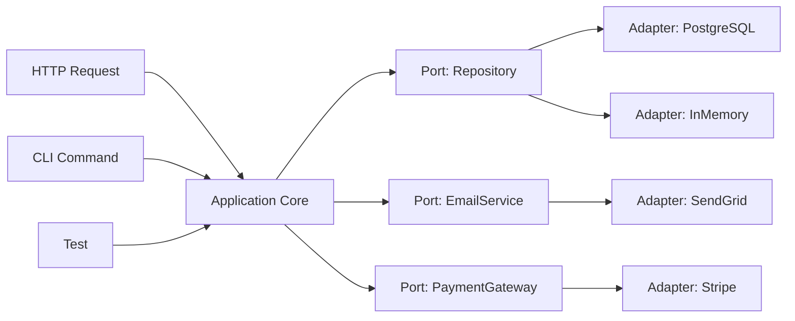

# Уровень 17: Платформенная независимость — подробная теория

## Почему это важно прямо сейчас

JavaScript — платформа-кочевница. Код переезжает: с Express на Fastify, с Node.js на Bun, с React на Solid, из монолита в Edge Functions. Компании мигрируют стеки. Появляются новые рантаймы. Фреймворки устаревают.

Но бизнес-логика остаётся. Правило «скидка 20% для VIP-клиентов» не зависит от того, какой HTTP-фреймворк сейчас в моде. Если код написан так, что это правило можно переиспользовать — миграция займёт дни. Если нет — недели или месяцы переписывания.

Аналогия: электропроводка в доме (системный код) и расстановка мебели (прикладной код). Проводку меняют раз в 30 лет, мебель двигают каждые несколько лет. Если диван прибит к розетке — двигать его нельзя без перекладки проводки.

---

## Системный vs прикладной код

### Что такое системный код

Системный код — это то, что одинаково нужно практически любому приложению, но не несёт уникальной бизнес-ценности:

- HTTP-сервер, роутинг, middleware
- ORM, работа с базой данных, миграции
- Аутентификация и авторизация (JWT, OAuth)
- Логирование, трейсинг, метрики
- Очереди сообщений, планировщики задач
- Работа с файловой системой, конфигурация

Вы не придумывали это — вы взяли с полки (Express, Prisma, Winston, Bull).

### Что такое прикладной код

Прикладной код — это то, что делает ваш продукт уникальным:

- Алгоритм расчёта стоимости доставки (учитывает вес, расстояние, тариф)
- Правила валидации заявки на кредит
- Статусная машина заказа (draft → confirmed → shipped → delivered)
- Бизнес-правила скидок, промо-акций, лимитов
- Логика матчинга (кандидаты и вакансии, водители и пассажиры)

Это не берут с полки — это то, что команда создаёт сама.

### Почему их смешивают и почему это больно

```typescript
// ❌ Классическая каша: бизнес-логика в роуте
app.post('/api/v1/orders', authenticate, async (req: Request, res: Response) => {
  try {
    const { userId, items, promoCode } = req.body

    // Инфраструктура: загрузка из БД
    const user = await prisma.user.findUnique({ where: { id: userId } })
    if (!user) return res.status(404).json({ error: 'User not found' })

    // Бизнес-логика: правила скидок (похоронена в роуте)
    let discount = 0
    if (user.tier === 'premium') discount = 0.15
    if (user.tier === 'vip') discount = 0.25
    if (promoCode === 'SUMMER2025') discount = Math.max(discount, 0.1)
    if (items.length > 10) discount = Math.min(discount + 0.05, 0.35)

    // Инфраструктура: расчёт суммы (с бизнес-правилом внутри)
    const subtotal = items.reduce((sum: number, item: any) => {
      return sum + item.price * item.quantity
    }, 0)
    const total = subtotal * (1 - discount)

    // Инфраструктура: сохранение
    const order = await prisma.order.create({ data: { userId, total, discount } })

    // Инфраструктура: отправка ответа
    res.status(201).json({ orderId: order.id, total })
  } catch (err) {
    res.status(500).json({ error: 'Internal server error' })
  }
})
```

Проблемы этого кода:
1. Чтобы протестировать логику скидок — нужно поднять HTTP-сервер и базу данных
2. При переходе с REST на GraphQL логику придётся копировать или вырывать
3. Ту же логику в мобильном приложении — переписывать на другом языке
4. Логику нельзя переиспользовать в отдельном job'е или воркере
5. Сложно читать: инфраструктура и бизнес-правила вперемешку

### Правильное разделение

```typescript
// ✅ Бизнес-логика: чистый TypeScript, ноль зависимостей
interface OrderItem {
  productId: string
  price: number
  quantity: number
}

interface UserTier {
  tier: 'standard' | 'premium' | 'vip'
}

function calculateDiscount(user: UserTier, items: OrderItem[], promoCode?: string): number {
  let discount = 0

  // Базовая скидка по тиру
  if (user.tier === 'premium') discount = 0.15
  if (user.tier === 'vip') discount = 0.25

  // Промо-код
  if (promoCode === 'SUMMER2025') discount = Math.max(discount, 0.1)

  // Объёмная скидка
  if (items.length > 10) discount = Math.min(discount + 0.05, 0.35)

  return discount
}

function calculateOrderTotal(user: UserTier, items: OrderItem[], promoCode?: string): number {
  const subtotal = items.reduce((sum, item) => sum + item.price * item.quantity, 0)
  const discount = calculateDiscount(user, items, promoCode)
  return subtotal * (1 - discount)
}

// ✅ Роут — тонкая обёртка, только инфраструктура
app.post('/api/v1/orders', authenticate, async (req: Request, res: Response) => {
  const { userId, items, promoCode } = req.body

  const user = await prisma.user.findUnique({ where: { id: userId } })
  if (!user) return res.status(404).json({ error: 'User not found' })

  const total = calculateOrderTotal(user, items, promoCode)

  const order = await prisma.order.create({ data: { userId, total } })
  res.status(201).json({ orderId: order.id, total })
})
```

Теперь `calculateDiscount` и `calculateOrderTotal` тестируются без HTTP, без базы, без фреймворка.

---

## Platform-agnostic

### Что значит «зависеть от платформы»

```typescript
// ❌ Платформо-специфичный код — работает только в Node.js
import fs from 'fs'
import path from 'path'
import { env } from 'process'

function loadUserConfig(userId: string): UserConfig {
  const configPath = path.join(env.CONFIG_DIR!, `${userId}.json`)
  const raw = fs.readFileSync(configPath, 'utf-8')
  return JSON.parse(raw)
}

// В браузере: ReferenceError: fs is not defined
// В Deno: модуль 'fs' недоступен без флага
// В Cloudflare Workers: полный провал
```

```typescript
// ❌ Другой пример — код только для браузера
function savePreferences(prefs: UserPreferences): void {
  localStorage.setItem('preferences', JSON.stringify(prefs))
}

// В Node.js: ReferenceError: localStorage is not defined
// В Deno: аналогично
```

### Абстракции через интерфейсы

Решение — зависеть от интерфейса, реализации менять под платформу:

```typescript
// ✅ Интерфейс (Port) — не зависит от платформы
interface StorageService {
  get(key: string): Promise<string | null>
  set(key: string, value: string): Promise<void>
  delete(key: string): Promise<void>
}

// Реализация для браузера
class LocalStorageService implements StorageService {
  async get(key: string): Promise<string | null> {
    return localStorage.getItem(key)
  }

  async set(key: string, value: string): Promise<void> {
    localStorage.setItem(key, value)
  }

  async delete(key: string): Promise<void> {
    localStorage.removeItem(key)
  }
}

// Реализация для Node.js (файловая система)
class FileStorageService implements StorageService {
  constructor(private readonly dir: string) {}

  async get(key: string): Promise<string | null> {
    try {
      return await fs.promises.readFile(path.join(this.dir, key), 'utf-8')
    } catch {
      return null
    }
  }

  async set(key: string, value: string): Promise<void> {
    await fs.promises.writeFile(path.join(this.dir, key), value)
  }

  async delete(key: string): Promise<void> {
    await fs.promises.unlink(path.join(this.dir, key)).catch(() => {})
  }
}

// Реализация для тестов
class InMemoryStorageService implements StorageService {
  private store = new Map<string, string>()

  async get(key: string): Promise<string | null> {
    return this.store.get(key) ?? null
  }

  async set(key: string, value: string): Promise<void> {
    this.store.set(key, value)
  }

  async delete(key: string): Promise<void> {
    this.store.delete(key)
  }
}

// Бизнес-логика работает с интерфейсом — ей всё равно, где запускаться
class UserPreferencesService {
  constructor(private readonly storage: StorageService) {}

  async saveTheme(userId: string, theme: 'light' | 'dark'): Promise<void> {
    await this.storage.set(`user:${userId}:theme`, theme)
  }

  async getTheme(userId: string): Promise<'light' | 'dark'> {
    const theme = await this.storage.get(`user:${userId}:theme`)
    return (theme as 'light' | 'dark') ?? 'light'
  }
}
```

### Universal / Isomorphic JavaScript

Один и тот же модуль работает и на сервере, и в браузере:

```typescript
// Модуль валидации — universal
// Не использует ни Node.js API, ни Browser API
export function validateEmail(email: string): string | null {
  if (!email.includes('@')) return 'Email must contain @'
  const [local, domain] = email.split('@')
  if (local.length < 1) return 'Email local part cannot be empty'
  if (!domain.includes('.')) return 'Email domain must contain .'
  return null // null = нет ошибки
}

export function validatePassword(password: string): string[] {
  const errors: string[] = []
  if (password.length < 8) errors.push('Password must be at least 8 characters')
  if (!/[A-Z]/.test(password)) errors.push('Password must contain uppercase letter')
  if (!/[0-9]/.test(password)) errors.push('Password must contain a number')
  return errors
}
```

Этот код используется:
- В браузере: мгновенная валидация в форме без запроса на сервер
- На сервере (Node.js): валидация перед сохранением в базу
- В тестах: unit-тесты без любого окружения

Аналогия: правила математики одинаковы на любом языке. 2 + 2 = 4 работает и в Москве, и в Нью-Йорке.

---

## Framework-agnostic

### Хук — это склейка, не логика

Частая ошибка: класть бизнес-логику прямо в React hook, потому что «это удобно».

```typescript
// ❌ Логика похоронена в React-хуке
function useCheckout() {
  const [items, setItems] = useState<CartItem[]>([])
  const [promoCode, setPromoCode] = useState('')

  const total = useMemo(() => {
    const subtotal = items.reduce((sum, item) => sum + item.price * item.quantity, 0)
    let discount = 0
    if (promoCode === 'SUMMER2025') discount = 0.1
    if (items.length > 5) discount = Math.max(discount, 0.05)
    return subtotal * (1 - discount)
  }, [items, promoCode])

  const applyPromo = (code: string) => {
    const validCodes = ['SUMMER2025', 'WINTER2025', 'SPRING2025']
    if (validCodes.includes(code)) setPromoCode(code)
  }

  return { items, total, setItems, applyPromo }
}
```

Что не так: логику `applyPromo` и расчёт `total` нельзя использовать вне React, нельзя нормально протестировать без React Testing Library, нельзя переиспользовать в Vue или Svelte.

```typescript
// ✅ Бизнес-логика — чистый TypeScript
interface CartItem {
  productId: string
  price: number
  quantity: number
}

const VALID_PROMO_CODES = new Set(['SUMMER2025', 'WINTER2025', 'SPRING2025'])

function isValidPromoCode(code: string): boolean {
  return VALID_PROMO_CODES.has(code)
}

function calculateCartDiscount(items: CartItem[], promoCode: string): number {
  let discount = 0
  if (isValidPromoCode(promoCode)) discount = 0.1
  if (items.length > 5) discount = Math.max(discount, 0.05)
  return discount
}

function calculateCartTotal(items: CartItem[], promoCode: string): number {
  const subtotal = items.reduce((sum, item) => sum + item.price * item.quantity, 0)
  return subtotal * (1 - calculateCartDiscount(items, promoCode))
}

// ✅ Хук — только склейка с React
function useCheckout() {
  const [items, setItems] = useState<CartItem[]>([])
  const [promoCode, setPromoCode] = useState('')

  const total = useMemo(() => calculateCartTotal(items, promoCode), [items, promoCode])

  const applyPromo = (code: string) => {
    if (isValidPromoCode(code)) setPromoCode(code)
  }

  return { items, total, setItems, applyPromo }
}
```

Теперь `calculateCartTotal` тестируется за одну строку. При переходе на Vue — `useCheckout` переписываем, логику не трогаем.

### State machine — чистый TypeScript, адаптер для React

```typescript
// ✅ Конечный автомат для формы заказа — чистый TS
type OrderFormState =
  | { status: 'idle' }
  | { status: 'filling'; email: string; address: string }
  | { status: 'submitting'; email: string; address: string }
  | { status: 'success'; orderId: string }
  | { status: 'error'; message: string }

type OrderFormEvent =
  | { type: 'UPDATE'; field: 'email' | 'address'; value: string }
  | { type: 'SUBMIT' }
  | { type: 'SUBMITTED'; orderId: string }
  | { type: 'FAILED'; message: string }
  | { type: 'RESET' }

function orderFormReducer(
  state: OrderFormState,
  event: OrderFormEvent,
): OrderFormState {
  switch (state.status) {
    case 'idle':
      if (event.type === 'UPDATE') {
        return { status: 'filling', email: '', address: '', [event.field]: event.value }
      }
      return state

    case 'filling':
      if (event.type === 'UPDATE') {
        return { ...state, [event.field]: event.value }
      }
      if (event.type === 'SUBMIT' && state.email && state.address) {
        return { status: 'submitting', email: state.email, address: state.address }
      }
      return state

    case 'submitting':
      if (event.type === 'SUBMITTED') return { status: 'success', orderId: event.orderId }
      if (event.type === 'FAILED') return { status: 'error', message: event.message }
      return state

    case 'success':
    case 'error':
      if (event.type === 'RESET') return { status: 'idle' }
      return state
  }
}

// ✅ React-адаптер — тонкий слой
function useOrderForm(onSubmit: (email: string, address: string) => Promise<string>) {
  const [state, dispatch] = useReducer(orderFormReducer, { status: 'idle' })

  const handleSubmit = async () => {
    if (state.status !== 'filling') return
    dispatch({ type: 'SUBMIT' })
    try {
      const orderId = await onSubmit(state.email, state.address)
      dispatch({ type: 'SUBMITTED', orderId })
    } catch (err) {
      dispatch({ type: 'FAILED', message: err instanceof Error ? err.message : 'Unknown error' })
    }
  }

  return { state, dispatch, handleSubmit }
}
```

---

## Hexagonal Architecture (Ports & Adapters)

Архитектура Алистера Кокберна (2005): система имеет шестиугольную форму, где каждая грань — точка взаимодействия с внешним миром.



**Application Core** — бизнес-логика. Не знает про HTTP, базу данных, SMTP.

**Port** — интерфейс (входящий или исходящий). Входящий: `OrderService.createOrder()`. Исходящий: `OrderRepository`, `EmailService`.

**Adapter** — реализация порта. `PostgresOrderRepository`, `InMemoryOrderRepository`.

```typescript
// Port (исходящий) — в домене
interface OrderRepository {
  save(order: Order): Promise<Order>
  findById(id: string): Promise<Order | null>
  findByUserId(userId: string): Promise<Order[]>
}

interface EmailNotificationService {
  sendOrderConfirmation(order: Order, email: string): Promise<void>
}

// Application Core — не знает, кто реализует порты
class OrderService {
  constructor(
    private readonly repo: OrderRepository,
    private readonly email: EmailNotificationService,
  ) {}

  async createOrder(
    userId: string,
    items: OrderItem[],
    userEmail: string,
  ): Promise<Order> {
    const total = calculateOrderTotal(items)
    const order = await this.repo.save({
      id: crypto.randomUUID(),
      userId,
      items,
      total,
      status: 'confirmed',
      createdAt: new Date(),
    })

    await this.email.sendOrderConfirmation(order, userEmail)
    return order
  }
}

// Adapter (PostgreSQL) — в инфраструктурном слое
class PostgresOrderRepository implements OrderRepository {
  constructor(private readonly db: PrismaClient) {}

  async save(order: Order): Promise<Order> {
    return this.db.order.create({ data: order })
  }

  async findById(id: string): Promise<Order | null> {
    return this.db.order.findUnique({ where: { id } })
  }

  async findByUserId(userId: string): Promise<Order[]> {
    return this.db.order.findMany({ where: { userId } })
  }
}

// Adapter (In-Memory) — для тестов
class InMemoryOrderRepository implements OrderRepository {
  private orders = new Map<string, Order>()

  async save(order: Order): Promise<Order> {
    this.orders.set(order.id, order)
    return order
  }

  async findById(id: string): Promise<Order | null> {
    return this.orders.get(id) ?? null
  }

  async findByUserId(userId: string): Promise<Order[]> {
    return Array.from(this.orders.values()).filter(o => o.userId === userId)
  }
}
```

---

## Паттерн Humble Object

Humble Object (Скромный объект) — паттерн из книги «Working Effectively with Legacy Code» Майкла Физерса. Идея: сделать фреймворк-зависимый код настолько тонким, чтобы его не нужно было тестировать.

```typescript
// ❌ Толстый контроллер — тяжело тестировать
class OrderController {
  async createOrder(req: Request, res: Response) {
    try {
      const { userId, items } = req.body

      // Логика контроллера — валидация, расчёт, сохранение
      if (!userId || !items?.length) {
        return res.status(400).json({ error: 'Invalid input' })
      }

      const user = await prisma.user.findUnique({ where: { id: userId } })
      if (!user) return res.status(404).json({ error: 'User not found' })

      let discount = user.tier === 'vip' ? 0.25 : 0.15
      const total = items.reduce((s: number, i: any) => s + i.price, 0) * (1 - discount)

      const order = await prisma.order.create({ data: { userId, total } })

      res.status(201).json(order)
    } catch {
      res.status(500).json({ error: 'Server error' })
    }
  }
}

// ✅ Humble контроллер — только маршрутизация
class OrderController {
  constructor(private readonly orderService: OrderService) {}

  async createOrder(req: Request, res: Response) {
    try {
      const order = await this.orderService.createOrder(req.body)
      res.status(201).json(order)
    } catch (err) {
      if (err instanceof ValidationError) return res.status(400).json({ error: err.message })
      if (err instanceof NotFoundError) return res.status(404).json({ error: err.message })
      res.status(500).json({ error: 'Server error' })
    }
  }
}
```

Контроллер настолько прост, что его тестировать почти незачем. Вся логика в `orderService`, который тестируется без HTTP.

---

## Стратегии миграции

### Feature Flags для постепенной миграции

```typescript
// Мигрируем с Express на Fastify постепенно
const router: Router = config.features.useNewFramework
  ? new FastifyRouter()
  : new ExpressRouter()

// Бизнес-логика не меняется ни в том, ни в другом случае
```

### Anti-corruption Layer при интеграции с legacy

```typescript
// Legacy-система возвращает данные в старом формате
interface LegacyOrder {
  order_id: string
  user_email: string  // mixed concern
  order_total: number
  order_items: Array<{ item_code: string; qty: number; unit_price: number }>
}

// Anti-corruption Layer: переводит legacy в современный формат
class LegacyOrderAdapter {
  fromLegacy(legacy: LegacyOrder): Order {
    return {
      id: legacy.order_id,
      total: legacy.order_total,
      items: legacy.order_items.map(item => ({
        productId: item.item_code,
        quantity: item.qty,
        price: item.unit_price,
      })),
    }
  }
}
```

---

## Когда platform lock-in допустим

Иногда жёсткая привязка к платформе — разумное решение:

- **Стартап на ранней стадии**: скорость важнее архитектуры. Можно привязаться к Next.js, пока нет ясности о масштабировании
- **Edge-специфичные функции**: если продукт строится на Cloudflare Workers как ключевом конкурентном преимуществе
- **Внутренний инструмент**: небольшая область применения, миграция никогда не понадобится

📌 Правило: если стоимость изоляции > вероятной стоимости будущей миграции, skip it. Но бизнес-логику изолируй всегда.

---

## Итог

- **Системный код** — фреймворк, ORM, HTTP; **прикладной** — бизнес-правила. Разделяй жёстко: бизнес-логика не должна знать про Express или Prisma
- **Platform-agnostic**: зависимость через интерфейс (`FileSystem`, `StorageService`), реализации под каждую платформу
- **Framework-agnostic**: хуки и компоненты — склейка; state machines, чистые функции — ядро. Ядро переезжает между фреймворками без изменений
- **Hexagonal Architecture**: Application Core окружён Ports (интерфейсами). Adapters реализуют порты для конкретной инфраструктуры
- **Humble Object**: фреймворк-зависимый код максимально тонкий. Вся логика — в слое, который тестируется в изоляции
- **Universal JavaScript**: валидация, расчёты, трансформации работают и на сервере, и в браузере
- **Anti-corruption Layer**: защита бизнес-логики от форматов внешних систем
