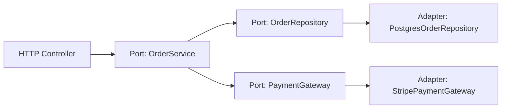

# Уровень 17: Платформенная независимость

## Код живёт дольше, чем фреймворк

Средняя жизнь фреймворка в JavaScript-экосистеме — 3-7 лет. Средняя жизнь бизнес-правила — 10-20 лет. Если логика расчёта скидки жёстко привязана к Express-роуту, при переходе на Fastify или на Worker её придётся переписывать. Платформенная независимость решает именно эту проблему.

---

## Системный vs прикладной код

Любое приложение состоит из двух принципиально разных видов кода:

**Системный код** — инфраструктура, которую вы не придумали: HTTP-сервер, ORM, роутинг, авторизация, логирование, работа с файлами, очереди.

**Прикладной код** — бизнес-логика, которую придумали именно вы: правила скидок, алгоритм расчёта стоимости доставки, статусная машина заказа, правила валидации.

```typescript
// ❌ Бизнес-логика знает про HTTP
app.post('/orders', async (req, res) => {
  const { userId, items } = req.body
  // Бизнес-правила похоронены внутри роута
  const discount = userId.startsWith('VIP') ? 0.2 : 0
  const total = items.reduce((sum, item) => sum + item.price, 0) * (1 - discount)
  res.json({ total })
})

// ✅ Бизнес-логика отделена
function calculateOrderTotal(userId: string, items: OrderItem[]): number {
  const discount = userId.startsWith('VIP') ? 0.2 : 0
  return items.reduce((sum, item) => sum + item.price, 0) * (1 - discount)
}

app.post('/orders', async (req, res) => {
  const total = calculateOrderTotal(req.body.userId, req.body.items)
  res.json({ total })
})
```

💡 Правило: если функцию нельзя вызвать из Node.js, браузера и unit-теста без поднятия сервера — бизнес-логика затянута в инфраструктуру.

---

## Platform-agnostic: код вне платформы

Платформо-специфичные API ломают переносимость:

```typescript
// ❌ Работает только в Node.js
import fs from 'fs'
function loadConfig(): Config {
  return JSON.parse(fs.readFileSync('./config.json', 'utf-8'))
}

// ✅ Зависит от абстракции, не от платформы
interface FileSystem {
  readFile(path: string): Promise<string>
}

async function loadConfig(fs: FileSystem): Promise<Config> {
  return JSON.parse(await fs.readFile('./config.json'))
}
```

Примеры платформо-специфичных API: `fs`, `process.env`, `window`, `document`, `localStorage`, `Buffer`, `fetch` (требует полифилл в старых средах).

---

## Framework-agnostic: код вне фреймворка

Хуки и компоненты — это склейка (glue code). Бизнес-логика должна быть чистым TypeScript.

```typescript
// ✅ Логика формы — чистый TS, работает везде
type FormState = { email: string; errors: Record<string, string>; isSubmitting: boolean }
type FormAction = { type: 'SET_EMAIL'; email: string } | { type: 'SUBMIT' } | { type: 'DONE' }

function formReducer(state: FormState, action: FormAction): FormState {
  switch (action.type) {
    case 'SET_EMAIL':
      return { ...state, email: action.email, errors: validateEmail(action.email) }
    case 'SUBMIT':
      return { ...state, isSubmitting: true }
    case 'DONE':
      return { ...state, isSubmitting: false }
  }
}

// React-hook — тонкая склейка
function useOrderForm() {
  const [state, dispatch] = useReducer(formReducer, initialState)
  return { state, dispatch }
}
```

Если логику переписать в Vue composable или Svelte store — `formReducer` не трогаем вообще.

---

## Hexagonal Architecture (Ports & Adapters)



**Domain core** содержит бизнес-логику и работает только с интерфейсами (Ports). **Adapters** реализуют эти интерфейсы для конкретной инфраструктуры. При смене БД с Postgres на MongoDB меняется только адаптер.

---

## Humble Object: минимум в слое фреймворка

Паттерн Humble Object: делать фреймворк-зависимый код максимально тонким. Весь реальный код — в слое без зависимостей от фреймворка.

```typescript
// Humble controller — просто маршрутизирует
class OrderController {
  constructor(private readonly orderService: OrderService) {}

  async createOrder(req: Request, res: Response) {
    const result = await this.orderService.create(req.body) // вся логика там
    res.status(201).json(result)
  }
}
```

---

## Итог

- **Системный код** — инфраструктура; **прикладной** — бизнес-правила. Разделяй жёстко
- **Platform-agnostic**: зависимость через интерфейс, не через конкретный API платформы
- **Framework-agnostic**: хуки и компоненты — тонкая склейка, логика — чистый TypeScript
- **Hexagonal Architecture**: domain core зависит только от интерфейсов (Ports)
- **Humble Object**: фреймворк-слой максимально тонкий, вся логика — в тестируемом ядре
