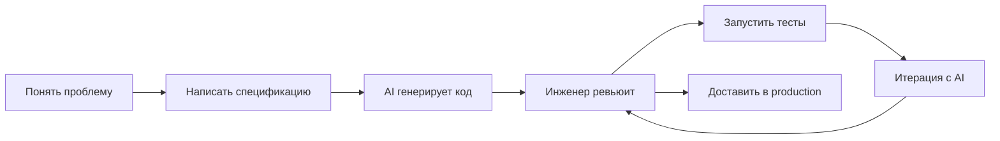

# Уровень 18: AI-assisted инженерия — подробная теория

## Состояние дел в 2026

За последние два года AI-инструменты стали частью рабочего процесса большинства разработчиков. GitHub Copilot, Claude Code, Cursor, Windsurf — это не экзотика, а стандартный набор инструментов.

Данные из реальной практики: разработчики, использующие AI-ассистентов, пишут первый черновик кода в 2-4 раза быстрее. Но время до production-ready кода сократилось значительно меньше. Почему? Потому что написание кода — не самая медленная часть разработки. Понимание проблемы, архитектурные решения, code review, отладка, тестирование — всё это по-прежнему требует человека.

Аналогия: AI — это очень умный стажёр. Быстрый, продуктивный, знает синтаксис всех языков, читал всю документацию. Но у него нет опыта в вашем конкретном проекте, нет понимания бизнес-контекста, нет чувства «это технически верно, но неправильно для нашей команды». И он никогда не признает, что не знает чего-то — он сгенерирует уверенный ответ даже когда ошибается.

---

## Что AI делает хорошо

### Boilerplate и шаблонный код

AI великолепен в задачах с чётким паттерном и высоким объёмом:

```typescript
// Промпт: "Создай TypeScript сервис UserService с методами CRUD для работы
// с Prisma-моделью User. Используй интерфейс UserRepository.
// Бросай UserNotFoundError при отсутствии пользователя."

class UserService {
  constructor(private readonly repo: UserRepository) {}

  async findById(id: string): Promise<User> {
    const user = await this.repo.findById(id)
    if (!user) throw new UserNotFoundError(id)
    return user
  }

  async findAll(pagination: Pagination): Promise<PaginatedResult<User>> {
    return this.repo.findMany(pagination)
  }

  async create(dto: CreateUserDto): Promise<User> {
    const existing = await this.repo.findByEmail(dto.email)
    if (existing) throw new DuplicateEmailError(dto.email)
    return this.repo.save({ ...dto, id: crypto.randomUUID(), createdAt: new Date() })
  }

  async update(id: string, dto: UpdateUserDto): Promise<User> {
    await this.findById(id) // проверяем существование
    return this.repo.update(id, dto)
  }

  async delete(id: string): Promise<void> {
    await this.findById(id)
    await this.repo.delete(id)
  }
}
```

Такой код AI пишет за секунды, человек — за 10-15 минут. При этом качество сопоставимо при условии хорошего промпта.

### Написание тестов по существующему коду

```typescript
// Даёшь AI функцию, просишь написать тесты
// Результат — полный набор unit-тестов с edge cases

describe('calculateShippingCost', () => {
  it('applies standard rate for weight under 5kg', () => {
    expect(calculateShippingCost(3, 'standard')).toBe(150)
  })

  it('applies reduced rate for heavy items', () => {
    expect(calculateShippingCost(15, 'standard')).toBe(400)
  })

  it('applies express surcharge correctly', () => {
    expect(calculateShippingCost(3, 'express')).toBe(300)
  })

  it('throws for negative weight', () => {
    expect(() => calculateShippingCost(-1, 'standard')).toThrow(InvalidWeightError)
  })

  it('throws for zero weight', () => {
    expect(() => calculateShippingCost(0, 'standard')).toThrow(InvalidWeightError)
  })
})
```

AI часто находит edge cases, о которых разработчик не подумал: нулевые значения, отрицательные числа, пустые массивы.

### Объяснение незнакомого кода

```typescript
// Можно вставить непонятный legacy-код и спросить:
// "Объясни что делает эта функция, какие у неё побочные эффекты,
// есть ли потенциальные баги?"

function processQueue(q: any[], handler: Function, opts?: any) {
  const batch = opts?.batch ?? 10
  const delay = opts?.delay ?? 0
  return q.reduce((chain, item, i) => {
    return chain.then(() =>
      new Promise(resolve => {
        setTimeout(async () => {
          await handler(item)
          if (i % batch === 0 && i > 0) await sleep(delay)
          resolve(undefined)
        }, 0)
      })
    )
  }, Promise.resolve())
}
```

AI объяснит: sequential promise chain, batched delays, any-типизацию (риск runtime ошибок), отсутствие error handling.

### Рефакторинг с чётким критерием

```
Промпт: "Отрефакторь эту функцию:
1. Убери any, добавь строгие типы
2. Обработай ошибки через Result-тип, не исключения
3. Разбей на меньшие функции если длина > 20 строк
4. Не меняй внешний интерфейс"
```

---

## Что AI делает плохо

### Архитектурные решения

AI не знает контекст, который важен для архитектуры:
- Почему три года назад выбрали монолит вместо микросервисов
- Какие команды работают над проектом и как они разделены
- Какой технический долг накопился и почему его не трогают
- Какие SLA и нефункциональные требования у системы
- Почему вот это бизнес-правило именно такое

Спрашивать AI «как лучше архитектурно» — получить ответ, не учитывающий 90% ограничений вашего конкретного проекта.

### Безопасность

AI обучался на миллиардах строк кода из интернета. В интернете полно уязвимого кода. AI воспроизводит паттерны — включая небезопасные:

```typescript
// ❌ AI может сгенерировать такой код совершенно уверенно
async function findUser(req: Request) {
  const { name } = req.query
  // SQL injection — конкатенация строки в запрос
  const result = await db.query(`SELECT * FROM users WHERE name = '${name}'`)
  return result.rows[0]
}

// ❌ Небезопасная десериализация
app.post('/data', (req, res) => {
  const data = eval(`(${req.body.json})`) // Remote Code Execution
  res.json(data)
})

// ❌ Отсутствие ограничения попыток входа
app.post('/login', async (req, res) => {
  const user = await findUserByCredentials(req.body.email, req.body.password)
  // нет rate limiting, нет блокировки после N попыток
  if (user) return res.json({ token: generateToken(user) })
  res.status(401).json({ error: 'Invalid credentials' })
})
```

Правило: **весь AI-сгенерированный код требует security review**, особенно код, работающий с пользовательскими данными.

### Галлюцинации

AI не знает о своей неуверенности. Он одинаково уверенно говорит и когда прав, и когда нет:

```typescript
// AI может написать такой код для React 19
// Но метод useDeferredQuery() не существует

import { useDeferredQuery } from 'react' // ❌ несуществующий хук

function SearchResults({ query }: { query: string }) {
  const results = useDeferredQuery(() => searchAPI(query), [query])
  // ...
}
```

Или использовать deprecated API со стопроцентной уверенностью, потому что в тренировочных данных было больше старого кода.

---

## Prompt engineering для кода

### Контекст важнее директивы

```
❌ Слабый промпт:
"Оптимизируй мой код"

✅ Сильный промпт:
"Оптимизируй функцию processOrders() для обработки 100 000 записей за раз.
Текущая проблема: занимает 45 секунд, таймаут на 30.
Ограничения: нельзя менять сигнатуру, нельзя добавлять внешние зависимости.
Формат ответа: только код + объяснение что изменил и почему."
```

### Structured prompts: четыре компонента

```
1. ЗАДАЧА: что нужно сделать
   "Напиши функцию валидации кредитной карты"

2. ОГРАНИЧЕНИЯ: что нельзя или должно быть
   "Без сторонних библиотек. TypeScript strict mode. Возвращай ValidationResult."

3. ФОРМАТ: как должен выглядеть ответ
   "Только код. Без объяснений. С JSDoc."

4. ПРИМЕРЫ: образцы желаемого результата
   "Входные данные: { number: '4111111111111111', expiry: '12/28', cvv: '123' }
    Ожидаемый результат: { isValid: true, errors: [] }"
```

### Chain of thought: анализ перед реализацией

```
"Прежде чем писать код:
1. Определи edge cases для валидации кредитной карты
2. Перечисли алгоритм Луна для проверки номера
3. Затем реализуй"
```

Chain of thought заставляет AI «думать вслух» — это снижает частоту галлюцинаций и позволяет вам поправить направление до получения кода.

### Few-shot: показать пример желаемого кода

```
"Пиши тесты в таком стиле:

it('должен отклонить невалидный email', () => {
  const result = validateUser({ email: 'not-email', name: 'Alice' })
  expect(result.success).toBe(false)
  expect(result.errors).toContainEqual(
    expect.objectContaining({ field: 'email' })
  )
})

Теперь напиши такие же тесты для validateProduct()"
```

---

## Copilot-driven development

### TDD + AI: тест как спецификация

Классический TDD инвертируется: вы пишете тест (спецификацию), AI пишет реализацию.

```typescript
// Шаг 1: вы пишете тест
describe('PasswordStrengthChecker', () => {
  it('rejects passwords shorter than 8 characters', () => {
    expect(checkStrength('abc')).toEqual({ score: 0, feedback: ['At least 8 characters required'] })
  })

  it('gives score 1 for length only', () => {
    expect(checkStrength('abcdefgh')).toEqual({ score: 1, feedback: ['Add uppercase letters', 'Add numbers', 'Add special characters'] })
  })

  it('gives score 4 for strong password', () => {
    expect(checkStrength('Tr0ub4dor&3')).toEqual({ score: 4, feedback: [] })
  })
})

// Шаг 2: AI генерирует реализацию, которая проходит эти тесты
// Шаг 3: вы запускаете тесты и проверяете результат
// Шаг 4: если тесты падают — возвращаетесь к AI с ошибкой
```

Тест — это ваше мышление. Реализация — делегируется AI. Проверка — ваша.

### Spec-driven: типы как спецификация

```typescript
// Вы пишете интерфейсы и типы
interface CartService {
  addItem(cartId: string, item: CartItem): Promise<Cart>
  removeItem(cartId: string, itemId: string): Promise<Cart>
  applyPromo(cartId: string, promoCode: string): Promise<Cart>
  checkout(cartId: string, paymentDetails: PaymentDetails): Promise<Order>
}

type Cart = {
  id: string
  items: CartItem[]
  subtotal: number
  discount: number
  total: number
  promoCode?: string
}

type CartItem = {
  productId: string
  quantity: number
  unitPrice: number
}

// Промпт AI: "Реализуй CartService согласно интерфейсу.
// Используй InMemoryCartRepository.
// Discount применяется только при валидном promo code из списка VALID_CODES."
```

TypeScript-интерфейс — это машиночитаемая спецификация. AI понимает типы и соблюдает контракты.

### Review-driven: ваш главный навык

Самый важный навык в эпоху AI — **code review AI-кода**:

```typescript
// AI сгенерировал это. Найдите проблемы:

async function deleteUser(userId: string): Promise<void> {
  const user = await db.users.findById(userId)
  await db.orders.deleteMany({ userId }) // удаляем заказы пользователя
  await db.sessions.deleteMany({ userId })
  await db.users.delete(userId)
  await emailService.sendDeletionConfirmation(user.email)
}
```

Проблемы, которые должен заметить инженер:
1. Нет транзакции: если `delete(userId)` упадёт — заказы уже удалены, а пользователь нет. Данные в несогласованном состоянии
2. Нет проверки: что если `user` равен null? `.email` бросит TypeError
3. Email отправляется без проверки успеха удаления
4. Soft delete или hard delete? AI выбрал hard delete — это правильно для этого бизнеса?
5. Нет аудит-лога удаления

---

## Ограничения и риски в деталях

### Over-reliance: потеря инженерных навыков

```
Симптом: разработчик не может объяснить код, который принял в PR
Симптом: при отключении интернета (нет AI) — паника и потеря продуктивности
Симптом: код принимается без понимания, лишь бы тесты проходили

Противоядие:
- Периодически решать задачи полностью самостоятельно
- Не принимать код, который не можешь объяснить коллеге
- Использовать AI для объяснения чужого кода, а не для написания своего
```

### Context window: AI не видит всё

Языковые модели имеют ограниченный контекст. Даже при большом окне (200k токенов) реальная кодовая база — сотни тысяч строк, история решений, Slack-переписка, Jira-тикеты.

```
Что AI не знает без явного указания:
- Почему UserService не использует репозиторий напрямую (исторически так сложилось)
- Что поле `status` в Orders — legacy и его скоро уберут, добавлять новые проверки не надо
- Что этот модуль используется в трёх разных клиентах и нельзя менять публичный API
- Что у нас нет инфраструктуры для PostgreSQL в тестах, поэтому только InMemory

Решение: всегда давать релевантный контекст явно в промпте
```

### Лицензирование

AI-модели обучались на публичном коде, включая GPL и LGPL-лицензированные репозитории. Сгенерированный код теоретически может содержать фрагменты из лицензированных источников. Для коммерческих проектов это юридически неопределённая зона. GitHub Copilot предлагает фильтр «похожих публичных кодов» — полезная опция.

---

## AI-native workflow

### .cursorrules и CLAUDE.md

AI-native проекты добавляют файлы с контекстом для AI:

```markdown
# CLAUDE.md — контекст для AI-ассистентов

## Стек
- Runtime: Node.js 22, TypeScript 5.5
- HTTP: Fastify (не Express)
- ORM: Drizzle (не Prisma)
- Тесты: Vitest (не Jest)

## Соглашения
- Без semicolons, single quotes
- Без any — использовать unknown + type guard
- Ошибки через Result<T, E> из neverthrow, не исключения
- Все репозитории имплементируют интерфейс из domain/

## Запрещённые паттерны
- Не использовать Express-специфичные конструкции
- Не мокать модули через jest.mock (нет Jest)
- Не добавлять console.log — использовать logger из infrastructure/

## Архитектура
src/
  domain/      — бизнес-логика, интерфейсы (без зависимостей на инфраструктуру)
  application/ — use cases, orchestration
  infrastructure/ — реализации: DB, HTTP, email
  api/         — Fastify routes (тонкий слой)
```

Такой файл загружается в контекст AI автоматически и избавляет от повторения одних и тех же инструкций в каждом промпте.

### AI-friendly код

Код, который хорошо читается AI — как правило, хорошо читается людьми:

```typescript
// ✅ AI-friendly: явные имена, TypeScript интерфейсы, маленькие функции
interface DiscountCalculator {
  calculate(user: User, cart: Cart): Discount
}

type Discount = {
  percentage: number
  reason: string
  maxAmount?: number
}

class TierBasedDiscountCalculator implements DiscountCalculator {
  calculate(user: User, cart: Cart): Discount {
    if (user.tier === 'vip') return { percentage: 25, reason: 'VIP discount' }
    if (user.tier === 'premium') return { percentage: 15, reason: 'Premium discount' }
    return { percentage: 0, reason: 'No discount' }
  }
}
```

```typescript
// ❌ AI-unfriendly: неявная логика, магические числа, any
function calc(u: any, c: any) {
  return u.t === 'v' ? c.s * 0.75 : u.t === 'p' ? c.s * 0.85 : c.s
}
```

---

## Как AI меняет инженерные навыки

### AI-диаграмма рабочего процесса



Узкое место переместилось: раньше — написание кода, теперь — понимание проблемы и проверка решения.

### Что стало важнее

**Specification writing**: умение чётко описать задачу — теперь производственный навык. Плохое описание → плохой код от AI → время на исправление.

**Code review**: читать и оценивать больше кода, чем пишешь сам — ключевой навык.

**Debugging**: AI-код может работать в 90% случаев и ломаться в edge cases. Найти и исправить — инженерная задача.

**Архитектурное мышление**: AI может написать любую функцию. Решить, какие функции нужны и как они связаны — человек.

**Security mindset**: AI не думает об угрозах безопасности — это думаете вы.

### Что стало менее критичным

**Запоминание синтаксиса**: «как называется метод у Array для удаления дубликатов» — теперь можно спросить AI быстрее, чем открыть MDN.

**Boilerplate writing**: CRUD-сервисы, migration-файлы, тестовые фикстуры — всё это генерируется.

**Ручное переименование**: «переименуй `user` в `currentUser` во всём файле» — задача для AI.

---

## Этика и ответственность

### Принцип: AI-generated code = ваша ответственность

Нет такой вещи как «ну это AI написал». Если вы приняли PR — вы несёте ответственность за каждую строку. Баг в AI-коде, который вы приняли без понимания — ваш баг.

```
Не говори: "AI сгенерировал, я просто добавил"
Говори: "Я написал функцию X с помощью AI-инструментов"
```

### Не принимай код без понимания

```
Чеклист перед принятием AI-кода:
[ ] Я могу объяснить коллеге что делает каждая часть
[ ] Я проверил edge cases (null, пустые массивы, отрицательные числа)
[ ] Я проверил обработку ошибок (что если запрос упадёт?)
[ ] Я проверил безопасность (пользовательские данные, SQL, XSS)
[ ] Тесты проходят
[ ] Я уверен что API, которые используются, существуют в текущей версии библиотеки
```

### Используй AI для усиления, не для замены мышления

```
✅ AI помогает быстрее написать то, что вы уже понимаете
✅ AI объясняет незнакомый код — вы принимаете решение о нём
✅ AI генерирует варианты — вы выбираете подходящий

❌ AI принимает архитектурные решения
❌ AI делает security review
❌ AI решает, что правильно для вашего бизнеса
```

---

## Итог

- **AI в 2026** — это рабочий инструмент, не замена инженера. Как IDE или компилятор, только умнее
- **Хорош при**: boilerplate, тесты, документация, объяснение кода, рефакторинг с критерием
- **Плох при**: архитектура, безопасность, бизнес-контекст, novel алгоритмы, актуальные API
- **Галлюцинации реальны**: AI уверенно ошибается. Всегда проверяйте, запускайте тесты
- **Промпт = спецификация**: задача + ограничения + формат + примеры — четыре компонента
- **TDD + AI**: тест — ваша спецификация, реализация — делегируется AI
- **Ценность сместилась**: от написания кода к пониманию проблемы, code review, specification writing
- **AI-код — ваша ответственность**: нет оправдания «AI написал»
- **CLAUDE.md / .cursorrules**: контекст проекта для AI уменьшает повторяющиеся инструкции
