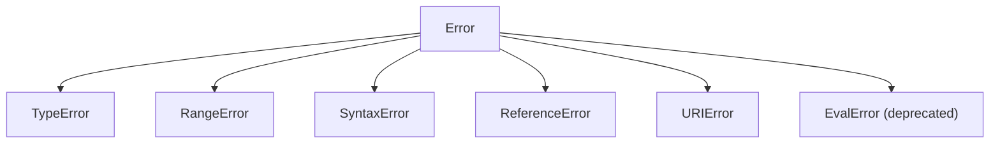

# 🔥 Level 1: Error Types

## 🎯 Introduction

JavaScript provides a whole family of built-in error types. Understanding their hierarchy and being able to create custom types is a key skill for writing reliable code.

## 📌 Built-in Error Types

### TypeError

Occurs when operating on unsuitable data types:

```javascript
null.toString()          // TypeError: Cannot read properties of null
undefined.method()       // TypeError: undefined is not a function
const x = 1; x()        // TypeError: x is not a function
```

### RangeError

Numeric value outside acceptable range:

```javascript
new Array(-1)                    // RangeError: Invalid array length
(1.5).toFixed(200)              // RangeError: toFixed() digits argument must be between 0 and 100
Number(1).toPrecision(200)      // RangeError
```

### SyntaxError

Syntax error during code parsing:

```javascript
JSON.parse('{invalid}')          // SyntaxError: Unexpected token i
eval('function(')                // SyntaxError: Unexpected end of input
```

### ReferenceError

Access to non-existent variable:

```javascript
console.log(undeclaredVariable)  // ReferenceError: undeclaredVariable is not defined
```

### URIError

Incorrect use of URI functions:

```javascript
decodeURIComponent('%')          // URIError: URI malformed
```

## 🔥 Inheritance Chain

All errors inherit from `Error`:



```javascript
const err = new TypeError('test')
err instanceof TypeError  // true
err instanceof Error      // true — because TypeError extends Error
```

## 🔥 Creating Custom Error Classes

### Basic pattern

```typescript
class ValidationError extends Error {
  field: string

  constructor(message: string, field: string) {
    super(message)
    this.name = 'ValidationError'  // Important: set the name
    this.field = field
  }
}

try {
  throw new ValidationError('Email is invalid', 'email')
} catch (error) {
  if (error instanceof ValidationError) {
    console.log(`Field ${error.field}: ${error.message}`)
  }
}
```

### 💡 Why setting name is important

The `name` property is used in `error.toString()` and in the stack:

```javascript
const err = new ValidationError('test', 'email')
console.log(err.toString()) // "ValidationError: test"
// Without setting name: "Error: test"
```

### Custom error hierarchy

```typescript
class AppError extends Error {
  code: string
  timestamp: Date

  constructor(message: string, code: string) {
    super(message)
    this.name = 'AppError'
    this.code = code
    this.timestamp = new Date()
  }
}

class HttpError extends AppError {
  statusCode: number

  constructor(message: string, statusCode: number) {
    super(message, `HTTP_${statusCode}`)
    this.name = 'HttpError'
    this.statusCode = statusCode
  }
}

class NotFoundError extends HttpError {
  constructor(resource: string) {
    super(`${resource} not found`, 404)
    this.name = 'NotFoundError'
  }
}
```

💡 Now you can catch errors at different levels:

```typescript
try {
  throw new NotFoundError('User')
} catch (error) {
  if (error instanceof NotFoundError) {
    // Specific handling for 404
  } else if (error instanceof HttpError) {
    // Any HTTP error
  } else if (error instanceof AppError) {
    // Any application error
  }
}
```

## 🎯 Type Guards for Errors

In TypeScript, the `catch` parameter has type `unknown`. Type guards are needed:

### Simple type guard

```typescript
function isError(value: unknown): value is Error {
  return value instanceof Error
}
```

### Type guard for objects with specific structure

```typescript
interface ApiError {
  error: { code: string; message: string }
}

function isApiError(value: unknown): value is ApiError {
  return (
    typeof value === 'object' &&
    value !== null &&
    'error' in value &&
    typeof (value as ApiError).error?.code === 'string'
  )
}
```

### Universal function for getting message

```typescript
function getErrorMessage(error: unknown): string {
  if (error instanceof Error) return error.message
  if (typeof error === 'string') return error
  return 'Unknown error'
}
```

## 📌 The cause Property (ES2022)

With ES2022 you can pass the cause of an error:

```typescript
try {
  try {
    JSON.parse(invalidData)
  } catch (parseError) {
    throw new AppError('Error loading data', 'PARSE_ERROR', {
      cause: parseError
    })
  }
} catch (error) {
  if (error instanceof AppError) {
    console.log(error.message)          // "Error loading data"
    console.log(error.cause)            // SyntaxError: ...
  }
}
```

## ✅ Best Practices

1. ✅ **Always inherit from Error** — for correct `instanceof` and stack operation
2. ✅ **Set `this.name`** — for readable error output
3. ✅ **Add context** — additional fields (code, field, statusCode)
4. ✅ **Use hierarchy** — catch errors at different detail levels
5. ✅ **Write type guards** — for safe work with `unknown` in TypeScript
6. ✅ **Use `cause`** — to preserve the error chain

## ⚠️ Common Beginner Mistakes

### 🐛 1. Inheritance without calling super()

```typescript
// ❌ Bad
class MyError extends Error {
  constructor(message: string) {
    // forgot super(message)
    this.name = 'MyError'
  }
}
```

> **Why this is an error:** without calling `super(message)`, the base `Error` class is not initialized. As a result, `message` will be empty, the call stack (`stack`) won't be formed, and in strict mode the code will throw `ReferenceError` altogether because `this` is not initialized before calling `super()`.

```typescript
// ✅ Good
class MyError extends Error {
  constructor(message: string) {
    super(message)
    this.name = 'MyError'
  }
}
```

### 🐛 2. Forget to set name

```typescript
// ❌ Bad
class NetworkError extends Error {
  constructor(message: string) {
    super(message)
    // name is not set
  }
}
const err = new NetworkError('timeout')
console.log(err.toString()) // "Error: timeout" — not informative!
```

> **Why this is an error:** without setting `name`, when logging and in the stack, the error displays as a plain `Error`. This is critical for debugging — you won't be able to distinguish `NetworkError` from `ValidationError` in logs. The `name` property is inherited from `Error` and is `"Error"` by default.

```typescript
// ✅ Good
class NetworkError extends Error {
  constructor(message: string) {
    super(message)
    this.name = 'NetworkError'
  }
}
console.log(new NetworkError('timeout').toString()) // "NetworkError: timeout"
```

### 🐛 3. Type checking via error.name instead of instanceof

```typescript
// ❌ Bad
try {
  doSomething()
} catch (error) {
  if ((error as Error).name === 'ValidationError') {
    // Fragile check — depends on string
  }
}
```

> **Why this is an error:** checking by string `name` is fragile — a typo in the string won't cause a compilation error, class name refactoring won't be caught by TypeScript. Besides, `instanceof` checks the whole inheritance chain, while string `name` comparison only checks exact match.

```typescript
// ✅ Good
try {
  doSomething()
} catch (error) {
  if (error instanceof ValidationError) {
    // Reliable check with inheritance support
  }
}
```

## 📌 Summary

- 📌 JS has 6 built-in error types, all inherit from `Error`
- 🔥 Custom Error classes allow adding business context to errors
- 🔥 Error hierarchy provides flexible handling at different levels
- ✅ Type guards are necessary in TypeScript for safe work with `unknown`
