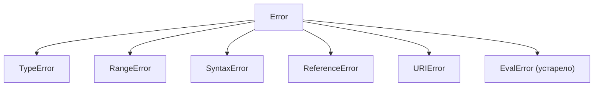

# 🔥 Уровень 1: Типы ошибок

## 🎯 Введение

JavaScript предоставляет целое семейство встроенных типов ошибок. Понимание их иерархии и умение создавать собственные типы — ключевой навык для написания надёжного кода.

## 📌 Встроенные типы ошибок

### TypeError

Возникает при операции с неподходящим типом данных:

```javascript
null.toString()          // TypeError: Cannot read properties of null
undefined.method()       // TypeError: undefined is not a function
const x = 1; x()        // TypeError: x is not a function
```

### RangeError

Числовое значение вне допустимого диапазона:

```javascript
new Array(-1)                    // RangeError: Invalid array length
(1.5).toFixed(200)              // RangeError: toFixed() digits argument must be between 0 and 100
Number(1).toPrecision(200)      // RangeError
```

### SyntaxError

Синтаксическая ошибка при парсинге кода:

```javascript
JSON.parse('{invalid}')          // SyntaxError: Unexpected token i
eval('function(')                // SyntaxError: Unexpected end of input
```

### ReferenceError

Обращение к несуществующей переменной:

```javascript
console.log(undeclaredVariable)  // ReferenceError: undeclaredVariable is not defined
```

### URIError

Некорректное использование URI-функций:

```javascript
decodeURIComponent('%')          // URIError: URI malformed
```

## 🔥 Цепочка наследования

Все ошибки наследуют от `Error`:



```javascript
const err = new TypeError('test')
err instanceof TypeError  // true
err instanceof Error      // true — потому что TypeError extends Error
```

## 🔥 Создание Custom Error классов

### Базовый паттерн

```typescript
class ValidationError extends Error {
  field: string

  constructor(message: string, field: string) {
    super(message)
    this.name = 'ValidationError'  // Важно: установить имя
    this.field = field
  }
}

try {
  throw new ValidationError('Email некорректен', 'email')
} catch (error) {
  if (error instanceof ValidationError) {
    console.log(`Поле ${error.field}: ${error.message}`)
  }
}
```

### 💡 Почему важно устанавливать name

Свойство `name` используется в `error.toString()` и в стеке:

```javascript
const err = new ValidationError('test', 'email')
console.log(err.toString()) // "ValidationError: test"
// Без установки name: "Error: test"
```

### Иерархия кастомных ошибок

```typescript
class AppError extends Error {
  code: string
  timestamp: Date

  constructor(message: string, code: string) {
    super(message)
    this.name = 'AppError'
    this.code = code
    this.timestamp = new Date()
  }
}

class HttpError extends AppError {
  statusCode: number

  constructor(message: string, statusCode: number) {
    super(message, `HTTP_${statusCode}`)
    this.name = 'HttpError'
    this.statusCode = statusCode
  }
}

class NotFoundError extends HttpError {
  constructor(resource: string) {
    super(`${resource} не найден`, 404)
    this.name = 'NotFoundError'
  }
}
```

💡 Теперь можно ловить ошибки на разных уровнях:

```typescript
try {
  throw new NotFoundError('Пользователь')
} catch (error) {
  if (error instanceof NotFoundError) {
    // Конкретная обработка 404
  } else if (error instanceof HttpError) {
    // Любая HTTP ошибка
  } else if (error instanceof AppError) {
    // Любая ошибка приложения
  }
}
```

## 🎯 Type Guards для ошибок

В TypeScript `catch` параметр имеет тип `unknown`. Нужны type guards:

### Простой type guard

```typescript
function isError(value: unknown): value is Error {
  return value instanceof Error
}
```

### Type guard для объектов с определённой структурой

```typescript
interface ApiError {
  error: { code: string; message: string }
}

function isApiError(value: unknown): value is ApiError {
  return (
    typeof value === 'object' &&
    value !== null &&
    'error' in value &&
    typeof (value as ApiError).error?.code === 'string'
  )
}
```

### Универсальная функция получения сообщения

```typescript
function getErrorMessage(error: unknown): string {
  if (error instanceof Error) return error.message
  if (typeof error === 'string') return error
  return 'Неизвестная ошибка'
}
```

## 📌 Свойство cause (ES2022)

С ES2022 можно передавать причину ошибки:

```typescript
try {
  try {
    JSON.parse(invalidData)
  } catch (parseError) {
    throw new AppError('Ошибка загрузки данных', 'PARSE_ERROR', {
      cause: parseError
    })
  }
} catch (error) {
  if (error instanceof AppError) {
    console.log(error.message)          // "Ошибка загрузки данных"
    console.log(error.cause)            // SyntaxError: ...
  }
}
```

## ✅ Лучшие практики

1. ✅ **Всегда наследуйте от Error** — для корректной работы `instanceof` и стека
2. ✅ **Устанавливайте `this.name`** — для читаемого вывода ошибки
3. ✅ **Добавляйте контекст** — дополнительные поля (code, field, statusCode)
4. ✅ **Используйте иерархию** — можно ловить ошибки на разном уровне детализации
5. ✅ **Пишите type guards** — для безопасной работы с `unknown` в TypeScript
6. ✅ **Используйте `cause`** — для сохранения цепочки ошибок

## ⚠️ Частые ошибки новичков

### 🐛 1. Наследование без вызова super()

```typescript
// ❌ Плохо
class MyError extends Error {
  constructor(message: string) {
    // забыли super(message)
    this.name = 'MyError'
  }
}
```

> **Почему это ошибка:** без вызова `super(message)` не инициализируется базовый класс `Error`. В результате `message` будет пустым, стек вызовов (`stack`) не сформируется, а в strict mode код вообще выбросит `ReferenceError`, потому что `this` не инициализирован до вызова `super()`.

```typescript
// ✅ Хорошо
class MyError extends Error {
  constructor(message: string) {
    super(message)
    this.name = 'MyError'
  }
}
```

### 🐛 2. Забыть установить name

```typescript
// ❌ Плохо
class NetworkError extends Error {
  constructor(message: string) {
    super(message)
    // name не установлен
  }
}
const err = new NetworkError('timeout')
console.log(err.toString()) // "Error: timeout" — не информативно!
```

> **Почему это ошибка:** без установки `name` при логировании и в стеке ошибка отображается как обычный `Error`. Это критично при отладке — вы не сможете отличить `NetworkError` от `ValidationError` в логах. Свойство `name` наследуется от `Error` и по умолчанию равно `"Error"`.

```typescript
// ✅ Хорошо
class NetworkError extends Error {
  constructor(message: string) {
    super(message)
    this.name = 'NetworkError'
  }
}
console.log(new NetworkError('timeout').toString()) // "NetworkError: timeout"
```

### 🐛 3. Проверка типа через error.name вместо instanceof

```typescript
// ❌ Плохо
try {
  doSomething()
} catch (error) {
  if ((error as Error).name === 'ValidationError') {
    // Хрупкая проверка — зависит от строки
  }
}
```

> **Почему это ошибка:** проверка по строке `name` хрупкая — опечатка в строке не вызовет ошибку компиляции, рефакторинг имени класса не будет отловлен TypeScript. Кроме того, `instanceof` проверяет всю цепочку наследования, а сравнение строки `name` — только точное совпадение.

```typescript
// ✅ Хорошо
try {
  doSomething()
} catch (error) {
  if (error instanceof ValidationError) {
    // Надёжная проверка с поддержкой наследования
  }
}
```

## 📌 Итоги

- 📌 JS имеет 6 встроенных типов ошибок, все наследуют от `Error`
- 🔥 Custom Error классы позволяют добавить бизнес-контекст к ошибкам
- 🔥 Иерархия ошибок даёт гибкую обработку на разных уровнях
- ✅ Type guards необходимы в TypeScript для безопасной работы с `unknown`
