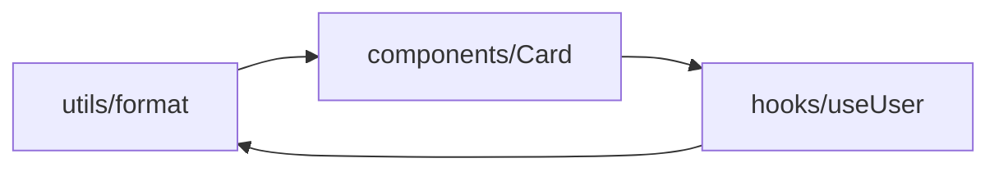
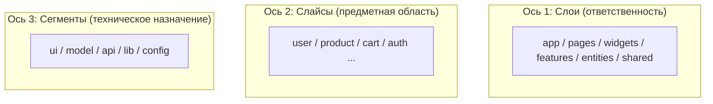
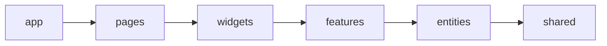

# Уровень 0: Зачем архитектура и что такое FSD (подробно)

## 1. Проблема, которую мы решаем

Любой фронтенд начинается одинаково: `src/components`, `src/utils`, `src/hooks`.
Пока проект маленький — работает. Но объём растёт нелинейно, и папка `components`
превращается в свалку из 300 файлов, где `Button` соседствует с
`CheckoutPaymentForm`. Возникают три системные боли.

### 1.1. Где живёт фича?

Спросите себя: *«где код оформления заказа?»* В папочной раскладке ответ —
«в `components/Checkout*`, в `utils/order.ts`, в `hooks/useCart.ts`, в
`api/orders.ts`». Фича размазана по техническим папкам. Чтобы понять её целиком,
надо держать в голове полкодовой базы.

FSD переворачивает вопрос: код группируется **по смыслу** (слайс `checkout`), а не
по техническому типу файла.

### 1.2. Клубок импортов и циклы

Когда всё лежит рядом и «всё может импортировать всё», связи растут квадратично.
Появляются **циклические зависимости** — A импортирует B, B импортирует A. Сборщик
их терпит, но в рантайме получаете `undefined` на ровном месте, а рефакторинг
превращается в сапёрство.



FSD запрещает такие связи **структурно**: импорты разрешены только «вниз» по слоям,
слайсы одного слоя изолированы. Цикл между слоями просто невозможно написать, не
нарушив явное правило, которое ловит линтер.

### 1.3. Страх изменений

Без границ каждый файл — потенциальная зависимость каждого другого. Меняешь один —
не знаешь, что отвалится. FSD вводит **public API**: слайс общается с внешним миром
через единственный `index.ts`. Внутренности можно перетасовывать свободно — пока
контракт `index.ts` держится, снаружи ничего не ломается.

## 2. Три измерения FSD

FSD раскладывает код по трём независимым осям. Это её ядро — держите в голове.



Путь к файлу в FSD читается как предложение:

```
src / features / add-to-cart / ui / AddButton.tsx
      └ слой ┘  └── слайс ──┘ └сегм┘ └── файл ──┘
```

«В слое **features** есть слайс **add-to-cart**, у него сегмент **ui**, в нём
компонент **AddButton**». Каждая часть пути отвечает на свой вопрос: *какой уровень
ответственности? про какую предметную область? какого технического рода код?*

## 3. Слои и правило однонаправленности

Слоёв в v2 ровно шесть, сверху вниз:

| Слой | Ответственность | Пример |
|------|-----------------|--------|
| `app` | инициализация, провайдеры, роутинг, глобальные стили | `<AppProviders>` |
| `pages` | страницы-композиции под маршруты | `ProfilePage` |
| `widgets` | самостоятельные блоки интерфейса | `Header`, `Sidebar` |
| `features` | пользовательские сценарии (действия) | `add-to-cart`, `login` |
| `entities` | бизнес-сущности предметной области | `user`, `product` |
| `shared` | переиспользуемый код без бизнес-смысла | `Button`, `apiClient` |

**Золотое правило:** модуль слоя может импортировать только **нижележащие** слои.



- `pages` может взять `widgets`, `features`, `entities`, `shared` — да.
- `entities` может взять только `shared` — да.
- `features` импортирует `pages` — **нет** (импорт вверх запрещён).
- `entities/user` импортирует `entities/product` — **нет** (cross-import на одном
  слое запрещён, композиция поднимается выше).

Почему именно так? Однонаправленный граф **ацикличен по построению**. Нижние слои
ничего не знают о верхних, поэтому переиспользуемы; верхние свободно комбинируют
нижние. Зависимости текут в одну сторону — как вода.

## 4. История: почему именно v2

FSD развивался итеративно, и в интернете полно устаревших статей. Ключевые отличия
актуальной **v2**:

- **Убран слой `processes`.** В v1 он отвечал за межстраничные сценарии, но на
  практике оказался размытым — его функции разошлись по `pages`, `features`,
  `widgets`.
- **Обязательный public API.** Каждый слайс закрыт `index.ts`; глубокие импорты в
  обход считаются нарушением и ловятся линтером.
- **`@x`-нотация для cross-import.** Когда одной сущности всё же нужен тип другой,
  это делается через явный публичный «кросс-API» `entities/product/@x/user`, а не
  прямым импортом.

В курсе мы придерживаемся v2 и того, что проверяет официальный линтер
**Steiger**. Первоисточник — `feature-sliced.design`.

## Хорошие практики

- **Думайте слайсами, а не файлами.** Новую функциональность начинайте с вопроса
  «какой это слайс и на каком слое», а не «в какую из технических папок положить».
- **Держите граф однонаправленным.** Если тянет импортировать «вверх» или соседа —
  это сигнал, что композицию надо поднять на слой выше.
- **Закрывайте слайсы public API сразу**, даже если внутри пока один файл. Дешевле
  ввести дверь заранее, чем прорубать её потом сквозь десяток глубоких импортов.

## Частые ошибки новичков

- **«FSD — это просто набор папок».** Нет. Папки без правил однонаправленности и
  public API не дают ничего — это косметика.
- **Тащить всё в `shared`.** `shared` — для кода **без** бизнес-смысла. Сущность
  `user` там не место.
- **Ориентироваться на старые статьи с `processes`.** Слой удалён; проверяйте, что
  читаете про v2.
- **Делать `index.ts` толстым.** Public API — тонкий файл только с реэкспортами, а
  не место для логики.

📌 Итог: FSD задаёт три оси (слои / слайсы / сегменты) и одно жёсткое правило —
зависимости только вниз. Это превращает код из «квартиры-свалки» в дом с этажами и
подписанными комнатами, где новичок находит нужное за минуту, а изменения не
разлетаются по всей базе.
