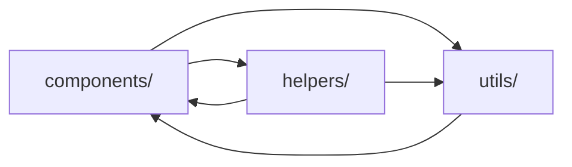
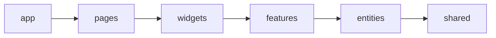

# Уровень 0: Зачем нужна архитектура и что такое FSD

Представьте квартиру, где вещи лежат «где придётся»: ложка в шкафу с одеждой,
паспорт в холодильнике, зарядка в обувной коробке. Один человек ещё как-то помнит,
что где. Но приходит второй — и всё, поиск занимает часы. Кодовая база без
архитектуры — ровно такая квартира.

## Боль без архитектуры

Классическая папочная раскладка `components / utils / hooks / helpers` не отвечает
на главный вопрос: **где живёт фича «оформление заказа»?** Она размазана по всем
папкам сразу. Отсюда:

- **клубок импортов** — всё зависит от всего, появляются циклы;
- **страшно менять** — трогаешь один файл, ломается в трёх других местах;
- **онбординг долгий** — новичку негде «зацепиться глазом».

## Что такое Feature-Sliced Design

**FSD** — методология организации фронтенд-кода. Она задаёт **три измерения**:

1. **Слои** (layers) — уровни ответственности: `app`, `pages`, `widgets`,
   `features`, `entities`, `shared`.
2. **Слайсы** (slices) — деление по предметной области: `user`, `product`, `cart`.
3. **Сегменты** (segments) — техническое назначение: `ui`, `model`, `api`, `lib`.

Главный принцип — **однонаправленность**: код зависит только «вниз» по слоям.
`pages` знает про `features`, но `features` никогда не знает про `pages`.

## Немного истории: v1 → v2

FSD прошёл через переработку. В версии **v2** (актуальной):

- слой `processes` признан устаревшим и убран;
- у каждого слайса появился обязательный **public API** (`index.ts`);
- уточнены правила изоляции слайсов и cross-import через `@x`-нотацию.

В курсе мы говорим о **v2** — именно её проверяет `@feature-sliced/steiger`.

📌 Итог: FSD — это не «ещё папки», а система правил, которая делает зависимости
предсказуемыми, а изменения — локальными. Дальше разберём каждое измерение.
