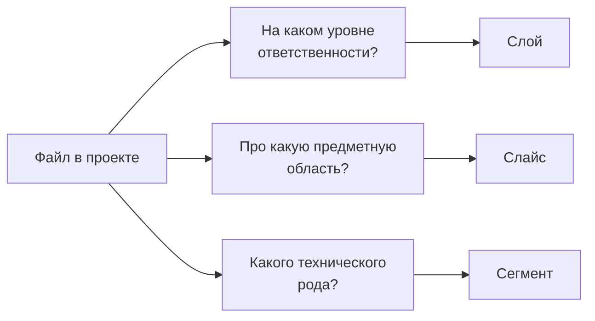
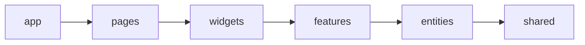
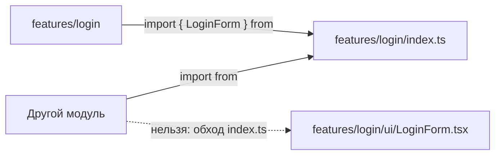
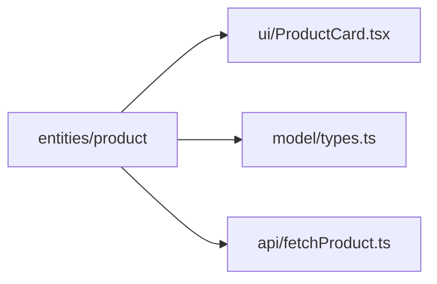
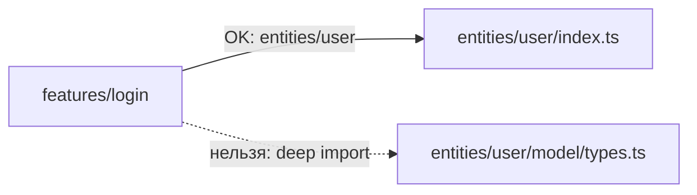

# Уровень 1: Три измерения FSD — слои, слайсы, сегменты (подробно)

## 1. Почему одной оси недостаточно

Представьте, что вы делите книги в библиотеке только по одному признаку —
например, по цвету обложки. Красные книги вперемешку: детективы, учебники по
физике, поваренные книги. Найти что-то конкретное можно только перебором.

Библиотеки в реальности используют **несколько независимых классификаторов
одновременно**: раздел (художественная / техническая), автор, номер на полке.
FSD поступает так же с кодом — вводит **три независимые оси**, и адрес файла
складывается из ответов на три разных вопроса.



Каждая ось решает свою задачу и не зависит от других: слайс `cart` может
существовать и на слое `entities` (сущность корзины), и на слое `features`
(фича «добавить в корзину») — это разные модули, просто оба про корзину.

## 2. Ось 1: Слои (layers) — уровень ответственности

Слоёв в FSD v2 ровно шесть, они образуют строгую иерархию сверху вниз:

| Слой | Вопрос, на который отвечает | Пример |
|------|------------------------------|--------|
| `app` | Как приложение стартует целиком? | провайдеры, роутер, глобальные стили |
| `pages` | Что показать по этому маршруту? | `ProfilePage`, `CartPage` |
| `widgets` | Какой самостоятельный блок интерфейса? | `Header`, `ProductGallery` |
| `features` | Какое действие может совершить пользователь? | `add-to-cart`, `login` |
| `entities` | Какая бизнес-сущность здесь участвует? | `user`, `product`, `order` |
| `shared` | Какой код не про бизнес вообще? | `Button`, `apiClient`, `useDebounce` |

**Правило импортов — только вниз:**



Модуль на слое `features` может импортировать `entities` и `shared`, но
никогда — `widgets`, `pages` или `app`. Это не стилистическая рекомендация, а
жёсткое правило, которое проверяется линтером (Steiger). Нарушение = ошибка
сборки правил, а не просто «некрасиво».

Дополнительно: **слайсы одного слоя не видят друг друга напрямую** (кроме
`shared`, у которого слайсов нет вовсе). `entities/user` не может
импортировать `entities/product` — если сущностям нужно взаимодействовать,
композиция поднимается на слой выше (например, в `widgets`) либо используется
явная `@x`-нотация кросс-импорта.

## 3. Ось 2: Слайсы (slices) — предметная область

Слайс — это единица деления **внутри слоя** по смыслу: какой сущности или
какому сценарию посвящён код. Имена слайсов не фиксированы стандартом — их
придумывает команда под свой домен:

```
entities/
  user/       ← слайс: сущность «пользователь»
  product/    ← слайс: сущность «товар»
  order/      ← слайс: сущность «заказ»

features/
  add-to-cart/    ← слайс: сценарий «добавить в корзину»
  login/          ← слайс: сценарий «войти»
  toggle-favorite/← слайс: сценарий «переключить избранное»
```

**Слайсы одного слоя изолированы** — это ключевое свойство. `features/login`
не заглядывает во внутренности `features/add-to-cart`, даже если они лежат
рядом. Единственный канал общения — **public API** слайса, файл `index.ts`:



Такая изоляция даёт то же самое, что даёт слоям однонаправленность:
предсказуемость. Меняя внутренности слайса `add-to-cart`, вы точно знаете, что
сломать можете только контракт `index.ts` — а его видно целиком в одном файле.

У `shared` слайсов нет — это единственный слой без деления по предметной
области, потому что весь его код по определению не про конкретную бизнес-сущность.

## 4. Ось 3: Сегменты (segments) — техническое назначение

Сегмент — это деление **внутри слайса** по роду кода. Стандартный набор:

| Сегмент | Что там лежит |
|---------|---------------|
| `ui` | React-компоненты, стили |
| `model` | состояние, типы, бизнес-логика слайса (стор, селекторы, схемы) |
| `api` | запросы к серверу, относящиеся к слайсу |
| `lib` | внутренние утилиты слайса, не годные для переиспользования вовне |
| `config` | константы, флаги конфигурации слайса |

Сегменты — не жёсткий список, а конвенция: используйте те, что нужны, не
плодите пустые папки. Слайс из одного файла может вообще не иметь сегментов,
пока не разрастётся.



## 5. Складываем оси в путь

Путь к файлу — это всегда: `src/<layer>/<slice>/<segment>/<file>` (для
`shared` слайса нет, поэтому там `src/shared/<segment>/<file>`).

```
src/features/add-to-cart/ui/AddButton.tsx
     └─слой─┘ └───слайс────┘ └сегм┘ └─файл──┘

src/entities/product/model/types.ts
     └─слой──┘ └─слайс─┘ └─сегм─┘ └──файл──┘

src/shared/ui/Button.tsx
     └слой─┘ └сегм┘ └─файл─┘
```

Прочитать путь — значит ответить на три вопроса сразу: *на каком уровне
ответственности, про какую предметную область, какого технического рода этот
код*. Опытный разработчик по одному пути понимает контекст файла, не открывая
его — этого не даёт ни одна плоская раскладка.

## 6. Public API как граница между осями

Важно понимать: границы **слоёв** и границы **слайсов** проверяются по-разному.

- Между **слоями** нельзя импортировать вверх — линтер смотрит на позицию в
  иерархии `app > pages > widgets > features > entities > shared`.
- Между **слайсами** одного слоя нельзя импортировать напрямую в сегмент —
  только через `index.ts` слайса. Это называется «нет глубокого импорта»
  (`no deep import`) и работает даже для слайсов на *разрешённом* нижнем слое:
  `features/login` может импортировать `entities/user`, но обязан делать это
  через `entities/user/index.ts`, а не `entities/user/model/types.ts` напрямую.



## Хорошие практики

- **Начинайте проектирование с вопроса «слой → слайс → сегмент», в этом
  порядке.** Сначала определите уровень ответственности, потом предметную
  область, потом технический род — так путь получится однозначным.
- **Заводите сегмент только когда он нужен.** Слайс из одного `ui`-компонента
  не обязан иметь пустые `model/api/lib`.
- **Используйте `@x`-нотацию для осознанных кросс-импортов между сущностями**,
  а не тихий прямой импорт в обход правил — так связь видна в коде и в
  ревью.
- **Называйте слайсы по бизнес-смыслу, а не по техническому признаку.**
  `add-to-cart`, а не `cart-button-logic`.
- **Держите `index.ts` слайса тонким** — только реэкспорты того, что нужно
  снаружи, без логики внутри самого файла.

## Частые ошибки новичков

- **Путать слой и слайс.** «У меня слой `user`» — нет, `user` это слайс, а
  слой — `entities`. Слоёв всего шесть, и их имена всегда одни и те же.
- **Импортировать сегмент напрямую в обход `index.ts` чужого слайса.**
  ```ts
  // ❌ плохо: глубокий импорт в чужой слайс
  import { User } from '@/entities/user/model/types'
  ```
  ```ts
  // ✅ хорошо: через публичный API
  import { User } from '@/entities/user'
  ```
- **Складывать сущности разных доменов в один слайс** — например, `user` и
  `profile-settings` в одну папку `entities/user`, хотя это разные предметные
  области. Каждая заслуживает своего слайса.
- **Заводить сегмент `utils` вместо `lib`.** Конвенция FSD — `lib` для
  внутренних утилит слайса; `utils` — название из плоской раскладки, которое
  тянет за собой старые привычки.
- **Класть бизнес-сущность в `shared`,** потому что «она используется в
  нескольких местах». Переиспользуемость — не критерий для `shared`;
  критерий — отсутствие бизнес-смысла.

📌 Итог: три оси не пересекаются и не подменяют друг друга. Слой — про
ответственность и иерархию импортов, слайс — про предметную область и
изоляцию через public API, сегмент — про технический род кода внутри слайса.
Освоив эту сетку координат, вы сможете и находить любой файл по описанию, и
предсказывать, куда положить новый код.
