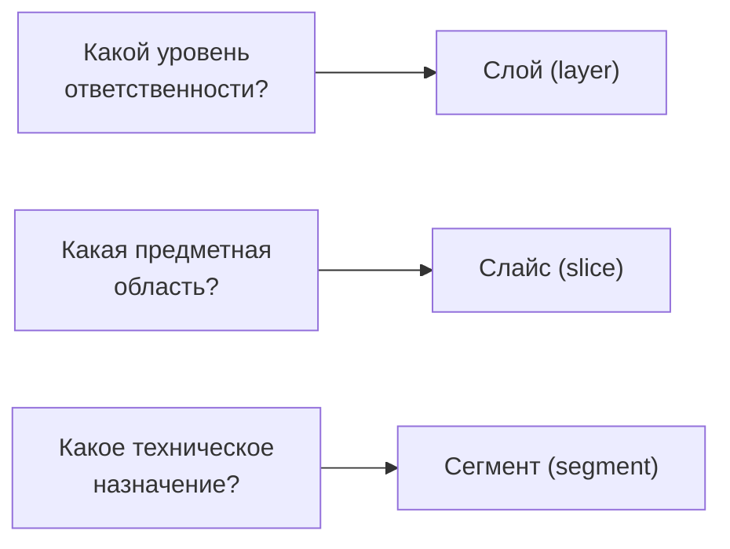

# Уровень 1: Три измерения FSD — слои, слайсы, сегменты

В прошлом уровне мы увидели путь `src/features/add-to-cart/ui/AddButton.tsx` и
прочитали его как предложение. Теперь разберём это предложение по частям —
каждое измерение FSD отвечает на свой отдельный вопрос.

## Три вопроса — три оси



- **Слой (layer)** — *насколько это высокоуровневый код*. Шесть фиксированных
  значений: `app pages widgets features entities shared`.
- **Слайс (slice)** — *про какую сущность или сценарий этот код*. Значения
  придумывает команда: `user`, `product`, `cart`, `add-to-cart`.
- **Сегмент (segment)** — *какого технического рода этот код внутри слайса*.
  Обычно: `ui`, `model`, `api`, `lib`, `config`.

## Как оси складываются в путь

```
src / <layer>   / <slice>       / <segment> / <файл>
    / features  / add-to-cart   / ui        / AddButton.tsx
    / entities  / product       / model     / types.ts
    / shared    / —             / ui        / Button.tsx
```

📌 У `shared` слайса нет — там код без бизнес-смысла, делить по предметной
области нечего. Сегменты там группируют переиспользуемые вещи: `shared/ui`,
`shared/api`, `shared/lib`, `shared/config`.

## Зачем разделять оси именно так

Если слить оси в одну — получится либо «плоская» папка (как в
`components/utils`), либо папка, которая одновременно пытается сказать «это
слой» и «это сущность», и путается. Разделение осей даёт три независимых,
понятных фильтра: *хочу увидеть все features* → фильтр по слою; *хочу увидеть
всё про cart* → фильтр по слайсу через все слои; *хочу увидеть всю бизнес-логику
без UI* → фильтр по сегменту `model`.

📌 Итог: слой отвечает «на каком уровне», слайс — «про что», сегмент — «какого
рода». Вместе они превращают путь к файлу в точный адрес, а не в загадку.
