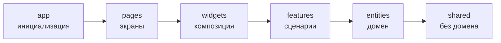
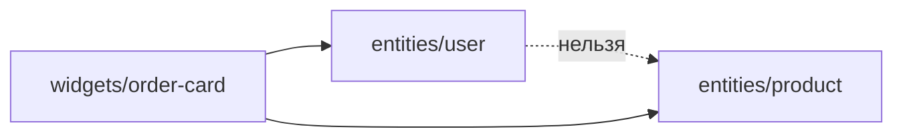

# Уровень 2 (подробно): Слои и правило направления

## Зачем вообще нужен порядок слоёв

Шесть слоёв FSD — `app pages widgets features entities shared` — выстроены не
по алфавиту и не случайно. Порядок кодирует **степень абстракции**: чем выше
слой, тем больше он знает про конкретный экран и сценарий приложения; чем
ниже — тем более общий и переиспользуемый код в нём лежит.



- `app` знает про всё приложение целиком (роутинг, провайдеры, глобальные стили).
- `pages` знает про конкретный экран и то, из чего он собран.
- `widgets` знает про несколько сущностей/фич, которые нужно скомпоновать на
  экране.
- `features` знает про один пользовательский сценарий («лайкнуть», «добавить в
  корзину»).
- `entities` знает про одну доменную сущность («что такое товар»), но ничего
  не знает про сценарии.
- `shared` не знает вообще ничего про бизнес — кнопки, хелперы, конфиг.

Каждый слой можно свободно **углубляться вниз** (пользоваться тем, что
абстрактнее его самого), но не имеет права **подниматься вверх** — иначе
общий, переиспользуемый код начинает знать о частностях, ради которых он не
писался.

## Что значит «импорт вверх» технически

Импорт вверх — это когда файл слоя с более низким рангом (более общий, ближе
к `shared`) импортирует что-то из слоя с более высоким рангом (более
специфичный, ближе к `app`).

```ts
// entities/user/model/permissions.ts
import { isPremiumUser } from '@/features/subscription' // ❌ entities → features
```

Проблема не в том, что импорт технически не соберётся — модуль спокойно
разрешится. Проблема в **семантике**: `entities/user` должен быть переиспользуем
в любом месте приложения, где нужен пользователь. Но стоит ему завязаться на
`features/subscription`, как он больше не может существовать без этой фичи —
переиспользовать сущность отдельно уже нельзя, а удалить фичу подписки —
значит сломать сущность.

### Лечится инверсией зависимости

Решение всегда одно и то же: **то, что нужно сущности, ей передают явно**, а
не она сама идёт и берёт.

```ts
// ❌ было: сущность тянется наверх
export function canEditProfile(user: User): boolean {
  return isPremiumUser(user.id) // импорт из features
}

// ✅ стало: сущность принимает готовый факт параметром
export function canEditProfile(user: User, isPremium: boolean): boolean {
  return isPremium
}
```

Тот, кто вызывает `canEditProfile` (а это код на слое `features` или выше),
сам вычисляет `isPremium` и передаёт его вниз. Направление знания
развернулось: раньше `entities` знала про `features`, теперь `features` знает
про `entities` — и это ровно то направление, которое разрешено.

То же самое с UI: вместо того чтобы виджет запрашивал данные у страницы,
страница передаёт их виджету пропом.

```ts
// ❌ widgets импортирует функцию со страницы
import { getCurrentUser } from '@/pages/checkout'

// ✅ pages передаёт то, что нужно, виджету пропом
<OrderSummary total={2500} user={demoUser} />
```

## Изоляция слайсов одного слоя

Второе следствие того же правила направления: слайсы одного слоя **не
общаются напрямую**.



Если `entities/product` начинает импортировать `entities/user`, две сущности
жёстко склеиваются, и почти неизбежно рано или поздно появится обратная
связь — цикл. Компоновка двух сущностей — обязанность слоя выше: `widget`,
который знает про обе и собирает их вместе.

## Правильный слой для кода — не только про направление импортов

Третий аспект темы — не «куда смотрит стрелка», а «на каком этаже стоит код».
Частый кейс новичков: бизнес-компонент кладут в `shared`, потому что «он
маленький и его можно переиспользовать».

```ts
// shared/ui/AddToCartButton.tsx
import { cartStore } from '@/entities/cart' // ❌ shared знает про entities
```

Формально это тоже импорт вверх: `shared` — самый нижний слой (ранг наивысший),
и любой импорт из вышестоящего домена для него запрещён. Но смысл ошибки
шире: `shared` — это код **без бизнес-смысла**. Кнопка «В корзину» знает про
корзину — то есть про домен, и её место в `features/add-to-cart`, где импорт
`entities/cart` уже легален (features стоит выше entities и может опускаться
к ней).

Правило простое: спросите себя — «если убрать весь бизнес-домен приложения,
этот код всё ещё будет иметь смысл?». Кнопка с обработчиком стилизации — да,
это `shared`. Кнопка, которая знает про корзину — нет, это `features`.

## Как это проверяется статически

Как и на прошлом уровне, для всех перечисленных правил не нужно запускать
код — достаточно посмотреть на пути файлов и граф импортов:

- у какого слоя ранг меньше, а у какого больше (`app`=0 … `shared`=5);
- есть ли у файла из слоя с большим рангом импорт файла из слоя с меньшим
  рангом — это и есть «импорт вверх»;
- совпадают ли слайсы при импорте внутри одного слоя (если нет — cross-import
  запрещён, кроме `shared`).

Именно так работает движок проверок `importsRespectLayers()` в заданиях этого
уровня.

## Хорошие практики

- **Рисуйте стрелки перед кодом.** Если чувствуете, что сущности «чего-то не
  хватает» — не импортируйте недостающее наверх, а добавьте параметр/проп.
- **Спрашивайте «кто должен знать про кого».** Правильный ответ почти всегда:
  верхний слой знает про нижний, а не наоборот.
- **Композицию поднимайте, а не пробрасывайте вбок.** Если двум сущностям
  нужно «познакомиться» — точка их встречи это `widget`, а не cross-import.
- **Проверяйте вопрос «а без домена это имеет смысл?»** перед тем, как класть
  код в `shared`.
- **Автоматизируйте проверку направления.** `@feature-sliced/steiger` или
  `eslint-plugin-boundaries` ловят импорт вверх на этапе ревью, а не в проде.

## Частые ошибки новичков

- **«Так проще получить значение».** Сущность или фича лезет наверх за
  готовым результатом вместо того, чтобы принять его параметром.
- **Виджет как источник данных для себя же.** Виджет запрашивает данные у
  страницы вместо того, чтобы страница передала их пропом — путают, кто кого
  должен обслуживать.
- **Домен в `shared` «для переиспользования».** Компонент с бизнес-логикой
  кладут в `shared`, забывая, что переиспользуемость — не про домен, а про
  отсутствие домена.
- **«Соседям же тоже нужно».** Сущность одного слайса напрямую импортирует
  сущность другого — вместо того чтобы поднять их знакомство на слой выше.
- **Частичная инверсия.** Убирают импорт, но забывают добавить параметр —
  функция перестаёт компилироваться или тихо теряет нужные данные. Проверяйте
  сигнатуру целиком, а не только строку импорта.

📌 Итог: у каждого слоя есть допустимое направление знания — только вниз.
Если хочется импортировать что-то выше себя, это сигнал, что нужный факт
должен прийти параметром или пропом сверху, а не запросом снизу.
