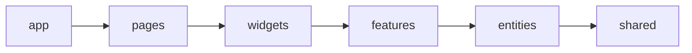

# Уровень 2: Слои и правило направления

Представьте офисное здание: этажи выше — стратегия и сборка (`app`, `pages`),
этажи ниже — переговорные с бизнес-логикой (`widgets`, `features`, `entities`),
подвал — склад строительных материалов (`shared`). Курьер с верхнего этажа
спокойно спускается в подвал за материалами. А вот подвал не должен звонить
наверх и указывать, что делать этажом выше — это переворачивает здание вверх
дном.

## Главное правило: импорт — только вниз



Каждый слой может импортировать только из слоёв **строго ниже себя** в этой
цепочке. Импорт в обратную сторону — ошибка архитектуры, даже если код
технически работает.

```ts
// entities/order/model/pricing.ts
import { getPromoDiscount } from '@/features/promo-code' // ❌ entities → features — вверх
```

```ts
// features/promo-code/model/apply.ts
import type { Order } from '@/entities/order' // ✅ features → entities — вниз
```

## Второе правило: слайсы одного слоя не знают друг о друге

`entities/user` не должен импортировать `entities/product` напрямую — оба
слайса на одном этаже, они не общаются через стену. Если нужна связка двух
сущностей — она собирается слоем выше: в `widget` или `feature`.

## И третье: код живёт на своём слое

Кнопка «в корзину» — это бизнес-сценарий (`features`), а не переиспользуемый
UI без домена (`shared`). Если код знает про сущности или пользовательские
действия — ему не место в `shared`.

## Как чинить нарушение

Когда нижний слой тянет верхний, обычно неправильно выбрано **направление
данных**: вместо того чтобы запрашивать что-то наверху, слой должен
**принимать это параметром или пропом**. Тот, кто выше по стеку, сам решает,
что передать вниз.

```ts
// ❌ entity сама лезет наверх за нужным значением
function getFinalPrice(order: Order) {
  const discount = getPromoDiscount(order.id) // тянет features
  return order.total * (1 - discount)
}

// ✅ entity просто принимает готовое значение
function getFinalPrice(order: Order, discount: number) {
  return order.total * (1 - discount)
}
```

## ⚠️ Частые ошибки новичков

- Сущность вызывает функцию из `features`/`widgets`, потому что «так проще
  получить нужное значение» — вместо параметра.
- Виджет запрашивает данные у страницы (`pages`), хотя страница как раз должна
  передавать их виджету.
- Бизнес-компонент кладут в `shared`, чтобы «переиспользовать», хотя он явно
  знает про сущность или пользовательский сценарий.

📌 Итог: рисуйте стрелки импортов на бумаге — если хоть одна идёт вверх,
разворачивайте её в параметр/проп, а не оставляйте как есть.
