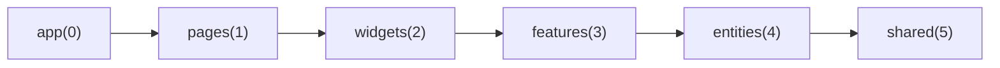
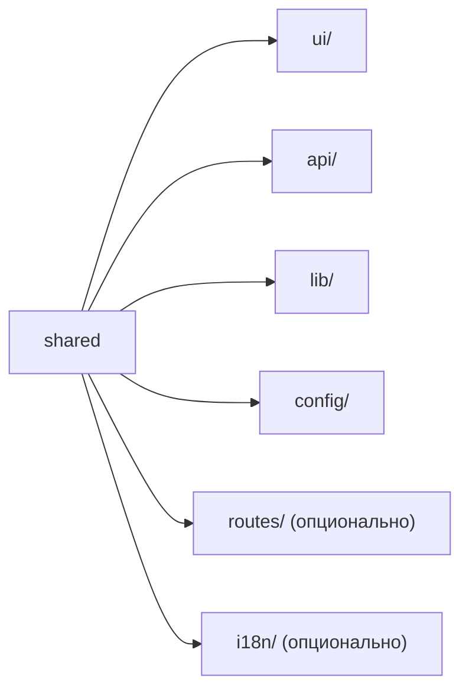
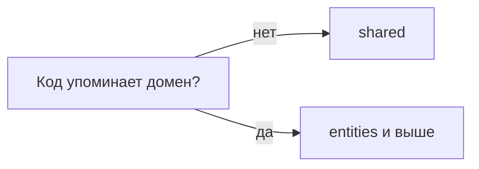
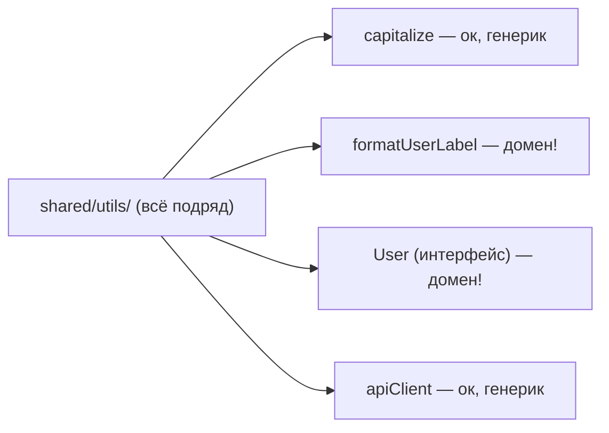
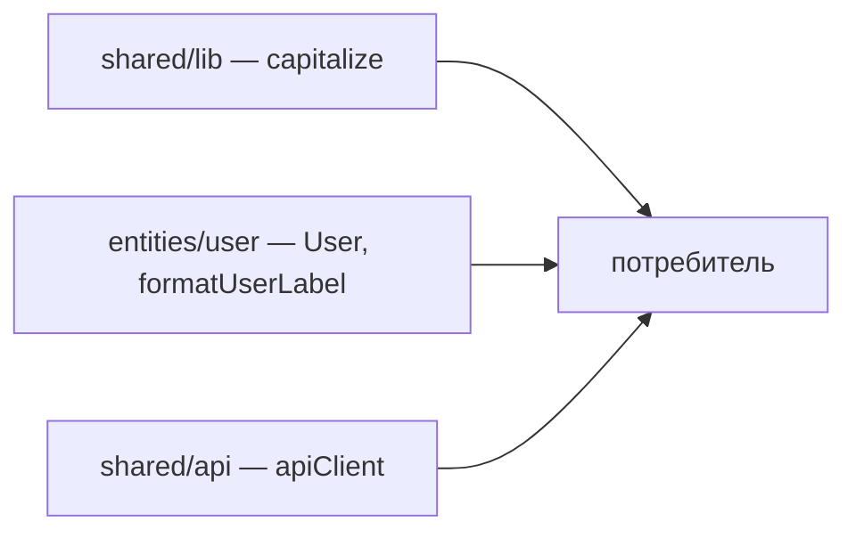

# Уровень 3 (подробно): Shared — фундамент без бизнес-смысла

## Место shared в иерархии слоёв



`shared` — самый нижний, самый общий слой. Именно поэтому его можно импортировать
из **любого** другого слоя без ограничений: `app`, `pages`, `widgets`, `features`,
`entities` — все вправе тянуть `shared`. А вот `shared` не импортирует ничего
выше себя — ему просто не о чем: он не знает ни про одну бизнес-сущность.

Это же и есть определение слоя в FSD: слой — ответ на вопрос «насколько
высокоуровневый этот код», а `shared` — низший общий знаменатель проекта.

## Сегменты вместо слайсов

У всех слоёв выше `shared` есть слайсы — разделы предметной области (`user`,
`cart`, `auth`). У `shared` слайсов нет: код здесь **не про предметную область**, а
значит делить его по бизнес-смыслу нечем. Вместо этого `shared` делится сразу на
сегменты:



- **`ui/`** — дизайн-система: кнопки, инпуты, модалки, лейауты. Ничего, что
  завязано на бизнес-данные (не `UserAvatar`, а просто `Avatar`, принимающий
  `src`/`alt` пропами).
- **`api/`** — низкоуровневый транспорт: инстанс `axios`/`fetch`-обёртка,
  interceptors, базовые типы ответа сервера. НЕ конкретные эндпоинты (`getUser` —
  это уже `entities/user/api`).
- **`lib/`** — хуки и утилиты без знания о домене: `useDebounce`, `useLocalStorage`,
  `formatDate`, `capitalize`.
- **`config/`** — константы, переменные окружения, дефолты.

У каждого сегмента — свой `index.ts`, тот же принцип, что у слайса на уровне 9:
**один вход, приватная реализация внутри**.

```ts
// shared/lib/index.ts
export { useDebounce } from './useDebounce'
export { capitalize } from './capitalize'
```

## Главный тест: есть ли у кода бизнес-смысл

Самая частая ошибка новичков в FSD — не глубокие импорты (это чинится линтером за
секунду), а **неправильное решение о том, где жить коду**. Конкретно: перетаскивание
доменных вещей в `shared`, потому что «он же общий, пригодится много где».

Задайте себе тест:

> Этот код одинаково имел бы смысл, если бы я писал не текущий продукт, а
> совершенно другое приложение — блог, игру, CRM?



- `capitalize(str: string): string` — да, пригодится везде → `shared/lib`.
- `formatUserLabel(user: User): string` — нет, эта функция *знает*, что такое
  `User` и что у него есть `role` → `entities/user/lib`.
- `Button` — да, универсальный компонент → `shared/ui`.
- `UserCard` — нет, рисует конкретно пользователя → `entities/user/ui`.
- `apiClient.get(path)` — да, обёртка над HTTP без знания о конкретных ресурсах →
  `shared/api`.
- `getUserById(id)` — нет, знает про ресурс `/users/:id` → `entities/user/api`.

### «Но ведь я не хочу дублировать код между entities»

Частое возражение: «Если я положу `formatUserLabel` в `entities/user`, а он вдруг
понадобится ещё где-то — я же продублирую логику!» Ответ: не продублируете —
`entities/user` тоже имеет public API, и любой слой выше (`features`, `widgets`,
`pages`) может импортировать `formatUserLabel` из `@/entities/user`, как и любой
другой публичный символ сущности. «Переиспользуемость» не равна «должно лежать в
shared» — переиспользовать можно и код из entities, просто через его дверь, а не
через shared.

## Как выглядит рефакторинг «свалки»

Типичная стартовая ситуация в проекте, который никто не ревьюил на архитектуру:



После наведения порядка:



Заметьте: `entities/user/lib/formatUserLabel.ts` **сам** импортирует `capitalize`
из `@/shared/lib` — это нормально и ожидаемо: `entities` стоит выше `shared` в
иерархии и вправе на него опираться. А вот наоборот — `shared`, импортирующий
`entities`, — уже нарушение направления слоёв.

## Как это проверяется статически

Как и в задании про public API слайсов, всё сводится к путям и `import`:

- у каждого сегмента `shared` есть `index.ts`, который реэкспортирует нужные имена;
- потребители импортируют `@/shared/ui`, `@/shared/lib` и т.д. — не `.../ui/Button`;
- файлы, определяющие бизнес-сущности и доменную логику, лежат под `entities`
  (или выше), а не под `shared`.

⚠️ Важный нюанс движка проверок: правило «импорт чужого слайса только через
`index.ts`» (`noDeepImport`) **не действует** для `shared` и `app` — у них нет
слайсов в привычном смысле, и импортировать их разрешено как угодно глубоко.
Поэтому аккуратность вокруг public API `shared` — это вопрос дисциплины команды и
код-ревью (или отдельного ESLint-правила на сегменты), а не автоматической
проверки границ слайсов.

## Хорошие практики

- **Тест на бизнес-смысл — на каждый PR.** Прежде чем положить файл в `shared`,
  спросите: «пригодился бы этот код в другом продукте?» Если ответ — «ну, наверное,
  но с оговорками» — скорее всего, это `entities`.
- **`shared/api` — только транспорт.** HTTP-клиент, обработка ошибок сети,
  refresh-токена — да. Конкретные ресурсы (`/users`, `/products`) — нет, это
  `entities/*/api`.
- **`shared/ui` — компоненты без данных о домене.** `Avatar({ src, alt })` — можно.
  `UserAvatar({ user })` — уже знает про `User`, это `entities/user/ui`.
- **Каждый сегмент — свой `index.ts`.** Не смешивайте `ui` и `lib` в одном общем
  файле-помойке `shared/index.ts`.
- **`shared` никогда не импортирует вверх.** Ни `entities`, ни тем более
  `features`/`widgets` — если такое случилось, это почти всегда значит, что код
  положили не в тот слой.
- **Не бойтесь мелких сегментов.** `shared/config/routes.ts` с путями роутинга,
  `shared/i18n/` с настройками локализации — нормальная практика, если в проекте
  есть такая общая инфраструктура.

## Частые ошибки новичков

- **Сущность в shared.** `shared/user`, `shared/models/product.ts` — верный признак
  того, что на самом деле это `entities/user`, `entities/product`.
- **Доменная функция в `shared/lib`.** Функция, которая упоминает конкретные
  бизнес-поля (`role`, `status`, `price`) — не генерик, ей место в `entities`.
- **God-`shared/utils.ts`.** Один гигантский файл с сотней несвязанных функций
  вместо сегментов `ui/api/lib/config` — теряется навигация и смысл разделения.
- **`shared/api` знает про ресурсы.** `shared/api/getUsers.ts` — это уже
  доменный запрос, конкретный ресурс `/users` относится к `entities/user/api`.
  В `shared/api` — только сам клиент (инстанс, интерсепторы, типы ошибок).
- **Компонент в `shared/ui` принимает сущность целиком.** `Card({ user: User })`
  вместо `Card({ title, subtitle })` — компонент незаметно обзавёлся знанием о
  домене и должен переехать в `entities`.
- **Глубокий импорт мимо `index.ts` сегмента.** `@/shared/lib/useDebounce` вместо
  `@/shared/lib` — engine это не поймает (для `shared` правило не действует), но
  ревьюер и `eslint-plugin-boundaries`/`steiger` — обязаны.

📌 Итог: `shared` — код без бизнес-смысла, поделённый на сегменты `ui/api/lib/config`,
каждый со своим `index.ts`. Как только код узнаёт о конкретной сущности или
бизнес-правиле продукта — ему пора переезжать в `entities` и выше.
